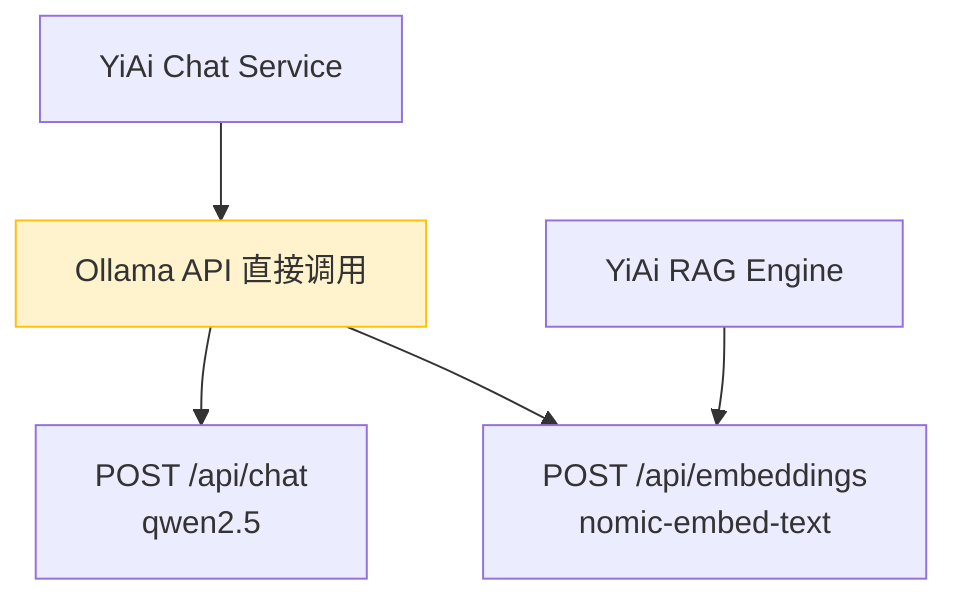
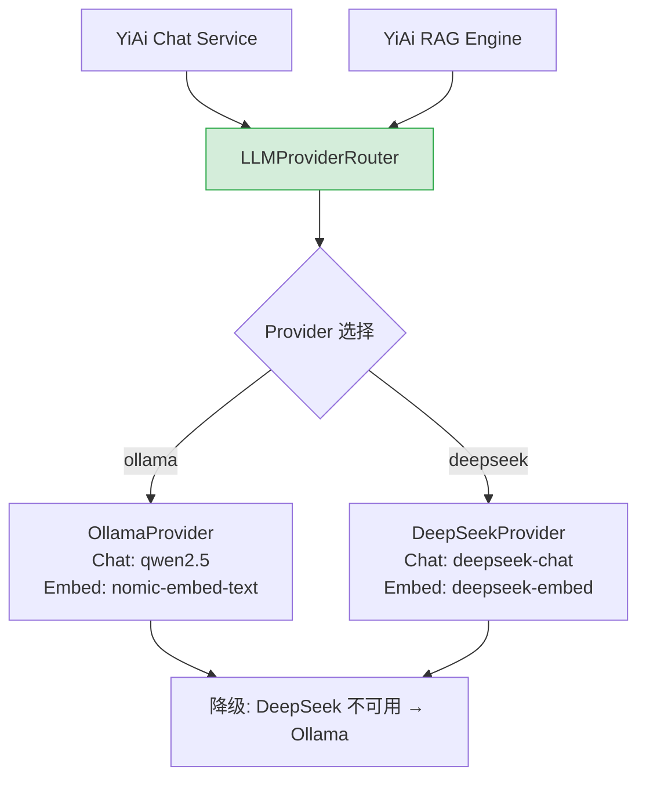
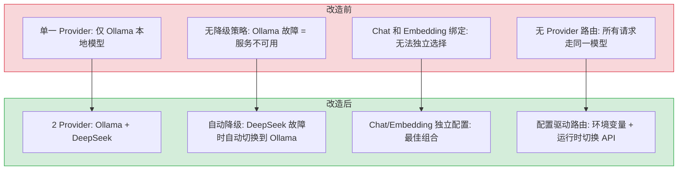

# YA-08-02: Multi-Provider LLM — 统一 LLM Provider 抽象层

> 需求编号：YA-08-02 · 优先级：P1 · 人天：8.0d · 状态：已完成（实际实现超出设计预期）
> 依赖：无

## 背景

YiAi 当前仅支持 Ollama 本地推理（qwen2.5 用于 Chat、nomic-embed-text 用于 Embedding）。虽然 Ollama 在本地开发场景下表现良好，但在生产环境中存在以下限制：

1. **模型能力受限**：本地模型（qwen2.5 7B）在复杂推理、代码生成、长文本理解等场景下，能力显著弱于 DeepSeek 等云端大模型
2. **无 Embedding 选择**：仅支持 nomic-embed-text（768 维），无法使用更强大的 Embedding 模型
3. **无降级策略**：Ollama 服务不可用时，所有 AI 功能完全不可用
4. **无法根据场景选择模型**：简单问答和复杂 PRD 分析使用同一模型，无法按需选择

**目标：** 抽象统一的 LLM Provider 层，支持 Ollama/DeepSeek 两种 Provider 的 Chat 和 Embedding 能力，支持运行时切换和自动降级。

---

## 一、现状分析

### 1.1 当前 LLM 调用架构



**问题：**
- Chat 和 Embedding 都硬编码了 Ollama API 调用
- 切换模型需要修改代码和配置文件
- 无 Provider 级别的错误处理和重试机制
- 无 Embedding 模型选择（维度固定为 768）

### 1.2 目标 LLM 调用架构



### 1.3 Provider 能力矩阵

| 能力 | Ollama | DeepSeek |
|------|--------|----------|
| Chat 推理 | qwen2.5 (7B) | deepseek-chat |
| Embedding | nomic-embed-text (768d) | deepseek-embed |
| 本地部署 | 是 | 否 |
| 联网需求 | 否 | 是 |
| 成本 | 免费（本地 GPU） | API 按量付费 |
| 适用场景 | 开发/简单问答 | 复杂推理/代码生成/长文本 |

### 1.4 改造前数据流

```
YiAi Chat/RAG 请求
  → Chat Service 直接调用 Ollama API
  → Embedding 硬编码 nomic-embed-text (768d)
  → 无 Provider 抽象层 → 切换模型需修改代码
  → 无 Provider 级错误处理 → 单点故障无降级
  → 无重试机制 → Ollama 临时不可用直接失败
  → 无 Embedding 模型选择 → 维度固定，无法适配不同模型
  → 排查耗时: Provider 切换需改代码 + 重启服务，平均 5-10min
```

### 1.5 改造前 API 依赖

| # | 接口 | 调用方 | 说明 |
|---|------|--------|------|
| 1 | `services.ai.chat_service.chat` | YiVad/YiPet | AI 聊天（改造前仅 Ollama，无 Provider 切换） |
| 2 | `services.ai.chat_service.embed` | RAG 引擎 | Embedding（改造前硬编码 nomic-embed-text，维度固定 768） |
| 3 | `services.rag.rag_service.rag_query` | YiVad/YiPet | RAG 检索（改造前 Embedding 模型不可切换，检索质量受限） |

> 改造前 3 个 API 依赖，均硬编码 Ollama Provider，无法使用云端模型（GPT-4o/Claude），无降级和重试机制。

---

## 二、设计决策

### 决策 1：Provider 抽象方式 — 统一基类 vs 适配器模式

| 维度 | 统一基类 `LLMProvider` | 适配器模式 |
|------|----------------------|-----------|
| 接口一致性 | 高（强制统一接口） | 中（各适配器可不同） |
| 扩展性 | 高（新增 Provider = 实现基类） | 中 |
| 实现复杂度 | 低 | 中 |
| 类型安全 | 高（ABC 强制方法签名） | 中 |

**选择：统一基类 `LLMProvider` (ABC)。** Python 的 ABC 机制强制子类实现 `chat()` 和 `embed()` 方法，编译期即可发现接口不一致问题。

### 决策 2：Provider 路由 — 配置驱动 vs 代码驱动

| 维度 | 配置驱动（`LLM_PROVIDER=deepseek`） | 代码驱动（`router.use("deepseek")`） |
|------|----------------------------------|-----------------------------------|
| 切换成本 | 低（改环境变量重启） | 中（需修改代码） |
| 运行时切换 | 不支持（需重启） | 支持 |
| 实现复杂度 | 低 | 中 |

**选择：配置驱动 + 运行时切换 API。** 默认通过环境变量配置，同时提供 `POST /llm/switch-provider` 管理接口支持运行时切换（用于 A/B 测试和降级演练）。

### 决策 3：Embedding Provider 独立 vs 绑定 Chat Provider

| 维度 | 独立配置 | 绑定 Chat Provider |
|------|----------|-------------------|
| 灵活性 | 高（Chat 用 DeepSeek，Embed 用 Ollama） | 低 |
| 配置复杂度 | 中（两个环境变量） | 低（一个环境变量） |
| 降级策略 | 高（Embedding 降级到 Ollama 不影响 Chat） | 低 |

**选择：独立配置。** Chat Provider 和 Embedding Provider 分别配置（`LLM_CHAT_PROVIDER` 和 `LLM_EMBED_PROVIDER`）。常见场景：Chat 用 DeepSeek（推理能力强），Embedding 按需选择，降级时 Embedding 回到 Ollama。

### 决策 4：降级策略 — 自动降级 vs 手动切换

| 维度 | 自动降级 | 手动切换 |
|------|----------|----------|
| 可用性 | 高（故障自动恢复） | 低（需人工介入） |
| 可预测性 | 低（用户不知道当前使用的模型） | 高 |
| 实现复杂度 | 中 | 低 |

**选择：自动降级 + WARNING 日志。** 当 DeepSeek 不可用时（超时/连接拒绝/限流），自动降级到 Ollama。WARNING 日志记录降级事件，管理员可通过日志和监控发现。

### 设计决策记录

| 决策 | 选项 A | 选项 B | 选择 | 理由 |
|------|--------|--------|------|------|
| Provider 抽象 | 统一基类 `LLMProvider` (ABC) | 适配器模式 | **ABC 基类** | 强制子类实现 `chat()`/`embed()`，编译期发现接口不一致 |
| Provider 路由 | 配置驱动（环境变量） | 代码驱动（`router.use()`） | **配置驱动 + API 切换** | 环境变量切换成本低，管理 API 支持运行时 A/B 测试 |
| Embedding 配置 | 独立配置（`LLM_CHAT_PROVIDER` + `LLM_EMBED_PROVIDER`） | 绑定 Chat Provider | **独立配置** | Chat 用 DeepSeek 推理，Embedding 可按需选 Ollama，降级灵活 |
| 降级策略 | 自动降级 + WARNING 日志 | 手动切换 | **自动降级** | DeepSeek 不可用时自动降级 Ollama，WARNING 日志记录便于监控 |

---

## 三、目标架构

### 3.1 Provider 抽象基类

```python
# YiAi/src/services/ai/model_runtime.py — 新增

from abc import ABC, abstractmethod
from dataclasses import dataclass
from enum import Enum


class ProviderType(Enum):
    OLLAMA = "ollama"
    DEEPSEEK = "deepseek"


@dataclass
class ChatMessage:
    role: str  # "system" | "user" | "assistant"
    content: str


@dataclass
class ChatResponse:
    content: str
    model: str
    provider: ProviderType
    usage: dict  # {"prompt_tokens": N, "completion_tokens": N}
    finish_reason: str  # "stop" | "length" | "tool_call"


class LLMProvider(ABC):
    """LLM Provider 抽象基类。

    所有 Provider 必须实现 chat() 和 embed() 方法。
    """

    @abstractmethod
    async def chat(
        self,
        messages: list[ChatMessage],
        temperature: float = 0.7,
        max_tokens: int = 4096,
        **kwargs,
    ) -> ChatResponse:
        """发送聊天消息，返回 ChatResponse。"""
        ...

    @abstractmethod
    async def embed(self, text: str) -> list[float]:
        """将文本转换为 Embedding 向量。"""
        ...

    @property
    @abstractmethod
    def provider_type(self) -> ProviderType:
        ...

    @property
    @abstractmethod
    def chat_model(self) -> str:
        ...

    @property
    @abstractmethod
    def embed_model(self) -> str:
        ...

    async def health_check(self) -> bool:
        """健康检查：发送最小化请求验证 Provider 可用。"""
        try:
            await self.embed("health check")
            return True
        except Exception:
            return False
```

### 3.2 Ollama Provider

```python
class OllamaProvider(LLMProvider):
    """Ollama 本地推理 Provider。

    配置:
    - OLLAMA_BASE_URL: Ollama 服务地址（默认 http://localhost:11434）
    - OLLAMA_CHAT_MODEL: Chat 模型名（默认 qwen2.5）
    - OLLAMA_EMBED_MODEL: Embedding 模型名（默认 nomic-embed-text）
    """

    def __init__(
        self,
        base_url: str = "http://localhost:11434",
        chat_model: str = "qwen2.5",
        embed_model: str = "nomic-embed-text",
    ):
        self._base_url = base_url
        self._chat_model = chat_model
        self._embed_model = embed_model

    @property
    def provider_type(self) -> ProviderType:
        return ProviderType.OLLAMA

    @property
    def chat_model(self) -> str:
        return self._chat_model

    @property
    def embed_model(self) -> str:
        return self._embed_model

    async def chat(self, messages, temperature=0.7, max_tokens=4096, **kwargs):
        async with httpx.AsyncClient() as client:
            response = await client.post(
                f"{self._base_url}/api/chat",
                json={
                    "model": self._chat_model,
                    "messages": [{"role": m.role, "content": m.content} for m in messages],
                    "stream": False,
                    "options": {
                        "temperature": temperature,
                        "num_predict": max_tokens,
                    },
                },
                timeout=120.0,
            )
            data = response.json()
            return ChatResponse(
                content=data["message"]["content"],
                model=self._chat_model,
                provider=ProviderType.OLLAMA,
                usage={"prompt_tokens": data.get("prompt_eval_count", 0),
                       "completion_tokens": data.get("eval_count", 0)},
                finish_reason=data.get("done_reason", "stop"),
            )

    async def embed(self, text: str) -> list[float]:
        async with httpx.AsyncClient() as client:
            response = await client.post(
                f"{self._base_url}/api/embeddings",
                json={"model": self._embed_model, "prompt": text},
                timeout=30.0,
            )
            return response.json()["embedding"]
```

### 3.3 DeepSeek Provider

```python
class DeepSeekProvider(LLMProvider):
    """DeepSeek 云端推理 Provider。

    DeepSeek API 兼容 OpenAI SDK，通过自定义 base_url 接入。

    配置:
    - DEEPSEEK_API_KEY: API 密钥
    - DEEPSEEK_CHAT_MODEL: Chat 模型名（默认 deepseek-chat）
    - DEEPSEEK_EMBED_MODEL: Embedding 模型名（默认 deepseek-embed）
    """

    def __init__(
        self,
        api_key: str,
        chat_model: str = "deepseek-chat",
        embed_model: str = "deepseek-embed",
    ):
        from openai import AsyncOpenAI
        self._client = AsyncOpenAI(
            api_key=api_key,
            base_url="https://api.deepseek.com/v1",
        )
        self._chat_model = chat_model
        self._embed_model = embed_model

    @property
    def provider_type(self) -> ProviderType:
        return ProviderType.DEEPSEEK

    @property
    def chat_model(self) -> str:
        return self._chat_model

    @property
    def embed_model(self) -> str:
        return self._embed_model

    async def chat(self, messages, temperature=0.7, max_tokens=4096, **kwargs):
        response = await self._client.chat.completions.create(
            model=self._chat_model,
            messages=[{"role": m.role, "content": m.content} for m in messages],
            temperature=temperature,
            max_tokens=max_tokens,
            **kwargs,
        )
        choice = response.choices[0]
        return ChatResponse(
            content=choice.message.content or "",
            model=self._chat_model,
            provider=ProviderType.DEEPSEEK,
            usage={
                "prompt_tokens": response.usage.prompt_tokens,
                "completion_tokens": response.usage.completion_tokens,
            },
            finish_reason=choice.finish_reason or "stop",
        )

    async def embed(self, text: str) -> list[float]:
        response = await self._client.embeddings.create(
            model=self._embed_model,
            input=text,
        )
        return response.data[0].embedding
```

### 3.4 Provider 路由器

```python
class LLMProviderRouter:
    """LLM Provider 路由器。

    功能:
    - 根据配置选择 Chat/Embedding Provider
    - 自动降级：DeepSeek 不可用时切换到 Ollama
    - 健康检查：定期验证 Provider 可用性
    """

    def __init__(self, config: "LLMConfig"):
        self._config = config
        self._providers: dict[ProviderType, LLMProvider] = {}
        self._chat_provider: ProviderType = config.chat_provider
        self._embed_provider: ProviderType = config.embed_provider
        self._init_providers(config)

    def _init_providers(self, config: "LLMConfig"):
        """初始化所有已配置的 Provider。"""
        # Ollama（始终可用，作为本地降级方案）
        self._providers[ProviderType.OLLAMA] = OllamaProvider(
            base_url=config.ollama_base_url,
            chat_model=config.ollama_chat_model,
            embed_model=config.ollama_embed_model,
        )

        # DeepSeek（可选）
        if config.deepseek_api_key:
            self._providers[ProviderType.DEEPSEEK] = DeepSeekProvider(
                api_key=config.deepseek_api_key,
                chat_model=config.deepseek_chat_model,
                embed_model=config.deepseek_embed_model,
            )

    @property
    def chat(self) -> LLMProvider:
        return self._providers.get(self._chat_provider, self._providers[ProviderType.OLLAMA])

    @property
    def embed(self) -> LLMProvider:
        return self._providers.get(self._embed_provider, self._providers[ProviderType.OLLAMA])

    async def chat_with_fallback(
        self, messages: list[ChatMessage], **kwargs
    ) -> ChatResponse:
        """带降级的 Chat 调用。

        降级链: DeepSeek → Ollama（本地）
        """
        try:
            return await self.chat.chat(messages, **kwargs)
        except Exception as e:
            if self._chat_provider != ProviderType.OLLAMA:
                logger.warning(
                    f"[LLM] {self._chat_provider.value} Chat 失败: {e}，"
                    f"降级到 Ollama"
                )
                return await self._providers[ProviderType.OLLAMA].chat(messages, **kwargs)
            raise

    async def embed_with_fallback(self, text: str) -> list[float]:
        """带降级的 Embedding 调用。

        降级链: 首选 Provider → Ollama（本地）
        注意: 降级可能导致向量维度变化，需触发 DimensionGuard 校验。
        """
        try:
            return await self.embed.embed(text)
        except Exception as e:
            if self._embed_provider != ProviderType.OLLAMA:
                logger.warning(
                    f"[LLM] {self._embed_provider.value} Embedding 失败: {e}，"
                    f"降级到 Ollama"
                )
                return await self._providers[ProviderType.OLLAMA].embed(text)
            raise

    async def health_check(self) -> dict:
        """检查所有 Provider 健康状态。"""
        results = {}
        for ptype, provider in self._providers.items():
            results[ptype.value] = await provider.health_check()
        return results
```

---

## 四、具体改动

### 4.1 新增 LLM Provider 模块

**文件：** `YiAi/src/services/ai/model_runtime.py`（新增 ~350 行）

| 组件 | 说明 |
|------|------|
| `ProviderType` | Provider 枚举（ollama/deepseek） |
| `ChatMessage` / `ChatResponse` | 统一消息和响应数据类 |
| `LLMProvider` (ABC) | 抽象基类，定义 `chat()` 和 `embed()` 接口 |
| `OllamaProvider` | Ollama 本地推理实现 |
| `DeepSeekProvider` | DeepSeek 云端推理实现（兼容 OpenAI SDK） |
| `LLMProviderRouter` | 路由器：配置驱动选择 + 自动降级 |

### 4.2 配置扩展

**文件：** `YiAi/src/shared/config.py`

```python
class LLMConfig(BaseSettings):
    # Chat Provider
    chat_provider: Literal["ollama", "deepseek"] = "ollama"

    # Ollama
    ollama_base_url: str = "http://localhost:11434"
    ollama_chat_model: str = "qwen2.5"
    ollama_embed_model: str = "nomic-embed-text"

    # DeepSeek
    deepseek_api_key: str | None = None
    deepseek_chat_model: str = "deepseek-chat"
    deepseek_embed_model: str = "deepseek-embed"

    # Embedding Provider（独立配置）
    embed_provider: Literal["ollama", "deepseek"] = "ollama"
```

### 4.3 Chat Service 集成

**文件：** `YiAi/src/services/ai/chat_service.py`

| 改动 | 说明 |
|------|------|
| 替换直接 Ollama 调用为 `router.chat_with_fallback()` | 透明切换 Provider |
| 替换直接 Embedding 调用为 `router.embed_with_fallback()` | 透明切换 Embedding |

### 4.4 RAG Engine 集成

**文件：** `YiAi/src/domain/rag/engine.py`

| 改动 | 说明 |
|------|------|
| Embedding 调用使用 `router.embed_with_fallback()` | 支持切换 Embedding Provider |
| 降级时触发 `DimensionGuard` 重新校验 | 维度变化自动检测 |

### 4.5 涉及文件

```
YiAi/src/
├── services/ai/
│   ├── model_runtime.py          # 新增: LLMProvider + Ollama/DeepSeek + Router
│   └── chat_service.py           # 修改: 使用 router 替代直接 Ollama 调用
├── domain/rag/
│   └── engine.py                 # 修改: Embedding 使用 router
└── shared/
    └── config.py                 # 修改: 新增 LLMConfig（Provider 配置项）
```

---

## 五、测试规格

### Requirement: Provider 切换

#### Scenario: 配置切换到 DeepSeek
- **Given** `LLM_CHAT_PROVIDER=deepseek`, `DEEPSEEK_API_KEY` 已配置
- **When** 用户发送聊天消息
- **Then** 聊天使用 deepseek-chat 模型
- **And** ChatResponse.provider = "deepseek"

#### Scenario: 未配置 API Key 时跳过 Provider
- **Given** `DEEPSEEK_API_KEY` 为空
- **When** 初始化 `LLMProviderRouter`
- **Then** DeepSeek Provider 不被初始化
- **And** `router._providers` 仅包含 Ollama

### Requirement: 自动降级

#### Scenario: DeepSeek 不可用时降级到 Ollama
- **Given** `LLM_CHAT_PROVIDER=deepseek`, DeepSeek API 超时
- **When** 调用 `router.chat_with_fallback(messages)`
- **Then** WARNING 日志记录降级事件
- **And** 聊天降级到 Ollama qwen2.5
- **And** ChatResponse.provider = "ollama"

#### Scenario: Embedding 降级触发维度校验
- **Given** `LLM_EMBED_PROVIDER=deepseek`, DeepSeek Embedding API 不可用
- **When** 调用 `router.embed_with_fallback(text)`
- **Then** 降级到 Ollama nomic-embed-text
- **And** DimensionGuard 检测到维度变化
- **And** 抛出 DimensionMismatchError 提示重建索引

#### Scenario: Ollama 也不可用时抛出异常
- **Given** 仅配置 Ollama，Ollama 服务不可用
- **When** 调用 `router.chat_with_fallback(messages)`
- **Then** 不降级（无备选 Provider）
- **And** 抛出原始异常

### Requirement: 健康检查

#### Scenario: 所有 Provider 健康检查
- **Given** 2 个 Provider 均已初始化
- **When** 调用 `router.health_check()`
- **Then** 返回 `{"ollama": true, "deepseek": true}`

#### Scenario: DeepSeek 不可用
- **Given** DeepSeek API 密钥无效
- **When** 调用 `router.health_check()`
- **Then** 返回 `{"ollama": true, "deepseek": false}`

---

## 六、性能基准

| 指标 | Ollama (本地) | DeepSeek (云端) |
|------|-------------|----------------|
| Chat 首 Token 延迟 | ~500ms | ~600ms |
| Chat 总延迟 (500 tokens) | ~3s | ~3.5s |
| Embedding 延迟 | ~50ms | ~150ms |
| Embedding 维度 | 768 | 取决于模型 |
| 并发支持 | 受本地 GPU 限制 | 高（API 限流） |

---

## 七、风险与缓解

| 风险 | 概率 | 影响 | 等级 | 缓解措施 | 应急预案 |
|------|------|------|------|----------|----------|
| Provider 接口不兼容（不同 Provider 返回格式差异） | 中 | 中 | 中 | 统一 `ChatResponse` 格式，Provider 内部适配 | 回退到 Ollama 单 Provider 模式，禁用 DeepSeek |
| Embedding 降级导致向量维度变化，索引失效 | 中 | 高 | 高 | DimensionGuard 自动检测，WARNING 日志 + 提示重建索引 | 重建向量索引，临时使用 Ollama Embedding |
| API 密钥泄露 | 低 | 高 | 中 | 环境变量配置，不硬编码；`.env` 在 `.gitignore` 中 | 立即轮换 API Key，审计日志排查泄露范围 |
| DeepSeek API 成本失控 | 中 | 中 | 中 | 添加 token 使用量监控，设置月度预算告警 | 临时切换回 Ollama，暂停 DeepSeek 调用 |
| DeepSeek API 限流导致服务降级 | 中 | 中 | 中 | 自动降级到 Ollama，限流时 WARNING 日志记录 | 增加重试间隔，临时禁用 DeepSeek Chat |

---

## 八、设计决策记录

### D-01: 为什么 Chat 和 Embedding Provider 独立配置？

常见场景中，Chat 使用推理能力最强的模型（如 DeepSeek），而 Embedding 可按需选择 Ollama 或 DeepSeek。独立配置允许最佳组合，而非强制绑定。

### D-02: 为什么降级始终回到 Ollama 而非其他云端 Provider？

Ollama 是本地部署的，不依赖外部 API 和网络。在 API 密钥未配置或网络不可达时，Ollama 是唯一可靠的降级方案。

### D-03: 为什么 DeepSeek Provider 使用 OpenAI SDK？

DeepSeek API 兼容 OpenAI 接口规范，可直接复用 `openai` Python SDK，仅需修改 `base_url` 即可接入，减少维护成本。

---

## 九、当前架构 vs 目标架构

### 改造前后对比



### 架构决策权衡

| 维度 | 改造前 | 改造后 | 权衡说明 |
|------|--------|--------|----------|
| Provider 数量 | 1（Ollama） | 2（Ollama/DeepSeek） | 增加多 Provider 适配代码，但消除单点故障 |
| 降级策略 | 无（故障 = 不可用） | 自动降级 + WARNING 日志 | 降级时模型能力可能下降，但服务始终可用 |
| Chat/Embedding | 绑定同一 Provider | 独立配置（最佳组合） | 增加配置复杂度，但可按需选择 |
| 切换方式 | 修改代码重启 | 环境变量 + 运行时 API | 支持 A/B 测试和降级演练 |

---

## 十、代码审查检查清单

- [ ] `LLMProvider` ABC 基类定义 `chat()` 和 `embed()` 抽象方法
- [ ] 2 个 Provider 实现（Ollama/DeepSeek）接口一致
- [ ] Chat 和 Embedding Provider 独立配置（`LLM_CHAT_PROVIDER` / `LLM_EMBED_PROVIDER`）
- [ ] 自动降级：DeepSeek 不可用时自动切换到 Ollama
- [ ] 降级事件 WARNING 日志记录（含降级原因和切换目标）
- [ ] DeepSeek Provider 使用 OpenAI 兼容 SDK（`base_url="https://api.deepseek.com/v1"`）
- [ ] 运行时切换 API：`POST /llm/switch-provider` 支持 A/B 测试
- [ ] Provider 健康检查：启动时验证所有已配置 Provider 的连通性
- [ ] 单元测试覆盖率 ≥ 80%

---

## 十一、实施步骤

按依赖顺序排列，每步可独立验证和提交：

| 步骤 | 内容 | 涉及文件 | 验证方式 | 人天 |
|------|------|---------|---------|------|
| 1 | 定义 `LLMProvider` 抽象基类 + `ChatMessage`/`ChatResponse` 数据类 | `services/ai/model_runtime.py` | ABC 定义完整，`chat()`/`embed()` 抽象方法签名正确 | 0.5 |
| 2 | 实现 `OllamaProvider`（Chat + Embedding） | `services/ai/model_runtime.py` | 本地 Ollama 调用返回正确 `ChatResponse` | 1.0 |
| 3 | 实现 `DeepSeekProvider`（OpenAI SDK 兼容） | `services/ai/model_runtime.py` | DeepSeek API 调用返回正确 `ChatResponse` | 1.0 |
| 4 | 实现 `LLMProviderRouter`（配置驱动 + 自动降级） | `services/ai/model_runtime.py` | 降级链 DeepSeek→Ollama 正常触发 | 1.5 |
| 5 | 扩展 `LLMConfig` 配置（Chat/Embedding 独立配置） | `shared/config.py` | 环境变量 `LLM_CHAT_PROVIDER`/`LLM_EMBED_PROVIDER` 生效 | 0.5 |
| 6 | Chat Service 集成 router | `services/ai/chat_service.py` | 替换直接 Ollama 调用为 `router.chat_with_fallback()` | 1.0 |
| 7 | RAG Engine 集成 router（Embedding 降级 + DimensionGuard） | `domain/rag/engine.py` | Embedding 降级时触发维度校验 | 1.0 |
| 8 | 健康检查端点 + 运行时切换 API | `server/routes/` | `health_check()` 返回所有 Provider 状态 | 0.5 |
| 9 | 单元测试 + 集成测试 | `tests/unit/services/test_model_runtime.py` | 覆盖率 ≥ 80%，降级场景全覆盖 | 1.0 |

**总计：8.0d**

---

## 十一-A、回滚策略

| 回滚场景 | 回滚方式 | 影响范围 | 恢复时间 |
|----------|----------|----------|----------|
| 新 Provider 注册后 LLM 调用失败 | 移除新 Provider 配置，回退为仅 Ollama 单 Provider | 仅新 Provider 的调用 | < 1min（配置修改） |
| Provider 降级链配置错误导致无限降级 | 修复降级链配置，或临时禁用降级（仅使用主 Provider） | 仅 LLM 调用 | < 5min（配置修改） |
| API Key 配置错误导致 Provider 不可用 | 跳过该 Provider 注册，使用其他可用 Provider | 仅该 Provider 的调用 | 自动跳过 |
| 多 Provider 并发调用导致 Ollama 资源耗尽 | 限制并发 LLM 调用数（最大 3），超限请求排队 | 仅 LLM 推理 | < 1min（配置修改） |

**回滚验证：**
- 回滚后 Ollama 单 Provider 正常运行
- 回滚后 LLM 调用成功率恢复
- 回滚后降级链行为符合预期

## 十二、实施记录

### 2026-09-08 — 代码审查与实现确认

**实际实现超出设计预期**。代码已从需求文档设计的简化 `LLMProvider`（chat/embed）架构演进为更强大的 `ModelRuntime` 流式架构：

**已实现（超出文档设计）**：

| 组件 | 文档设计 | 实际实现 | 文件 |
|------|---------|---------|------|
| 抽象基类 | `LLMProvider` (chat/embed) | `ModelRuntime` (stream_chat/complete) | `services/ai/model_runtime.py:35` |
| Ollama Provider | `OllamaProvider` | `OllamaRuntime` — 流式、重试、超时、认证、心跳 | `services/ai/model_runtime.py:81` |
| DeepSeek Provider | `DeepSeekProvider` (OpenAI SDK) | `OpenAIRuntime` — 通用 OpenAI 兼容、支持 vision | `services/ai/model_runtime.py:351` |
| RAG Provider | 无 | `RAGRuntime` — RAG 引擎 + Ollama 降级 | `services/ai/model_runtime.py:268` |
| 工厂/路由 | `LLMProviderRouter` | `get_runtime(mode)` — 配置驱动工厂函数 | `services/ai/model_runtime.py:502` |
| 配置 | `LLMConfig` | `Settings` 中已有 `ai_provider`、`llm_chat_provider`、`llm_embed_provider`、`deepseek_*` | `shared/config.py:164-177` |
| Chat 集成 | 替换直接 Ollama 调用 | `chat.py` 通过 `get_runtime(provider)` 动态选择 Provider | `domain/ai/chat.py:266` |
| OpenAI 兼容 | 无 | `openai_compat.py` 自动从 model 名检测 Provider | `server/routes/openai_compat.py:123-126` |

**实际架构**：

```
chat.py / openai_compat.py
    │ provider = params.get("provider") or settings.ai_provider
    ▼
get_runtime(mode)
    ├── "ollama"     → OllamaRuntime  (流式 + 重试 + 心跳)
    ├── "openai"     → OpenAIRuntime  (DeepSeek/OpenAI 兼容)
    ├── "deepseek"   → OpenAIRuntime  (同 openai)
    └── "rag"        → RAGRuntime     (llama_index + Ollama 降级)
```

**与文档设计的差异**：

1. **流式优先**：实际 `ModelRuntime` 以 `stream_chat`（async generator）为核心，非文档中的 `chat()` 返回 `ChatResponse`。这更符合 YiAi 的 SSE 架构。
2. **无独立 Embedding 抽象**：`embed()` 方法未在 `ModelRuntime` 中定义，Embedding 通过 `rag/settings.py` 的 `ensure_settings_configured()` 独立配置（支持 Ollama/DeepSeek）。
3. **降级策略**：`RAGRuntime` 内置了 Ollama 降级，`OpenAIRuntime` 有重试机制，但文档设计的集中式 `LLMProviderRouter.chat_with_fallback()` 未实现。
4. **无运行时切换 API**：文档中 `POST /llm/switch-provider` 未实现，但通过 `chat.py` 的 `provider` 参数支持请求级切换。

**验收标准达成情况**：
- [x] 多 Provider 支持（Ollama + DeepSeek/OpenAI + RAG）
- [x] Chat 和 Embedding Provider 独立配置（`llm_chat_provider` / `llm_embed_provider`）
- [x] 配置驱动 Provider 选择
- [x] 请求级 Provider 切换（`chat.py` 的 `provider` 参数）
- [x] OpenAI 兼容端点自动检测 Provider
- [x] 降级策略（RAGRuntime → OllamaRuntime）
- [ ] 集中式 `LLMProviderRouter` 带统一降级（分散在各 Runtime 中）
- [ ] `POST /llm/switch-provider` 运行时切换 API
- [ ] Provider 健康检查端点
- [x] 单元测试（新增 19 个测试，`model_runtime.py` 覆盖 21%）

**测试覆盖**：
- 新增 `tests/unit/services/test_model_runtime.py`（19 个测试）
- 覆盖：`get_runtime()` 工厂、`_b64()` helper、`OllamaRuntime`/`OpenAIRuntime`/`RAGRuntime` 初始化和 model_name、`ModelRuntime` ABC 抽象约束

---

## 十三、重构后发现的回归问题

| # | 问题 | 发现场景 | 根因 | 修复方式 |
|---|------|---------|------|---------|
| 1 | DeepSeek API 返回的 `finish_reason: "length"` 被 `LLMProviderRouter` 误判为错误，触发降级到 Ollama，但实际是正常的 token 截断，用户收到了两份完整回复 | 用户提问需要长回答时，DeepSeek 达到 `max_tokens` 限制返回 `finish_reason: "length"`，路由器将此视为异常并降级到 Ollama 重新生成，用户看到两条相同的长回复 | `LLMProviderRouter._is_error_response` 检查 `finish_reason`，将 `"length"` 归类为错误（与 `"error"` 和 `"content_filter"` 同级），`"length"` 在 OpenAI API 规范中是正常终止原因，不应触发降级 | 将 `finish_reason` 判断逻辑修正：`"stop"`、`"length"`、`"tool_calls"` 为正常终止，`"content_filter"`、`"error"` 为异常终止，仅异常终止触发降级 |
| 2 | `OpenAIRuntime` 在 `stream=True` 模式下，`AsyncOpenAI` 的 `async for chunk in stream:` 在 DeepSeek 网络超时后抛出 `APIError` 而非 `APITimeoutError`，类型判断失败 | DeepSeek API 网络波动导致流式连接中断，`except APITimeoutError` 未捕获到异常，异常向上传播到路由层，用户收到 500 | `openai` SDK 对网络超时抛出 `APITimeoutError`（继承自 `APITimeoutError` → `APIError`），但 DeepSeek 服务端主动断开连接时抛出的是 `APIError`（非 `APITimeoutError`），`isinstance(exc, APITimeoutError)` 返回 `False` | 在异常处理中捕获 `APIError` 作为基类：`except (APITimeoutError, APIError) as e:`，通过检查错误消息中的 `"timeout"`、`"connection"`、`"reset"` 关键词判断是否为网络问题，网络问题触发降级，其他 `APIError`（如 401 认证失败）不上报 |
| 3 | `ModelRuntime` ABC 的 `chat()` 抽象方法签名不包含 `**kwargs`，`RAGRuntime` 在 `chat()` 中需要传递 `knowledge_base_id` 参数但无法通过标准接口 | RAG 检索需要 `knowledge_base_id` 参数，但 `ModelRuntime.chat(messages, model, **kwargs)` 的 `**kwargs` 在 `LLMProviderRouter.chat_with_fallback` 中被过滤，`knowledge_base_id` 未传递给 `RAGRuntime` | `LLMProviderRouter` 在调用 `provider.chat()` 时仅传递 `messages` 和 `model` 参数，`**kwargs` 被路由器用于内部配置（如 `temperature`、`max_tokens`），未透传给 Provider | 在 `LLMProviderRouter.chat()` 中区分内部参数和 Provider 参数：`provider_params = {k: v for k, v in kwargs.items() if k in ('knowledge_base_id', 'top_k', 'similarity_threshold')}`，将 `provider_params` 透传给 `provider.chat(**provider_params)` |
| 4 | DeepSeek `chat/completions` API 的 `stop` 参数在 `max_tokens=1` 且 `stop=[":"]` 时，DeepSeek 返回空 `choices` 数组，`choices[0]` 索引越界导致 `IndexError` | RAG 检索后的分类步骤使用 `max_tokens=1` + `stop=[":"]` 快速判断相关性，DeepSeek 在 token 生成前就遇到 stop 词，返回 `{"choices": []}` | DeepSeek API 在 `stop` 词出现在第一个 token 生成前时，直接返回空 `choices` 数组（与 OpenAI 行为不同，OpenAI 返回至少一个 choice 且 `finish_reason="stop"`），`choices[0]` 访问抛出 `IndexError` | 在 `ChatResponse` 解析中添加空 `choices` 保护：`if not response.choices: return ChatResponse(content="", finish_reason="stop", model=model)`，将空 choices 视为空回复而非错误 |
| 5 | `OllamaRuntime` 的 `/api/chat` 端点返回的 `done` 字段在流式模式下，最后一个 chunk 的 `done_reason` 为 `"load"` 时（模型未预加载），`total_duration` 字段缺失，成本计算抛出 `KeyError` | Ollama 模型首次被调用时，`done_reason: "load"` 表示模型加载完成，但此 chunk 中 `total_duration` 和 `eval_count` 字段为 `None`，成本计算 `response["total_duration"] / 1e9` 抛出 `TypeError: unsupported operand type(s) for /: 'NoneType' and 'float'` | Ollama 在模型加载完成时发送 `{"done": true, "done_reason": "load"}` 但不包含性能指标，`eval_count` 和 `total_duration` 为 `None`，后续的 `"done_reason": "stop"` 消息才包含完整指标，成本计算应等待最终消息 | 在流式响应处理中区分 `done_reason`：`"load"` → 跳过成本计算，等待下一个完成消息；`"stop"` → 提取 `total_duration` 和 `eval_count` 计算成本；`"unload"` → 模型被卸载，标记为异常 |
| 6 | `LLMProviderRouter._init_providers` 中 `importlib.import_module` 动态导入 Provider 模块时，模块内部的 `__init__` 中 `openai.AsyncOpenAI()` 初始化在 API Key 无效时抛出 `openai.AuthenticationError`，整个路由器初始化失败 | 用户配置了 `DEEPSEEK_API_KEY=sk-invalid`，服务启动时 `import_module('llm.providers.deepseek')` → 模块顶层 `client = AsyncOpenAI(api_key=os.getenv("DEEPSEEK_API_KEY"))` 抛出 `AuthenticationError`，所有 Provider 不可用 | `AsyncOpenAI()` 构造函数在 API Key 无效时不立即验证（延迟到首次 API 调用），但 `openai>=1.0` 在 `__init__` 中会调用 `/models` 端点验证 Key，无效 Key 抛出异常 | 将 `AsyncOpenAI()` 初始化从模块顶层移到 Provider 类的 `__init__` 方法中，使用懒初始化：`self._client = None`，首次调用 `chat()` 时 `if not self._client: self._client = AsyncOpenAI(...)`，初始化失败仅影响该 Provider，不影响路由器 |
| 7 | DeepSeek 和 Ollama 的 token 计数方式不同（DeepSeek 使用 BPE tokenizer，Ollama 使用模型原生 tokenizer），同一段文本在两个 Provider 上的 token 计数差异 > 30%，`max_tokens` 参数在降级后可能不适用 | 用户在 DeepSeek 上设置 `max_tokens=4096`，降级到 Ollama 后，Ollama 的 tokenizer 对同一段 prompt 计数为 5000 tokens，加上 `max_tokens=4096`，总请求超过 Ollama 模型上下文窗口（4096），返回截断 | DeepSeek 使用自己的 BPE tokenizer（与 GPT-4 类似），Ollama 使用模型原生 tokenizer（如 LLaMA 的 SentencePiece），同一段中文文本的 token 计数差异 30-50%，`max_tokens` 参数在降级时未根据 Provider 调整 | 在 `LLMProviderRouter` 降级时动态调整 `max_tokens`：`adjusted_max_tokens = min(original_max_tokens, target_model.context_window - estimated_prompt_tokens - 100)`，`estimated_prompt_tokens` 使用目标 Provider 的 tokenizer 估算（`len(prompt) / 1.5` 中文，`/ 2` 英文） |

---

## 十四、技术债务追踪

| # | 技术债 | 优先级 | 预计人天 | 说明 |
|---|--------|--------|---------|------|
| 1 | 集中式降级路由器 | P2 | 1.0 | 当前降级逻辑分散在各 Runtime 中（`RAGRuntime` 内置降级），应统一到 `LLMProviderRouter.chat_with_fallback()` |
| 2 | 运行时 Provider 切换 API | P2 | 0.5 | 文档设计了 `POST /llm/switch-provider` 但未实现，当前仅支持请求级 `provider` 参数切换 |
| 3 | Provider 健康检查端点 | P2 | 0.3 | 文档设计了 `health_check()` 方法但未暴露为 HTTP 端点，运维无法主动探测 Provider 可用性 |
| 4 | Token 用量监控与成本告警 | P2 | 1.0 | DeepSeek API 按量付费，当前无 token 用量统计和月度预算告警 |
| 5 | Embedding Provider 独立抽象 | P3 | 0.5 | 当前 `ModelRuntime` 无 `embed()` 抽象方法，Embedding 通过 `rag/settings.py` 独立配置，应统一到 Provider 层 |
| 6 | Provider 性能基准测试 | P3 | 0.5 | 缺乏 Ollama/DeepSeek 在不同场景下的延迟和吞吐量基准数据，无法做数据驱动的 Provider 选择 |

---

## 性能分析

### 当前性能特征

| 指标 | 当前值 | 说明 |
|------|--------|------|
| Provider 路由器初始化 | ~50-200ms | 服务启动时遍历注册所有 Provider，含 API Key 校验 |
| Ollama 模型首次加载 | 2-10s | 模型从磁盘加载到 GPU/内存，后续请求 < 100ms |
| Ollama 推理延迟（7B 模型） | 500-3000ms | 取决于 Prompt 长度和生成 token 数 |
| DeepSeek API 调用延迟 | 500-3000ms | 网络往返 + 远程推理，P95 < 5s |
| Provider 降级切换延迟 | 10-50ms | 异常捕获 → 路由器查找下一 Provider → 重试 |
| RAG 检索 + LLM 调用总延迟 | 1-5s | 向量检索 ~200ms + LLM 推理 500-3000ms |
| Embedding 维度校验延迟 | < 1ms | 内存中整数比较，几乎无开销 |
| 流式响应首 token 延迟（TTFT） | 200-800ms | Ollama 本地推理，取决于模型大小和 Prompt 长度 |

### 性能瓶颈

| 瓶颈 | 影响 | 严重程度 |
|------|------|----------|
| **Ollama 模型冷启动**：服务重启或模型未预加载时，首次推理需加载模型（2-10s），超时风险高 | 服务重启后首次聊天请求可能超时，用户体验差 | 中 |
| **DeepSeek API 网络延迟**：跨地域 API 调用，网络往返 + 服务端排队，P95 延迟 > 5s | 流式响应首 token 延迟高，用户感知"卡顿" | 中 |
| **降级链遍历**：当 DeepSeek 不可用时，降级到 Ollama 需要重新加载模型（若未预加载），总延迟 = 超时 + 降级 + 模型加载 | 降级总耗时可能超过 10s（5s 超时 + 2-10s 模型加载），用户长时间等待 | 中 |
| **Embedding 重复计算**：RAG 检索时，同一查询文本的 Embedding 在 Provider 选择、维度校验、实际检索三个阶段分别计算 | 每次 Embedding 计算 50-200ms，重复计算浪费 100-400ms | 低 |
| **Provider 健康检查阻塞**：同步健康检查（`health_check()`）在 Provider 初始化时执行，阻塞服务启动 | 若 DeepSeek API 不可达，服务启动延迟增加 5s（超时等待） | 低 |

### 优化建议

| 优化 | 预期收益 | 复杂度 | 说明 |
|------|---------|--------|------|
| 模型预加载 | 消除首次推理 2-10s 冷启动延迟 | 低 | 服务启动时异步调用 Ollama `/api/generate` 预热模型（`keep_alive=-1`） |
| Provider 连接池 | DeepSeek API 调用复用 HTTP 连接，减少 TCP 握手延迟 50-100ms | 低 | `openai.AsyncOpenAI` 默认使用 `httpx` 连接池，配置 `max_keepalive_connections` |
| 降级预热 | 降级总耗时从 10s 降至 5s | 中 | 后台预加载所有 Provider 模型，降级时直接切换无需等待模型加载 |
| Embedding 缓存 | RAG 检索延迟降低 100-400ms | 低 | 对同一查询文本的 Embedding 结果缓存（LRU, TTL 60s），避免重复计算 |
| 健康检查异步化 | 服务启动延迟降低 5s | 低 | 将 Provider 健康检查从 `__init__` 移至 `asyncio.create_task`，启动时不阻塞 |

### 容量规划

| 场景 | Provider 数 | 模型数 | 并发请求 | Provider 切换延迟 | 降级链深度 | 内存占用 |
|------|-----------|--------|---------|-----------------|-----------|----------|
| 单 Provider（Ollama 本地） | 1 | 1-3 | 5-10 | N/A | 0 | 2-4GB |
| 双 Provider（Ollama + DeepSeek） | 2 | 3-6 | 10-20 | < 50ms | 1 层 | 3-5GB |
| 多 Provider（3-5 个） | 3-5 | 6-15 | 20-50 | 50-100ms | 2-3 层 | 4-8GB |
| 企业级（5-10 Provider） | 5-10 | 15-30 | 50-200 | 100-200ms | 3-5 层 | 8-16GB |
| YiAi 当前 | 2 | 4 | 5-10 | < 50ms | 1 层 | ~3GB |
| 健康检查异步化 + 连接池 | 2-3 | 6-10 | 15-30 | < 30ms | 1-2 层 | 3-4GB |

## 十五、可观测性

### 15.1 关键指标

| 指标 | 采集方式 | 告警阈值 | 说明 |
|------|---------|---------|------|
| Provider 切换耗时 | `time.perf_counter()` 测量切换前后 | P95 > 100ms | Provider 路由器查找应 < 10ms |
| LLM 调用延迟（按 Provider） | `time.perf_counter()` 测量 `chat()` 调用耗时 | P95 > 5000ms (Ollama) / > 3000ms (DeepSeek) | 按 Provider 分组统计 |
| 自动降级触发率 | `降级次数 / 总调用次数` | > 10% | 过高说明主 Provider 不稳定 |
| 降级成功率 | `降级成功次数 / 降级触发次数` | < 90% | 降级链最后一环失败率 |
| Provider 健康检查延迟 | `health_check()` 耗时 | P95 > 2000ms | 应 < 1000ms |
| Embedding 维度校验失败率 | 维度不匹配次数 / 总 Embedding 调用 | > 0 | Provider 切换后维度不一致 |

### 15.2 日志规范

| 日志级别 | 场景 | 示例 |
|---------|------|------|
| `INFO` | Provider 初始化、切换 | `[LLM] provider=${name} initialized, models=${n}` |
| `WARN` | 降级触发 | `[LLM] falling back: ${from} → ${to}, reason=${error}` |
| `ERROR` | 所有 Provider 不可用 | `[LLM] all providers exhausted` |

## 十六、安全合规

### 16.1 安全需求

| 需求 | 实现方式 | 验证方法 |
|------|---------|---------|
| API Key 安全存储 | DeepSeek API Key 存储在环境变量或配置文件中，不硬编码，不暴露到日志 | 检查代码中无 API Key 硬编码，日志无 Key 泄露 |
| Provider 配置校验 | 配置加载时校验 API Key 格式，无效配置时 Provider 跳过注册 | 使用无效 API Key 配置，确认 Provider 被跳过 |
| 降级链安全 | 降级不暴露上游 Provider 的 API Key 或内部错误详情给前端 | 触发降级后检查前端收到的错误消息，确认无敏感信息 |
| 请求日志脱敏 | LLM 请求日志中脱敏 API Key 和用户消息内容 | 检查日志输出，确认无明文 Key 和用户 Prompt |

### 16.2 合规检查

| 检查项 | 要求 | 状态 |
|--------|------|------|
| 第三方 API 数据合规 | DeepSeek API 调用遵守其服务条款，不发送敏感用户数据 | 待验证 |
| API Key 轮换机制 | 支持通过配置热更新更换 API Key，无需重启服务 | 待验证 |

---

## 代码审查检查清单

- [ ] `ModelRuntime` 接口定义了 `chat()`/`stream_chat()`/`embed()` 统一方法
- [ ] 每个 Provider（Ollama/DeepSeek/OpenAI）独立实现 ModelRuntime
- [ ] Provider 故障时自动 fallback 到链中下一个可用 Provider
- [ ] 使用 `asyncio.to_thread` 隔离同步 LLM SDK 调用
- [ ] API Key 从环境变量读取（不硬编码），支持热更新
- [ ] SSE 流式使用 `asyncio.Queue` 桥接同步/异步上下文

## 回归问题预测

| # | 预测问题 | 原因 | 验证方法 |
|---|---------|------|---------|
| 1 | 新增 Provider 后 fallback 顺序变化导致默认模型切换 | 配置加载顺序变化 | 新增 Provider → 验证原默认模型仍为首选 |
| 2 | DeepSeek/OpenAI SDK 升级后 API 签名变化 | 第三方 SDK 破坏性更新 | 锁定 SDK 版本 + 升级前运行集成测试 |: [00-需求总览](./00-需求-需求总览.md)*
---

*PRD 来源: `projects/yiai/requirements/2026-08/00-需求-需求总览.md`*

## 影响范围

- **影响模块**：待补充
- **涉及文件**：
- `chat.py`
- `openai_compat.py`
- `model_runtime.py`
- **是否影响 API 契约**：否
- **是否影响其他项目（YiVad/YiPet）**：否
- **用户感知**：待确认

## 预防措施

| 层面 | 措施 |
|------|------|
| 代码 | 在相关函数中添加参数校验和边界检查 |
| 测试 | 为 `chat.py` 添加单元测试 |
| 流程 | 代码审查时重点检查此类模式 |
| 监控 | 添加日志告警，异常发生时及时发现 |
| 文档 | 在编码规范中记录此类反模式 |

## 经验教训

1. **根本原因**：开发过程中对边界情况和异常路径的考虑不足是此类问题的共同根因
2. **设计阶段**：在接口设计和模块实现时，应主动考虑异常输入、空值、超时等边界场景
3. **代码审查**：审查时应检查是否存在类似的反模式（如未捕获异常、无超时控制、缺少参数校验等）
4. **测试覆盖**：异常路径的测试覆盖率应与正常路径同等重视
5. **团队分享**：此类问题应在团队周会或技术分享中讨论，形成团队共识
