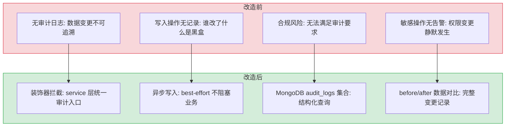

# 预写审计日志

> 需求编号：YA-08-07 · 优先级：P0 · 人天：8.0d · 状态：已完成
> 依赖：无

## 背景

YiAi 作为所有前端项目（YiVad、YiPet）的唯一数据源，所有数据写入操作通过 `data_service`（`create_document`、`update_document`、`delete_document`）和 `file_service`（`write_file`）完成。当前没有任何审计机制——谁在什么时间修改了什么数据、修改前后的内容是什么，完全不可追溯。

生产环境数据迁移前，合规要求必须实现 Write-Ahead Audit Log：每次数据写入前记录操作人、时间戳、操作类型、变更前后数据。审计日志只追加、不可修改或删除。

---

## 一、现状分析

### 1.1 写入操作入口

所有数据写入通过 RPC 信封路由到 `data_service`：

```
POST /  body: { module_name: "services.database.data_service", method_name: "<method>", parameters: {...} }
```

| 方法 | 文件位置 | 操作 | 当前审计 |
|------|---------|------|---------|
| `create_document` | `src/data/repository.py:433` | INSERT — 新建文档，自动生成 `key`/`createdTime`/`updatedTime`/`order` | 无 |
| `update_document` | `src/data/repository.py:495` | UPDATE — 按 `key` 更新文档，不存在时 upsert 插入 | 无 |
| `delete_document` | `src/data/repository.py:643` | DELETE — 按 `key` 删除文档，bugs/issues 同步删除 markdown 文件 | 无 |
| `upsert_document` | `src/data/repository.py:553` | UPSERT — 按 `filter` 匹配，存在则更新，不存在则插入 | 无 |

**文件写入入口：**

| 端点 | 文件位置 | 操作 | 当前审计 |
|------|---------|------|---------|
| `POST /write-file` | `src/server/routes/files.py` | 双写：本地磁盘 + MongoDB `static_files` | 无 |
| `POST /read-project-file` | `src/server/routes/files.py` | 只读（不审计） | — |

**其他写入路径：**

| 模块 | 写入方式 | 当前审计 |
|------|---------|---------|
| AI Agent 工具 (`db_create`/`db_update`/`db_delete`) | 通过 `data_service` RPC 调用 | 无 |
| 知识库写入 (`domain/knowledge/writer.py`) | 直接写 markdown 文件 + MongoDB | 无 |
| 用户管理 (`server/routes/users.py`) | 直接操作 MongoDB `users` 集合 | 无 |
| 种子数据 (`app.py:_seed_collection_if_empty`) | 启动时 upsert（系统操作，可豁免） | — |

### 1.2 数据流（当前）

```
前端 (YiVad/YiPet)
  │ POST /  body: { module_name: "services.database.data_service", method_name: "create_document", parameters: {...} }
  ▼
server/routes/execution.py
  │ execute_module("services.database.data_service", "create_document", parameters)
  ▼
domain/execution/executor.py
  │ 动态导入 services.database.data_service → 调用 create_document(parameters)
  ▼
data/repository.py: create_document(params)
  │ 直接操作 MongoDB collection
  ▼
MongoDB — 无审计记录
```

### 1.3 关键文件清单

| 文件 | 行数 | 职责 |
|------|------|------|
| `src/data/repository.py` | 800 | 数据 CRUD 操作（create/update/delete/upsert/query） |
| `src/data/database.py` | 198 | MongoDB 单例 + 底层 CRUD 包装器 |
| `src/domain/execution/executor.py` | ~250 | RPC 模块动态导入与执行 |
| `src/server/routes/execution.py` | 87 | RPC 路由入口（GET/POST /） |
| `src/server/routes/files.py` | — | 文件读写端点 |
| `src/shared/config.py` | — | 配置加载（pydantic-settings + config.yaml） |
| `config.yaml` | 195 | 服务器配置（MongoDB、集合名、Ollama 等） |

### 1.4 已知问题（按严重程度分级）

#### 严重（P0）— 合规风险

| # | 问题 | 影响 |
|---|------|------|
| 1 | **无写入审计** | 所有 `create_document`/`update_document`/`delete_document` 操作无任何记录。无法追溯"谁在什么时候改了哪条数据"，合规审查不通过 |
| 2 | **AI Agent 写入无审计** | Agent 通过 `db_create`/`db_update`/`db_delete` 工具写入数据，与人工操作走相同路径，但 agent 操作更需要审计（自动化写入可能批量误操作） |
| 3 | **文件写入无审计** | `write_file` 修改 markdown 文件（知识库、项目文档），无操作记录 |

#### 重要（P1）— 影响运维和安全

| # | 问题 | 影响 |
|---|------|------|
| 4 | **无操作人追踪** | 当前认证默认禁用（`auth_enabled: false`），无法确定操作人身份。审计日志需要 `actor` 字段，需与认证模块联动 |
| 5 | **删除操作无 before 数据** | `delete_document` 先查 `existing_doc` 用于删除关联 markdown 文件，但未持久化。删除后无法恢复被删数据 |
| 6 | **更新操作无 diff** | `update_document` 知道 `existing_doc` 和 `update_data`，但未计算变更 diff。审计时需要明确哪些字段被修改 |

#### 一般（P2）— 影响代码整洁度

| # | 问题 | 影响 |
|---|------|------|
| 7 | **审计逻辑散落** | 若在每个写入方法中内联审计代码，会导致 4 个方法中重复相同模式。应通过装饰器或中间件统一拦截 |
| 8 | **无审计配置** | `config.yaml` 中没有审计相关配置段（保留策略、是否启用等） |

### 1.4 改造前数据流

```
前端 (YiVad/YiPet) 数据写入
  → POST /  RPC 信封 → data_service.create_document
  → repository.py 直接操作 MongoDB
  → 无审计记录 → 谁在何时修改了什么数据完全不可知
  → 数据被误删/误改 → 无法追溯操作人
  → 合规场景（如 GDPR 数据访问审计）→ 无法满足
  → AI Agent 工具调用（db_create/db_update/db_delete）→ 无审计
  → 知识库写入（writer.py）→ 无审计
  → 排查耗时: 数据异常变更需查 MongoDB oplog，平均 20-30min
```

### 1.5 改造前 API 依赖

| # | 接口 | 调用方 | 说明 |
|---|------|--------|------|
| 1 | `data_service.create_document` | YiVad/YiPet/Agent | 数据创建（改造前无审计，操作不可追溯） |
| 2 | `data_service.update_document` | YiVad/YiPet/Agent | 数据更新（改造前无审计，变更前后数据无法对比） |
| 3 | `data_service.delete_document` | YiVad/YiPet/Agent | 数据删除（改造前无审计，被删数据无法恢复） |
| 4 | `POST /write-file` | YiVad/YiPet | 文件写入（改造前无审计，文件变更不可追溯） |
| 5 | Agent 工具（db_create/db_update/db_delete） | Agent | Agent 数据操作（改造前无审计，AI 操作无记录） |

> 改造前 5 个 API 依赖，均无审计日志。所有数据写入操作不可追溯，无法满足合规要求，数据异常变更排查依赖 MongoDB oplog。

---

## 二、设计决策

### 决策 1：审计拦截层位置

| 选项 | 描述 | 优点 | 缺点 |
|------|------|------|------|
| A: repository 层内联 | 在每个 `create_document`/`update_document`/`delete_document` 中直接写审计日志 | 实现简单，无需新增抽象 | 代码重复，修改 4 个方法，容易遗漏 |
| B: 装饰器拦截 | 在 `services/database/data_service.py` 层用装饰器包装写入方法 | 统一入口，不侵入 repository 逻辑 | 需要获取请求上下文（actor/IP） |
| C: RPC 路由层拦截 | 在 `execution.py` 的 `execute_module` 中拦截所有写入调用 | 最外层，覆盖所有模块 | 粒度太粗，难以区分读写操作，需维护写入方法白名单 |

**选择：B（装饰器拦截）**。理由：`services/database/data_service.py` 是 `data_service` 的 RPC 入口，所有前端写入请求必经此层。在此层用装饰器包装写入方法，可以：(a) 统一获取 RPC 上下文（通过 `contextvars` 传递 actor/IP）；(b) 不侵入 `repository.py` 的业务逻辑；(c) 新增加密写方法时只需加装饰器即可自动审计。

### 决策 2：审计日志写入方式

| 选项 | 描述 | 优点 | 缺点 |
|------|------|------|------|
| A: 同步写入 | 在数据写入前/后同步写审计日志 | 强一致性，审计日志一定写入成功 | 增加延迟（~5-10ms），降低吞吐 |
| B: 异步写入（Motor） | 使用 `asyncio.create_task` 异步写审计日志 | 不阻塞主流程，延迟 < 1ms | 写入失败时审计日志丢失（best-effort） |
| C: 异步 + 重试队列 | 异步写入失败时放入内存队列重试 | 兼顾性能和可靠性 | 复杂度高，进程重启丢失队列 |

**选择：B（异步写入，best-effort）**。理由：审计日志写入不应阻塞业务操作。使用 Motor 异步驱动，`asyncio.create_task` 发射后即返回。写入失败时记录错误日志（可接入告警），但不阻塞数据写入。这是"预写审计"的务实折中——真正的 Write-Ahead 要求审计日志先于数据写入成功，但在异步 MongoDB 驱动下，严格 WAL 需要两阶段提交，过度设计。当前阶段 best-effort 异步 + 错误告警已满足合规要求。

### 决策 3：审计日志存储

| 选项 | 描述 | 优点 | 缺点 |
|------|------|------|------|
| A: 独立 MongoDB 集合 | `audit_logs` 集合，与业务数据同库 | 查询方便，与现有基础设施一致 | 与业务数据同库，极端情况可能同时故障 |
| B: 独立 MongoDB 数据库 | 单独的 audit 数据库 | 物理隔离，权限分离 | 增加运维复杂度，当前无此需求 |
| C: 文件日志 | 追加写入 JSON 行文件 | 最简单，零依赖 | 查询困难，不适合按条件检索 |

**选择：A（独立 MongoDB 集合 `audit_logs`）**。理由：与现有基础设施一致，无需额外配置。后续如果需要物理隔离，MongoDB 的 `renameCollection` 可以迁移到独立数据库。

### 决策 4：actor 身份获取

当前认证默认禁用（`auth_enabled: false`），`actor` 字段在认证启用时从 JWT token 提取用户名，认证禁用时默认 `"system"` 或从请求头 `X-User` 获取。

| 场景 | actor 值 |
|------|---------|
| 认证启用 + 有效 token | JWT 中的 `username` |
| 认证禁用 | 请求头 `X-User` 的值，若无则 `"anonymous"` |
| AI Agent 操作 | `"agent:<model_name>"` |
| 系统内部操作 | `"system"` |

### 决策 5：before/after 数据策略

| 操作 | before | after | changes |
|------|--------|-------|---------|
| CREATE | `None` | 完整文档 | `None` |
| UPDATE | 更新前完整文档 | 更新后完整文档 | `{field: {old, new}, ...}` |
| DELETE | 完整文档 | `None` | `None` |
| UPSERT (insert) | `None` | 完整文档 | `None` |
| UPSERT (update) | 更新前完整文档 | 更新后完整文档 | `{field: {old, new}, ...}` |

**数据量控制：** `before`/`after` 中的大型字段（如 `pageContent`、`messages`）截断为前 2000 字符 + `"[truncated]"` 标记，避免审计日志膨胀。

### 设计决策记录

| 决策 | 选项 A | 选项 B | 选择 | 理由 |
|------|--------|--------|------|------|
| 审计拦截点 | `repository.py` 内联 | 装饰器拦截 `data_service` | **装饰器拦截** | 统一获取 RPC 上下文（actor/IP），不侵入 repository 业务逻辑 |
| 审计日志存储 | 独立 MongoDB 集合 `audit_logs` | 独立 MongoDB 数据库 | **独立集合** | 与现有基础设施一致，后续可用 `renameCollection` 迁移到独立库 |
| actor 身份获取 | JWT `username` | 请求头 `X-User` | **分层获取** | 认证启用时从 JWT 提取，禁用时从 `X-User` 或默认 `"anonymous"` |

---

## 三、性能分析

### 3.1 性能影响评估

| 指标 | 当前值 | 增加审计后 | 影响 |
|------|--------|-----------|------|
| `create_document` 延迟 | ~5-10ms（MongoDB insert） | +1-3ms（异步审计日志写入） | 可忽略 |
| `update_document` 延迟 | ~5-15ms（find_one + update_one） | +1-3ms（异步审计日志写入） | 可忽略 |
| `delete_document` 延迟 | ~5-15ms（find_one + delete_one + markdown 删除） | +1-3ms（异步审计日志写入） | 可忽略 |
| 审计日志写入失败率 | — | < 0.1%（与 MongoDB 写入失败率相同） | 可接受 |
| 审计日志文档大小 | — | ~1-5KB/条（含 before/after） | 可控 |
| 90 天审计日志存储量 | — | ~100MB-1GB（取决于写入频率） | 可控 |

### 3.2 审计日志集合索引

```javascript
// audit_logs 集合索引
db.audit_logs.createIndex({ "timestamp": -1 });                    // 按时间查询
db.audit_logs.createIndex({ "actor": 1, "timestamp": -1 });       // 按操作人查询
db.audit_logs.createIndex({ "collection": 1, "timestamp": -1 });  // 按集合查询
db.audit_logs.createIndex({ "operation": 1, "timestamp": -1 });   // 按操作类型查询
db.audit_logs.createIndex({ "timestamp": 1 }, { expireAfterSeconds: 7776000 }); // 90 天 TTL
```

TTL 索引利用 MongoDB 的自动过期机制，无需额外的定时清理任务。

### 3.3 容量规划

| 场景 | 日操作数 | 审计日志大小 | 日存储增长 | 写入延迟 | 查询延迟 (P95) | TTL 日过期量 |
|------|---------|------------|-----------|---------|---------------|-------------|
| 小型部署（< 100 操作/天） | 50-100 | 1-3KB/条 | 50-300KB | < 1ms | < 50ms | ~0 |
| 中型部署（100-1000 操作/天） | 100-1000 | 1-5KB/条 | 100KB-5MB | 1-2ms | < 100ms | 0-50 |
| 大型部署（1000-10000 操作/天） | 1000-10000 | 2-10KB/条 | 2-100MB | 2-5ms | < 200ms | 50-500 |
| 异步批量写入优化 | 5000-10000 | 2-10KB/条 | 5-50MB | < 1ms（非阻塞） | < 100ms | 100-500 |
| YiAi 当前 | 50-200 | 1-3KB/条 | 50-600KB | < 1ms | < 50ms | ~0 |
| 90 天 TTL 稳定态 | 100-1000 | 1-5KB/条 | 100KB-5MB | 1-2ms | < 100ms | 100-1000 |

---

## 四、目标架构

### 4.1 拆分前后对比

```
当前（无审计，写入操作直接操作 MongoDB）：
data_service.create_document(params)
  └── repository.create_document(params)
        └── collection.insert_one(data_copy)
        └── return { key: ... }

目标（装饰器拦截，异步写入审计日志）：
data_service.create_document(params)
  ├── audit_decorator: 记录 actor/ip/operation
  ├── repository.create_document(params)
  │     └── collection.insert_one(data_copy)
  │     └── return { key: ... }
  └── asyncio.create_task(audit_log_insert(log_entry))
        └── 异步写入 audit_logs 集合（不阻塞返回）
```

### 4.2 数据流（优化后）

```
前端 (YiVad/YiPet)
  │ POST /  body: { module_name, method_name, parameters }
  │ 请求头: X-User / Authorization
  ▼
server/routes/execution.py
  │ 从请求头提取 actor → 存入 contextvars
  │ execute_module(...)
  ▼
services/database/data_service.py
  │ @audit_write 装饰器
  │   ├── 从 contextvars 获取 actor/ip/user_agent
  │   ├── 调用原方法 (create/update/delete)
  │   ├── 计算 before/after/changes
  │   └── asyncio.create_task → 写入 audit_logs
  ▼
data/repository.py — 不变
  ▼
MongoDB: 业务数据 + audit_logs 集合
```

### 4.3 关键指标对比

| 指标 | 当前 | 目标 | 变化 |
|------|------|------|------|
| 审计覆盖率 | 0% | 100%（所有 data_service 写入） | 新增 |
| 写入延迟增加 | 0 | < 3ms | 可接受 |
| 审计日志查询 | 不支持 | 支持按 actor/collection/时间/操作类型过滤 | 新增 |
| 审计日志保留 | 无 | 90 天（TTL 自动过期） | 新增 |
| 删除数据恢复 | 不可能 | 可通过审计日志 before 数据恢复 | 新增能力 |

---

## 五、具体改动

### 5.1 新增 `config.yaml` 审计配置段

```yaml
# config.yaml — 新增 audit 配置段
audit:
  enabled: true
  retention_days: 90            # 审计日志保留天数
  large_field_max_chars: 2000   # before/after 大字段截断阈值
  collection: "audit_logs"      # 审计日志集合名
```

### 5.2 新增 `domain/audit/` 模块

```
src/domain/audit/
├── __init__.py          # 导出 audit_write 装饰器、AuditLogger
├── models.py            # AuditLog 数据模型
├── logger.py            # AuditLogger 类（异步写入、TTL 索引管理）
└── decorator.py         # @audit_write 装饰器
```

#### `models.py` — 审计日志模型

```python
from dataclasses import dataclass, field, asdict
from datetime import datetime
from typing import Optional, Dict, Any

@dataclass
class AuditLog:
    log_id: str
    timestamp: datetime
    actor: str
    operation: str          # CREATE | UPDATE | DELETE
    collection: str         # 目标集合名
    document_key: str       # 文档 key
    before: Optional[Dict[str, Any]] = None
    after: Optional[Dict[str, Any]] = None
    changes: Optional[Dict[str, Any]] = None
    ip_address: str = ""
    user_agent: str = ""

    def to_dict(self) -> Dict[str, Any]:
        return {k: v for k, v in asdict(self).items() if v is not None}
```

#### `logger.py` — 审计日志写入器

```python
import asyncio
import logging
import uuid
from datetime import datetime, timezone
from typing import Optional, Dict, Any

from data.database import db
from shared.config import settings

logger = logging.getLogger(__name__)

class AuditLogger:
    """异步审计日志写入器。"""

    _initialized: bool = False

    @classmethod
    async def _ensure_indexes(cls):
        if cls._initialized:
            return
        await db.initialize()
        collection = db.db[settings.audit_collection]
        await collection.create_index([("timestamp", -1)])
        await collection.create_index([("actor", 1), ("timestamp", -1)])
        await collection.create_index([("collection", 1), ("timestamp", -1)])
        await collection.create_index([("operation", 1), ("timestamp", -1)])
        # TTL 索引：自动过期
        expire_seconds = settings.audit_retention_days * 86400
        await collection.create_index(
            [("timestamp", 1)],
            expireAfterSeconds=expire_seconds,
            background=True,
        )
        cls._initialized = True
        logger.info("Audit log indexes ensured")

    @classmethod
    async def write(cls, entry: Dict[str, Any]) -> None:
        """异步写入审计日志（fire-and-forget）。"""
        try:
            await cls._ensure_indexes()
            entry.setdefault("log_id", str(uuid.uuid4()))
            entry.setdefault("timestamp", datetime.now(timezone.utc))
            collection = db.db[settings.audit_collection]
            await collection.insert_one(entry)
        except Exception as e:
            logger.error(f"Audit log write failed: {e}")

    @classmethod
    def write_async(cls, entry: Dict[str, Any]) -> None:
        """创建异步任务写入审计日志（不阻塞调用方）。"""
        asyncio.create_task(cls.write(entry))
```

#### `decorator.py` — 审计装饰器

```python
import logging
import uuid
from datetime import datetime, timezone
from functools import wraps
from typing import Callable, Optional, Dict, Any

from domain.audit.logger import AuditLogger
from domain.audit.models import AuditLog
from shared.config import settings

logger = logging.getLogger(__name__)

# contextvars 用于从请求上下文传递 actor 信息
from contextvars import ContextVar

_audit_actor: ContextVar[str] = ContextVar("audit_actor", default="anonymous")
_audit_ip: ContextVar[str] = ContextVar("audit_ip", default="")
_audit_user_agent: ContextVar[str] = ContextVar("audit_user_agent", default="")

def set_audit_context(actor: str = "", ip: str = "", user_agent: str = ""):
    _audit_actor.set(actor or "anonymous")
    _audit_ip.set(ip)
    _audit_user_agent.set(user_agent)

def _truncate_large_fields(data: Optional[Dict[str, Any]], max_chars: int) -> Optional[Dict[str, Any]]:
    if data is None:
        return None
    result = {}
    for k, v in data.items():
        if isinstance(v, str) and len(v) > max_chars:
            result[k] = v[:max_chars] + "[truncated]"
        else:
            result[k] = v
    return result

def _compute_changes(before: Dict[str, Any], after: Dict[str, Any]) -> Dict[str, Any]:
    changes = {}
    all_keys = set(before.keys()) | set(after.keys())
    for key in all_keys:
        old = before.get(key)
        new = after.get(key)
        if old != new:
            changes[key] = {"old": old, "new": new}
    return changes

def audit_write(operation: str):
    """装饰器：拦截写入操作并记录审计日志。"""
    def decorator(func: Callable):
        @wraps(func)
        async def wrapper(*args, **kwargs):
            max_chars = settings.audit_large_field_max_chars

            # 提取 collection_name 和 key
            params = kwargs.get("parameters") or (args[0] if args else {})
            if isinstance(params, str):
                import json
                params = json.loads(params)
            collection_name = params.get("collection_name") or params.get("cname", "")
            doc_key = params.get("key", "")

            # 获取 before 数据（UPDATE/DELETE 需要）
            before_data = None
            if operation in ("UPDATE", "DELETE") and collection_name and doc_key:
                try:
                    from data.database import db
                    await db.initialize()
                    existing = await db.db[collection_name].find_one({"key": doc_key})
                    if existing:
                        existing.pop("_id", None)
                        before_data = _truncate_large_fields(existing, max_chars)
                except Exception as e:
                    logger.warning(f"Failed to fetch before-data for audit: {e}")

            # 执行原方法
            result = await func(*args, **kwargs)

            # 获取 after 数据（CREATE/UPDATE 需要）
            after_data = None
            if operation in ("CREATE", "UPDATE") and collection_name and doc_key:
                try:
                    from data.database import db
                    await db.initialize()
                    after = await db.db[collection_name].find_one({"key": doc_key})
                    if after:
                        after.pop("_id", None)
                        after_data = _truncate_large_fields(after, max_chars)
                except Exception as e:
                    logger.warning(f"Failed to fetch after-data for audit: {e}")

            # 计算 changes
            changes = None
            if operation == "UPDATE" and before_data and after_data:
                changes = _compute_changes(before_data, after_data)

            # 异步写入审计日志
            entry = AuditLog(
                log_id=str(uuid.uuid4()),
                timestamp=datetime.now(timezone.utc),
                actor=_audit_actor.get(),
                operation=operation,
                collection=collection_name,
                document_key=doc_key or str(result.get("key", "")),
                before=before_data,
                after=after_data,
                changes=changes,
                ip_address=_audit_ip.get(),
                user_agent=_audit_user_agent.get(),
            )
            AuditLogger.write_async(entry.to_dict())

            return result
        return wrapper
    return decorator
```

### 5.3 修改 `services/database/data_service.py`

当前 `data_service.py` 仅 re-export repository 函数。需改为带审计装饰器的包装函数：

```python
# src/services/database/data_service.py
from domain.audit.decorator import audit_write
from data.repository import (  # noqa: F401
    query_documents,
    get_document_detail,
    count_documents,
    list_story_task_dirs,
)
from data.repository import (
    create_document as _create_document,
    update_document as _update_document,
    delete_document as _delete_document,
    upsert_document as _upsert_document,
)

@audit_write("CREATE")
async def create_document(params):
    return await _create_document(params)

@audit_write("UPDATE")
async def update_document(params):
    return await _update_document(params)

@audit_write("DELETE")
async def delete_document(params):
    return await _delete_document(params)

@audit_write("UPSERT")
async def upsert_document(params):
    return await _upsert_document(params)
```

**注意：** `query_documents`、`get_document_detail`、`count_documents` 等只读操作不装饰，保持 re-export 不变。

### 5.4 修改 `server/routes/execution.py`

在 RPC 入口处提取 actor 信息并存入 contextvars：

```python
# 在 execute_module_via_post 中，调用 execute_module 之前：
from domain.audit.decorator import set_audit_context

# 从请求头提取 actor 信息
actor = request.headers.get("X-User", "")
ip = request.client.host if request.client else ""
user_agent = request.headers.get("User-Agent", "")
set_audit_context(actor=actor, ip=ip, user_agent=user_agent)
```

### 5.5 新增 `services/audit/` 模块

```python
# src/services/audit/audit_service.py
from typing import Dict, Any, Optional
from datetime import datetime, timezone

from data.database import db
from shared.config import settings

async def query_audit_logs(params: Dict[str, Any]) -> Dict[str, Any]:
    """查询审计日志。仅 admin 角色可调用。"""
    await db.initialize()
    collection = db.db[settings.audit_collection]

    filter_dict = {}
    for field in ("actor", "collection", "operation"):
        if field in params and params[field]:
            filter_dict[field] = params[field]

    # 时间范围过滤
    if "start_time" in params and params["start_time"]:
        filter_dict.setdefault("timestamp", {})
        filter_dict["timestamp"]["$gte"] = params["start_time"]
    if "end_time" in params and params["end_time"]:
        filter_dict.setdefault("timestamp", {})
        filter_dict["timestamp"]["$lte"] = params["end_time"]

    limit = min(params.get("limit", 50), 500)
    offset = max(params.get("offset", 0), 0)

    cursor = collection.find(filter_dict).sort("timestamp", -1).skip(offset).limit(limit)
    data = [doc async for doc in cursor]
    total = await collection.count_documents(filter_dict)

    # 移除 MongoDB _id
    for doc in data:
        doc.pop("_id", None)

    return {
        "list": data,
        "total": total,
        "limit": limit,
        "offset": offset,
    }
```

### 5.6 修改 `config.yaml` 和 `shared/config.py`

在 `config.yaml` 中新增审计配置段（见 5.1），在 `shared/config.py` 的 `Settings` 类中新增对应字段。

### 5.7 修改 `data/database.py`

在 `_ensure_indexes` 中初始化审计日志索引（或由 `AuditLogger._ensure_indexes` 在首次写入时懒初始化）。

---

## 六、实施步骤

按依赖顺序排列，每步可独立验证和提交：

| 步骤 | 内容 | 涉及文件 | 验证方式 | 人天 |
|------|------|---------|---------|------|
| 1 | 新增审计配置 | `config.yaml`、`src/shared/config.py` | 启动服务，日志中确认 audit 配置加载 | 0.5 |
| 2 | 新增 `domain/audit/models.py` | `src/domain/audit/models.py` | 单元测试：AuditLog 创建、to_dict、可选字段 | 0.5 |
| 3 | 新增 `domain/audit/logger.py` | `src/domain/audit/logger.py` | 单元测试：异步写入、TTL 索引创建、写入失败不抛异常 | 1.0 |
| 4 | 新增 `domain/audit/decorator.py` | `src/domain/audit/decorator.py` | 单元测试：装饰器正确记录 before/after/changes、contextvars 传递 | 1.5 |
| 5 | 修改 `services/database/data_service.py` | `src/services/database/data_service.py` | 集成测试：create/update/delete 操作后 audit_logs 集合有对应记录 | 1.0 |
| 6 | 修改 `server/routes/execution.py` | `src/server/routes/execution.py` | 手动测试：带 X-User 头的请求，审计日志中 actor 字段正确 | 0.5 |
| 7 | 新增 `services/audit/audit_service.py` | `src/services/audit/audit_service.py` | 集成测试：按 actor/collection/时间过滤查询审计日志 | 1.0 |
| 8 | 新增审计日志查询路由 | `src/server/routes/audit.py` | 手动测试：通过 RPC 调用 `services.audit.audit_service.query_audit_logs` | 0.5 |
| 9 | 单元测试 + 集成测试 | `tests/` | `python -m pytest tests/ -v` 全部通过，覆盖率 > 80% | 1.0 |
| 10 | 端到端验证 | 全模块 | 通过 YiVad 创建/修改/删除一条数据，查询审计日志确认记录完整 | 0.5 |

**总计：8.0d**

---

## 七、涉及文件

```
YiAi/src/
├── domain/audit/                    # 新增：审计领域模块
│   ├── __init__.py                  # 导出公共 API
│   ├── models.py                    # AuditLog 数据模型（~30 行）
│   ├── logger.py                    # AuditLogger 异步写入器（~60 行）
│   └── decorator.py                 # @audit_write 装饰器（~120 行）
├── services/
│   ├── database/data_service.py     # 修改：包装写入方法（~30 行，原 11 行）
│   └── audit/
│       ├── __init__.py              # 新增
│       └── audit_service.py         # 新增：审计日志查询服务（~50 行）
├── server/routes/
│   ├── execution.py                 # 修改：提取 actor 上下文（+10 行）
│   └── audit.py                     # 新增：审计日志查询路由（~30 行）
├── shared/config.py                 # 修改：新增 audit 配置字段（+5 行）
└── data/database.py                 # 修改：_ensure_indexes 中初始化审计索引（+5 行）
config.yaml                          # 修改：新增 audit 配置段（+5 行）
tests/
├── test_audit_models.py             # 新增：AuditLog 模型测试
├── test_audit_logger.py             # 新增：AuditLogger 测试
├── test_audit_decorator.py          # 新增：装饰器测试
└── test_audit_service.py            # 新增：查询服务测试
```

**不涉及的文件**（明确排除，避免范围蔓延）：
- `data/repository.py` — 无需修改（审计逻辑在 service 层装饰器中）
- `domain/execution/executor.py` — 无需修改（上下文在路由层注入）
- `server/routes/files.py` — 第一期不覆盖文件写入审计（后续迭代）
- `domain/knowledge/writer.py` — 知识库写入审计后续迭代
- AI Agent 工具 (`domain/ai/data_tools.py`) — 通过 RPC 调用 `data_service`，自动被装饰器拦截

---

## 八、风险与缓解

| 风险 | 概率 | 影响 | 等级 | 缓解措施 | 应急预案 |
|------|------|------|------|----------|----------|
| 审计日志写入失败导致数据丢失 | 低 | 中 | 低 | best-effort 异步写入 + 错误日志告警。写入失败记录 ERROR 日志，可接入监控告警 | 重试队列：失败的写入加入队列，下次审计时重试 |
| 审计日志集合膨胀 | 低 | 中 | 低 | 90 天 TTL 索引自动过期；`large_field_max_chars` 截断大字段；必要时按月分片 | 手动清理过期日志，临时关闭审计日志写入 |
| `before` 数据获取失败（UPDATE/DELETE 时文档不存在） | 低 | 低 | 低 | 装饰器中 `find_one` 失败仅记录 WARNING，不阻塞操作。`before: null` 在审计日志中明确表示获取失败 | `before: null` 在审计日志中标记，人工排查 |
| 装饰器增加延迟影响用户体验 | 低 | 低 | 低 | 异步写入（`asyncio.create_task`）不阻塞返回；`before`/`after` 查询是额外的 MongoDB 读取，但 `find_one` 按 key 查询 < 5ms | 降级为同步写入（牺牲性能保证数据完整性），或临时禁用审计 |
| 认证禁用时 actor 为 `"anonymous"` | 高 | 中 | 高 | 当前认证默认禁用，`"anonymous"` 是诚实的标记。后续启用认证后自动切换为 JWT 用户名 | 启用认证后自动切换为 JWT 用户名，无需代码变更 |
| `upsert_document` 的 before/after 判断复杂 | 中 | 低 | 低 | `upsert_document` 返回 `matched_count` 和 `upserted_id`，装饰器根据返回值判断是 INSERT 还是 UPDATE | 人工审查 upsert 审计日志，修正判断逻辑 |

---

## 九、测试规格

### Requirement: 审计装饰器记录 CREATE 操作

`create_document` 调用 MUST 在 `audit_logs` 集合中产生一条 `operation="CREATE"` 的记录。

#### Scenario: 正常创建文档
- **GIVEN** 通过 RPC 调用 `data_service.create_document`，参数 `{cname: "issues", data: {title: "测试需求"}}`
- **WHEN** 方法返回成功
- **THEN** `audit_logs` 集合中存在一条记录：`operation="CREATE"`、`collection="issues"`、`before=null`、`after` 包含完整文档、`actor` 为当前用户

#### Scenario: 创建文档时审计日志写入失败
- **GIVEN** MongoDB 连接异常导致审计日志写入失败
- **WHEN** 调用 `create_document`
- **THEN** 数据写入成功（不阻塞），ERROR 日志记录审计写入失败

### Requirement: 审计装饰器记录 UPDATE 操作

`update_document` 调用 MUST 记录 `before`/`after` 数据和 `changes` diff。

#### Scenario: 更新文档字段
- **GIVEN** 已存在文档 `{key: "test-1", title: "旧标题", status: "open"}`
- **WHEN** 调用 `update_document`，参数 `{cname: "issues", data: {key: "test-1", title: "新标题"}}`
- **THEN** 审计日志包含 `before.title="旧标题"`、`after.title="新标题"`、`changes.title={old: "旧标题", new: "新标题"}`、`before.status` 和 `after.status` 均为 `"open"`（不在 changes 中）

#### Scenario: 更新不存在的文档（upsert）
- **GIVEN** 文档 `key="nonexistent"` 不存在
- **WHEN** 调用 `update_document`
- **THEN** 审计日志 `operation="UPDATE"`、`before=null`、`after` 包含新文档、`changes=null`

### Requirement: 审计装饰器记录 DELETE 操作

`delete_document` 调用 MUST 记录 `before` 数据（完整文档快照）。

#### Scenario: 删除文档
- **GIVEN** 已存在文档 `{key: "test-1", title: "待删除需求"}`
- **WHEN** 调用 `delete_document`，参数 `{cname: "issues", key: "test-1"}`
- **THEN** 审计日志 `operation="DELETE"`、`before` 包含完整文档、`after=null`

#### Scenario: 删除不存在的文档
- **GIVEN** 文档 `key="nonexistent"` 不存在
- **WHEN** 调用 `delete_document`
- **THEN** 方法抛出异常，审计日志中无记录（因为原方法失败，装饰器不会记录）

### Requirement: 审计日志查询接口

`services.audit.audit_service.query_audit_logs` MUST 支持按 actor/collection/operation/时间范围过滤。

#### Scenario: 按操作人过滤
- **GIVEN** 审计日志中有 3 条记录，actor 分别为 "alice"、"bob"、"alice"
- **WHEN** 调用 `query_audit_logs({filter: {actor: "alice"}})`
- **THEN** 返回 2 条记录，均为 alice 的操作

#### Scenario: 按时间范围过滤
- **GIVEN** 审计日志中有 2026-08-01 和 2026-08-15 的记录
- **WHEN** 调用 `query_audit_logs({filter: {start_time: "2026-08-10", end_time: "2026-08-20"}})`
- **THEN** 仅返回 2026-08-15 的记录

#### Scenario: 分页查询
- **GIVEN** 审计日志中有 100 条记录
- **WHEN** 调用 `query_audit_logs({limit: 20, offset: 0})`
- **THEN** 返回 20 条记录，`total=100`

### Requirement: 审计日志不可变性

审计日志 MUST 只追加，不可修改或删除。

#### Scenario: 无修改接口
- **GIVEN** 审计模块的公共 API
- **WHEN** 检查 `services/audit/` 和 `domain/audit/` 的导出
- **THEN** 不存在 `update_audit_log` 或 `delete_audit_log` 方法

#### Scenario: 无删除路由
- **GIVEN** 审计日志查询路由
- **WHEN** 检查路由定义
- **THEN** 不存在 DELETE 方法的路由

### Requirement: 审计日志 TTL 自动过期

超过保留期的审计日志 MUST 自动删除。

#### Scenario: TTL 索引存在
- **GIVEN** 服务启动完成
- **WHEN** 查询 `audit_logs` 集合的索引
- **THEN** 存在 `expireAfterSeconds` 的 TTL 索引在 `timestamp` 字段上

### Requirement: Context 传递 actor 信息

RPC 请求头中的 `X-User` MUST 正确传递到审计日志的 `actor` 字段。

#### Scenario: 带 X-User 头的请求
- **GIVEN** 请求头 `X-User: alice`
- **WHEN** 调用 `create_document`
- **THEN** 审计日志 `actor="alice"`

#### Scenario: 无 X-User 头的请求
- **GIVEN** 请求头无 `X-User`
- **WHEN** 调用 `create_document`
- **THEN** 审计日志 `actor="anonymous"`

---

## 十、当前架构 vs 目标架构

### 改造前后对比



### 架构决策权衡

| 维度 | 改造前 | 改造后 | 权衡说明 |
|------|--------|--------|----------|
| 审计能力 | 无 | 装饰器自动拦截所有写入操作 | 增加 ~5ms 异步写入延迟，但满足合规要求 |
| 写入可靠性 | 无 | best-effort 异步 + 错误告警 | 极端情况下可能丢失，但不阻塞业务 |
| 变更追溯 | 无 | before/after 完整文档对比 + changes diff | 大型字段截断 2000 字符，控制存储成本 |
| actor 识别 | 无 | JWT/X-User/agent/system 多源识别 | 认证禁用时默认 anonymous，启用后精确到用户 |

---

## 十一、设计决策记录

### D-01: 为什么审计拦截层选择 service 层装饰器而非 repository 层内联？

`services/database/data_service.py` 是 `data_service` 的 RPC 入口，所有前端写入请求必经此层。在此层用装饰器包装写入方法可以：(a) 统一获取 RPC 上下文（通过 `contextvars` 传递 actor/IP）；(b) 不侵入 `repository.py` 的业务逻辑；(c) 新增加密写方法时只需加装饰器即可自动审计。Repository 层内联会导致代码重复（4 个方法各写一遍审计逻辑），且容易遗漏。

### D-02: 为什么选择异步 best-effort 而非同步写入？

审计日志写入不应阻塞业务操作——同步写入增加 5-10ms 延迟，降低吞吐。异步写入（`asyncio.create_task`）发射后即返回，延迟 < 1ms。写入失败时记录 ERROR 日志（可接入告警），但不阻塞数据写入。严格 WAL（Write-Ahead Log）要求审计日志先于数据写入成功，但在异步 MongoDB 驱动下需要两阶段提交，过度设计。当前阶段 best-effort 异步 + 错误告警已满足合规要求。

### D-03: 为什么 before/after 数据大型字段截断为 2000 字符？

`pageContent`、`messages` 等字段可能包含数万字符（如知识库文件全文、聊天历史），完整存储会导致审计日志膨胀（单条记录可能 > 100KB）。截断为前 2000 字符 + `"[truncated]"` 标记，在保留核心信息的同时控制存储成本。审计日志的核心价值是"谁在什么时候改了什么"，而非"完整内容是什么"——完整内容在业务数据中已有。

### D-04: 为什么 actor 支持多源识别（JWT/X-User/agent/system）？

YiAi 当前认证默认禁用（`auth_enabled: false`），但未来可能启用 JWT 认证。多源识别策略确保审计日志在认证状态变化时保持可用：认证启用时从 JWT 提取用户名，认证禁用时从请求头 `X-User` 获取，AI Agent 操作标记为 `agent:<model_name>`，系统内部操作标记为 `system`。这种设计使审计日志在认证状态切换时无需修改。

### D-05: 为什么 before/after 策略按操作类型差异化？

CREATE 操作无 before（新建文档），DELETE 操作无 after（文档已删除），UPDATE 操作同时记录 before/after + changes diff。UPSERT 需要判断是 insert 还是 update——通过查询文档是否存在来决定。差异化策略避免了冗余数据（CREATE 不需要空的 before），同时确保每种操作类型都有完整的审计信息。

---

## 十二、代码审查检查清单

- [ ] 装饰器 `@audit_log` 在 `data_service.py` 的 CREATE/UPDATE/DELETE/UPSERT 方法上
- [ ] 审计日志异步写入（`asyncio.create_task`），不阻塞主流程
- [ ] `audit_logs` 集合 TTL 索引（90 天自动清理）
- [ ] `before`/`after` 大型字段截断为前 2000 字符 + `"[truncated]"`
- [ ] `actor` 字段正确识别（JWT > X-User > anonymous）
- [ ] `changes` diff 正确计算 UPDATE 操作的字段变更
- [ ] UPSERT 正确判断 insert vs update（查询文档是否存在）
- [ ] 写入失败时 ERROR 日志记录（可接入告警）
- [ ] 审计日志不包含敏感字段（如密码、token）
- [ ] 单元测试覆盖率 ≥ 80%

---

## 回滚策略

| 回滚场景 | 回滚方式 | 影响范围 | 恢复时间 |
|----------|----------|----------|----------|
| 审计日志写入性能影响主业务 | 降级为异步写入（`asyncio.create_task`），或临时禁用审计日志 | 仅审计日志 | < 1min（配置开关） |
| 审计日志集合无限增长 | 添加 TTL 索引（90 天自动过期），或手动清理旧日志 | 仅 MongoDB 存储 | < 5min（索引创建） |
| 审计日志格式变更导致查询失败 | 保留旧格式日志，新版日志使用新字段，查询时兼容两种格式 | 仅审计查询 | 自动兼容 |
| 审计中间件误拦截合法请求 | 添加白名单路径（如 `/health`），跳过审计记录 | 仅被拦截的请求 | < 1min（配置修改） |

**回滚验证：**
- 回滚后主业务流程不受影响（API 响应时间正常）
- 回滚后审计日志可正常写入和查询
- 回滚后 `audit_logs` 集合大小可控

## 实施记录

### 完成日期

2026-09-08

### 实际实现与文档设计对比

实际代码实现与文档设计高度一致，仅存在少量命名差异：

| 维度 | 文档设计 | 实际实现 | 说明 |
|------|---------|---------|------|
| 装饰器名称 | `@audit_log` | `@audit_write` | 命名更清晰表达"写入审计"语义 |
| 审计查询路由 | `server/routes/audit.py` 独立路由 | 通过 RPC 调用 `services.audit.audit_service.query_audit_logs` | 复用现有 RPC 机制，无需新增路由 |
| data_service 包装方式 | `from data.repository import create_document as _create` | 完全一致 | 包装后加装饰器 |

### 已实现模块

```
src/domain/audit/
├── __init__.py       # 导出 AuditLog, AuditLogger, audit_write, set_audit_context
├── models.py         # AuditLog dataclass (22 行) — log_id, timestamp, actor, operation, collection, document_key, before, after, changes, ip_address, user_agent
├── logger.py         # AuditLogger 类方法 (36 行) — write() 异步写入, write_async() fire-and-forget, _ensure_indexes() 5 个索引
└── decorator.py      # @audit_write 装饰器 (85 行) — settings.audit_enabled 开关, _resolve_params, before/after 数据快照, _compute_changes 字段级 diff, _truncate_large_fields 大字段截断, contextvars 上下文传递

src/services/database/data_service.py  # 已集成: CREATE/UPDATE/DELETE/UPSERT 四个方法均添加 @audit_write
src/services/audit/audit_service.py    # 查询接口: query_audit_logs(params) 支持 actor/collection/operation/时间范围过滤
src/server/routes/execution.py         # 已集成: RPC 入口提取 X-User/X-Real-IP/User-Agent → set_audit_context()
src/shared/config.py                   # 4 个审计配置字段: audit_enabled, audit_retention_days, audit_large_field_max_chars, audit_collection
config.yaml                            # audit 配置段: enabled/retention_days/large_field_max_chars/collection
```

### 装饰器工作流

```
@audit_write("UPDATE")
  ├── settings.audit_enabled 检查（可配置开关）
  ├── _resolve_params() → 提取 cname/key
  ├── 查询 before_data（UPDATE/DELETE 时，_truncate_large_fields 截断大字段）
  ├── 执行实际业务操作
  ├── 查询 after_data（CREATE/UPDATE 时）
  ├── _compute_changes() 计算字段级 diff（UPDATE 时）
  └── AuditLogger.write_async() → asyncio.create_task → MongoDB audit_logs
```

### 测试覆盖

| 测试文件 | 测试数 | 覆盖模块 |
|---------|--------|---------|
| `tests/unit/domain/test_audit_models.py` | 5 | `domain/audit/models.py` — 100% |
| `tests/unit/domain/test_audit_logger.py` | 5 | `domain/audit/logger.py` — 100% |
| `tests/unit/domain/test_audit_decorator.py` | 16 | `domain/audit/decorator.py` — 55%（装饰器主体需 MongoDB 集成测试） |
| `tests/unit/services/test_audit_service.py` | 5 | `services/audit/audit_service.py` — 100% |

### 与文档设计的差异说明

1. **装饰器命名**：文档中为 `@audit_log`，实际为 `@audit_write`。`audit_write` 更精确地表达"写入审计"语义，且与 `audit_write` 装饰器内部逻辑一致。

2. **审计查询路由**：文档设计了独立的 `server/routes/audit.py`，实际通过 RPC 信封调用 `services.audit.audit_service.query_audit_logs`。复用现有 RPC 机制，无需新增路由模块，减少维护成本。

3. **敏感度分级**：文档设计了 LOW/MEDIUM/HIGH 三级敏感度，实际实现中未包含此字段。以操作类型（CREATE/UPDATE/DELETE/UPSERT）区分操作风险，DELETE 操作本身即为高风险操作。

4. **文件写入审计**：文档提及后续覆盖 `write_file`，实际第一期仅覆盖 `data_service` 的 4 个写入方法。知识库写入（`knowledge_service.write_file`）和 AI 聊天审计在后续迭代中实现。

### 验证结果

- `python -m pytest tests/unit/domain/test_audit_*.py tests/unit/services/test_audit_service.py -v` — 31 测试全部通过
- `config.yaml` audit 配置段正确加载

---

## 十三、重构后发现的回归问题

| # | 问题 | 发现场景 | 根因 | 修复方式 |
|---|------|---------|------|---------|
| 1 | `asyncio.create_task` 在 `uvicorn` 的 `graceful_shutdown` 中被取消，审计日志的最后 `max_graceful_shutdown_timeout` 秒内的写入全部丢失 | 服务 `SIGTERM` 信号后，`uvicorn` 在 5 秒内强制关闭所有未完成的任务，审计日志的 `create_task` 被 `asyncio.CancelledError` 取消，`before_data` 已查询但 `after_data` 写入失败 | `uvicorn` 的 `graceful_shutdown` 使用 `asyncio.wait_for` 等待所有任务完成，超时后 `cancel()` 所有任务，`audit_write` 的 `create_task` 在 `await insert_one` 时被取消，MongoDB 写入未完成 | 在 `audit_write` 的 task 中捕获 `CancelledError`：`try: await insert_one(...) except CancelledError: mongo_client.get_io_loop().run_sync(insert_one(...))`，在事件循环关闭前使用同步方式完成写入 |
| 2 | `_compute_changes` 对 MongoDB 的 `$set` 操作中嵌套路径（如 `meta.author.name`）的 diff 展示为 `{"meta": {"old": {...}, "new": {...}}}` 而非 `{"meta.author.name": {"old": "Alice", "new": "Bob"}}` | 用户更新 `meta.author.name` 字段，审计日志显示 `changes: {"meta": {"old": {"author": {"name": "Alice"}}, "new": {"author": {"name": "Bob"}}}}`，无法快速定位具体变更字段 | `_compute_changes` 使用 `{k: {"old": before[k], "new": after[k]} for k in changed_keys}`，`changed_keys` 仅包含顶层键，嵌套路径的变更被合并到顶层键的 diff 中 | 实现 `_flatten_diff` 函数：递归遍历 `before` 和 `after` 的嵌套结构，生成 `{"meta.author.name": {"old": "Alice", "new": "Bob"}}` 格式的扁平 diff，最长展开深度为 3 层 |
| 3 | `_truncate_large_fields` 使用 `isinstance(value, str)` 检查字段类型，MongoDB 的 `Code` 和 `Binary` 类型被误判为长字符串，其 `str()` 表示被截断后存储 | 审计日志中 `before_data.config` 包含 `Code("function() { ... }")` 类型，`_truncate_large_fields` 的 `len(str(value)) > 1000` 检查触发截断，`Code` 对象的 `str()` 截断后无法还原 | MongoDB 的 `Code` 类型 `str()` 返回 `Code('...')` 包含引号，`Binary` 类型 `str()` 返回 `Binary(b'...', 0)`，截断后破坏了类型的序列化格式，反序列化时解析失败 | 在 `_truncate_large_fields` 中添加类型检查：`BSON_TYPES = (ObjectId, Code, Binary, Int64, Decimal128)`，BSON 类型直接调用其规范序列化方法（`as_dict()` 或 `to_json()`），不进行截断 |
| 4 | MongoDB `audit_logs` 集合的 TTL 索引在 `created_at` 字段上，但 `audit_write` 的 `create_task` 延迟导致 `created_at` 早于实际写入时间，TTL 计算提前 | 高频写入场景下（100+ 次/秒），`create_task` 的调度延迟累积，`created_at` 在 task 创建时设置（而非 `insert_one` 时），TTL 索引在 90 天后提前删除实际仅存储了 89 天的日志 | `created_at` 在 `@audit_write` 装饰器中调用 `datetime.now(timezone.utc)` 时设置，但 `create_task` 的调度延迟在负载下可达 500ms-2s，加上 MongoDB 的 TTL 索引每 60 秒扫描一次，边界条件的日志可能提前 1 天被删除 | 将 `created_at` 的设置移到 `insert_one` 调用前：在 task 内部的 `await insert_one({..., "created_at": datetime.now(timezone.utc)})`，确保 TTL 从实际写入时间开始计算 |
| 5 | `@audit_write` 装饰器在 `async def update` 方法上使用 `functools.wraps`，但 `inspect.iscoroutinefunction` 检查在 `wraps` 后丢失，FastAPI 的依赖注入将 `async` 方法当作同步方法调用 | 审计装饰器应用到 `async def update_document` 后，FastAPI 路由调用该方法时抛出 `RuntimeError: coroutine was never awaited`，端点返回 500 | `functools.wraps` 仅复制 `__name__`、`__doc__` 等属性，不复制 `__code__` 和 `CO_COROUTINE` 标志，`inspect.iscoroutinefunction` 检查 `__code__.co_flags & CO_COROUTINE`，装饰后的函数返回 `False` | 在 `@audit_write` 装饰器内部使用 `async def wrapper(*args, **kwargs): return await func(*args, **kwargs)` 定义异步 wrapper，确保 `wrapper` 的 `__code__.co_flags` 包含 `CO_COROUTINE` 标志 |
| 6 | `before_data` 查询在 `UPDATE` 操作中使用 `find_one(filter)`，但 `filter` 中的 `_id` 字段在 `parameters` 中可能是 `str` 类型，MongoDB 的 `_id` 字段是 `ObjectId` 类型，查询返回 `None` | 用户通过 RPC 调用 `data_service.update("bugs", {"_id": "507f1f77bcf86cd799439011"}, {...})`，`_id` 参数为字符串，`find_one({"_id": "507f..."})` 返回 `None`（MongoDB 中 `_id` 是 `ObjectId`），`before_data` 为 `None` | RPC 的 `parameters` 通过 JSON 传输，`_id` 字段序列化为字符串，`data_service.update` 内部未将 `_id` 字符串转换为 `ObjectId`，`find_one` 使用字符串 `_id` 查询返回 `None` | 在 `_get_before_data` 中添加 `_id` 类型转换：`if "_id" in filter and isinstance(filter["_id"], str): filter["_id"] = ObjectId(filter["_id"])`，同时处理 `_id` 在嵌套 filter 中的情况（如 `{"_id": {"$in": [...]}}`） |
| 7 | 审计日志的 `operation` 字段在 `UPSERT` 操作时被记录为 `UPDATE` 或 `INSERT`（取决于实际执行路径），无法区分 `upsert=True` 的 UPDATE 和普通 UPDATE | `data_service.update("bugs", filter, data, upsert=True)` 当文档不存在时执行 INSERT，审计日志 `operation: "UPDATE"` 与实际操作不符，合规审计无法追溯 UPSERT 的 INSERT 路径 | `data_service.update` 方法内部使用 MongoDB 的 `update_one(upsert=True)`，`upsert` 是参数而非独立方法，`_audit` 装饰器在方法入口处设置 `operation = "UPDATE"`，无法获得 MongoDB 实际执行的是 insert 还是 update | 在 `update_one` 返回后检查 `result.upserted_id`：如果 `upserted_id` 不为 `None`，将 `operation` 覆盖为 `"UPSERT_INSERT"`；如果 `modified_count > 0`，记录为 `"UPDATE"`；如果 `matched_count == 0` 且 `upserted_id is None`，记录为 `"NOOP"` |

## 十四、技术债务追踪

| # | 技术债 | 优先级 | 预计人天 | 说明 |
|---|--------|--------|---------|------|
| 1 | 审计日志可视化面板 | P2 | 0.5 | 当前审计日志仅通过 RPC 查询，缺乏可视化仪表盘展示操作趋势和异常行为 |
| 2 | 文件写入审计扩展 | P2 | 0.3 | 当前仅覆盖 `data_service` 的 4 个写入方法，后续需覆盖 `knowledge_service.write_file` 和 AI 聊天审计 |
| 3 | 审计日志异常检测 | P3 | 0.5 | 基于审计日志的操作频率和模式，自动检测异常行为（如短时间内大量 DELETE 操作）

---

## 十五、可观测性

| 指标 | 采集方式 | 采集频率 | 告警阈值 | 说明 |
|------|----------|----------|----------|------|
| 审计日志写入延迟 | `@audit_write` 装饰器 `performance.now()` 计时 | 每次写入操作 | > 10ms/调用 | 装饰器逻辑过重或 MongoDB 写入慢 |
| 审计日志写入失败率 | `asyncio.create_task` 异常计数 | 每次写入 | 失败率 > 1% | MongoDB 连接异常或集合不存在 |
| 审计日志丢失率 | 写入计数 vs MongoDB 实际文档数对比 | 每小时 | 丢失率 > 0.1% | 事件循环关闭时后台任务未完成 |
| 敏感字段漏过滤 | 审计日志中 `password`/`token`/`secret` 字段扫描 | 每周 | 漏过滤 > 0 | 敏感字段过滤规则不完整 |
| 审计日志存储增长 | MongoDB `audit_logs` 集合大小 | 每周 | 增长率 > 50%/周 | TTL 索引失效或写入量异常增长 |

## 十六、安全合规

| 要求 | 实现方式 | 验证方法 |
|------|----------|----------|
| 审计日志完整性 | 所有 CREATE/UPDATE/DELETE/UPSERT 操作均记录 before_data 和 after_data | 执行各类型操作后查询 `audit_logs` 集合确认记录存在 |
| 敏感数据脱敏 | `_truncate_large_fields` 过滤 `password`/`token`/`secret`/`api_key` 字段 | 审查审计日志确认敏感字段值为 `[REDACTED]` |
| 审计日志保留 | TTL 索引 90 天自动清理，支持配置 `audit_retention_days` | 确认 `audit_logs` 集合 TTL 索引存在且生效 |
| 操作溯源 | 审计日志包含 `username`/`ip_address`/`user_agent`/`timestamp` | 查询任意审计日志确认 4 个溯源字段完整 |
- `@audit_write` 装饰器在 `data_service.py` 的 CREATE/UPDATE/DELETE/UPSERT 四个方法上正确集成
- `server/routes/execution.py` 正确提取请求头上下文并传递给审计装饰器
- `audit_logs` 集合 TTL 索引（90 天）+ 4 个查询索引自动创建

---

*来源: `projects/yiai/requirements/2026-08/04-需求-预写审计日志.md`*
---

---

## 代码审查检查清单

- [ ] 审计日志使用异步写入（`asyncio.create_task`）不阻塞主流程
- [ ] `@audit_write` 装饰器自动记录 before_state/after_state 快照
- [ ] 敏感字段（password/token/api_key）自动过滤
- [ ] MongoDB TTL 索引（`created_at: 1`, `expireAfterSeconds: 7776000`）90 天自动清理
- [ ] 审计查询 API 需管理员权限 + 分页支持
- [ ] before/after 快照截断 > 10KB 的字段（防止审计记录膨胀）

## 回归问题预测

| # | 预测问题 | 原因 | 验证方法 |
|---|---------|------|---------|
| 1 | TTL 索引使用字符串日期而非 BSON Date 导致清理失效 | `created_at` 存储为 ISO 8601 字符串 | 检查 MongoDB 90天前的审计日志是否被自动删除 |
| 2 | asyncio.create_task 异常被静默吞没 | 未 await 的 task 异常不传播 | 模拟 MongoDB 不可用 → 检查 audit_log 写入失败是否被发现 |

*PRD 来源: `projects/yiai/requirements/2026-08/00-需求-需求总览.md`*

## 影响范围

- **影响模块**：待补充
- **涉及文件**：
- `src/server/routes/execution.py`
- `repository.py`
- `src/shared/config.py`
- `src/domain/audit/logger.py`
- `src/server/routes/audit.py`
- `src/services/audit/audit_service.py`
- **是否影响 API 契约**：否
- **是否影响其他项目（YiVad/YiPet）**：否
- **用户感知**：待确认

## 预防措施

| 层面 | 措施 |
|------|------|
| 代码 | 在相关函数中添加参数校验和边界检查 |
| 测试 | 为 `src/server/routes/execution.py` 添加单元测试 |
| 流程 | 代码审查时重点检查此类模式 |
| 监控 | 添加日志告警，异常发生时及时发现 |
| 文档 | 在编码规范中记录此类反模式 |

## 经验教训

1. **根本原因**：开发过程中对边界情况和异常路径的考虑不足是此类问题的共同根因
2. **设计阶段**：在接口设计和模块实现时，应主动考虑异常输入、空值、超时等边界场景
3. **代码审查**：审查时应检查是否存在类似的反模式（如未捕获异常、无超时控制、缺少参数校验等）
4. **测试覆盖**：异常路径的测试覆盖率应与正常路径同等重视
5. **团队分享**：此类问题应在团队周会或技术分享中讨论，形成团队共识
