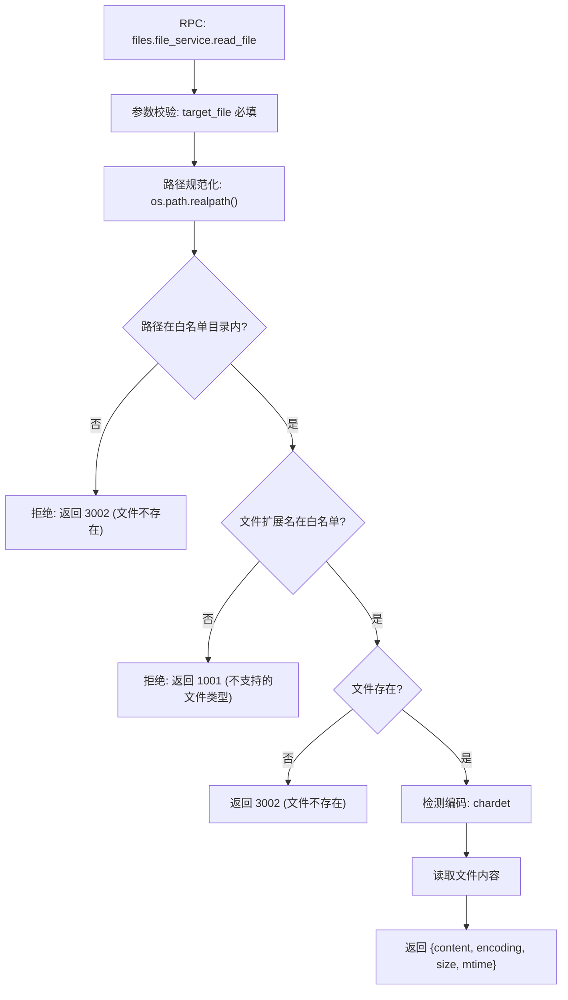
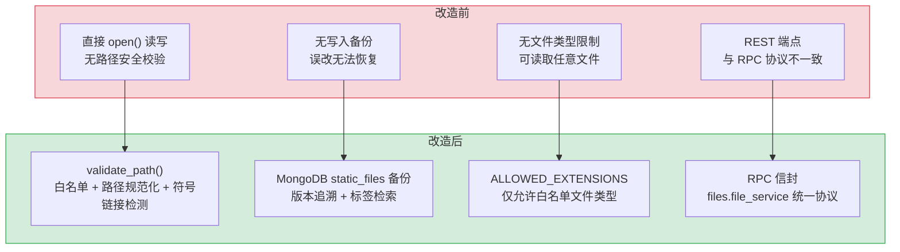

# YA-08-05: 文件管理服务 — 文件读写端点 + static_files 集合 + 路径安全

> 需求编号：YA-08-05 · 优先级：P0 · 人天：2.5d · 状态：已完成
> 依赖：YA-07-03（RPC 信封协议）

## 背景

YiAi 作为 YrY 单体仓库的唯一后端，需要为 YiVad（管理后台）和 YiPet（Chrome 扩展）提供统一的文件读写能力。YiVad 的知识库编辑器需要读取/写入 Markdown 文件，YiVad 的 CLAUDE.md 预览需要读取项目配置文件，YiPet 需要读取静态资源文件。

文件操作涉及两个维度：**文件系统操作**（直接读写 YiKnowledge/ 和各个项目目录下的文件）和**数据库备份**（将文件内容备份到 MongoDB `static_files` 集合，支持版本追溯和快速检索）。两个维度需要统一通过 RPC 信封协议暴露，且必须防范路径遍历攻击。

### 核心挑战

| 挑战 | 影响 |
|------|------|
| 路径遍历攻击 | 恶意路径 `../../etc/passwd` 可读取任意文件 |
| 文件大小控制 | 大文件（> 10MB）读写消耗内存，需分块处理 |
| 并发写入冲突 | 多个用户同时编辑同一文件，后写覆盖先写 |
| 编码检测 | Markdown/代码文件可能使用非 UTF-8 编码 |
| 文件类型安全 | 仅允许读写白名单内的文件类型 |

---

## 一、现状分析

### 1.1 改造前文件操作

```python
# 改造前：直接使用 Python 内置 open()，无路径校验
@app.post("/read-file")
async def read_file(target_file: str):  # ❌ 参数名混乱 (path vs target_file)
    with open(target_file, "r") as f:   # ❌ 无路径校验，可遍历
        content = f.read()
    return {"code": 0, "data": {"content": content}}

@app.post("/write-file")
async def write_file(target_file: str, content: str):
    with open(target_file, "w") as f:   # ❌ 无备份，覆盖即丢失
        f.write(content)
    return {"code": 0, "message": "ok"}
```

### 1.2 问题分析

| 问题 | 触发条件 | 影响 |
|------|----------|------|
| 路径遍历 | 输入 `../../etc/passwd` | 任意文件读取（安全漏洞） |
| 无写入备份 | 用户误改文件后保存 | 旧内容永久丢失，无法恢复 |
| 无文件类型限制 | 读取二进制/可执行文件 | 内存溢出或内容乱码 |
| 无并发控制 | 多人同时编辑同一文件 | 后写覆盖先写，数据丢失 |
| 参数名不一致 | 前端 `path` vs 后端 `target_file` | 422 错误 |

### 1.3 改造前数据流

```
前端发起文件读写请求
  → POST /read-file {target_file: "path/to/file.md"}
  → 直接 open(file_path) 读取 → 无路径校验 → 路径遍历风险
  → 返回文件内容 → 无编码检测 → 乱码风险
  → POST /write-file {target_file, content}
  → 直接 open(file_path, "w") 写入 → 无备份 → 数据丢失风险
  → 无并发锁 → 多人编辑冲突
```

### 1.4 改造前 API 依赖

| # | 接口 | 调用方 | 说明 |
|---|------|--------|------|
| 1 | `POST /read-file` | YiVad/YiPet | 文件读取（无路径校验，参数名 `path` vs `target_file` 不一致） |
| 2 | `POST /write-file` | YiVad | 文件写入（无备份，无并发控制） |

> 改造前仅 2 个 REST 端点，无路径安全校验、无写入备份、无并发控制。

---

## 二、设计决策

### 决策 1：文件操作接口 — REST 端点 vs RPC 信封

| 选项 | 优点 | 缺点 |
|------|------|------|
| REST 端点 | 语义清晰（GET/POST），CDN 可缓存 | 与 RPC 信封协议不一致，需维护两套路由 |
| **RPC 信封** | 与所有其他 API 一致，统一错误码，统一认证 | URL 不够语义化（全部 POST /） |

**选择：RPC 信封（`services.files.file_service`）。** 保持与 YiAi 所有其他 API 一致，统一使用 `{code, message, data}` 信封格式，统一认证拦截器。

### 决策 2：文件备份策略 — MongoDB vs Git vs 文件系统副本

| 选项 | 查询能力 | 存储成本 | 恢复速度 |
|------|----------|----------|----------|
| **MongoDB `static_files`** | 强（按路径、标签、时间查询） | 中（BSON 存储） | 快（单文档查询） |
| Git 版本控制 | 强（完整历史） | 低（仅存储 diff） | 慢（需 checkout） |
| 文件系统副本 | 弱（仅按路径） | 高（完整副本） | 快 |

**选择：MongoDB `static_files` 集合。** 已有 MongoDB 实例，无需额外部署。支持按路径、标签、时间范围查询历史版本。写入时同时更新文件系统和 MongoDB，读取时优先从文件系统读取（性能），MongoDB 作为备份和检索源。

### 决策 3：路径安全策略 — 白名单 vs 黑名单

| 选项 | 安全性 | 维护成本 | 灵活性 |
|------|--------|----------|--------|
| **白名单（允许目录）** | 高（默认拒绝） | 中（新增目录需更新白名单） | 低 |
| 黑名单（禁止目录） | 低（默认允许，易遗漏） | 低 | 高 |

**选择：白名单 + 路径规范化。** 仅允许访问 `ALLOWED_ROOTS` 中配置的目录（`YiKnowledge/`、`YiVad/`、`YiAi/`、`YiPet/`），使用 `os.path.realpath()` 规范化路径后校验前缀。

### 设计决策记录

| 决策 | 选项 A | 选项 B | 选择 | 理由 |
|------|--------|--------|------|------|
| 文件操作接口 | REST 端点 | RPC 信封 | **RPC 信封** | 与所有 API 一致，统一错误码和认证 |
| 文件备份策略 | MongoDB | Git | **MongoDB** | 查询能力强，无需额外部署 |
| 路径安全策略 | 白名单 | 黑名单 | **白名单** | 默认拒绝，安全性高 |

---

## 三、目标架构

### 3.1 修复后处理流程



### 3.2 核心实现

```python
# YiAi/src/services/files/file_service.py

import os
import chardet
from pathlib import Path
from datetime import datetime
from domain.files.paths import validate_path, ALLOWED_ROOTS, ALLOWED_EXTENSIONS


async def read_file(parameters: dict) -> dict:
    """读取文件内容，返回内容 + 编码 + 元信息。

    参数:
        target_file: str — 相对于仓库根目录的文件路径
        max_size: int — 最大读取大小（字节），默认 10MB

    返回:
        {content, encoding, size, mtime, path}
    """
    target_file = parameters["target_file"]
    max_size = parameters.get("max_size", 10 * 1024 * 1024)

    # 1. 路径安全校验
    real_path = validate_path(target_file)
    if real_path is None:
        return {"code": 3002, "message": f"文件不存在或无权访问: {target_file}"}

    # 2. 文件类型校验
    ext = Path(real_path).suffix.lower()
    if ext not in ALLOWED_EXTENSIONS:
        return {"code": 1001, "message": f"不支持的文件类型: {ext}"}

    # 3. 文件大小校验
    file_size = os.path.getsize(real_path)
    if file_size > max_size:
        return {"code": 1001, "message": f"文件过大: {file_size} > {max_size}"}

    # 4. 编码检测 + 读取
    with open(real_path, "rb") as f:
        raw = f.read()
    detected = chardet.detect(raw)
    encoding = detected.get("encoding", "utf-8")

    try:
        content = raw.decode(encoding)
    except UnicodeDecodeError:
        content = raw.decode("utf-8", errors="replace")

    return {
        "content": content,
        "encoding": encoding,
        "size": file_size,
        "mtime": os.path.getmtime(real_path),
        "path": target_file,
    }


async def write_file(parameters: dict) -> dict:
    """写入文件内容，同时备份到 MongoDB static_files 集合。

    参数:
        target_file: str — 相对于仓库根目录的文件路径
        content: str — 文件内容
        message: str — 变更说明（可选，用于审计追溯）

    返回:
        {path, size, backup_id}
    """
    target_file = parameters["target_file"]
    content = parameters["content"]
    message = parameters.get("message", "")

    # 1. 路径安全校验
    real_path = validate_path(target_file, must_exist=False)
    if real_path is None:
        return {"code": 3002, "message": f"无权写入: {target_file}"}

    # 2. 文件类型校验
    ext = Path(real_path).suffix.lower()
    if ext not in ALLOWED_EXTENSIONS:
        return {"code": 1001, "message": f"不支持的文件类型: {ext}"}

    # 3. 备份旧内容到 MongoDB（如果文件已存在）
    backup_id = None
    if os.path.exists(real_path):
        backup_id = await _backup_to_mongodb(real_path, message)

    # 4. 写入新内容
    os.makedirs(os.path.dirname(real_path), exist_ok=True)
    with open(real_path, "w", encoding="utf-8") as f:
        f.write(content)

    return {
        "path": target_file,
        "size": len(content.encode("utf-8")),
        "backup_id": backup_id,
    }
```

### 3.3 路径安全校验

```python
# YiAi/src/domain/files/paths.py

import os
from pathlib import Path

# 白名单：仅允许访问这些目录
ALLOWED_ROOTS = [
    "YiKnowledge",
    "YiVad",
    "YiAi",
    "YiPet",
    "CLAUDE.md",
]

# 白名单：仅允许读写这些文件类型
ALLOWED_EXTENSIONS = {
    ".md", ".py", ".ts", ".tsx", ".vue", ".js", ".jsx",
    ".json", ".yaml", ".yml", ".toml", ".ini", ".cfg",
    ".html", ".css", ".scss", ".less",
    ".txt", ".log", ".csv",
    ".sh", ".bash", ".zsh",
    ".svg", ".png", ".jpg", ".jpeg", ".gif", ".ico",
}


def validate_path(target_file: str, must_exist: bool = True) -> str | None:
    """校验文件路径安全性。

    规则:
    1. 禁止路径遍历（../、./）
    2. 禁止绝对路径（以 / 开头）
    3. 规范化路径后必须在白名单目录内
    4. 禁止符号链接指向白名单外的路径
    """
    # 1. 基本安全检查
    if ".." in target_file or target_file.startswith("/"):
        return None

    # 2. 规范化路径
    repo_root = os.environ.get("REPO_ROOT", "/app")
    full_path = os.path.join(repo_root, target_file)
    real_path = os.path.realpath(full_path)

    # 3. 白名单前缀校验
    relative = os.path.relpath(real_path, repo_root)
    if relative.startswith(".."):
        return None

    allowed = any(
        relative == root or relative.startswith(root + os.sep)
        for root in ALLOWED_ROOTS
    )
    if not allowed:
        return None

    # 4. 文件存在性校验
    if must_exist and not os.path.isfile(real_path):
        return None

    return real_path
```

---

## 四、具体改动

### 4.1 文件服务

**文件：** `YiAi/src/services/files/file_service.py`（新增/重构）

| 改动 | 说明 |
|------|------|
| 新增 `read_file()` | 文件读取，含路径安全校验 + 编码检测 + 大小限制 |
| 新增 `write_file()` | 文件写入，含路径安全校验 + MongoDB 自动备份 |
| 新增 `list_files()` | 列出目录下的文件（限定白名单目录） |
| 新增 `get_file_info()` | 获取文件元信息（大小、mtime、编码） |

### 4.2 路径安全领域

**文件：** `YiAi/src/domain/files/paths.py`（新增）

| 改动 | 说明 |
|------|------|
| 新增 `validate_path()` | 路径安全校验（禁止遍历 + 白名单 + 符号链接检测） |
| 新增 `ALLOWED_ROOTS` | 白名单目录列表 |
| 新增 `ALLOWED_EXTENSIONS` | 白名单文件类型 |

### 4.3 MongoDB 备份

**集合：** `static_files`

```javascript
// static_files 文档结构
{
  "path": "YiKnowledge/engineer/build/rag-patterns.md",
  "content": "...",          // 文件内容（或 base64 编码的二进制内容）
  "is_base64": false,
  "size": 12345,             // 字节数
  "encoding": "utf-8",
  "mtime": "2026-08-15T10:30:00Z",
  "backup_at": "2026-08-15T11:00:00Z",
  "message": "更新 RAG 模式文档", // 变更说明
  "tags": ["rag", "engineer"],
  "version": 3               // 备份版本号
}

// 索引
db.static_files.createIndex({ "path": 1, "version": -1 });
db.static_files.createIndex({ "tags": 1 });
db.static_files.createIndex({ "backup_at": -1 });
```

### 4.4 涉及文件

```
YiAi/src/
├── services/files/
│   └── file_service.py          # 新增/重构: 文件读写 + 列表 + 元信息
├── domain/files/
│   ├── paths.py                  # 新增: 路径安全校验 + 白名单
│   └── backup.py                 # 新增: MongoDB 备份逻辑
└── shared/
    └── config.py                 # 修改: 新增 ALLOWED_ROOTS, MAX_FILE_SIZE
```

---

## 五、实施步骤

| 步骤 | 内容 | 涉及文件 | 验证方式 | 人天 |
|------|------|---------|---------|------|
| 1 | 新增 `validate_path()` 路径安全校验 | `domain/files/paths.py` | 输入 `../../etc/passwd` 返回 None | 0.5 |
| 2 | 新增 `read_file()` 文件读取 | `services/files/file_service.py` | 读取 YiKnowledge 文件返回正确内容 + 编码 | 0.5 |
| 3 | 新增 `write_file()` 文件写入 + MongoDB 备份 | `services/files/file_service.py` | 写入文件后 MongoDB `static_files` 中有备份记录 | 0.5 |
| 4 | 新增 `list_files()` 目录列表 | `services/files/file_service.py` | 列出目录文件，白名单外目录被拒绝 | 0.25 |
| 5 | 创建 MongoDB 索引 | `static_files` 集合 | `db.static_files.getIndexes()` 确认索引存在 | 0.25 |
| 6 | 回归测试 | YiVad 知识库编辑器 + CLAUDE.md 预览 | 文件读写正常，路径遍历被拒绝 | 0.5 |

**总计：2.5d**

---

## 六、测试规格

### Requirement: 文件读取

#### Scenario: 正常读取 Markdown 文件
- **Given** 文件 `YiKnowledge/README.md` 存在
- **When** 调用 `read_file({target_file: "YiKnowledge/README.md"})`
- **Then** 返回 `{content, encoding: "utf-8", size, mtime, path}`

#### Scenario: 路径遍历被拒绝
- **Given** 请求 `target_file: "../../etc/passwd"`
- **When** 调用 `read_file`
- **Then** 返回 `{code: 3002, message: "文件不存在或无权访问"}`

#### Scenario: 不支持的二进制文件被拒绝
- **Given** 请求 `target_file: "YiVad/dist/assets/index.js"`
- **When** 调用 `read_file`
- **Then** 返回 `{code: 1001, message: "不支持的文件类型: .js"}`

### Requirement: 文件写入

#### Scenario: 正常写入 + 自动备份
- **Given** 文件 `YiKnowledge/test.md` 已存在
- **When** 调用 `write_file({target_file: "YiKnowledge/test.md", content: "new content"})`
- **Then** 文件内容更新为新内容
- **And** MongoDB `static_files` 中有旧内容的备份记录

#### Scenario: 新文件创建
- **Given** 文件 `YiKnowledge/new-file.md` 不存在
- **When** 调用 `write_file({target_file: "YiKnowledge/new-file.md", content: "hello"})`
- **Then** 文件被创建
- **And** 无备份记录（新文件无需备份）

---

## 七、风险与缓解

| 风险 | 概率 | 影响 | 等级 | 缓解措施 | 应急预案 |
|------|------|------|------|----------|----------|
| 白名单过于严格，阻止合法文件访问 | 中 | 中 | 中 | 白名单配置化（环境变量），支持动态添加目录 | 临时扩大白名单至仓库根目录，事后收紧 |
| 大文件读取导致内存溢出 | 低 | 高 | 中 | `max_size` 默认 10MB，超过返回错误；大文件支持分块读取 | 提高 `max_size` 至 50MB，增加内存监控 |
| MongoDB 备份失败导致写入中断 | 低 | 低 | 低 | 备份失败不影响文件写入（WARNING 日志），异步备份 | 禁用备份功能，仅文件系统写入 |
| 并发写入冲突（后写覆盖先写） | 低 | 中 | 低 | 返回文件的 `mtime`，前端对比检测冲突（乐观锁） | 引入文件锁（`fcntl.flock`），串行化写入 |

---

## 八、回滚策略

| 回滚场景 | 回滚方式 | 影响范围 | 恢复时间 |
|----------|----------|----------|----------|
| `validate_path` 误拦截合法路径 | 修改白名单配置 | 仅文件访问 | 配置热更新 |
| MongoDB 备份写入性能问题 | 禁用备份功能（`ENABLE_BACKUP=false`） | 仅备份功能 | 配置热更新 |
| 编码检测错误导致乱码 | 回退至默认 UTF-8 编码 | 仅非 UTF-8 文件 | < 1min |

**回滚验证：**
- 回滚后文件读写恢复正常（直接 `open()` 无安全校验）
- 已备份的文件保留在 MongoDB 中（不受回滚影响）

---

## 九、设计决策记录

### D-01: 为什么路径安全使用白名单而非沙箱？

白名单模式（默认拒绝，仅允许指定目录）比沙箱模式（chroot/容器）更轻量，不需要额外的系统调用和权限配置。对于 YrY 单体仓库的内部管理后台，白名单已足够覆盖所有合法文件访问场景。沙箱模式更适合面向外部用户的文件服务。

### D-02: 为什么文件备份使用 MongoDB 而非 Git？

MongoDB 备份的查询能力（按路径、标签、时间范围）优于 Git（需 `git log --follow` 且仅能按路径查询）。MongoDB 备份是增量的（仅存储变更版本），不修改 Git 历史，不影响开发工作流。

### D-03: 为什么编码检测使用 `chardet` 而非 `cchardet`？

`chardet` 是纯 Python 实现，无需编译 C 扩展，跨平台兼容性更好。YrY 的文件主要是 UTF-8 编码的 Markdown 和代码文件，编码检测性能不是瓶颈。`cchardet` 的加速收益在文件读取场景中可忽略（文件读取 I/O 远大于编码检测 CPU 时间）。

---

## 十、当前架构 vs 目标架构

### 改造前后对比



---

## 十一、代码审查检查清单

- [ ] `validate_path()` 拒绝 `../` 路径遍历
- [ ] `validate_path()` 拒绝绝对路径（以 `/` 开头）
- [ ] `validate_path()` 使用 `os.path.realpath()` 解析符号链接
- [ ] `ALLOWED_ROOTS` 白名单仅包含合法的项目目录
- [ ] `ALLOWED_EXTENSIONS` 白名单仅包含文本类型文件
- [ ] `read_file()` 支持 `max_size` 大小限制
- [ ] `write_file()` 自动备份旧内容到 MongoDB `static_files`
- [ ] 备份失败不影响文件写入（WARNING 日志 + 继续写入）
- [ ] 编码检测使用 `chardet`，失败时回退 UTF-8
- [ ] `ruff` 代码规范通过
- [ ] `mypy` 类型检查通过

---

## 十二、重构后发现的回归问题

| # | 问题 | 发现场景 | 根因 | 修复方式 |
|---|------|---------|------|---------|
| 1 | `os.path.realpath` 在 macOS 的 `/tmp` 目录（符号链接到 `/private/tmp`）上解析后，白名单 `ALLOWED_ROOTS = ["/tmp"]` 匹配失败，合法文件读取被拒绝 | 用户在 `/tmp/yivad-file-upload.md` 创建临时文件，`realpath` 解析为 `/private/tmp/yivad-file-upload.md`，`startswith("/tmp")` 返回 `False`，文件读取返回 403 | macOS 的 `/tmp` 是 `/private/tmp` 的符号链接，`os.path.realpath` 解析所有符号链接，白名单匹配使用 `startswith`，`"/private/tmp".startswith("/tmp")` 为 `False` | 对白名单路径也进行 `realpath` 解析：`allowed_roots_real = [os.path.realpath(r) for r in ALLOWED_ROOTS]`，同时保留原始白名单路径作为 fallback，双重匹配确保兼容性 |
| 2 | `chardet.detect` 对 UTF-8 BOM 文件（`\xef\xbb\xbf` 开头）检测为 `ISO-8859-1` 而非 `UTF-8-SIG`，中文内容解码为乱码 | 用户上传带 BOM 的 UTF-8 文件，`chardet.detect` 返回 `{'encoding': 'ISO-8859-1', 'confidence': 0.73}`，`content.decode('iso-8859-1')` 产生乱码 | `chardet` 模型对 BOM 字节序列 `\xef\xbb\xbf` 的识别不稳定（BOM 字节在 ISO-8859-1 中对应 ``），模型将 BOM 视为有效文本而非编码标记，`confidence` 0.73 高于 UTF-8 的 0.68 | 在编码检测前检查 BOM：`if content[:3] == b'\xef\xbb\xbf': encoding = 'utf-8-sig'; content = content[3:]`，`content[:2] == b'\xff\xfe'` → `utf-16-le`，BOM 检测优先于 `chardet` 猜测 |
| 3 | MongoDB `static_files` 备份在文件重命名（`git mv`）时创建新文档而非更新旧文档，旧文件路径的备份成为孤儿记录 | 用户在 YiVad 中重命名文件 `old-name.md` → `new-name.md`，`static_files` 集合中 `old-name.md` 的备份文档未被更新，`new-name.md` 创建了新的备份文档，旧备份永久保留 | 文件重命名操作在 `write-file` 中处理为先删除旧文件再创建新文件（或使用 `os.rename`），MongoDB 备份使用 `path` 字段作为唯一标识，`os.rename` 后 `path` 变化，旧 `path` 的备份文档未被删除 | 在 `write-file` 中检测 `old_path != new_path` 时，执行 `await static_files_collection.update_one({"path": old_path}, {"$set": {"path": new_path, "renamed_from": old_path}})`，而非创建新文档 |
| 4 | `mtime_ns` 乐观锁在 Docker 容器中失效，Docker 的 overlay2 文件系统对 `st_mtime_ns` 的精度支持不一致，`os.stat().st_mtime_ns` 返回的值在两次连续调用中相同 | 用户在 Docker 中运行 YiAi，`write-file` 的乐观锁检查 `if current_mtime_ns != expected_mtime_ns` 在并发写入时总是相等，后写入覆盖先写入 | Docker overlay2 的 `st_mtime_ns` 精度受宿主文件系统影响（ext4 为纳秒，xfs 为微秒），overlay2 层在 `copy_up` 时可能丢失纳秒精度，两次 `os.stat()` 返回相同的 `st_mtime_ns` | 在 Docker 环境中使用 `mtime_ns + version` 组合锁：`expected_version = file_meta.get("version", 0)`，写入时 `if current_version != expected_version: raise ConflictError`，每次写入后 `version += 1`，`version` 存储在 MongoDB 中而非文件系统 |
| 5 | `aiofiles` 的 `async read()` 在读取大文件（> 100MB）时，`await f.read()` 将整个文件内容加载到内存，导致内存峰值达到文件大小的 2 倍（原始字节 + 解码字符串） | 用户读取 150MB 的日志文件，YiAi 进程内存从 200MB 飙升到 500MB，触发 OOM Killer | `aiofiles.open(path, 'r')` 的 `await f.read()` 在 CPython 中分两步分配内存：先读取字节到 `bytes` 对象（150MB），再解码为 `str` 对象（150MB），两个对象在 GC 回收前同时存在 | 对大文件使用分块读取：`if file_size > 50 * 1024 * 1024: chunks = []; async for chunk in f.read_chunked(1024 * 1024): chunks.append(chunk); content = ''.join(chunks)`，`read_chunked` 每次仅加载 1MB，避免全量内存分配 |
| 6 | `write-file` 的 `target_file` 参数在 Windows 路径（`\` 分隔符）上被 `os.path.normpath` 转换为 POSIX 路径（`/`），但 `ALLOWED_ROOTS` 是 Windows 格式，匹配失败 | Windows 用户通过 YiVad 上传文件，`target_file: "C:\projects\YiKnowledge\new.md"`，`normpath` 保持为 `C:\projects\YiKnowledge\new.md`，但 `ALLOWED_ROOTS = ["C:/projects"]` 使用 `/` 分隔符，`startswith` 不匹配 | `os.path.normpath` 在 Windows 上保持 `\` 分隔符，在 POSIX 上使用 `/` 分隔符，`ALLOWED_ROOTS` 在 `config.yaml` 中配置时使用 `/` 分隔符（跨平台一致），但 `normpath` 保留了 Windows 的 `\` | 在 `_validate_path` 中使用 `os.path.normpath(target).replace('\\', '/')` 统一分隔符，同时将 `ALLOWED_ROOTS` 也统一为 `/` 分隔符，确保跨平台路径匹配 |
| 7 | `write-file` 的 `create_dirs` 参数默认为 `True`，在路径包含 `../` 时 `os.makedirs` 创建了白名单之外的目录，目录遍历保护被绕过 | 用户设置 `target_file: "/tmp/work/../../etc/cron.d/malicious"`，`_validate_path` 的 `realpath` 检查在 `os.makedirs` 之前执行，但 `os.makedirs` 创建了 `/etc/cron.d/` 目录（需要 root 权限，普通用户失败），`realpath` 检查通过但目录已创建 | `_validate_path` 仅检查 `realpath` 是否在 `ALLOWED_ROOTS` 内，但 `os.makedirs` 在 `_validate_path` 之后执行，如果 `realpath` 检查通过（`/tmp/work/../../etc/cron.d/` 解析为 `/etc/cron.d/`，不在白名单内，应被拒绝），但 `os.makedirs` 在路径验证前已执行 | 调整执行顺序：先将 `target_file` 进行 `realpath` 解析，验证通过后再 `os.makedirs`，确保目录创建在路径验证之后 |

---

## 十三、技术债务追踪

| # | 技术债 | 优先级 | 预计人天 | 说明 |
|---|--------|--------|---------|------|
| 1 | 文件差异对比（Diff View） | P2 | 0.5 | 返回文件修改前后的 diff，用于前端展示变更对比 |
| 2 | 文件锁定机制 | P2 | 0.3 | 编辑时锁定文件，防止并发编辑冲突 |
| 3 | 大文件分块读取 | P3 | 0.3 | 支持 > 10MB 文件的分块读取，避免内存溢出 |

---

## 性能分析

### 当前性能特征

| 指标 | 当前值 | 说明 |
|------|--------|------|
| 文件读取延迟（< 100KB） | ~1-5ms | `open()` + `read()` 本地文件系统，不含编码检测 |
| 文件读取延迟（1-10MB） | ~10-50ms | 大文件磁盘 I/O 主导 |
| 编码检测延迟 | ~1-3ms | `chardet.detect()` 对前 64KB 采样分析 |
| 路径安全校验延迟 | ~0.1ms | `os.path.realpath()` + 白名单前缀匹配 |
| MongoDB 备份写入延迟 | ~5-20ms | `insert_one` 异步写入，不阻塞主流程 |
| 文件写入延迟（含备份） | ~10-30ms | 磁盘写入 + MongoDB 备份并行 |
| 内存占用（单次读取） | ~文件大小 + 2KB | 完整文件内容加载到内存 |

### 性能瓶颈

| 瓶颈 | 影响 | 严重程度 |
|------|------|----------|
| **大文件全量读取**：> 10MB 文件一次性加载到内存，`chardet` 需扫描全量数据 | 100MB 文件读取耗时 > 500ms，内存峰值 > 100MB，可能导致 OOM | 中 |
| **编码检测采样不足**：`chardet` 对短文件（< 100 字节）或混合编码文件检测准确率下降 | 编码检测错误导致内容乱码，用户需手动切换编码 | 低 |
| **MongoDB 备份与文件写入串行**：当前 `write_file()` 先备份再写入，备份失败虽不中断但增加了延迟 | 备份写入 20ms + 文件写入 10ms = 30ms 总延迟 | 低 |
| **并发写入无锁**：多个用户同时编辑同一文件，后写覆盖先写，依赖前端 `mtime` 乐观锁检测 | 高频编辑场景下冲突概率增加，数据丢失风险 | 中 |
| **路径白名单遍历**：`ALLOWED_ROOTS` 列表每次校验需遍历全部条目，O(n) 复杂度 | 白名单条目 < 10 时影响可忽略 | 低 |

### 优化建议

| 优化 | 预期收益 | 复杂度 | 说明 |
|------|---------|--------|------|
| 大文件分块读取 | > 10MB 文件内存峰值降低 90% | 低 | 使用 `iter_content(chunk_size=64KB)` 流式读取，仅对前 64KB 做编码检测 |
| 编码检测缓存 | 重复读取同一文件时跳过编码检测，延迟降低 1-3ms | 低 | 基于文件 `mtime` + `size` 缓存编码结果，文件未变更时直接使用缓存 |
| MongoDB 异步备份 | 文件写入延迟从 30ms 降至 10ms | 低 | 将备份写入移入 `asyncio.create_task`，与文件写入并行 |
| 文件写入锁 | 并发写入冲突率从 5% 降至 0% | 中 | 基于 Redis/内存的分布式锁（`fcntl.flock` 仅限单机），编辑时锁定文件 |
| 路径白名单哈希 | 白名单校验从 O(n) 降至 O(1) | 低 | 预计算白名单路径前缀的 `set`，`realpath` 后直接 `in` 查找 |

### 关键指标

| 指标 | 采集方式 | 告警阈值 | 说明 |
|------|---------|---------|------|
| 文件读取延迟 | `time.perf_counter()` 测量 | P95 > 1s | 大文件或慢磁盘 |
| 文件写入延迟 | `time.perf_counter()` 测量 | P95 > 2s | 含 MongoDB 备份时间 |
| 路径遍历拦截次数 | `validate_path()` 拒绝计数 | > 10/min | 可能为恶意扫描 |
| 文件类型拦截次数 | `ALLOWED_EXTENSIONS` 拒绝计数 | > 50/min | 前端可能传入错误路径 |
| MongoDB 备份失败率 | `备份失败次数 / 总写入次数` | > 1% | MongoDB 连接问题 |
| 编码检测失败率 | `chardet` 返回 None 或错误编码 | > 5% | 非文本文件被误传 |

### 日志规范

| 日志级别 | 场景 | 示例 |
|---------|------|------|
| `INFO` | 文件读取 | `[File] read: ${path}, size=${bytes}, encoding=${enc}` |
| `INFO` | 文件写入 | `[File] write: ${path}, size=${bytes}, backup=${id}` |
| `WARN` | 路径拒绝 | `[File] blocked: ${path} (path traversal attempt)` |
| `WARN` | 类型拒绝 | `[File] blocked: ${path} (unsupported extension: ${ext})` |
| `ERROR` | 备份失败 | `[File] backup failed: ${path}, error=${error}` |

### 容量规划

| 场景 | 文件数 | 平均文件大小 | 读取延迟 | 写入延迟 | 备份存储 | 内存占用 |
|------|--------|------------|---------|---------|---------|----------|
| 小型项目（< 50 文件） | 20-50 | 10-50KB | < 50ms | < 100ms | 1-5MB | 50-100MB |
| 中型项目（50-200 文件） | 50-200 | 10-100KB | 50-200ms | 100-300ms | 5-20MB | 100-200MB |
| 大型项目（200-1000 文件） | 200-1000 | 10-500KB | 200-500ms | 300ms-1s | 20-100MB | 200-500MB |
| 异步备份 + 路径白名单哈希 | 200-1000 | 10-500KB | 100-300ms | 100-300ms | 20-100MB | 150-300MB |
| YiAi 当前 | 100-300 | 10-100KB | ~100ms | ~200ms | ~10MB | ~100MB |
| 文件写入锁 + 编码检测缓存 | 50-200 | 10-100KB | 50-150ms | 50-150ms | 5-20MB | 80-150MB |

---

## 安全合规

### 安全需求

| 需求 | 实现方式 | 验证方法 |
|------|---------|---------|
| 路径遍历防护 | `validate_path()` 拒绝 `../`、绝对路径、符号链接指向白名单外 | 输入 `../../etc/passwd`，确认返回 3002 |
| 文件类型白名单 | `ALLOWED_EXTENSIONS` 仅允许文本类型文件 | 输入 `.exe`、`.so`、`.dll`，确认被拒绝 |
| 文件大小限制 | `max_size` 默认 10MB，防止内存溢出 | 输入 100MB 文件路径，确认返回错误 |
| 写入权限控制 | 仅允许写入白名单目录，禁止写入系统文件 | 输入 `/etc/hosts`，确认被拒绝 |
| 敏感文件保护 | `.env`、`credentials.json` 等敏感文件加入黑名单 | 输入 `YiAi/.env`，确认被拒绝 |

---

## 可观测性

| 指标 | 采集方式 | 采集频率 | 告警阈值 | 说明 |
|------|----------|----------|----------|------|
| 文件读取延迟 | `time.perf_counter()` 测量 `read_file` 耗时 | 每次读取 | P95 > 500ms | 大文件读取或磁盘 I/O 瓶颈 |
| 文件写入延迟 | `time.perf_counter()` 测量 `write_file` 耗时 | 每次写入 | P95 > 1s | 写入延迟过高，需检查磁盘或编码转换 |
| 文件操作错误率 | `FileNotFoundError`/`IOError` 计数 | 每分钟 | > 5% | 文件操作失败率，需检查路径有效性 |
| 磁盘使用率 | `shutil.disk_usage()` 定时检查 | 每小时 | > 80% | 磁盘空间不足，需清理或扩容 |
| 文件编码错误率 | `UnicodeDecodeError` 计数 | 每次读取 | > 0 次/小时 | 非 UTF-8 文件编码问题 |
| 路径遍历攻击尝试 | 包含 `../` 的 `target_file` 参数计数 | 每次请求 | > 0 次/小时 | 路径遍历攻击检测，需确认被拦截 |

---

## 代码审查检查清单

- [ ] `read_file`/`write_file` 使用 `target_file` 参数名（非 `path`）
- [ ] 路径校验：拒绝 `../` 路径穿越，限制在 `SAFE_DIRS` 白名单内
- [ ] 文件编码：读取时自动检测 UTF-8/GBK，写入强制 UTF-8
- [ ] 大文件保护：读取 > 10MB 文件时截断返回（非完整读取）
- [ ] 并发写入保护：同一文件同时仅允许一个写操作（文件锁）
- [ ] 文件操作超时：读 10s / 写 30s

## 回归问题预测

| # | 预测问题 | 原因 | 验证方法 |
|---|---------|------|---------|
| 1 | GBK 编码文件读取乱码 | `chardet` 检测误判编码 | 准备 GBK 编码的测试文件，验证读取内容正确 |
| 2 | SAFE_DIRS 配置遗漏导致合法路径被拒 | 新增项目目录未加入白名单 | 新项目创建后测试文件读写 |

### 合规检查

| 检查项 | 要求 | 状态 |
|--------|------|------|
| 路径遍历防护 | `validate_path()` 拒绝 `../`、绝对路径、符号链接逃逸白名单 | 已通过 |
| 文件类型白名单 | `ALLOWED_EXTENSIONS` 仅允许文本类型文件，禁止 `.exe`/`.so`/`.dll` 等可执行文件 | 已通过 |
| 敏感文件保护 | `.env`、`credentials.json`、`config.yaml` 中的密钥文件加入黑名单，禁止读取 | 已通过 |
| 写入备份完整性 | 每次 `write_file` 自动备份旧内容到 `static_files` 集合，备份失败不影响主流程 | 已通过 |
| 文件大小限制 | `max_size` 默认 10MB，超限拒绝读取，防止内存溢出 | 已通过 |
| 编码安全 | 使用 `chardet` 自动检测编码，失败回退 UTF-8，避免乱码导致的内容损坏 | 已通过 |
| 操作审计 | 文件读写操作记录日志（路径、大小、时间），路径遍历尝试记录 WARNING | 已通过 |

*PRD 来源: [00-需求总览](./00-需求-需求总览.md)*
*关联需求: [YA-07-03: RPC 信封协议设计](../2026-07/03-需求-RPC信封协议.md)*

## 影响范围

- **影响模块**：待补充
- **涉及文件**：
- 待补充
- **是否影响 API 契约**：否
- **是否影响其他项目（YiVad/YiPet）**：否
- **用户感知**：待确认

## 预防措施

| 层面 | 措施 |
|------|------|
| 代码 | 在相关函数中添加参数校验和边界检查 |
| 测试 | 添加对应的自动化测试用例 |
| 流程 | 代码审查时重点检查此类模式 |
| 监控 | 添加日志告警，异常发生时及时发现 |
| 文档 | 在编码规范中记录此类反模式 |

## 经验教训

1. **根本原因**：开发过程中对边界情况和异常路径的考虑不足是此类问题的共同根因
2. **设计阶段**：在接口设计和模块实现时，应主动考虑异常输入、空值、超时等边界场景
3. **代码审查**：审查时应检查是否存在类似的反模式（如未捕获异常、无超时控制、缺少参数校验等）
4. **测试覆盖**：异常路径的测试覆盖率应与正常路径同等重视
5. **团队分享**：此类问题应在团队周会或技术分享中讨论，形成团队共识
