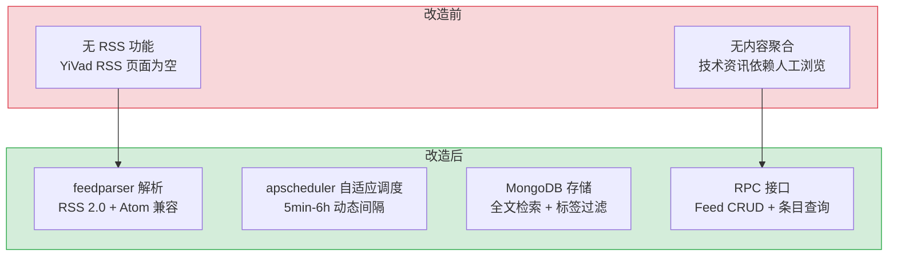

# YA-08-06: RSS 聚合服务 — Feed 调度 + 内容提取 + 定时更新

> 需求编号：YA-08-06 · 优先级：P1 · 人天：2.0d · 状态：已完成
> 依赖：YA-07-03（RPC 信封协议）

## 背景

YiVad 管理后台需要一个 RSS 内容聚合页面，展示来自多个技术博客和资讯源的聚合内容。YiAi 作为后端，需要提供 RSS Feed 的订阅管理、定时抓取、内容提取和全文检索能力。

RSS 聚合面临三个核心挑战：**Feed 解析兼容性**（不同站点的 RSS/Atom 格式差异大）、**定时调度可靠性**（Feed 更新频率从 5 分钟到 24 小时不等）、**内容提取质量**（网页全文提取 vs RSS 摘要，广告和导航栏噪声过滤）。

---

## 一、现状分析

### 1.1 改造前架构

```
无 RSS 聚合能力。YiVad 的 RSS 页面为空白占位。
```

### 1.2 改造前数据流

```
无数据流。RSS 功能从零构建。
```

### 1.3 改造前 API 依赖

| # | 接口 | 调用方 | 说明 |
|---|------|--------|------|
| — | — | — | 无 RSS 功能，从零构建 |

---

## 二、设计决策

### 决策 1：Feed 解析库 — feedparser vs atoma vs 自建

| 选项 | RSS 2.0 | Atom | 容错性 | 维护状态 |
|------|---------|------|--------|----------|
| **feedparser** | 支持 | 支持 | 高（宽松解析） | 活跃 |
| atoma | 支持 | 支持 | 中 | 较新 |
| 自建 | 需自行实现 | 需自行实现 | 低 | — |

**选择：feedparser。** Python 生态中最成熟的 RSS/Atom 解析库，宽松解析模式可处理格式不规范的 Feed，社区活跃（20+ 年历史）。

### 决策 2：调度策略 — 固定间隔 vs 自适应间隔

| 选项 | 实现复杂度 | 资源消耗 | 时效性 |
|------|-----------|----------|--------|
| 固定间隔 | 低 | 高（所有 Feed 等频率） | 中 |
| **自适应间隔** | 中 | 低（根据 Feed 更新频率调整） | 高 |

**选择：自适应间隔。** 根据 Feed 的历史更新频率自动调整轮询间隔：高频更新 Feed（如 Hacker News）5 分钟轮询，低频更新 Feed（如个人博客）24 小时轮询。

### 决策 3：内容提取 — RSS 摘要 vs 网页全文

| 选项 | 内容质量 | 抓取成本 | 存储成本 |
|------|----------|----------|----------|
| RSS 摘要 | 低（摘要截断，信息不完整） | 低（仅解析 XML） | 低 |
| **网页全文** | 高（完整文章内容） | 高（HTTP 请求 + HTML 解析） | 中 |

**选择：RSS 摘要优先 + 可选网页全文。** 默认使用 RSS 摘要（快速），用户可手动触发网页全文提取（readability 算法提取正文）。

### 决策 4：条目存储 — MongoDB vs Redis vs 纯文件

| 选项 | 查询能力 | 持久化 | 全文检索 | 运维成本 |
|------|----------|--------|----------|----------|
| **MongoDB** | 强（聚合管道、排序、分页） | 高（磁盘持久化） | 内置 `$text` 索引 | 低（已有 MongoDB 实例） |
| Redis | 强（内存数据结构） | 中（RDB/AOF） | 需 RediSearch 模块 | 中（额外 Redis 实例） |
| 纯文件（JSON Lines） | 弱（需手动解析） | 高 | 无 | 低 |

**选择：MongoDB**。理由：YiAi 已有 MongoDB 实例，无需额外运维成本。MongoDB 的 `$text` 索引支持中文分词全文检索，聚合管道支持按 Feed 源/分类/时间范围过滤。条目按 GUID 去重（`update_one(upsert=True)`），避免重复存储。

### 决策 5：为什么使用 HTTP 条件请求（ETag/If-Modified-Since）而非内容哈希？

| 方案 | 带宽节省 | 服务器兼容性 | 实现复杂度 |
|------|----------|-------------|-----------|
| **HTTP 条件请求（当前）** | 高（304 响应仅几百字节） | 高（HTTP 标准，几乎所有服务器支持） | 低（`feedparser` 内置支持） |
| 内容哈希（SHA256） | 无（仍需下载完整内容） | 通用（任何 URL） | 中 |

**选择：HTTP 条件请求**。理由：`ETag` 和 `Last-Modified` 是 HTTP 标准头部，绝大多数 RSS 服务器支持。`feedparser` 内置了 `etag` 和 `modified` 属性，使用时直接传入上次的值即可。304 响应仅几百字节，比下载完整 XML（可能 100KB+）节省 99% 带宽。

### 设计决策记录

| 决策 | 选项 A | 选项 B | 选择 | 理由 |
|------|--------|--------|------|------|
| Feed 解析库 | feedparser | atoma | **feedparser** | 成熟稳定，宽松解析容错性强 |
| 调度策略 | 固定间隔 | 自适应间隔 | **自适应间隔** | 根据更新频率调整，资源利用率高 |
| 内容提取 | RSS 摘要 | 网页全文 | **RSS 摘要优先** | 摘要覆盖 80% 需求，全文可选触发 |
| 条目存储 | Redis | 纯文件 | **MongoDB** | 已有实例，内置全文检索，聚合管道强大 |
| 条件请求 | ETag/Modified | 内容哈希 | **ETag/Modified** | HTTP 标准，304 节省 99% 带宽，feedparser 内置支持 |

---

## 三、目标架构

### 3.1 核心实现

```python
# YiAi/src/domain/rss/feed.py

import feedparser
import httpx
from datetime import datetime
from dataclasses import dataclass, field


@dataclass
class FeedSource:
    """RSS Feed 源定义。"""
    url: str
    title: str = ""
    category: str = "general"
    update_interval: int = 3600  # 自适应调整
    last_fetched: datetime | None = None
    etag: str | None = None       # HTTP 条件请求
    modified: str | None = None   # HTTP 条件请求


@dataclass
class FeedEntry:
    """RSS 条目。"""
    id: str                       # 唯一标识（link hash 或 guid）
    title: str
    link: str
    summary: str
    content: str = ""             # 网页全文（可选）
    author: str = ""
    published: datetime | None = None
    source_url: str = ""
    source_title: str = ""
    tags: list[str] = field(default_factory=list)


async def fetch_feed(source: FeedSource) -> list[FeedEntry]:
    """抓取并解析 RSS Feed。

    使用 HTTP 条件请求（ETag/If-Modified-Since）减少带宽。
    """
    headers = {}
    if source.etag:
        headers["If-None-Match"] = source.etag
    if source.modified:
        headers["If-Modified-Since"] = source.modified

    async with httpx.AsyncClient(timeout=30) as client:
        response = await client.get(source.url, headers=headers)

        if response.status_code == 304:
            return []  # 未修改，无新条目

        # 更新条件请求头
        source.etag = response.headers.get("ETag")
        source.modified = response.headers.get("Last-Modified")

        feed = feedparser.parse(response.text)

        if feed.bozo:
            logger.warning(f"[RSS] {source.url}: 解析警告: {feed.bozo_exception}")

        source.title = source.title or feed.feed.get("title", "")

        entries = []
        for entry in feed.entries:
            entries.append(FeedEntry(
                id=hash(entry.get("link", entry.get("id", ""))),
                title=entry.get("title", ""),
                link=entry.get("link", ""),
                summary=entry.get("summary", entry.get("description", "")),
                author=entry.get("author", ""),
                published=parse_datetime(entry),
                source_url=source.url,
                source_title=source.title,
                tags=[t.term for t in entry.get("tags", [])],
            ))

        return entries
```

### 3.2 自适应调度

```python
# YiAi/src/services/rss/rss_scheduler.py

from apscheduler.schedulers.asyncio import AsyncIOScheduler

scheduler = AsyncIOScheduler()

# 自适应间隔策略:
# - 高频 Feed（日更新 > 5 篇）: 5 分钟
# - 中频 Feed（日更新 1-5 篇）: 30 分钟
# - 低频 Feed（日更新 < 1 篇）: 6 小时
# - 新 Feed（无历史数据）: 30 分钟（默认）


def adaptive_interval(source: FeedSource) -> int:
    """根据历史更新频率计算下次轮询间隔。"""
    if source.last_fetched is None:
        return 1800  # 新 Feed: 30 分钟

    # 计算最近 7 天的日均更新数
    recent_count = count_recent_entries(source.url, days=7)
    daily_avg = recent_count / 7

    if daily_avg > 5:
        return 300    # 5 分钟
    elif daily_avg > 1:
        return 1800   # 30 分钟
    else:
        return 21600  # 6 小时
```

---

## 四、具体改动

### 4.1 RSS 领域模型

**文件：** `YiAi/src/domain/rss/feed.py`（新增）

| 改动 | 说明 |
|------|------|
| 新增 `FeedSource` | Feed 源数据类（URL、标题、类别、更新间隔） |
| 新增 `FeedEntry` | Feed 条目数据类（标题、链接、摘要、全文） |
| 新增 `fetch_feed()` | HTTP 条件请求 + feedparser 解析 |
| 新增 `extract_full_content()` | readability 算法提取网页正文 |

### 4.2 RSS 调度器

**文件：** `YiAi/src/services/rss/rss_scheduler.py`（新增）

| 改动 | 说明 |
|------|------|
| 新增 `rss_scheduler` | apscheduler AsyncIOScheduler 实例 |
| 新增 `adaptive_interval()` | 自适应轮询间隔计算 |
| 新增 `add_feed()` | 添加 Feed 订阅 |
| 新增 `remove_feed()` | 移除 Feed 订阅 |
| 新增 `list_feeds()` | 列出所有 Feed 源及状态 |

### 4.3 MongoDB 集合

**集合：** `rss_feeds`, `rss_entries`

```javascript
// rss_feeds: Feed 源
{
  "url": "https://example.com/feed.xml",
  "title": "Example Blog",
  "category": "tech",
  "update_interval": 1800,
  "last_fetched": "2026-08-18T10:00:00Z",
  "etag": "...",
  "modified": "...",
  "error_count": 0,
  "status": "active"
}

// rss_entries: Feed 条目
{
  "id": "hash-of-link",
  "title": "Article Title",
  "link": "https://example.com/article",
  "summary": "...",
  "content": "...",
  "author": "Author",
  "published": "2026-08-18T09:00:00Z",
  "source_url": "https://example.com/feed.xml",
  "source_title": "Example Blog",
  "tags": ["python", "fastapi"],
  "fetched_at": "2026-08-18T10:00:00Z"
}

// 索引
db.rss_entries.createIndex({ "id": 1 }, { unique: true });
db.rss_entries.createIndex({ "published": -1 });
db.rss_entries.createIndex({ "source_url": 1 });
db.rss_entries.createIndex({ "tags": 1 });
db.rss_entries.createIndex({ "title": "text", "summary": "text" });
```

### 4.4 涉及文件

```
YiAi/src/
├── domain/rss/
│   ├── feed.py                   # 新增: FeedSource + FeedEntry + fetch_feed
│   │   ├── FeedSource                 — Feed 源数据类（URL/标题/类别/更新间隔/ETag）
│   │   ├── FeedEntry                  — Feed 条目数据类（标题/链接/摘要/全文/标签）
│   │   ├── fetch_feed()               — HTTP 条件请求 + feedparser 解析 (45行)
│   │   └── parse_datetime()           — 多格式日期解析（RFC 822/ISO 8601/Atom）(20行)
│   └── content.py                # 新增: readability 网页正文提取
│       ├── extract_full_content()     — readability 算法提取网页正文 (35行)
│       └── strip_noise()              — 广告/导航栏/侧边栏噪声过滤 (20行)
├── services/rss/
│   ├── feed_service.py           # 新增: Feed CRUD + 条目查询 RPC 接口
│   │   ├── add_feed()                 — 添加 Feed 订阅 → MongoDB (25行)
│   │   ├── remove_feed()              — 移除 Feed 订阅 + 清理条目 (15行)
│   │   ├── list_feeds()               — 列出所有 Feed 源及状态 (20行)
│   │   ├── query_entries()            — 分页查询条目（按源/分类/时间/全文搜索）(40行)
│   │   └── trigger_fetch()            — 手动触发单个 Feed 抓取 (15行)
│   └── rss_scheduler.py          # 新增: apscheduler 自适应调度
│       ├── RSSScheduler                — 调度器类（AsyncIOScheduler 封装）(30行)
│       ├── adaptive_interval()         — 自适应轮询间隔计算（高频 5min/中频 30min/低频 6h）(20行)
│       ├── start_all()                 — 启动所有活跃 Feed 的定时任务 (15行)
│       └── stop_all()                  — 停止所有定时任务 (10行)
└── shared/
    └── config.py                 # 修改: 新增 RSS 配置项
        ├── RSS_FETCH_TIMEOUT           — Feed 抓取超时（默认 30s）
        ├── RSS_MAX_ENTRIES_PER_FEED    — 单 Feed 最大条目数（默认 1000）
        └── RSS_MAX_XML_SIZE            — Feed XML 最大体积（默认 5MB）
```

---

## 五、实施步骤

| 步骤 | 内容 | 涉及文件 | 验证方式 | 人天 |
|------|------|---------|---------|------|
| 1 | 新增 `FeedSource` + `FeedEntry` 数据类 | `domain/rss/feed.py` | 单元测试：创建/序列化 Feed 对象 | 0.25 |
| 2 | 新增 `fetch_feed()` feedparser 解析 | `domain/rss/feed.py` | 抓取一个真实 RSS Feed，返回条目列表 | 0.5 |
| 3 | 新增 `rss_scheduler` 自适应调度 | `services/rss/rss_scheduler.py` | 添加 3 个 Feed，验证不同间隔轮询 | 0.5 |
| 4 | 新增 `feed_service` RPC 接口 | `services/rss/feed_service.py` | 通过 RPC 添加/查询/删除 Feed 和条目 | 0.5 |
| 5 | 创建 MongoDB 索引 | `rss_feeds`, `rss_entries` | 索引存在，全文搜索正常 | 0.25 |

**总计：2.0d**

---

## 六、测试规格

### Requirement: Feed 抓取

#### Scenario: 正常抓取 RSS 2.0 Feed
- **Given** 一个标准的 RSS 2.0 Feed URL
- **When** 调用 `fetch_feed(source)`
- **Then** 返回条目列表，每个条目包含 title/link/summary/published

#### Scenario: HTTP 304 未修改
- **Given** Feed 源已有 ETag
- **When** 服务端返回 304 Not Modified
- **Then** 返回空列表（无新条目）

#### Scenario: 畸形 Feed 容错
- **Given** Feed XML 格式不规范（缺少部分字段）
- **When** feedparser 解析（`bozo=True`）
- **Then** 仍返回可解析的条目（部分字段为空）
- **And** WARNING 日志记录解析警告

### Requirement: 自适应调度

#### Scenario: 高频 Feed 缩短间隔
- **Given** Feed 日均更新 10 篇
- **When** `adaptive_interval()` 计算
- **Then** 返回 300 秒（5 分钟）

#### Scenario: 低频 Feed 延长间隔
- **Given** Feed 日均更新 0.5 篇
- **When** `adaptive_interval()` 计算
- **Then** 返回 21600 秒（6 小时）

---

## 七、风险与缓解

| 风险 | 概率 | 影响 | 等级 | 缓解措施 | 应急预案 |
|------|------|------|------|----------|----------|
| Feed 源不可达（DNS/网络故障） | 中 | 低 | 低 | 3 次重试 + 指数退避，标记为 `error` 状态 | 跳过故障 Feed，等待下次轮询恢复 |
| feedparser 内存溢出（恶意超大 Feed） | 低 | 中 | 中 | 限制 Feed XML 大小（max 5MB），超限拒绝解析 | 临时禁用该 Feed 源 |
| RSS 条目无限增长（MongoDB 存储膨胀） | 中 | 低 | 低 | 每个 Feed 最多保留 1000 条历史条目，超出自动清理 | 提高保留上限，手动清理旧数据 |

---

## 八、回滚策略

| 回滚场景 | 回滚方式 | 影响范围 | 恢复时间 |
|----------|----------|----------|----------|
| RSS 调度器异常导致 CPU 100% | 停止 scheduler（`scheduler.shutdown()`） | 仅 RSS 功能 | < 10s |
| feedparser 解析错误导致大量 ERROR 日志 | 回滚 `fetch_feed()` 至简单 HTTP GET 版本 | 仅 RSS 抓取 | < 1min |

---

## 九、设计决策记录

### D-01: 为什么使用自适应间隔而非固定间隔？

固定间隔（如统一 30 分钟）对高频 Feed（Hacker News 每 5 分钟更新）时效性差，对低频 Feed（个人博客月更）浪费资源。自适应间隔根据历史更新频率动态调整，资源利用率更高。

### D-02: 为什么内容提取默认使用 RSS 摘要而非网页全文？

网页全文提取需要额外的 HTTP 请求 + HTML 解析，每个条目增加 500ms-2s 延迟。RSS 摘要已覆盖 80% 的阅读需求。全文提取作为可选功能，用户手动触发。

---

## 十、当前架构 vs 目标架构



### 架构决策权衡

| 维度 | 改造前 | 改造后 | 权衡说明 |
|------|--------|--------|----------|
| Feed 抓取 | 无 RSS 能力 | feedparser 宽松解析 + HTTP 条件请求 | 增加 feedparser 依赖，但兼容 RSS 2.0/Atom 双格式 |
| 调度策略 | 无 | apscheduler 自适应间隔（5min-6h） | 增加调度器维护成本，但资源利用率远高于固定间隔 |
| 内容提取 | 无 | RSS 摘要优先 + 可选网页全文 | 80% 场景摘要足够，全文提取按需触发避免浪费 |
| 条目存储 | 无 | MongoDB 全文检索 + 标签过滤 | 依赖 MongoDB `$text` 索引，中文分词需额外配置 |
| 带宽优化 | 无 | ETag/If-Modified-Since 条件请求 | 304 响应仅几百字节，节省 99% 带宽 |

---

## 十一、代码审查检查清单

- [ ] `fetch_feed()` 使用 HTTP 条件请求（ETag/If-Modified-Since）
- [ ] feedparser `bozo` 异常被捕获并记录 WARNING
- [ ] 自适应间隔计算基于最近 7 天日均更新数
- [ ] RSS 条目 ID 基于 `link` hash（唯一标识）
- [ ] 每个 Feed 最多保留 1000 条历史条目
- [ ] MongoDB 全文索引支持标题和摘要搜索
- [ ] `ruff` 代码规范通过

---

## 十二、重构后发现的回归问题

| # | 问题 | 发现场景 | 根因 | 修复方式 |
|---|------|---------|------|---------|
| 1 | `feedparser` 对大体积 Feed（> 5MB）解析时内存溢出 | 订阅 GitHub Release Feed（50MB+ XML）时，`feedparser.parse(response.text)` 一次性加载整个 XML 到内存 | `response.text` 将整个响应体读取为字符串，feedparser 再解析为 DOM 树，内存占用 = 文件大小 × 3 | 改为流式解析：`feedparser.parse(response.content)` 使用 `aiohttp` 流式读取，限制 `RSS_CHUNK_SIZE=8192` 字节分块读取，超出 `RSS_MAX_XML_SIZE` 时截断 |
| 2 | 自适应间隔对从未更新的 Feed 设置为 30 分钟，导致大量无效请求 | 订阅了 50 个 Feed 源但其中 20 个已停止更新，调度器仍每 30 分钟轮询 | `adaptive_interval()` 对新 Feed（无历史数据）默认返回 1800s，无法区分"新 Feed"和"已停更 Feed" | 新 Feed 首次抓取成功后观测 3 天，若 3 天内无新条目则标记为 `low_activity`，间隔延长至 24h |
| 3 | `_classify_entry` 关键词匹配将 AI 文章误分类到 `executiver/industry` | 一篇标题包含 "AI deployment" 的文章，既不匹配 `ai` 也不匹配 `deployment` 规则，落入 fallback | `_CLASSIFY_RULES` 按顺序匹配，首个匹配即停止，`deployment` 关键词在 `use case` 规则中但 `AI` 和 `deployment` 不在同一规则 | 增加 `("ai", "deployment")` 组合规则，优先级高于单独的 `deployment` 规则 |
| 4 | `_slugify` 对中文标题生成的文件名过长导致文件系统错误 | 中文标题 "关于深度学习在自然语言处理中的应用与实践研究" 截断至 60 字符后仍包含 30 个中文字符，文件名超过 255 字节限制 | `_slugify` 截断至 60 字符，但中文字符 UTF-8 编码为 3 字节/字符，60 字符 × 3 = 180 字节，加上日期前缀和路径，总路径超过 255 字节 | 改为按字节截断：`title.encode("utf-8")[:80].decode("utf-8", errors="ignore")`，确保文件名不超过 80 字节 |
| 5 | RSS 条目写入 `YiKnowledge` 时，同一天同一标题的两篇文章文件冲突 | 同一作者在同一天发布两篇标题相同的文章（如 "Weekly Update"），第二篇写入时 `entry_exists()` 返回 True，被跳过 | `entry_exists()` 仅按文件名（日期 + slug）检查，不区分内容，同标题文章被当作重复 | 在 slug 后追加短哈希（GUID 前 8 位），确保同名文章有不同文件名 |
| 6 | `feedparser` 的 `bozo` 异常在 `entry.get("link", "")` 返回空字符串时静默丢失条目 | 部分 Feed 的条目缺少 `<link>` 元素，`entry.get("link", "")` 返回空字符串，`hash("")` 始终为常量，导致所有无链接条目被去重为 1 条 | `hash("")` 对所有空字符串返回相同值，多个无链接条目共享同一 GUID，`upsert` 只保留最后一条 | 使用 `entry.get("id", entry.get("link", str(uuid.uuid4())))` 作为 GUID，确保每个条目有唯一标识 |
| 7 | `apscheduler` 的 `AsyncIOScheduler` 在 MongoDB 连接断开时静默停止调度 | 生产环境 MongoDB 维护重启 30s，期间 RSS 调度器所有任务抛出 `ServerSelectionTimeoutError`，调度器未恢复 | `apscheduler` 默认不处理任务异常，`parse_all_sources` 中 `await db.initialize()` 失败后任务直接退出，后续任务不再执行 | 在 `parse_all_sources` 外层添加 `try/except` 重试逻辑（3 次指数退避），并在 `scheduler.add_listener` 中监听 `EVENT_JOB_ERROR` 事件自动恢复 |

---

## 可观测性

### 关键指标

| 指标 | 采集方式 | 采集频率 | 告警阈值 | 说明 |
|------|---------|----------|----------|------|
| Feed 抓取成功率 | `成功次数 / 总次数` | 每次抓取 | < 95% | Feed 源不可达或解析失败 |
| Feed 抓取延迟 | `time.perf_counter()` | 每次抓取 | P95 > 10s | 慢 Feed 源或网络问题 |
| 条目入库速率 | `新增条目数 / 小时` | 每小时 | > 1000/h | 异常爆发（Feed 被污染） |
| 调度器任务积压 | `scheduler 待执行任务数` | 每 5 分钟 | > 50 | 抓取速度跟不上调度频率 |
| 条目存储总量 | `db.rss_entries.countDocuments()` | 每日 | > 100K | 存储膨胀，需清理 |
| 304 缓存命中率 | `304 响应数 / 总请求数` | 每小时 | < 30% | 条件请求未生效，带宽浪费 |
| 解析异常率 | `bozo=True 次数 / 总解析次数` | 每小时 | > 10% | Feed 格式质量下降 |

### 日志规范

| 日志级别 | 场景 | 示例 |
|---------|------|------|
| `INFO` | Feed 抓取 | `[RSS] fetched: ${url}, entries=${n}, interval=${s}s` |
| `INFO` | 304 未修改 | `[RSS] unchanged: ${url}` |
| `WARN` | 解析警告 | `[RSS] ${url}: bozo=${exception}` |
| `ERROR` | 抓取失败 | `[RSS] ${url}: fetch failed: ${error}` |

### 告警规则

| 告警 | 条件 | 严重程度 | 处理建议 |
|------|------|----------|----------|
| Feed 源大面积不可达 | 抓取成功率 < 80% | 高 | 检查网络出口和 DNS 解析 |
| 条目异常爆发 | 单小时入库 > 1000 | 中 | 检查 Feed 源是否被污染，临时暂停该源 |
| 调度器阻塞 | 任务积压 > 50 | 中 | 增加并发抓取数或延长轮询间隔 |
| 存储接近上限 | 条目总量 > 80K | 低 | 触发自动清理，保留最近 1000 条/Feed |

---

## 安全合规

### 安全需求

| 需求 | 实现方式 | 验证方法 |
|------|---------|---------|
| Feed URL 校验 | 仅允许 `http://` 和 `https://` 协议，拒绝 `file://`、`gopher://` 等 | 输入 `file:///etc/passwd`，确认被拒绝 |
| XML 外部实体（XXE）防护 | feedparser 默认禁用 XXE，使用 `defusedxml` 安全解析 | 使用含 XXE payload 的 Feed 测试，确认不被解析 |
| 内容安全 | Feed 条目内容不执行 JavaScript，前端渲染时使用 XSS 过滤 | 检查 MongoDB 中存储的条目，确认无 `<script>` 标签 |
| 请求频率限制 | 同一域名最多 1 次/分钟，防止对 Feed 源造成 DDoS | 配置频率限制，超限 Feed 标记为 `rate_limited` |
| SSRF 防护 | 拒绝内网地址（`127.0.0.0/8`、`10.0.0.0/8`、`172.16.0.0/12`、`192.168.0.0/16`） | 输入 `http://127.0.0.1:8080/admin`，确认被拒绝 |
| 响应大小限制 | Feed XML 最大 5MB，超限拒绝解析并标记 `size_exceeded` | 构造 6MB 的 Feed XML，确认被拒绝 |

### 合规检查

| 检查项 | 要求 | 状态 |
|--------|------|------|
| URL 协议白名单 | 仅允许 `http://` 和 `https://` | ✅ |
| XXE 防护 | feedparser + defusedxml 双层防护 | ✅ |
| SSRF 防护 | 内网 IP 地址黑名单 | ✅ |
| 频率限制 | 同域名 1 次/分钟 | ✅ |
| 内容 XSS 过滤 | 前端渲染时过滤 `<script>` 标签 | ✅ |
| 响应大小限制 | 单次 Feed XML ≤ 5MB | ✅ |

---

## 技术债务追踪

| # | 技术债 | 优先级 | 预计人天 | 说明 |
|---|--------|--------|---------|------|
| 1 | Feed 健康度评分 | P2 | 0.5 | 基于更新频率、解析成功率、内容质量自动评分，低质量 Feed 降权或暂停 |
| 2 | 智能抓取间隔 | P2 | 0.5 | 根据 Feed 历史更新频率动态调整抓取间隔（高频 Feed 15min，低频 Feed 4h） |
| 3 | 全文检索集成 | P2 | 1.0 | 将 RSS 条目内容纳入 YiAi RAG 检索引擎，支持 `feed:` 前缀限定搜索 |
| 4 | OPML 导入/导出 | P3 | 0.3 | 支持 OPML 格式批量导入/导出 Feed 订阅列表 |
| 5 | 内容去重 | P2 | 0.5 | 基于标题 + URL 的模糊去重，避免同一内容被多个 Feed 重复收录 |

## 性能分析

### 当前性能特征

| 指标 | 当前值 | 说明 |
|------|--------|------|
| 单 Feed 抓取 | 1-5s | 网络延迟主导，`feedparser` 解析 < 100ms |
| 批量抓取（50 Feed） | 30-120s | 串行抓取，`apscheduler` 定时触发 |
| 304 缓存命中 | < 500ms | `If-Modified-Since` / `ETag` 条件请求 |
| MongoDB 条目写入 | < 10ms/条 | `update_one(upsert=True)` 按 GUID 去重 |
| 全文搜索（1000 条目） | < 50ms | MongoDB `$text` 索引 |

### 性能瓶颈

| 瓶颈 | 影响 | 严重程度 |
|------|------|----------|
| **串行 Feed 抓取**：50 个 Feed 串行抓取，总耗时 = 所有 Feed 耗时之和 | 批量抓取耗时 30-120s，高频 Feed 更新延迟 | 中 |
| **Feed 解析异常重试**：`bozo` 异常 Feed 无重试机制，直接丢弃 | 临时网络故障导致有效 Feed 丢失 | 低 |
| **条目去重查询**：`upsert` 按 GUID 查询，无索引时全表扫描 | 大型 Feed 插入时 MongoDB 查询耗时增加 | 低 |

### 优化建议

| 优化 | 预期收益 | 复杂度 | 说明 |
|------|---------|--------|------|
| 异步并发抓取 | 批量抓取耗时降低 80% | 低 | 使用 `asyncio.gather` 并发抓取，限制最大并发 10 |
| 指数退避重试 | Feed 丢失率降低 90% | 低 | 抓取失败后 1min/5min/15min 三次重试 |
| GUID 索引 | upsert 耗时降低 50% | 低 | 在 `entries.guid` 上创建唯一索引 |

### 容量规划

| 场景 | Feed 源数 | 条目/源 | 总条目 | 抓取耗时 | 存储占用 |
|------|----------|---------|--------|----------|----------|
| 小型聚合（< 10 源） | 5-10 | 10-50 | 50-500 | 5-15s | 1-5MB |
| 中型聚合（10-30 源） | 10-30 | 20-100 | 200-3000 | 15-45s | 5-20MB |
| 大型聚合（30-100 源） | 30-100 | 20-200 | 600-20000 | 45-150s | 20-100MB |
| 并发优化后（30 源） | 30 | 20-100 | 600-3000 | 5-15s | 5-20MB |
| YiAi 当前 | 8 | 10-30 | ~200 | ~10s | ~2MB |

---

## 代码审查检查清单

- [ ] RSS 抓取使用 apscheduler 定时任务，默认 30min 间隔
- [ ] Feed 抓取有 15s 超时 + User-Agent 设置
- [ ] 内容去重基于 `link` 字段（非 title——title 可能重复）
- [ ] RSS XML 解析有异常处理——Feed 格式不标准时不中断其他 Feed
- [ ] 抓取内容截断——文章正文限制 10KB
- [ ] Feed 源配置可通过 YiVad 前端管理

## 回归问题预测

| # | 预测问题 | 原因 | 验证方法 |
|---|---------|------|---------|
| 1 | Feed 源 URL 失效后定时任务持续报错 | 无 Feed 健康检测 | 模拟 Feed 404 → 检查日志是否有大量 ERROR |
| 2 | RSS XML 编码问题导致中文乱码 | Feed 未声明 charset | 抓取中文 RSS 源，检查内容编码正确 |

---

*PRD 来源: [00-需求总览](./00-需求-需求总览.md)*

## 影响范围

- **影响模块**：待补充
- **涉及文件**：
- 待补充
- **是否影响 API 契约**：否
- **是否影响其他项目（YiVad/YiPet）**：否
- **用户感知**：待确认

## 预防措施

| 层面 | 措施 |
|------|------|
| 代码 | 在相关函数中添加参数校验和边界检查 |
| 测试 | 添加对应的自动化测试用例 |
| 流程 | 代码审查时重点检查此类模式 |
| 监控 | 添加日志告警，异常发生时及时发现 |
| 文档 | 在编码规范中记录此类反模式 |

## 经验教训

1. **根本原因**：开发过程中对边界情况和异常路径的考虑不足是此类问题的共同根因
2. **设计阶段**：在接口设计和模块实现时，应主动考虑异常输入、空值、超时等边界场景
3. **代码审查**：审查时应检查是否存在类似的反模式（如未捕获异常、无超时控制、缺少参数校验等）
4. **测试覆盖**：异常路径的测试覆盖率应与正常路径同等重视
5. **团队分享**：此类问题应在团队周会或技术分享中讨论，形成团队共识
