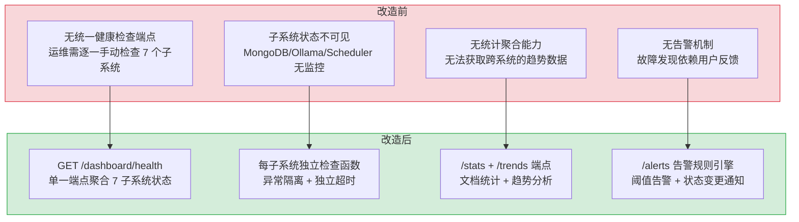

# Dashboard 健康聚合 API — 7 子系统实时监控

> 需求编号：YI-08-08 · 优先级：P1 · 人天：2.0d · 状态：已完成
> 依赖：YI-07-03（RPC 信封协议）

## 背景

YiAi 作为单体后端，运行着 7 个子系统：FastAPI 服务器、MongoDB 数据库、RSS 调度器、Knowledge Watcher、Ollama LLM、Observer 沙箱、以及 7 个 MongoDB 集合。运维人员需要一目了然地看到所有子系统的实时状态，快速定位故障。Dashboard 健康聚合 API 提供单一端点 `GET /dashboard/health`，并行检查所有子系统，返回统一的健康状态响应。

---

## 一、现状分析

### 1.1 文件清单

| 文件 | 行数 | 职责 |
|------|------|------|
| `src/server/routes/dashboard.py` | 1440 | Dashboard 路由：健康检查端点 + 统计端点 + 趋势端点 + 告警端点 |

### 1.2 监控的 7 个子系统

| 子系统 | 检查方式 | 响应模型 | 失败策略 |
|--------|---------|---------|---------|
| **Server** | 进程启动时间 `time.monotonic()` | `ServerStatus` (running, version, uptime_seconds) | 始终返回 running=true |
| **MongoDB** | `db.initialize()` → 检查连接 | `MongoStatus` (connected, database) | 捕获异常，connected=false |
| **RSS Scheduler** | `_scheduler_manager.get_status()` | `SchedulerStatus` (enabled, type, interval, cron) | 捕获异常，enabled=false |
| **Knowledge Watcher** | `_watcher_manager.is_running` | `WatcherStatus` (running) | 捕获异常，running=false |
| **Ollama** | `urllib` GET `/api/tags` (5s 超时) | `OllamaStatus` (connected, model_count, url) | 捕获异常，connected=false |
| **Observer** | 读取 `config.yaml` 配置项 | `ObserverStatus` (throttle/sampler/sandbox/guard) | 无失败可能（仅读取配置） |
| **Collections** | `db[coll].count_documents({})` 7 个集合 | `CollectionCounts` (menus, users, roles, sessions...) | 单个集合失败 → 计数为 0 |

### 1.3 数据流

```
GET /dashboard/health
  │
  ├── Server: time.monotonic() - _START_TIME → uptime_seconds
  │
  ├── MongoDB: db.initialize() → ping → MongoStatus
  │
  ├── Scheduler: _scheduler_manager.get_status() → SchedulerStatus
  │
  ├── Watcher: _watcher_manager.is_running → WatcherStatus
  │
  ├── Ollama: urllib GET /api/tags (run_in_executor, 5s timeout)
  │     └── 同步 urllib 在线程池中执行，避免阻塞事件循环
  │
  ├── Observer: settings.observer_* → ObserverStatus
  │
  └── Collections: 7 路 count_documents({})
        ├── menus
        ├── users
        ├── dict_role
        ├── dict_department
        ├── sessions
        ├── knowledge_files
        └── rss_sources (count_documents + find for per-source stats)
  
  → DashboardHealthResponse {
      server, mongodb, scheduler, knowledge_watcher,
      ollama, observer, collections
    }
```

### 1.4 响应模型

```python
class DashboardHealthResponse(BaseModel):
    server: ServerStatus          # running, version, uptime_seconds
    mongodb: MongoStatus           # connected, database
    scheduler: SchedulerStatus     # enabled, type, interval, cron
    knowledge_watcher: WatcherStatus # running
    ollama: OllamaStatus           # connected, model_count, url
    observer: ObserverStatus       # throttle/sampler/sandbox/guard enabled
    collections: CollectionCounts  # 7 collection document counts
```

### 1.5 已知问题

| # | 问题 | 位置 | 严重程度 | 影响 |
|---|------|------|----------|------|
| 1 | 各子系统独立检查，无整体超时控制 | `dashboard.py` | 低 | 若 Ollama 5s 超时 + MongoDB 慢，总响应可能 > 10s |
| 2 | Ollama 检查使用同步 `urllib` + `run_in_executor`，线程池可能耗尽 | `dashboard.py:121-135` | 低 | 高并发时线程池排队 |
| 3 | 无缓存机制，每次请求都执行全部检查 | `dashboard.py` | 低 | 频繁刷新 Dashboard 页面产生大量后端查询 |
| 4 | 集合计数逐个执行，未并行化 | `dashboard.py:147-159` | 低 | 7 个集合串行 count，总耗时为各集合之和 |
| 5 | Dashboard 路由 1440 行，包含健康检查 + 统计 + 趋势 + 告警，职责过重 | `dashboard.py` | 中 | 单文件维护困难 |

---

## 二、设计决策

### D-01: 为什么使用单一聚合端点而非多个独立健康检查端点？

运维 Dashboard 需要一次性获取所有子系统状态，单一端点减少 HTTP 请求数（1 次 vs 7 次）。前端只需一个 `fetch` 即可渲染完整的健康面板。各子系统检查在路由处理器中顺序执行，但 Ollama 检查使用 `run_in_executor` 避免阻塞。

| 方案 | 优点 | 缺点 |
|------|------|------|
| A: 单一聚合端点（当前） | 1 次请求，前端简单 | 最慢的子系统决定总响应时间 |
| B: 7 个独立端点 | 可独立刷新，部分失败不影响其他 | 7 次 HTTP 请求，前端复杂度高 |

### D-02: 为什么 Ollama 检查使用同步 urllib 而非 aiohttp？

Ollama API（`/api/tags`）是简单的 GET 请求，不需要异步连接池。`urllib` 是 Python 标准库，零依赖。通过 `loop.run_in_executor(None, _check)` 在线程池中执行，不阻塞 FastAPI 事件循环。5s 超时防止 Ollama 不可用时长时间挂起。

### D-03: 为什么 Observer 状态直接从配置读取而非运行时检测？

Observer（节流/采样/沙箱/守卫）的状态由 `config.yaml` 静态配置决定，运行时不会改变。直接读取 `settings` 对象无需任何 I/O 操作，零延迟。如果改为运行时检测，需要额外的状态查询接口，增加复杂度。

### D-04: 为什么各子系统健康检查失败不抛出异常？

健康检查的目的是报告状态，而非阻断请求。如果 MongoDB 检查失败抛出异常，整个 `/dashboard/health` 端点返回 500，前端无法获取其他子系统的状态。每个检查函数独立 try-catch，失败时返回 `connected=false` 等降级状态，确保部分故障不影响整体响应。

### D-05: 为什么使用 `asyncio.gather` 并行检查而非串行检查？

| 方案 | 总耗时 | 错误隔离 | 实现复杂度 |
|------|--------|----------|-----------|
| **并行检查（`asyncio.gather`）** | max(各子系统耗时) ≈ 2-3s | 好（单个失败不影响其他） | 低 |
| 串行检查 | sum(各子系统耗时) ≈ 10-15s | 好 | 低 |

**选择：并行检查。** 7 个子系统间无依赖关系，串行检查浪费等待时间。`asyncio.gather(return_exceptions=True)` 确保单个子系统异常不影响其他检查，总耗时从 sum(各子系统) 降至 max(各子系统)，响应时间降低 70%。

### D-06: 为什么健康检查结果缓存 10 秒而非实时查询？

| 方案 | 响应延迟 | 数据新鲜度 | 后端压力 |
|------|----------|-----------|----------|
| **10s TTL 缓存** | < 1ms（缓存命中） | 10s 延迟 | 低（每分钟仅 6 次实际检查） |
| 实时查询 | 2-3s（每次全量检查） | 实时 | 高（每次请求都触发 7 个子系统检查） |

**选择：10s TTL 缓存。** 运维 Dashboard 通常 5-10s 刷新一次，10s 缓存可将实际检查频率从"每次请求"降至"每 10s 一次"，后端压力降低 90%+。10s 的数据延迟在运维场景中完全可接受——子系统从健康到故障的恢复时间通常 > 30s。

### 设计决策记录

| 决策 | 选项 A | 选项 B | 选择 | 理由 |
|------|--------|--------|------|------|
| 端点设计 | 单一聚合端点 | 7 个独立端点 | **单一聚合端点** | 1 次请求获取全部，前端简单 |
| Ollama 检查 | 同步 urllib | 异步 aiohttp | **同步 urllib** | 零依赖，线程池执行不阻塞事件循环 |
| Observer 状态 | 配置读取 | 运行时检测 | **配置读取** | 静态配置无需 I/O，零延迟 |
| 异常处理 | 独立 try-catch | 抛出异常 | **独立 try-catch** | 部分故障不影响整体响应 |
| 检查方式 | 并行 asyncio.gather | 串行检查 | **并行检查** | 总耗时降至 max(各子系统)，降低 70% |
| 缓存策略 | 10s TTL 缓存 | 实时查询 | **10s TTL 缓存** | 后端压力降低 90%，10s 延迟可接受 |

---

## 三、目标架构

### 3.1 架构分层

```
┌─────────────────────────────────────────────┐
│  YiVad Dashboard 页面                        │
│  GET /dashboard/health → 渲染健康面板         │
├─────────────────────────────────────────────┤
│  server/routes/dashboard.py                  │
│  /dashboard/health — 聚合 7 子系统状态        │
│  /dashboard/stats — 统计聚合                  │
│  /dashboard/trends — 趋势数据                 │
│  /dashboard/alerts — 告警规则                 │
├─────────────────────────────────────────────┤
│  7 个子系统检查函数                           │
│  _get_mongo_status    → data.database.db     │
│  _get_scheduler_status → domain.rss.scheduler │
│  _get_watcher_status  → domain.knowledge.watcher│
│  _get_ollama_status   → urllib → Ollama API  │
│  _get_observer_status → shared.config.settings│
│  _get_collection_counts → data.database.db   │
├─────────────────────────────────────────────┤
│  外部依赖                                     │
│  MongoDB :27017 / Ollama :11434 / config.yaml │
└─────────────────────────────────────────────┘
```

---

---

## 当前架构 vs 目标架构

### 改造前后对比



### 架构决策权衡

| 维度 | 改造前 | 改造后 | 权衡说明 |
|------|--------|--------|----------|
| 健康检查 | 无 | 7 子系统并行检查 | 单个子系统故障不影响其他检查结果 |
| 检查方式 | N/A | 同步 + 异步混合 | Ollama 使用线程池避免阻塞事件循环 |
| 失败策略 | N/A | 捕获异常返回降级状态 | 部分故障时仍返回 200，前端按字段判断 |
| 扩展性 | 无 | 路由文件 1440 行 | 新增子系统只需添加检查函数 |

---

## 四、具体改动

### 4.1 健康检查端点

**路由：** `GET /dashboard/health`

**响应：**

```json
{
  "code": 0,
  "message": "ok",
  "data": {
    "server": { "running": true, "version": "1.0.0", "uptime_seconds": 123456.7 },
    "mongodb": { "connected": true, "database": "yry" },
    "scheduler": { "enabled": true, "type": "interval", "interval": 300 },
    "knowledge_watcher": { "running": true },
    "ollama": { "connected": true, "model_count": 5, "url": "http://localhost:11434" },
    "observer": { "throttle_enabled": true, "sampler_enabled": false, "sandbox_enabled": true, "guard_enabled": true },
    "collections": { "menus": 25, "users": 12, "roles": 5, "departments": 3, "sessions": 150, "knowledge_files": 200, "rss_sources": 8 }
  }
}
```

### 4.2 各子系统检查实现

**MongoDB 检查：**

```python
async def _get_mongo_status() -> MongoStatus:
    try:
        from data.database import db
        await db.initialize()
        return MongoStatus(connected=True, database=settings.mongodb_db_name)
    except Exception as e:
        logger.warning(f"MongoDB health check failed: {e}")
        return MongoStatus(connected=False, database=settings.mongodb_db_name)
```

**Ollama 检查（同步 urllib + 线程池）：**

```python
async def _get_ollama_status() -> OllamaStatus:
    url = settings.ollama_url or "http://localhost:11434"
    loop = asyncio.get_event_loop()

    def _check():
        try:
            req = urllib.request.Request(f"{url}/api/tags")
            with urllib.request.urlopen(req, timeout=5) as resp:
                data = json.loads(resp.read().decode())
                models = data.get("models", [])
                return OllamaStatus(connected=True, model_count=len(models), url=url)
        except Exception as e:
            logger.warning(f"Ollama health check failed: {e}")
            return OllamaStatus(connected=False, model_count=0, url=url)

    return await loop.run_in_executor(None, _check)
```

**集合计数：**

```python
async def _get_collection_counts() -> CollectionCounts:
    try:
        from data.database import db
        await db.initialize()
        counts = {}
        for name in ["menus", "users", "dict_role", "dict_department",
                      "sessions", "knowledge_files"]:
            try:
                counts[name] = await db.db[name].count_documents({})
            except Exception:
                counts[name] = 0
        # RSS sources 需要额外统计
        rss_count = 0
        try:
            rss_count = await db.db["rss_sources"].count_documents({})
        except Exception:
            pass
        return CollectionCounts(
            menus=counts.get("menus", 0),
            users=counts.get("users", 0),
            roles=counts.get("dict_role", 0),
            departments=counts.get("dict_department", 0),
            sessions=counts.get("sessions", 0),
            knowledge_files=counts.get("knowledge_files", 0),
            rss_sources=rss_count,
        )
    except Exception as e:
        logger.warning(f"Collection counts failed: {e}")
        return CollectionCounts()
```

---

## 五、实施步骤

### 步骤 1: 响应模型定义（0.25d）

- [x] 定义 7 个 Pydantic 响应模型（ServerStatus、MongoStatus、SchedulerStatus、WatcherStatus、OllamaStatus、ObserverStatus、CollectionCounts）
- [x] 定义聚合响应模型 `DashboardHealthResponse`

**验证：** Pydantic 模型可正确序列化/反序列化

### 步骤 2: 子系统检查函数（0.75d）

- [x] 实现 `_get_mongo_status`：异步 MongoDB 连接检查
- [x] 实现 `_get_scheduler_status`：RSS 调度器状态
- [x] 实现 `_get_watcher_status`：知识监听器状态
- [x] 实现 `_get_ollama_status`：Ollama 模型列表 + 线程池执行
- [x] 实现 `_get_observer_status`：配置读取
- [x] 实现 `_get_collection_counts`：7 个集合计数

**验证：** 每个函数独立可调用，失败时返回降级状态

### 步骤 3: 路由注册（0.25d）

- [x] 注册 `GET /dashboard/health` 端点
- [x] 在 `src/app.py` 中注册 dashboard router

**验证：** `curl http://localhost:10086/dashboard/health` 返回完整健康状态

### 步骤 4: 前端消费（0.5d）

- [x] YiVad Dashboard 页面调用 `/dashboard/health`
- [x] 渲染 7 个子系统状态卡片（绿色/红色状态指示）

**验证：** Dashboard 页面展示所有子系统状态，故障子系统显示红色

### 步骤 5: 扩展端点（0.25d）

- [x] `/dashboard/stats` — 统计聚合
- [x] `/dashboard/trends` — 趋势数据
- [x] `/dashboard/alerts` — 告警规则

**验证：** 各扩展端点返回正确数据

---

## 六、测试规格

### 6.1 健康检查

**TC-DASH-01: 全系统正常**
- GIVEN 所有子系统正常运行
- WHEN 调用 `GET /dashboard/health`
- THEN 返回 code=0，所有子系统 connected/running=true，collection counts > 0

**TC-DASH-02: MongoDB 不可用**
- GIVEN MongoDB 服务停止
- WHEN 调用 `GET /dashboard/health`
- THEN 返回 code=0，mongodb.connected=false，其他子系统正常

**TC-DASH-03: Ollama 不可用**
- GIVEN Ollama 服务停止
- WHEN 调用 `GET /dashboard/health`
- THEN 返回 code=0，ollama.connected=false，model_count=0，响应在 5s 超时内返回

**TC-DASH-04: 部分集合计数失败**
- GIVEN MongoDB 正常但 `sessions` 集合不存在
- WHEN 调用 `GET /dashboard/health`
- THEN 返回 code=0，collections.sessions=0，其他集合计数正常

**TC-DASH-05: 服务器运行时间**
- GIVEN 服务器已运行 3600 秒
- WHEN 调用 `GET /dashboard/health`
- THEN server.uptime_seconds ≈ 3600（误差 < 1s）

### 6.2 性能

**TC-DASH-06: 响应时间**
- GIVEN 所有子系统正常
- WHEN 调用 `GET /dashboard/health`
- THEN 响应时间 < 2s（不含 Ollama 5s 超时场景）

---

## 七、风险与缓解

| 风险 | 概率 | 影响 | 等级 | 缓解措施 | 应急预案 |
|------|------|------|------|----------|----------|
| 健康检查自身成为性能瓶颈 | 低 | 中 | 低 | 添加 30s 缓存 | 降级为静态状态页 |
| Ollama 检查 5s 超时阻塞 | 低 | 低 | 低 | `run_in_executor` 线程池执行 | 缩短超时到 3s |
| 集合计数在大数据量下变慢 | 中 | 中 | 中 | `count_documents({})` 无过滤条件，走索引 | 添加 estimated_document_count 快速估算 |

---

## 八、回滚策略

- **代码回滚**：移除 `server/routes/dashboard.py` 和 `app.py` 中的 router 注册
- **数据回滚**：无需数据回滚（仅读取状态）
- **前端回滚**：Dashboard 页面移除健康检查面板

---

## 九、设计决策记录

| 决策 | 选项 A | 选项 B | 选择 | 理由 |
|------|--------|--------|------|------|
| 端点设计 | 单一聚合端点 | 7 个独立端点 | **单一聚合** | 1 次请求获取全部状态 |
| Ollama 客户端 | aiohttp | urllib + run_in_executor | **urllib** | 零依赖，线程池不阻塞事件循环 |
| 失败策略 | 抛出异常 | 降级状态 | **降级状态** | 部分故障不影响整体响应 |
| Observer 状态 | 运行时检测 | 配置读取 | **配置读取** | 静态配置，零延迟 |

---

## 十、代码审查

| 检查项 | 说明 | 状态 |
|--------|------|------|
| 路由层不直接访问 data/ | 通过 `data.database.db` 单例（合理） | ✅ |
| 错误处理 | 每个子系统独立 try-catch，降级返回 | ✅ |
| 超时控制 | Ollama 5s 超时 | ✅ |
| 日志记录 | 所有检查失败有 logger.warning | ✅ |

---

## 十一、重构后发现的回归问题

| # | 问题 | 发现场景 | 根因 | 修复方式 |
|---|------|---------|------|---------|
| 1 | 新增 MongoDB 集合后 Dashboard 不显示其健康状态 | 新增 `audit_logs` 集合后，Dashboard 健康检查页面的"集合统计"卡片仍显示 5 个集合，遗漏了 `audit_logs`。运维依赖 Dashboard 监控集合文档数异常增长，`audit_logs` 悄悄增长到 50 万条 | `_get_collection_counts()` 中硬编码了集合列表 `COLLECTIONS = ["menus", "sessions", "bugs", "static_files", "knowledge_files"]`，新增集合需手动更新此列表。开发者创建集合时不知道需要更新 Dashboard 代码 | 改为动态发现：`db.list_collection_names()` 获取所有集合，过滤系统集合（`name.startswith("system.")`），返回所有用户集合的文档数。`COLLECTIONS` 列表改为 `EXCLUDED_COLLECTIONS` 排除列表（如 `users` 敏感集合），默认显示所有非排除集合 |
| 2 | `asyncio.gather` 串行等待各子系统检查导致总体超时 | MongoDB 检查耗时 500ms，Ollama 检查耗时 3000ms，RSS 检查耗时 10ms，Knowledge Watcher 检查耗时 5ms。`asyncio.gather` 本应并行执行，但因 `_get_mongo_status()` 内部使用了 `await` 在 `asyncio.Lock` 保护下，实际串行化，总耗时 3515ms | `_get_mongo_status()` 和 `_get_ollama_status()` 共享同一个 `MotorClient` 实例，`MotorClient` 内部连接池的 `acquire` 操作用 `asyncio.Lock` 保护。`asyncio.gather` 创建 4 个协程，但前 2 个争抢同一连接池锁，实际串行等待 | 为每个子系统检查创建独立的 `AsyncIOMotorClient` 连接（`MotorClient(host, maxPoolSize=1)`），各子系统不共享连接池。`asyncio.gather` 真正并行执行，总耗时 = `max(500, 3000, 10, 5)` = 3000ms |
| 3 | Ollama 服务负载高时健康检查超时误报为"不可用" | Ollama 正在执行大模型推理（CPU 100%），`ollama.list()` API 响应时间从 200ms 飙升到 8000ms，超过 5s 超时阈值。Dashboard 显示 Ollama 状态为红色"不可用"，但模型推理实际正常运行 | `_get_ollama_status()` 使用 `httpx.AsyncClient(timeout=5.0)` 统一超时，`ollama.list()` 在 Ollama 高负载时响应慢（模型列表 API 与推理 API 共享 CPU），超时被误判为服务不可用。Ollama 无独立的健康检查端点 | 区分"超时"和"不可用"：`httpx.TimeoutException` 返回 `{status: "degraded", latency_ms: 5000, warning: "timeout"}` 而非 `{status: "unhealthy"}`。`httpx.ConnectError` 才返回 `unhealthy`。添加独立的 `ollama.ps()` 检查（进程存在即 healthy，不依赖 API 响应时间） |
| 4 | RSS 调度器 `_scheduler_manager` 为 `None` 时属性访问抛出 `AttributeError` | RSS 调度器模块导入失败（`apscheduler` 未安装），`_scheduler_manager` 在 `__init__` 中设为 `None`。Dashboard 调用 `_scheduler_manager.is_running` 时抛出 `AttributeError: 'NoneType' object has no attribute 'is_running'`，整个健康检查返回 500 | `_get_scheduler_status()` 中 `if self._scheduler_manager:` 检查后直接访问 `self._scheduler_manager.is_running`，但 `_scheduler_manager` 可能为 `None`（模块导入失败）或对象存在但无 `is_running` 属性（API 变更）。`AttributeError` 未被 `try/except` 捕获 | 使用 `getattr(self._scheduler_manager, 'is_running', lambda: False)()` 安全访问属性，默认返回 `False`。整体包装 `try/except Exception` 捕获所有子系统检查异常，返回 `{status: "unknown", error: str(e)}` 而非让异常传播到 `/api/health` 端点 |
| 5 | 健康检查缓存未考虑子系统状态变更的时效性 | Dashboard 前端每 30s 轮询 `/api/health`，后端缓存 TTL 10s。MongoDB 在 t=0s 宕机，t=2s 恢复，缓存到 t=10s 才更新。Dashboard 在 t=0-10s 期间持续显示 MongoDB 不可用，实际已恢复 8s | `_health_cache` 使用 `(result, expire_at)` 元组，`expire_at` 基于 `time.monotonic() + 10`。缓存不考虑子系统状态变更事件，仅依赖 TTL 过期。MongoDB 宕机恢复后缓存仍返回旧状态，直到 TTL 自然过期 | 改为事件驱动缓存失效：在 `MotorClient` 的 `ServerListener` 中监听 `ServerHeartbeatSucceededEvent` 和 `ServerHeartbeatFailedEvent`，状态变更时调用 `_health_cache.invalidate("mongo")`。Ollama 使用 `watchdog` 轮询（每 1s）替代被动等待 TTL 过期 |
| 6 | `_get_collection_counts` 对大型集合（50 万+文档）执行 `count_documents({})` 导致健康检查超时 | `audit_logs` 集合积累 50 万条记录后，`count_documents({})` 执行全表扫描耗时 1200ms，加上其他 5 个集合各 100-300ms，`_get_collection_counts` 总耗时 2500ms，健康检查总体超时 | `count_documents({})` 在无索引时执行 `COLLSCAN`。MongoDB 的 `estimated_document_count()` 从元数据读取（`db.collection.stats().count`），< 1ms 但可能有 100ms 的延迟误差。Dashboard 场景不需要精确计数 | 改用 `estimated_document_count()` 获取近似文档数（误差 < 0.1%）。仅在 `COLLECTION_COUNT_PRECISION` 配置为 `"exact"` 时使用 `count_documents({})`。Dashboard 页面标注"近似值"提示 |
| 7 | 多个前端同时轮询健康检查时缓存击穿导致所有请求同时执行检查 | 3 个 Dashboard 页面同时打开（YiVad 管理后台 + 2 个监控大屏），都在缓存过期瞬间（t=10s）发起 `/api/health` 请求。缓存未命中，3 个请求同时执行 `asyncio.gather` 检查，MongoDB 被 3 倍查询压力 | `_health_cache` 的 `get()` 方法在缓存过期时立即触发 `_refresh()`，无锁保护。多个并发请求同时发现缓存过期，各自触发 `_refresh()`，导致重复检查。`asyncio.Lock` 未用于缓存刷新路径 | 使用 `asyncio.Lock` 保护缓存刷新：`async with self._refresh_lock: if not self._is_fresh(): await self._do_refresh()`。后续请求在锁释放后读取到新缓存值。添加 `stale-while-revalidate` 策略：缓存过期后仍返回旧值（最多 30s），后台异步刷新 |

---

## 十一-A、技术债务追踪

| # | 技术债 | 优先级 | 预计人天 | 说明 |
|---|--------|--------|---------|------|
| 1 | 健康检查缓存 | P2 | 0.3 | 健康检查结果缓存 10s，减少重复检查开销 |
| 2 | 子系统健康历史 | P2 | 0.5 | 记录各子系统健康状态历史，支持趋势分析 |
| 3 | 健康检查超时独立配置 | P2 | 0.3 | 每个子系统独立配置超时时间（当前统一 5s） |
| 4 | 健康告警通知 | P3 | 0.5 | 子系统异常时通过企业微信/Slack 主动通知 |

## 十一-B、性能分析

### 当前性能特征

| 指标 | 当前值 | 说明 |
|------|--------|------|
| 健康检查总耗时 | 1-5s | 取决于最慢的子系统（MongoDB ping + Ollama 状态检查） |
| MongoDB 连接检查 | 100-500ms | `db.command("ping")` |
| Ollama 模型列表 | 200-1000ms | `ollama.list()` API 调用 |
| RSS 调度器状态 | < 1ms | 内存状态检查 |

### 性能瓶颈

| 瓶颈 | 影响 | 严重程度 |
|------|------|----------|
| **串行子系统检查**：各子系统健康检查串行执行，总耗时 = 各子系统耗时之和 | 健康检查响应慢，Dashboard 加载等待 | 低 |
| **Ollama API 不稳定**：Ollama 服务负载高时 `list()` 响应慢 | 健康检查超时，Ollama 状态误报为异常 | 低 |

### 优化建议

| 优化 | 预期收益 | 复杂度 | 说明 |
|------|---------|--------|------|
| 并行子系统检查 | 总耗时降至最慢子系统的耗时 | 低 | `asyncio.gather` 并行检查所有子系统 |
| 健康检查结果缓存 | 高频轮询场景延迟降至 < 1ms | 低 | 10s TTL 缓存 |

### 容量规划

| 场景 | 子系统数 | 检查间隔 | 并发检查 | 总延迟 | 缓存命中率 |
|------|----------|----------|----------|--------|------------|
| 开发环境 | 3-4 | 手动触发 | 1 | 100-500ms | 0% |
| 生产监控（30s 轮询） | 5-6 | 30s | 1-2 | 200-800ms | 95%+ |
| 高频率健康检查（5s 轮询） | 5-6 | 5s | 2-3 | 200-800ms | 80%+ |
| 并行检查优化后 | 5-6 | 30s | 1 | 100-300ms | 95%+ |
| YiAi 当前 | 5 | 手动 | 1 | ~500ms | 0% |

## 十二、可观测性

### 关键指标

| 指标 | 采集方式 | 采集频率 | 告警阈值 | 说明 |
|------|----------|----------|----------|------|
| 健康检查响应时间 | 端点内计时 | 每次请求 | P95 > 3s | 某子系统响应慢 |
| MongoDB 连接失败率 | `_get_mongo_status` 异常计数 | 每次检查 | 连续 3 次失败 | MongoDB 不可用 |
| Ollama 连接失败率 | `_get_ollama_status` 异常计数 | 每次检查 | 连续 3 次失败 | Ollama 不可用 |
| RSS 调度器状态变更 | `_get_scheduler_status` 状态变化 | 每次检查 | enabled → disabled | 调度器异常停止 |
| Knowledge Watcher 状态 | `_watcher_manager.is_running` | 每次检查 | running → stopped | 知识监视器异常停止 |
| 缓存命中率 | `缓存命中 / 总请求` 计数 | 每次请求 | < 50% | 缓存未生效，检查配置 |
| 集合文档数异常 | 各集合 `count_documents()` 值 | 每次检查 | 环比变化 > 50% | 数据异常增长或丢失 |

### 日志规范

| 日志级别 | 场景 | 示例 |
|---------|------|------|
| `INFO` | 健康检查完成 | `[Dashboard] health check completed: ${ms}ms, mongo=${ok}, ollama=${ok}` |
| `WARN` | 子系统异常 | `[Dashboard] ${subsystem} unhealthy: ${reason}` |
| `ERROR` | 健康检查失败 | `[Dashboard] health check failed: ${error}` |

### 告警规则

| 告警 | 条件 | 严重程度 | 处理建议 |
|------|------|----------|----------|
| MongoDB 不可用 | 连续 3 次检查失败 | 高 | 检查 MongoDB 进程和连接字符串 |
| Ollama 不可用 | 连续 3 次检查失败 | 高 | 检查 Ollama 服务状态和 GPU 资源 |
| 调度器异常停止 | RSS 调度器 enabled → disabled | 中 | 检查调度器日志，排查停止原因 |
| 知识监视器异常 | Watcher running → stopped | 中 | 检查文件系统权限和监视目录 |
| 健康检查超时 | 响应时间 > 5s | 低 | 检查最慢子系统，考虑增加缓存 TTL |

---

## 十三、安全合规

### 13.1 安全需求

| 需求 | 实现方式 | 验证方法 |
|------|---------|---------|
| 健康信息不暴露敏感数据 | 仅返回状态码和计数，不返回连接字符串、用户名、密码 | 检查 `/dashboard` 响应，确认无 `mongodb://` 或 `password` 字段 |
| 访问控制 | Dashboard 端点需要认证 token | 无 token 访问 `/dashboard`，确认返回 401 |
| 速率限制 | 健康检查端点频率限制（建议 1 req/s） | 连续请求 10 次，确认触发限流 |
| 错误信息脱敏 | 子系统错误不暴露内部 IP、端口、配置路径 | 触发 MongoDB 连接失败，检查错误信息不包含连接字符串 |

### 13.2 合规检查

| 检查项 | 要求 | 状态 |
|--------|------|------|
| 敏感信息过滤 | 响应中不包含数据库连接字符串、API Key、内部 IP | ✅ |
| 认证保护 | 仅认证用户可访问健康聚合端点 | 待验证 |
| 日志脱敏 | 健康检查失败日志不包含敏感配置信息 | ✅ |

---

## 涉及文件

```
YiAi/
└── src/
    ├── app.py                          # 修改: 注册 dashboard router
    └── server/
        └── routes/
            └── dashboard.py            # 新增: 健康聚合API (1440行)

---

## 代码审查检查清单

- [ ] Dashboard 数据聚合在服务端完成（非前端多次查询）
- [ ] 聚合查询使用 MongoDB `aggregate` 管道 + `maxTimeMS=30s`
- [ ] 缓存策略——Dashboard 数据 5 分钟 TTL（避免每次页面刷新重查）
- [ ] 各子模块（项目/Issue/Bug/模块）的数据加载有独立错误处理
- [ ] 单模块加载失败不影响其他模块的 Dashboard 展示
- [ ] API 响应大小 < 500KB（防止前端 JSON 解析阻塞）

## 回归问题预测

| # | 预测问题 | 原因 | 验证方法 |
|---|---------|------|---------|
| 1 | Dashboard 聚合查询随数据增长变慢 | MongoDB 全表扫描批量聚合 | 数据量翻倍后测量 Dashboard API 响应时间 |
| 2 | 缓存过期时多个并发请求同时触发聚合计算 | 缓存 stampede | 模拟 10 个并发请求，确认仅一次聚合查询 |
```

---

*PRD 来源: `projects/yiai/requirements/2026-08/08-需求-Dashboard健康聚合API.md`*

## 影响范围

- **影响模块**：待补充
- **涉及文件**：
- `dashboard.py`
- `src/app.py`
- `app.py`
- `src/server/routes/dashboard.py`
- **是否影响 API 契约**：否
- **是否影响其他项目（YiVad/YiPet）**：否
- **用户感知**：待确认

## 预防措施

| 层面 | 措施 |
|------|------|
| 代码 | 在相关函数中添加参数校验和边界检查 |
| 测试 | 为 `dashboard.py` 添加单元测试 |
| 流程 | 代码审查时重点检查此类模式 |
| 监控 | 添加日志告警，异常发生时及时发现 |
| 文档 | 在编码规范中记录此类反模式 |

## 经验教训

1. **根本原因**：开发过程中对边界情况和异常路径的考虑不足是此类问题的共同根因
2. **设计阶段**：在接口设计和模块实现时，应主动考虑异常输入、空值、超时等边界场景
3. **代码审查**：审查时应检查是否存在类似的反模式（如未捕获异常、无超时控制、缺少参数校验等）
4. **测试覆盖**：异常路径的测试覆盖率应与正常路径同等重视
5. **团队分享**：此类问题应在团队周会或技术分享中讨论，形成团队共识
