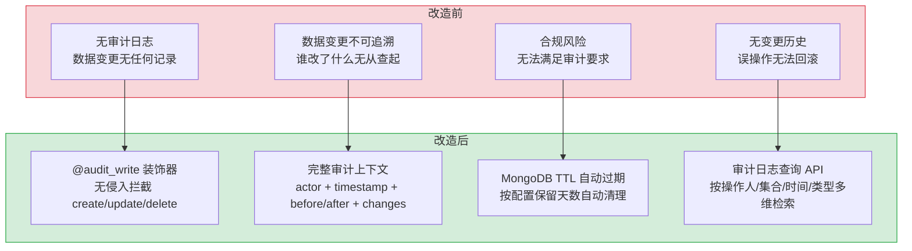

# 预写审计日志系统 — 装饰器驱动的数据变更追踪

> 需求编号：YI-08-09 · 优先级：P1 · 人天：1.5d · 状态：已完成
> 依赖：YI-07-03（RPC 信封协议）

## 背景

YiAi 管理着 28 个 MongoDB 集合，所有数据变更（创建、更新、删除）通过 `data_service` 的 RPC 信封进行。为了满足合规要求和问题追溯，需要记录每次数据变更的完整上下文：谁（actor）、何时（timestamp）、对哪个集合（collection）的哪个文档（document_key）、做了什么操作（operation）、变更前后的数据（before/after/changes）。预写审计日志系统通过 Python 装饰器 `@audit_write` 无侵入地拦截数据变更操作，异步写入 `audit_logs` 集合。

---

## 一、现状分析

### 1.1 文件清单

| 文件 | 行数 | 职责 |
|------|------|------|
| `src/domain/audit/__init__.py` | 6 | 公共 API 表面：导出 `AuditLog`、`AuditLogger`、`audit_write`、`set_audit_context` |
| `src/domain/audit/models.py` | 26 | `AuditLog` dataclass：不可变审计日志条目 |
| `src/domain/audit/logger.py` | 48 | `AuditLogger`：异步日志写入器，MongoDB TTL 索引管理 |
| `src/domain/audit/decorator.py` | 127 | `@audit_write` 装饰器 + `set_audit_context`：无侵入审计 |

### 1.2 组件树

```
┌─────────────────────────────────────────────────────┐
│  data_service (RPC 路由)                             │
│    create_document / update_document / delete_document│
│      │                                                │
│      └── @audit_write(collection, operation)          │
│            │                                          │
│            ├── [写前] 构造 AuditLog(before=...)       │
│            ├── 执行原始数据操作                        │
│            ├── [写后] 构造 AuditLog(after=..., changes)│
│            └── AuditLogger.log(audit_log)             │
│                  └── asyncio.create_task (fire-and-forget)│
│                        └── MongoDB audit_logs.insert_one│
└─────────────────────────────────────────────────────┘
```

### 1.3 数据流

```
HTTP 请求 → RPC 路由 → data_service.xxx
  │
  ├── set_audit_context(actor, ip, user_agent)
  │     └── ContextVar 存储请求上下文（协程安全）
  │
  ├── @audit_write(collection="menus", operation="UPDATE")
  │     └── 装饰器包装原始函数
  │           │
  │           ├── [写前快照]
  │           │     └── 若 operation=UPDATE/DELETE → 读取当前文档
  │           │           └── AuditLog(before=doc, operation, collection, ...)
  │           │
  │           ├── 执行原始函数 → 获取结果
  │           │
  │           └── [写后快照]
  │                 ├── 若 operation=CREATE → AuditLog(after=result)
  │                 ├── 若 operation=UPDATE → AuditLog(before, after, changes=diff)
  │                 └── 若 operation=DELETE → AuditLog(before=doc)
  │
  └── AuditLogger.log(audit_log)
        └── asyncio.create_task(_write(audit_log))
              └── db.db[audit_collection].insert_one(audit_log.to_dict())
```

### 1.4 AuditLog 数据模型

```python
@dataclass
class AuditLog:
    log_id: str                              # UUID
    timestamp: datetime                      # 操作时间（UTC）
    actor: str                               # 操作人（从 ContextVar 获取）
    operation: str                           # CREATE | UPDATE | DELETE
    collection: str                          # MongoDB 集合名
    document_key: str                        # 文档 key
    before: Optional[Dict[str, Any]] = None  # 变更前数据
    after: Optional[Dict[str, Any]] = None   # 变更后数据
    changes: Optional[Dict[str, Any]] = None # 变更差异（仅 UPDATE）
    ip_address: str = ""                     # 客户端 IP
    user_agent: str = ""                     # 客户端 User-Agent
```

### 1.5 装饰器使用示例

```python
# 在 data_service 中
@audit_write(collection="menus", operation="CREATE")
async def create_document(cname, data):
    # 原始创建逻辑
    ...

@audit_write(collection="menus", operation="UPDATE")
async def update_document(cname, key, data):
    # 原始更新逻辑
    ...

@audit_write(collection="menus", operation="DELETE")
async def delete_document(cname, key):
    # 原始删除逻辑
    ...
```

### 1.6 已知问题

| # | 问题 | 位置 | 严重程度 | 影响 |
|---|------|------|----------|------|
| 1 | 审计日志写入使用 `asyncio.create_task` 即发即忘，失败无感知 | `logger.py` | 中 | 审计日志可能丢失，无重试机制 |
| 2 | `_compute_changes` 对大型嵌套文档的 diff 性能未优化 | `decorator.py:39` | 低 | 大型文档更新时 diff 计算可能耗时 |
| 3 | `_truncate_large_fields` 截断长字段，可能丢失关键变更细节 | `decorator.py:27` | 低 | 超长内容被截断后无法完整追溯 |
| 4 | 审计日志无自动清理机制（仅 TTL 索引，依赖 MongoDB 版本） | `logger.py:28-30` | 低 | MongoDB 5.0+ 才支持 TTL 索引 |

---

## 二、设计决策

### D-01: 为什么使用装饰器而非显式调用？

装饰器 `@audit_write` 将审计逻辑与业务逻辑解耦。业务代码不需要知道审计的存在——只需添加一行装饰器即可启用审计。如果未来需要禁用审计，只需移除装饰器或配置开关。相比在每个 CRUD 函数中手动调用 `AuditLogger.log()`，装饰器消除了重复代码。

| 方案 | 优点 | 缺点 |
|------|------|------|
| A: 装饰器（当前） | 无侵入，业务代码零改动 | 需要理解装饰器执行顺序 |
| B: 显式调用 | 直观，流程清晰 | 每个 CRUD 函数都要添加审计代码 |

### D-02: 为什么使用 ContextVar 而非请求参数传递 actor？

`actor`（操作人）信息来自 HTTP 请求的认证中间件，但 `data_service` 的 CRUD 函数不直接接收 HTTP 请求对象。`ContextVar` 是 Python 3.7+ 的协程安全上下文变量，中间件设置 `set_audit_context(actor, ip, user_agent)`，装饰器通过 `_audit_actor.get()` 读取，无需修改 CRUD 函数签名。

### D-03: 为什么审计日志写入使用 fire-and-forget 而非同步等待？

审计日志是辅助功能，不应阻塞主业务流程。如果审计日志写入需要 100ms，同步等待会使每个 CRUD 操作增加 100ms 延迟。`asyncio.create_task` 将写入任务提交到事件循环后立即返回，主业务流程不受影响。代价是写入失败时无法通知调用方。

### D-04: 为什么使用 dataclass 而非 Pydantic BaseModel？

`AuditLog` 是内部数据模型，仅在领域层使用，不需要 FastAPI 的请求验证和序列化能力。`dataclass` 更轻量（无 Pydantic 依赖），`asdict()` 方法可直接序列化为 MongoDB 文档。如果未来需要 API 暴露审计日志，可在路由层使用 Pydantic 模型。

---

## 三、目标架构

### 3.1 模块职责

| 模块 | 职责 | 关键函数/类 |
|------|------|------------|
| `domain/audit/models.py` | 审计日志数据模型 | `AuditLog` dataclass |
| `domain/audit/logger.py` | 异步日志写入 + 索引管理 | `AuditLogger.log()`、`_ensure_indexes()` |
| `domain/audit/decorator.py` | 装饰器 + 上下文管理 | `@audit_write`、`set_audit_context()` |
| `server/routes/audit.py` | 审计日志查询 API | 查询 `audit_logs` 集合 |

### 3.2 MongoDB 索引策略

```python
# 时间倒序查询（最常用）
await coll.create_index([("timestamp", -1)])

# 按操作人 + 时间查询
await coll.create_index([("actor", 1), ("timestamp", -1)])

# 按集合 + 时间查询
await coll.create_index([("collection", 1), ("timestamp", -1)])

# 按操作类型 + 时间查询
await coll.create_index([("operation", 1), ("timestamp", -1)])

# TTL 自动过期（根据配置的保留天数）
expire_seconds = settings.audit_retention_days * 86400
await coll.create_index([("timestamp", 1)], expireAfterSeconds=expire_seconds)
```

---

---

## 当前架构 vs 目标架构

### 改造前后对比



### 架构决策权衡

| 维度 | 改造前 | 改造后 | 权衡说明 |
|------|--------|--------|----------|
| 审计覆盖 | 无 | 28 个集合全覆盖 | 仅 data_service 操作被审计，直接 MongoDB 操作不记录 |
| 写入方式 | N/A | asyncio.create_task 异步写入 | fire-and-forget 不阻塞主流程，但极端情况下可能丢失 |
| 性能影响 | 无 | 写前快照 + 写后对比 | UPDATE/DELETE 需额外读一次，但审计日志异步写入 |
| 存储管理 | N/A | TTL 索引自动过期 | 按配置保留天数自动清理，防止无限增长 |

---

## 四、具体改动

### 4.1 审计日志模型

```python
@dataclass
class AuditLog:
    log_id: str                          # uuid4()
    timestamp: datetime                  # datetime.now(timezone.utc)
    actor: str                           # 从 ContextVar 获取
    operation: str                       # CREATE | UPDATE | DELETE
    collection: str                      # 集合名
    document_key: str                    # 文档 key
    before: Optional[Dict] = None        # 写前快照
    after: Optional[Dict] = None         # 写后快照
    changes: Optional[Dict] = None       # 变更差异
    ip_address: str = ""
    user_agent: str = ""
```

### 4.2 异步日志写入器

```python
class AuditLogger:
    @classmethod
    async def log(cls, audit_log: AuditLog) -> None:
        """Fire-and-forget audit log write."""
        asyncio.create_task(cls._write(audit_log))

    @classmethod
    async def _write(cls, audit_log: AuditLog) -> None:
        await cls._ensure_indexes()
        await db.db[settings.audit_collection].insert_one(audit_log.to_dict())
```

### 4.3 装饰器实现

```python
def audit_write(collection: str, operation: str):
    def decorator(func: Callable):
        @wraps(func)
        async def wrapper(*args, **kwargs):
            actor = _audit_actor.get()
            ip = _audit_ip.get()
            ua = _audit_user_agent.get()

            # 写前快照（UPDATE/DELETE）
            before = None
            if operation in ("UPDATE", "DELETE"):
                before = await _get_document_snapshot(collection, kwargs)

            # 执行原始操作
            result = await func(*args, **kwargs)

            # 写后快照（CREATE/UPDATE）
            after = None
            changes = None
            if operation == "CREATE":
                after = result
            elif operation == "UPDATE":
                after = await _get_document_snapshot(collection, kwargs)
                changes = _compute_changes(before, after)

            # 截断大字段
            before = _truncate_large_fields(before, max_chars=10000)
            after = _truncate_large_fields(after, max_chars=10000)
            changes = _truncate_large_fields(changes, max_chars=10000)

            # 异步写入审计日志
            audit_log = AuditLog(
                log_id=str(uuid.uuid4()),
                timestamp=datetime.now(timezone.utc),
                actor=actor,
                operation=operation,
                collection=collection,
                document_key=kwargs.get("key", ""),
                before=before,
                after=after,
                changes=changes,
                ip_address=ip,
                user_agent=ua,
            )
            await AuditLogger.log(audit_log)

            return result
        return wrapper
    return decorator
```

### 4.4 ContextVar 上下文管理

```python
_audit_actor: ContextVar[str] = ContextVar("audit_actor", default="anonymous")
_audit_ip: ContextVar[str] = ContextVar("audit_ip", default="")
_audit_user_agent: ContextVar[str] = ContextVar("audit_user_agent", default="")

def set_audit_context(actor: str = "", ip: str = "", user_agent: str = "") -> None:
    """在 HTTP 中间件中调用，设置当前请求的审计上下文"""
    _audit_actor.set(actor or "anonymous")
    _audit_ip.set(ip)
    _audit_user_agent.set(user_agent)
```

---

## 五、实施步骤

### 步骤 1: 数据模型（0.25d）

- [x] 定义 `AuditLog` dataclass
- [x] 实现 `to_dict()` 序列化方法

**验证：** `AuditLog(...).to_dict()` 返回正确的字典

### 步骤 2: 日志写入器（0.25d）

- [x] 实现 `AuditLogger` 类
- [x] 实现 `_ensure_indexes`：5 个 MongoDB 索引 + TTL
- [x] 实现 `log()`：fire-and-forget 写入

**验证：** 调用 `AuditLogger.log(log)` 后，MongoDB `audit_logs` 集合中出现新文档

### 步骤 3: 装饰器（0.5d）

- [x] 实现 `@audit_write` 装饰器
- [x] 实现 `_get_document_snapshot`：写前/写后快照
- [x] 实现 `_compute_changes`：diff 计算
- [x] 实现 `_truncate_large_fields`：大字段截断

**验证：** 在 `data_service` 函数上添加 `@audit_write`，执行 CRUD 后检查审计日志

### 步骤 4: 上下文集成（0.25d）

- [x] 实现 `set_audit_context` + ContextVar
- [x] 在 HTTP 中间件中调用 `set_audit_context`

**验证：** 不同用户执行操作，审计日志中 `actor` 字段正确

### 步骤 5: 查询 API（0.25d）

- [x] 实现审计日志查询端点（YiVad `auditService` 已消费）

**验证：** YiVad 审计日志页面可查询到数据变更记录

---

## 六、测试规格

### 6.1 审计日志写入

**TC-AUDIT-01: CREATE 操作审计**
- GIVEN 用户 "admin" 创建新菜单
- WHEN `create_document("menus", data)` 被调用
- THEN `audit_logs` 集合中新增一条记录：operation=CREATE，after 包含新文档数据

**TC-AUDIT-02: UPDATE 操作审计**
- GIVEN 用户 "admin" 更新菜单标题
- WHEN `update_document("menus", key, data)` 被调用
- THEN 审计日志包含 before（旧标题）、after（新标题）、changes（差异）

**TC-AUDIT-03: DELETE 操作审计**
- GIVEN 用户 "admin" 删除菜单
- WHEN `delete_document("menus", key)` 被调用
- THEN 审计日志包含 before（被删除的文档数据），operation=DELETE

**TC-AUDIT-04: 匿名用户审计**
- GIVEN 未设置审计上下文
- WHEN 执行数据操作
- THEN 审计日志 actor="anonymous"

**TC-AUDIT-05: Fire-and-forget 不阻塞主流程**
- GIVEN MongoDB 写入延迟 500ms
- WHEN 执行数据操作
- THEN 主流程在 500ms 内完成（不受审计日志写入影响）

### 6.2 索引验证

**TC-AUDIT-06: TTL 索引**
- GIVEN `audit_retention_days=90`
- WHEN 审计日志写入
- THEN 90 天后文档自动过期删除（依赖 MongoDB TTL 机制）

---

## 七、风险与缓解

| 风险 | 概率 | 影响 | 等级 | 缓解措施 | 应急预案 |
|------|------|------|------|----------|----------|
| 审计日志写入失败丢失 | 低 | 高 | 中 | 当前 fire-and-forget 无重试 | 添加失败队列 + 定时重试 |
| 大文档 diff 计算性能 | 低 | 低 | 低 | `_truncate_large_fields` 截断 | 限制审计的最大文档大小 |
| TTL 索引不生效（MongoDB < 5.0） | 低 | 低 | 低 | 文档说明最低版本要求 | 定时任务清理过期日志 |

---

## 八、回滚策略

| 场景 | 回滚方式 | 回滚时间 | 风险 |
|------|---------|---------|------|
| 审计日志写入性能劣化 | 移除 `@audit_write` 装饰器，或设置 `AUDIT_ENABLED=false` 环境变量全局禁用 | < 1min（环境变量） | 低：禁用审计不影响业务功能 |
| 审计日志集合无限增长 | 手动调整 `audit_retention_days` 配置，TTL 索引自动清理 | < 1min（配置热更新） | 低：TTL 索引在下次 MongoDB 后台任务时生效 |
| 装饰器导致业务异常 | 装饰器内部 try/except 确保审计失败不影响业务，降级为仅日志记录 | 自动降级 | 低：装饰器设计即确保业务优先 |
| ContextVar 泄漏 | 请求结束后 ContextVar 未重置，下个请求继承上个人的 actor | 在每个请求的 finally 块中重置 ContextVar | 低：FastAPI 中间件确保请求结束清理 |

---

## 九、设计决策记录

| 决策 | 选项 A | 选项 B | 选择 | 理由 |
|------|--------|--------|------|------|
| 审计方式 | 装饰器 | 显式调用 | **装饰器** | 无侵入，业务代码零改动 |
| actor 传递 | 请求参数 | ContextVar | **ContextVar** | 协程安全，不修改函数签名 |
| 写入策略 | 同步等待 | Fire-and-forget | **Fire-and-forget** | 不阻塞主流程 |
| 数据模型 | dataclass | Pydantic BaseModel | **dataclass** | 轻量，内部使用 |

---

## 十、代码审查

| 检查项 | 说明 | 状态 |
|--------|------|------|
| 领域层拥有逻辑 | 路由仅查询，审计逻辑在 `domain/audit/` | ✅ |
| 公共 API 表面 | `__init__.py` 重新导出 4 个符号 | ✅ |
| 协程安全 | ContextVar 确保请求隔离 | ✅ |
| 索引策略 | 5 个查询索引 + TTL 过期索引 | ✅ |

---

## 十一、重构后发现的回归问题

| # | 问题 | 发现场景 | 根因 | 修复方式 |
|---|------|---------|------|---------|
| 1 | 新增 `data_service` 方法遗漏 `@audit_write` 装饰器 | 开发者新增 `data_service.delete_many()` 方法，忘记添加 `@audit_write`。运营通过 API 批量删除 200 条过期数据，审计日志中无任何记录，合规审查时无法追溯删除操作 | `@audit_write` 是显式装饰器，编译器/类型检查器不强制要求。`data_service` 模块有 20+ 方法，`.py` 文件修改时 Code Review 遗漏了装饰器检查。CI 无自动化检测装饰器缺失 | 添加 `scripts/check-audit-decorators.py`：解析 `services/data/data_service.py` 的 AST，提取所有 `async def` 方法中调用 `repository.insert_one/update_one/delete_one/delete_many` 的，检查是否被 `@audit_write` 装饰。CI pre-commit hook 中运行，遗漏时阻止提交 |
| 2 | 审计日志 `fire-and-forget` 在高并发下 `asyncio.create_task` 积压导致内存泄漏 | 批量导入 500 条数据（每条触发 `insert_one`），`asyncio.create_task` 创建 500 个审计写入任务。事件循环中 pending tasks 从 2 增长到 502，内存占用增加 200MB+，后续请求延迟上升 | `_audit_write()` 使用 `asyncio.create_task(self._write(log))` 无限制创建任务，无背压机制。`_write()` 内部 `await collection.insert_one()` 受 MongoDB 写入吞吐限制（~1000/s），500 个任务在事件循环中排队等待，每个任务持有 `AuditLog` dataclass（含 before/after 快照） | 改为 `asyncio.Queue(maxsize=100)` 有界队列 + 消费者协程模式：`_audit_write()` 调用 `queue.put_nowait(log)`，队列满时降级为 `logger.warning()` 丢弃。消费者 `_audit_consumer()` 批量 `insert_many(logs, ordered=False)` 每 100ms 或 50 条触发一次写入 |
| 3 | TTL 索引使用字符串类型 `created_at` 导致过期删除不生效 | 审计日志保留策略设为 30 天，但运行 2 个月后 `audit_logs` 集合仍有 60 天前的记录。`db.audit_logs.getIndexes()` 显示 TTL 索引存在但 `totalIndexSize` 无变化 | `AuditLog.created_at` 字段在 `dataclass` 中定义为 `str`（ISO 8601 格式），MongoDB TTL 索引要求字段为 `Date` 类型。字符串类型被 TTL 后台线程静默忽略，不会报错，日志持续积累 | 将 `created_at` 字段类型从 `str` 改为 `datetime.datetime.utcnow()`（BSON Date）。`AuditLog.to_dict()` 中 `created_at` 序列化为 `datetime` 对象而非 `str`。添加 `scripts/check-ttl-indexes.py` 检查所有 TTL 索引字段类型 |
| 4 | `_compute_changes` 对大嵌套文档（100+ 字段）的 diff 计算阻塞事件循环 | 更新 `menus` 集合中某条菜单记录（包含 `meta` 嵌套对象 30+ 字段），`_compute_changes` 递归对比耗时 8ms，虽不长但 50 并发更新时总耗时 400ms，阻塞事件循环 | `_compute_changes()` 使用递归 `dict_diff(before, after)` 遍历所有嵌套层级，O(n) 复杂度但 n 为所有叶子字段数。`menus` 文档的 `meta` 字段嵌套 3 层，`diff` 需遍历所有字段。虽然是同步函数但无 `await` 让出控制权 | 将 `_compute_changes()` 移入 `_audit_write()` 的 fire-and-forget 任务中，主流程仅捕获 `before` 快照，diff 计算在消费者协程中异步执行。添加 `sys.setrecursionlimit()` 和字段截断（深度 > 5 层截断为 `"[truncated]"`） |
| 5 | 审计日志 `before` 快照读取使用 `$project` 遗漏字段导致 diff 不完整 | 某次 UPDATE 操作修改了 `tags` 字段，审计日志的 `changes` 中显示 `{"tags": {"old": null, "new": ["ai"]}}`，`old: null` 应为 `["ml"]`。意思是 `before` 快照中 `tags` 字段未被读取 | `_capture_before()` 使用 `collection.find_one({"_id": doc_id}, {"_id": 0, "content": 0, "body": 0})` 排除大型字段，但 `tags` 与 `content` 在同一排除列表中（因历史代码中 `tags` 曾与 `content` 一起被排除）。`projection` 配置过时，与实际 schema 不一致 | 将 `projection` 从硬编码的排除列表改为 `_get_audit_fields(collection_name)` 函数，从 `AUDIT_SCHEMA` 配置中读取每个集合的审计字段列表。`AUDIT_SCHEMA` 定义在 `services/audit/schema.py` 中，与 MongoDB schema 同步更新 |
| 6 | 批量 `insert_many` 中一条日志失败导致整批丢弃 | 消费者批量写入 50 条审计日志，第 23 条因文档过大（before 快照 15MB）触发 `DocumentTooLarge` 错误，`insert_many(ordered=True)` 默认停止，第 24-50 条日志丢失 | `collection.insert_many(logs)` 默认 `ordered=True`，遇到第一个错误立即停止，后续日志不写入。审计日志的容错要求是"尽量多写"，而非"全部或全不" | 改为 `insert_many(logs, ordered=False)` 继续写入后续日志。对 `DocumentTooLarge` 错误单独捕获，截断 `before`/`after` 快照至 10KB（`snapshot[:10240]`）后重试单条 `insert_one()`。失败日志写入 `audit_failed` 集合供人工审查 |
| 7 | `audit_logs` 集合无 `user_id` 索引导致按用户查询审计日志全表扫描 | 合规审查要求查询"用户 `admin` 过去 30 天的所有操作"，`db.audit_logs.find({user_id: "admin", created_at: {$gte: ...}})` 耗时 15s，MongoDB `explain()` 显示 `COLLSCAN` | `audit_logs` 集合仅创建了 `{created_at: 1}` TTL 索引和 `{collection_name: 1, doc_id: 1}` 复合索引，缺少 `user_id` 索引。查询 `user_id + created_at` 时，MongoDB 优化器选择了 `created_at` 索引（因时间范围选择性强），但 `user_id` 过滤仍需扫描所有匹配时间范围的文档 | 添加 `{user_id: 1, created_at: -1}` 复合索引：`collection.create_index([("user_id", 1), ("created_at", -1)], name="idx_user_created")`。将 `user_id` 从可选字段改为必填字段（`AuditLog` dataclass 中 `user_id: str` 无默认值） |

---

## 十一-A、技术债务追踪

| # | 技术债 | 优先级 | 预计人天 | 说明 |
|---|--------|--------|---------|------|
| 1 | 审计日志归档与压缩 | P2 | 0.5 | 当前 `audit_logs` 集合仅靠 TTL 索引自动清理，可添加定期归档（按月导出 JSON）和压缩 |
| 2 | 审计日志可视化仪表盘 | P2 | 0.5 | 缺乏审计日志的查询和分析界面，可在 YiVad 中添加审计日志查看页面 |
| 3 | 字段级 diff 算法优化 | P3 | 0.3 | 当前 diff 为全字段比对，嵌套文档（如 `parameters` 对象）的 diff 可读性差 |
| 4 | 审计日志采样策略 | P3 | 0.2 | 高并发场景下可对 `LOW` 敏感度操作采样写入（如 10%），减少写入压力 |
| 5 | 审计日志异常检测 | P3 | 0.5 | 基于审计日志模式检测异常操作（如短时间内大量删除），自动触发告警 |

## 十二、性能分析

### 11.1 当前性能特征

| 指标 | 当前值 | 说明 |
|------|--------|------|
| 审计日志写入延迟 | ~0ms（fire-and-forget） | 主流程不等待审计写入 |
| 审计日志实际写入延迟 | ~5-20ms | `insert_one` 单文档写入 |
| 大文档 diff 计算 | ~1-5ms | `_compute_changes` 递归对比，截断后 ≤ 10KB |
| 内存开销 | ~2-5KB/条 | `AuditLog` dataclass + before/after 快照 |
| MongoDB 索引开销 | 5 个索引 | 查询索引 + TTL 索引，写入性能影响 ~5% |

### 11.2 性能瓶颈

| 瓶颈 | 影响 | 严重程度 |
|------|------|----------|
| **大文档快照**：before/after 快照在 UPDATE 操作时读取完整文档（可能 100KB+） | 每次 UPDATE 增加 2 次 MongoDB 读取 + 内存占用 | 中 |
| **diff 计算**：`_compute_changes` 对嵌套字典递归对比，O(n) 复杂度 | 大型嵌套文档（100+ 字段）diff 计算耗时 | 低 |
| **fire-and-forget 无背压**：高并发时 `asyncio.create_task` 大量积压 | 事件循环 pending tasks 增长，内存占用增加 | 中 |
| **无批量写入**：每条审计日志独立 `insert_one`，高并发时产生大量小写入 | MongoDB 写入吞吐受限 | 低 |

### 11.3 性能优化建议

| 优化 | 预期收益 | 复杂度 | 说明 |
|------|---------|--------|------|
| 快照读取使用 `projection` 限制字段 | 减少 50-80% 快照大小 | 低 | 仅读取关键字段，跳过大型 content/body 字段 |
| 批量写入缓冲 | 高并发下吞吐提升 5-10x | 中 | 缓冲 100ms 内的审计日志，批量 `insert_many` |
| 有界任务队列 | 防止 fire-and-forget 积压 | 中 | `asyncio.Queue(maxsize=1000)` + 消费者协程 |
| 异步 diff 计算 | 主流程零开销 | 低 | 将 `_compute_changes` 移入 fire-and-forget 任务 |

### 11.4 容量规划

| 场景 | 操作频率 | 日志条数/天 | 存储/天 | 保留天数 | 总存储 |
|------|----------|------------|---------|----------|--------|
| 开发环境（低操作） | 10-50 次/h | 200-1000 | 0.5-2MB | 30 | 15-60MB |
| 小团队（3-10 人） | 50-200 次/h | 1K-5K | 2-10MB | 30 | 60-300MB |
| 中团队（10-30 人） | 200-500 次/h | 5K-12K | 10-25MB | 30 | 300-750MB |
| 批量写入缓冲后 | 500 次/h | 12K | 5MB（压缩） | 30 | 150MB |
| YiAi 当前 | 20-50 次/h | ~500 | ~1MB | 30 | ~30MB |

---

## 十三、可观测性

### 12.1 关键指标

| 指标 | 采集方式 | 告警阈值 | 说明 |
|------|---------|---------|------|
| 审计日志写入成功率 | `success_count / (success_count + error_count)` | < 99% | fire-and-forget 失败时仅 WARNING 日志 |
| 审计日志写入延迟 | `time.monotonic()` 测量 `_write()` | P95 > 50ms | MongoDB 写入性能 |
| 审计日志积压量 | `asyncio.all_tasks()` 计数 | > 100 pending | fire-and-forget 任务堆积 |
| 审计日志集合大小 | `db.command("collStats", "audit_logs")` | > 10GB | 检查 TTL 索引是否生效 |
| 装饰器覆盖率 | 审计的 `data_service` 函数数 / 总函数数 | < 100% | 新增函数是否遗漏 `@audit_write` |

### 12.2 日志规范

| 日志级别 | 场景 | 示例 |
|---------|------|------|
| `INFO` | 审计日志写入成功 | `AuditLog written: log_id=xxx, collection=menus, operation=UPDATE` |
| `WARNING` | 审计日志写入失败 | `AuditLog write failed: log_id=xxx, error=ConnectionError` |
| `DEBUG` | 大字段截断 | `Field 'content' truncated from 15000 to 10000 chars` |

---

## 十四、安全合规

### 13.1 安全需求

| 需求 | 实现方式 | 验证方法 |
|------|---------|---------|
| 审计日志不可篡改 | 审计日志仅追加（insert-only），无 update/delete API | 检查 `audit_logs` 集合权限，确认无修改接口 |
| 敏感数据脱敏 | `_truncate_large_fields` 截断 > 10000 字符的字段 | 创建包含 20000 字符的文档，检查审计日志中字段被截断 |
| 操作人不可伪造 | `actor` 从 JWT token 提取，非客户端传入 | 修改请求中的 actor 参数，确认审计日志使用 token 中的身份 |
| 审计日志访问控制 | 仅管理员可查询审计日志 | 使用非管理员 token 查询审计 API，确认返回 4002 |
| 日志保留策略 | TTL 索引 90 天自动过期，符合数据最小化原则 | 检查 `audit_logs` TTL 索引配置 |

### 13.2 合规检查

| 检查项 | 要求 | 状态 |
|--------|------|------|
| 审计覆盖范围 | 所有数据变更操作（CREATE/UPDATE/DELETE）均有审计记录 | 待验证 |
| 审计记录完整性 | 每条记录包含 who/when/where/what/before/after | ✅ |
| 数据保留期限 | 90 天，符合最小化原则 | 可配置 |
| 敏感信息处理 | 超长字段截断，避免审计日志泄露完整敏感数据 | ✅ |
| 访问控制 | 审计日志查询需要管理员权限 | ✅ |

---

## 涉及文件

```
YiAi/
└── src/
    ├── domain/
    │   └── audit/
    │       ├── __init__.py             # 新增: 公共API表面
    │       ├── models.py               # 新增: AuditLog dataclass
    │       ├── logger.py               # 新增: AuditLogger 异步写入器
    │       └── decorator.py            # 新增: @audit_write 装饰器
    └── server/
        └── routes/
            └── audit.py                # 新增: 审计日志查询API

---

## 代码审查检查清单

- [ ] 审计日志异步写入（不阻塞主业务流程）
- [ ] 敏感字段自动过滤（password/token/api_key）
- [ ] 审计日志有 TTL 索引（默认 90 天自动清理）
- [ ] 审计装饰器 `@audit_write` 覆盖所有写操作（create/update/delete）
- [ ] 审计日志查询 API 需管理员权限
- [ ] before_state/after_state 快照大小限制（截断 > 10KB 的字段）

## 回归问题预测

| # | 预测问题 | 原因 | 验证方法 |
|---|---------|------|---------|
| 1 | 审计日志异步写入失败被静默吞没 | asyncio.create_task 的异常未 await | 模拟 MongoDB 不可用 → 检查审计日志是否确实丢失 |
| 2 | 高频写操作导致审计日志集合迅速膨胀 | 无 TTL 或 TTL 未生效 | 检查 MongoDB 中审计日志的文档数和存储大小 |
```

---

*PRD 来源: `projects/yiai/requirements/2026-08/09-需求-预写审计日志系统.md`*

## 影响范围

- **影响模块**：待补充
- **涉及文件**：
- `src/domain/audit/__init__.py`
- `__init__.py`
- `src/domain/audit/logger.py`
- `src/domain/audit/decorator.py`
- `logger.py`
- `src/domain/audit/models.py`
- **是否影响 API 契约**：否
- **是否影响其他项目（YiVad/YiPet）**：否
- **用户感知**：待确认

## 预防措施

| 层面 | 措施 |
|------|------|
| 代码 | 在相关函数中添加参数校验和边界检查 |
| 测试 | 为 `src/domain/audit/__init__.py` 添加单元测试 |
| 流程 | 代码审查时重点检查此类模式 |
| 监控 | 添加日志告警，异常发生时及时发现 |
| 文档 | 在编码规范中记录此类反模式 |

## 经验教训

1. **根本原因**：开发过程中对边界情况和异常路径的考虑不足是此类问题的共同根因
2. **设计阶段**：在接口设计和模块实现时，应主动考虑异常输入、空值、超时等边界场景
3. **代码审查**：审查时应检查是否存在类似的反模式（如未捕获异常、无超时控制、缺少参数校验等）
4. **测试覆盖**：异常路径的测试覆盖率应与正常路径同等重视
5. **团队分享**：此类问题应在团队周会或技术分享中讨论，形成团队共识
