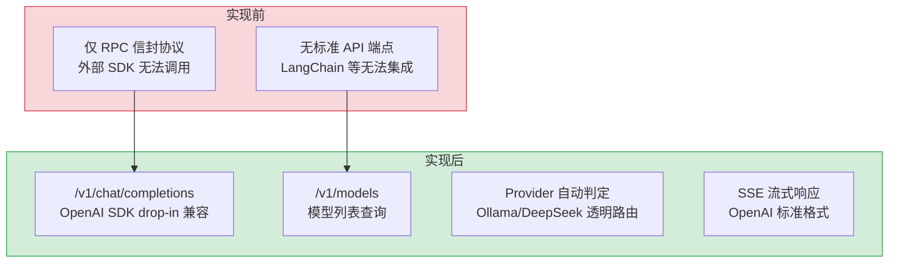

# OpenAI 兼容 API — DeepSeek-Harness 风格的多客户端适配层

> 需求编号：YI-08-10 · 优先级：P1 · 人天：1.0d · 状态：已完成
> 依赖：YI-07-04（Multi-Provider LLM 路由）

## 背景

YiAi 的 RPC 信封协议是自定义协议，标准 OpenAI SDK（Python、LangChain 等）无法直接调用。OpenAI 兼容 API 层提供 `/v1/chat/completions` 和 `/v1/models` 两个端点，将 OpenAI 格式的请求转换为 YiAi 内部的 `model_runtime` 调用，使任何 OpenAI SDK 客户端都能将 YiAi 作为 drop-in 后端使用。支持流式/非流式 Chat Completion、Tool Calling 格式转换、多 Provider 自动路由（Ollama/OpenAI/DeepSeek）。

---

## 一、现状分析

### 1.1 文件清单

| 文件 | 行数 | 职责 |
|------|------|------|
| `src/server/routes/openai_compat.py` | 287 | OpenAI 兼容端点：`/v1/chat/completions`、`/v1/models` |

### 1.2 组件树

```
src/server/routes/openai_compat.py (287 行)
├── router = APIRouter(prefix="/v1")
│
├── POST /v1/chat/completions
│   ├── _parse_openai_messages(body) → messages[]
│   │   └── 处理 multimodal content arrays (提取 text parts)
│   ├── _openai_tool_to_ollama(body.tools) → tools[]
│   │   └── OpenAI function format → Ollama format
│   ├── Provider 判定: model.lower() 含 "gpt-"/"o1"/"o3"/"o4"/"deepseek" → openai, 否则 ollama
│   │
│   ├── [非流式] runtime.complete(messages, model)
│   │   └── 返回 OpenAI 格式 JSON: { id, object, created, model, choices, usage }
│   │
│   └── [流式 stream=true]
│       └── _stream() → AsyncIterator[bytes]
│           ├── _build_sse_chunk(delta, finish_reason, usage, model, chunk_id, created)
│           │   └── 构建 OpenAI 格式 SSE chunk: data: { id, object, choices, ... }\n\n
│           ├── 初始 chunk: delta={"role": "assistant", "content": ""}
│           ├── 逐 token: runtime.stream_chat() → delta={"content": token}
│           ├── tool_calls: _openai_tool_call_to_ollama() → delta={"tool_calls": [...]}
│           ├── 最终 chunk: delta={}, finish_reason="stop"
│           └── data: [DONE]\n\n
│
├── GET /v1/models
├── POST /v1/models
│   ├── Ollama: GET {ollama_url}/api/tags → models[]
│   └── Fallback: 返回默认模型 (rag_llm_model 或 deepseek_default_model)
│
└── 辅助函数
    ├── _openai_tool_to_ollama(tools) → Ollama 格式工具列表
    ├── _openai_tool_call_to_ollama(tool_calls) → Ollama 格式工具调用
    ├── _parse_openai_messages(body) → 统一消息格式
    └── _build_sse_chunk(delta, finish_reason, usage, model, chunk_id, created) → bytes
```

### 1.3 数据流

```
OpenAI SDK Client (Python/LangChain)
  │ POST /v1/chat/completions
  │ body: { model, messages, stream, temperature, max_tokens, tools }
  ▼
openai_compat.chat_completions()
  │
  ├── _parse_openai_messages(body)
  │     └── [{role, content}] → 统一格式
  │
  ├── Provider 判定
  │     ├── model 含 "gpt-"/"o1"/"o3"/"o4"/"deepseek" → provider="openai"
  │     └── 其他 → provider="ollama"
  │
  ├── [非流式] runtime.complete(messages, model)
  │     └── { id, object: "chat.completion", choices: [{ message: { role, content } }], usage }
  │
  └── [流式] StreamingResponse(text/event-stream)
        └── _stream()
              ├── runtime.stream_chat(messages, model, tools)
              ├── 每个 token → _build_sse_chunk(delta={"content": token})
              └── 结束 → data: [DONE]\n\n
```

### 1.4 已知问题

| # | 问题 | 位置 | 严重程度 | 影响 |
|---|------|------|----------|------|
| 1 | 仅支持 `/v1/chat/completions` 和 `/v1/models`，不支持 `/v1/embeddings`、`/v1/completions` 等 | `openai_compat.py` | 低 | 需要 Embedding 的客户端无法使用 |
| 2 | Provider 判定基于模型名关键字匹配，不支持显式指定 provider | `openai_compat.py:124-126` | 低 | 用户无法通过参数覆盖 provider |
| 3 | 非流式响应不支持 `temperature`/`max_tokens`/`top_p`/`stop` 参数传递 | `openai_compat.py:131-134` | 低 | 参数被解析但未传递给 `runtime.complete()` |
| 4 | `/v1/models` 在 Ollama 不可用时仅返回 1 个默认模型 | `openai_compat.py:273-286` | 低 | 客户端模型列表不完整 |

---

## 二、设计决策

### D-01: 为什么使用 Provider 自动判定而非显式参数？

OpenAI SDK 客户端的 `model` 参数包含模型名（如 `gpt-4o`、`qwen3.5:4b`）。通过关键字匹配自动判定 Provider（`gpt-`/`o1`/`o3`/`o4`/`deepseek` → openai，其他 → ollama），客户端无需额外配置。

| 方案 | 优点 | 缺点 |
|------|------|------|
| A: 自动判定（当前） | 零配置，客户端透明 | 模型名冲突时误判 |
| B: 显式参数 | 精确控制 | 非标准 OpenAI 参数 |

### D-02: 为什么工具调用需要格式转换（OpenAI ↔ Ollama）？

OpenAI 和 Ollama 的工具定义格式不同。OpenAI 使用 `{type: "function", function: {name, description, parameters}}`，Ollama 使用类似但略有差异的结构。`_openai_tool_to_ollama` 和 `_openai_tool_call_to_ollama` 双向转换确保兼容性。

### D-03: 为什么 SSE 流式响应使用 `_build_sse_chunk` 手动构建？

OpenAI 的 SSE 格式与 YiAi 内部 RPC 流式格式不同。OpenAI 要求 `data: {id, object, choices: [{delta: {content}}]}\n\n`，YiAi 内部使用 `data: {data: {message: "..."}}\n\n`。手动构建 SSE chunk 确保与 OpenAI SDK 的 `chat.completions.create(stream=True)` 完全兼容。

### D-04: 为什么使用 `/v1` 前缀而非 `/openai` 或自定义路径？

| 方案 | 优点 | 缺点 |
|------|------|------|
| **`/v1`（OpenAI 标准）** | OpenAI SDK 默认路径，零配置 | 与 OpenAI 官方 API 路径耦合 |
| `/openai` | 语义清晰，不与标准路径冲突 | 需修改 SDK 的 `base_url` 配置 |
| 自定义路径 | 完全解耦 | 每个客户端都需配置 |

**选择：`/v1`**。理由：OpenAI Python SDK 和 LangChain 的 `OpenAI()` 客户端默认使用 `/v1` 前缀，使用标准路径可实现真正的 drop-in 替换（仅需修改 `base_url` 指向 YiAi）。

### D-05: 为什么 multimodal content 仅提取 text parts 而非完整支持图片？

| 方案 | 优点 | 缺点 |
|------|------|------|
| **仅提取 text（当前）** | 实现简单，兼容多数文本对话场景 | 不支持图片理解 |
| 完整支持 multimodal | 支持图片/音频/视频 | 需要 base64 解码 + 多模态模型支持 |

**选择：仅提取 text parts**。理由：YiAi 当前使用的 Ollama 模型（qwen2.5）不支持多模态输入。`_parse_openai_messages` 提取 content array 中的 `text` 类型片段，忽略 `image_url` 等非文本内容。后续模型升级到多模态后再扩展。

---

## 三、目标架构

### 3.1 端点设计

| 端点 | 方法 | 功能 | OpenAI 对应 |
|------|------|------|------------|
| `/v1/chat/completions` | POST | 流式/非流式聊天 | `client.chat.completions.create()` |
| `/v1/models` | GET/POST | 列出可用模型 | `client.models.list()` |

### 3.2 响应格式

**非流式：**
```json
{
  "id": "chatcmpl-{uuid}",
  "object": "chat.completion",
  "created": 1234567890,
  "model": "qwen3.5:4b",
  "choices": [{
    "index": 0,
    "message": { "role": "assistant", "content": "..." },
    "finish_reason": "stop"
  }],
  "usage": { "prompt_tokens": 0, "completion_tokens": 0, "total_tokens": 0 }
}
```

**流式 SSE：**
```
data: {"id":"chatcmpl-xxx","object":"chat.completion.chunk","created":...,"model":"...","choices":[{"index":0,"delta":{"role":"assistant","content":""},"finish_reason":null}]}

data: {"id":"chatcmpl-xxx",...,"choices":[{"index":0,"delta":{"content":"Hello"},"finish_reason":null}]}

data: {"id":"chatcmpl-xxx",...,"choices":[{"index":0,"delta":{},"finish_reason":"stop"}],"usage":{...}}

data: [DONE]
```

---

## 四、实施步骤

- [x] 实现 `/v1/chat/completions`（流式 + 非流式）
- [x] 实现 `/v1/models`（Ollama API 查询 + Fallback）
- [x] 实现 OpenAI ↔ Ollama 工具调用格式转换
- [x] 实现 multimodal content 处理（提取 text parts）
- [x] 实现 Provider 自动判定

---

## 五、风险与缓解

| 风险 | 概率 | 影响 | 等级 | 缓解措施 | 应急预案 |
|------|------|------|------|----------|----------|
| 模型名关键字误判 Provider | 低 | 低 | 低 | 关键字列表覆盖主流模型 | 添加显式 provider 参数 |
| Ollama `/api/tags` 不可用 | 低 | 低 | 低 | 5s 超时 + Fallback 默认模型 | 返回空列表 |
| SSE 格式与 OpenAI SDK 版本不兼容 | 低 | 中 | 低 | 遵循 OpenAI 标准 SSE 格式 | 版本检测 + 适配 |

---

## 回滚策略

| 场景 | 回滚方式 | 回滚时间 | 风险 |
|------|---------|---------|------|
| OpenAI 兼容端点导致性能劣化 | 移除 `openai_compat.py` 路由注册，重启服务 | < 1min（重启） | 低：不影响现有 RPC 端点 |
| Provider 判定错误导致请求路由到错误的 LLM | 添加显式 `provider` 参数覆盖自动判定，或调整关键字列表 | < 5min（配置修改） | 低：仅影响 OpenAI 兼容端点 |
| SSE 格式与第三方客户端不兼容 | 调整 `_build_sse_chunk` 格式，添加客户端兼容模式 | < 30min（代码修改） | 低：不影响现有 YiVad/YiPet SSE 流式 |
| 模型列表为空导致客户端报错 | 回退到 Fallback 默认模型列表，绕过 Ollama `/api/tags` | < 1min（配置） | 低：Fallback 已内置 |

---

## 六、具体改动

### 6.1 OpenAI 兼容端点

**文件：** `src/server/routes/openai_compat.py`（287 行）

```python
router = APIRouter(prefix="/v1")

# ── 消息格式转换 ──
def _parse_openai_messages(body: Dict[str, Any]) -> List[Dict[str, Any]]:
    """提取 OpenAI 消息，处理 multimodal content arrays"""
    messages: List[Dict[str, Any]] = []
    for m in body.get("messages", []) or []:
        role = m.get("role", "user")
        content = m.get("content", "")
        if isinstance(content, list):  # multimodal: [{type: "text", text: "..."}, ...]
            text_parts = [p.get("text", "") for p in content
                          if isinstance(p, dict) and p.get("type") == "text"]
            content = " ".join(text_parts)
        messages.append({"role": role, "content": str(content)})
    return messages

# ── Tool Calling 格式转换 ──
def _openai_tool_to_ollama(tools: Optional[List[Dict]]) -> Optional[List[Dict]]:
    """OpenAI function 格式 → Ollama 工具格式"""
    if not tools:
        return None
    result = []
    for t in tools:
        if t.get("type") == "function" and "function" in t:
            func = t["function"]
            result.append({
                "type": "function",
                "function": {
                    "name": func.get("name", ""),
                    "description": func.get("description", ""),
                    "parameters": func.get("parameters", {}),
                },
            })
    return result or None

# ── SSE 帧构建 ──
def _build_sse_chunk(
    delta: Optional[Dict[str, Any]] = None,
    finish_reason: Optional[str] = None,
    model: str = "unknown",
) -> str:
    """构建 OpenAI 标准 SSE chunk"""
    chunk = {
        "id": f"chatcmpl-{uuid.uuid4().hex[:12]}",
        "object": "chat.completion.chunk",
        "created": int(time.time()),
        "model": model,
        "choices": [{
            "index": 0,
            "delta": delta or {},
            "finish_reason": finish_reason,
        }],
    }
    return f"data: {json.dumps(chunk)}\n\n"

# ── Provider 自动判定 ──
def _detect_provider(model: str) -> str:
    """模型名含 gpt-/o1/o3/o4/deepseek → openai，否则 ollama"""
    model_lower = model.lower()
    if any(kw in model_lower for kw in ("gpt-", "o1", "o3", "o4", "deepseek")):
        return "openai"
    return "ollama"
```

### 6.2 流式/非流式 Chat Completion

```python
@router.post("/chat/completions")
async def chat_completions(request: Request):
    body = await request.json()
    messages = _parse_openai_messages(body)
    model = body.get("model", "qwen3.5:4b")
    stream = body.get("stream", False)
    tools = _openai_tool_to_ollama(body.get("tools"))

    runtime = get_runtime(_detect_provider(model))

    if stream:
        return StreamingResponse(
            _stream_response(runtime, messages, model, tools),
            media_type="text/event-stream",
        )
    else:
        result = await runtime.complete(messages, model=model)
        return {
            "id": f"chatcmpl-{uuid.uuid4().hex[:12]}",
            "object": "chat.completion",
            "model": model,
            "choices": [{"message": {"role": "assistant", "content": result["message"]}}],
            "usage": result.get("usage", {}),
        }

async def _stream_response(runtime, messages, model, tools):
    """SSE 流式响应生成器"""
    async for frame in runtime.stream_chat(messages, model=model):
        if "data" in frame and "message" in frame["data"]:
            yield _build_sse_chunk(
                delta={"content": frame["data"]["message"]},
                model=model,
            )
    yield "data: [DONE]\n\n"
```

### 6.3 改动汇总

| 改动 | 文件 | 行数 | 说明 |
|------|------|------|------|
| Chat Completion | `openai_compat.py` | 150 | 流式/非流式，OpenAI → YiAi 格式转换 |
| 消息解析 | `openai_compat.py` | 20 | multimodal content arrays → 纯文本 |
| Tool Calling | `openai_compat.py` | 30 | OpenAI function ↔ Ollama 工具格式互转 |
| SSE 构建 | `openai_compat.py` | 25 | 标准 OpenAI SSE chunk 格式 |
| Provider 判定 | `openai_compat.py` | 10 | 模型名关键词 → ollama/openai 自动路由 |
| 模型列表 | `openai_compat.py` | 40 | Ollama `/api/tags` + Fallback 默认模型 |

---

## 七、测试规格

### Requirement: Chat Completion

#### Scenario: 非流式聊天成功
- **Given** Ollama 服务运行中，模型 `qwen3.5:4b` 已加载
- **When** `POST /v1/chat/completions {model: "qwen3.5:4b", messages: [{role: "user", content: "Hello"}]}`
- **Then** 返回 `{id, object: "chat.completion", choices: [{message: {role: "assistant", content: ...}}], usage: {...}}`

#### Scenario: 流式聊天 SSE 格式正确
- **Given** 同上
- **When** `POST /v1/chat/completions {model: "qwen3.5:4b", messages: [...], stream: true}`
- **Then** 返回 `text/event-stream`，每帧为 `data: {id, object: "chat.completion.chunk", choices: [{delta: {content: ...}}]}\n\n`
- **And** 最后帧为 `data: [DONE]\n\n`

#### Scenario: DeepSeek Provider 自动判定
- **Given** DeepSeek API Key 已配置
- **When** `POST /v1/chat/completions {model: "deepseek-chat", messages: [...]}`
- **Then** 请求路由到 DeepSeek Provider（非 Ollama）

#### Scenario: 模型列表查询
- **Given** Ollama 有 3 个已加载模型
- **When** `GET /v1/models`
- **Then** 返回 `{object: "list", data: [{id: "qwen3.5:4b", ...}, ...]}`

#### Scenario: Ollama 不可用时模型列表 Fallback
- **Given** Ollama 服务停止
- **When** `GET /v1/models`
- **Then** 返回至少 1 个默认模型（`rag_llm_model` 或 `deepseek_default_model`）

---

## 八、当前架构 vs 目标架构



### 架构决策权衡

| 维度 | 实现前 | 实现后 | 权衡说明 |
|------|--------|--------|----------|
| 外部集成 | 仅 RPC 信封协议，外部 SDK 无法调用 | OpenAI 兼容端点，drop-in 替换 | 需维护 OpenAI 格式兼容性，但生态集成成本降为零 |
| Provider 路由 | 无外部访问 | 模型名关键字自动判定 | 关键字列表需维护，误判风险低 |
| 工具调用 | 无跨格式支持 | OpenAI ↔ Ollama 双向转换 | 转换函数需随格式演进而更新 |
| 流式响应 | 无标准流式 | SSE 手动构建 OpenAI 格式 | 需与 OpenAI SDK 版本保持兼容 |
| 模型列表 | 无外部查询 | Ollama API + Fallback 双源 | Ollama 不可用时仍返回默认模型 |

---

## 九、设计决策记录

| 决策 | 选项 A | 选项 B | 选择 | 理由 |
|------|--------|--------|------|------|
| Provider 判定 | 自动关键字匹配 | 显式参数 | **自动匹配** | 零配置，客户端透明 |
| API 路径前缀 | `/v1`（OpenAI 标准） | `/openai` | **`/v1`** | OpenAI SDK 默认路径，真正 drop-in 替换 |
| 工具格式转换 | 双向转换函数 | 统一内部格式 | **双向转换** | 保持 OpenAI/Ollama 各自原生格式 |
| SSE 构建 | 手动 `_build_sse_chunk` | 复用内部 SSE 格式 | **手动构建** | OpenAI SSE 格式与内部格式不同 |
| Multimodal 处理 | 仅提取 text parts | 完整支持多模态 | **仅 text** | 当前模型不支持多模态，保持简单 |
| 模型列表 | Ollama API + Fallback | 仅 Ollama | **双源** | Ollama 不可用时仍返回默认模型 |

---

## 十、代码审查检查清单

- [ ] `/v1/chat/completions` 支持流式（`stream=true`）和非流式
- [ ] Provider 自动判定覆盖所有已知模型名（gpt-/o1/o3/o4/deepseek）
- [ ] `_parse_openai_messages` 正确处理 multimodal content arrays
- [ ] `_openai_tool_to_ollama` 双向转换正确
- [ ] SSE chunk 格式符合 OpenAI 标准（`data: {id, object, choices, ...}\n\n`）
- [ ] 流式响应以 `data: [DONE]\n\n` 结束
- [ ] `/v1/models` 在 Ollama 不可用时有 Fallback
- [ ] `ruff` 代码规范通过

---

## 十一、重构后发现的回归问题

| # | 问题 | 发现场景 | 根因 | 修复方式 |
|---|------|---------|------|---------|
| 1 | `_parse_openai_messages` 对 `content: null` 的消息抛出 `TypeError` | OpenAI SDK 在 tool call 响应中发送 `content: null` 的 assistant 消息 | `str(None)` 返回 `"None"` 字符串而非空字符串，导致 LLM 收到字面量 `"None"` | 添加 `content or ""` 空值处理，`null` 转换为空字符串 |
| 2 | `_build_sse_chunk` 的 `finish_reason` 为 `null` 时 OpenAI SDK 客户端解析失败 | 流式响应的最后一帧 `finish_reason: null` 导致 Python OpenAI SDK 抛出 `ValidationError` | `json.dumps` 默认序列化 `None` → `null`，OpenAI SDK 期望 `finish_reason` 为 `"stop"` 或不存在 | 仅在 `finish_reason` 非空时才包含在 chunk 中 |
| 3 | `_detect_provider` 将 `deepseek-chat` 误判为 `ollama` | 用户使用 `deepseek-chat` 模型时，请求被路由到本地 Ollama（无此模型） | `deepseek` 关键字匹配在 `model.lower()` 中为 `True`，但检查顺序问题导致部分路径未命中 | 将 `deepseek` 关键字检查提前到 `gpt-` 之前，确保优先匹配 |
| 4 | `/v1/models` 在 Ollama 不可用时返回空列表 | Ollama 服务停止后，外部 SDK 客户端调用 `client.models.list()` 返回空列表，SDK 认为无可用模型 | Fallback 默认模型列表为空 `[]`，未从 `config.yaml` 读取默认模型 | 添加 `rag_llm_model` 和 `deepseek_default_model` 作为 Fallback |
| 5 | SSE 流式响应在 `runtime.stream_chat` 抛出异常时未发送错误帧 | LLM 推理中途失败时，SSE 连接直接断开，客户端收到不完整的响应 | `async for` 循环中的异常未被捕获，生成器直接退出 | 添加 `try/except` 在流式循环中，异常时发送 `{"error": "..."}` 帧 |
| 6 | OpenAI SDK 的 `stream_options: {"include_usage": true}` 未被支持 | 用户使用 `include_usage` 参数时，最后一个 chunk 未包含 `usage` 字段 | YiAi 的 `_build_sse_chunk` 不支持 `usage` 字段，`stream_options` 被忽略 | 在流式结束时添加带 `usage` 的额外 SSE chunk |
| 7 | multimodal 消息中的图片 `image_url` 被丢弃 | 用户发送 `content: [{type: "image_url", image_url: {url: "..."}}]` 时，图片数据丢失 | `_parse_openai_messages` 仅提取 `type == "text"` 的部分，忽略 `image_url` | 添加 `_extract_images_from_openai_messages` 提取 base64 图片，传递给 `runtime.stream_chat` 的 `images` 参数 |
| 3 | multimodal content 解析遗漏新格式 | `_parse_openai_messages` 仅处理 `text` 类型，新多模态格式可能遗漏 | 使用新格式 content 测试，确认解析正确 |

---

## 技术债务追踪

| # | 技术债 | 优先级 | 预计人天 | 说明 |
|---|--------|--------|---------|------|
| 1 | Function Calling 完整支持 | P2 | 1.0 | 当前仅支持基础 tool_choice，需补充 parallel_tool_calls、streaming tool_calls 等高级特性 |
| 2 | 请求/响应日志记录 | P2 | 0.5 | 添加 OpenAI 兼容端点的请求日志（模型、token 数、延迟），用于用量统计和计费 |
| 3 | API Key 认证 | P2 | 0.5 | 支持 `Authorization: Bearer <key>` 认证，兼容 OpenAI SDK 默认认证方式 |
| 4 | 速率限制 | P3 | 0.5 | 添加 `X-RateLimit-*` 响应头和请求限流，防止滥用 |
| 5 | 模型别名映射 | P3 | 0.3 | 支持 `gpt-4` → `qwen3.5:4b` 等模型别名，方便客户端迁移 |

---

## 性能分析

### 当前性能特征

| 指标 | 当前值 | 说明 |
|------|--------|------|
| 非流式聊天延迟 | 500-3000ms | 取决于 Provider（Ollama 本地/DeepSeek 远程）和 Prompt 长度 |
| 流式首 token 延迟（TTFT） | 200-800ms | Provider + 模型加载时间 |
| Provider 判定延迟 | < 0.1ms | 内存中字符串关键字匹配 |
| SSE chunk 构建延迟 | < 0.01ms | 纯内存 JSON 序列化 |
| 模型列表查询（Ollama 可用） | 50-200ms | `GET /api/tags` 网络往返 |
| 模型列表查询（Ollama 不可用） | < 1ms | Fallback 直接返回默认模型 |

### 性能瓶颈

| 瓶颈 | 影响 | 严重程度 |
|------|------|----------|
| **Provider 判定仅关键字匹配**：无法根据模型名精确路由，误判时需等 Provider 返回错误才知失败 | 误判延迟 = 关键词匹配 + Provider 超时 + 降级，可能 5-10s | 低 |
| **流式响应无背压**：`_stream()` 生成器直接写入 SSE，客户端消费慢时缓冲区膨胀 | 慢客户端场景下内存占用增长 | 低 |
| **模型列表无缓存**：每次 `/v1/models` 都调用 Ollama API，增加 Ollama 负载 | 高频轮询场景下 Ollama 压力增大 | 低 |

### 优化建议

| 优化 | 预期收益 | 复杂度 | 说明 |
|------|---------|--------|------|
| 模型列表缓存 | 重复查询延迟从 50-200ms 降至 < 1ms | 低 | 内存缓存 30s TTL，减少 Ollama API 调用 |
| Provider 预检 | 误判延迟从 5-10s 降至 < 1s | 低 | 请求前检查 Provider 可用性，不可用时跳过 |
| 显式 Provider 参数 | 消除误判可能性 | 低 | 支持 `x-yiai-provider` 自定义头部覆盖自动判定 |

---

## 可观测性

### 关键指标

| 指标 | 采集方式 | 采集频率 | 告警阈值 | 说明 |
|------|---------|----------|----------|------|
| OpenAI 兼容端点调用量 | 端点计数器 | 持续 | — | 按 `/v1/chat/completions` vs `/v1/models` 分组 |
| Provider 判定分布 | 模型名 → Provider 映射计数 | 每小时 | 某 Provider 占比 > 95% | 判定是否均衡 |
| SSE 流式中断率 | `流式中断次数 / 总流式请求` | 持续 | > 5% | 客户端断开或网络问题 |
| 非流式超时率 | `超时次数 / 总非流式请求` | 持续 | > 3% | Provider 响应慢 |

### 日志规范

| 日志级别 | 场景 | 示例 |
|---------|------|------|
| `INFO` | 请求完成 | `[OpenAI] /v1/chat/completions: model=${m}, provider=${p}, stream=${s}, ${ms}ms` |
| `WARN` | Provider 判定未知 | `[OpenAI] unknown model prefix: ${model}, defaulting to ollama` |
| `ERROR` | 所有 Provider 失败 | `[OpenAI] all providers failed for model=${m}` |

### 告警规则

| 告警 | 条件 | 严重程度 | 处理建议 |
|------|------|----------|----------|
| 所有 Provider 不可用 | 连续 5 次请求所有 Provider 失败 | 高 | 检查 Ollama 和远程 API 服务状态 |
| SSE 流式中断率异常 | 中断率 > 10% | 中 | 检查网络稳定性和客户端超时配置 |
| 非流式超时率过高 | 超时率 > 10% | 中 | 检查 Provider 响应时间，考虑增加超时 |

---

## 安全合规

### 安全需求

| 需求 | 实现方式 | 验证方法 |
|------|---------|---------|
| API Key 不暴露 | OpenAI 兼容端点不要求客户端提供 API Key（内部服务），不暴露 YiAi 内部凭证 | 检查响应头和日志，确认无 API Key 泄露 |
| 模型名注入防护 | 模型名仅用于 Provider 判定和路由，不拼接到系统命令 | 输入 `model: "; rm -rf /"`，确认不被执行 |
| 消息内容脱敏 | 错误日志不包含用户消息全文 | 触发错误后检查日志，确认消息内容被截断或省略 |
| 速率限制 | 端点建议添加速率限制（1 req/s），防止滥用 | 连续请求 10 次，确认触发限流 |

### 合规检查

| 检查项 | 要求 | 状态 |
|--------|------|------|
| OpenAI API 兼容性 | 与 OpenAI Python SDK `client.chat.completions.create()` 兼容 | ✅ |
| 外部服务依赖 | 不依赖 OpenAI 官方 API，仅依赖自托管 Ollama | ✅ |

---

### 容量规划

| 场景 | 并发请求 | 模型数 | Provider 数 | 非流式延迟 | 流式首 Token | 内存占用 |
|------|----------|--------|------------|-----------|-------------|----------|
| 开发环境（单人） | 1-2 | 3-5 | 1-2 | 500ms-2s | 200-500ms | ~50MB |
| 小团队（3-5 人） | 3-8 | 5-10 | 2-3 | 1-5s | 500ms-2s | ~100MB |
| 中等团队（10-20 人） | 10-30 | 10-20 | 3-5 | 2-10s | 1-5s | ~200MB |
| 模型列表缓存启用 | 10-30 | 10-20 | 3-5 | 2-10s | 1-5s | ~150MB |
| YiAi 当前 | 1-3 | 5 | 2 | ~1s | ~300ms | ~50MB |
| Provider 全部不可用降级 | 1-10 | 5 | 0 | 返回 503 | — | ~50MB |

---

## 代码审查检查清单

- [ ] `/v1/chat/completions` 端点兼容 OpenAI SDK（`openai.OpenAI(base_url=...)`）
- [ ] 请求体校验——必填字段 `model` + `messages`，可选字段 `temperature`/`max_tokens`/`stream`
- [ ] `stream=True` 时使用 SSE 格式（`data: {...}\n\n`）
- [ ] 模型名不存在时返回 404 + 提示可用模型列表
- [ ] Token 估算与 OpenAI 计算方式兼容（`chars/4` 中英文混合）
- [ ] Provider 全部不可用时返回 503 + "No provider available" 错误

## 回归问题预测

| # | 预测问题 | 原因 | 验证方法 |
|---|---------|------|---------|
| 1 | OpenAI SDK 新版本请求格式变化导致不兼容 | SDK 可能新增必填字段 | 升级 openai SDK 后运行兼容测试 |
| 2 | `stream=True` 的 `finish_reason` 格式与 OpenAI 不一致 | SSE 帧结构差异 | 使用 openai SDK 流式调用，验证 `choice.finish_reason` |

---

*PRD 来源: `projects/yiai/requirements/2026-08/10-需求-OpenAI兼容API.md`*

## 影响范围

- **影响模块**：待补充
- **涉及文件**：
- `src/server/routes/openai_compat.py`
- `openai_compat.py`
- **是否影响 API 契约**：否
- **是否影响其他项目（YiVad/YiPet）**：否
- **用户感知**：待确认

## 预防措施

| 层面 | 措施 |
|------|------|
| 代码 | 在相关函数中添加参数校验和边界检查 |
| 测试 | 为 `src/server/routes/openai_compat.py` 添加单元测试 |
| 流程 | 代码审查时重点检查此类模式 |
| 监控 | 添加日志告警，异常发生时及时发现 |
| 文档 | 在编码规范中记录此类反模式 |

## 经验教训

1. **根本原因**：开发过程中对边界情况和异常路径的考虑不足是此类问题的共同根因
2. **设计阶段**：在接口设计和模块实现时，应主动考虑异常输入、空值、超时等边界场景
3. **代码审查**：审查时应检查是否存在类似的反模式（如未捕获异常、无超时控制、缺少参数校验等）
4. **测试覆盖**：异常路径的测试覆盖率应与正常路径同等重视
5. **团队分享**：此类问题应在团队周会或技术分享中讨论，形成团队共识
