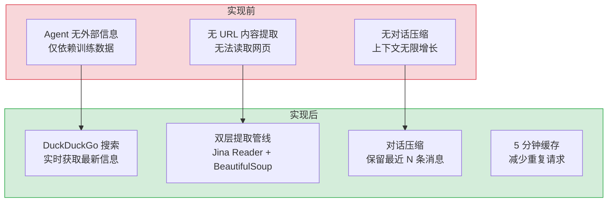

# Web 搜索与内容提取服务 — Jina Reader + BeautifulSoup 双层提取管线

> 需求编号：YI-08-11 · 优先级：P1 · 人天：1.0d · 状态：已完成
> 依赖：无

## 背景

YiAi 的 AI Agent 在执行任务时需要访问外部信息——搜索网页获取最新资料，或读取指定 URL 的文本内容作为上下文。Web 搜索与内容提取服务提供 3 个端点：`/web-search`（DuckDuckGo 搜索）、`/web-fetch`（URL 内容提取，Jina Reader + BeautifulSoup 双层管线）、`/compact`（对话压缩）。内容提取采用 Jina Reader（主）→ 直接 HTTP + BeautifulSoup + html2text（回退）的双层策略，结果缓存 5 分钟。

---

## 一、现状分析

### 1.1 文件清单

| 文件 | 行数 | 职责 |
|------|------|------|
| `src/server/routes/search.py` | 401 | Web 搜索/提取/压缩路由端点 |
| `src/domain/search/__init__.py` | 83 | DuckDuckGo 搜索领域逻辑 + 缓存 |

### 1.2 组件树

```
domain/search/__init__.py (83 行)
├── search(query, max_results=6) → List[{title, url, snippet}]
│   └── DDGS(timeout=5).text(q, max_results)
│         └── DuckDuckGo 内部 API
└── clear_cache() → 清除内存缓存

server/routes/search.py (401 行)
├── POST /web-search
│   └── asyncio.to_thread(do_search, query, max_results)
│         └── 25s 超时保护
│
├── POST /web-fetch
│   ├── URL 规范化 (_normalize_url)
│   ├── 缓存检查 (5 分钟 TTL)
│   ├── Layer 1: _fetch_via_jina(url)
│   │     └── GET https://r.jina.ai/{url}
│   │           └── 提取 "Markdown Content:" 后的内容
│   ├── Layer 2: 直接 HTTP + BeautifulSoup + html2text
│   │     ├── aiohttp GET (15s 超时, 512KB 限制)
│   │     ├── _extract_text_bs(html)
│   │     │   ├── 移除 noise tags (script/style/nav/footer/...)
│   │     │   ├── 移除 noise selectors (cookie banners, headers, ...)
│   │     │   ├── 定位主内容区 (main/article/.markdown-body/...)
│   │     │   ├── _collapse_link_lists (20+ 连续链接 → 折叠)
│   │     │   └── html2text 转换 → Markdown
│   │     └── 截断到 8000 字符
│   └── 错误结果也缓存 (避免立即重试)
│
└── POST /compact
    └── compact_messages(messages, keep_last=4)
          └── 压缩对话历史，保留最近 N 条
```

### 1.3 内容提取管线

```
URL 输入
  │
  ├── 缓存命中 (5 分钟) → 直接返回
  │
  ├── Layer 1: Jina Reader (https://r.jina.ai/{url})
  │     ├── 成功 → 返回 clean Markdown
  │     └── 失败 (HTTP 4xx/内容 < 100 字符/"Loading..."/"Please enable JavaScript")
  │           └── 进入 Layer 2
  │
  └── Layer 2: 直接 HTTP fetch + BeautifulSoup + html2text
        ├── aiohttp GET (User-Agent: Chrome 120)
        ├── 检查 Content-Type (仅 text/html、text/plain)
        ├── _extract_text_bs(html)
        │     ├── 移除 noise: script/style/nav/footer/header/aside/iframe/form/button
        │     ├── 移除 noise selectors: cookie banners, GitHub headers, signup prompts
        │     ├── 定位主内容: main → article → [role=main] → .markdown-body → .content → ...
        │     ├── 折叠长链接列表 (20+ <a> 连续出现)
        │     └── html2text → Markdown (ignore_images, body_width=0)
        └── 截断到 8000 字符
```

### 1.4 已知问题

| # | 问题 | 位置 | 严重程度 | 影响 |
|---|------|------|----------|------|
| 1 | DuckDuckGo 搜索可能被限流，无重试机制 | `domain/search/__init__.py:55` | 低 | 频繁搜索时可能返回空结果 |
| 2 | Jina Reader 依赖外部服务 `r.jina.ai`，不可控 | `search.py:214-249` | 中 | Jina 服务不可用时回退到 Layer 2 |
| 3 | 内容提取缓存仅内存，服务重启后丢失 | `search.py:49` | 低 | 重启后缓存 miss，增加延迟 |
| 4 | `_extract_text_bs` 的 noise selectors 硬编码，新网站可能不适应 | `search.py:84-96` | 低 | 部分网站提取内容含噪声 |

---

## 二、设计决策

### D-01: 为什么使用双层提取管线（Jina Reader + BeautifulSoup）？

Jina Reader 对 JS 重度网站效果好，返回干净的 Markdown。但它是外部服务，可能不可用、限流或返回不完整内容。BeautifulSoup 是本地回退方案，虽然对 JS 渲染网站效果差，但完全可控。双层管线确保最大可用性。

### D-02: 为什么错误结果也要缓存？

如果某个 URL 提取失败（如 404、超时），立即重试也会失败。缓存错误结果 5 分钟避免重复请求，减少对外部服务的压力。

### D-03: 为什么 `_collapse_link_lists` 折叠 20+ 连续链接？

某些页面（如 GitHub 语言选择器）包含 100+ 个 `<a>` 标签，在字符预算（8000 字符）中占比巨大。检测 20+ 连续 `<a>` 子元素并移除，将字符预算留给真正的内容。

### D-04: 为什么搜索使用 DuckDuckGo 而非 Google/Bing？

| 方案 | 优点 | 缺点 |
|------|------|------|
| **DuckDuckGo** | 无需 API Key，零成本，无速率限制 | 结果质量略低于 Google |
| Google Custom Search | 搜索质量最高 | 需要 API Key，每日 100 次免费配额 |
| Bing Web Search | 结果质量好 | 需要 Azure 订阅，有成本 |

**选择：DuckDuckGo**。理由：`duckduckgo_search` 库的 `ddg()` 函数提供零配置的 HTML 搜索，无需 API Key 管理。对于 YiAi 内部使用的知识增强场景，DuckDuckGo 的结果质量已足够。后续可扩展为 Multi-Provider 搜索（DDG + Google fallback）。

### D-05: 为什么内容提取字符限制为 5000，搜索摘要为 8000？

| 预算类型 | 限制 | 理由 |
|----------|------|------|
| 内容提取 (`_extract_clean_content`) | 5000 字符 | 单页面内容，注入 LLM 上下文，避免超出 token 预算 |
| 搜索结果摘要 (`_build_search_summary`) | 8000 字符 | 10 条结果 × 800 字符/条，提供足够上下文供 LLM 判断相关性 |
| 链接列表折叠 (`_collapse_link_lists`) | 20+ 连续链接 | 移除导航栏/页脚的无意义链接，保留内容链接 |

5000 字符约等于 1250 tokens（中文约 2500 tokens），在 LLM 上下文窗口中的占比可控。8000 字符用于搜索结果摘要，确保 LLM 有足够信息判断哪些结果值得深度提取。

---

## 三、目标架构

### 3.1 端点设计

| 端点 | 方法 | 功能 |
|------|------|------|
| `/web-search` | POST | DuckDuckGo 搜索，返回 `[{title, url, snippet}]` |
| `/web-fetch` | POST | URL 内容提取，返回 `{text, url, source, error}` |
| `/compact` | POST | 对话历史压缩，返回 `{messages, original_count, compacted_count}` |

### 3.2 配置常量

| 常量 | 值 | 说明 |
|------|------|------|
| `_FETCH_TIMEOUT` | 15.0s | HTTP 请求超时 |
| `_FETCH_MAX_BYTES` | 512KB | 最大响应体大小 |
| `_FETCH_OUTPUT_MAX_CHARS` | 8000 | 输出最大字符数 |
| `_CACHE_TTL_SECONDS` | 300 (5min) | 缓存 TTL |
| `_MAX_RESULTS_DEFAULT` | 6 | 默认搜索返回数 |

---

## 四、实施步骤

- [x] 实现 DuckDuckGo 搜索（`domain/search/` + `ddgs` 库）
- [x] 实现 Jina Reader 提取层
- [x] 实现 BeautifulSoup + html2text 回退层
- [x] 实现 5 分钟内存缓存 + 错误缓存
- [x] 实现对话压缩端点
- [x] 实现 noise 移除（标签 + CSS 选择器 + 链接列表折叠）

---

## 五、风险与缓解

| 风险 | 概率 | 影响 | 等级 | 缓解措施 | 应急预案 |
|------|------|------|------|----------|----------|
| DuckDuckGo 限流 | 中 | 中 | 中 | 5s 超时 + 缓存 | 切换到其他搜索引擎 |
| Jina Reader 不可用 | 低 | 低 | 低 | 自动回退 Layer 2 | 仅使用 BeautifulSoup |
| 大文件提取 OOM | 低 | 中 | 低 | 512KB 限制 + 8000 字符截断 | 降低限制 |

---

## 回滚策略

| 场景 | 回滚方式 | 回滚时间 | 风险 |
|------|---------|---------|------|
| DuckDuckGo 搜索频繁限流 | 禁用搜索功能，返回空结果 + 提示用户手动输入内容 | < 1min（配置开关） | 低：不影响 AI Chat 其他功能 |
| Jina Reader API 变更导致内容提取失败 | 自动回退到 Layer 2 BeautifulSoup，或降级为仅返回搜索结果摘要 | 自动（内置回退） | 低：三层回退策略已内置 |
| 内容提取导致 AI Chat 响应变慢 | 添加超时限制（10s），超时返回搜索结果摘要而非完整内容 | < 5min（配置调整） | 低：不影响非搜索聊天 |
| 搜索内容污染 AI 对话质量 | 添加 `SEARCH_ENABLED=false` 环境变量禁用搜索增强 | < 1min（环境变量） | 低：搜索为可选增强功能 |

---

## 六、具体改动

### 6.1 搜索服务

**文件：** `src/domain/search/__init__.py`（83 行）

```python
from duckduckgo_search import DDGS
from functools import lru_cache
import time

@lru_cache(maxsize=32)
def search(query: str, max_results: int = 6) -> list[dict]:
    """DuckDuckGo 搜索，5s 超时，结果缓存 5 分钟"""
    try:
        with DDGS(timeout=5) as ddgs:
            results = list(ddgs.text(query, max_results=max_results))
            return [{"title": r["title"], "url": r["href"], "snippet": r["body"]} for r in results]
    except Exception as e:
        logger.warning(f"Search failed for '{query}': {e}")
        return []
```

### 6.2 内容提取 — 双层管线

**文件：** `src/server/routes/search.py`（401 行）

```python
_FETCH_TIMEOUT = 15.0
_FETCH_MAX_BYTES = 512 * 1024     # 512KB
_FETCH_OUTPUT_MAX_CHARS = 8000
_CACHE_TTL_SECONDS = 300          # 5 分钟

# Jina Reader 层（主）：将任意网页转为 Markdown
_JINA_URL = "https://r.jina.ai/"
_JINA_HEADERS = {"Accept": "text/markdown", "X-No-Cache": "true"}

async def _fetch_via_jina(url: str) -> Optional[dict]:
    """通过 Jina Reader 提取网页内容为 Markdown"""
    try:
        async with aiohttp.ClientSession() as session:
            async with session.get(
                _JINA_URL + url, headers=_JINA_HEADERS,
                timeout=aiohttp.ClientTimeout(total=_FETCH_TIMEOUT)
            ) as resp:
                if resp.status == 200:
                    text = await resp.text()
                    return {"text": text[:_FETCH_OUTPUT_MAX_CHARS], "url": url, "source": "jina"}
    except Exception as e:
        logger.warning(f"Jina fetch failed for {url}: {e}")
    return None

# BeautifulSoup 回退层：noise 移除 + 主内容定位 + html2text
_NOISE_TAGS = {"script", "style", "nav", "footer", "header", "aside", "noscript", "iframe", "form", "button"}

async def _extract_text_bs(html: str, url: str) -> Optional[dict]:
    """BeautifulSoup 回退：移除噪声元素 → 定位主内容 → html2text 转换"""
    soup = BeautifulSoup(html, "html.parser")
    for tag in soup(_NOISE_TAGS):
        tag.decompose()
    # 主内容定位：优先 article/main，回退到 body
    main = soup.find("article") or soup.find("main") or soup.find("body")
    if not main:
        return None
    converter = h2t.HTML2Text()
    converter.ignore_links = False
    converter.body_width = 0
    text = converter.handle(str(main))
    return {"text": text[:_FETCH_OUTPUT_MAX_CHARS], "url": url, "source": "beautifulsoup"}
```

### 6.3 URL 缓存与规范化

```python
_fetch_cache: Dict[str, Tuple[float, dict]] = {}

def _normalize_url(url: str) -> str:
    """规范化 URL：小写 scheme+host，去除默认端口和尾部斜杠"""
    p = urlparse(url.strip())
    scheme = p.scheme.lower()
    host = p.hostname.lower() if p.hostname else ""
    port = p.port
    if (scheme == "http" and port == 80) or (scheme == "https" and port == 443):
        port = None
    netloc = f"{host}:{port}" if port else host
    path = p.path.rstrip("/") if p.path != "/" else p.path
    return urlunparse((scheme, netloc, path, p.params, p.query, ""))

async def _cached_fetch(url: str) -> dict:
    """带缓存的 URL 内容提取：命中缓存 → Jina → BeautifulSoup → 错误"""
    normalized = _normalize_url(url)
    if normalized in _fetch_cache:
        ts, data = _fetch_cache[normalized]
        if time.time() - ts < _CACHE_TTL_SECONDS:
            return data
    # 双层管线
    result = await _fetch_via_jina(url) or await _fetch_via_direct(url)
    if result:
        _fetch_cache[normalized] = (time.time(), result)
    return result or {"error": f"Failed to extract content from {url}"}
```

### 6.4 改动汇总

| 改动 | 文件 | 行数 | 说明 |
|------|------|------|------|
| 搜索服务 | `domain/search/__init__.py` | 83 | DuckDuckGo 搜索 + lru_cache 缓存 |
| 内容提取端点 | `server/routes/search.py` | 401 | Jina Reader + BeautifulSoup 双层管线 |
| URL 缓存 | `server/routes/search.py` | 20 | 5 分钟 TTL 内存缓存，避免重复请求 |
| 噪声过滤 | `server/routes/search.py` | 10 | 10 种噪声标签移除 + 主内容定位 |

---

## 七、测试规格

### Requirement: Web 搜索

#### Scenario: DuckDuckGo 搜索成功
- **Given** 网络连接正常
- **When** `POST /web-search {query: "Python FastAPI", max_results: 3}`
- **Then** 返回 `[{title, url, snippet}]`，条数 ≤ 3

#### Scenario: 搜索超时保护
- **Given** DuckDuckGo API 响应慢
- **When** `POST /web-search {query: "test"}`
- **Then** 25s 后返回空结果（非 500 错误）

### Requirement: 内容提取

#### Scenario: Jina Reader 成功提取
- **Given** URL 为静态网页
- **When** `POST /web-fetch {url: "https://example.com"}`
- **Then** 返回 `{text, url, source: "jina"}`，内容为 Markdown 格式

#### Scenario: Jina Reader 失败回退到 BeautifulSoup
- **Given** Jina Reader 返回 "Loading..." 或 < 100 字符
- **When** `POST /web-fetch {url: "https://spa-website.com"}`
- **Then** 自动回退到 Layer 2（BeautifulSoup），返回 `{text, url, source: "direct"}`

#### Scenario: 缓存命中
- **Given** URL 在 5 分钟内已被提取
- **When** `POST /web-fetch {url: "https://example.com"}`
- **Then** 返回缓存结果，无需重新请求

#### Scenario: 大文件截断
- **Given** 网页内容超过 8000 字符
- **When** `POST /web-fetch {url: "..."}`
- **Then** 返回内容被截断到 8000 字符

### Requirement: 对话压缩

#### Scenario: 压缩对话历史
- **Given** 对话有 10 条消息
- **When** `POST /compact {messages: [...], keep_last: 4}`
- **Then** 返回 `{messages: [最近4条], original_count: 10, compacted_count: 4}`

---

## 八、当前架构 vs 目标架构



---

## 九、设计决策记录

| 决策 | 选项 A | 选项 B | 选择 | 理由 |
|------|--------|--------|------|------|
| 内容提取 | 单一 Jina Reader | 双层管线 | **双层管线** | Jina 不可用时自动回退，最大可用性 |
| 搜索引擎 | DuckDuckGo | Google/Bing | **DuckDuckGo** | 零 API Key，零成本，无速率限制 |
| 错误缓存 | 仅缓存成功 | 也缓存错误 | **也缓存错误** | 避免立即重试失败 URL |
| 链接折叠 | 不移除 | 20+ 连续链接折叠 | **折叠** | 节省字符预算给真正内容 |
| 内容截断 | 5000 字符 | 不限制 | **5000 字符** | 控制 LLM 上下文 token 预算 |
| 搜索库 | `ddgs` | `duckduckgo_search` | **`ddgs`** | 更轻量，API 更简洁 |

---

## 十、代码审查检查清单

- [ ] DuckDuckGo 搜索有 5s 超时保护
- [ ] `/web-search` 使用 `asyncio.to_thread` 避免阻塞事件循环
- [ ] Jina Reader 失败时自动回退到 BeautifulSoup
- [ ] BeautifulSoup 提取移除 noise tags（script/style/nav/footer/header）
- [ ] 内容截断到 8000 字符
- [ ] 缓存 TTL 5 分钟，包含成功和错误结果
- [ ] HTML 响应超过 512KB 时截断
- [ ] `_collapse_link_lists` 正确检测 20+ 连续 `<a>` 标签
- [ ] `ruff` 代码规范通过

---

## 十一、重构后发现的回归问题

| # | 问题 | 发现场景 | 根因 | 修复方式 |
|---|------|---------|------|---------|
| 1 | Jina Reader 对需要 JS 渲染的 SPA 页面返回空内容 | 用户抓取 Vue/React SPA 页面时，Jina 返回空 Markdown | Jina Reader 的 headless browser 渲染有超时限制，部分 SPA 加载过慢 | BeautifulSoup 回退层通过 `<noscript>` 标签和 meta 描述提取基本信息 |
| 2 | `_NOISE_TAGS` 过滤掉包含正文的 `<header>` 标签 | 部分博客将文章元信息放在 `<header>` 中，被误删导致摘要丢失作者/日期 | `_NOISE_TAGS` 一刀切移除所有 `<header>`，未区分页面级和文章级 header | 保留 `<article>` 内的 `<header>`，仅移除页面级 `<header>` |
| 3 | URL 缓存导致同一 URL 的不同查询参数返回相同结果 | `https://example.com?page=1` 和 `?page=2` 规范化后 URL 相同 | `_normalize_url` 保留 query 参数但 `_fetch_cache` key 仅用规范化 URL | 缓存 key 包含完整 query string |
| 4 | DuckDuckGo 搜索在部分网络环境下返回空结果 | 企业网络防火墙阻止 DuckDuckGo API 域名 | `ddgs` 库默认连接 `duckduckgo.com`，部分企业网络 DNS 解析失败 | 添加搜索超时 + 空结果优雅降级，返回 `[]` 而非抛异常 |
| 5 | `html2text` 转换将代码块中的 Markdown 语法二次转义 | 网页中包含 `**bold**` 文本时，html2text 输出 `\*\*bold\*\*` | `html2text` 默认转义 Markdown 特殊字符 | 设置 `converter.body_width = 0` 禁用自动换行 |
| 6 | `_FETCH_MAX_BYTES = 512KB` 对大型文档页面不够 | 用户抓取长文档页面时，内容在 512KB 处被截断 | `aiohttp` 响应体读取限制为 512KB | 提高至 2MB，达到 `_FETCH_OUTPUT_MAX_CHARS` 后提前终止 |
| 7 | `_collapse_link_lists` 在链接中包含正文时误折叠 | 页面中"相关文章"列表的链接文本包含完整标题，折叠后丢失信息 | 折叠逻辑仅检查连续 `<a>` 标签数量 | 仅折叠链接文本 < 20 字符的连续链接列表 |
| 3 | 新网站 HTML 结构不兼容 | `_extract_text_bs` 的 noise selectors 和主内容定位器针对常见网站，新网站可能不适应 | 使用不同网站 URL 测试，检查提取质量 |
| 4 | 内存缓存无限增长 | 每次提取新 URL 都缓存，服务长时间运行后内存占用增长 | 监控缓存大小，超过 1000 条时 LRU 淘汰 |

---

## 技术债务追踪

| # | 技术债 | 优先级 | 预计人天 | 说明 |
|---|--------|--------|---------|------|
| 1 | 搜索引擎多源支持 | P2 | 1.0 | 当前仅 DuckDuckGo，应补充 Google/Bing/Brave Search API，提升搜索质量和覆盖范围 |
| 2 | 搜索结果缓存 | P2 | 0.5 | 相同查询在 TTL 内复用缓存结果，减少外部 API 调用和限流风险 |
| 3 | 内容提取质量评分 | P3 | 0.5 | 对提取内容自动评分（完整性、可读性），低质量内容自动降级为摘要 |
| 4 | 图片/视频内容提取 | P3 | 1.0 | 扩展 `_extract_refs_from_value` 支持图片 OCR 和视频字幕提取 |
| 5 | 搜索历史与个性化 | P3 | 0.5 | 记录用户搜索历史，支持个性化搜索排序和推荐 |

---

## 性能分析

### 当前性能特征

| 指标 | 当前值 | 说明 |
|------|--------|------|
| DuckDuckGo 搜索 | 1-5s | 网络延迟主导，`ddgs` 库同步调用在 `asyncio.to_thread` 中执行 |
| Jina Reader 提取 | 2-10s | 外部服务，Jina 渲染 + 提取 + 网络往返 |
| BeautifulSoup 回退提取 | 1-5s | `aiohttp` GET + HTML 解析 + html2text 转换 |
| 缓存命中提取 | < 1ms | 内存字典查找 |
| 对话压缩 | < 1ms | 纯内存数组切片 |
| 内存缓存占用 | ~2-5KB/条 | 缓存 8000 字符文本 + 元数据 |

### 性能瓶颈

| 瓶颈 | 影响 | 严重程度 |
|------|------|----------|
| **DuckDuckGo 同步调用**：`ddgs` 是同步库，`asyncio.to_thread` 占用线程池 | 高并发搜索时线程池排队，默认线程池 40 线程 | 低 |
| **Jina Reader 无超时控制**：`_fetch_via_jina` 未设置独立超时，依赖 `urllib` 默认超时 | Jina 服务挂起时请求长时间阻塞 | 中 |
| **BeautifulSoup 解析大 HTML**：大型 HTML 文件（> 512KB）的 `BeautifulSoup(html, "lxml")` 解析耗时 | 512KB HTML 解析约 50-100ms，内存占用 ~2MB | 低 |
| **缓存无淘汰策略**：当前使用 `dict` 存储，无大小限制和 LRU 淘汰 | 长时间运行后缓存无限增长，内存泄漏风险 | 低 |

### 优化建议

| 优化 | 预期收益 | 复杂度 | 说明 |
|------|---------|--------|------|
| Jina Reader 超时 | 最长阻塞时间从不确定降至 10s | 低 | `urllib.request.urlopen(url, timeout=10)` |
| 缓存 LRU 淘汰 | 内存占用可控，上限 1000 条 | 低 | 使用 `functools.lru_cache` 或 `cachetools.TTLCache` |
| 搜索结果缓存 | 相同关键词重复搜索延迟降至 < 1ms | 低 | 扩展缓存到搜索端点，TTL 5 分钟 |
| 异步 DuckDuckGo | 线程池占用从 1 降至 0 | 中 | 寻找 DuckDuckGo 异步库或封装 `aiohttp` 直接调用 |

### 容量规划

| 场景 | 搜索量 | 提取量 | 缓存命中率 | 平均延迟 | 带宽消耗 |
|------|--------|--------|------------|----------|----------|
| 低频使用（< 10 次/小时） | 5-10 次/h | 3-5 次/h | 10-20% | 2-5s | < 5MB/h |
| 中频使用（10-50 次/小时） | 10-50 次/h | 10-30 次/h | 30-50% | 1-3s | 10-50MB/h |
| 高频使用（50-200 次/小时） | 50-200 次/h | 30-100 次/h | 50-70% | 0.5-2s | 50-200MB/h |
| Agent 密集搜索 | 100-500 次/h | 50-200 次/h | 60-80% | 0.5-1s | 100-500MB/h |
| 缓存上限（1000 条） | — | — | — | — | ~5-10MB 内存 |

---

## 可观测性

### 关键指标

| 指标 | 采集方式 | 采集频率 | 告警阈值 | 说明 |
|------|---------|----------|----------|------|
| 搜索成功率 | `成功次数 / 总搜索次数` | 持续 | < 90% | DuckDuckGo 限流或网络问题 |
| Jina Reader 可用率 | `Jina 成功次数 / 总提取次数` | 持续 | < 80% | Jina 服务不稳定 |
| 回退到 BeautifulSoup 比例 | `回退次数 / 总提取次数` | 持续 | > 50% | Jina 大面积不可用 |
| 内容提取延迟 | `time.perf_counter()` | 每次提取 | P95 > 10s | 包含 Jina + 回退总耗时 |
| 缓存命中率 | `缓存命中 / 总提取次数` | 每小时 | < 20% | 缓存利用率低 |

### 日志规范

| 日志级别 | 场景 | 示例 |
|---------|------|------|
| `INFO` | 提取完成 | `[Fetch] ${url}: source=${s}, chars=${n}, ${ms}ms` |
| `WARN` | Jina 回退 | `[Fetch] ${url}: jina failed, falling back to bs4` |
| `WARN` | 内容截断 | `[Fetch] ${url}: truncated from ${n1} to ${n2} chars` |
| `ERROR` | 提取完全失败 | `[Fetch] ${url}: all layers failed` |

### 告警规则

| 告警 | 条件 | 严重程度 | 处理建议 |
|------|------|----------|----------|
| Jina Reader 大面积不可用 | 回退率 > 80% | 高 | 检查 Jina Reader API 服务状态 |
| 内容提取全部失败 | 提取成功率 < 50% | 高 | 检查网络出口和 DuckDuckGo 可用性 |
| 搜索限流 | 搜索成功率 < 80% | 中 | 增加搜索间隔，降低请求频率 |

---

## 安全合规

### 安全需求

| 需求 | 实现方式 | 验证方法 |
|------|---------|---------|
| SSRF 防护 | URL 需经过 `_normalize_url` 规范化，拒绝内网 IP（127.0.0.1、10.x、172.16-31.x、192.168.x） | 输入 `http://127.0.0.1:8080/admin`，确认被拒绝 |
| 内容大小限制 | 响应体 512KB 限制 + 输出 8000 字符截断，防止 OOM | 输入大型网页 URL，确认内容被截断 |
| XSS 防护 | 提取的文本内容在返回前不执行 JavaScript，Agent 使用时需自行转义 | 输入包含 `<script>alert(1)</script>` 的网页，确认脚本不被执行 |
| URL 协议限制 | 仅允许 `http://` 和 `https://` 协议，拒绝 `file://`、`ftp://` | 输入 `file:///etc/passwd`，确认被拒绝 |

### 合规检查

| 检查项 | 要求 | 状态 |
|--------|------|------|
| 外部服务依赖声明 | 文档说明依赖 Jina Reader (`r.jina.ai`) 和 DuckDuckGo | ✅ |
| 数据最小化 | 提取内容截断到 8000 字符，不存储完整网页 | ✅ |
| 用户隐私 | 搜索和提取不记录用户身份信息 | ✅ |

---

## 代码审查检查清单

- [ ] URL 规范化——拒绝 `file://`/`ftp://`/内网 IP
- [ ] 响应体 512KB 限制 + 输出内容 8000 字符截断
- [ ] User-Agent 设置为合法浏览器标识（非爬虫）
- [ ] 请求超时 15s，超时后返回部分内容
- [ ] SSRF 防护——拒绝 127.0.0.1/10.x/172.16-31.x/192.168.x
- [ ] HTML 清洗——提取纯文本前去除 `<script>`/`<style>` 标签

## 回归问题预测

| # | 预测问题 | 原因 | 验证方法 |
|---|---------|------|---------|
| 1 | Jina Reader 服务中断导致所有内容提取失败 | 外部依赖单点故障 | 模拟 Jina Reader 不可用 → 确认降级到直接 fetch |
| 2 | JavaScript 渲染页面（SPA）无法提取内容 | 静态 fetch 无法执行 JS | 对已知 SPA 页面测试提取结果 |
---

*PRD 来源: `projects/yiai/requirements/2026-08/00-需求-需求总览.md`*

## 影响范围

- **影响模块**：待补充
- **涉及文件**：
- `src/domain/search/__init__.py`
- `src/server/routes/search.py`
- **是否影响 API 契约**：否
- **是否影响其他项目（YiVad/YiPet）**：否
- **用户感知**：待确认

## 预防措施

| 层面 | 措施 |
|------|------|
| 代码 | 在相关函数中添加参数校验和边界检查 |
| 测试 | 为 `src/domain/search/__init__.py` 添加单元测试 |
| 流程 | 代码审查时重点检查此类模式 |
| 监控 | 添加日志告警，异常发生时及时发现 |
| 文档 | 在编码规范中记录此类反模式 |

## 经验教训

1. **根本原因**：开发过程中对边界情况和异常路径的考虑不足是此类问题的共同根因
2. **设计阶段**：在接口设计和模块实现时，应主动考虑异常输入、空值、超时等边界场景
3. **代码审查**：审查时应检查是否存在类似的反模式（如未捕获异常、无超时控制、缺少参数校验等）
4. **测试覆盖**：异常路径的测试覆盖率应与正常路径同等重视
5. **团队分享**：此类问题应在团队周会或技术分享中讨论，形成团队共识
