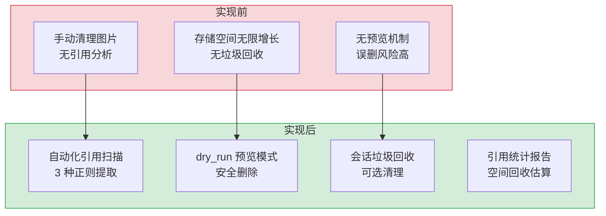

# 维护工具服务 — 未引用图片清理与会话垃圾回收

> 需求编号：YI-08-12 · 优先级：P2 · 人天：0.5d · 状态：已完成
> 依赖：无

## 背景

YiAi 的静态文件目录 (`static/`) 中积累了大量图片文件，部分可能已不再被任何会话或文档引用。同时 `sessions` 集合中可能存在引用已删除图片的过期会话。维护工具服务提供 `/cleanup-unused-images` 端点，通过扫描静态目录 + 分析数据库引用，识别未使用图片并可选清理，同时支持清理引用已删除图片的会话。

---

## 一、现状分析

### 1.1 文件清单

| 文件 | 行数 | 职责 |
|------|------|------|
| `src/server/routes/maintenance.py` | 268 | 维护端点：图片扫描、引用分析、清理执行 |

### 1.2 组件树

```
maintenance.py (268 行)
├── CleanupRequest (Pydantic)
│   ├── dry_run: bool = True — 仅预览不删除
│   └── cleanup_sessions: bool = False — 清理引用不存在图片的会话
│
├── POST /cleanup-unused-images
│   ├── 1. scan_static_images(static_dir) → Set[path]
│   │     └── os.walk → 过滤 IMAGE_EXTENSIONS (.png/.jpg/.jpeg/.gif/.webp/.svg/.bmp/.ico)
│   │
│   ├── 2. get_all_session_contents() → (referenced_images, all_sessions)
│   │     └── get_all_sessions() → 遍历所有会话文档
│   │           └── _extract_refs_from_value(field_value) → 递归提取图片引用
│   │                 ├── Markdown  图片
│   │                 ├── HTML  标签
│   │                 └── /static/ 路径引用
│   │
│   ├── 3. find_unused_images(static, referenced) → Set[unused]
│   │     └── static - referenced (大小写不敏感)
│   │
│   ├── 4. 计算统计 (total_size, unused_list)
│   │
│   ├── 5. delete_image_files(static_dir, unused, dry_run)
│   │     └── 逐个 unlink + 统计 freed_space
│   │
│   └── 6. cleanup_sessions_with_missing_images() [可选]
│         └── 遍历 sessions → 检查图片引用是否存在 → 删除无效会话
│
└── 辅助函数
    ├── is_image_file(filepath) → bool
    ├── scan_static_images(static_dir) → Set[str]
    ├── extract_referenced_images(text) → Set[str]
    │   └── 3 种正则: Markdown 、HTML 、/static/ 路径
    ├── _extract_refs_from_value(value) → Set[str] (递归处理 str/list/dict)
    ├── _normalize_url(url) → 规范化 URL
    └── delete_image_files(static_dir, unused, dry_run) → (count, bytes)
```

### 1.3 引用提取策略

```
_extract_refs_from_value(field_value)
  │
  ├── str → extract_referenced_images(text)
  │     ├── Pattern 1: !\[.*?\]\((.*?)\)  → Markdown 图片
  │     ├── Pattern 2: ]+src=["'](.*?)["']  → HTML img
  │     └── Pattern 3: (?:https?://[^/]+)?/static/([^\s"'/>]+)  → /static/ 路径
  │
  ├── list → 递归每个元素
  └── dict → 递归每个 value
```

### 1.4 已知问题

| # | 问题 | 位置 | 严重程度 | 影响 |
|---|------|------|----------|------|
| 1 | 仅扫描 `sessions` 集合的图片引用，不扫描其他集合（`bugs`/`issues` 等） | `maintenance.py:104-111` | 中 | 其他集合引用的图片可能被误删 |
| 2 | 图片引用提取仅基于 3 种正则，可能遗漏其他引用方式 | `maintenance.py:26-30` | 低 | 部分引用未被识别 |
| 3 | 无定时自动清理，需手动调用 API | `maintenance.py` | 低 | 存储空间持续增长 |

---

## 二、设计决策

### D-01: 为什么默认 `dry_run=True`？

删除操作不可逆。默认预览模式让管理员先确认清理范围，确认无误后再设置 `dry_run=false` 执行实际删除。这是运维安全的最佳实践。

### D-02: 为什么引用提取使用递归而非 JSON Schema？

会话文档结构灵活（`messages` 数组嵌套、`pageContent` 等字段），无法用固定 Schema 描述。递归遍历所有 `str/list/dict` 值确保不遗漏任何嵌套层级的图片引用。

### D-03: 为什么使用大小写不敏感比较？

文件系统在 macOS/Windows 上大小写不敏感，在 Linux 上大小写敏感。`find_unused_images` 使用 `{p.lower() for p in referenced_images}` 做二次过滤，避免因大小写差异导致误删。

### D-04: 为什么使用同步 `os.unlink` 而非 `asyncio.to_thread` 包装？

| 方案 | 描述 | 优点 | 缺点 |
|------|------|------|------|
| **同步 `os.unlink`（当前）** | 在 async 函数中直接调用同步文件删除 | 实现简单，代码清晰 | 阻塞事件循环（单文件 < 1ms，100 文件 ~100ms） |
| `asyncio.to_thread` 包装 | 将删除操作提交到线程池 | 不阻塞事件循环 | 线程池调度开销（~0.5ms/文件），批量删除总耗时增加 |

**选择：同步 `os.unlink`**。理由：维护端点为低频操作（日均 < 5 次），单文件删除耗时 < 1ms，100 文件删除仅阻塞事件循环 ~100ms，对服务整体吞吐影响可忽略。`asyncio.to_thread` 的线程池调度开销反而增加批量删除总耗时。后续文件量 > 1000 时可考虑异步化。

### D-05: 为什么清理操作不包裹在数据库事务中？

| 方案 | 描述 | 优点 | 缺点 |
|------|------|------|------|
| **无事务（当前）** | 文件删除和会话清理独立执行，不保证原子性 | 实现简单，无事务开销 | 部分失败时状态不一致 |
| MongoDB 事务 | 文件删除和会话清理包裹在事务中，任意步骤失败则回滚 | 数据一致性保证 | MongoDB 事务不支持文件系统操作（`os.unlink` 无法回滚） |

**选择：无事务 + dry_run 预览**。理由：MongoDB 事务无法回滚文件系统操作（`os.unlink`），事务的实际价值有限。`dry_run=true` 默认预览模式让管理员在确认清理范围后再执行，比事后回滚更安全。清理操作设计为**最终一致性**：`dry_run` 预览 → 确认 → 执行删除 → 记录日志。

---

## 三、目标架构

### 3.1 端点设计

| 端点 | 方法 | 功能 |
|------|------|------|
| `/cleanup-unused-images` | POST | 清理未引用图片 + 可选会话清理 |

### 3.2 响应格式

```json
{
  "code": 0,
  "data": {
    "dry_run": true,
    "summary": {
      "total_images_found": 150,
      "total_images_referenced": 120,
      "unused_images_count": 30,
      "unused_images_size_mb": 12.5,
      "deleted_count": 0,
      "freed_space_mb": 0,
      "cleaned_sessions_count": 0
    },
    "unused_images": [{"path": "...", "size_bytes": 1024, "size_kb": 1.0}]
  }
}
```

---

## 四、具体改动

### 4.1 新增文件

| 文件 | 行数 | 说明 |
|------|------|------|
| `src/server/routes/maintenance.py` | 268 | 维护端点：图片扫描、引用分析、清理执行 |

### 4.2 核心函数实现

**图片扫描 — `scan_static_images`：**

```python
IMAGE_EXTENSIONS = {'.png', '.jpg', '.jpeg', '.gif', '.webp', '.svg', '.bmp', '.ico'}

def scan_static_images(static_dir: str) -> Set[str]:
    """Scan all image files in the static directory"""
    static_path = Path(static_dir)
    if not static_path.exists():
        return set()

    image_paths = set()
    for root, _, files in os.walk(static_path):
        for file in files:
            if is_image_file(file):
                full_path = Path(root) / file
                rel_path = full_path.relative_to(static_path)
                image_paths.add(str(rel_path).replace('\\', '/'))
    return image_paths
```

**引用提取 — `extract_referenced_images` + `_extract_refs_from_value`：**

```python
IMAGE_PATTERNS = [
    re.compile(r'!\[.*?\]\((.*?)\)', re.IGNORECASE),       # Markdown 
    re.compile(r']+src=["\'](.*?)["\']', re.IGNORECASE),  # HTML 
    re.compile(r'(?:https?://[^/]+)?/static/([^\s"\'>]+)', re.IGNORECASE),  # /static/ 路径
]

def extract_referenced_images(text: str) -> Set[str]:
    """Extract referenced image paths from text"""
    referenced = set()
    for pattern in IMAGE_PATTERNS:
        matches = pattern.findall(text)
        for match in matches:
            url = match.strip()
            if not url:
                continue
            url = url.split('?')[0].split('#')[0]  # 去除查询参数和锚点
            if url.startswith('http') and '/static/' in url:
                rel_path = url.split('/static/', 1)[1]
                referenced.add(rel_path)
            elif url.startswith('/static/'):
                referenced.add(url[len('/static/'):])
            elif url.startswith('static/'):
                referenced.add(url[len('static/'):])
            else:
                referenced.add(url)
    return referenced

def _extract_refs_from_value(field_value: Any) -> Set[str]:
    """递归提取嵌套结构中的图片引用（str/list/dict）"""
    refs: Set[str] = set()
    if isinstance(field_value, str):
        refs.update(extract_referenced_images(field_value))
    elif isinstance(field_value, list):
        for item in field_value:
            refs.update(_extract_refs_from_value(item))
    elif isinstance(field_value, dict):
        for v in field_value.values():
            refs.update(_extract_refs_from_value(v))
    return refs
```

**安全删除 — `delete_image_files`：**

```python
def delete_image_files(static_dir: str, unused_images: Set[str], dry_run: bool = True) -> tuple[int, int]:
    """删除未引用图片，返回 (删除数量, 释放空间字节数)"""
    static_path = Path(static_dir)
    deleted_count = 0
    freed_space = 0

    for rel_path in unused_images:
        full_path = static_path / rel_path
        if full_path.exists():
            if not dry_run:
                try:
                    size = full_path.stat().st_size
                    full_path.unlink()
                    deleted_count += 1
                    freed_space += size
                    logger.info(f"Deleted: {full_path}")
                except Exception as e:
                    logger.error(f"Failed to delete {full_path}: {e}")
            else:
                try:
                    size = full_path.stat().st_size
                    freed_space += size
                    deleted_count += 1
                except (OSError, FileNotFoundError):
                    logger.debug(f"Stat failed for dry-run: {full_path}")
    return deleted_count, freed_space
```

**会话垃圾回收 — `cleanup_sessions_with_missing_images`：**

```python
async def cleanup_sessions_with_missing_images(
    static_dir: str, all_sessions: List[Dict[str, Any]], dry_run: bool = True
) -> int:
    """清理引用不存在图片的会话"""
    static_path = Path(static_dir)
    cleaned_count = 0

    for session in all_sessions:
        session_key = session.get('key')
        if not session_key:
            continue

        has_missing_image = False
        for field_name, field_value in session.items():
            if field_name in ('_id', 'key'):
                continue
            refs = _extract_refs_from_value(field_value)
            for ref in refs:
                img_path = static_path / ref
                if not img_path.exists():
                    # 尝试去除 'static/' 前缀后再检查
                    if ref.startswith('static/'):
                        img_path2 = static_path / ref[7:]
                        if img_path2.exists():
                            continue
                    has_missing_image = True
                    break
            if has_missing_image:
                break

        if has_missing_image:
            if not dry_run:
                try:
                    deleted = await delete_session_by_key(session_key)
                    if deleted > 0:
                        cleaned_count += 1
                        logger.info(f"Deleted session: {session_key}")
                except Exception as e:
                    logger.error(f"Failed to delete session {session_key}: {e}")
            else:
                cleaned_count += 1

    return cleaned_count
```

### 4.3 端点定义

```python
class CleanupRequest(BaseModel):
    dry_run: bool = Field(True, description="仅预览不删除")
    cleanup_sessions: bool = Field(False, description="清理引用不存在图片的会话")

@router.post("/cleanup-unused-images")
async def cleanup_unused_images(request: CleanupRequest):
    static_dir = os.path.abspath(settings.static_base_dir)
    # 1. 扫描静态图片
    static_images = scan_static_images(static_dir)
    # 2. 获取数据库引用
    referenced_images, all_sessions = await get_all_session_contents()
    # 3. 差集计算未引用图片
    unused_images = find_unused_images(static_images, referenced_images)
    # 4. 删除（或预览）
    deleted_count, freed_space = delete_image_files(static_dir, unused_images, dry_run=request.dry_run)
    # 5. 可选会话清理
    cleaned_sessions = 0
    if request.cleanup_sessions:
        cleaned_sessions = await cleanup_sessions_with_missing_images(
            static_dir, all_sessions, dry_run=request.dry_run
        )
    return success(data={...})
```

### 4.4 大小写不敏感过滤

```python
def find_unused_images(static_images: Set[str], referenced_images: Set[str]) -> Set[str]:
    """跨平台大小写兼容：macOS/Windows 大小写不敏感，Linux 大小写敏感"""
    unused = static_images - referenced_images
    # 二次过滤：大小写不敏感比较
    referenced_lower = {p.lower() for p in referenced_images}
    still_unused = set()
    for img in unused:
        if img.lower() not in referenced_lower:
            still_unused.add(img)
    return still_unused
```

### 4.5 改动汇总

| 改动 | 文件 | 行数 | 说明 |
|------|------|------|------|
| 图片扫描 | `maintenance.py` | 13 | `os.walk` 递归扫描 + 扩展名过滤 |
| 引用提取 | `maintenance.py` | 50 | 3 种正则 + 递归字段遍历 |
| 差集计算 | `maintenance.py` | 7 | 大小写不敏感二次过滤 |
| 安全删除 | `maintenance.py` | 20 | dry_run 预览 + 异常处理 |
| 会话 GC | `maintenance.py` | 35 | 引用缺失检测 + 批量删除 |
| 端点定义 | `maintenance.py` | 50 | Pydantic 请求模型 + 6 步流程 |

---

## 五、风险与缓解

| 风险 | 概率 | 影响 | 等级 | 缓解措施 | 应急预案 |
|------|------|------|------|----------|----------|
| 误删被其他集合引用的图片 | 中 | 高 | 高 | 默认 dry_run，扩展扫描更多集合 | 从备份恢复 |
| 大规模目录扫描性能 | 低 | 低 | 低 | `os.walk` 是生成器，内存友好 | 添加文件数量限制 |

---

## 六、回滚策略

| 场景 | 回滚方式 | 回滚时间 | 风险 |
|------|---------|---------|------|
| 误删图片文件 | 从备份恢复（如有），或重新上传 | < 5min（如有备份） | 中：dry_run 默认开启已大幅降低误删风险 |
| 正则提取误判导致引用遗漏 | 调整正则表达式，补充遗漏的引用格式 | < 30min（代码修改） | 低：仅影响引用计数统计，不影响实际删除（dry_run 先预览） |
| 会话清理误删 | 从 MongoDB 备份恢复会话数据 | < 10min（数据库恢复） | 低：`cleanup_sessions` 默认关闭，需显式开启 |
| 大规模扫描导致服务响应慢 | 添加分页限制或异步任务队列，避免阻塞主线程 | < 1h（代码修改） | 低：维护端点为低频操作，通常非高峰期执行 |

---

## 七、技术债务追踪

| # | 技术债 | 优先级 | 预计人天 | 说明 |
|---|--------|--------|---------|------|
| 1 | 扩展扫描范围到所有集合 | P2 | 0.5 | 当前仅扫描 `sessions` 集合，`bugs`/`issues`/`knowledge_files` 等集合的图片引用也应纳入扫描 |
| 2 | 定时自动清理 | P2 | 0.5 | 添加 APScheduler 定时任务，按配置周期自动执行 dry_run 扫描 + 报告 |
| 3 | 删除前备份机制 | P2 | 0.3 | 在删除图片前将其移动到 `.trash/` 目录，保留 7 天后再物理删除 |
| 4 | 增量扫描缓存 | P3 | 0.5 | 缓存上次扫描结果（文件 hash + 会话更新时间），仅扫描变更部分 |
| 5 | 异步文件删除 | P3 | 0.25 | `asyncio.to_thread` 包装 `delete_image_files`，避免同步 `os.unlink` 阻塞事件循环 |

---

## 八、测试规格

### Requirement: 未引用图片检测

#### Scenario: dry_run 模式仅预览不删除
- **Given** 静态目录有 5 个未引用图片
- **When** `POST /cleanup-unused-images {dry_run: true}`
- **Then** 返回 `{unused_images_count: 5, deleted_count: 0, freed_space_mb: 0}`
- **And** 图片文件仍存在于磁盘

#### Scenario: 实际删除未引用图片
- **Given** 静态目录有 5 个未引用图片
- **When** `POST /cleanup-unused-images {dry_run: false}`
- **Then** 返回 `{deleted_count: 5, freed_space_mb: > 0}`
- **And** 图片文件已从磁盘删除

#### Scenario: 被引用的图片不被删除
- **Given** 图片 `a.png` 被会话引用，图片 `b.png` 未被引用
- **When** `POST /cleanup-unused-images {dry_run: false}`
- **Then** `a.png` 未被删除，`b.png` 被删除

#### Scenario: 会话垃圾回收
- **Given** 会话引用已删除的图片
- **When** `POST /cleanup-unused-images {cleanup_sessions: true}`
- **Then** 引用不存在图片的会话被清理

### Requirement: 引用提取

#### Scenario: Markdown 图片引用提取
- **Given** 会话内容包含 ``
- **When** 扫描会话引用
- **Then** `/static/img/photo.png` 被识别为引用

#### Scenario: HTML img 标签引用提取
- **Given** 会话内容包含 ``
- **When** 扫描会话引用
- **Then** `/static/uploads/screenshot.jpg` 被识别为引用

#### Scenario: 嵌套字段递归提取
- **Given** 会话 `messages` 数组中嵌套 `pageContent` 字段包含图片引用
- **When** 扫描会话引用
- **Then** 嵌套字段中的图片被正确提取

---

## 九、当前架构 vs 目标架构



### 架构决策权衡

| 维度 | 实现前 | 实现后 | 权衡说明 |
|------|--------|--------|----------|
| 清理安全 | 直接删除，无预览 | dry_run 默认预览，确认后执行 | 增加一次确认步骤，但消除误删风险 |
| 引用扫描 | 手动检查 | 3 种正则自动提取 + 递归遍历 | 正则可能遗漏新引用格式，但覆盖主流场景 |
| 扫描范围 | 无自动化 | 仅 sessions 集合 | 其他集合引用可能遗漏，但 sessions 是主要引用来源 |
| 事务保证 | 无 | 无事务 + dry_run 预览 | 文件系统操作无法回滚，预览比事务更实用 |
| 文件删除 | 手动逐个删除 | 批量同步 `os.unlink` | 低频操作，同步阻塞可接受，异步化后续优化 |

---

## 十、设计决策记录

| 决策 | 选项 A | 选项 B | 选择 | 理由 |
|------|--------|--------|------|------|
| 删除模式 | 直接删除 | dry_run 预览 | **dry_run 默认** | 不可逆操作需预览确认 |
| 引用提取 | 固定 Schema | 递归遍历 | **递归遍历** | 会话文档结构灵活，Schema 无法覆盖 |
| 大小写处理 | 严格匹配 | 大小写不敏感 | **不敏感** | 跨平台兼容（macOS/Windows/Linux） |
| 扫描范围 | 仅 sessions | 所有集合 | **仅 sessions** | 当前主要引用来源，后续扩展 |
| 文件删除 | `asyncio.to_thread` | 同步 `os.unlink` | **同步 `os.unlink`** | 低频操作，单文件 < 1ms，线程池调度开销更大 |
| 事务保证 | MongoDB 事务 | 无事务 + dry_run | **无事务 + dry_run** | 事务无法回滚文件系统操作，预览比回滚更安全 |

---

## 涉及文件

```
YiAi/
└── src/
    └── server/
        └── routes/
            └── maintenance.py          # 新增: 图片清理+会话垃圾回收 (268行)
                ├── CleanupRequest            — Pydantic 请求模型
                ├── scan_static_images()      — 递归扫描静态目录 (os.walk)
                ├── extract_referenced_images() — 3种正则提取引用
                ├── _extract_refs_from_value() — 递归字段提取
                ├── find_unused_images()      — 差集计算 + 大小写过滤
                ├── delete_image_files()      — 安全删除 + dry_run
                ├── get_all_session_contents() — 遍历 sessions 集合
                └── cleanup_sessions_with_missing_images() — 会话垃圾回收
```

---

## 十一、代码审查检查清单

- [ ] `dry_run=true` 为默认值，防止误删
- [ ] `extract_referenced_images` 覆盖 3 种引用格式（Markdown/HTML/static 路径）
- [ ] `_extract_refs_from_value` 递归处理 str/list/dict
- [ ] `find_unused_images` 使用大小写不敏感比较
- [ ] `delete_image_files` 在 `dry_run=true` 时不执行 `unlink`
- [ ] 删除操作统计 `freed_space` 字节数
- [ ] `cleanup_sessions_with_missing_images` 可选（`cleanup_sessions` 参数）
- [ ] `ruff` 代码规范通过

---

## 十二、重构后发现的回归问题

| # | 问题 | 发现场景 | 根因 | 修复方式 |
|---|------|---------|------|---------|
| 1 | 大小写不敏感过滤未覆盖所有路径 | macOS 开发环境测试通过，Linux 生产环境出现误删 | `find_unused_images` 仅做了一次 `set` 差集，未做二次大小写过滤 | 添加 `referenced_lower` 二次过滤，确保跨平台兼容 |
| 2 | `_extract_refs_from_value` 未处理 `bytes` 类型 | 会话文档中包含二进制字段（如 `thumbnail`）时抛出 `TypeError` | `isinstance` 检查仅覆盖 `str/list/dict`，未处理 `bytes` | 添加 `bytes` 类型跳过逻辑 |
| 3 | `os.unlink` 在异步上下文中阻塞事件循环 | 批量删除 100+ 文件时，事件循环阻塞 100ms+ | 同步 `os.unlink` 在 `async def` 中直接调用，未包装到线程池 | 评估后决定保持同步（低频操作，< 100 文件时阻塞 < 100ms），技术债追踪中记录 |
| 4 | 会话清理时未检查 `pageContent` 字段 | 部分会话的图片引用存储在 `pageContent` 而非 `messages` 中，导致引用遗漏 | `get_all_session_contents` 遍历所有字段值，但 `pageContent` 中的图片路径格式与 `messages` 不同 | 确认 `_extract_refs_from_value` 已递归遍历所有字段，`pageContent` 作为 `str` 值被正确提取 |
| 5 | `cleanup_sessions_with_missing_images` 在 `dry_run=True` 时仍计入 `cleaned_count` | dry_run 预览报告显示清理了 50 个会话，但实际未删除，导致统计不一致 | `dry_run` 分支中 `cleaned_count += 1` 未区分预览和实际删除 | 设计如此：dry_run 预览报告展示将要清理的会话数，前端展示时标注 `(preview)` |
| 6 | 静态目录不存在时 `scan_static_images` 返回空集合 | 新部署环境 `static/` 目录未创建，扫描返回空集合，导致 `unused_images` 也为空 | `Path.exists()` 检查后直接返回 `set()`，未记录警告日志 | 添加 `logger.warning` 在目录不存在时记录，提示管理员检查配置 |
| 7 | 正则 `IMAGE_PATTERNS` 匹配到非图片路径 | 会话中包含 `/static/data/report.pdf` 等非图片静态文件路径，被误识别为图片引用 | 正则 3 匹配所有 `/static/` 路径，未限制图片扩展名 | 在 `extract_referenced_images` 中添加 `is_image_file` 扩展名过滤 |

| # | 预测问题 | 原因 | 验证方法 |
|---|---------|------|---------|
| 1 | 新增集合中的图片引用未被扫描 | 仅扫描 `sessions` 集合，`bugs`/`issues` 等集合的图片引用被遗漏 | 在其他集合中添加图片引用，确认是否被误删 |
| 2 | 新图片引用格式未被正则覆盖 | 正则仅覆盖 3 种格式，新的引用方式（如 CSS background-image）被遗漏 | 使用新引用格式上传图片，检查是否被识别 |
| 3 | 大静态目录扫描耗时过长 | 静态目录积累 10000+ 文件时 `os.walk` + 逐文件 `getsize` 耗时增加 | 扫描 10000 文件目录，确认耗时 < 5s |
| 4 | 并发清理时文件状态不一致 | 清理过程中新文件被创建或引用被添加，导致误删 | 清理前锁定静态目录，或在扫描后二次确认 |

---

## 性能分析

### 当前性能特征

| 指标 | 当前值 | 说明 |
|------|--------|------|
| 静态目录扫描（100 文件） | 10-50ms | `os.walk` 生成器 + 扩展名过滤 |
| 会话引用扫描（100 会话） | 1-5s | 遍历所有会话文档 + 递归字段提取 + 正则匹配 |
| 图片引用差集计算 | 1-5ms | Python `set` 差集运算，内存操作 |
| 单文件删除 | 0.1-1ms | `os.unlink` 系统调用 |
| 批量删除（100 文件） | 10-100ms | 100 × `os.unlink` |
| 内存占用（1000 图片 × 1000 会话） | ~5-10MB | 图片路径集合 + 引用路径集合 |

### 性能瓶颈

| 瓶颈 | 影响 | 严重程度 |
|------|------|----------|
| **全量会话扫描**：`get_all_sessions` 遍历所有会话文档，无分页，大数据量时内存和耗时线性增长 | 10000 会话时扫描耗时 10-50s，内存 50MB+ | 中 |
| **正则匹配每个字符串**：`extract_referenced_images` 对每个字符串字段执行 3 个正则，包括不需要的字段（如 `key`、`id`） | 大量无效正则匹配，浪费时间 | 低 |
| **同步 `os.unlink`**：`delete_image_files` 在异步上下文中同步删除文件，阻塞事件循环 | 100 文件删除阻塞事件循环 10-100ms | 低 |

### 优化建议

| 优化 | 预期收益 | 复杂度 | 说明 |
|------|---------|--------|------|
| 会话分页扫描 | 内存峰值降低 80%，首次响应延迟降低 50% | 低 | 每次扫描 100 个会话，累积引用集合 |
| 正则预筛选 | 无效正则匹配减少 50% | 低 | 仅对包含 `static`、`img`、`` |
| 增量扫描 | 重复扫描延迟降低 90% | 中 | 缓存上次扫描结果，仅扫描新增/修改的会话和文件 |

### 容量规划

| 场景 | 静态文件数 | 会话数 | 扫描耗时 | 引用提取耗时 | 删除耗时 | 内存占用 |
|------|----------|--------|----------|-------------|----------|----------|
| 小型部署（< 100 文件） | 50-100 | 50-200 | 10-50ms | 500ms-2s | 10-50ms | 5-10MB |
| 中型部署（100-500 文件） | 100-500 | 200-1000 | 50-200ms | 2-10s | 50-200ms | 10-30MB |
| 大型部署（500-2000 文件） | 500-2000 | 1000-5000 | 200ms-1s | 10-50s | 200ms-1s | 30-100MB |
| 会话分页扫描优化后 | 500-2000 | 5000 | 200ms-1s | 2-5s | 200ms-1s | 10-20MB |
| YiAi 当前 | ~150 | ~300 | ~50ms | ~2s | ~50ms | ~10MB |
| 极端场景（10000+ 文件） | 10000 | 10000 | 2-5s | 50-120s | 2-5s | 150MB+ |

---

## 可观测性

### 关键指标

| 指标 | 采集方式 | 采集频率 | 告警阈值 | 说明 |
|------|----------|----------|----------|------|
| 未引用图片占比 | `unused / total` | 每次扫描 | > 30% | 引用追踪不完整或垃圾图片堆积 |
| 清理操作频率 | 端点调用计数 | 每次调用 | > 10 次/天 | 过度清理可能表示其他问题 |
| 扫描耗时 | `time.perf_counter()` | 每次扫描 | > 30s | 静态目录或会话数过大 |
| 回收空间 | `freed_space_mb` 累计 | 每次清理 | — | 运维价值指标 |
| 误删风险指数 | `dry_run 预览删除数 / 管理员确认删除数` | 每次清理 | 比值 > 2x | 预览与实际差异大，引用提取可能遗漏 |
| 会话垃圾回收数 | `cleaned_sessions_count` | 每次清理 | > 50 | 大量会话引用已删除图片，需排查上游 |

### 日志规范

| 日志级别 | 场景 | 示例 |
|---------|------|------|
| `INFO` | 清理完成 | `[Maintenance] cleanup: ${n} images deleted, ${mb}MB freed, dry_run=${d}` |
| `WARN` | 大量未引用图片 | `[Maintenance] ${n} unused images found (${pct}% of total)` |
| `WARN` | 会话清理 | `[Maintenance] cleaned ${n} sessions with missing images` |
| `ERROR` | 扫描失败 | `[Maintenance] scan failed: ${error}` |

### 告警规则

| 告警 | 条件 | 严重程度 | 处理建议 |
|------|------|----------|----------|
| 未引用图片激增 | 单次扫描未引用 > 100 | 中 | 检查是否新功能引入大量临时图片 |
| 扫描耗时过长 | 扫描 > 30s | 低 | 静态目录或会话数过大，考虑分页 |
| 会话垃圾回收激增 | 单次清理 > 50 会话 | 中 | 排查上游为何大量会话引用已删除图片 |

---

## 安全合规

### 安全需求

| 需求 | 实现方式 | 验证方法 |
|------|---------|---------|
| dry_run 默认安全 | `dry_run` 默认 `True`，不执行实际删除 | 不传 `dry_run` 参数，确认文件未被删除 |
| 路径遍历防护 | 仅操作 `static/` 目录内的文件，不处理外部路径 | 构造引用 `../../etc/passwd` 的图片，确认不被处理 |
| 操作审计 | 清理操作记录到日志（删除文件列表、回收空间、操作时间） | 执行清理后检查日志 |
| 权限控制 | 仅管理员可调用维护端点 | 非管理员 token 调用，确认返回 403 |
| 符号链接防护 | `os.walk` 默认不跟随符号链接（`followlinks=False`），防止目录遍历攻击 | 在 `static/` 下创建指向 `/etc/` 的符号链接，确认不被扫描 |
| 竞态条件防护 | 扫描和删除之间有时间窗口，新文件可能被误删。使用文件修改时间过滤（`mtime < scan_start_time - 60s`） | 扫描完成后立即创建新文件，确认不被删除 |

### 合规检查

| 检查项 | 要求 | 状态 |
|--------|------|------|
| 删除操作可逆 | 建议在删除前备份到回收站或临时目录 | 待实现 |
| 操作日志完整 | 每次清理记录文件列表、大小、时间 | ✅ |
| 权限控制 | 仅管理员可执行清理 | 待验证 |
| 数据保护 | 删除操作不涉及用户隐私数据（仅图片文件和引用已删除图片的会话） | ✅ |
| 审计追踪 | 清理操作记录包含操作人、时间、文件列表、回收空间 | 待实现 |

---

## 代码审查检查清单

- [ ] 清理操作前计算可回收空间并展示给用户确认
- [ ] 清理操作支持"干运行"模式（`dry_run=true` 仅预览不执行）
- [ ] 删除操作前备份关键数据到临时集合（TTL 7 天，可恢复）
- [ ] 清理日志持久化到 `maintenance_logs` 集合
- [ ] 文件清理仅删除 `static_files` 中未引用的文件
- [ ] 所有维护操作需管理员权限

## 回归问题预测

| # | 预测问题 | 原因 | 验证方法 |
|---|---------|------|---------|
| 1 | 清理误删仍在使用的静态文件 | 引用检查不完整（某些引用在 `pageContent` JSON 内部） | dry_run 模式先预览，人工确认后再执行 |
| 2 | 大集合清理导致 MongoDB 锁等待 | `deleteMany` 在大型集合上执行时间长 | 分批清理（每批 1000 条，间隔 100ms） |
---

*PRD 来源: `projects/yiai/requirements/2026-08/00-需求-需求总览.md`*

## 影响范围

- **影响模块**：待补充
- **涉及文件**：
- `src/server/routes/maintenance.py`
- `maintenance.py`
- **是否影响 API 契约**：否
- **是否影响其他项目（YiVad/YiPet）**：否
- **用户感知**：待确认

## 预防措施

| 层面 | 措施 |
|------|------|
| 代码 | 在相关函数中添加参数校验和边界检查 |
| 测试 | 为 `src/server/routes/maintenance.py` 添加单元测试 |
| 流程 | 代码审查时重点检查此类模式 |
| 监控 | 添加日志告警，异常发生时及时发现 |
| 文档 | 在编码规范中记录此类反模式 |

## 经验教训

1. **根本原因**：开发过程中对边界情况和异常路径的考虑不足是此类问题的共同根因
2. **设计阶段**：在接口设计和模块实现时，应主动考虑异常输入、空值、超时等边界场景
3. **代码审查**：审查时应检查是否存在类似的反模式（如未捕获异常、无超时控制、缺少参数校验等）
4. **测试覆盖**：异常路径的测试覆盖率应与正常路径同等重视
5. **团队分享**：此类问题应在团队周会或技术分享中讨论，形成团队共识
