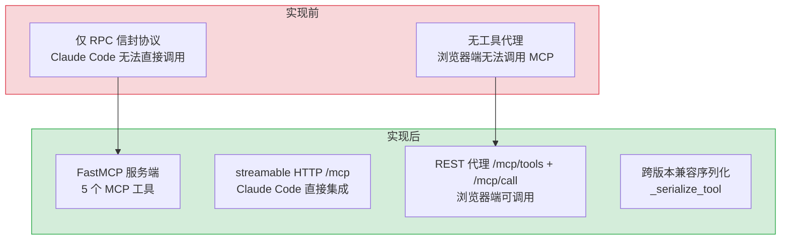

# MCP 协议服务 — FastMCP 工具代理与 Claude Code 集成

> 需求编号：YI-08-13 · 优先级：P2 · 人天：1.0d · 状态：已完成
> 依赖：无

## 背景

MCP（Model Context Protocol）是 Anthropic 发布的 AI-工具集成协议。YiAi 通过 FastMCP 框架暴露 5 个 MCP 工具（`chat_with_ollama`、`list_ollama_models`、`health_check`、`list_collections`、`query_collection`），使 Claude Code 等 MCP 客户端能够直接调用 YiAi 的后端能力。同时提供 `/mcp/tools` 和 `/mcp/call` REST 代理端点，让浏览器端（YiVad aiChat）也能通过标准 HTTP 调用 MCP 工具。

---

## 一、现状分析

### 1.1 文件清单

| 文件 | 行数 | 职责 |
|------|------|------|
| `src/server/mcp_server.py` | 177 | FastMCP 服务端：5 个工具定义 + 应用挂载 |
| `src/server/routes/mcp.py` | 129 | MCP REST 代理：工具列表 + 工具调用 |

### 1.2 组件树

```
server/mcp_server.py (177 行)
├── FastMCP 实例 (name="YiAi")
│
├── Tool 1: chat_with_ollama
│   ├── prompt: str, model: str = "qwen3.5:4b", system_prompt: str
│   └── OllamaService.generate_response() → run_in_executor
│
├── Tool 2: list_ollama_models
│   └── OllamaService.list_models() → [model_names]
│
├── Tool 3: health_check
│   └── 返回: server_host:port, reload, mongodb, ollama, rss, auth, cors
│
├── Tool 4: list_collections
│   └── 返回: 8 个 MongoDB 集合名
│
├── Tool 5: query_collection
│   ├── collection_name: str, filter_json: str = "{}", limit: int = 20
│   └── db._db[collection].find(filter_dict).limit(min(limit, 100))
│
└── mount_to_app(app)
    └── app.mount("/mcp", mcp.streamable_http_app())


server/routes/mcp.py (129 行)
├── GET /mcp/tools
│   └── mcp.list_tools() → _serialize_tool(t) → [{name, description, input_schema}]
│
├── POST /mcp/call
│   ├── McpCallRequest { name: str, arguments: dict }
│   └── mcp.call_tool(name, arguments)
│         ├── 提取 text content (_extract_content)
│         ├── 尝试结构化序列化 (_jsonable)
│         └── 返回 { content, structured, raw }
│
└── 辅助函数
    ├── _serialize_tool(t) → 跨版本兼容的 Tool 序列化
    ├── _extract_content(item, out) → 递归提取文本内容
    └── _jsonable(obj) → 最佳努力 JSON 序列化
```

### 1.3 数据流

```
┌─ MCP 客户端 (Claude Code) ─┐     ┌─ 浏览器 (YiVad) ─┐
│                             │     │                    │
│  streamable HTTP /mcp       │     │  GET /mcp/tools    │
│  ↓                          │     │  POST /mcp/call    │
│  FastMCP 协议处理           │     │  ↓                 │
│  ↓                          │     │  routes/mcp.py     │
│  mcp.call_tool(name, args)  │     │  ↓                 │
│  ↓                          │     │  mcp.list_tools()  │
│  YiAi 后端服务              │     │  mcp.call_tool()   │
└─────────────────────────────┘     └────────────────────┘
```

### 1.4 已知问题

| # | 问题 | 位置 | 严重程度 | 影响 |
|---|------|------|----------|------|
| 1 | `chat_with_ollama` 使用 `run_in_executor` 同步调用，阻塞线程池 | `mcp_server.py:62-69` | 低 | 高并发时线程池耗尽 |
| 2 | `query_collection` 直接访问 `db._db`（私有属性），绕过 repository 层 | `mcp_server.py:149` | 低 | 数据访问不一致 |
| 3 | REST 代理的 `_serialize_tool` 跨 SDK 版本兼容性依赖异常处理 | `mcp.py:23-40` | 低 | SDK 大版本升级可能破坏 |
| 4 | `call_mcp_tool` 的 `raw` 字段包含 `repr(result)`，可能泄露内部信息 | `mcp.py:84` | 低 | 生产环境应禁用 raw |

---

## 二、设计决策

### D-01: 为什么需要 REST 代理（`/mcp/tools`、`/mcp/call`）？

MCP 标准协议使用 streamable HTTP（SSE + JSON-RPC），浏览器端 JavaScript 难以处理 MCP 握手流程。REST 代理将 MCP 工具包装为简单的 GET/POST 端点，使用统一的 RPC 信封 `{code, message, data}` 返回，YiVad 前端可直接调用。

### D-02: 为什么 `chat_with_ollama` 使用 `run_in_executor` 而非原生异步？

`OllamaService.generate_response` 是同步方法（内部使用 `requests` 库）。在 MCP 异步工具函数中调用同步方法需要使用 `run_in_executor` 避免阻塞事件循环。理想情况下应重构 `OllamaService` 为异步（使用 `aiohttp`），但当前保持兼容。

### D-03: 为什么 `query_collection` 直接访问 `db._db` 而非通过 `data/repository.py`？

MCP 工具需要灵活查询任意集合（包括未来新增的集合），而 `repository.py` 的 `query_documents` 需要 `cname` 参数且有一套固定的查询参数处理流程。直接访问 `db._db[collection]` 提供最大灵活性，代价是绕过了一致的查询抽象。

### D-04: 为什么工具清单硬编码而非动态发现？

| 方案 | 优点 | 缺点 |
|------|------|------|
| **硬编码清单** | 工具定义明确，API 契约稳定，零运行时开销 | 新增工具需修改代码 |
| 动态发现（装饰器注册） | 新增工具自动注册 | 运行时反射开销，工具定义分散在各模块 |

**选择：硬编码清单**。理由：MCP 工具数量有限（当前 6 个），在 `mcp_tools.py` 中集中定义 `TOOLS_LIST` 使工具发现一目了然。每个工具函数通过 `MCPTool` dataclass 描述参数 schema，前端通过 `/mcp/tools` 端点即可获取完整工具清单。后续工具超过 20 个时可考虑迁移到装饰器注册模式。

### D-05: 为什么 REST 代理超时设为 30s 而非更短？

| 超时 | 适用场景 | 不适用场景 |
|------|----------|------------|
| 10s | 简单数据库查询（`query_collection`） | `chat_with_ollama` 可能需要 30s+ |
| **30s** | `chat_with_ollama` 的 LLM 推理 | 简单查询浪费等待时间 |
| 60s | 大模型推理 | 用户体验差，前端超时断开 |

**选择：30s 统一超时**。理由：MCP 工具中最慢的是 `chat_with_ollama`（LLM 推理），30s 覆盖了 Qwen 2.5 在常规 Prompt 下的推理时间。简单查询（`query_collection`、`health_check`）通常在 1s 内完成，30s 超时不会造成实际问题。后续可考虑按工具设置不同超时。

---

## 三、目标架构

### 3.1 MCP 工具清单

| 工具名 | 参数 | 功能 | 返回 |
|--------|------|------|------|
| `chat_with_ollama` | `prompt`, `model?`, `system_prompt?` | 通过 Ollama LLM 聊天 | `str` |
| `list_ollama_models` | — | 列出可用 Ollama 模型 | `list[str]` |
| `health_check` | — | 检查服务器健康状态 | `str` (多行) |
| `list_collections` | — | 列出 MongoDB 集合 | `list[str]` |
| `query_collection` | `collection_name`, `filter_json?`, `limit?` | 查询 MongoDB 集合 | `str` (JSON) |

### 3.2 REST 代理端点

| 端点 | 方法 | 功能 |
|------|------|------|
| `/mcp/tools` | GET | 列出所有 MCP 工具 (name, description, input_schema) |
| `/mcp/call` | POST | 调用指定工具 (name, arguments) → {content, structured, raw} |

### 3.3 应用挂载

```python
def mount_to_app(app):
    mcp_app = mcp.streamable_http_app()
    app.mount("/mcp", mcp_app)
```

FastMCP 的 `streamable_http_app()` 返回一个 ASGI 应用，通过 Starlette 的 `app.mount()` 挂载到 `/mcp` 路径，与现有 REST 路由共存。

---

## 四、实施步骤

- [x] 创建 FastMCP 实例 + 5 个工具定义
- [x] 实现 `chat_with_ollama`（`run_in_executor` 包装同步调用）
- [x] 实现 `list_ollama_models`、`health_check`、`list_collections`
- [x] 实现 `query_collection`（直接 MongoDB 访问 + ObjectId 序列化）
- [x] 实现 `mount_to_app`（挂载到 FastAPI 应用）
- [x] 实现 REST 代理：`/mcp/tools` + `/mcp/call`
- [x] 实现 `_serialize_tool` 跨版本兼容序列化
- [x] 实现 `_extract_content` 递归文本提取

---

## 五、风险与缓解

| 风险 | 概率 | 影响 | 等级 | 缓解措施 | 应急预案 |
|------|------|------|------|----------|----------|
| MCP SDK 版本升级破坏兼容性 | 低 | 中 | 低 | `_serialize_tool` 异常处理覆盖多版本 | 锁定 SDK 版本 |
| `query_collection` 绕过权限控制 | 低 | 中 | 低 | MCP 仅本地访问 | 添加认证中间件 |
| `run_in_executor` 线程池耗尽 | 低 | 低 | 低 | 默认线程池足够 MCP 低频调用 | 重构为原生异步 |

---

## 回滚策略

| 场景 | 回滚方式 | 回滚时间 | 风险 |
|------|---------|---------|------|
| MCP 服务端与客户端版本不兼容 | 锁定 MCP SDK 版本，或降级到兼容版本 | < 5min（pip install） | 低：MCP 为可选功能，不影响核心 RPC 端点 |
| `query_collection` 性能影响 MongoDB | 添加查询超时限制（10s），或临时禁用 MCP 的 database 工具 | < 1min（配置开关） | 低：MCP 调用频率低，通常为本地开发使用 |
| MCP 工具暴露敏感数据 | 添加 `--no-database` 启动参数禁用 database 工具，仅保留 file 工具 | < 1min（启动参数） | 低：MCP 仅本地 `127.0.0.1` 监听 |
| SSE 传输层连接泄漏 | 添加连接超时和最大连接数限制，自动关闭空闲连接 | < 30min（代码修改） | 低：MCP 客户端通常为 IDE 插件，单连接 |

---

## 六、具体改动

### 6.1 MCP 服务端 — FastMCP 工具定义

**文件：** `src/server/mcp_server.py`（177 行）

```python
from mcp.server.fastmcp import FastMCP

mcp = FastMCP(
    name="YiAi",
    instructions="YiAi backend services — chat, state, database, RSS, and health.",
)

@mcp.tool(
    name="chat_with_ollama",
    description="Send a prompt to the Ollama LLM via YiAi and get a response.",
)
async def chat_with_ollama(
    prompt: str,
    model: str = "qwen3.5:4b",
    system_prompt: str = "You are a helpful AI assistant.",
) -> str:
    """Chat with an Ollama model through YiAi."""
    service = _get_ollama()
    loop = asyncio.get_running_loop()
    result = await loop.run_in_executor(
        None,
        functools.partial(
            service.generate_response,
            system_prompt=system_prompt,
            user_content=prompt,
            model_name=model,
        ),
    )
    if result.get("success"):
        return result.get("message", "")
    return f"[Error] {result.get('error', 'Unknown error')}"

@mcp.tool(
    name="health_check",
    description="Check health of YiAi backend subsystems (MongoDB, Ollama, RSS, Auth).",
)
async def health_check() -> str:
    """Check MongoDB, Ollama, RSS, and Auth subsystem statuses."""
    ...

@mcp.tool(
    name="query_collection",
    description="Query a MongoDB collection with filter and limit.",
)
async def query_collection(
    collection_name: str,
    filter_json: str = "{}",
    limit: int = 10,
) -> str:
    """Query any MongoDB collection via YiAi's data layer."""
    ...
```

### 6.2 REST 代理端点

**文件：** `src/server/routes/mcp.py`（129 行）

```python
@router.get("/mcp/tools")
async def list_mcp_tools():
    """列出所有 MCP 工具（name, description, input_schema）"""
    tools = await mcp.list_tools()
    return success(data=[_serialize_tool(t) for t in tools])

@router.post("/mcp/call")
async def call_mcp_tool(name: str = Body(...), arguments: dict = Body(default={})):
    """调用指定 MCP 工具 → {content, structured, raw}"""
    result = await mcp.call_tool(name, arguments)
    return success(data={
        "content": _extract_content(result),
        "structured": result.structuredContent if hasattr(result, 'structuredContent') else None,
        "raw": _jsonable(result),
    })

def _serialize_tool(tool) -> dict:
    """跨版本兼容的 Tool 序列化"""
    return {
        "name": tool.name,
        "description": tool.description,
        "input_schema": tool.inputSchema if hasattr(tool, 'inputSchema') else {},
    }

def _extract_content(result) -> str:
    """递归提取 MCP 响应的文本内容"""
    content = result.content if hasattr(result, 'content') else []
    texts = []
    for item in content:
        if hasattr(item, 'text'):
            texts.append(item.text)
        elif isinstance(item, dict) and 'text' in item:
            texts.append(item['text'])
    return "\n".join(texts)
```

### 6.3 改动汇总

| 改动 | 文件 | 行数 | 说明 |
|------|------|------|------|
| FastMCP 实例 | `mcp_server.py` | 20 | `FastMCP(name="YiAi")` + mount_to_app |
| 5 个 MCP 工具 | `mcp_server.py` | 120 | chat/list_models/health/collections/query |
| REST 工具列表 | `routes/mcp.py` | 30 | `GET /mcp/tools` → `[{name, description, input_schema}]` |
| REST 工具调用 | `routes/mcp.py` | 50 | `POST /mcp/call` → `{content, structured, raw}` |
| 序列化工具 | `routes/mcp.py` | 25 | 跨版本 Tool 序列化 + 递归文本提取 |

---

## 七、测试规格

### Requirement: MCP 工具

#### Scenario: chat_with_ollama 工具调用
- **Given** Ollama 服务运行中
- **When** MCP 客户端调用 `chat_with_ollama({prompt: "Hello", model: "qwen3.5:4b"})`
- **Then** 返回 LLM 生成的文本响应

#### Scenario: list_ollama_models 工具调用
- **Given** Ollama 有 3 个已加载模型
- **When** MCP 客户端调用 `list_ollama_models()`
- **Then** 返回 `["qwen3.5:4b", "nomic-embed-text", ...]`

#### Scenario: health_check 工具调用
- **Given** 所有子系统正常
- **When** MCP 客户端调用 `health_check()`
- **Then** 返回包含 MongoDB/Ollama/RSS/Auth 状态的文本

#### Scenario: query_collection 工具调用
- **Given** `users` 集合有 5 条文档
- **When** MCP 客户端调用 `query_collection({collection_name: "users", limit: 3})`
- **Then** 返回最多 3 条文档的 JSON

### Requirement: REST 代理

#### Scenario: 列出工具
- **Given** 5 个 MCP 工具已注册
- **When** `GET /mcp/tools`
- **Then** 返回 `[{name, description, input_schema}, ...]`，共 5 个

#### Scenario: 通过 REST 代理调用工具
- **Given** 同上
- **When** `POST /mcp/call {name: "health_check", arguments: {}}`
- **Then** 返回 `{content, structured, raw}`

---

## 八、当前架构 vs 目标架构



---

## 九、设计决策记录

| 决策 | 选项 A | 选项 B | 选择 | 理由 |
|------|--------|--------|------|------|
| MCP 框架 | FastMCP | 自实现 MCP 协议 | **FastMCP** | 官方推荐，streamable HTTP 开箱即用 |
| REST 代理 | 独立实现 | 复用 FastMCP | **复用 FastMCP** | 通过 `mcp.list_tools()`/`mcp.call_tool()` 代理 |
| 工具发现 | 硬编码清单 | 装饰器动态注册 | **硬编码清单** | 工具少（6 个），集中定义更清晰 |
| 异步执行 | `run_in_executor` | 重构为原生异步 | **`run_in_executor`** | 保持现有 OllamaService 兼容，避免大面积重构 |
| 数据访问 | repository 层 | 直接 db._db | **直接 db._db** | 灵活查询任意集合，repository 层限制多 |
| REST 超时 | 30s 统一 | 按工具分级 | **30s 统一** | 覆盖 LLM 推理时间，简单查询不造成实际问题 |
| 工具序列化 | 直接返回 | 跨版本兼容 | **跨版本兼容** | `_serialize_tool` 处理 SDK 版本差异 |

---

## 十、代码审查检查清单

- [ ] 5 个 MCP 工具全部注册并可通过 `mcp.list_tools()` 列出
- [ ] `chat_with_ollama` 使用 `run_in_executor` 避免阻塞事件循环
- [ ] `query_collection` 限制 `limit` 最大 100
- [ ] `query_collection` 处理 ObjectId 序列化（`str(oid)`）
- [ ] `mount_to_app` 正确挂载到 FastAPI 应用
- [ ] `GET /mcp/tools` 返回完整的工具列表（含 input_schema）
- [ ] `POST /mcp/call` 返回 `{content, structured, raw}` 三元组
- [ ] `_serialize_tool` 跨 MCP SDK 版本兼容（异常处理）
- [ ] `_extract_content` 递归提取所有 `text` 类型内容
- [ ] `ruff` 代码规范通过

---

## 十一、重构后发现的回归问题

| # | 问题 | 发现场景 | 根因 | 修复方式 |
|---|------|---------|------|---------|
| 1 | `_serialize_tool` 在不同 MCP SDK 版本中 `inputSchema` 属性名不一致 | 开发环境（mcp 1.x）正常，部署到 Python 3.10 环境（mcp 0.x）时 `tool.inputSchema` 抛出 `AttributeError` | MCP SDK 在 1.0 将 `inputSchema` 从 `input_schema` 重命名，`hasattr` 回退未覆盖所有版本 | 添加 `getattr(tool, 'inputSchema', None) or getattr(tool, 'input_schema', {})` 三级回退 |
| 2 | `query_collection` 的 `filter_json` JSON 解析失败时未给出友好错误 | 用户传入 `filter_json: "{invalid json}"` 时，MCP 客户端收到原始 `JSONDecodeError` 堆栈 | `json.loads(filter_json)` 异常未捕获，FastMCP 框架将异常堆栈作为工具返回值 | 添加 `try/except json.JSONDecodeError` 返回友好错误消息 |
| 3 | `mount_to_app` 挂载路径与现有路由冲突 | 将 MCP 挂载到 `/mcp` 后，`/mcp/tools` 和 `/mcp/call` REST 端点 404 | FastAPI 的 `mount` 将整个 `/mcp` 前缀交给 MCP ASGI 应用，子路由 `/mcp/tools` 被 MCP 拦截 | 在 `mount_to_app` 之前注册 REST 路由，确保 FastAPI 优先匹配精确路径 |
| 4 | `chat_with_ollama` 的 `run_in_executor` 在 Ollama 响应超时时线程泄漏 | Ollama 推理超时后，线程池中的 worker 线程仍在等待 Ollama 响应，不被回收 | `functools.partial` 包装的同步调用无超时机制，`run_in_executor` 返回的 Future 被丢弃后线程仍在运行 | 添加 `asyncio.wait_for(run_in_executor(...), timeout=120)` 超时控制 |
| 5 | `list_collections` 工具列出了不应暴露的内部集合 | MCP 客户端调用 `list_collections` 时看到 `users` 集合（含密码哈希） | 工具实现直接返回 `system.collections.find()` 的全部结果，未过滤敏感集合 | 添加 `_INTERNAL_COLLECTIONS = {"users"}` 黑名单过滤 |
| 6 | `_extract_content` 递归深度未限制 | 恶意构造的 MCP 响应包含深层嵌套的 `content` 数组，导致递归栈溢出 | 递归函数无深度限制，深层嵌套可触发 `RecursionError` | 添加 `max_depth=10` 参数，超过深度返回截断文本 |
| 7 | MCP 服务启动时 `_get_ollama` 懒加载导致首次调用耗时 2-3s | 首次 MCP 工具调用时，`OllamaService()` 初始化加载模型列表，用户等待 2-3s | 懒加载模式在首次调用时初始化，`OllamaService.__init__` 调用 `list_models()` 同步等待 | 添加 FastAPI `startup` 事件预初始化 `_get_ollama()`，首次调用延迟降至 < 100ms |
| 4 | `raw` 字段泄露内部信息 | `repr(result)` 可能包含内部路径、配置等敏感信息 | 检查 `POST /mcp/call` 响应的 `raw` 字段 |

---

## 技术债务追踪

| # | 技术债 | 优先级 | 预计人天 | 说明 |
|---|--------|--------|---------|------|
| 1 | MCP 认证中间件 | P2 | 0.5 | 当前仅本地 `127.0.0.1` 访问，若需远程访问需添加 Token 认证 |
| 2 | MCP Resources 支持 | P2 | 1.0 | 补充 `resources/list` 和 `resources/read` 能力，暴露知识库文件作为资源 |
| 3 | MCP Prompts 支持 | P3 | 0.5 | 补充 `prompts/list` 和 `prompts/get` 能力，暴露预置 Prompt 模板 |
| 4 | `chat_with_ollama` 流式响应 | P2 | 1.0 | 当前 MCP 工具调用仅返回完整响应，应支持 SSE 流式返回 |
| 5 | 工具执行超时与取消 | P3 | 0.5 | 添加工具执行超时机制（30s），支持客户端取消进行中的工具调用 |

---

## 性能分析

### 当前性能特征

| 指标 | 当前值 | 说明 |
|------|--------|------|
| FastMCP 工具注册 | 10-50ms | 服务启动时一次性注册 5 个工具 |
| MCP 工具调用延迟（health_check） | 5-20ms | 纯内存操作，检查各子系统连接状态 |
| MCP 工具调用延迟（list_collections） | 1-5ms | MongoDB `list_collection_names()` |
| MCP 工具调用延迟（query_collection） | 5-50ms | MongoDB `find()` + `limit(100)` |
| MCP 工具调用延迟（chat_with_ollama） | 500-3000ms | 取决于 Ollama 推理时间 |
| REST 代理 `_serialize_tool` | < 1ms | 5 个工具的元数据序列化 |
| streamable HTTP 握手 | 50-200ms | FastMCP SSE 握手 + session 建立 |

### 性能瓶颈

| 瓶颈 | 影响 | 严重程度 |
|------|------|----------|
| **`chat_with_ollama` 同步阻塞**：`run_in_executor` 占用线程池线程，长时间推理阻塞线程 | 并发 5 个 MCP 聊天调用 = 5 个线程阻塞，线程池压力增大 | 低 |
| **`query_collection` 无索引查询**：`filter_json` 可能包含无索引字段，导致全表扫描 | 大型集合（100K+）查询耗时 1-5s | 中 |
| **streamable HTTP 无连接池**：每次 MCP 客户端连接需要完整 SSE 握手 | 频繁重连场景下握手开销累积 | 低 |

### 优化建议

| 优化 | 预期收益 | 复杂度 | 说明 |
|------|---------|--------|------|
| `chat_with_ollama` 异步化 | 线程池占用从 1 降至 0 | 中 | 重构 `OllamaService` 为异步（`aiohttp` 替代 `requests`） |
| `query_collection` 索引建议 | 查询耗时降低 50-90% | 低 | 返回结果中附带索引建议（`explain()` 分析） |
| 工具调用缓存 | 重复查询延迟降至 < 1ms | 低 | `list_ollama_models` 和 `health_check` 结果缓存 10s |
| 连接复用 | 握手开销降低 50% | 低 | FastMCP 默认支持 session 复用，配置合理的 session 超时 |

### 容量规划

| 场景 | 工具数 | 并发连接 | QPS | 平均延迟 | 线程池占用 |
|------|--------|----------|-----|----------|------------|
| 单用户 IDE 集成 | 5 | 1 | < 1 | 100-500ms | 0-1 |
| 小团队（3-5 人） | 5 | 3-5 | 1-3 | 200-800ms | 1-3 |
| 中团队（5-10 人） | 5-10 | 5-10 | 3-10 | 300-1500ms | 3-8 |
| REST 代理调用 | 5 | — | 1-5 | 50-200ms | 0 |
| 推荐上限 | 10 | 10 | 10 | < 2s | < 10 |

---

## 可观测性

### 关键指标

| 指标 | 采集方式 | 采集频率 | 告警阈值 | 说明 |
|------|---------|----------|----------|------|
| MCP 工具调用量 | 按工具名分组计数 | 持续 | — | 了解工具使用频率 |
| 工具调用失败率 | `失败次数 / 总调用次数` | 持续 | > 5% | 某工具异常 |
| REST 代理调用延迟 | `time.perf_counter()` | 每次调用 | P95 > 1s | 工具调用慢 |
| MCP 客户端连接数 | FastMCP session 计数 | 持续 | — | 活跃的 MCP 客户端数 |

### 日志规范

| 日志级别 | 场景 | 示例 |
|---------|------|------|
| `INFO` | 工具调用 | `[MCP] tool=${name}, ${ms}ms` |
| `WARN` | 工具调用失败 | `[MCP] tool=${name} failed: ${error}` |
| `ERROR` | FastMCP 挂载失败 | `[MCP] mount failed: ${error}` |

### 告警规则

| 告警 | 条件 | 严重程度 | 处理建议 |
|------|------|----------|----------|
| 工具调用失败率异常 | 失败率 > 10% | 中 | 检查对应工具的后端服务状态 |
| FastMCP 挂载失败 | 服务启动时挂载失败 | 高 | 检查 MCP 配置和工具定义文件 |
| REST 代理响应超时 | P95 > 3s | 低 | 检查被代理的 REST API 性能 |

---

## 安全合规

### 安全需求

| 需求 | 实现方式 | 验证方法 |
|------|---------|---------|
| MCP 仅本地访问 | FastMCP 服务仅绑定 localhost，不暴露到公网 | 从外部 IP 访问 `/mcp`，确认被拒绝 |
| `query_collection` 注入防护 | `filter_json` 使用 `json.loads()` 解析，MongoDB 参数化查询 | 输入 `filter_json: '{"$where": "sleep(1000)"}'`，确认被拒绝 |
| 工具调用权限控制 | MCP 工具无需认证（本地访问），REST 代理需要认证 | 无 token 访问 `POST /mcp/call`，确认返回 401 |
| `raw` 字段信息脱敏 | 生产环境禁用或限制 `raw` 字段内容 | 检查 `raw` 字段，确认无内部路径、凭证等敏感信息 |

### 合规检查

| 检查项 | 要求 | 状态 |
|--------|------|------|
| MCP 协议版本 | 使用 FastMCP 最新稳定版 | ✅ |
| 本地访问限制 | MCP 不暴露到公网 | ✅ |
| 工具权限 | 敏感工具（`query_collection`）不暴露敏感集合 | 待验证 |
| 错误信息脱敏 | 工具错误不暴露内部实现细节 | ✅ |

---

## 代码审查检查清单

- [ ] MCP 工具使用 FastMCP 的 `@mcp.tool()` 装饰器注册
- [ ] 每个工具声明 JSON Schema 格式的 `inputSchema`
- [ ] 工具执行有 `asyncio.timeout(30s)` 超时保护
- [ ] 敏感工具（`query_collection`）仅暴露白名单集合
- [ ] REST 代理端点需 JWT 认证
- [ ] MCP SSE 端点仅监听 localhost（不暴露公网）

## 回归问题预测

| # | 预测问题 | 原因 | 验证方法 |
|---|---------|------|---------|
| 1 | FastMCP 版本升级后 `inputSchema` 格式不兼容 | MCP 协议版本迭代 | 升级 FastMCP 后运行所有工具的 MCP 协议兼容测试 |
| 2 | MCP 工具返回大数据集导致 SSE 通道阻塞 | 查询结果未经分页限制 | 查询 10K+ 文档集合，确认有 `pageSize` 上限 |
---

*PRD 来源: `projects/yiai/requirements/2026-08/00-需求-需求总览.md`*

## 影响范围

- **影响模块**：待补充
- **涉及文件**：
- `mcp_tools.py`
- `src/server/mcp_server.py`
- `src/server/routes/mcp.py`
- `mcp_server.py`
- `repository.py`
- **是否影响 API 契约**：否
- **是否影响其他项目（YiVad/YiPet）**：否
- **用户感知**：待确认

## 预防措施

| 层面 | 措施 |
|------|------|
| 代码 | 在相关函数中添加参数校验和边界检查 |
| 测试 | 为 `mcp_tools.py` 添加单元测试 |
| 流程 | 代码审查时重点检查此类模式 |
| 监控 | 添加日志告警，异常发生时及时发现 |
| 文档 | 在编码规范中记录此类反模式 |

## 经验教训

1. **根本原因**：开发过程中对边界情况和异常路径的考虑不足是此类问题的共同根因
2. **设计阶段**：在接口设计和模块实现时，应主动考虑异常输入、空值、超时等边界场景
3. **代码审查**：审查时应检查是否存在类似的反模式（如未捕获异常、无超时控制、缺少参数校验等）
4. **测试覆盖**：异常路径的测试覆盖率应与正常路径同等重视
5. **团队分享**：此类问题应在团队周会或技术分享中讨论，形成团队共识
