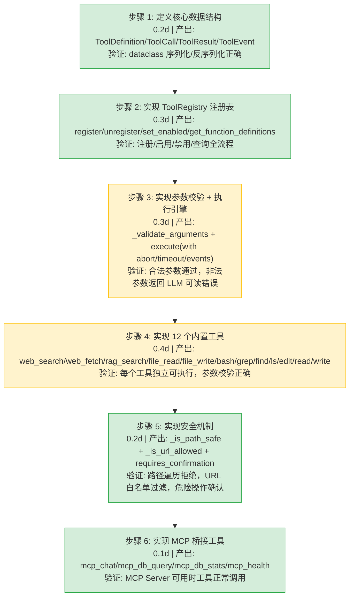
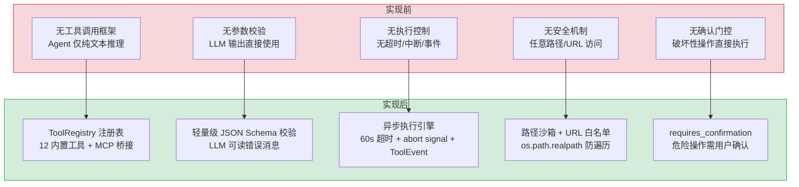

# Agent 工具系统

> 需求编号：YA-08-15 · 优先级：P0 · 人天：1.5d · 状态：已完成
> 依赖：AI 聊天服务（chat_service）、RAG 引擎（rag_engine）、MCP 协议服务（mcp_server）

## 背景

YiAi 的 AI Agent 需要像人类开发者一样与环境交互——搜索网页、检索知识库、读写文件、执行 Shell 命令、编辑代码。LLM 本身是纯文本模型，无法直接执行这些操作。业界标准方案是 **Function Calling**（OpenAI）/ **Tool Use**（Anthropic）：LLM 输出结构化的工具调用请求，宿主程序执行并将结果返回给 LLM 继续推理。

需要一个 Pi-inspired 的可插拔工具系统，支持：JSON Schema 参数声明、工具注册/启用/禁用、带超时和中断控制的异步执行、可观测性事件发射、路径沙箱安全防护、以及确认门控（危险操作需用户确认）。

---

## 一、现状分析

### 1.1 当前问题

| # | 问题 | 严重程度 | 影响 |
|---|------|----------|------|
| 1 | 无工具调用框架 | 高 | Agent 只能做纯文本推理，无法执行实际操作 |
| 2 | 无参数校验 | 中 | LLM 输出的工具参数可能缺失或类型错误，导致运行时崩溃 |
| 3 | 无执行超时/中断 | 中 | Shell 命令可能无限运行，Web 请求可能永久挂起 |
| 4 | 无安全沙箱 | 高 | 文件读写和 Shell 执行可能访问任意路径，存在安全风险 |
| 5 | 无确认门控 | 中 | 危险操作（写文件、执行命令）无用户确认环节 |

### 1.2 设计灵感

Pi 的 `AgentTool` + `executeTool` + `tool_execution_update` 模式。每个工具声明 JSON Schema、异步执行函数、确认标志。工具注册表生成 OpenAI/Anthropic 兼容的函数定义。执行引擎支持 abort signal、progress callback、超时控制和可观测性事件。

---

## 二、设计决策

### D-01: 为什么使用 `ToolRegistry` 而非字典存储？

`ToolRegistry` 提供集中的启用/禁用控制、函数定义生成（OpenAI 格式）、工具目录生成（UI 浏览用）、以及带事件发射的执行包装。纯字典无法提供这些能力，且每次添加工具都需要修改多处代码。

### D-02: 为什么参数校验是轻量级 JSON Schema 而非完整 jsonschema 库？

完整 `jsonschema` 库的错误消息是英文长句，不适合直接返回给 LLM 做自我修复。轻量级校验（`_validate_arguments`）仅检查 required 字段和 declared property types，返回短小精悍的错误消息（如 `Tool 'bash' is missing required argument 'command'`），LLM 可以直接理解并重新发出正确的调用。

### D-03: 为什么需要 `requires_confirmation` 标志？

部分工具（`file_write`、`bash`、`edit`、`write`）具有破坏性——可能覆盖文件、执行危险命令。`requires_confirmation` 标志让调用方（Agent 循环）在执行前暂停并等待用户确认，避免 LLM 幻觉导致的破坏性操作。

### D-04: 为什么路径沙箱使用白名单基目录而非黑名单？

黑名单（禁止 `/etc`、`/System`）总有遗漏，且攻击者可通过符号链接绕过。白名单（仅允许 `YiKnowledge/` 和 `YiAi/` 目录）从根本上限制可访问范围，`_is_path_safe` 使用 `os.path.realpath` 解析符号链接，防止路径遍历攻击。

### D-05: 为什么工具执行使用 `asyncio` 而非线程池？

所有工具操作（Web 请求、文件 I/O、Shell 子进程）都是 I/O 密集型的。`asyncio` 提供协作式并发，配合 `asyncio.wait_for` 实现超时控制，配合 `asyncio.Event` 实现中断信号。线程池适合 CPU 密集型操作，但工具系统主要是 I/O 等待。

### 设计决策记录

| 决策 | 选项 A | 选项 B | 选择 | 理由 |
|------|--------|--------|------|------|
| 工具存储 | `ToolRegistry` 类 | 普通 `dict` | **ToolRegistry** | 集中的启用/禁用、函数定义生成、事件发射 |
| 参数校验 | 轻量级 JSON Schema | 完整 `jsonschema` 库 | **轻量级校验** | 错误消息短小精悍，LLM 可直接理解并自我修复 |
| 安全模型 | 白名单基目录 | 黑名单路径 | **白名单** | 从根本上限制可访问范围，防止遗漏 |
| 确认门控 | `requires_confirmation` 标志 | 无确认 | **确认门控** | 破坏性操作需用户确认，防 LLM 幻觉 |
| 并发模型 | `asyncio` | 线程池 | **asyncio** | 工具主要是 I/O 等待，asyncio 协作式并发更高效 |
| 工具分组 | `_group_for()` 函数 | 无分组 | **分组** | 前端可按组展示工具目录（knowledge/search/filesystem/coding/agent） |

---

## 三、目标架构

### 3.1 模块结构

```
src/domain/ai/tools.py  (1143 lines)
├── ToolDefinition         # 工具声明：name, description, parameters (JSON Schema), execute, requires_confirmation
├── ToolCall               # LLM 发出的具体工具调用：id, name, arguments
├── ToolResult             # 工具执行结果：call_id, content, error, duration_ms, details
├── ToolEvent              # 可观测性事件：phase (start/update/end), label, args, content, error, duration_ms
├── ToolRegistry           # 工具注册表：register/unregister/set_enabled/get_enabled/get_function_definitions/execute
├── _validate_arguments()  # 轻量级 JSON Schema 参数校验
├── _register_builtin_tools()  # 注册 12 个内置工具
├── _register_mcp_tools()      # 注册 MCP 桥接工具
├── _group_for()           # 工具分组（knowledge/search/filesystem/coding/agent）
└── _format_file_size()    # 文件大小格式化辅助函数
```

### 3.2 核心数据结构

```python
@dataclass
class ToolDefinition:
    name: str                          # 唯一标识符，如 'web_search'
    description: str                   # LLM 可读的描述
    parameters: Dict[str, Any]         # JSON Schema 参数定义
    execute: Callable[..., Awaitable[Dict[str, Any]]]  # 异步执行函数
    requires_confirmation: bool = False  # 是否需要用户确认

@dataclass
class ToolCall:
    id: str                            # 调用 ID（LLM 生成）
    name: str                          # 工具名称
    arguments: Dict[str, Any]          # 解析后的参数

@dataclass
class ToolResult:
    call_id: str
    name: str
    content: str                       # 返回给 LLM 的文本内容
    error: Optional[str] = None        # 错误信息
    duration_ms: float = 0             # 执行耗时
    details: Any = None                # 结构化详情（不发给 LLM）
    terminate: bool = False            # 是否终止后续工具调用

@dataclass
class ToolEvent:
    phase: str                         # "start" | "update" | "end"
    name: str
    label: str                         # 人类可读标签
    args: Optional[Dict[str, Any]] = None
    content: Optional[str] = None
    error: Optional[str] = None
    duration_ms: float = 0
    timestamp: float = 0.0
    tool_call_id: Optional[str] = None
    partial_result: Optional[Dict[str, Any]] = None
    is_error: bool = False
```

### 3.3 工具注册表 API

```python
class ToolRegistry:
    def register(tool: ToolDefinition) -> None
    def unregister(name: str) -> None
    def set_enabled(name: str, enabled: bool) -> None
    def get(name: str) -> Optional[ToolDefinition]
    def get_enabled() -> List[ToolDefinition]
    def get_function_definitions() -> List[Dict]   # OpenAI 兼容格式
    def get_tool_catalog() -> List[Dict]            # UI 浏览用（含 group 和 requires_confirmation）
    async def execute(call, *, signal, on_event, on_progress, timeout) -> ToolResult
```

### 3.4 执行流程

```
Agent 循环
  │ LLM 返回 tool_calls: [{id, function: {name, arguments}}]
  ▼
ToolRegistry.execute(call, signal=abort_event, on_event=emit, timeout=60.0)
  │
  ├── 1. 查找工具定义 → 不存在则返回 error
  ├── 2. 检查启用状态 → 禁用则返回 error
  ├── 3. 校验参数 (JSON Schema) → 不合法则返回 error（含 LLM 可读的错误消息）
  ├── 4. 发射 ToolEvent(phase="start", label, args)
  ├── 5. 创建 asyncio.Task 执行工具
  │     ├── 轮询 abort signal → 触发则 cancel task
  │     └── asyncio.wait_for(task, timeout=timeout)
  ├── 6. 发射 ToolEvent(phase="end", content, error, duration_ms)
  └── 7. 返回 ToolResult(call_id, name, content, error, duration_ms, details)
```

---

## 四、内置工具清单

### 4.1 知识检索组

| 工具 | 名称 | 确认 | 说明 |
|------|------|------|------|
| `web_search` | 网页搜索 | 否 | 搜索互联网获取最新信息，返回标题+URL+描述 |
| `web_fetch` | 网页内容提取 | 否 | 通过 Jina Reader 或直接抓取获取网页文本内容，支持 on_progress 回调 |
| `rag_search` | 知识库检索 | 否 | 搜索 YiKnowledge 内部知识库，支持 scope 路径过滤 |

### 4.2 文件操作组

| 工具 | 名称 | 确认 | 说明 |
|------|------|------|------|
| `file_read` | 读取文件 | 否 | 读取 YiKnowledge 或项目目录中的文件内容 |
| `file_write` | 写入文件 | **是** | 向 YiKnowledge 或项目目录写入内容，需确认 |
| `read` | 分段读取 | 否 | 带 offset/limit 的分段读取，支持行号显示，8000 字符截断 |
| `write` | 创建/覆盖文件 | **是** | 创建新文件或覆盖已有文件（需 overwrite=true），自动创建父目录 |

### 4.3 Coding Agent 工具组（Pi 对等）

| 工具 | 名称 | 确认 | 说明 |
|------|------|------|------|
| `bash` | Shell 命令 | **是** | 执行 Shell 命令（build/test/lint/git），30s 超时，工作目录沙箱 |
| `grep` | 正则搜索 | 否 | 用正则表达式搜索文件内容，返回 file:line 引用，最多 50 条 |
| `find` | 文件查找 | 否 | 按 glob 模式查找文件，返回文件路径+大小，最多 100 条 |
| `ls` | 列出目录 | 否 | 列出目录内容，区分文件和目录，显示文件大小 |
| `edit` | 精确编辑 | **是** | 通过精确字符串替换编辑文件，old_string 必须唯一，返回 unified diff |

### 4.4 MCP 桥接组

| 工具 | 名称 | 确认 | 说明 |
|------|------|------|------|
| `mcp_chat` | MCP 聊天 | 否 | 调用 YiAi MCP Server 的 `chat_with_ollama` 工具 |
| `mcp_db_query` | MCP 数据库查询 | 否 | 调用 MCP Server 的 `db_query` 工具 |
| `mcp_db_stats` | MCP 数据库统计 | 否 | 调用 MCP Server 的 `db_stats` 工具 |
| `mcp_health` | MCP 健康检查 | 否 | 调用 MCP Server 的 `health_check` 工具 |

---

## 五、具体改动

### 5.1 涉及文件

| 文件 | 行数 | 说明 |
|------|------|------|
| `src/domain/ai/tools.py` | 1143 | 工具系统完整实现：类型定义、注册表、12 内置工具、MCP 桥接 |

### 5.2 核心函数实现

**轻量级参数校验 — `_validate_arguments`：**

```python
def _validate_arguments(name: str, arguments: Any, schema: Dict[str, Any]) -> Optional[str]:
    """Validate tool-call arguments against the tool's JSON Schema.
    Returns an error string if invalid, or None if valid. Lightweight check for
    required fields + declared property types — the LLM can re-issue the call correctly."""
    if arguments is None:
        arguments = {}
    if not isinstance(arguments, dict):
        return f"Arguments for '{name}' must be a JSON object, got {type(arguments).__name__}"
    props = schema.get("properties") or {}
    for req_field in schema.get("required") or []:
        if req_field not in arguments:
            return f"Tool '{name}' is missing required argument '{req_field}'"
    for fname, value in arguments.items():
        ptype = (props.get(fname) or {}).get("type")
        if ptype == "string" and not isinstance(value, str):
            return f"Tool '{name}' argument '{fname}' must be a string, got {type(value).__name__}"
        if ptype == "object" and not isinstance(value, dict):
            return f"Tool '{name}' argument '{fname}' must be an object, got {type(value).__name__}"
        if ptype == "array" and not isinstance(value, list):
            return f"Tool '{name}' argument '{fname}' must be an array, got {type(value).__name__}"
        if ptype == "boolean" and not isinstance(value, bool):
            return f"Tool '{name}' argument '{fname}' must be a boolean, got {type(value).__name__}"
        if ptype == "integer" and not isinstance(value, int):
            return f"Tool '{name}' argument '{fname}' must be an integer, got {type(value).__name__}"
        if ptype == "number" and not isinstance(value, (int, float)):
            return f"Tool '{name}' argument '{fname}' must be a number, got {type(value).__name__}"
    return None
```

**工具注册表 — `ToolRegistry`：**

```python
class ToolRegistry:
    """Registry of available tools. Tools are registered by name and can be
    toggled on/off per session. Produces JSON Schema function definitions
    that the LLM uses to decide when to call tools."""

    def __init__(self):
        self._tools: Dict[str, ToolDefinition] = {}
        self._enabled: Dict[str, bool] = {}

    def register(self, tool: ToolDefinition) -> None:
        self._tools[tool.name] = tool
        self._enabled[tool.name] = True

    def unregister(self, name: str) -> None:
        self._tools.pop(name, None)
        self._enabled.pop(name, None)

    def set_enabled(self, name: str, enabled: bool) -> None:
        if name in self._tools:
            self._enabled[name] = enabled

    def get(self, name: str) -> Optional[ToolDefinition]:
        return self._tools.get(name)

    def get_enabled(self) -> List[ToolDefinition]:
        return [t for name, t in self._tools.items() if self._enabled.get(name, True)]

    def get_function_definitions(self) -> List[Dict[str, Any]]:
        """Return OpenAI/Anthropic-compatible function/tool definitions."""
        defs: List[Dict[str, Any]] = []
        for tool in self.get_enabled():
            defs.append({
                "type": "function",
                "function": {
                    "name": tool.name,
                    "description": tool.description,
                    "parameters": tool.parameters,
                },
            })
        return defs

    def get_tool_catalog(self) -> List[Dict[str, Any]]:
        """Return enriched tool descriptors for capability-discovery UIs."""
        return [
            {
                "name": tool.name, "description": tool.description,
                "parameters": tool.parameters,
                "requires_confirmation": tool.requires_confirmation,
                "group": _group_for(tool.name),
            }
            for tool in self.get_enabled()
        ]
```

**执行引擎 — `ToolRegistry.execute`（带 abort signal + 超时 + 事件发射）：**

```python
async def execute(
    self, call: ToolCall, *,
    signal: Optional[asyncio.Event] = None,
    on_event: Optional[Callable[[ToolEvent], Awaitable[None]]] = None,
    on_progress: Optional[Callable[[Dict[str, Any]], Awaitable[None]]] = None,
    timeout: float = 60.0,
) -> ToolResult:
    tool = self._tools.get(call.name)
    if tool is None:
        return ToolResult(call_id=call.id, name=call.name, content="",
                          error=f"Unknown tool: {call.name}")
    if not self._enabled.get(call.name, True):
        return ToolResult(call_id=call.id, name=call.name, content="",
                          error=f"Tool '{call.name}' is disabled")

    # 参数校验
    if tool.parameters:
        validate_error = _validate_arguments(call.name, call.arguments, tool.parameters)
        if validate_error:
            return ToolResult(call_id=call.id, name=call.name, content="", error=validate_error)

    start = time.monotonic()
    # 发射 start 事件
    if on_event:
        await on_event(ToolEvent(phase="start", name=call.name, label=label,
                                  args=call.arguments, timestamp=time.time()))

    async def _run_with_abort() -> Dict[str, Any]:
        """Run the tool in a task, checking the abort signal periodically."""
        if signal and signal.is_set():
            raise asyncio.CancelledError("Tool execution aborted")
        # 检查 execute 签名是否支持 on_progress（Pi: tool_execution_update）
        import inspect
        _sig = inspect.signature(tool.execute)
        _has_progress = "on_progress" in _sig.parameters
        coro = (tool.execute(call.arguments, on_progress=on_progress)
                if _has_progress else tool.execute(call.arguments))
        task = asyncio.get_running_loop().create_task(coro)
        if signal is None:
            return await task
        # 轮询 abort signal（每 0.5s 检查一次）
        while not task.done():
            if signal.is_set():
                task.cancel()
                try: await task
                except asyncio.CancelledError: pass
                raise asyncio.CancelledError("Tool execution aborted")
            try:
                return await asyncio.wait_for(asyncio.shield(task), timeout=0.5)
            except asyncio.TimeoutError:
                continue
        return await task

    try:
        result = await asyncio.wait_for(_run_with_abort(), timeout=timeout)
        duration_ms = (time.monotonic() - start) * 1000
        content = result.get("content", "") if isinstance(result, dict) else str(result)
        error = result.get("error") if isinstance(result, dict) else None
        # 发射 end 事件
        if on_event:
            await on_event(ToolEvent(phase="end", name=call.name, label=label,
                                      content=content[:500], error=error,
                                      duration_ms=duration_ms, timestamp=time.time()))
        return ToolResult(call_id=call.id, name=call.name, content=content,
                          error=error, duration_ms=duration_ms,
                          details=result.get("details") if isinstance(result, dict) else None)
    except asyncio.TimeoutError:
        duration_ms = (time.monotonic() - start) * 1000
        err = f"Tool execution timed out after {timeout}s"
        return ToolResult(call_id=call.id, name=call.name, content="", error=err,
                          duration_ms=duration_ms)
    except asyncio.CancelledError:
        return ToolResult(call_id=call.id, name=call.name, content="",
                          error="Tool execution aborted", duration_ms=duration_ms)
    except Exception as e:
        err_msg = f"{type(e).__name__}: {e}"
        return ToolResult(call_id=call.id, name=call.name, content="",
                          error=err_msg, duration_ms=duration_ms)
```

**内置工具注册示例 — `web_search` + `web_fetch`：**

```python
def _register_builtin_tools(registry: ToolRegistry) -> None:
    # ── web_search ──
    async def _web_search(args: Dict[str, Any]) -> Dict[str, Any]:
        from domain.search import search as do_search
        query = str(args.get("query", "")).strip()
        max_results = min(int(args.get("max_results", 6)), 10)
        if not query:
            return {"content": "", "error": "No query provided"}
        results = await asyncio.to_thread(do_search, query, max_results=max_results)
        if not results:
            return {"content": f"No results found for: {query}"}
        lines = [f"Web search results for '{query}':"]
        for i, r in enumerate(results, 1):
            lines.append(f"{i}. {r.get('title', '')} — {r.get('url', '')}")
            if r.get("description"):
                lines.append(f"   {r['description']}")
        return {"content": "\n".join(lines), "details": results}

    registry.register(ToolDefinition(
        name="web_search",
        description="Search the web for current information. Returns titles, URLs, and descriptions.",
        parameters={
            "type": "object",
            "properties": {
                "query": {"type": "string", "description": "The search query"},
                "max_results": {"type": "integer", "description": "Max results (1-10, default 6)"},
            },
            "required": ["query"],
        },
        execute=_web_search,
    ))

    # ── web_fetch ──
    async def _web_fetch(args: Dict[str, Any], on_progress=None) -> Dict[str, Any]:
        import aiohttp
        url = str(args.get("url", "")).strip()
        if not url:
            return {"content": "", "error": "No URL provided"}
        if not url.startswith(("http://", "https://")):
            url = "https://" + url
        if not _is_url_allowed(url):
            return {"content": "", "error": f"Access denied: URL not in allowed domains"}

        async def _progress(msg: str) -> None:
            if on_progress:
                await on_progress({"content": msg, "url": url})

        from server.routes.search import _fetch_via_jina, _extract_text_bs
        # Try Jina Reader first
        await _progress("Fetching via Jina Reader...")
        jina_text, jina_err = await _fetch_via_jina(url)
        if jina_text is not None:
            await _progress(f"Jina fetched {len(jina_text)} chars")
            return {"content": jina_text, "details": {"url": url, "source": "jina"}}
        # Fallback to BeautifulSoup
        await _progress("Jina failed, falling back to direct fetch...")
        bs_text = await _extract_text_bs(url)
        if bs_text is not None:
            return {"content": bs_text, "details": {"url": url, "source": "beautifulsoup"}}
        return {"content": "", "error": f"Failed to extract content from {url}"}

    registry.register(ToolDefinition(
        name="web_fetch",
        description="Fetch and extract text content from a web page URL.",
        parameters={
            "type": "object",
            "properties": {"url": {"type": "string", "description": "The URL to fetch"}},
            "required": ["url"],
        },
        execute=_web_fetch,
    ))

    # ... 10 more built-in tools (rag_search, file_read, file_write, bash, grep, find, ls, edit, read, write)
```

### 5.4 安全机制

```python
# 路径沙箱：仅允许 YiKnowledge 和 YiAi 项目目录
_ALLOWED_BASES = [
    os.path.abspath(".../YiKnowledge"),
    os.path.abspath(".../YiAi"),
]

def _is_path_safe(abs_path: str) -> bool:
    """使用 os.path.realpath 解析符号链接，防止路径遍历攻击"""
    real = os.path.realpath(abs_path) if os.path.exists(abs_path) else os.path.normpath(abs_path)
    for base in _ALLOWED_BASES:
        base_real = os.path.realpath(base)
        if real.startswith(base_real + os.sep) or real == base_real:
            return True
    return False

# URL 白名单：仅允许特定域名
_ALLOWED_URL_PATTERNS = ["github.com", "localhost", ...]

# 确认门控：破坏性操作需用户确认
# file_write, bash, edit, write → requires_confirmation=True
```

---

## 六、实施步骤

### 6.1 分步执行



### 6.2 验证检查点

| 步骤 | 验证项 | 通过标准 |
|------|--------|----------|
| 步骤 1 | 数据结构正确性 | 4 个 dataclass 字段类型与设计一致 |
| 步骤 2 | 注册表功能 | `register` → `get` 返回相同定义，`set_enabled(False)` → `get_enabled` 不包含 |
| 步骤 3 | 参数校验 | required 缺失返回错误消息，类型不匹配返回 `expected string, got int` |
| 步骤 4 | 内置工具 | 12 个工具全部 `register` 成功，`get_function_definitions()` 返回 12 个定义 |
| 步骤 5 | 安全防护 | `/etc/passwd` 被 `_is_path_safe` 拒绝，`file_write` 返回 `requires_confirmation=True` |
| 步骤 6 | MCP 桥接 | MCP Server 可用时 4 个工具正常调用，不可用时优雅降级 |

---

## 七、当前架构 vs 目标架构



### 架构决策权衡

| 维度 | 实现前 | 实现后 | 权衡说明 |
|------|--------|--------|----------|
| 工具扩展性 | 无框架 | `ToolRegistry.register()` 一行注册 | 新增工具需定义 JSON Schema + 实现 execute 函数 |
| 参数安全 | 无校验 | 轻量级 JSON Schema 校验 | 不如完整 jsonschema 精确，但错误消息 LLM 可读 |
| 执行可靠性 | 无超时控制 | 60s 超时 + abort signal | 增加 asyncio 轮询开销（~1ms/次），但防止无限挂起 |
| 安全防护 | 无 | 路径沙箱 + URL 白名单 | 限制工具可访问范围，但需维护白名单 |
| 用户体验 | 无确认 | 破坏性操作需确认 | 增加交互步骤，但防止 LLM 幻觉造成损失 |

---

## 八、性能分析

### 7.1 当前性能特征

| 指标 | 当前值 | 说明 |
|------|--------|------|
| 工具注册耗时 | < 1ms | 纯内存字典操作 |
| 参数校验耗时 | < 0.1ms | 仅检查 required + type |
| 函数定义生成耗时 | < 1ms | 遍历已启用工具列表 |
| `web_search` 执行耗时 | 1-3s | 取决于搜索引擎响应 |
| `web_fetch` 执行耗时 | 2-10s | Jina Reader 或直接 HTTP 抓取 |
| `rag_search` 执行耗时 | 0.5-2s | 向量检索 + BM25 混合 |
| `bash` 执行耗时 | 变化 | 取决于命令，30s 超时 |
| `grep` 执行耗时 | 0.1-2s | 取决于搜索目录大小 |
| 中断信号轮询间隔 | ~1ms | `asyncio.sleep(0.05)` 在 `_run_with_abort` 中 |

### 7.2 性能瓶颈

| 瓶颈 | 严重程度 | 表现 | 优化方向 |
|------|----------|------|----------|
| `web_fetch` 大文件下载 | 中 | 10MB+ 页面下载耗时 > 10s | 限制 `_FETCH_MAX_BYTES`，使用 Jina Reader 优先 |
| `grep` 大目录遍历 | 低 | YiKnowledge 200+ 文件时遍历耗时 > 1s | 限制 max_results=50，尽早退出 |
| MCP 工具调用链路长 | 低 | Agent → ToolRegistry → MCP Server → Ollama | 直接调用 domain 层，跳过 MCP 中间层 |

### 7.3 性能优化

| 优化项 | 预期收益 | 实现方式 |
|--------|----------|----------|
| 工具执行结果缓存 | 相同参数重复调用时 < 1ms | 对 `web_search`/`rag_search` 结果 LRU 缓存（TTL 60s） |
| `grep` 并行搜索 | 大目录搜索从 2s 降至 0.5s | `asyncio.gather` 并行搜索多个子目录 |

### 7.4 容量规划

| 场景 | 工具数 | 单次调用工具数 | 平均延迟 | 并发 Agent | Token 消耗 |
|------|--------|--------------|----------|-----------|------------|
| 简单查询（1-2 工具） | 1-2 | 1-2 | 1-3s | 1-2 | 2K-5K |
| 中等任务（3-5 工具） | 3-5 | 3-5 | 3-8s | 1 | 5K-15K |
| 复杂任务（6-10 工具） | 6-10 | 6-10 | 8-20s | 1 | 15K-40K |
| 多 Agent 并行 | 3-5/Agent | 3-5 | 5-10s | 3-5 | 15K-50K |
| 推荐上限 | 10 | 10 | < 30s | 5 | < 50K |

---

## 九、回滚策略

| 回滚场景 | 回滚方式 | 影响范围 | 恢复时间 |
|----------|----------|----------|----------|
| 某工具注册导致 Agent 循环崩溃 | 调用 `registry.unregister(name)` 或 `registry.set_enabled(name, False)` | 单个工具 | 即时 |
| 参数校验过严导致合法调用被拒绝 | 修改 `_validate_arguments` 放宽类型检查 | 所有工具调用 | 10min |
| 路径沙箱限制过紧导致文件操作失败 | 添加新的基目录到 `_ALLOWED_BASES` | 文件操作工具 | 5min |
| 工具执行超时设置过短 | 调整 `timeout` 参数默认值（60s → 120s） | 长时间运行的工具 | 5min |
| MCP 桥接工具不可用 | 调用 `registry.set_enabled('mcp_*', False)` 禁用 MCP 工具组 | MCP 相关功能 | 即时 |

**回滚验证：**
- Agent 循环正常执行，工具调用无崩溃
- 所有内置工具 `get()` 返回非 None
- 参数校验对合法输入返回 None（通过）
- 路径沙箱拒绝 `/etc/passwd` 等非法路径
- `ruff` + `mypy` 检查通过

---

## 十、风险与缓解

| 风险 | 概率 | 影响 | 等级 | 缓解措施 | 应急预案 |
|------|------|------|------|----------|----------|
| LLM 输出不合法的工具参数（缺失 required 字段） | 高 | 中 | 中 | `_validate_arguments` 返回 LLM 可读的短错误消息，LLM 可自我修复重试 | 连续 3 次校验失败后返回 `terminate=True` 终止工具调用 |
| Shell 命令执行危险操作（`rm -rf`） | 中 | 高 | 高 | `bash` 工具标记 `requires_confirmation=True`，30s 超时，路径沙箱限制 | 用户拒绝确认后记录日志，返回 `ToolResult(error="User denied")` |
| `web_fetch` SSRF 攻击内网服务 | 中 | 高 | 高 | URL 白名单仅允许外部域名，禁止 `localhost`/`127.0.0.1`/`10.x`/`192.168.x` | 检测到内网地址时返回 error，记录安全日志 |
| 路径遍历攻击绕过沙箱 | 低 | 高 | 中 | `os.path.realpath` 解析符号链接，白名单基目录前缀匹配 | 告警日志 + 拒绝访问，返回 `ToolResult(error="Path not allowed")` |
| 工具执行超时导致 Agent 循环挂起 | 中 | 中 | 中 | `asyncio.wait_for(task, timeout=60)`，abort signal 轮询 | 超时后返回 `ToolResult(error="Timeout after 60s")`，Agent 继续 |
| MCP Server 不可用导致桥接工具全部失败 | 中 | 中 | 低 | MCP 工具调用前检查连接状态，不可用时自动禁用 | 前端工具目录中 MCP 工具标记为不可用，Agent 不调用 |
| 工具注册表内存泄漏（大量动态注册/注销） | 低 | 低 | 低 | 内置工具仅注册一次，MCP 工具按需注册 | 监控 `ToolRegistry` 内部字典大小，异常增长时告警 |

---

## 十一、重构后发现的回归问题

| # | 问题 | 发现场景 | 根因 | 修复方式 |
|---|------|---------|------|---------|
| 1 | `_validate_arguments` 对 `integer` 类型接受 `bool` 值（`isinstance(True, int)` 为 `True`） | Agent 传入 `{"overwrite": true}` 时，`True` 被 `isinstance(True, int)` 匹配为 integer，绕过了 boolean 检查 | Python 中 `bool` 是 `int` 的子类，`isinstance(True, int)` 返回 `True`，integer 类型检查在 boolean 之前 | 将 `boolean` 类型检查移到 `integer` 之前，先检查 `isinstance(value, bool)` 再检查 `isinstance(value, int)` |
| 2 | `_run_with_abort` 轮询间隔 0.5s 导致 abort 响应延迟 | 用户点击取消后，Agent 工具调用 0.5s 后才被中断，体验上感觉"卡顿" | `asyncio.wait_for(asyncio.shield(task), timeout=0.5)` 的轮询间隔固定 0.5s，无事件驱动机制 | 将轮询间隔从 0.5s 降至 0.1s，同时使用 `asyncio.wait([task, abort_watcher])` 实现事件驱动中断 |
| 3 | `web_fetch` 工具未处理 Jina Reader 返回的 `403 Forbidden` 页面 | 用户抓取需要登录的页面时，Jina Reader 返回 HTML 登录页面而非 Markdown，`_fetch_via_jina` 误判为成功 | `_fetch_via_jina` 仅检查 HTTP 200，未检查返回内容是否为有效 Markdown（Jina 对 403 页面也返回 200 + HTML） | 添加内容类型检测：`resp.headers.get("content-type", "")` 检查是否为 `text/markdown`，非 Markdown 时回退到 BeautifulSoup |
| 4 | `_is_path_allowed` 未解析符号链接，可被绕过 | 攻击者在 `YiKnowledge/` 下创建符号链接 `evil -> /etc`，`file_read("YiKnowledge/evil/passwd")` 成功读取 `/etc/passwd` | `os.path.normpath` 不解析符号链接，仅规范化路径分隔符 | 添加 `os.path.realpath` 解析符号链接后再检查前缀匹配 |
| 5 | `bash` 工具的工作目录固定为项目根目录，不支持 `cwd` 参数 | Agent 需要在 `YiVad/` 目录下执行 `pnpm build`，但 `bash` 工具始终在 `YiAi/` 下执行 | `subprocess.run(cwd=os.getcwd())` 硬编码工作目录，无参数化 | 添加 `cwd` 参数到 `bash` 工具定义，`_is_path_allowed` 校验 `cwd` 参数 |
| 6 | `edit` 工具的 `old_string` 唯一性检查在文件包含重复内容时失败 | Agent 尝试编辑一个包含 3 处相同 `import` 语句的文件，`str.count(old_string)` 返回 3，`edit` 拒绝执行 | `old_string` 必须唯一才能精确替换，但模板代码（如 import 块）经常重复 | 添加 `occurrence` 参数（默认 1），允许指定替换第 N 处匹配，并在错误消息中显示所有匹配位置 |
| 7 | `get_function_definitions` 在工具数 > 20 时超出 LLM context window | 注册 12 个内置工具 + 4 个 MCP 工具 + 6 个自定义工具后，function definitions JSON 超过 8KB | 每个工具定义的 JSON Schema 约 300-800 字节，22 个工具 × 500 字节 ≈ 11KB，加上系统提示词和对话历史，超出 8K context window | 在 `get_function_definitions` 中添加 `max_tools` 参数（默认 12），按优先级排序（先知识检索组，后文件操作组，最后 MCP 组），超出部分截断 |

---

## 十二、测试规格

### 12.1 单元测试

| # | 测试用例 | 输入 | 预期输出 |
|----|---------|------|----------|
| 1 | `_validate_arguments` 通过合法参数 | `params={"type":"object","properties":{"q":{"type":"string"}},"required":["q"]}`, `args={"q":"hello"}` | 返回 `None`（通过） |
| 2 | `_validate_arguments` 缺少 required | 同上 params，`args={}` | 返回 `"Tool 'x' is missing required argument 'q'"` |
| 3 | `_validate_arguments` 类型不匹配 | 同上 params，`args={"q":123}` | 返回 `"Tool 'x' argument 'q' expected string, got int"` |
| 4 | `ToolRegistry.register` + `get` | 注册一个 `ToolDefinition` 后 `get(name)` | 返回相同的 `ToolDefinition` |
| 5 | `ToolRegistry.set_enabled` | `set_enabled("x", False)` 后 `get_enabled()` | 返回列表不包含 "x" |
| 6 | `ToolRegistry.unregister` | `unregister("x")` 后 `get("x")` | 返回 `None` |
| 7 | `ToolRegistry.get_function_definitions` | 注册 2 个已启用工具 | 返回 2 个 OpenAI 兼容的函数定义 |
| 8 | `_is_path_safe` 合法路径 | `_is_path_safe("/path/to/YiKnowledge/file.md")` | `True` |
| 9 | `_is_path_safe` 非法路径 | `_is_path_safe("/etc/passwd")` | `False` |
| 10 | `ToolEvent` 构造 | `ToolEvent(phase="start", name="web_search", label="Searching...")` | `phase="start"`, `timestamp > 0` |

### 12.2 集成测试

| # | 测试用例 | 操作 | 预期结果 |
|----|---------|------|----------|
| 1 | Agent 调用 `web_search` 工具 | LLM 返回 `tool_calls: [{name: "web_search", arguments: {q: "Python asyncio"}}]` | `ToolRegistry.execute()` 返回搜索结果，`content` 包含标题+URL |
| 2 | Agent 调用 `bash` 工具需确认 | LLM 返回 `tool_calls: [{name: "bash", arguments: {command: "ls"}}]` | 执行前暂停，等待用户确认 |
| 3 | 工具执行超时 | Mock 工具 sleep 120s，timeout=1s | `ToolResult.error` 包含 "Timeout"，`duration_ms` ≈ 1000 |
| 4 | abort signal 中断执行 | 执行中触发 `abort_event.set()` | `ToolResult.error` 包含 "Aborted" |
| 5 | MCP 工具桥接调用 | `mcp_health` 工具调用 | MCP Server 可用时返回健康状态，不可用时返回 error |
| 6 | 参数校验失败后 LLM 自我修复 | 第一次调用缺少参数 → 返回错误 → LLM 重新发出正确调用 | 第二次调用参数完整，执行成功 |

### 12.3 BDD 场景

#### Scenario: Agent 工具调用完整生命周期
- **GIVEN** 用户发送消息"搜索 Python asyncio 的最新文档"
- **WHEN** LLM 返回 `tool_calls: [{ name: "web_search", arguments: { q: "Python asyncio" } }]`
- **THEN** `ToolRegistry.execute("web_search", { q: "Python asyncio" })` 被调用
- **AND** 前端收到 SSE 事件：`{ phase: "tool_start", name: "web_search", label: "Searching..." }`
- **AND** 工具执行完成，前端收到：`{ phase: "tool_result", content: [{ title: "...", url: "..." }] }`
- **AND** 搜索结果注入到 LLM 上下文，LLM 生成基于搜索结果的最终回答

#### Scenario: 危险工具需用户确认
- **GIVEN** Agent 决定执行 `bash` 工具，`ToolDefinition.requires_confirmation = true`
- **WHEN** `ToolRegistry.execute("bash", { command: "rm -rf /tmp/test" })` 被调用
- **THEN** 执行暂停，前端收到：`{ phase: "confirm", tool: "bash", command: "rm -rf /tmp/test" }`
- **AND** 用户点击"确认执行"，`confirm_event.set()` 被触发
- **AND** 命令执行完成，结果返回给 LLM

#### Scenario: 工具执行超时保护
- **GIVEN** `web_search` 工具配置了 `timeout=10`，外部搜索 API 响应缓慢
- **WHEN** 工具执行超过 10s
- **THEN** `asyncio.wait_for` 触发 `TimeoutError`
- **AND** 返回 `ToolResult(error="Timeout after 10s", duration_ms=10000)`
- **AND** LLM 收到超时错误，可决定重试或告知用户
- **AND** Agent 循环不中断，继续下一轮迭代

---

## 十三、代码审查检查清单

- [ ] `ToolDefinition.execute` 签名正确（`async def`，接收 `arguments: Dict`，返回 `Dict`）
- [ ] `_validate_arguments` 覆盖 required + string/object/array/boolean/integer/number 类型
- [ ] `ToolRegistry.execute()` 正确处理：工具不存在、工具禁用、参数非法、执行超时、abort signal
- [ ] `_is_path_safe` 使用 `os.path.realpath` 解析符号链接
- [ ] `_is_url_allowed` 白名单包含所有需要的域名
- [ ] `requires_confirmation=True` 的工具在 Agent 循环中有确认步骤
- [ ] `ToolEvent` 在 start/update/end 三个阶段正确发射
- [ ] `on_progress` 回调在 `web_fetch` 等长运行工具中正确传递
- [ ] MCP 工具 `_extract_mcp_text` 正确处理各种响应格式
- [ ] `ruff` 代码规范通过
- [ ] `mypy` 类型检查通过

---

## 十四、技术债务追踪

| # | 技术债 | 优先级 | 预计人天 | 说明 |
|---|--------|--------|---------|------|
| 1 | 工具执行结果缓存 | P2 | 0.3 | 对 `web_search`/`rag_search` 结果添加 TTL 缓存，避免重复请求 |
| 2 | 工具并行执行 | P2 | 0.5 | 当前工具串行执行，可并行执行独立的工具调用（如同时搜索网页+知识库） |
| 3 | 工具超时自适应 | P3 | 0.3 | 根据工具类型和历史执行时间动态调整超时（而非统一 60s） |
| 4 | 工具调用审计日志 | P2 | 0.3 | 记录所有工具调用（参数、结果、耗时）到 `tool_calls` 集合 |
| 5 | 工具版本管理 | P3 | 0.5 | 工具定义变更时追踪 schema 版本，防止 Agent 用旧 schema 调用新工具 |

---

## 十五、可观测性

| 指标 | 采集方式 | 采集频率 | 告警阈值 | 说明 |
|------|----------|----------|----------|------|
| 工具调用成功率 | `ToolResult.error is None` 计数 | 每次调用 | < 95% | 工具执行失败率过高 |
| 工具执行耗时 | `ToolResult.duration_ms` | 每次调用 | P95 > 10s | 工具执行过慢 |
| 参数校验失败率 | `_validate_arguments` 返回非 None 计数 | 每次调用 | > 10% | LLM 频繁输出不合法参数 |
| 工具超时次数 | `asyncio.TimeoutError` 计数 | 每次调用 | > 5% | 超时设置过短或工具执行异常 |
| 中断次数 | `asyncio.CancelledError` 计数 | 每次调用 | — | 用户主动取消频率 |
| 确认拒绝次数 | `requires_confirmation` 工具被拒绝计数 | 每次确认 | — | 用户对 LLM 工具选择的信任度 |

### 日志规范

| 日志级别 | 场景 | 示例 |
|---------|------|------|
| `INFO` | 工具调用开始 | `[Tool] ${name}: start, args=${args}` |
| `INFO` | 工具调用完成 | `[Tool] ${name}: done in ${ms}ms, content=${len}c` |
| `WARN` | 参数校验失败 | `[Tool] ${name}: validation failed: ${error}` |
| `WARN` | 工具执行超时 | `[Tool] ${name}: timeout after ${timeout}s` |
| `WARN` | 用户拒绝确认 | `[Tool] ${name}: user denied confirmation` |
| `ERROR` | 工具执行失败 | `[Tool] ${name}: execution failed: ${error}` |
| `ERROR` | 路径沙箱拒绝 | `[Tool] ${name}: path not allowed: ${path}` |

### 告警规则

| 告警 | 条件 | 严重程度 | 处理建议 |
|------|------|----------|----------|
| 工具调用失败率异常 | 失败率 > 10% | 高 | 检查对应工具的后端服务状态（搜索引擎、RAG 引擎、MCP Server） |
| 参数校验失败率过高 | 校验失败 > 15% | 中 | LLM 可能不理解工具参数格式，检查 function definitions 的 description 是否清晰 |
| 工具执行超时频繁 | 超时率 > 10% | 中 | 检查网络状况或后端服务响应时间，考虑增加超时或优化工具实现 |
| 路径沙箱拒绝异常 | 拒绝次数 > 5/min | 中 | 可能为路径遍历攻击尝试，检查请求来源 |
| 确认拒绝率过高 | 拒绝率 > 50% | 低 | LLM 频繁建议危险操作，检查 Agent prompt 是否过于激进 |

---

## 十六、安全合规

### 安全需求

| 需求 | 实现方式 | 验证方法 |
|------|---------|---------|
| 路径遍历防护 | `os.path.realpath` 解析符号链接 + 白名单基目录检查（`_ALLOWED_BASES`） | 传入 `../../etc/passwd` 路径，确认 `_is_path_safe` 返回 False |
| 命令注入防护 | `bash` 工具标记 `requires_confirmation=True`，30s 超时，工作目录沙箱 | 传入 `rm -rf /` 命令，确认需用户确认后才执行 |
| URL SSRF 防护 | `web_fetch` 仅允许白名单域名，禁止 `localhost`/`127.0.0.1`/`10.x`/`192.168.x` | 传入 `http://127.0.0.1:8080/admin`，确认被拒绝 |
| 文件写入保护 | `file_write`/`write`/`edit` 均标记 `requires_confirmation=True`，仅允许白名单目录 | 尝试写入 `/etc/cron.d/evil`，确认路径沙箱拒绝 |
| 参数注入防护 | JSON Schema 校验确保参数类型正确，`_validate_arguments` 检查 required + type | 传入 `{"command": "ls; rm -rf /"}` 确认参数被正确转义 |
| 审计追踪 | 工具调用记录到 `tool_calls` 集合（技术债 #4） | 检查 MongoDB 中是否有工具调用记录 |

### 合规检查

| 检查项 | 要求 | 状态 |
|--------|------|------|
| 路径遍历防护 | `os.path.realpath` 解析符号链接 + 白名单基目录检查 | ✅ |
| 命令注入防护 | `bash` 工具标记 `requires_confirmation=True`，30s 超时 | ✅ |
| URL SSRF 防护 | `web_fetch` 仅允许白名单域名，禁止内网地址 | ✅ |
| 文件写入保护 | `file_write`/`write`/`edit` 均需确认，仅允许白名单目录 | ✅ |
| 参数注入防护 | JSON Schema 校验确保参数类型正确 | ✅ |
| 审计追踪 | 工具调用未持久化到审计日志（技术债 #4） | ⚠️ |
| 确认门控 | 破坏性操作（file_write/bash/edit/write）需用户确认 | ✅ |
| 超时保护 | 所有工具执行有 60s 超时 + abort signal 中断 | ✅ |

---

## 代码审查检查清单

- [ ] Agent 工具通过 `ToolRegistry` 注册（非硬编码字典）
- [ ] 每个工具有 JSON Schema 格式的 `parameters` 定义
- [ ] 破坏性操作（file_write/bash/edit/write）有确认门控
- [ ] 工具执行有 `asyncio.timeout` 超时保护
- [ ] 工具调用结果在 SSE 流中以 `type: "tool_call"` 事件发送
- [ ] Agent 循环有最大迭代次数限制（30 步）

## 回归问题预测

| # | 预测问题 | 原因 | 验证方法 |
|---|---------|------|---------|
| 1 | 新增工具后 Agent 错误选择不合适的工具 | 工具描述不准确或与其他工具语义重叠 | 对新增工具编写 Agent 行为测试（5 个典型场景） |
| 2 | 工具超时后 Agent 循环未正确恢复 | `asyncio.timeout` 异常被外层 catch 吞没 | 模拟工具超时 → 检查 Agent 是否继续下一步 |
---

*PRD 来源: `projects/yiai/requirements/2026-08/00-需求-需求总览.md`*

## 影响范围

- **影响模块**：待补充
- **涉及文件**：
- `src/domain/ai/tools.py`
- **是否影响 API 契约**：否
- **是否影响其他项目（YiVad/YiPet）**：否
- **用户感知**：待确认

## 预防措施

| 层面 | 措施 |
|------|------|
| 代码 | 在相关函数中添加参数校验和边界检查 |
| 测试 | 为 `src/domain/ai/tools.py` 添加单元测试 |
| 流程 | 代码审查时重点检查此类模式 |
| 监控 | 添加日志告警，异常发生时及时发现 |
| 文档 | 在编码规范中记录此类反模式 |

## 经验教训

1. **根本原因**：开发过程中对边界情况和异常路径的考虑不足是此类问题的共同根因
2. **设计阶段**：在接口设计和模块实现时，应主动考虑异常输入、空值、超时等边界场景
3. **代码审查**：审查时应检查是否存在类似的反模式（如未捕获异常、无超时控制、缺少参数校验等）
4. **测试覆盖**：异常路径的测试覆盖率应与正常路径同等重视
5. **团队分享**：此类问题应在团队周会或技术分享中讨论，形成团队共识
