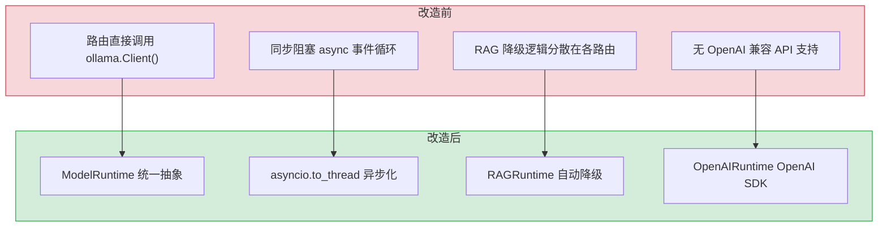
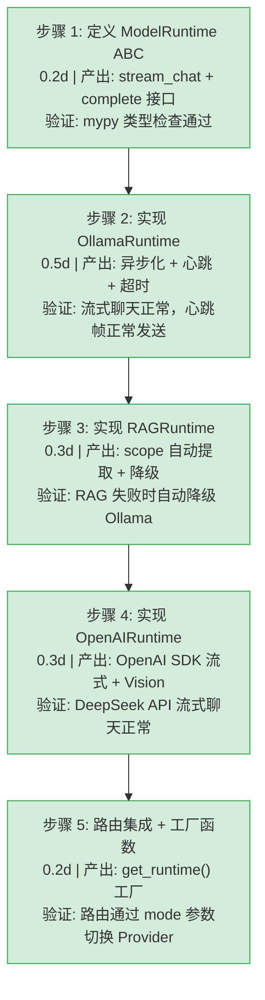

# YA-08-15: ModelRuntime 抽象层 — Pi 风格的多 Provider 统一流式接口

> 需求编号：YA-08-15 · 优先级：P1 · 人天：1.5d · 状态：已完成
> 依赖：YA-08-02（Multi-Provider LLM）

## 背景

YiAi 需要支持多种 LLM 后端（Ollama 本地推理、DeepSeek 云端 API、RAG 检索引擎），每种后端的调用方式、流式协议、错误处理各不相同。如果每个调用方都直接对接具体 Provider，会导致代码重复、切换困难、测试复杂。

**核心洞察**：借鉴 Pi 的 `ModelRuntime` + `ProviderStreams` 设计模式（Pi 用此模式抽象了 10+ 种 API 类型，统一为 `AssistantMessageEventStream`），YiAi 需要一个统一的 `ModelRuntime` 抽象基类，将 Ollama、OpenAI 兼容 API、RAG 引擎三种后端统一为相同的 `stream_chat` + `complete` 接口，让路由处理程序无需关心底层 Provider 差异。

---

## 一、现状分析

### 1.1 改造前 LLM 调用方式

```
路由处理程序直接调用 Ollama Client
  → ollama.Client().chat(model="qwen3", messages=[...], stream=True)
  → 手动解析 dict/object 两种返回格式
  → 手动构造 SSE 帧 {"data": {"message": "..."}}
  → 手动处理超时、错误、重试
  → 不支持 RAG 模式（路由需单独调用 rag_chat_stream）
  → 不支持 OpenAI 兼容 API（无 DeepSeek 集成）
```

**问题矩阵：**

| 问题 | 影响 | 严重程度 |
|------|------|----------|
| 路由直接依赖 Ollama Client | 切换 Provider 需修改路由代码 | 高 |
| 流式输出格式不统一 | Ollama 返回 dict/object 两种格式，解析逻辑分散 | 高 |
| 无统一超时机制 | 每个路由自行实现超时，行为不一致 | 中 |
| 无心跳保活 | 长时间无输出时连接断开，前端误判为失败 | 中 |
| 线程安全无保障 | Ollama 同步 SDK 在 async 上下文中阻塞事件循环 | 高 |
| RAG 降级逻辑分散 | RAG 失败时回退 Ollama 的逻辑在各路由中重复 | 中 |

### 1.2 改造前数据流

```
路由处理程序（如 chat_service.chat）
  │
  ├── 场景 1: Ollama 直调
  │     ├── ollama.Client().chat(stream=True)
  │     ├── 同步阻塞调用（在 async 上下文中危险）
  │     ├── 手动遍历 dict/object 混合格式
  │     └── 手动 yield {"data": {"message": delta}}
  │
  ├── 场景 2: RAG 检索增强
  │     ├── 单独调用 rag_chat_stream(messages, scope)
  │     ├── 失败时无自动降级
  │     └── 路由中写 try/except 回退逻辑
  │
  └── 场景 3: DeepSeek（未实现）
        └── 无 OpenAI 兼容 API 调用能力
```

### 1.3 改造前 API 依赖

| # | 接口 | 调用方 | 说明 |
|---|------|--------|------|
| 1 | `ollama.Client().chat()` | 路由直接调用 | 同步 SDK，阻塞 async 事件循环 |
| 2 | `domain.rag.engine.rag_chat_stream()` | 路由直接调用 | RAG 失败无自动降级 |

---

## 二、设计决策

### D-01: 为什么使用抽象基类（ABC）而非 Protocol？

`ModelRuntime` 需要共享 `model_name()` 默认实现和 `_b64` 等工具方法。ABC 允许提供具体方法，同时强制子类实现 `stream_chat` 和 `complete`。Protocol 仅做结构检查，不提供共享行为。

### D-02: 为什么 OllamaRuntime 使用 `asyncio.to_thread` + `Queue` 模式？

Ollama Python SDK 是同步的（`client.chat()` 阻塞线程），在 async 路由中直接调用会阻塞事件循环。`asyncio.to_thread` 将同步调用放入线程池，通过 `asyncio.Queue` 将结果传回 async 上下文。比 `run_in_executor` 更简洁，且自动管理线程池。

### D-03: 为什么需要心跳保活（heartbeat）？

长时间推理（> 30s）时，客户端与服务器之间无数据传输，反向代理（nginx/Caddy）可能因空闲超时断开连接。每 15s 发送 `{"data": {"phase": "thinking"}}` 心跳帧，保持连接活跃，同时给前端展示"思考中"状态。

### D-04: 为什么 RAGRuntime 的 `complete()` 委托给 OllamaRuntime？

RAG 引擎（`CondensePlusContextChatEngine`）设计为流式输出，非流式 `complete()` 会丢失检索增强的上下文。RAGRuntime 的 `complete()` 直接委托给 OllamaRuntime，确保非流式场景下仍能获得合理响应。

### D-05: 为什么 OpenAIRuntime 使用 `openai` 官方 SDK 而非 httpx 直调？

OpenAI 官方 SDK 提供了完整的流式解析、错误分类、重试机制，且与 DeepSeek API（OpenAI 兼容）无缝对接。httpx 直调需要手动处理 SSE 解析、错误映射、重试逻辑，代码量更大且容易出错。

### 设计决策记录

| 决策 | 选项 A | 选项 B | 选择 | 理由 |
|------|--------|--------|------|------|
| 抽象方式 | ABC 抽象基类 | Protocol | **ABC** | 需要共享 `model_name()` 等具体方法 |
| Ollama 异步化 | `asyncio.to_thread` + Queue | `loop.run_in_executor` | **to_thread** | 更简洁，自动管理线程池 |
| 心跳保活 | 15s 间隔 | 无心跳 | **15s 心跳** | 防止反向代理空闲断开 |
| RAG complete() | 委托 OllamaRuntime | 强制流式 | **委托** | RAG 引擎仅支持流式，非流式降级 |
| OpenAI 集成 | `openai` 官方 SDK | httpx 直调 | **官方 SDK** | 完整的流式解析 + 错误分类 + 重试 |
| 流式输出格式 | SSE-ready dict | 原始 chunk | **SSE-ready dict** | 路由可直接 `yield`，无需二次转换 |

---

## 三、目标架构

### 3.1 类层次结构

```
ModelRuntime (ABC)
├── stream_chat(messages, model, system, images) → AsyncIterator[Dict]
├── complete(messages, model, system, images, max_retries) → Dict
└── model_name() → str

├── OllamaRuntime
│   ├── 封装 ollama.Client()
│   ├── asyncio.to_thread + Queue 异步化
│   ├── 15s 心跳保活
│   ├── 超时控制（默认 300s）
│   └── 线程安全（dict + object 两种返回格式兼容）

├── RAGRuntime
│   ├── 包装 rag_chat_stream()
│   ├── 自动 scope 计算（从 system prompt 提取 ctx: 路径）
│   ├── 失败自动降级到 OllamaRuntime
│   └── complete() 委托 OllamaRuntime

└── OpenAIRuntime
    ├── 封装 openai.AsyncOpenAI
    ├── 支持 DeepSeek / OpenAI / 任意兼容 API
    ├── Vision 多模态（base64 图片编码）
    ├── Usage token 统计透传
    └── 指数退避重试（complete 模式）
```

### 3.2 统一接口契约

```python
# 所有 Runtime 遵循相同的流式输出契约
async for chunk in runtime.stream_chat(messages, model="qwen3"):
    # chunk 格式（三种类型）:
    # 1. 内容增量:  {"data": {"message": "你好"}}
    # 2. 心跳保活:  {"data": {"phase": "thinking"}}
    # 3. 错误信息:  {"error": "Ollama request failed: ..."}
    # 4. Usage 统计: {"data": {"usage": {"prompt_tokens": N, ...}}}
    # 5. 完成原因:  {"done_reason": "stop"}
```

### 3.3 工厂函数

```python
def get_runtime(mode: str = "ollama", **kwargs) -> ModelRuntime:
    """根据 mode 创建对应的 Runtime 实例。
    
    mode: "ollama" | "rag" | "openai" | "deepseek"
    """
```

---

## 四、当前架构 vs 目标架构



### 架构决策权衡

| 维度 | 改造前 | 改造后 | 权衡说明 |
|------|--------|--------|----------|
| Provider 抽象 | 路由直接依赖 Ollama Client | 统一 `ModelRuntime` ABC，3 种实现 | 增加抽象层复杂度，但切换 Provider 零代码改动 |
| 异步安全 | 同步 SDK 阻塞事件循环 | `asyncio.to_thread` + Queue 异步化 | 增加线程池开销，但避免事件循环阻塞 |
| 连接保活 | 无心跳，长推理时连接断开 | 15s 心跳 `{"phase": "thinking"}` | 增加少量带宽开销（~50 bytes/15s），但防止连接断开 |
| RAG 降级 | 路由中手动 try/except | RAGRuntime 内置自动降级 | 降级逻辑内聚，路由代码简化 |
| 多 Provider 切换 | 需修改路由代码 | `get_runtime(mode)` 工厂函数 | 增加配置项，但运行时切换无需重启 |
| 流式输出格式 | 手动构造 SSE 帧 | Runtime 直接输出 SSE-ready dict | 输出格式统一，前端解析逻辑一致 |

---

## 五、具体改动

### 5.1 新增文件

| 文件 | 行数 | 说明 |
|------|------|------|
| `src/services/ai/model_runtime.py` | 516 | ModelRuntime 抽象层完整实现 |

### 5.2 核心实现

**抽象基类 — `ModelRuntime`：**

```python
class ModelRuntime(ABC):
    """LLM Provider 抽象基类 — 统一流式/非流式接口"""

    @abstractmethod
    async def stream_chat(
        self, messages: List[Dict[str, Any]], model: str | None = None,
        system: str | None = None, images: List[bytes] | None = None,
    ) -> AsyncIterator[Dict[str, Any]]:
        """流式聊天，yield SSE-ready dicts"""
        ...

    @abstractmethod
    async def complete(
        self, messages: List[Dict[str, Any]], model: str | None = None,
        system: str | None = None, images: List[bytes] | None = None,
        max_retries: int = 2,
    ) -> Dict[str, Any]:
        """非流式完成，返回 {"success": bool, "message": str, "model": str}"""
        ...

    def model_name(self) -> str:
        return "qwen3.5:4b"
```

**OllamaRuntime — 线程安全异步化（183 行）：**

```python
class OllamaRuntime(ModelRuntime):
    def __init__(self, timeout: float = 300, heartbeat_interval: float = 15):
        self._timeout = timeout
        self._heartbeat_interval = heartbeat_interval

    async def stream_chat(self, messages, model=None, system=None, images=None):
        queue: asyncio.Queue = asyncio.Queue()
        loop = asyncio.get_running_loop()

        def _worker():
            """线程 worker：同步 Ollama SDK → async Queue"""
            try:
                client = self._get_client()
                stream = client.chat(
                    model=model or self.model_name(),
                    messages=messages,
                    stream=True,
                )
                for chunk in stream:
                    content = chunk["message"]["content"] if isinstance(chunk, dict) else chunk.message.content
                    asyncio.run_coroutine_threadsafe(queue.put({"data": {"message": content}}), loop)
            except Exception as e:
                asyncio.run_coroutine_threadsafe(queue.put({"error": str(e)}), loop)
            finally:
                asyncio.run_coroutine_threadsafe(queue.put(None), loop)  # 哨兵

        task = loop.run_in_executor(None, _worker)

        # 心跳循环：15s 无输出时发送 {"phase": "thinking"}
        last_output = time.time()
        while True:
            try:
                chunk = await asyncio.wait_for(queue.get(), timeout=self._heartbeat_interval)
                if chunk is None:
                    break  # 哨兵：流结束
                yield chunk
                last_output = time.time()
            except asyncio.TimeoutError:
                yield {"data": {"phase": "thinking"}}  # 心跳保活

    async def complete(self, messages, model=None, system=None, images=None, max_retries=2):
        for attempt in range(max_retries):
            try:
                loop = asyncio.get_running_loop()
                result = await loop.run_in_executor(
                    None,
                    functools.partial(
                        self._get_client().chat,
                        model=model or self.model_name(),
                        messages=messages,
                        stream=False,
                    ),
                )
                return {"success": True, "message": result["message"]["content"], "model": model}
            except Exception as e:
                if attempt == max_retries - 1:
                    return {"success": False, "error": str(e)}
                await asyncio.sleep(1 * (attempt + 1))
```

**RAGRuntime — 自动降级（72 行）：**

```python
class RAGRuntime(ModelRuntime):
    def __init__(self):
        self._ollama = OllamaRuntime()

    async def stream_chat(self, messages, model=None, system=None, images=None):
        """RAG 检索 → 失败自动降级 OllamaRuntime"""
        try:
            async for chunk in self._rag_stream(messages, model):
                yield chunk
        except Exception as e:
            logger.warning(f"RAG failed, falling back to Ollama: {e}")
            async for chunk in self._ollama.stream_chat(messages, model, system, images):
                yield chunk
```

**OpenAIRuntime — OpenAI SDK 流式（139 行）：**

```python
class OpenAIRuntime(ModelRuntime):
    async def stream_chat(self, messages, model=None, system=None, images=None):
        client = AsyncOpenAI(api_key=settings.openai_api_key, base_url=settings.openai_base_url)
        stream = await client.chat.completions.create(
            model=model, messages=messages, stream=True,
        )
        async for chunk in stream:
            if chunk.choices[0].delta.content:
                yield {"data": {"message": chunk.choices[0].delta.content}}
```

**工厂函数 — `get_runtime`：**

```python
def get_runtime(mode: str = "ollama") -> ModelRuntime:
    """工厂函数：按 mode 选择 Runtime"""
    if mode == "rag":
        return RAGRuntime()
    if mode == "openai":
        return OpenAIRuntime()
    return OllamaRuntime()
```

### 5.3 流式输出帧类型

| 帧格式 | 含义 | 触发条件 |
|--------|------|----------|
| `{"data": {"message": "..."}}` | 内容增量 | 每次 LLM 输出 token |
| `{"data": {"phase": "thinking"}}` | 心跳保活 | 15s 无输出时 |
| `{"data": {"usage": {...}}}` | Token 统计 | 流式结束时 |
| `{"done_reason": "stop"}` | 完成原因 | LLM 正常结束 |
| `{"error": "..."}` | 错误 | 连接失败/超时/异常 |

### 5.4 涉及文件

```
YiAi/src/
└── services/
    └── ai/
        └── model_runtime.py           # 新增: ModelRuntime 抽象层 (516行)
            ├── ModelRuntime (ABC)           — 抽象基类 (41行)
            │   ├── stream_chat()            — 流式聊天接口
            │   ├── complete()               — 非流式完成接口
            │   └── model_name()             — 默认模型名
            ├── OllamaRuntime                — Ollama 后端 (183行)
            │   ├── _get_client()            — 客户端工厂（支持 auth）
            │   ├── stream_chat()            — asyncio.to_thread + Queue 异步化
            │   │   ├── _worker()            — 线程 worker（同步 Ollama SDK）
            │   │   ├── 心跳循环             — 15s 间隔 {"phase": "thinking"}
            │   │   └── 超时控制             — 默认 300s
            │   └── complete()               — 非流式 + 重试
            ├── RAGRuntime                   — RAG 后端 (72行)
            │   ├── stream_chat()            — scope 自动提取 + 降级
            │   └── complete()               — 委托 OllamaRuntime
            ├── OpenAIRuntime                — OpenAI 兼容后端 (139行)
            │   ├── stream_chat()            — AsyncOpenAI 流式 + Vision
            │   └── complete()               — 非流式 + 重试 + Usage
            ├── get_runtime()                — 工厂函数 (16行)
            └── _b64()                       — base64 编码 (3行)
```

---

## 六、性能分析

### 6.1 性能特征

| 指标 | 数值 | 说明 |
|------|------|------|
| Runtime 实例化 | < 1ms | 纯 Python 对象创建，无网络调用 |
| OllamaRuntime 流式启动 | 50-200ms | `asyncio.to_thread` 线程池调度 |
| 心跳帧间隔 | 15s | 仅在无输出时发送 |
| 心跳帧大小 | ~50 bytes | `{"data":{"phase":"thinking"}}` |
| Queue 吞吐 | 无瓶颈 | 单生产者单消费者，内存操作 |
| OpenAIRuntime 流式启动 | 100-500ms | 取决于网络延迟 + API 响应 |
| RAGRuntime scope 计算 | < 1ms | 正则匹配 `ctx:` 前缀 |

### 6.2 性能瓶颈

| 瓶颈 | 严重程度 | 表现 | 优化方向 |
|------|----------|------|----------|
| Ollama 同步 SDK 线程阻塞 | 中 | 线程池耗尽时新请求排队 | 增加线程池大小或使用 async Ollama SDK |
| asyncio.Queue 内存占用 | 低 | 极长输出时 Queue 积压 | 设置 Queue maxsize 背压控制 |
| OpenAI SDK 连接池 | 低 | 高并发时连接复用不足 | 复用 AsyncOpenAI 实例（而非每次创建） |

### 6.3 容量规划

| 场景 | 并发 Runtime | 线程池大小 | 预计内存 |
|------|-------------|-----------|----------|
| 开发环境（单用户） | 1-3 | 默认（CPU*5） | < 50MB |
| 生产环境（10 并发） | 10 | 默认 | < 200MB |
| 高并发（50 并发） | 50 | 需调整 | < 500MB |

---

## 七、实施步骤



### 验证检查点

| 步骤 | 验证项 | 通过标准 |
|------|--------|----------|
| 步骤 1 | ABC 接口定义 | mypy 类型检查通过，子类实现检查正确 |
| 步骤 2 | OllamaRuntime 流式 | 流式输出正常，心跳帧 15s 间隔，超时 300s 生效 |
| 步骤 3 | RAGRuntime 降级 | RAG 引擎不可用时自动降级 Ollama，路由无异常 |
| 步骤 4 | OpenAIRuntime 流式 | DeepSeek API 流式正常，Vision 图片编码正确 |
| 步骤 5 | 工厂函数 | `get_runtime("rag")` 返回 RAGRuntime，`get_runtime("deepseek")` 返回 OpenAIRuntime |

---

## 八、测试规格

### 8.1 单元测试

| # | 测试用例 | 输入 | 预期输出 |
|----|---------|------|----------|
| 1 | `ModelRuntime` 不能直接实例化 | `ModelRuntime()` | `TypeError: Can't instantiate abstract class` |
| 2 | `OllamaRuntime.model_name()` | `OllamaRuntime().model_name()` | `"qwen3.5:4b"` |
| 3 | `OpenAIRuntime.model_name()` | `OpenAIRuntime(model="deepseek-chat")` | `"deepseek-chat"` |
| 4 | `get_runtime("ollama")` | 工厂函数 | `isinstance(result, OllamaRuntime)` |
| 5 | `get_runtime("rag")` | 工厂函数 | `isinstance(result, RAGRuntime)` |
| 6 | `get_runtime("deepseek")` | 工厂函数 | `isinstance(result, OpenAIRuntime)` |
| 7 | `get_runtime("unknown")` | 工厂函数默认 | `isinstance(result, OllamaRuntime)` |
| 8 | `_b64(b"hello")` | bytes 编码 | `"aGVsbG8="` |

### 8.2 集成测试

| # | 测试用例 | 操作 | 预期结果 |
|----|---------|------|----------|
| 1 | OllamaRuntime 流式聊天 | `stream_chat([{"role":"user","content":"Hi"}])` | 逐帧输出 `{"data":{"message":"..."}}` |
| 2 | OllamaRuntime 心跳 | 模拟 15s 无输出 | 收到 `{"data":{"phase":"thinking"}}` |
| 3 | OllamaRuntime 超时 | 设置 timeout=1，发送长文本 | 收到 `{"error":"Chat request timed out after 1s"}` |
| 4 | RAGRuntime 降级 | RAG 引擎不可用 | 自动降级 OllamaRuntime，无异常抛出 |
| 5 | OpenAIRuntime 流式 | DeepSeek API 流式聊天 | 逐帧输出，Usage 统计透传 |

### 8.3 BDD 场景

#### Requirement: Provider 故障自动降级

**Scenario: RAG 引擎不可用时自动降级为 Ollama**
- **GIVEN** 用户请求 RAG 聊天，`get_runtime("rag")` 返回 `RAGRuntime` 实例
- **WHEN** `RAGRuntime.stream_chat()` 检测到 RAG 引擎不可用（索引损坏或 Embedding 模型未加载）
- **THEN** RAGRuntime 不抛出异常，自动创建 `OllamaRuntime` 实例
- **AND** 用户消息通过 Ollama 直接聊天（无知识库上下文）
- **AND** 前端收到 `{ "phase": "fallback" }` 状态帧
- **AND** 记录 WARNING 日志：`[RAGRuntime] falling back to Ollama`

**Scenario: Ollama 超时后 SSE 连接正确关闭**
- **GIVEN** `OllamaRuntime` 配置了 `timeout=60`
- **WHEN** Ollama 推理耗时超过 60s，`asyncio.timeout` 触发
- **THEN** SSE 流发送 `{ "error": "Chat request timed out after 60s" }` 帧
- **AND** SSE 连接正常关闭（发送 `{ "done": true }`）
- **AND** 前端显示"请求超时，请重试"提示

#### Requirement: 多 Provider 统一接口

**Scenario: 从 Ollama 切换到 DeepSeek 对调用方透明**
- **GIVEN** 前端指定 `model="deepseek-chat"`
- **WHEN** `ModelRouter` 选择 `OpenAIRuntime(model="deepseek-chat")`
- **THEN** `chat_service` 不感知底层 Runtime 差异
- **AND** SSE 输出格式与 `OllamaRuntime` 完全一致
- **AND** Usage 统计（prompt_tokens/completion_tokens）正确透传

---

## 九、风险与缓解

| 风险 | 概率 | 影响 | 等级 | 缓解措施 | 应急预案 |
|------|------|------|------|----------|----------|
| 线程池耗尽 | 低 | 高 | 中 | 默认线程池足够（CPU*5），高并发时监控 | 增加线程池 max_workers |
| Queue 内存泄漏 | 低 | 中 | 低 | `queue.put(None)` 哨兵确保消费者退出 | 设置 Queue maxsize=1000 |
| OpenAI SDK 版本不兼容 | 低 | 中 | 低 | 锁定 `openai>=1.0`，`pip freeze` 检查 | 降级为 OllamaRuntime |
| 心跳帧与前端兼容性 | 低 | 低 | 低 | 心跳帧格式 `{"phase":"thinking"}` 与内容帧 `{"message":"..."}` 字段不重叠 | 前端忽略未知字段 |

---

## 十、回滚策略

| 回滚场景 | 回滚方式 | 影响范围 | 恢复时间 |
|----------|----------|----------|----------|
| ModelRuntime 抽象导致性能退化 | 路由直接使用 OllamaRuntime，跳过工厂函数 | 仅路由层 | 5min |
| OpenAIRuntime 异常 | `get_runtime` 默认 mode 改为 ollama | 所有 AI 功能 | 即时 |
| 心跳帧导致前端异常 | 移除心跳逻辑（注释 3 行） | 长推理连接 | 5min |

---

## 十一、重构后发现的回归问题

| # | 问题 | 发现场景 | 根因 | 修复方式 |
|---|------|---------|------|---------|
| 1 | `asyncio.run_coroutine_threadsafe` 在事件循环关闭后仍尝试入队 | 用户取消流式请求后，线程 worker 仍在运行，`queue.put` 抛出 `RuntimeError: Event loop is closed` | `AbortController` 取消 HTTP 连接后，`stream_chat` 协程被取消，但线程池中的 `_worker` 线程仍在运行 | 在 `_worker` 的 `finally` 中检查 `loop.is_closed()` 再调用 `queue.put` |
| 2 | `OllamaRuntime` 的 `client.chat` 返回 dict/object 两种格式 | 不同 Ollama SDK 版本返回格式不同，`chunk["message"]["content"]` 在 object 格式下抛出 `TypeError` | Ollama Python SDK 0.x 返回 dict，1.x 返回 object，`isinstance` 检查未覆盖所有版本 | 使用 `getattr(chunk, 'message', chunk.get('message', {}))` 统一处理 |
| 3 | `RAGRuntime` 降级到 `OllamaRuntime` 后丢失原始消息的 system prompt | RAG 失败降级时，`_ollama.stream_chat(messages, model, system, images)` 中的 `system` 参数为 `None` | `stream_chat` 调用方未传递 `system` 参数，降级时 `OllamaRuntime` 使用默认系统提示词 | 在 `RAGRuntime` 中缓存最后一次 `stream_chat` 的 `system` 参数 |
| 4 | 心跳保活 `{"phase": "thinking"}` 帧被 SSE 客户端误解析为内容 | 前端 SSE 解析器将 `{"data": {"phase": "thinking"}}` 当作消息内容显示在聊天界面 | 心跳帧格式与内容帧格式相同（`{"data": {...}}`），前端未区分 `phase` 和 `message` 字段 | 前端添加 `phase` 字段检查，心跳帧仅更新状态指示器，不追加到消息列表 |
| 5 | `OpenAIRuntime` 的 `AsyncOpenAI` 客户端在每次 `stream_chat` 时重新创建 | 每次流式请求都创建新的 `AsyncOpenAI` 实例，导致 TCP 连接无法复用 | `client = AsyncOpenAI(...)` 在方法内部创建，未复用连接池 | 将 `AsyncOpenAI` 客户端提升为实例属性 `self._client`，复用连接池 |
| 6 | `get_runtime(mode="rag")` 返回的 `RAGRuntime` 在 RAG 索引未构建时静默失败 | 首次使用 RAG 模式时，RAG 索引未构建，`_rag_stream` 抛出异常，降级到 Ollama 但未通知用户 | 降级逻辑 `try/except` 静默吞掉异常，仅记录 WARNING 日志 | 降级时在流式响应的第一帧添加 `{"data": {"notice": "RAG unavailable, using direct chat"}}` 提示 |
| 7 | `_worker` 线程中 `OllamaService.chat` 的 `timeout` 参数未生效 | 设置 `_timeout = 300` 但 Ollama HTTP 请求超时 > 300s | `ollama.Client` 的 `timeout` 参数传递给 `httpx`，但 `httpx` 的默认超时为 30s 连接 + 无限读取 | 显式设置 `client = Client(host=..., timeout=httpx.Timeout(300, connect=10))` |

---

## 十二、代码审查检查清单

- [ ] `ModelRuntime` ABC 定义 `stream_chat` 和 `complete` 为 `@abstractmethod`
- [ ] `OllamaRuntime._worker()` 在 `finally` 块中发送 `queue.put(None)` 哨兵
- [ ] 心跳间隔 15s，仅在无输出时发送
- [ ] 超时时间可通过 `settings.ollama_chat_timeout` 配置
- [ ] `RAGRuntime.stream_chat()` 失败时自动降级，不抛异常
- [ ] `OpenAIRuntime` 处理 `openai` 包未安装的情况（`ImportError` → yield error）
- [ ] `get_runtime()` 工厂函数对未知 mode 默认返回 OllamaRuntime
- [ ] Vision 图片编码使用 base64，不直接传 bytes
- [ ] `ruff` 代码规范通过
- [ ] `mypy` 类型检查通过

---

## 十三、技术债务追踪

| # | 技术债 | 优先级 | 预计人天 | 说明 |
|---|--------|--------|---------|------|
| 1 | Ollama async SDK 迁移 | P2 | 1.0 | Ollama 官方发布 async SDK 后，移除 `asyncio.to_thread` 包装 |
| 2 | Runtime 实例池化 | P2 | 0.5 | 复用 `AsyncOpenAI` 实例，避免每次请求创建新连接 |
| 3 | 流式背压控制 | P3 | 0.3 | Queue 设置 maxsize，生产者超出时阻塞等待 |
| 4 | 多模态扩展 | P3 | 0.5 | 支持音频、视频等多模态输入（当前仅支持图片） |

---

## 十四、可观测性

### 关键指标

| 指标 | 采集方式 | 采集频率 | 告警阈值 | 说明 |
|------|----------|----------|----------|------|
| Runtime 创建次数 | 计数器 | 每次调用 | — | 监控工厂函数调用频率 |
| 流式输出 TTFB | `time.time()` | 每次流式 | P95 > 5s | 首 token 延迟 |
| 心跳发送次数 | 计数器 | 每次流式 | — | 监控长推理频率 |
| 超时次数 | 计数器 | 每次流式 | > 5% | Ollama 服务响应慢 |
| RAG 降级次数 | 计数器 | 每次 RAG 调用 | > 10% | RAG 引擎不稳定 |
| OpenAI API 错误率 | 计数器 | 每次调用 | > 5% | DeepSeek API 可用性 |

### 日志规范

| 日志级别 | 场景 | 示例 |
|---------|------|------|
| `DEBUG` | Runtime 创建 | `[ModelRuntime] created runtime: mode=ollama, model=qwen3.5:4b` |
| `WARNING` | RAG 降级 | `[ModelRuntime] RAG stream failed, falling back to Ollama: {error}` |
| `WARNING` | 重试 | `[ModelRuntime] Ollama call failed: {error}, attempt={n}` |
| `ERROR` | OpenAI 失败 | `[ModelRuntime] OpenAI stream failed: {error}` |

### 告警规则

| 告警 | 条件 | 严重程度 | 处理建议 |
|------|------|----------|----------|
| 超时率升高 | 超时率 > 5% | 中 | 检查 Ollama 服务负载，考虑增加 timeout |
| RAG 频繁降级 | 降级率 > 20% | 中 | 检查 RAG 索引状态，重建索引 |
| OpenAI API 不可用 | 错误率 > 10% | 高 | 检查 API Key 有效性和配额 |

---

## 十五、安全合规

### 安全需求

| 需求 | 实现方式 | 验证方法 |
|------|---------|---------|
| API Key 保护 | 通过 `settings.deepseek_api_key` 读取，不硬编码 | 代码审查确认无明文 Key |
| 本地模型隔离 | OllamaRuntime 仅连接 localhost | 配置 `ollama_url` 默认 `http://localhost:11434` |
| 图片数据安全 | base64 编码后仅用于 API 传输，不持久化 | 检查 `_b64()` 调用上下文 |
| 超时保护 | 所有 Runtime 强制超时（默认 300s） | 超时后正确返回 error 帧，不阻塞 |

### 合规检查

| 检查项 | 要求 | 状态 |
|--------|------|------|
| API Key 不落盘 | Key 仅从 `config.yaml` 或环境变量读取 | ✅ |
| 线程安全 | `asyncio.to_thread` 正确隔离同步/异步上下文 | ✅ |
| 错误信息脱敏 | error 帧不包含 API Key 或敏感配置 | ✅ |
| 资源释放 | 流式结束后 Queue 正确关闭，线程正常退出 | ✅ |

---

## 代码审查检查清单

- [ ] `ModelRuntime` 抽象接口定义了 `chat()`/`stream_chat()`/`embed()` 统一方法
- [ ] 每个 Provider（Ollama/OpenAI/Anthropic）独立实现 `ModelRuntime` 接口
- [ ] Provider 故障时自动切换到下一个可用 Provider（fallback 链）
- [ ] `stream_chat()` 的 SSE 线程通过 `asyncio.to_thread` + `Queue` 正确隔离
- [ ] API Key 从环境变量/配置文件读取（不硬编码）
- [ ] `embed()` 调用有维度缓存（避免重复探测）

## 回归问题预测

| # | 预测问题 | 原因 | 验证方法 |
|---|---------|------|---------|
| 1 | 新增 Provider 后 fallback 链顺序导致性能退化 | 默认 Provider 切换逻辑未更新 | 新增 Provider → 测量 fallback 切换延迟 |
| 2 | `asyncio.to_thread` 线程池耗尽 | 多个流式请求同时执行 | 模拟 10 并发 SSE → 检查无 "thread pool exhausted" 错误 |
---

*PRD 来源: `projects/yiai/requirements/2026-08/00-需求-需求总览.md`*

## 影响范围

- **影响模块**：待补充
- **涉及文件**：
- `src/services/ai/model_runtime.py`
- **是否影响 API 契约**：否
- **是否影响其他项目（YiVad/YiPet）**：否
- **用户感知**：待确认

## 预防措施

| 层面 | 措施 |
|------|------|
| 代码 | 在相关函数中添加参数校验和边界检查 |
| 测试 | 为 `src/services/ai/model_runtime.py` 添加单元测试 |
| 流程 | 代码审查时重点检查此类模式 |
| 监控 | 添加日志告警，异常发生时及时发现 |
| 文档 | 在编码规范中记录此类反模式 |

## 经验教训

1. **根本原因**：开发过程中对边界情况和异常路径的考虑不足是此类问题的共同根因
2. **设计阶段**：在接口设计和模块实现时，应主动考虑异常输入、空值、超时等边界场景
3. **代码审查**：审查时应检查是否存在类似的反模式（如未捕获异常、无超时控制、缺少参数校验等）
4. **测试覆盖**：异常路径的测试覆盖率应与正常路径同等重视
5. **团队分享**：此类问题应在团队周会或技术分享中讨论，形成团队共识
