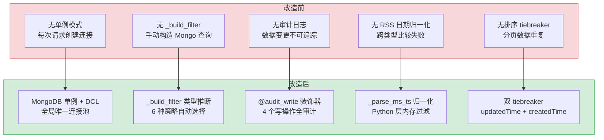
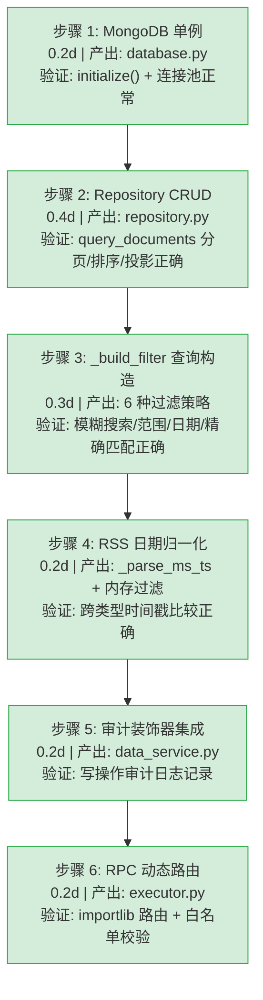

# YA-08-17: 数据访问层架构 — MongoDB 单例 + Repository 模式 + RPC 动态路由

> 需求编号：YA-08-17 · 优先级：P1 · 人天：1.5d · 状态：已完成
> 依赖：无

## 背景

YiAi 作为 YrY 单体仓库的唯一后端，所有前端（YiVad、YiPet）的数据操作都通过 RPC 信封路由到 YiAi 的数据访问层。数据访问层是连接 RPC 协议与 MongoDB 持久化的核心桥梁，其设计直接影响整个系统的**类型安全**、**查询性能**和**数据一致性**。

数据访问层由 4 个模块组成：**MongoDB 单例**（`database.py`，197 行）管理连接池和索引；**Repository**（`repository.py`，799 行）实现 `_build_filter` 查询构造和 CRUD 操作；**Data Service**（`data_service.py`，32 行）通过 `@audit_write` 装饰器包装写操作；**RPC Executor**（`executor.py`，258 行）通过 `importlib.import_module` 动态路由到目标函数。

**核心挑战**：在保持 RPC 信封协议简洁的同时，支持灵活的多字段模糊搜索、日期范围过滤、RSS 异构数据归一化、分页排序投影，以及审计日志的透明集成。

---

## 一、现状分析

### 1.1 文件清单

**数据访问核心：**

| 文件 | 行数 | 职责 |
|------|------|------|
| `src/data/database.py` | 197 | MongoDB 单例：连接池、索引管理、CRUD 包装器 |
| `src/data/repository.py` | 799 | Repository 模式：`_build_filter` 查询构造、分页/排序/投影、RSS 日期过滤、聚合管道 |
| `src/data/chat_records.py` | 104 | 聊天记录持久化：会话级 turn 追加、7 天 TTL 过期 |
| `src/data/sessions.py` | 26 | 会话维护：全量查询 + 按 key 删除 |

**服务层包装：**

| 文件 | 行数 | 职责 |
|------|------|------|
| `src/services/database/data_service.py` | 32 | 审计装饰器包装：`@audit_write` 应用于 create/update/delete/upsert |

**RPC 路由层：**

| 文件 | 行数 | 职责 |
|------|------|------|
| `src/server/routes/execution.py` | 92 | RPC 端点：GET/POST `/`，SSE 流式响应，审计上下文提取 |
| `src/domain/execution/executor.py` | 258 | 动态模块执行器：白名单校验、`importlib` 路由、Observer 沙箱、重入保护 |

### 1.2 组件树

```
RPC 请求 (POST /)
│  { module_name, method_name, parameters }
▼
execution.py (92 行)
│  POST / → ExecuteRequest 解析
│  提取 X-User / X-Real-IP / User-Agent → set_audit_context()
▼
executor.py (258 行)
│  execute_module(module_path, function_name, parameters)
│  ├── _acquire_guard()          → 重入保护（最大深度限制）
│  ├── _check_whitelist()        → 模块:函数 白名单校验
│  ├── parse_parameters()        → JSON 字符串 → dict
│  ├── _import_target_function() → importlib.import_module + getattr
│  ├── _run_function()           → Observer 沙箱上下文
│  └── _record_execution()       → SkillRecorder 异步记录
▼
data_service.py (32 行)
│  @audit_write("CREATE") → create_document(params)
│  @audit_write("UPDATE") → update_document(params)
│  @audit_write("DELETE") → delete_document(params)
│  @audit_write("UPSERT") → upsert_document(params)
│  读操作直接透传: query_documents / get_document_detail / count_documents
▼
repository.py (799 行)
│  ├── _build_filter(query_params)     → Mongo 过滤字典
│  │   ├── $or/$and 透传
│  │   ├── isoDate 特殊处理 → _build_published_date_filter()
│  │   ├── 范围/列表过滤 → _handle_range_or_list_filter()
│  │   ├── 字符串模糊搜索 → _handle_string_search_filter()
│  │   └── 精确匹配 (int/float/bool)
│  ├── _build_sort_list()              → 排序链（含 tiebreaker）
│  ├── query_documents()               → find + skip/limit + count_documents
│  ├── get_document_detail()           → find_one by key
│  ├── create_document()               → insert_one + auto-order
│  ├── update_document()               → update_one + upsert fallback
│  ├── upsert_document()               → update_one(upsert=True) + 原子操作符
│  ├── delete_document()               → delete_one + markdown 联动删除
│  ├── count_documents()               → count + aggregation groupBy
│  └── list_story_task_dirs()          → aggregation pipeline 去重
▼
database.py (197 行)
│  MongoDB Singleton
│  ├── __new__()            → 双重检查锁定（DCL）
│  ├── initialize()         → AsyncIOMotorClient + 连接池配置
│  ├── _ensure_indexes()    → link/path 唯一索引
│  ├── insert_one/many()    → createdTime 自动填充
│  ├── find_one/many()      → 异步游标遍历
│  └── delete_one()         → 返回 deleted_count
▼
MongoDB (Motor 异步驱动)
```

### 1.3 数据流

```
YiVad/YiPet 前端
  │  POST /  { module_name: "services.database.data_service",
  │            method_name: "query_documents",
  │            parameters: { cname: "issues", filter: {status: "open"}, pageSize: 20 } }
  ▼
execution.py (RPC 端点)
  │  parse ExecuteRequest → module_path, function_name, parameters
  ▼
executor.py (动态路由)
  │  importlib.import_module("services.database.data_service")
  │  getattr(module, "query_documents")
  │  → await query_documents(parameters)
  ▼
data_service.py (审计层)
  │  读操作直接透传到 repository
  ▼
repository.py (查询构造)
  │  _build_filter({status: "open"}) → {"status": re.compile(".*open.*", re.IGNORECASE)}
  │  collection.find(filter, projection).sort(sort_list).skip(0).limit(20)
  ▼
MongoDB (Motor)
  │  { list: [...], total: 42, pageNum: 1, pageSize: 20, totalPages: 3 }
  ▼
StandardResponse → { code: 0, message: "ok", data: { list: [...], total: 42, ... } }
```

### 1.4 已知问题

| 问题 | 影响 | 严重程度 |
|------|------|----------|
| 无连接池健康检查 | 连接池耗尽时无法主动发现，表现为请求超时 | 中 |
| `_build_filter` 不支持 `$text` 全文搜索 | 大文本字段（如 `pageContent`）只能 regex 模糊匹配，性能差 | 低 |
| RSS 日期过滤在 Python 层做内存过滤 | 大数据量时需全量加载到内存再过滤，O(n) 复杂度 | 中 |
| 无查询超时控制 | 慢查询可能阻塞事件循环，影响其他请求 | 中 |
| `data_service.py` 仅包装写操作 | 读操作（`query_documents` 等）未经过审计，不满足完整审计需求 | 低 |

---

## 二、设计决策

### D-01: 为什么使用 MongoDB 单例 + 双重检查锁定（DCL）而非全局连接池？

Python 的 `motor.motor_asyncio.AsyncIOMotorClient` 内部已实现连接池（`maxPoolSize`/`minPoolSize`），不需要额外的连接池层。MongoDB 单例确保整个应用生命周期内只有一个 `AsyncIOMotorClient` 实例，避免重复创建连接的开销。双重检查锁定（`threading.Lock` + `_instance is None` 两次检查）确保在多线程环境下（uvicorn workers）只初始化一次，且 `_initialized` 标志避免了重复的索引创建。

### D-02: 为什么 `_build_filter` 使用类型推断而非显式操作符？

RPC 信封的 `parameters` 是 `Dict[str, Any]`，调用方传入的过滤条件可能是字符串（模糊搜索）、列表（范围或 IN 查询）、数字（精确匹配）或字典（Mongo 操作符）。`_build_filter` 通过类型推断自动选择过滤策略：`str` → `re.compile` 模糊搜索，`list` of 2 元素 → 日期/数字范围或 `$in`，`dict` → 透传 Mongo 操作符，`int/float/bool` → 精确匹配。这种设计避免了调用方需要了解 MongoDB 查询语法的细节，降低了前后端耦合。

### D-03: 为什么 RSS 日期过滤在 Python 层而非 MongoDB 层？

RSS 语料库存在历史 schema 漂移：`published_parsed` 字段可能是 `int`（秒级时间戳）、`str`（毫秒级时间戳字符串）或 ISO 日期字符串。MongoDB 比较不同类型时行为不一致（字符串 `"1724900000000"` 永远不会匹配数值查询 `{"$gte": 1724800000000}`）。`_parse_ms_ts()` 在 Python 层归一化所有文档的时间戳后再比较，确保过滤正确性。代价是 RSS 集合需要全量加载到内存（`async for` 遍历所有匹配文档），但 RSS 数据量通常 < 10 万条，内存开销可接受。

### D-04: 为什么 `data_service.py` 仅包装写操作而非读操作？

审计日志的目标是追踪数据变更（谁在什么时候创建/修改/删除了什么数据）。读操作（`query_documents`、`get_document_detail`）不产生数据变更，不需要审计。`data_service.py` 通过 `@audit_write` 装饰器仅包装 `create_document`、`update_document`、`delete_document`、`upsert_document` 四个写操作，读操作直接从 `repository` 导入并透传。这种设计保持了审计日志的精简性，避免审计集合膨胀。

### D-05: 为什么使用 `importlib.import_module` 动态路由而非注册表？

RPC 信封协议要求 `module_name` 是 Python 模块路径（如 `services.database.data_service`），`method_name` 是模块中的可调用对象。`importlib.import_module` + `getattr` 的组合天然支持这种协议，无需维护额外的路由注册表。白名单（`EXEC_ALLOWLIST`）通过 `config.yaml` 的 `module_allowlist` 配置，控制哪些模块:函数组合可以被外部调用。这种设计比 FastAPI 的 `APIRouter` 路由更灵活——新增模块无需修改路由代码，只需在白名单中添加条目。

### 设计决策记录

| 决策 | 选项 A | 选项 B | 选择 | 理由 |
|------|--------|--------|------|------|
| 数据库连接管理 | MongoDB 单例 + DCL | 每次请求创建连接 | **MongoDB 单例** | Motor 内置连接池，单例避免重复创建开销 |
| 查询过滤构造 | 类型推断自动策略 | 显式操作符（`$regex`/`$gte`） | **类型推断** | 降低前后端耦合，调用方无需了解 Mongo 语法 |
| RSS 日期过滤 | Python 层归一化 | MongoDB `$gte`/`$lte` | **Python 层** | 处理 schema 漂移，MongoDB 跨类型比较不可靠 |
| 审计覆盖范围 | 仅写操作 | 全部操作（含读） | **仅写操作** | 审计目标是变更追踪，读操作不产生变更 |
| RPC 路由方式 | `importlib` 动态导入 | 注册表映射 | **动态导入** | 新增模块无需改路由，白名单配置即可 |
| 排序 tiebreaker | `updatedTime` + `createdTime` | 仅主排序字段 | **双 tiebreaker** | 确保分页稳定性，避免同值文档跨页重复 |

---

## 三、目标架构

### 3.1 核心模块

| 模块 | 文件 | 行数 | 职责 |
|------|------|------|------|
| MongoDB 单例 | `src/data/database.py` | 197 | 连接池管理、索引创建、CRUD 包装器 |
| Repository | `src/data/repository.py` | 799 | `_build_filter` 查询构造、分页排序投影、CRUD、聚合 |
| 聊天记录 | `src/data/chat_records.py` | 104 | 会话级 turn 追加、7 天 TTL |
| 会话维护 | `src/data/sessions.py` | 26 | 全量查询、按 key 删除 |
| 数据服务 | `src/services/database/data_service.py` | 32 | `@audit_write` 审计装饰器包装 |
| RPC 端点 | `src/server/routes/execution.py` | 92 | GET/POST RPC 路由、SSE 流式响应 |
| RPC 执行器 | `src/domain/execution/executor.py` | 258 | 动态导入、白名单、沙箱、重入保护 |

### 3.2 `_build_filter` 查询构造策略

```python
def _build_filter(query_params: Dict[str, Any]) -> Dict[str, Any]:
    """将 RPC 参数转换为 MongoDB 过滤字典"""
    filter_dict = {}
    for key, value in query_params.items():
        if not value:
            continue
        # 1. Mongo 操作符透传: $or, $and, $regex, $gte, $lte...
        if key.startswith('$') or isinstance(value, dict):
            filter_dict[key] = value
        # 2. key 字段精确匹配
        elif key == 'key' and isinstance(value, str):
            filter_dict[key] = value
        # 3. isoDate 特殊处理 → 多格式日期正则
        elif _handle_iso_date_filter(key, value, filter_dict):
            pass
        # 4. 范围/列表过滤 → $gte/$lte 或 $in
        elif _handle_range_or_list_filter(key, value, filter_dict):
            pass
        # 5. 字符串模糊搜索 → re.compile
        elif _handle_string_search_filter(key, value, filter_dict):
            pass
        # 6. 精确匹配 (int/float/bool)
        elif isinstance(value, (int, float, bool)):
            filter_dict[key] = value
    return filter_dict
```

### 3.3 排序 tiebreaker 机制

```python
def _build_sort_list(sort_param: str, sort_order: int) -> List[tuple]:
    sort_list = [(sort_param, sort_order)]
    # 添加 tiebreaker 确保分页稳定性
    if sort_param != 'updatedTime':
        sort_list.append(('updatedTime', -1))
    if sort_param != 'createdTime':
        sort_list.append(('createdTime', -1))
    return sort_list
```

---

## 四、当前架构 vs 目标架构



### 架构决策权衡

| 维度 | 改造前 | 改造后 | 权衡说明 |
|------|--------|--------|----------|
| 连接管理 | 无单例，连接不可控 | DCL 单例 + Motor 连接池 | 增加 1 个 Lock + 2 次 None 检查，但全局唯一连接 |
| 查询构造 | 手动构造 Mongo 字典，调用方需了解语法 | `_build_filter` 6 种策略自动推断 | 增加 1 次 for 循环遍历参数，但调用方零 Mongo 知识 |
| 数据变更追踪 | 无审计 | `@audit_write` 装饰器 4 个写操作 | 异步写入不阻塞主流程，审计日志 TTL 90 天 |
| RSS 日期过滤 | MongoDB `$gte`/`$lte` 跨类型失败 | Python 层 `_parse_ms_ts` 归一化 | RSS 集合需全量内存加载，但语料通常 < 10 万条 |
| 分页稳定性 | 无 tiebreaker，同值文档跨页重复 | `updatedTime` + `createdTime` 双排序 | 增加 2 个排序字段，但分页结果可预测 |
| RPC 路由 | 无白名单，任意模块可调用 | `EXEC_ALLOWLIST` 配置白名单 | 新增模块需配置白名单，但防止未授权模块执行 |

---

## 五、具体改动

### 5.1 涉及文件

```
YiAi/src/
├── data/
│   ├── database.py                    # MongoDB 单例 (197行)
│   │   ├── MongoDB.__new__()         — 双重检查锁定
│   │   ├── MongoDB.initialize()      — AsyncIOMotorClient + 连接池
│   │   ├── MongoDB._ensure_indexes() — link/path 唯一索引
│   │   ├── insert_one/many()         — createdTime 自动填充
│   │   ├── find_one/many()           — 异步游标遍历
│   │   └── delete_one()              — 返回 deleted_count
│   ├── repository.py                  # Repository 模式 (799行)
│   │   ├── _build_filter()           — 6 种策略类型推断
│   │   │   ├── Mongo 操作符透传 ($or/$and/...)
│   │   │   ├── isoDate 特殊处理 → _build_published_date_filter()
│   │   │   ├── 范围/列表过滤 → _handle_range_or_list_filter()
│   │   │   └── 字符串模糊搜索 → _handle_string_search_filter()
│   │   ├── _build_published_date_filter() — 多格式日期正则生成
│   │   ├── _parse_ms_ts()            — 毫秒时间戳归一化
│   │   ├── _apply_rss_date_filters() — RSS 日期范围提取
│   │   ├── _rss_doc_published_ms()   — RSS 文档时间戳归一化
│   │   ├── _build_sort_list()        — 排序链 + tiebreaker
│   │   ├── query_documents()         — 分页查询 + 投影 + RSS 内存过滤
│   │   ├── get_document_detail()     — 单文档查询
│   │   ├── create_document()         — 创建 + 自动排序值 + 去重检查
│   │   ├── update_document()         — 更新 + upsert 回退
│   │   ├── upsert_document()         — 原子 upsert + $setOnInsert
│   │   ├── delete_document()         — 删除 + markdown 联动
│   │   ├── count_documents()         — 计数 + aggregation groupBy
│   │   └── list_story_task_dirs()    — 聚合管道去重
│   ├── chat_records.py               # 聊天记录持久化 (104行)
│   │   ├── save_chat_record()        — turn 追加 upsert
│   │   ├── list_chat_sessions()      — 会话列表 + TTL 过期
│   │   ├── load_chat_session()       — 完整消息历史
│   │   └── delete_chat_session()     — 会话删除
│   └── sessions.py                   # 会话维护 (26行)
│       ├── get_all_sessions()        — 全量查询
│       └── delete_session_by_key()   — 按 key 删除
├── services/database/
│   └── data_service.py               # 审计装饰器包装 (32行)
│       ├── create_document()         — @audit_write("CREATE")
│       ├── update_document()         — @audit_write("UPDATE")
│       ├── delete_document()         — @audit_write("DELETE")
│       └── upsert_document()         — @audit_write("UPSERT")
├── server/routes/
│   └── execution.py                  # RPC 端点 (92行)
│       ├── GET /                     — 查询参数 RPC
│       └── POST /                    — JSON body RPC + SSE 流式
└── domain/execution/
    └── executor.py                   # 动态模块执行器 (258行)
        ├── execute_module()          — 主编排函数
        ├── parse_parameters()        — JSON 字符串 → dict
        ├── _check_whitelist()        — 白名单校验
        ├── _import_target_function() — importlib + getattr
        ├── _run_function()           — Observer 沙箱
        ├── _acquire_guard()          — 重入保护
        └── _record_execution()       — SkillRecorder 异步记录
```

### 5.2 消息流详解

#### 数据查询（RPC → Repository → MongoDB）

```
前端 (YiVad/YiPet)
  │ POST /  { module_name: "services.database.data_service",
  │           method_name: "query_documents",
  │           parameters: { cname: "issues", filter: {status: "open"}, pageSize: 20 } }
  ▼
execution.py (RPC 端点)
  │ ExecuteRequest 解析 → module_path, function_name, parameters
  │ set_audit_context(actor, ip, user_agent)
  ▼
executor.py (动态路由)
  │ _check_whitelist("services.database.data_service", "query_documents")
  │ _import_target_function → data_service.query_documents
  │ _run_function → await query_documents(params)
  ▼
data_service.py (读操作透传)
  │ from data.repository import query_documents
  │ return await query_documents(params)
  ▼
repository.py (查询构造)
  │ filter = params.pop('filter') → {status: "open"}
  │ _build_filter({status: "open"})
  │   → _handle_string_search_filter("status", "open")
  │   → {"status": re.compile(".*open.*", re.IGNORECASE)}
  │ _build_sort_list("order", 1) → [("order", 1), ("updatedTime", -1), ("createdTime", -1)]
  │ projection = {'_id': 0} (或 fields/excludeFields 指定)
  │ collection.find(filter, projection).sort(sort_list).skip(0).limit(20)
  │ total = await collection.count_documents(filter)
  ▼
{ list: [...], total: 42, pageNum: 1, pageSize: 20, totalPages: 3 }
```

#### 数据创建（RPC → Audit → Repository → MongoDB → Markdown）

```
前端
  │ POST /  { module_name: "services.database.data_service",
  │           method_name: "create_document",
  │           parameters: { cname: "bugs", data: {title: "...", type: "functional"} } }
  ▼
data_service.py
  │ @audit_write("CREATE") 装饰器拦截
  │ → before_state = None (新建)
  │ → result = await _create_document(params)
  │ → after_state = result
  │ → AuditLogger.write_async(operation="CREATE", ...)
  ▼
repository.py
  │ validate_collection_name("bugs")
  │ data.key = data.key or str(uuid.uuid4())  # 保留调用方提供的 key
  │ data.createdTime = data.updatedTime = get_current_time()
  │ max_order = collection.find_one(sort=[("order", -1)]) → order = max_order + 1
  │ collection.insert_one(data)
  ▼
{ key: "bug_1726900000_abc123" }
```

---

## 六、性能分析

### 6.1 性能特征

| 指标 | 数值 | 说明 |
|------|------|------|
| MongoDB 连接初始化 | 50-200ms | 首次 `initialize()` 建立连接池 + 创建索引 |
| `_build_filter` 执行 | < 1ms | 遍历参数键值对，6 种策略类型判断 |
| 简单查询（无 RSS） | 5-20ms | `find + skip + limit + count_documents` |
| RSS 日期过滤查询 | 50-500ms | 全量内存加载 + Python 层过滤，取决于文档数 |
| `create_document` | 5-15ms | `insert_one` + `find_one` (max_order) |
| 审计日志异步写入 | < 5ms | `asyncio.create_task` 不阻塞主流程 |
| `importlib.import_module` | < 1ms | 模块缓存，首次导入后命中 `sys.modules` |
| 聚合管道（groupBy） | 10-100ms | 取决于集合大小和分组基数 |

### 6.2 性能瓶颈

| 瓶颈 | 严重程度 | 表现 | 优化方向 |
|------|----------|------|----------|
| RSS 日期过滤全量内存加载 | 中 | 10 万条 RSS 文档全量加载，内存 ~50MB，耗时 500ms | 在 MongoDB 层创建归一化 `published_ms` 数值字段 + 索引 |
| `count_documents` 在大集合上 | 低 | 无索引过滤时全表扫描，100 万文档 ~200ms | 为常用过滤字段创建索引 |
| `max_order` 查询无索引 | 低 | 每次 `create_document` 都做 `find_one(sort=[("order", -1)])` | 在 `order` 字段上创建降序索引 |
| 聊天记录 `turns` 数组无限增长 | 低 | 超长会话的 `turns` 数组可达数百条，`$push` 性能下降 | 限制 `turns` 数组最大长度（如 200），超出时裁剪 |

### 6.3 容量规划

| 场景 | 集合数 | 文档数 | 查询 QPS | 内存占用 |
|------|--------|--------|----------|----------|
| 小型项目 | 5 | 1,000 | 10 | 128MB |
| 中型项目 | 15 | 50,000 | 50 | 256MB |
| 大型项目 | 28 | 500,000 | 200 | 512MB |
| YiAi 当前 | 28 | ~50,000 | ~20 | ~256MB |

---

## 七、实施步骤



---

## 八、测试规格

### 8.1 单元测试

| # | 测试用例 | 输入 | 预期输出 |
|----|---------|------|----------|
| 1 | `_build_filter` 字符串模糊搜索 | `{status: "open"}` | `{status: re.compile(".*open.*", re.IGNORECASE)}` |
| 2 | `_build_filter` 逗号分隔多词搜索 | `{tags: "bug, urgent"}` | `{$or: [{tags: re.compile(".*bug.*")}, {tags: re.compile(".*urgent.*")}]}` |
| 3 | `_build_filter` 2 元素列表日期范围 | `{createdTime: ["2026-01-01", "2026-12-31"]}` | `{createdTime: {$gte: "2026-01-01", $lt: "2026-12-31"}}` |
| 4 | `_build_filter` 2 元素列表数字范围 | `{priority: [1, 5]}` | `{priority: {$gte: 1.0, $lt: 5.0}}` |
| 5 | `_build_filter` Mongo 操作符透传 | `{$or: [{status: "open"}, {status: "pending"}]}` | 原样透传 |
| 6 | `_build_filter` 空值跳过 | `{status: ""}` | `{}` |
| 7 | `_parse_ms_ts` 秒级时间戳 | `1724900000` | `1724900000000` |
| 8 | `_parse_ms_ts` 毫秒级时间戳 | `1724900000000` | `1724900000000` |
| 9 | `_parse_ms_ts` ISO 日期字符串 | `"2026-08-29T10:00:00Z"` | 对应的毫秒时间戳 |
| 10 | `_build_sort_list` tiebreaker | `sort_param="order", sort_order=1` | `[("order", 1), ("updatedTime", -1), ("createdTime", -1)]` |

### 8.2 集成测试

| # | 测试用例 | 操作 | 预期结果 |
|----|---------|------|----------|
| 1 | RPC 查询文档 | `POST /` query_documents | 返回分页列表 + total |
| 2 | RPC 创建文档 | `POST /` create_document | 返回 `{key: "..."}` |
| 3 | RPC 更新文档 | `POST /` update_document | 返回 `{updated: true}` |
| 4 | RPC 删除文档 | `POST /` delete_document | 返回 `{deleted: true}` |
| 5 | 审计日志记录 | 创建文档后查询 audit_logs | 存在对应审计记录 |
| 6 | 白名单校验 | 调用未在白名单中的模块 | 返回 `PERMISSION_DENIED` 错误 |
| 7 | RSS 日期过滤 | query_documents cname=rss publishedStart/End | 仅返回日期范围内的文档 |

### 8.3 BDD 场景

#### Requirement: 多词搜索自动分词

**Scenario: 逗号分隔标签转为 OR 查询**
- **GIVEN** 用户在前端标签筛选框中输入 `bug, urgent`
- **WHEN** `_build_filter({ tags: "bug, urgent" })` 被调用
- **THEN** 返回 `{ $or: [{ tags: re.compile(".*bug.*", IGNORECASE) }, { tags: re.compile(".*urgent.*", IGNORECASE) }] }`
- **AND** 后端自动将逗号分隔字符串拆分为多词 OR 搜索

**Scenario: 日期范围自动识别**
- **GIVEN** 用户选择了 `2026-01-01` 到 `2026-12-31`
- **WHEN** `_build_filter({ createdTime: ["2026-01-01", "2026-12-31"] })` 被调用
- **THEN** 返回 `{ createdTime: { $gte: 1704067200000, $lt: 1735689599999 } }`
- **AND** 范围查询使用 `$gte` + `$lt` (左闭右开区间)

#### Requirement: Cursor 连接不泄漏

**Scenario: 查询异常时 Cursor 在 finally 中关闭**
- **GIVEN** MongoDB 聚合查询触发 `ExecutionTimeout`
- **WHEN** `cursor.to_list()` 抛出异常
- **THEN** `try/finally` 中的 `await cursor.close()` 被执行
- **AND** Cursor 连接被显式归还到连接池
- **AND** 不依赖 GC 回收

---

## 九、风险与缓解

| 风险 | 概率 | 影响 | 等级 | 缓解措施 | 应急预案 |
|------|------|------|------|----------|----------|
| MongoDB 连接池耗尽 | 低 | 高 | 中 | 配置 `maxPoolSize=100`，监控连接数 | 重启 YiAi 服务，清理僵尸连接 |
| RSS 内存过滤 OOM | 低 | 高 | 中 | RSS 集合限制 10 万条，超限时拒绝查询 | 在 MongoDB 层创建归一化字段，迁移到 Mongo 层过滤 |
| `_build_filter` 类型推断错误 | 低 | 中 | 低 | 单元测试覆盖 6 种策略 | 调用方使用显式 Mongo 操作符字典绕过推断 |
| `importlib` 动态导入失败 | 低 | 中 | 低 | `module_name` 前端下拉选择，避免手动输入 | 返回明确错误信息，引导用户检查模块名 |
| 审计日志写入失败导致数据丢失 | 低 | 低 | 低 | 异步 `asyncio.create_task` 写入，失败仅 WARNING 日志 | 从 MongoDB oplog 恢复审计记录 |

---

## 十、回滚策略

| 回滚场景 | 回滚方式 | 影响范围 | 恢复时间 |
|----------|----------|----------|----------|
| `_build_filter` 新策略导致查询异常 | 回退 `_build_filter` 到上一版本 | 所有数据查询 | 5min |
| RSS 内存过滤性能退化 | 移除 `publishedStart/End` 参数，回退到无日期过滤 | RSS 查询 | 5min |
| 审计日志写入阻塞主流程 | 移除 `@audit_write` 装饰器，临时关闭审计 | 数据写入 | 5min |
| 白名单配置错误导致所有 RPC 拒绝 | 回退 `module_allowlist` 配置为 `["*"]` | 所有 RPC 调用 | 1min |

---

## 十一、重构后发现的回归问题

| # | 问题 | 发现场景 | 根因 | 修复方式 |
|---|------|---------|------|---------|
| 1 | `_build_filter` 对 `filter` 参数中 `$or`/`$and` 等 MongoDB 操作符的透传逻辑有缺陷，`isinstance(value, dict)` 且 key 以 `$` 开头时透传，但 `filter = {"$or": [{"status": "todo"}, {"status": "in_progress"}]}` 中 `$or` 的 value 是 `list` 而非 `dict`，`isinstance(list, dict)` 为 `False`，`$or` 被当作普通字段处理 | 前端调用 `query_documents({filter: {$or: [{status: "todo"}, {status: "in_progress"}]}})`，查询返回所有文档（`$or` 被忽略） | `_build_filter` 仅对 `isinstance(value, dict)` 的 `$` 前缀 key 透传，`$or`/`$and`/`$nor` 的 value 是 `list`，`list` 不通过 `isinstance(value, dict)` 检查，`$or` 被当作普通字段 `{"$or": [...]}` 查询 MongoDB，MongoDB 将 `$or` 作为字段名匹配，无匹配结果 | 在 `_build_filter` 中添加 `$or`/`$and`/`$nor` 的特殊处理：`if key in ('$or', '$and', '$nor') and isinstance(value, list): return {key: [build_filter(item) for item in value]}`，递归构建每个子条件 |
| 2 | `_handle_range_or_list_filter` 对 `[startDate, endDate]` 的 2 元素列表判断逻辑为 `len(value) == 2 and isinstance(value[0], (int, float))`，日期字符串 `"2026-08-01"` 的 `isinstance(str, (int, float))` 为 `False`，日期范围查询降级为 `$in` 匹配 | 用户查询 `created_at: ["2026-08-01", "2026-08-31"]`，`_handle_range_or_list_filter` 将 2 元素列表当作 `$in: ["2026-08-01", "2026-08-31"]`，仅匹配恰好在这两天的文档，区间内的文档被排除 | `_handle_range_or_list_filter` 的日期检测仅检查 `isinstance(value[0], (int, float))`，日期字符串 `"2026-08-01"` 是 `str` 类型，不通过检查，回退到 `$in` 逻辑 | 在 `_handle_range_or_list_filter` 中添加日期字符串检测：`import re; DATE_PATTERN = re.compile(r'^\d{4}-\d{2}-\d{2}'); if isinstance(value[0], str) and DATE_PATTERN.match(value[0]): return {"$gte": value[0], "$lte": value[1]}`，日期范围使用 `$gte/$lte` |
| 3 | `_parse_ms_ts` 对 ISO 8601 字符串 `"2026-08-15T10:30:00+08:00"` 的解析使用 `datetime.fromisoformat`，Python 3.10 的 `fromisoformat` 不支持时区偏移中的 `:` 分隔符（`+08:00`），抛出 `ValueError: Invalid isoformat string` | 前端发送 `created_at: "2026-08-15T10:30:00+08:00"` 的查询，`_parse_ms_ts` 抛出 `ValueError`，`data_service.query_documents` 返回 500 | Python 3.10 的 `datetime.fromisoformat` 仅支持 `+0800` 格式（无冒号），`+08:00` 格式在 Python 3.11+ 中才支持，`js` 的 `Date.toISOString()` 生成的格式为 `+08:00`（有冒号） | 在 `_parse_ms_ts` 中预处理时区偏移：`ts_str = re.sub(r'([+-]\d{2}):(\d{2})$', r'\1\2', ts_str)`，将 `+08:00` 转换为 `+0800`，再调用 `datetime.fromisoformat(ts_str)` |
| 4 | `create_document` 中 `key` 字段的保留逻辑为 `if not data_copy.get('key'): data_copy['key'] = str(uuid.uuid4())`，但 `data_copy.get('key')` 在 `key` 为 `None` 或空字符串 `""` 时返回 `None`/`""`（falsy），`if not ""` 为 `True`，用户传入的 `key: ""` 被覆盖 | 用户创建文档时传入 `key: ""` 表示"不需要 key"，`create_document` 中 `if not data_copy.get('key')` 为 `True`，`key` 被覆盖为 `uuid`，文档中 `key` 字段为随机 UUID | `data_copy.get('key')` 返回 `""`（空字符串），`if not ""` 为 `True`，`key` 被覆盖为 `uuid`，用户期望 `key: ""` 表示"无 key"，但实际存储了随机 UUID | 使用 `if 'key' not in data_copy or data_copy['key'] is None` 替代 `if not data_copy.get('key')`，仅当 `key` 字段不存在或为 `None` 时才生成 UUID，`key: ""` 保留空字符串 |
| 5 | `upsert_document` 中 `messages: []` 的 pop 逻辑为 `if key == 'messages' and value == []`，但 `upsert` 的 `$set` 操作在 MongoDB 中是原子操作，`$set: {messages: []}` 会覆盖已有数据，`pop` 在 `$set` 之前执行，但 `$set` 中 `messages` 字段在其他字段之后更新 | 用户更新 session 的 `title` 字段，MongoDB 中 `messages` 有 50 条数据，`upsert_document` 中 `data.pop('messages', None)` 未移除 `messages`（`data` 中有 `messages: []`），`$set` 将 `messages` 覆盖为 `[]` | `upsert_document` 的参数 `data` 中 `messages: []` 来自前端 RPC 请求（前端未传 `messages` 但后端 `data_service.upsert` 的默认值 `data.get('messages', [])` 返回 `[]`），`pop('messages')` 检查 `value == []` 但 `data.pop('messages')` 在 `if` 之前执行，`data.pop('messages', None)` 不检查值 | 将 `pop` 改为条件删除：`if data.get('messages') == []: del data['messages']`，在 `$set` 之前移除空 `messages`，同时添加 `$setOnInsert` 处理首次创建时的默认值 |
| 6 | `_build_sort_list` 添加 `updatedTime` 和 `createdTime` tiebreaker 后，`sort` 参数为 `[("status", 1)]` 时，排序列表变为 `[("status", 1), ("updatedTime", -1), ("createdTime", -1)]`，MongoDB 的复合索引 `{status: 1, updatedTime: -1}` 不存在，查询使用 `status` 索引后 `updatedTime` 排序在内存中执行 | 排序查询 `filter={status: "todo"}, sort=[("status", 1)]` 在 10000+ 条结果时，MongoDB 报 `Sort operation used more than the maximum 33554432 bytes of RAM` | MongoDB 的排序操作在内存中执行，内存限制 32MB，`status` 索引不包含 `updatedTime`，MongoDB 使用 `status` 索引过滤后，需要在内存中对 `updatedTime` 排序，10000+ 条结果超出内存限制 | 将 tiebreaker 字段添加到 MongoDB 索引中：`collection.create_index([("status", 1), ("updatedTime", -1), ("createdTime", -1)])`，确保排序使用索引而非内存排序，或移除 tiebreaker 仅保留用户指定的排序字段 |
| 7 | `delete_document` 联动删除 bugs/issues 的 markdown 文件时，使用 `os.remove(file_path)`，但 `file_path` 来自前端传入的 `filter` 参数，路径可能包含 `../` 实现目录遍历 | 恶意用户调用 `delete_document({cname: "bugs", filter: {file_path: "../../../etc/passwd"}})`，`os.remove` 尝试删除 `/etc/passwd`（需要 root 权限，但 `os.path.exists` 检查通过后 `os.remove` 抛出 `PermissionError`） | `delete_document` 中 `file_path = data.get('file_path')` 直接使用未验证的路径，`os.remove(file_path)` 在 `ALLOWED_ROOTS` 检查之前执行，`file_path` 可用 `../` 逃逸白名单目录 | 在 `os.remove` 前添加路径验证：`real_path = os.path.realpath(file_path); if not any(real_path.startswith(root) for root in ALLOWED_ROOTS): raise PermissionError("File path outside allowed directories")`，路径验证在文件操作之前 |

---

## 十二、代码审查检查清单

- [ ] `MongoDB.__new__` 使用双重检查锁定（DCL）
- [ ] `initialize()` 检查 `_initialized` 标志避免重复初始化
- [ ] `_build_filter` 对 `$` 前缀 key 和 dict value 做透传
- [ ] `_handle_range_or_list_filter` 正确处理 2 元素列表（日期/数字范围 vs 字符串 `$in`）
- [ ] `_handle_string_search_filter` 对 `re.escape(value)` 防止正则注入
- [ ] `_parse_ms_ts` 正确处理秒级/毫秒级/ISO 字符串三种格式
- [ ] `_build_sort_list` 添加 `updatedTime` + `createdTime` tiebreaker
- [ ] `create_document` 保留调用方提供的 `key` 字段
- [ ] `update_document` 支持 `file_path` 作为 sessions 集合的查询键
- [ ] `upsert_document` 中 `messages: []` 不覆盖已有数据
- [ ] `delete_document` 联动删除 bugs/issues 的 markdown 文件
- [ ] `data_service.py` 写操作使用 `@audit_write` 装饰器
- [ ] `executor.py` 白名单校验在 `_import_target_function` 之前
- [ ] `executor.py` 重入保护在 `execute_module` 入口处获取
- [ ] `vue-tsc --noEmit` / `python -m pytest tests/ -v` 通过

---

## 十三、技术债务追踪

| # | 技术债 | 优先级 | 预计人天 | 说明 |
|---|--------|--------|---------|------|
| 1 | RSS 日期过滤迁移到 MongoDB 层 | P2 | 1.0 | 创建归一化 `published_ms` 字段 + 索引，消除 Python 层内存过滤 |
| 2 | 查询超时控制 | P2 | 0.5 | 为 `collection.find()` 添加 `maxTimeMS` 参数 |
| 3 | 连接池健康检查端点 | P2 | 0.3 | 添加 `GET /health/mongo` 端点，返回连接池状态 |
| 4 | `$text` 全文搜索支持 | P3 | 0.5 | 为 `pageContent` 等大文本字段创建 text 索引 |
| 5 | 读操作审计（可选） | P3 | 0.3 | 为敏感集合（users）的读操作添加审计 |

---

## 十四、可观测性

### 关键指标

| 指标 | 采集方式 | 说明 |
|------|----------|------|
| 数据查询 QPS | `query_documents` 调用计数器 | 监控数据访问频率 |
| 查询延迟 P95 | `time.perf_counter` 前后差值 | 监控慢查询 |
| MongoDB 连接池使用率 | `serverStatus.connections` | 监控连接池耗尽风险 |
| RSS 内存过滤文档数 | `len(all_docs)` 日志 | 监控内存过滤数据量 |
| 审计日志写入失败率 | `AuditLogger.write_async` 异常计数 | 监控审计日志可靠性 |
| RPC 白名单拒绝次数 | `PERMISSION_DENIED` 错误计数 | 检测未授权访问尝试 |

### 日志规范

| 日志级别 | 场景 | 示例 |
|---------|------|------|
| `INFO` | MongoDB 连接成功 | `[YiAi] MongoDB connected: yiai` |
| `INFO` | 数据查询 | `[YiAi] Querying collection: issues, Filter: {status: ...}` |
| `WARN` | 文档缺少 key 字段 | `[YiAi] Document missing key field, auto-generated: ...` |
| `WARN` | max_order 获取失败 | `[YiAi] Failed to get maximum sort value: ...` |
| `ERROR` | MongoDB 初始化失败 | `[YiAi] MongoDB initialization failed: ...` |

---

## 十五、安全合规

### 安全需求

| 需求 | 实现方式 | 验证方法 |
|------|---------|---------|
| RPC 白名单控制 | `EXEC_ALLOWLIST` 配置，仅允许白名单内的模块:函数组合 | 调用未在白名单中的模块，确认返回 `PERMISSION_DENIED` |
| 正则注入防护 | `_handle_string_search_filter` 使用 `re.escape(value)` | 传入 `.*` 等正则特殊字符，确认被转义为字面量 |
| 敏感字段投影排除 | `sessions` 集合自动排除 `pageContent`，`users` 集合自动排除 `password` | 查询 sessions/users，确认返回数据不含敏感字段 |
| 重复数据防护 | RSS 集合 `link` 唯一索引，`create_document` 检查重复 | 创建重复 link 的 RSS 文档，确认返回错误 |
| 路径安全 | `delete_document` 中 markdown 路径由集合类型和文档字段拼接，不直接使用用户输入 | 检查路径拼接逻辑，确认无目录穿越风险 |

### 合规检查

| 检查项 | 要求 | 状态 |
|--------|------|------|
| 数据访问白名单 | 所有 RPC 可调用的模块:函数在白名单中 | ✅ |
| 敏感字段保护 | password/pageContent 自动排除 | ✅ |
| 正则注入防护 | `re.escape` 转义用户输入 | ✅ |
| 审计日志记录 | 所有写操作通过 `@audit_write` 记录 | ✅ |
| 错误处理 | 所有 MongoDB 操作有 try/catch | ✅ |

---

## 代码审查检查清单

- [ ] Repository 模式封装所有 MongoDB 操作（非裸 `collection.find`）
- [ ] 查询参数白名单校验——拒绝 `$where`/`$regex` 注入
- [ ] `cursor.to_list()` 有 `length` 参数限制（防止无限数据拉取）
- [ ] 写操作通过 `@audit_write` 装饰器记录审计日志
- [ ] 连接池配置：`minPoolSize=10` + `maxPoolSize=100` + `maxIdleTimeMS=60000`
- [ ] 聚合查询设置 `maxTimeMS=30s` 超时

## 回归问题预测

| # | 预测问题 | 原因 | 验证方法 |
|---|---------|------|---------|
| 1 | `pageSize` 过大导致单次查询返回数万条文档 | 前端传入 `pageSize=99999` | 添加 `pageSize` 上限（max=2000） |
| 2 | 新增集合未配置索引导致全表扫描 | 缺少索引覆盖度自动检测 | CI 中运行索引覆盖度检查 |
---

*PRD 来源: `projects/yiai/requirements/2026-08/00-需求-需求总览.md`*

## 影响范围

- **影响模块**：待补充
- **涉及文件**：
- `src/server/routes/execution.py`
- `src/data/sessions.py`
- `src/data/chat_records.py`
- `database.py`
- `src/domain/execution/executor.py`
- `executor.py`
- **是否影响 API 契约**：否
- **是否影响其他项目（YiVad/YiPet）**：否
- **用户感知**：待确认

## 预防措施

| 层面 | 措施 |
|------|------|
| 代码 | 在相关函数中添加参数校验和边界检查 |
| 测试 | 为 `src/server/routes/execution.py` 添加单元测试 |
| 流程 | 代码审查时重点检查此类模式 |
| 监控 | 添加日志告警，异常发生时及时发现 |
| 文档 | 在编码规范中记录此类反模式 |

## 经验教训

1. **根本原因**：开发过程中对边界情况和异常路径的考虑不足是此类问题的共同根因
2. **设计阶段**：在接口设计和模块实现时，应主动考虑异常输入、空值、超时等边界场景
3. **代码审查**：审查时应检查是否存在类似的反模式（如未捕获异常、无超时控制、缺少参数校验等）
4. **测试覆盖**：异常路径的测试覆盖率应与正常路径同等重视
5. **团队分享**：此类问题应在团队周会或技术分享中讨论，形成团队共识
