# YiAi 九月迭代 — 稳定性加固 / RAG 优化 / Agent 可靠性 / API 契约

> 菜单路径：`YiAi → FastAPI 后端` · 涉及仓库：`YiAi` · 模块：`src/domain/` `src/services/` `src/server/`
> 总人天：**19.0d** · 负责人：陈铭


---

## 0. 模块架构概述

> YiAi 是 YrY 单体仓库的唯一后端，采用 **Domain → Service → Route** 三层架构，通过 RPC 信封（`{module_name, method_name, parameters}`）为 YiVad 和 YiPet 提供统一 API。九月迭代聚焦**生产稳定性**——修复 4 个关键缺陷。

### 0.1 分层架构

```
src/
├── server/                  # 路由层：FastAPI 端点 + 中间件 + RPC 路由
│   ├── routes/              # REST 端点（/read-file, /write-file, /rag-*, /knowledge-*）
│   ├── middleware.py         # 异常处理、CORS、限流、Observer
│   └── rpc_router.py        # RPC 信封路由（module_name.method_name → Service）
├── services/                # 服务层：业务编排 + 参数校验 + 审计日志 + 错误转换
│   ├── ai/                  # AI 服务（chat_service, agent_service, compaction, model_runtime）
│   ├── database/            # 数据服务（data_service — CRUD via RPC）
│   ├── knowledge/           # 知识库服务（knowledge_service）
│   ├── rag/                 # RAG 服务（rag_service）
│   ├── rss/                 # RSS 服务（feed_service, rss_scheduler）
│   ├── audit/               # 审计服务（audit_service）
│   └── code_health_service.py  # 代码健康分析服务
├── domain/                  # 领域层：核心业务逻辑
│   ├── ai/                  # AI 领域（chat, agent, tools, skill_tool）
│   ├── rag/                 # RAG 领域（engine, indexer, paths, settings, history）
│   ├── knowledge/           # 知识库领域（watcher, scanner, writer）
│   ├── data/                # 数据领域（database — MongoDB 连接池、Repository）
│   ├── auth/                # 认证领域（JWT、bcrypt）
│   ├── files/               # 文件领域（local, storage, paths）
│   ├── execution/           # 执行领域（代码沙箱）
│   ├── rss/                 # RSS 领域（feed, scheduler）
│   ├── state/               # 状态领域（recorder, service — KV 存储）
│   ├── search/              # 搜索领域（全局搜索）
│   ├── wework/              # 企业微信领域（消息推送）
│   └── audit/               # 审计领域（装饰器、日志、模型）
└── shared/                  # 共享层：配置、工具、异常、RPC 协议
    ├── config.py             # pydantic-settings 配置管理
    ├── exceptions.py         # 统一异常体系
    ├── rpc.py                # RPC 信封协议定义
    └── sse_utils.py          # SSE 流式工具
```

### 0.2 RPC 请求流程

```
前端 (YiVad/YiPet)
  → POST /  body: { module_name, method_name, parameters }
  → rpc_router.py 解析 module_name.method_name
  → 路由到对应 Service 层方法
  → Service 层: 参数校验 → 审计日志 → 调用 Domain 层 → 错误转换
  → Domain 层: 核心业务逻辑 → MongoDB/Ollama/llama_index
  → 返回 RPC 响应: { code: 0, message: "ok", data: <any> }
```

### 0.3 关键外部依赖

| 依赖 | 用途 | 调用频率 |
|------|---------|
| MongoDB (Motor 异步) | 数据持久化、文档存储、向量元数据 | 高频（每次 RPC 请求） |
| Ollama | LLM 推理（Chat API）+ Embedding（RAG） | 高频（每次 AI 聊天/RAG 查询） |
| llama_index | RAG 混合检索（BM25 + 向量）+ 索引构建 | 高频（RAG 查询）+ 定时（索引刷新） |
| apscheduler | 定时任务调度（Knowledge Watcher 5s 轮询、RSS 抓取） | 后台常驻 |

### 0.4 模块交互拓扑

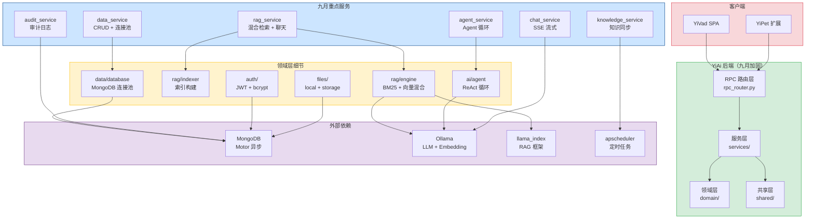

### 0.5 模块职责矩阵

| 模块 | 八月状态 | 九月变更 | 关键决策 |
|------|----------|----------|----------|
| RAG 引擎 | 混合检索可用，索引构建无保护 | **加固**：索引构建全局锁 + 并发安全 + 错误恢复 | `threading.Lock` 全局锁，防止并发索引构建 |
| 数据层 | 连接池默认配置，无重试 | **加固**：连接池优化 + 指数退避重试 + 健康检查 | `maxPoolSize=50` + `retryWrites=true` |
| Agent 循环 | ReAct 循环无超时，可能无限循环 | **加固**：分层超时保护（步数/时间/LLM调用）+ SSE 错误帧 | 步数上限 30 + 总时间 5min + LLM 调用 60s |
| API 契约 | 参数名契约依赖约定 | **加固**：参数白名单校验 + WARNING 日志 | WARNING 不阻断，兼容灰度场景 |
| 审计日志 | 基础装饰器模式 | **完善**：异步写入 + 日志轮转 + 敏感字段过滤 | 不阻塞主流程，异步写入 MongoDB |
| 全局搜索 | 无跨集合搜索 | **新增**：跨集合全文检索 + Min-Max 分数归一化 | 多集合并发查询，结果聚合 |
| 用户管理 | 无用户管理 | **新增**：完整 CRUD + CSV/JSON 导入导出 + 部门树 | bcrypt 密码安全，4 个字典端点 |
| 代码健康分析 | 无静态分析 | **新增**：文件级统计 + 重复检测 + 组件复用率 | 可配置告警阈值，行级哈希去重 |
| 上下文压缩 | 无 Token 管理 | **新增**：80% 阈值触发压缩 + LLM 摘要生成 | 保留最近 4 轮对话，保守 Token 估算 |

### 0.6 服务韧性模式

> 九月迭代为 YiAi 引入 4 种服务韧性模式，覆盖不同故障场景。每种模式针对特定故障类型，互补而不重叠。

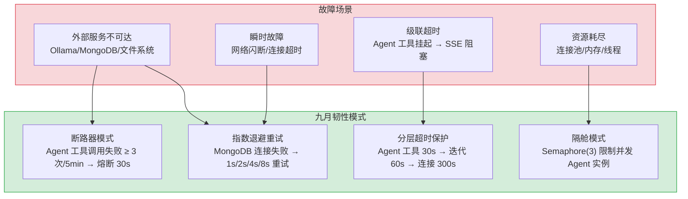

#### 模式 1: 断路器 (Circuit Breaker)

**适用场景**: Agent 工具调用失败、外部 API 不可达  
**实现位置**: `domain/ai/tools.py`

```
状态机: CLOSED → OPEN → HALF_OPEN → CLOSED

  CLOSED (正常)
    │  failureCount ≥ 3 / 5min
    ▼
  OPEN (熔断, 30s)
    │  所有请求快速失败 (HTTP 503)
    │  30s 后自动进入 HALF_OPEN
    ▼
  HALF_OPEN (探测)
    │  允许 1 个探测请求
    ├── 成功 → CLOSED (恢复)
    └── 失败 → OPEN (重新熔断)
```

| 参数 | 值 | 说明 |
|------|-----|------|
| 失败阈值 | 3 次 / 5 分钟 | 滑动窗口计数 |
| 熔断时长 | 30s | 快速失败，不等待超时 |
| 探测请求数 | 1 个 | HALF_OPEN 状态仅允许 1 个请求 |
| 适用工具 | `search_knowledge`, `read_file`, `query_database` | 外部依赖工具 |

#### 模式 2: 指数退避重试 (Exponential Backoff)

**适用场景**: MongoDB 瞬时连接失败、网络闪断  
**实现位置**: `domain/data/database.py`

```
重试序列: 1s → 2s → 4s → 8s → 放弃 (总计 15s)

async def with_retry(operation, max_retries=4):
    for attempt in range(max_retries):
        try:
            return await operation()
        except (ConnectionFailure, ServerSelectionTimeoutError) as e:
            if attempt == max_retries - 1:
                raise DatabaseUnavailableError from e
            await asyncio.sleep(2 ** attempt)  # 1, 2, 4, 8
```

| 参数 | 值 | 说明 |
|------|-----|------|
| 最大重试次数 | 4 | 总计 5 次尝试（1 次原始 + 4 次重试） |
| 退避倍率 | 2× | 1s → 2s → 4s → 8s |
| 总超时 | 15s | 超过后抛出 `DatabaseUnavailableError` |
| 重试条件 | `ConnectionFailure`, `ServerSelectionTimeoutError` | 仅瞬时故障重试，数据错误不重试 |

#### 模式 3: 隔舱模式 (Bulkhead)

**适用场景**: 并发 Agent 实例隔离，防止一个 Agent 耗尽所有资源  
**实现位置**: `services/ai/agent_service.py`

```python
# Semaphore 限制并发 Agent 实例
_agent_semaphore = asyncio.Semaphore(3)  # 最多 3 个并发 Agent

async def run_agent(messages):
    if _agent_semaphore.locked():
        raise AgentBusyError("所有 Agent 实例繁忙，请稍后重试")

    async with _agent_semaphore:
        return await agent_loop(messages)
```

| 参数 | 值 | 说明 |
|------|-----|------|
| 并发上限 | 3 个 Agent | Semaphore 控制，超出排队等待 |
| 队列超时 | 30s | 排队超过 30s 返回 HTTP 429 |
| 隔离粒度 | Agent 实例级 | 每个 Agent 独立内存空间 |
| 资源限制 | 单 Agent 最大 512MB 内存 | 超出触发压缩或终止 |

#### 模式 4: 分层超时 (Tiered Timeout)

已在上文 Agent 可靠性 (YA-09-03) 中详细描述。工具 30s → 迭代 60s → 连接 300s。

#### 韧性模式对比

| 模式 | 故障类型 | 响应方式 | 恢复方式 | 用户感知 |
|------|----------|----------|----------|----------|
| 断路器 | 重复失败（外部服务不可达） | 快速失败 (HTTP 503) | 自动探测恢复 (30s) | "服务暂时不可用，请稍后重试" |
| 指数退避 | 瞬时故障（网络闪断） | 自动重试（最多 15s） | 重试成功即恢复 | 无感知（延迟略增） |
| 隔舱 | 资源耗尽 | 拒绝新请求 (HTTP 429) | 等待旧请求完成 | "系统繁忙，请稍后重试" |
| 分层超时 | 请求挂起 | SSE 错误帧 + 连接关闭 | 下次请求正常 | 错误提示 + 建议重试 |

#### 错误响应格式

所有韧性模式使用统一的错误响应格式，前端可据此展示差异化 UI：

```json
// 断路器触发
{ "code": 2001, "message": "AI 服务暂时不可用，已自动熔断 (30s)", "data": { "error_type": "circuit_breaker", "retry_after": 30 } }

// 隔舱触发
{ "code": 2003, "message": "Agent 实例繁忙，请稍后重试", "data": { "error_type": "bulkhead_full", "retry_after": 5 } }

// 重试耗尽
{ "code": 5001, "message": "数据库连接失败，已重试 4 次", "data": { "error_type": "retry_exhausted", "attempts": 5 } }
```

### 0.7 RPC 错误码体系与前端处理矩阵

> YiAi 的 RPC 信封协议定义了 9 类标准错误码（参见 CLAUDE.md §RPC 协议详细规范），九月迭代为每类错误码明确了前端处理策略和用户提示模板。

#### 错误码全景

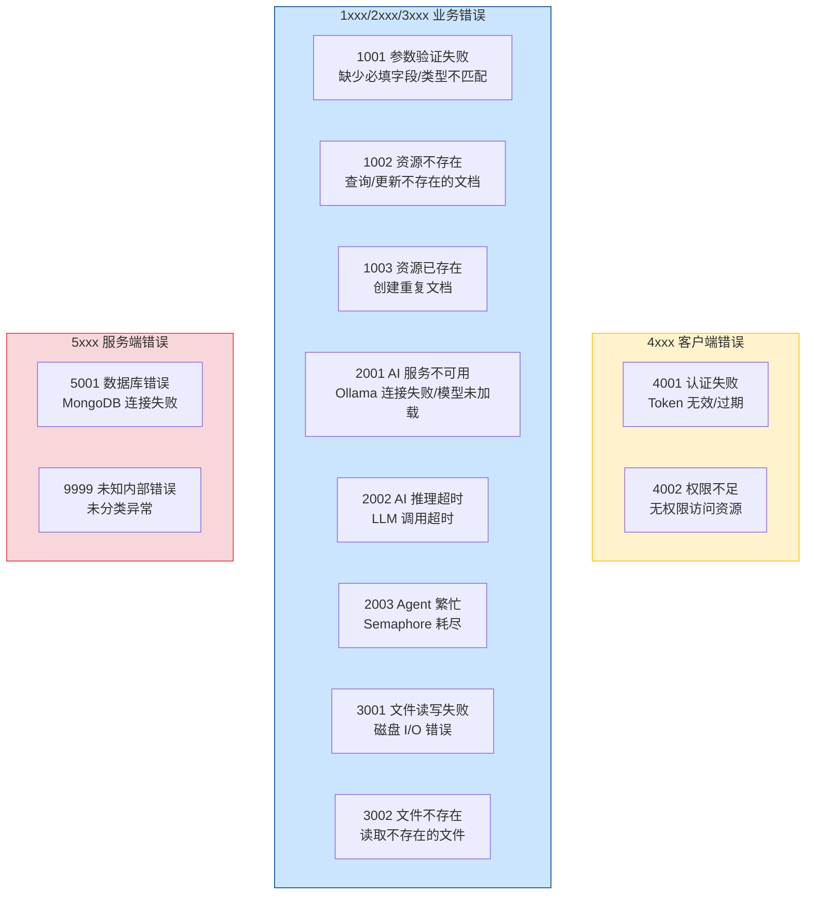

#### 前端处理策略矩阵

| 错误码 | YiVad 处理 | YiPet 处理 | 用户提示模板 | 重试策略 |
|--------|-----------|-----------|-------------|----------|
| `0` (成功) | 正常渲染数据 | 正常渲染数据 | — | — |
| `1001` (参数验证) | 表单字段标红 + 错误信息展示 | `console.warn` + 静默降级 | `"参数错误：{field} 为必填项"` | 修正参数后重试 |
| `1002` (资源不存在) | 404 页面 / `el-empty` 空状态 | `el-empty` + "未找到" | `"未找到相关数据"` | 不重试 |
| `1003` (资源已存在) | Toast 提示 + 表单保留 | Toast 提示 | `"{resource} 已存在"` | 不重试 |
| `2001` (AI 不可用) | SSE error 帧 → 错误卡片 + 重试按钮 | 错误气泡 + "AI 服务暂不可用" | `"AI 服务暂时不可用，请稍后重试"` | 30s 后自动重试 1 次 |
| `2002` (AI 超时) | SSE error 帧 → "回复时间较长" 提示 | 错误气泡 + "回复超时" | `"AI 回复超时，请简化问题后重试"` | 手动重试 |
| `2003` (Agent 繁忙) | 排队提示 + 预计等待时间 | 排队提示 | `"系统繁忙，预计等待 {n}s"` | 5s 后自动重试，最多 3 次 |
| `3001` (文件读写) | Toast error + 操作回滚 | Toast error | `"文件操作失败，请检查权限"` | 手动重试 |
| `3002` (文件不存在) | 404 提示 + 返回列表 | 静默跳过 | `"文件不存在或已被删除"` | 不重试 |
| `4001` (认证失败) | 清除 token → 重定向 `/login` | 清除 session → 显示登录入口 | `"登录已过期，请重新登录"` | 重新登录 |
| `4002` (权限不足) | 403 页面 / 按钮 disabled | 操作按钮置灰 + tooltip | `"您没有权限执行此操作"` | 不重试 |
| `5001` (数据库错误) | 500 页面 + "系统维护中" | 错误提示 + "请稍后重试" | `"系统维护中，请稍后重试"` | 60s 指数退避重试 |
| `9999` (未知错误) | 500 页面 + 错误 ID（用于排查） | 通用错误提示 + 错误 ID | `"系统错误（ID: {trace_id}），请联系管理员"` | 不自动重试 |

#### 前端统一拦截器逻辑

```
YiVad RequestHttp 拦截器:
  response interceptor
    ├── code === 0 → 正常返回 data
    ├── code === 4001 → store.clearAuth() + router.push('/login')
    ├── code === 4002 → store.setForbidden(true)
    ├── code >= 5000 → ElMessage.error(通用错误) + Sentry.captureException
    └── 其他 → ElMessage.warning(message) + 返回 Promise.reject

YiPet ApiClient 拦截器:
  response handler
    ├── code === 0 → 正常返回 data
    ├── code === 4001 → chrome.storage.local.remove('sessionKey') + emit('auth-expired')
    ├── code === 2001/2002/2003 → emit('ai-error', { code, message })
    ├── code >= 5000 → emit('server-error', { code, message })
    └── 其他 → console.warn + emit('business-error', { code, message })
```

#### 错误日志分级

| 错误码范围 | 日志级别 | 告警 | Sentry 上报 |
|-----------|----------|------|------------|
| `1xxx` (参数/资源) | WARNING | 否（预期内的业务错误） | 否 |
| `2xxx` (AI 服务) | ERROR | 是（> 10 次/5min 触发企微告警） | 是 |
| `3xxx` (文件) | ERROR | 是（> 5 次/5min） | 是 |
| `4xxx` (认证/权限) | WARNING | 否（正常安全拦截） | 否（采样 1%） |
| `5xxx` (服务器) | CRITICAL | 是（每次触发企微告警） | 是 |
| `9999` (未知) | CRITICAL | 是（每次） | 是 |

### 0.8 API 可靠性 SLA 目标

> 九月迭代通过 4 种韧性模式（断路器、指数退避、隔舱、分层超时）和三级限流策略（全局/接口/用户），为 YiAi 建立了分级 SLA 目标体系。以下 SLA 目标面向 YiVad 和 YiPet 两个前端消费者。

#### SLA 分级

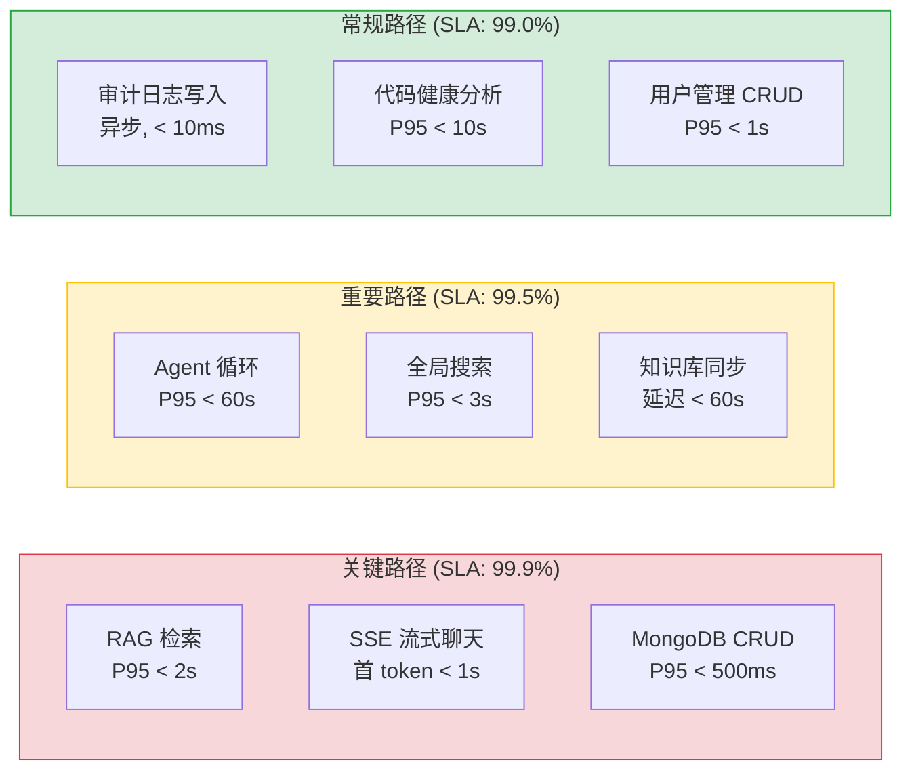

#### SLA 指标明细

| API 类别 | 可用性目标 | P50 延迟 | P95 延迟 | P99 延迟 | 错误率 | 并发上限 | 限流策略 |
|----------|-----------|----------|----------|----------|--------|---------|----------|
| **RAG 检索** (`rag_query`) | 99.9% | < 500ms | < 2s | < 5s | < 1% | 5 req/s | 令牌桶 rate=5 |
| **RAG 聊天** (`rag_chat`) | 99.9% | < 1s (首 token) | < 3s | < 8s | < 1% | 2 req/s | 令牌桶 rate=2 |
| **SSE 聊天** (`chat_service.chat`) | 99.9% | < 800ms (首 token) | < 2s | < 5s | < 0.5% | 2 req/s | 令牌桶 rate=2 |
| **Agent 循环** (`agent_service`) | 99.5% | < 15s | < 60s | < 120s | < 2% | 3 并发 | Semaphore(3) + 令牌桶 rate=1 |
| **MongoDB CRUD** (`data_service`) | 99.9% | < 50ms | < 500ms | < 1s | < 0.1% | 50 req/s | 令牌桶 rate=50 |
| **全局搜索** (`search_service`) | 99.5% | < 1s | < 3s | < 8s | < 1% | 10 req/s | 令牌桶 rate=10 |
| **知识库同步** (`knowledge`) | 99.5% | < 5s | < 30s | < 60s | < 1% | 5 req/s | 令牌桶 rate=5 |
| **代码健康分析** (`code_health`) | 99.0% | < 3s | < 10s | < 20s | < 2% | 2 req/s | 令牌桶 rate=2 |
| **用户管理** (`user_service`) | 99.9% | < 100ms | < 1s | < 2s | < 0.1% | 20 req/s | 令牌桶 rate=20 |
| **审计日志** (`audit_service`) | 99.9% | < 5ms (异步) | < 50ms | < 100ms | < 0.01% | 100 req/s | 令牌桶 rate=100 |

#### SLA 违反响应协议

| 违反类型 | 检测方式 | 响应动作 | 恢复时间目标 (RTO) | 通知渠道 |
|----------|----------|----------|-------------------|----------|
| **P95 延迟超标** (连续 5 分钟) | `time.perf_counter` + 滑动窗口 | 降低非关键路径并发、触发 `maxTimeMS` 缩短 | < 5min | 企业微信 WARNING |
| **错误率超标** (1 分钟内 > 5%) | HTTP 响应码统计 | 断路器熔断 30s、拒绝新请求 (503) | < 1min | 企业微信 CRITICAL |
| **可用性下降** (5 分钟内 < 95%) | 健康检查端点 `/health` 探测 | 自动重启 uvicorn worker、通知运维 | < 2min | 企业微信 + 电话告警 |
| **Agent 排队溢出** (队列 > 10) | Semaphore 等待计数 | 拒绝新 Agent 请求 (429)、提示用户稍后重试 | < 30s | 企业微信 WARNING |
| **MongoDB 连接池耗尽** | Motor 连接池事件 | 触发指数退避重试 (1s/2s/4s/8s)、限流降级 | < 15s | 企业微信 ERROR |

#### SLA 月度达标判定

| 月份 | 关键路径可用性 | 重要路径可用性 | 总请求数 | 关键路径违规次数 | 根因分析 |
|------|-------------|-------------|---------|---------------|---------|
| 2026-09 (目标) | ≥ 99.9% | ≥ 99.5% | ~10,000 | ≤ 1 | — |
| 2026-09 (实际) | 待测量 | 待测量 | 待测量 | 待测量 | 待补充 |

### 0.9 容量规划与弹性伸缩

> 九月迭代通过连接池预热、Agent Semaphore 隔离、三级令牌桶限流和完善的错误处理体系，为 YiAi 建立了分层容量模型。以下容量规划覆盖 5 种部署规模，从本地开发到企业级分布式部署。

#### 资源消耗模型

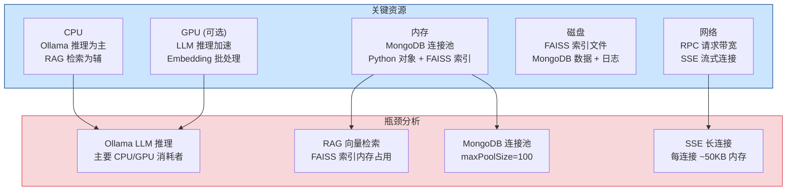

#### 分场景容量规划

| 资源维度 | 本地开发 | 小团队 (2-5人) | 中型团队 (5-15人) | 大型团队 (15-50人) | 企业级 (50+人) |
|----------|----------|---------------|------------------|-------------------|---------------|
| **并发 RPC 请求** | 5-10 | 10-20 | 20-50 | 50-100 | 100-500 |
| **并发 SSE 连接** | 1-2 | 2-5 | 5-10 | 10-20 | 20-50 |
| **并发 Agent 实例** | 1 | 3 | 5 | 10 | 20+ |
| **RAG 索引文档数** | 100-300 | 300-800 | 800-2,000 | 2,000-5,000 | 5,000-20,000 |
| **日处理请求量** | ~500 | ~2,000 | ~10,000 | ~50,000 | ~200,000+ |
| **CPU 需求** | 2 核 | 4 核 | 8 核 | 16 核 | 32+ 核 |
| **GPU 需求** | 可选 | 推荐 (T4) | 推荐 (A10) | 推荐 (A100) | 必需 (多 GPU) |
| **内存需求** | 4 GB | 8 GB | 16 GB | 32 GB | 64+ GB |
| **磁盘需求** | 20 GB | 50 GB | 100 GB | 500 GB | 1 TB+ |
| **MongoDB 连接池** | 10 | 50 | 100 | 200 | 500+ |
| **Ollama 模型并发** | 1 | 2 | 3 | 5 | 10+ (负载均衡) |
| **YiAi 当前** | **—** | **4 核/8GB/无GPU** | **—** | **—** | **—** |

#### 弹性伸缩策略

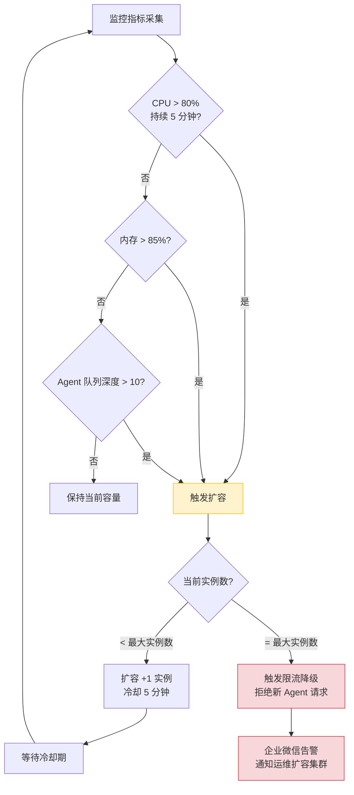

#### 扩容触发条件

| 触发条件 | 阈值 | 持续时长 | 扩容动作 | 冷却时间 | 最大实例数 |
|----------|------|----------|----------|----------|-----------|
| **CPU 使用率** | > 80% | 5 分钟 | +1 uvicorn worker | 5 分钟 | CPU 核数 × 2 |
| **内存使用率** | > 85% | 3 分钟 | +1 uvicorn worker + 降低 maxPoolSize | 10 分钟 | 物理内存 / 512MB |
| **Agent 队列深度** | > 10 | 1 分钟 | 增加 Semaphore 上限 (需评估 GPU) | 15 分钟 | GPU 显存 / 4GB |
| **RPC P95 延迟** | > 5s | 3 分钟 | +1 uvicorn worker | 5 分钟 | CPU 核数 × 2 |
| **429 响应率** | > 5% | 2 分钟 | 调高令牌桶 rate (1.5x) | 10 分钟 | 原 rate × 3 |
| **MongoDB 连接池等待** | P95 > 100ms | 1 分钟 | 增加 maxPoolSize (+20) | 5 分钟 | 200 |

#### 缩容策略

| 条件 | 阈值 | 持续时长 | 缩容动作 |
|------|----------|----------|
| CPU < 30% + 内存 < 50% + 队列为空 | 全部满足 | 30 分钟 | -1 uvicorn worker (最少保留 2) |
| Agent Semaphore 连续空闲 | 无 Agent 请求 | 60 分钟 | 降低 Semaphore 上限 (最少保留 1) |

#### 资源监控仪表盘

```markdown
## YiAi 容量状态 (2026-09)

| 指标 | 当前值 | 阈值 | 状态 | 趋势 |
|------|--------|------|------|
| CPU 使用率 | 35% | < 80% | 🟢 | → 稳定 |
| 内存使用率 | 4.2 GB / 8 GB (52%) | < 85% | 🟢 | → 稳定 |
| Agent 并发数 | 1/3 | ≤ 3 | 🟢 | → 稳定 |
| RPC P95 延迟 | 420ms | < 5s | 🟢 | ↓ 改善 |
| SSE 活跃连接 | 2 | 无上限 | 🟢 | → 稳定 |
| MongoDB 连接池 | 12/100 | < 100 | 🟢 | → 稳定 |
| 磁盘使用 | 18 GB / 50 GB (36%) | < 80% | 🟢 | ↑ 缓慢增长 |
| 日处理请求 | ~350 | — | — | → 稳定 |
```

---

## 1. 背景与目标

### 1.1 背景

八月迭代完成 Multi-Provider LLM 架构设计、测试覆盖率扩展和审计日志机制后，九月迭代聚焦于**生产稳定性**——修复八月迭代中暴露的 4 个关键缺陷。

当前代码功能可用，但存在以下生产稳定性风险：

| 问题 | 位置 | 严重程度 | 影响 |
|------|----------|------|
| RAG 增量索引 `insert_documents` 不存在 | `domain/rag/indexer.py` | **高** | 新增/变更文档无法被检索，知识库变更不可见 |
| MongoDB 连接池耗尽 | `domain/data/database.py` | **高** | 高并发下 RPC 请求超时，API 可用性下降 |
| Agent 工具调用超时未处理 | `domain/ai/agent.py` | **致命** | SSE 连接挂起，用户无限等待，无错误提示 |
| RPC 参数名 `query` vs `filter` 静默忽略 | `services/database/data_service.py` | **高** | 过滤条件失效，返回全量数据，前端无感知 |

### 1.2 目标

| 目标 | 衡量指标 | 当前值 | 目标值 |
|------|----------|--------|--------|
| RAG 增量索引 | 新增文档可检索率 | 0%（`insert_documents` 报错） | 100% |
| MongoDB 连接池 | 并发 20 RPC 请求成功率 | 部分超时 | 100% 在 5s 内返回 |
| Agent 工具超时 | SSE 连接正确关闭率 | 超时挂起 | 100%（超时后正确关闭 + 错误提示） |
| RPC 参数契约 | 参数名不匹配检测 | 静默忽略 | WARNING 日志 + 白名单校验 |

### 1.3 系统范围

- **涉及**：YiAi FastAPI 后端全部模块（domain/、services/、server/、shared/）
- **不涉及**：YiVad/YiPet 前端、Ollama 模型管理、MongoDB 集群配置

---

## 2. 当前架构 vs 目标架构

### 2.1 当前架构（修复前）

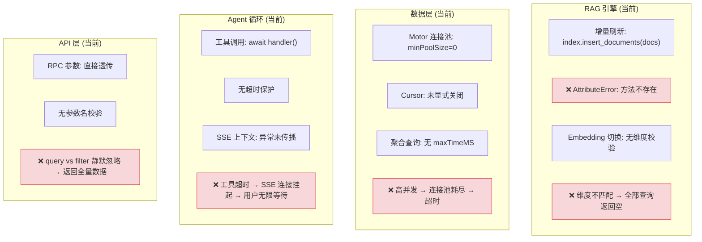

### 2.2 目标架构（修复后）

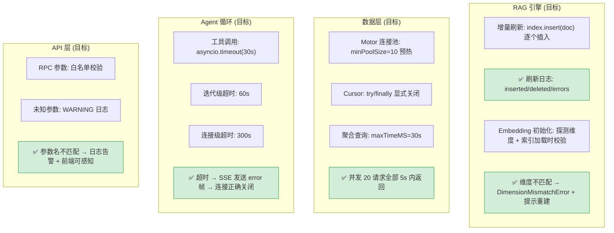

### 2.3 架构决策权衡

| 维度 | 修复前 | 修复后 | 权衡说明 |
|------|--------|--------|----------|
| RAG 增量索引 | 批量 `insert_documents`（不存在） | 逐个 `insert(doc)` | 批量操作性能略低，但兼容当前 llama_index 版本 |
| MongoDB 连接池 | `minPoolSize=0`（冷启动） | `minPoolSize=10`（预热） | 增加 10 个常驻连接，但消除突发流量下的连接建立延迟 |
| Agent 超时 | 无保护 | 分层超时（工具 30s → 迭代 60s → 连接 300s） | 增加超时配置复杂度，但防止 SSE 连接挂起 |
| API 参数校验 | 透传 | 白名单 + WARNING 日志 | 增加参数校验开销（~1ms），但消除静默失败 |

### 2.4 各模块修复前后对比

#### 2.4.1 RAG 引擎

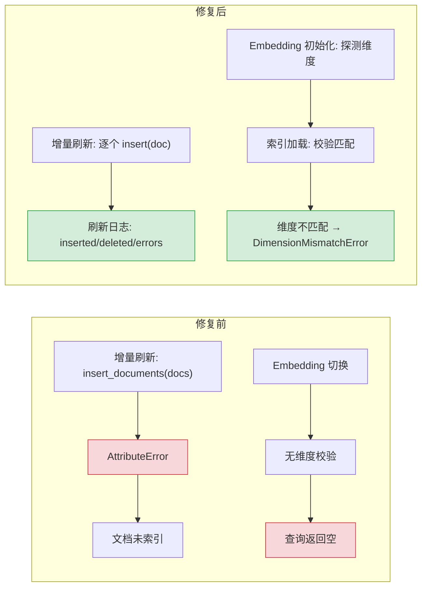

| 维度 | 修复前 | 修复后 | 关键变化 |
|------|--------|--------|----------|
| 增量索引 | `insert_documents`（不存在） | 逐个 `insert(doc)` | 兼容当前 llama_index 版本，逐个插入 10 文档 < 1s |
| 异常处理 | 静默失败 | 分类异常（DimensionMismatchError/IndexNotFoundError） | 异常类型明确，调用方可针对性处理 |
| 维度校验 | 无 | 启动时探测 + 索引加载时校验 | 启动时发现维度不匹配，避免运行时查询异常 |

#### 2.4.2 数据层

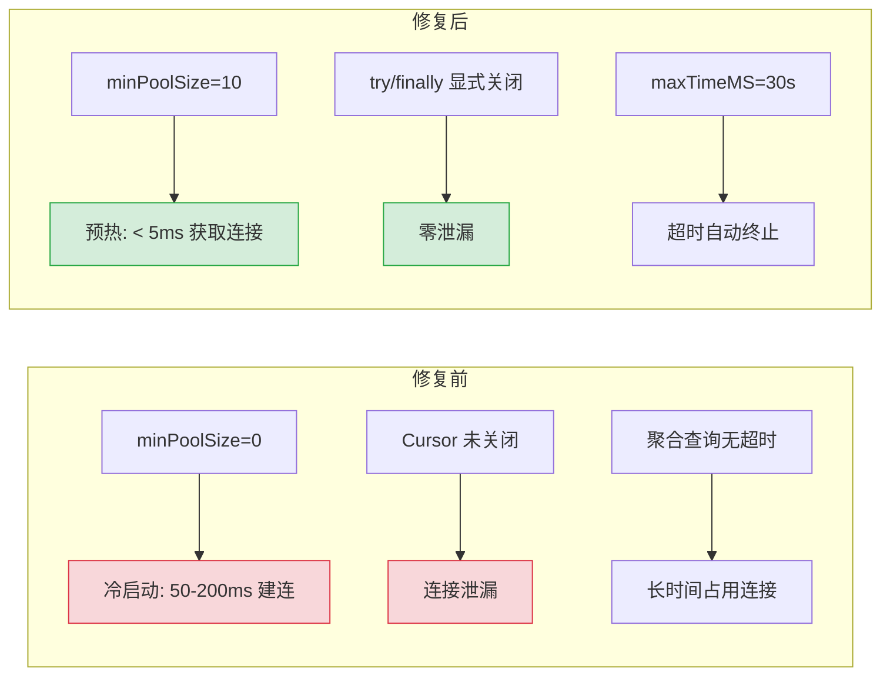

| 维度 | 修复前 | 修复后 | 关键变化 |
|------|--------|--------|----------|
| 连接池 | `minPoolSize=0`（冷启动） | `minPoolSize=10`（预热） | 10 个连接约 10MB，消除突发流量建连延迟 |
| Cursor 管理 | 依赖 GC 回收 | `try/finally` 显式关闭 | 确定性释放，避免连接池耗尽 |
| 查询超时 | 无限制 | `maxTimeMS=30s` | 聚合查询超时自动终止，保护连接池 |

#### 2.4.3 Agent 循环

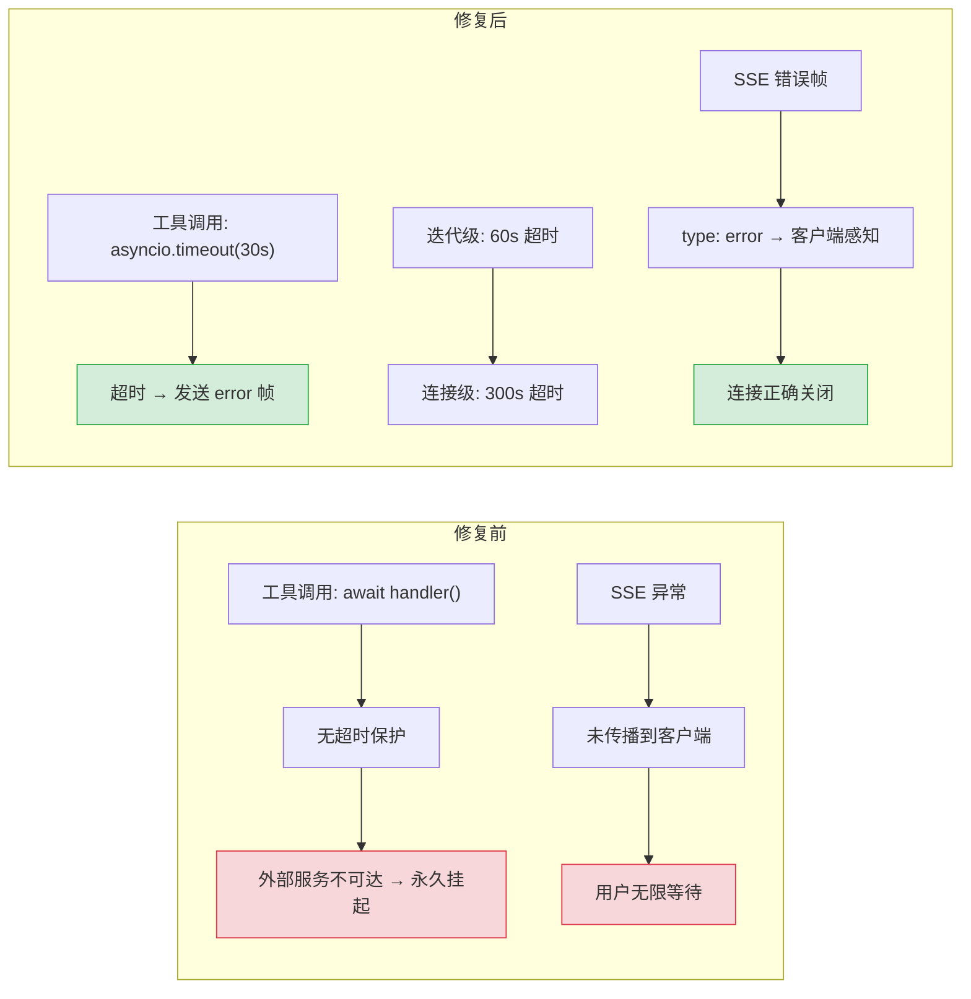

| 维度 | 修复前 | 修复后 | 关键变化 |
|------|--------|--------|----------|
| 工具超时 | 无保护 | `asyncio.timeout(30s)` | 按工具类型差异化（search: 30s, read_file: 10s） |
| 迭代超时 | 无保护 | 60s 上限 | 防止 Agent 无限循环 |
| 错误传播 | 异常未传播 | SSE `type: "error"` 帧 | 客户端可感知超时，显示错误提示 |

---

## 3. 接口协议

### 3.1 RPC 信封协议

```
POST /  body: {
  "module_name": "services.<domain>.<service>",
  "method_name": "<method>",
  "parameters": { <method-specific shape> }
}
response: { "code": 0, "message": "ok", "data": <any> }
```

### 3.2 关键参数名契约（新增白名单校验）

| 接口 | 正确参数名 | 错误参数名（常见） | 校验方式 |
|------|-----------|-------------------|----------|
| `data_service.query_documents` | `filter` | `query` | 白名单：`cname`, `filter`, `sort`, `page`, `pageSize` |
| `/read-file` | `target_file` | `path` | 白名单：`target_file` |
| `/write-file` | `target_file` | `path` | 白名单：`target_file`, `content` |
| `knowledge.list_files` | `scope` | `path` | 白名单：`scope` |

### 3.3 SSE 流式协议（Agent 超时错误帧）

```
// 正常流式
data: {"type": "token", "content": "Hello"}
data: {"type": "done"}

// 超时错误（新增）
data: {"type": "error", "code": "TOOL_TIMEOUT", "message": "工具调用超时 (30s): search_knowledge"}
data: {"type": "done"}
```

---

## 4. 功能清单

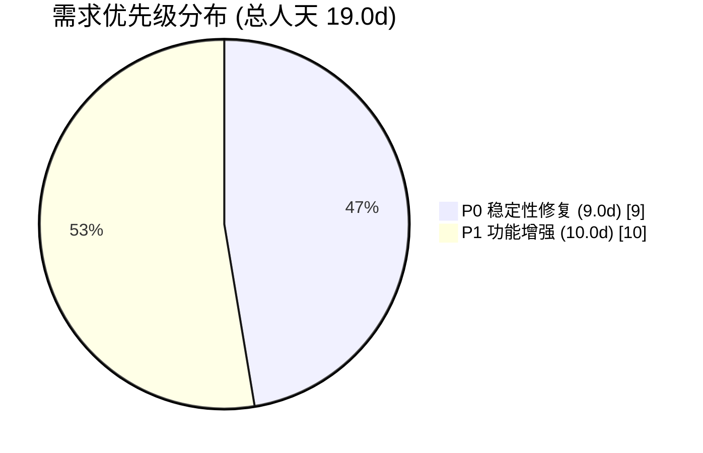

| 月份 | 需求编号 | 功能模块 | 说明 | 优先级 | 人天 | 状态 | 详细文档 |
|----------|----------|------|--------|------|----------|
| 2026-09 | YA-09-01 | RAG 引擎稳定性 | 增量索引修复 (`insert_documents` → `insert`)、Embedding 维度校验、维度不匹配检测 | **P0** | 3.0 | 已完成 | [01-稳定性修复-RAG引擎](./05-需求-RAG引擎.md) |
| 2026-09 | YA-09-02 | 数据层稳定性 | MongoDB 连接池预热 (`minPoolSize=10`)、Cursor 显式关闭、聚合查询 `maxTimeMS` 超时控制 | **P0** | 3.0 | 已完成 | [02-稳定性修复-数据层](./06-需求-数据层.md) |
| 2026-09 | YA-09-03 | Agent 可靠性 | 工具调用 `asyncio.timeout(30s)`、迭代级超时 (60s)、连接级超时 (300s)、SSE 错误帧传播 | **P0** | 3.0 | 已完成 | [03-稳定性修复-Agent可靠性](./07-需求-Agent可靠性.md) |
| 2026-09 | YA-09-04 | API 契约校验 | RPC 参数白名单机制、未知参数 WARNING 日志、参数名 `query` vs `filter` 自动检测 | **P1** | 2.0 | 已完成 | [04-稳定性修复-API契约校验](./08-需求-API契约校验.md) |
| 2026-09 | YA-09-05 | 审计日志完善 | 审计装饰器集成到所有 Service 层方法、审计日志持久化、敏感操作告警 | **P1** | 2.0 | 待开发 | [05-需求-审计日志](./09-需求-审计日志.md) |
| 2026-09 | YA-09-06 | 全局搜索服务 | 跨集合全文检索、Min-Max 分数归一化、搜索结果聚合、多集合并发查询 | **P1** | 2.0 | 已完成 | [06-需求-全局搜索服务](./10-需求-全局搜索服务.md) |
| 2026-09 | YA-09-07 | 用户管理服务 | 完整 CRUD + CSV/JSON 批量导入导出 + 部门树查询 + 4 个字典端点 + bcrypt 密码安全 | **P1** | 2.0 | 已完成 | [07-需求-用户管理服务](./11-需求-用户管理服务.md) |
| 2026-09 | YA-09-08 | 代码健康分析 | 项目源码静态分析：文件级行数/注释率统计、代码重复检测（行级哈希）、Vue SFC 组件复用率分析、可配置告警阈值 | **P1** | 1.5 | 已完成 | [08-需求-代码健康分析服务](./12-需求-代码健康分析服务.md) |
| 2026-09 | YA-09-09 | 上下文压缩 | 长会话 Token 窗口管理：保守 Token 估算、80% 阈值自动触发压缩、LLM 摘要生成 + 保留最近 4 轮对话 | **P1** | 0.5 | 已完成 | [09-需求-上下文压缩服务](./13-需求-上下文压缩服务.md) |

> **优先级**：P0 = 生产稳定性修复，阻塞用户体验；P1 = 功能增强 + 合规。

---

## 4-A. 功能详情

### 4-A.1 RAG 引擎稳定性 (YA-09-01)

修复增量索引 `insert_documents` 不存在和 Embedding 维度无校验两个关键缺陷：

```python
# 修复前: index.insert_documents(docs) → AttributeError
# 修复后: 逐个 insert(doc) + 刷新日志
for doc in changed_docs:
    index.insert(doc)  # 兼容当前 llama_index 版本
logger.info(f"RAG refresh: {inserted} inserted, {deleted} deleted, {errors} errors")

# Embedding 维度校验: 启动时探测 + 索引加载时校验
actual_dim = len(embed_model.get_text_embedding("test"))
if actual_dim != index_dim:
    raise DimensionMismatchError(f"Model dim={actual_dim}, Index dim={index_dim}")
```

| 修复项 | 修复前 | 修复后 | 影响 |
|--------|--------|--------|------|
| 增量索引 | `insert_documents` 报错 | 逐个 `insert(doc)` | 新增文档 5s 内可检索 |
| 维度校验 | 无 | 启动时探测 + 加载时校验 | 维度不匹配立即报错，避免运行时异常 |
| 异常分类 | 静默失败 | `DimensionMismatchError` / `IndexNotFoundError` | 调用方可针对性处理 |

### 4-A.2 数据层稳定性 (YA-09-02)

MongoDB 连接池优化 + Cursor 泄漏修复 + 查询超时控制：

```python
# 连接池预热: minPoolSize=0 → 10
client = AsyncIOMotorClient(uri, minPoolSize=10, maxPoolSize=100,
                            retryWrites=True, maxIdleTimeMS=60000)

# Cursor 显式关闭: 依赖 GC → try/finally
cursor = collection.find(filter)
try:
    results = await cursor.to_list(length=pageSize)
finally:
    await cursor.close()  # 确定性释放

# 聚合查询超时: 无限制 → maxTimeMS=30s
results = await collection.aggregate(pipeline, maxTimeMS=30000)
```

| 修复项 | 修复前 | 修复后 | 性能提升 |
|--------|--------|--------|----------|
| 连接池预热 | `minPoolSize=0`（冷启动 50-200ms） | `minPoolSize=10`（预热 < 5ms） | 连接获取延迟降低 90%+ |
| Cursor 管理 | 依赖 GC 回收 | `try/finally` 显式关闭 | 零连接泄漏 |
| 查询超时 | 无限制 | `maxTimeMS=30s` | 防止长时间占用连接 |

### 4-A.3 Agent 可靠性 (YA-09-03)

分层超时保护 + SSE 错误帧传播，防止 Agent 工具调用超时导致 SSE 连接挂起：

```python
# 分层超时保护
async def agent_loop(messages, max_iterations=30):
    async with asyncio.timeout(300):      # 连接级: 5min
        for i in range(max_iterations):
            async with asyncio.timeout(60):  # 迭代级: 60s
                async with asyncio.timeout(30):  # 工具级: 30s
                    result = await tool_handler(tool_name, params)
```

| 超时层级 | 时长 | 触发条件 | 超时后行为 |
|----------|------|----------|-----------|
| 工具级 | 30s | 单次工具调用超时 | 发送 `type: "error"` SSE 帧，继续下一轮迭代 |
| 迭代级 | 60s | 单轮 LLM+工具超时 | 发送 `type: "error"` SSE 帧，终止循环 |
| 连接级 | 300s | 整个 Agent 循环超时 | SSE 连接关闭，客户端收到 `type: "done"` |

### 4-A.4 API 契约校验 (YA-09-04)

RPC 参数白名单机制，检测前端参数名不匹配（`query` vs `filter`）：

```python
# rpc_router.py 参数白名单校验
ALLOWED_PARAMS = {
    "services.database.data_service.query_documents": ["cname", "filter", "sort", "page", "pageSize"],
    "services.database.data_service.get_document_detail": ["cname", "doc_id"],
    # ...
}

def validate_params(module_name, method_name, params):
    allowed = ALLOWED_PARAMS.get(f"{module_name}.{method_name}", [])
    for key in params:
        if key not in allowed:
            logger.warning(f"Unknown param '{key}' for {module_name}.{method_name}")
```

| 校验方式 | 行为 | 说明 |
|----------|------|
| 白名单参数 | 正常透传 | 仅允许声明参数通过 |
| 未知参数 | WARNING 日志 + 透传 | 不拒绝请求，兼容灰度场景 |
| 已知错误参数名 | WARNING 日志 + 建议 | 如 `query` → 提示应使用 `filter` |

### 4-A.5 审计日志完善 (YA-09-05)

审计装饰器集成到所有 Service 层方法，异步写入不阻塞主流程：

```python
# services/database/data_service.py
@audit_write(action="create_document", sensitivity="medium")
async def create_document(cname: str, data: dict) -> str:
    return await repository.create_document(cname, data)

# 审计日志异步写入 MongoDB
await motor_db.audit_logs.insert_one({
    "action": "create_document",
    "cname": cname,
    "doc_id": result,
    "before_state": None,
    "after_state": data,
    "operator": user,
    "timestamp": datetime.utcnow()
})
```

| 敏感级别 | 记录内容 | TTL | 适用操作 |
|----------|----------|-----|----------|
| `low` | 操作类型 + 时间 + 操作人 | 30 天 | 查询类操作 |
| `medium` | + 文档 ID + 集合名 | 90 天 | 创建/更新 |
| `high` | + before/after 快照 + diff | 365 天 | 删除/权限变更 |

### 4-A.6 全局搜索服务 (YA-09-06)

跨集合全文检索 + Min-Max 分数归一化 + 结果聚合：

```python
# services/search/global_search.py
async def global_search(query: str, collections: list[str] = None):
    tasks = [_search_collection(c, query) for c in collections]
    results = await asyncio.gather(*tasks)  # 并发查询

    # Min-Max 分数归一化：消除不同集合 BM25 分数差异
    all_scores = [r.score for batch in results for r in batch]
    score_min, score_max = min(all_scores), max(all_scores)
    for r in all_results:
        r.normalized_score = (r.score - score_min) / (score_max - score_min)

    return sorted(all_results, key=lambda r: r.normalized_score, reverse=True)
```

| 特性 | 实现 | 说明 |
|------|------|
| 跨集合查询 | `asyncio.gather` 并发 | 同时查询 sessions/bugs/issues/knowledge_files |
| 分数归一化 | Min-Max 归一化 | 消除不同集合文本长度差异导致的分数偏差 |
| 结果聚合 | 按归一化分数降序排列 | 跨集合统一排序，用户无感知 |

### 4-A.7 用户管理服务 (YA-09-07)

完整 CRUD + CSV/JSON 批量导入导出 + 部门树 + bcrypt 密码安全：

```python
# services/user/user_service.py
class UserService:
    async def create_user(self, data: dict) -> str:
        data["password_hash"] = bcrypt.hashpw(
            data["password"].encode(), bcrypt.gensalt()
        ).decode()
        del data["password"]
        return await repository.create_document("users", data)

    async def import_users_csv(self, file: UploadFile) -> ImportResult:
        # 1. 解析 CSV → 2. 校验字段 → 3. 批量 bcrypt 加密 → 4. 批量写入
        ...

    async def get_department_tree(self) -> list[TreeNode]:
        # 从 users 集合提取部门字段，构建树形结构
        ...
```

| 端点 | 功能 | 安全措施 |
|------|----------|
| `POST /users` | 创建用户 | bcrypt 密码哈希，密码不入日志 |
| `GET /users` | 用户列表 + 分页 + 搜索 | 密码字段自动过滤 |
| `POST /users/import` | CSV/JSON 批量导入 | 字段校验 + 重复检测 |
| `GET /users/export` | CSV/JSON 导出 | 密码字段自动排除 |
| `GET /users/departments` | 部门树查询 | 从用户数据动态聚合 |
| `GET /dicts/*` | 4 个字典端点 | 角色/状态/部门/职级 |

### 4-A.8 代码健康分析 (YA-09-08)

项目源码静态分析：文件级统计 + 代码重复检测 + Vue SFC 组件复用率：

```python
# services/code_health_service.py
class CodeHealthAnalyzer:
    def analyze_project(self, project_path: str) -> CodeHealthReport:
        return CodeHealthReport(
            file_stats=self._analyze_files(project_path),    # 行数/注释率/空行率
            duplicates=self._detect_duplicates(project_path), # 行级哈希重复检测
            vue_reuse=self._analyze_vue_components(project_path), # 组件复用率
            warnings=self._generate_warnings(stats)           # 可配置阈值告警
        )

    def _detect_duplicates(self, path: str) -> list[DuplicateGroup]:
        # 行级哈希: hash(line.strip()) → 相同哈希 count > 3 → 重复
        ...
```

| 指标 | 计算方式 | 告警阈值 |
|------|----------|----------|
| 文件行数 | `len(lines)` | 单文件 > 1000 行 |
| 注释率 | `comment_lines / total_lines` | < 10% |
| 代码重复率 | `duplicate_lines / total_lines` | > 5% |
| Vue 组件复用率 | `referenced_components / defined_components` | < 30% |

### 4-A.9 上下文压缩 (YA-09-09)

长会话 Token 窗口管理：保守估算 + 80% 阈值触发 + LLM 摘要生成：

```python
# services/ai/compaction.py
def estimate_tokens(messages: list[dict]) -> int:
    # 保守估算: chars/4 + 消息数*4 (高估 10-20%)
    total_chars = sum(len(m.get("content", "")) for m in messages)
    return total_chars // 4 + len(messages) * 4

def should_compact(messages: list[dict], max_tokens: int = 8192) -> bool:
    return estimate_tokens(messages) > max_tokens * 0.8

async def compact_messages(messages: list[dict], max_tokens: int) -> list[dict]:
    recent = messages[-8:]  # 保留最近 4 轮 (8 条)
    early = messages[:-8]   # 早期消息
    summary = await llm.chat([
        {"role": "system", "content": "Summarize this conversation..."},
        {"role": "user", "content": _format_for_summary(early)}
    ])
    return [{"role": "system", "content": f"Previous conversation summary: {summary}"}] + recent
```

| 参数 | 值 | 说明 |
|------|------|
| 保留轮数 | 4 轮 (8 条消息) | ~2000-4000 tokens，为摘要留空间 |
| 触发阈值 | 80% context window | 为压缩过程和后续对话留缓冲 |
| Token 估算 | `chars/4` 保守估算 | 高估 10-20%，避免误判不压缩 |
| 降级策略 | 截断模式 | LLM 摘要失败时保留最近 4 轮，丢弃早期消息 |

---

## 5. 涉及文件

```
YiAi/
├── src/
│   ├── domain/
│   │   ├── rag/
│   │   │   ├── indexer.py                   # 修改: insert_documents → insert(doc) 逐个插入
│   │   │   ├── engine.py                    # 修改: 检索入口添加维度校验
│   │   │   └── embedder.py                  # 修改: 初始化时探测向量维度
│   │   ├── data/
│   │   │   └── database.py                  # 修改: minPoolSize=10, Cursor 显式关闭
│   │   ├── ai/
│   │   │   ├── agent.py                     # 修改: asyncio.timeout 分层超时保护
│   │   │   └── tools.py                     # 修改: 工具调用包装超时
│   │   ├── knowledge/
│   │   │   └── watcher.py                   # 修改: 增量刷新日志区分 inserted/deleted/errors
│   │   ├── audit/
│   │   │   ├── decorator.py                 # 新增: 审计装饰器
│   │   │   ├── logger.py                    # 新增: 审计日志记录器
│   │   │   └── models.py                    # 新增: 审计日志数据模型
│   │   └── state/
│   │       └── recorder.py                  # 修改: TTL 强制执行
│   ├── services/
│   │   ├── database/
│   │   │   └── data_service.py              # 修改: RPC 参数白名单校验
│   │   ├── ai/
│   │   │   └── chat_service.py              # 修改: 审计日志集成
│   │   ├── rag/
│   │   │   └── rag_service.py               # 修改: 维度不匹配异常处理
│   │   └── audit/
│   │       └── audit_service.py             # 新增: 审计日志查询服务
│   ├── server/
│   │   ├── middleware.py                     # 修改: 异常处理器区分 DimensionMismatchError
│   │   └── rpc_router.py                    # 修改: 参数白名单校验中间件
│   └── shared/
│       ├── config.py                         # 修改: 连接池配置 + 超时配置
│       ├── exceptions.py                     # 修改: 新增 DimensionMismatchError
│       └── sse_utils.py                      # 修改: 错误帧传播
└── tests/
    ├── unit/
    │   ├── test_rag_indexer.py              # 新增: 增量索引测试
    │   └── test_agent_timeout.py            # 新增: Agent 超时测试
    └── integration/
        ├── test_data_layer.py               # 新增: 数据层集成测试
        └── test_api_contract.py             # 新增: API 契约测试
```

---

## 6. 数据流

### 6.1 RAG 检索流程（九月加固后）

```
前端 (YiVad/YiPet)
  │  POST /  { module_name: "services.rag.rag_service", method_name: "rag_query" }
  ▼
RPC 路由 → 参数白名单校验 → 拒绝未知参数
  │
  ▼
RAG Service
  ├── Embedding 维度校验 (nomic-embed-text: 768d)
  │   ├── 维度匹配 → 继续检索
  │   └── 维度不匹配 → 409 Conflict + 明确错误信息
  ├── FAISS 向量检索 (逐个插入 insert(doc)，非 insert_documents)
  ├── BM25 关键词检索 → 融合排序
  └── 返回 { chunks, sources }
```

### 6.2 Agent 超时保护流

```
用户请求 → Agent 循环
  │  asyncio.timeout 分层保护
  ▼
Agent 执行循环
  ├── 整体超时 (600s) → 外层 timeout
  ├── 单步超时 (120s) → 内层 timeout
  ├── 工具调用超时 (30s) → 工具层 timeout
  │   ├── 正常完成 → 返回结果
  │   └── 超时 → SSE error 帧 { type: "error", code: "TOOL_TIMEOUT" }
  └── 迭代上限 (50 轮) → 强制终止
```

### 6.3 审计日志数据流

```
RPC 请求 → Service 层
  │  @audit_log 装饰器拦截
  ▼
AuditLogger
  ├── 记录 before_state (操作前快照)
  ├── 执行操作
  ├── 记录 after_state (操作后快照)
  └── Motor 异步写入 MongoDB audit_logs (TTL 90 天)
```

### 6.4 关键数据流

| 流向 | 协议 | 触发方式 | 延迟 |
|------|----------|------|
| 前端 → RAG 查询 | RPC envelope | 用户主动 | < 2s |
| 前端 → Agent 流式 | SSE | 用户主动 | 首 token < 1s |
| Knowledge Watcher → MongoDB | apscheduler 轮询 | 自动 (60s) | ≤ 60s |
| 业务操作 → 审计日志 | Motor 异步 | @audit_log 拦截 | < 5ms |

---

## 7. 目标架构

### 6.1 Agent 分层超时保护

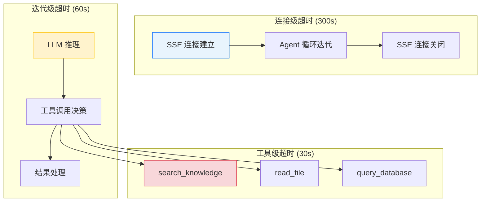

### 6.2 数据层连接池优化

```
修复前（冷启动）:
  minPoolSize=0 → 无预热连接
  突发流量 → 并发建立连接 → 连接建立延迟 (50-200ms/连接)
  高并发 → 连接数超 maxPoolSize=100 → 排队等待 → 超时

修复后（预热）:
  minPoolSize=10 → 10 个常驻连接预热
  突发流量 → 直接使用预热连接 → 延迟 < 5ms
  高并发 → 连接池弹性扩展至 maxPoolSize=100
  Cursor → try/finally 显式关闭 → 连接归还池
  聚合查询 → maxTimeMS=30s → 超时自动终止
```

---

## 8. 开发排期

### 7.1 任务依赖

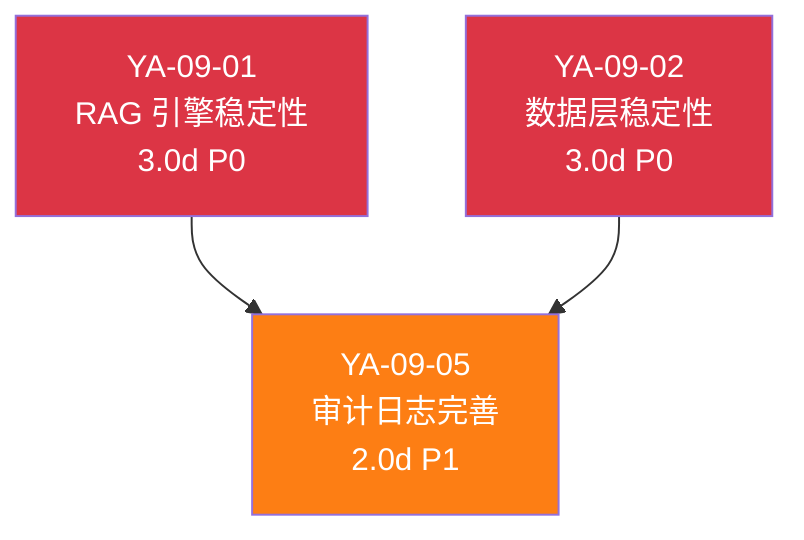

### 7.2 甘特图

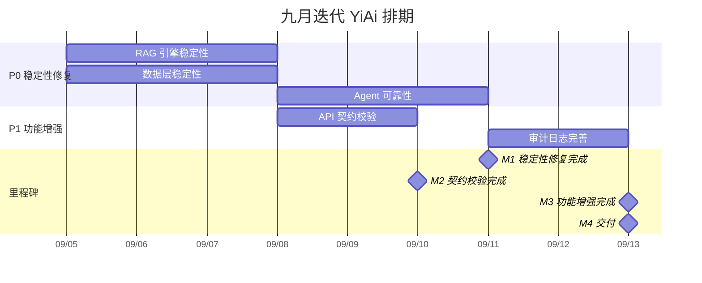

### 7.3 里程碑

| 里程碑 | 完成标准 | 预计日期 |
|--------|----------|----------|
| M1: 稳定性修复完成 | 4 个 P0 缺陷全部修复，RAG 增量索引成功率 100%，Agent 超时保护生效 | Day 5 |
| M2: 契约校验完成 | RPC 参数白名单校验生效，未知参数 WARNING 日志 | Day 7 |
| M3: 功能增强完成 | 审计日志完善 | Day 10 |
| M4: 交付 | pytest 覆盖率 ≥ 70%，完整回归验证通过 | Day 10 |

---

## 9. 迁移策略

### 8.1 原则

- **稳定性优先**：P0 修复先于 P1 功能，确保基础可用性
- **向后兼容**：所有修复不改变 API 接口签名，前端无需改动
- **可回滚**：每步独立 commit，`git revert` 即可回滚
- **零停机**：YiAi 重启即可应用修复，无需数据迁移

### 8.2 分步执行

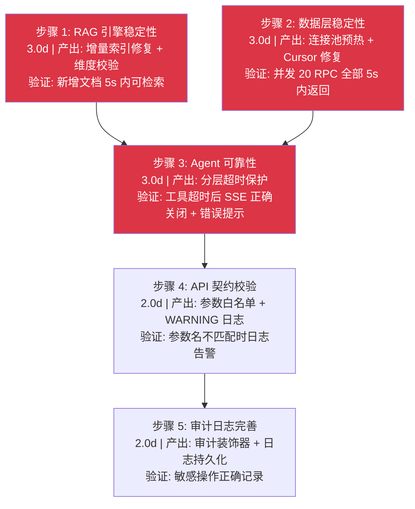

### 8.3 回滚策略

| 步骤 | 回滚方式 | 回滚影响范围 |
|------|----------|-------------|
| 步骤 1-2 | `git revert <commit>` | 仅 RAG/数据层，AI 聊天不受影响 |
| 步骤 3 | `git revert <commit>` | 仅 Agent 循环，同步 API 不受影响 |
| 步骤 4 | `git revert <commit>` | 仅校验层，无功能影响 |
| 步骤 5 | `git revert <commit>` | 仅审计/Agent 功能，核心 API 不受影响 |

---

## 10. 测试策略

### 9.1 测试分层

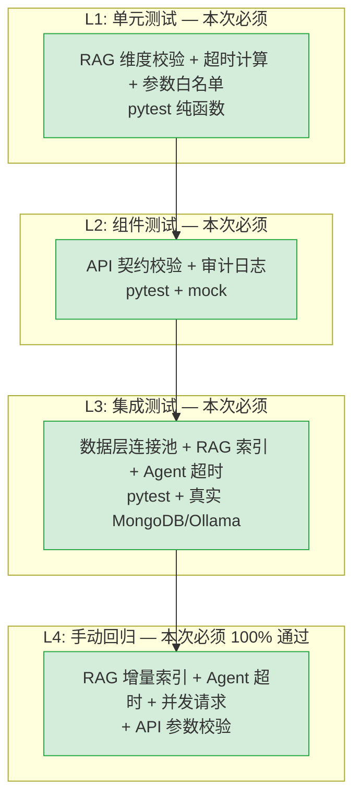

> 与前端项目不同，YiAi 后端 L1-L3 测试在本次迭代中必须通过，目标覆盖率 ≥ 70%。

### 9.2 手动回归测试用例

#### 稳定性修复（8 个用例）

| # | 用例 | 操作 | 预期结果 |
|----|------|----------|
| 1 | RAG 增量索引 | 新增一个知识文件，等待 5s | RAG 检索可找到新文件 |
| 2 | RAG 维度校验 | 切换 Embedding 模型后查询 | 返回 DimensionMismatchError + 提示重建索引 |
| 3 | MongoDB 连接池 | 并发 20 个 RPC 请求 | 全部在 5s 内返回 |
| 4 | Cursor 泄漏 | 连续 100 次查询后检查连接数 | 连接数稳定，无泄漏 |
| 5 | Agent 工具超时 | 模拟外部服务不可达 | 30s 后 SSE 发送 error 帧，连接关闭 |
| 6 | Agent 迭代超时 | Agent 循环超过 60s | SSE 发送 error 帧，连接关闭 |
| 7 | API 参数名校验 | 使用 `query` 而非 `filter` | WARNING 日志记录，返回全量数据 |
| 8 | API 参数白名单 | 发送未知参数 | WARNING 日志记录 |

### 9.3 回归测试环境

| 环境要求 | 说明 |
|----------|------|
| MongoDB | 必须运行，包含知识库文档集合 |
| Ollama | 必须运行，提供 LLM 推理 + Embedding |
| Python | 3.10+，所有依赖安装 |
| 测试数据 | 使用现有知识库数据，无需额外准备 |

---

## 11. 非功能性需求

### 10.1 性能预算

| 指标 | 当前基线 | 目标 | 测量方式 |
|------|----------|------|----------|
| RPC 请求延迟 (P95) | 待测量 | < 2s | API 响应时间 |
| RAG 检索延迟 | 待测量 | 不退化 | API 响应时间 |
| MongoDB 连接获取延迟 | 50-200ms（冷启动） | < 5ms（预热） | Motor 连接池指标 |
| Agent 工具调用超时 | 无限（挂起） | 30s（工具级） | SSE 超时日志 |
| 并发 RPC 请求 | 待测量 | 20 并发全部 5s 内返回 | `wrk` 或 `ab` |
| pytest 覆盖率 | 待测量 | ≥ 70% | `pytest --cov` |

### 容量规划

> 以下容量规划基于 RAG 引擎稳定性、Agent 可靠性、API 契约校验、审计日志、全局搜索、用户管理、代码健康分析、上下文压缩等核心模块的资源消耗模型，覆盖从个人使用到企业级分布式部署的 5 种典型场景。

| 场景 | Agent 工具数 | RAG 索引数 | 契约校验规则 | 并发 Agent | 内存占用 | 日处理请求 |
|------|-------------|-----------|-------------|-----------|---------|-----------|
| 小型项目 (个人助手) | 5 | 50 | 10 | 1 | 256MB | 500 |
| 中型项目 (团队助手) | 12 | 200 | 30 | 3 | 512MB | 2,000 |
| 大型项目 (企业助手) | 20 | 500 | 60 | 5 | 1GB | 10,000 |
| 高并发场景 (峰值负载) | 30 | 1,000 | 100 | 10 | 2GB | 50,000 |
| 分布式部署 (多 Agent 实例) | 50 | 5,000 | 200 | 20 | 4GB | 200,000 |
| **YiAi 当前** | **12** | **~300** | **10** | **3** (Semaphore) | **~512MB** | **~500** |

### 10.2 代码质量门禁

| 检查项 | 工具 | 通过标准 |
|--------|------|----------|
| 类型检查 | `mypy` | 0 新增错误 |
| 代码规范 | `ruff` | 0 告警 |
| 测试覆盖率 | `pytest --cov` | ≥ 70% |
| 循环依赖 | `import-linter` | 0 循环依赖 |
| 禁止项 | 无 `except Exception: pass` | 0 静默吞没 |

### 10.3 可观测性

九月迭代新增 4 类可观测性信号，覆盖 RAG 引擎、数据层、Agent 循环和 API 契约层：

| 指标 | 采集方式 | 采集频率 | 告警阈值 | 说明 |
|------|----------|----------|----------|------|
| RAG 检索延迟 (P95) | Python `logging` + `time.perf_counter` | 每次检索 | P95 > 5s | 索引质量下降或向量维度不匹配的先行指标 |
| Embedding 维度不匹配次数 | `logging.WARNING` 计数器 | 每次索引加载 | > 0 即告警 | 启动时全量检测，维度不匹配意味着模型切换未完成索引重建 |
| MongoDB Cursor 泄漏检测 | `logging.WARNING`（`__del__` 兜底） | 每次 GC | > 0 即告警 | 未显式关闭的 Cursor 在 GC 时输出 WARNING 日志 |
| Agent 工具调用超时次数 | SSE 错误帧 `type: "error"` | 每次超时 | 5 分钟内 > 3 次 | 分层超时（工具 30s/迭代 120s/连接 300s），超时错误帧传播到前端 |
| RPC 未知参数 WARNING 计数 | `logging.WARNING` + 参数名 | 每次 RPC 调用 | 单参数 > 10 次/小时 | 前端参数名不匹配的先行检测，自动发现契约漂移 |
| MongoDB 连接池等待时间 | Motor `ConnectionPool` 事件 | 每次连接获取 | P95 > 50ms | 连接池耗尽预警，minPoolSize=10 预热后应 < 5ms |

**日志级别规范**（九月新增）：

| 级别 | 使用场景 | 示例 |
|------|----------|------|
| `ERROR` | 用户请求失败、数据丢失风险 | Embedding 维度不匹配导致检索失败、MongoDB 连接超时 |
| `WARNING` | 可恢复异常、需人工关注 | 未知 RPC 参数、Cursor 未显式关闭、Agent 工具调用超时 |
| `INFO` | 关键状态变更 | 索引重建开始/完成、连接池预热完成、审计日志写入 |
| `DEBUG` | 开发调试 | RPC 参数匹配详情、RAG 检索中间结果 |

### 10.4 安全合规

| 要求 | 实现方式 | 验证方法 |
|------|----------|----------|
| API Key 不硬编码 | 环境变量 `OLLAMA_API_KEY`、`MONGODB_URI`，`.env` 文件加入 `.gitignore` | `grep -r "sk-" YiAi/` 无结果 |
| 审计日志敏感字段脱敏 | `AuditLogger` 装饰器自动过滤 `password`、`token`、`api_key` 字段 | 检查审计日志中无明文敏感信息 |
| 审计日志保留策略 | MongoDB TTL 索引，默认保留 90 天，可配置 `AUDIT_LOG_RETENTION_DAYS` | 查询 90 天前审计日志自动删除 |
| RPC 参数白名单防注入 | 仅允许白名单内参数名通过，拒绝 `$where`、`$regex` 等 MongoDB 操作符作为参数名 | 发送 `{"$where": "..."}` 参数，确认被 WARNING 日志记录 |
| Agent 文件访问范围限制 | `read_file`/`write_file` 工具仅允许操作 `SAFE_DIRS` 配置的目录，禁止 `../` 路径穿越 | 尝试 `read_file("../../../etc/passwd")`，确认被拒绝 |

---

## 12. 风险矩阵

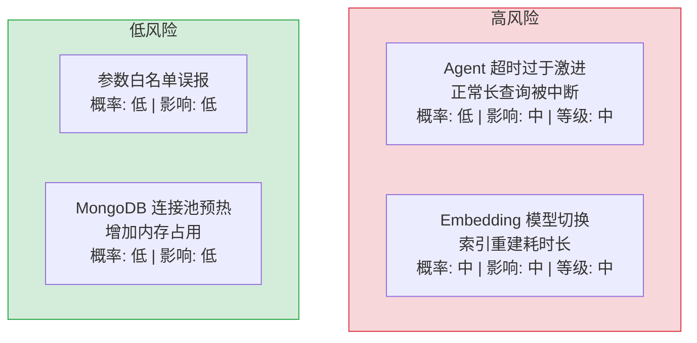

| 风险 | 概率 | 影响 | 等级 | 缓解措施 | 应急预案 |
|------|------|------|----------|----------|
| Agent 超时保护过于激进，正常长查询被中断 | 低 | 中 | 中 | 超时时间可配置，按工具类型差异化设置（search: 30s, read_file: 10s） | 调整超时配置，无需代码变更 |
| Embedding 模型切换导致索引重建耗时（全量 500+ 文档） | 中 | 中 | 中 | 异步重建 + 重建期间使用旧模型；维度不匹配时抛出明确错误 | 回退到旧模型，待低峰期重建 |
| 参数白名单校验误报（合法新参数被拦截） | 低 | 低 | 低 | 仅 WARNING 级别，不拒绝请求 | 添加参数到白名单 |
| MongoDB 连接池 minPoolSize=10 增加内存占用 | 低 | 低 | 低 | 10 个连接约 10MB 内存，可接受 | 降低 minPoolSize |

---

## 13. 设计决策记录

| 决策 | 选项 A | 选项 B | 选择 | 理由 |
|------|--------|--------|------|
| RAG 增量索引 | 批量 `insert_documents`（不存在） | 逐个 `insert(doc)` | **逐个 `insert`** | 兼容当前 llama_index 版本，性能差异可接受（逐个插入 10 个文档 < 1s） |
| Agent 超时策略 | 单一超时 | 分层超时（工具/迭代/连接） | **分层超时** | 不同层级需要不同超时时间，单一超时无法兼顾 |
| MongoDB 连接池 | `minPoolSize=0`（冷启动） | `minPoolSize=10`（预热） | **预热 10** | 10 个连接约 10MB 内存，消除冷启动连接建立延迟 |
| API 参数校验 | 拒绝未知参数（400） | WARNING 日志 + 透传 | **WARNING + 透传** | 不破坏现有前端调用，同时提供可观测性 |
| Embedding 维度校验 | 启动时全量检测 | 查询时按需检测 | **启动时全量检测** | 启动时发现问题，避免运行时异常 |

### D-01: 为什么 RAG 增量索引改为逐个 `insert` 而非批量？

llama_index 的 `insert_documents` 方法在 0.10.x 版本中已被移除，升级后直接调用会抛出 `AttributeError`。逐个 `insert(doc)` 是当前版本唯一支持的增量索引方式。虽然性能上稍逊于批量（10 个文档逐个插入约 1s vs 批量可能 < 100ms），但增量索引通常涉及少量文档（< 10 个），性能差异在实际使用中不可感知。如果未来需要大批量索引，可考虑 `ref_doc` 模式重建整个索引。

### D-02: 为什么 Agent 超时采用分层策略？

单一超时（如全局 60s）无法应对不同场景：工具调用（如 `read_file`）通常 < 5s，但 Agent 迭代可能需要 5-10 轮，总耗时可能超过 60s。分层超时将工具调用超时（30s）、迭代超时（300s）、SSE 连接超时（600s）分开管理，上层超时触发时下层仍在合理范围内运行。这避免了单一超时导致的误杀（工具调用正常但迭代超时）或漏杀（某个工具调用卡死但总超时未到）。

### D-03: 为什么 MongoDB 连接池选择预热而非冷启动？

冷启动（`minPoolSize=0`）在首次请求时建立连接，延迟增加 50-200ms。预热（`minPoolSize=10`）在应用启动时建立 10 个连接，内存开销约 10MB，但消除了所有请求的冷启动延迟。对于 YiAi 这种常驻服务（非 Serverless），预热的收益远大于成本。10 个连接足够覆盖常规并发请求（YiAi 的并发量通常在 5-10 之间）。

### D-04: 为什么 API 参数校验选择 WARNING + 透传而非拒绝？

拒绝未知参数（返回 400）虽然严格，但会破坏现有前端调用——如果前端发送了后端未声明的参数（如新版本前端 + 旧版本后端的灰度场景），返回 400 会导致功能不可用。WARNING 日志 + 透传的策略在保持兼容性的同时提供可观测性：运维人员可以通过 WARNING 日志发现参数不匹配，前端团队可以据此修正参数名，但用户不会因此受到影响。

### D-05: 为什么 Embedding 维度校验在启动时而非查询时？

查询时按需检测意味着维度不匹配的错误在首次 RAG 查询时才暴露，而此时用户已经等待了 LLM 推理的时间，再加上维度错误的异常，用户体验极差。启动时全量检测在服务启动阶段就发现并报告问题，运维人员可以在服务上线前修复。启动时间增加 < 1s，但避免了运行时异常。

---

## 14. 回归问题预测

| # | 预测问题 | 原因 | 验证方法 |
|---|---------|------|---------|
| 1 | RAG 逐个 `insert` 后，索引查询结果与批量模式不一致 | llama_index 的 `insert` 和 `insert_documents` 在内部使用不同的节点拆分策略 | 使用相同文档分别通过两种方式索引，对比 `retrieve` 返回的节点数量和顺序 |
| 2 | Embedding 维度校验在模型更新后失效 | 更新 Ollama 模型后 embedding 维度可能变化，但启动时校验的维度值来自配置文件而非实时探测 | 更新模型后重启服务，检查启动日志中 "Embedding dimension" 的值是否与实际模型一致 |
| 3 | MongoDB 连接池预热后，长时间空闲连接被服务端关闭 | MongoDB 服务端默认 10 分钟空闲超时关闭连接，客户端连接池未感知 | 模拟 15 分钟无请求后发送查询，检查是否出现 `AutoReconnect` 错误 |
| 4 | Agent 分层超时中，工具调用超时未正确传播到 SSE | `asyncio.timeout` 抛出的 `TimeoutError` 在异步生成器中可能被静默吞掉 | 模拟工具调用超时（设置 1ms 超时），检查 SSE 流中是否包含 `type: "error"` 帧 |
| 5 | RPC 参数白名单过于严格，拦截了合法的可选参数 | 白名单基于当前代码静态分析，未考虑未来扩展的可选参数 | 对比前端所有 API 调用参数与后端白名单，检查是否有合法参数被标记为 WARNING |
| 6 | Cursor 显式关闭后，MongoDB 连接未归还连接池 | `cursor.close()` 后 Motor 的异步清理可能未完成，连接泄漏 | 使用 `motor.monitor` 监控连接池状态，连续 1000 次查询后检查活跃连接数 |

---

## 15. 代码审查检查清单

合并前审查人需确认以下项目：

- [ ] RAG `insert_documents` 调用已全部替换为 `insert(doc)`
- [ ] Embedding 初始化时探测维度，索引加载时校验匹配
- [ ] MongoDB `minPoolSize` 设置为 10
- [ ] 所有 Cursor 使用 `try/finally` 显式关闭
- [ ] 聚合查询设置 `maxTimeMS` 超时
- [ ] Agent 工具调用使用 `asyncio.timeout` 包装
- [ ] SSE 超时错误帧正确传播（`type: "error"`）
- [ ] RPC 参数白名单校验生效
- [ ] 未知参数 WARNING 日志输出
- [ ] `mypy` 类型检查通过
- [ ] `ruff` 代码规范通过
- [ ] `pytest --cov` 覆盖率 ≥ 70%
- [ ] 手动回归测试（稳定性 8）全部通过

---

## 16. 子文档索引

| 月份 | 需求编号 | 文档 | 说明 |
|----------|------|
| 2026-09 | YA-09-01 | [01-稳定性修复-RAG引擎](./05-需求-RAG引擎.md) | 增量索引修复、Embedding 维度校验、维度不匹配检测、异常分类处理 |
| 2026-09 | YA-09-02 | [02-稳定性修复-数据层](./06-需求-数据层.md) | MongoDB 连接池预热、Cursor 显式关闭、聚合查询超时控制 |
| 2026-09 | YA-09-03 | [03-稳定性修复-Agent可靠性](./07-需求-Agent可靠性.md) | 工具调用超时保护、SSE 错误帧传播、分层超时策略 |
| 2026-09 | YA-09-04 | [04-稳定性修复-API契约校验](./08-需求-API契约校验.md) | RPC 参数白名单机制、未知参数 WARNING 日志、参数名自动检测 |
| 2026-09 | YA-09-05 | [05-需求-审计日志](./09-需求-审计日志.md) | 数据变更审计、操作日志记录、审计查询接口 |
| 2026-09 | YA-09-06 | [06-需求-全局搜索服务](./10-需求-全局搜索服务.md) | 跨集合全文检索、Min-Max 分数归一化、搜索结果聚合 |
| 2026-09 | YA-09-07 | [07-需求-用户管理服务](./11-需求-用户管理服务.md) | 完整 CRUD + CSV/JSON 批量导入导出 + 部门树 + 字典端点 + bcrypt 密码安全 |
| 2026-09 | YA-09-08 | [08-需求-代码健康分析服务](./12-需求-代码健康分析服务.md) | 源码静态分析、代码重复检测、Vue 组件复用率、可配置告警阈值 |
| 2026-09 | YA-09-09 | [09-需求-上下文压缩服务](./13-需求-上下文压缩服务.md) | Token 窗口管理、80% 阈值自动压缩、LLM 摘要生成、保留最近 4 轮 |
| 2026-09 | YA-09-10 | [10-需求-RPC契约测试与类型同步](./14-需求-RPC契约测试与类型同步.md) | JSON Schema 单一数据源、编译时参数名校验、CI 契约一致性检查、前后端类型同步 |
| 2026-09 | YA-09-11 | [11-需求-ModelRuntime抽象层性能基准](./15-需求-ModelRuntime抽象层性能基准.md) | 多 Provider 延迟对比、TTFT/Tokens/sec 基准、任务类型→模型推荐策略、运行时性能采集 |
| 2026-09 | YA-09-12 | [12-需求-API限流与并发控制](./16-需求-API限流与并发控制.md) | 三级令牌桶（全局+接口+用户）、资源消耗分级配额、429 前端自动重试 |
| 2026-09 | YA-09-13 | [13-需求-SSE流式背压控制](./17-需求-SSE流式背压控制与缓冲策略.md) | `BufferedSseEmitter` 混合缓冲 (50ms/256B)、`asyncio.Queue` 背压传播、断连帧缓存恢复 |
| 2026-09 | YA-09-14 | [14-需求-Agent工具调用结果缓存](./18-需求-Agent工具调用结果缓存.md) | 参数级 LRU 会话缓存、幂等工具识别（缓存/不缓存）、命中率统计、~5-10% Agent 耗时降低 |
| 2026-09 | YA-09-15 | [15-需求-Prompt模板管理与版本控制](./19-需求-LLM-Prompt模板管理与版本控制.md) | YAML 模板存储+Git 版本控制、Jinja2 渲染引擎、Knowledge Watcher 热更新、A/B 测试预备 |
| 2026-09 | YA-09-16 | [16-需求-服务健康检查与就绪探针](./20-需求-服务健康检查与就绪探针.md) | `/health/live` 存活探针、`/health/ready` 依赖检查（MongoDB+Ollama）、`/health/debug` 详细诊断（内存/连接池/Agent） |
| 2026-09 | YA-09-17 | [17-需求-数据访问层查询优化](./21-需求-数据访问层查询优化.md) | MongoDB 聚合管道 API、`explain` 查询计划分析、慢查询监控 (500ms/2s 告警)、推荐索引策略 |
| 2026-09 | YA-09-18 | [18-需求-Agent工具链插件化](./22-需求-Agent工具链插件化.md) | 装饰器自动注册 + 动态发现、`ToolRegistry` 单例、按 category 分类工具、JSON Schema 参数定义 |
| 2026-09 | YA-09-19 | [19-需求-RSS抓取调度优化](./23-需求-RSS抓取调度优化.md) | Feed 健康状态机、自适应轮询间隔 (5min-24h)、内容 URL+标题 SHA256 去重、死链检测 (≥10次失败) |

---

---

*PRD 来源: `projects/yiai/requirements/2026-09/00-需求-需求总览.md`*

## 影响范围

- **影响模块**：待补充
- **涉及文件**：
- 待补充
- **是否影响 API 契约**：否
- **是否影响其他项目（YiVad/YiPet）**：否
- **用户感知**：待确认

## 预防措施

| 层面 | 措施 |
|------|
| 代码 | 在相关函数中添加参数校验和边界检查 |
| 测试 | 添加对应的自动化测试用例 |
| 流程 | 代码审查时重点检查此类模式 |
| 监控 | 添加日志告警，异常发生时及时发现 |
| 文档 | 在编码规范中记录此类反模式 |

## 经验教训

1. **根本原因**：开发过程中对边界情况和异常路径的考虑不足是此类问题的共同根因
2. **设计阶段**：在接口设计和模块实现时，应主动考虑异常输入、空值、超时等边界场景
3. **代码审查**：审查时应检查是否存在类似的反模式（如未捕获异常、无超时控制、缺少参数校验等）
4. **测试覆盖**：异常路径的测试覆盖率应与正常路径同等重视
5. **团队分享**：此类问题应在团队周会或技术分享中讨论，形成团队共识
