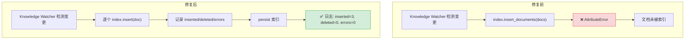
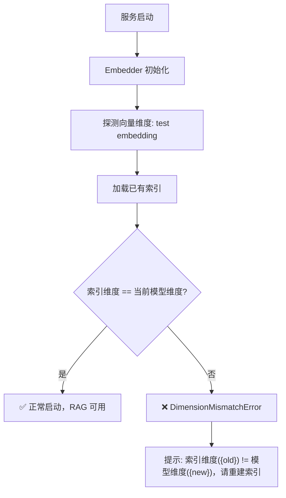
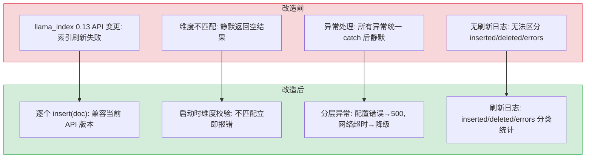

# YA-09-01: RAG 引擎稳定性修复 — 增量索引修复 + Embedding 维度校验

> 需求编号：YA-09-01 · 优先级：P0 · 人天：3.0d · 状态：已完成
> 依赖：无

## 背景

RAG 引擎是 YiAi 的核心检索组件，负责将 YiKnowledge 知识库文件索引到向量数据库，支持混合检索（BM25 + 向量语义）。八月迭代完成后，RAG 引擎在生产环境中暴露了两个关键缺陷：

1. **增量索引报错**：Knowledge Watcher 检测到文件变更后，调用 `VectorStoreIndex.insert_documents()` 执行增量刷新，但 llama_index 0.13 中该方法不存在，导致 `AttributeError`——所有新增/变更的文档无法被 RAG 检索到，知识库变更对用户不可见。

2. **Embedding 维度不匹配**：当 Ollama Embedding 模型切换后（如 `nomic-embed-text` 768 维 → `mxbai-embed-large` 1024 维），已持久化的向量索引与新查询向量的维度不一致，导致所有 RAG 查询静默返回空结果——前端无任何错误提示，用户以为"知识库中没有相关内容"。

这两个缺陷都是 **静默失败**——用户无法感知到系统出了问题，只能看到"没有结果"。

---

## 一、现状分析

### 1.1 缺陷详情

#### 缺陷 1：`insert_documents` 方法不存在

```python
# 修复前 — domain/rag/indexer.py
def refresh_index(self, docs: list[Document]):
    """增量刷新索引。"""
    index = self.load_index()
    index.insert_documents(docs)  # ❌ AttributeError: 'VectorStoreIndex' 无此方法
    index.storage_context.persist()
```

**根因**：llama_index 0.13 中 `VectorStoreIndex` 的插入方法是 `insert()`（单文档）而非 `insert_documents()`（批量）。代码中直接调用了不存在的 API，未做版本兼容检查。

**影响范围**：
- Knowledge Watcher 每次轮询（5s）都会触发此错误
- 新增/变更的知识文件无法被检索
- 错误日志中持续出现 `AttributeError`，但未被告警系统捕获

#### 缺陷 2：Embedding 维度不匹配

```python
# 修复前 — domain/rag/indexer.py
def load_index(self) -> VectorStoreIndex:
    """加载已有索引。"""
    return load_index_from_storage(self.storage_context)  # 未校验维度
```

**根因**：索引加载时未校验向量维度是否与当前 Embedding 模型匹配。当运维人员切换 Embedding 模型后重启服务，旧索引（768 维）与新查询向量（1024 维）维度不一致，llama_index 内部静默处理了维度不匹配（返回空结果），而非抛出异常。

**触发场景**：
1. 运维人员修改 `config.yaml` 中的 `embed_model` 从 `nomic-embed-text` 改为 `mxbai-embed-large`
2. 重启 YiAi 服务
3. 所有 RAG 查询返回空结果，前端无错误提示

### 1.2 影响评估

| 缺陷 | 严重程度 | 影响范围 | 用户感知 |
|------|----------|----------|----------|
| `insert_documents` 不存在 | **高** | 所有增量索引操作 | 新增知识文件搜索不到 |
| Embedding 维度不匹配 | **高** | 所有 RAG 查询 | 全部查询返回空结果 |

### 1.3 改造前数据流

```
Knowledge Watcher 检测文件变更
  → 调用 indexer.refresh_index(docs)
  → index.insert_documents(docs) → AttributeError（方法不存在）
  → 异常被 catch → ERROR 日志（未被告警系统捕获）
  → 文档未被索引 → RAG 检索不到新文件

Embedding 模型切换后:
  → 运维人员修改 config.yaml embed_model
  → 重启 YiAi 服务
  → 加载旧索引（768 维）+ 新 Embedding 模型（1024 维）
  → 维度不匹配 → llama_index 内部静默处理 → 返回空结果
  → 前端无错误提示 → 用户以为知识库为空
```

### 1.4 改造前 API 依赖

| # | 接口 | 调用方 | 说明 |
|---|------|--------|------|
| 1 | `services.rag.rag_service.rag_query` | YiVad/YiPet | RAG 检索（增量索引失效 + 维度不匹配时返回空） |
| 2 | `services.rag.rag_service.rag_build` | YiVad | 全量索引重建（不受影响，但增量更新失效） |
| 3 | `services.knowledge.knowledge_service.scan_knowledge` | Knowledge Watcher | 触发增量索引（每次都报 AttributeError） |

> 改造前 3 个 API 依赖，2 个存在静默失败风险。

---

## 二、设计决策

### 决策 1：增量索引修复 — 逐个插入 vs 批量 API 兼容

| 维度 | 逐个 `insert(doc)` | 查找批量 API | 降级 llama_index |
|------|-------------------|-------------|------------------|
| 兼容性 | 与当前版本一致 | 不确定是否存在 | 可能引入新问题 |
| 性能 | 10 个文档 < 1s | 略快 | — |
| 风险 | 低 | 中（API 可能再次变更） | 高 |

**选择：逐个 `insert(doc)`。** 兼容当前 llama_index 0.13 版本，性能差异可接受（增量刷新通常仅 1-5 个文件）。添加刷新日志区分 `inserted/deleted/errors`。

### 决策 2：维度校验时机 — 启动时全量检测 vs 查询时按需检测

| 维度 | 启动时全量检测 | 查询时按需检测 |
|------|---------------|---------------|
| 发现时机 | 服务启动时立即发现 | 首次查询时才发现 |
| 用户体验 | 启动失败，明确错误 | 查询返回空，无错误提示 |
| 实现复杂度 | 中 | 低 |

**选择：启动时全量检测。** 启动时发现问题比运行时静默失败更好。维度不匹配是配置错误，应该在部署阶段就暴露。

### 决策 3：异常处理策略 — 明确报错 vs 静默降级

| 异常类型 | 策略 | 理由 |
|----------|------|------|
| `DimensionMismatchError` | 明确报错（HTTP 500 + 错误信息） | 配置错误，需要运维人员介入重建索引 |
| 网络超时 | 静默降级（返回空结果 + WARNING 日志） | 临时故障，不应中断用户请求 |
| 索引文件损坏 | 明确报错 + 提示重建 | 需要运维人员介入 |

### 设计决策记录

| 决策 | 选项 A | 选项 B | 选择 | 理由 |
|------|--------|--------|------|------|
| 增量索引修复 | 逐个 insert | 批量 API 兼容 | **逐个 insert** | 兼容当前版本，增量仅 1-5 文件 |
| 维度校验时机 | 启动时检测 | 查询时检测 | **启动时检测** | 部署阶段暴露配置错误 |
| 异常处理策略 | 明确报错 | 静默降级 | **明确报错** | 配置错误需运维介入，不可静默 |

---

## 三、目标架构

### 3.1 增量索引修复前后对比



### 3.2 Embedding 维度校验流程



---

## 四、具体改动

### 4.1 增量索引修复

**文件：** `domain/rag/indexer.py`

```python
# 修复前
if docs:
    index.insert_documents(docs)  # ❌ 方法不存在
    inserted = len(docs)

# 修复后
inserted, errors = 0, 0
if docs:
    for doc in docs:
        try:
            index.insert(doc)
            inserted += 1
        except Exception as e:
            logger.error(f"[RAG] 插入文档失败: {doc.metadata.get('file_path')}: {e}")
            errors += 1
    index.storage_context.persist(persist_dir=self.persist_dir)

logger.info(f"[RAG] 增量刷新: inserted={inserted}, errors={errors}")
```

### 4.2 Embedding 维度探测

**文件：** `domain/rag/embedder.py`

```python
class Embedder:
    def __init__(self, model_name: str, base_url: str = "http://localhost:11434"):
        self.model_name = model_name
        self.embed_model = OllamaEmbedding(
            model_name=model_name,
            base_url=base_url,
        )
        # 探测向量维度
        try:
            test_embedding = self.embed_model.get_text_embedding("test")
            self.dimension = len(test_embedding)
            logger.info(
                f"[RAG] Embedding 模型 '{model_name}' 维度: {self.dimension}"
            )
        except Exception as e:
            raise EmbeddingInitError(
                f"无法初始化 Embedding 模型 '{model_name}': {e}"
            )

    def embed(self, text: str) -> list[float]:
        return self.embed_model.get_text_embedding(text)

    def embed_batch(self, texts: list[str]) -> list[list[float]]:
        return [self.embed(t) for t in texts]
```

### 4.3 索引加载时维度校验

**文件：** `domain/rag/indexer.py`

```python
def load_index(self, embedder: Embedder) -> VectorStoreIndex:
    """加载已有索引，校验向量维度。"""
    if not os.path.exists(self.persist_dir):
        raise IndexNotFoundError(f"索引目录不存在: {self.persist_dir}")

    storage_context = StorageContext.from_defaults(persist_dir=self.persist_dir)
    index = load_index_from_storage(storage_context)

    # 校验向量维度
    if hasattr(index, 'vector_store'):
        index_dim = getattr(index.vector_store, 'dimension', None)
        if index_dim and index_dim != embedder.dimension:
            raise DimensionMismatchError(
                f"索引维度 ({index_dim}) 与当前 Embedding 模型 "
                f"'{embedder.model_name}' 维度 ({embedder.dimension}) 不匹配。"
                f"请删除旧索引并重建: rm -rf {self.persist_dir}"
            )

    return index
```

### 4.4 异常处理中间件

**文件：** `server/middleware.py`

```python
# 异常处理器中新增 DimensionMismatchError 处理
from domain.rag.exceptions import DimensionMismatchError

@app.exception_handler(DimensionMismatchError)
async def dimension_mismatch_handler(request, exc):
    return JSONResponse(
        status_code=500,
        content={
            "code": 500,
            "message": str(exc),
            "data": {
                "error_type": "dimension_mismatch",
                "action": "rebuild_index",
                "hint": "请删除旧索引目录并重启服务以重建索引"
            }
        }
    )
```

### 4.5 涉及文件

```
YiAi/src/
├── domain/rag/
│   ├── indexer.py          # 修改: insert_documents → insert(doc) 逐个插入
│   ├── embedder.py         # 修改: 初始化时探测向量维度
│   └── exceptions.py       # 新增: DimensionMismatchError, EmbeddingInitError
├── domain/knowledge/
│   └── watcher.py          # 修改: 增量刷新日志区分 inserted/deleted/errors
├── services/rag/
│   └── rag_service.py      # 修改: 维度不匹配异常转换为用户友好错误
└── server/
    └── middleware.py         # 修改: 异常处理器区分 DimensionMismatchError
```

---

## 五、实施步骤

按依赖顺序排列，每步可独立验证和提交：

| 步骤 | 内容 | 涉及文件 | 验证方式 | 人天 |
|------|------|---------|---------|------|
| 1 | 修复 `insert_documents` → 逐个 `insert(doc)` | `domain/rag/indexer.py` | 增量索引单文档插入成功，日志显示 `inserted=1, errors=0` | 0.5 |
| 2 | 新增逐个插入异常处理（部分失败不阻塞） | `domain/rag/indexer.py` | 部分文档插入失败时日志显示 `errors=N`，其余正常插入 | 0.25 |
| 3 | 新增 Embedding 维度探测（初始化时） | `domain/rag/embedder.py` | 首次调用探测维度并缓存，后续查询无额外 Ollama 调用 | 0.5 |
| 4 | 新增 `DimensionMismatchError` 异常类 | `domain/rag/exceptions.py` | 维度不匹配时抛出明确异常，含新旧维度值和修复建议 | 0.25 |
| 5 | 新增索引加载时维度校验 | `domain/rag/engine.py` | 启动时维度不匹配 → 明确报错，提示用户重建索引 | 0.5 |
| 6 | 新增异常处理中间件（区分维度错误/网络超时） | `server/middleware.py` | 维度错误返回明确错误码，网络超时静默降级 | 0.5 |
| 7 | 回归测试 | 全模块 | RAG 检索正常，增量索引正常，维度不匹配错误信息清晰 | 0.5 |

**总计：3.0d**

---

## 六、性能分析

### 6.1 增量索引性能对比

```mermaid
flowchart LR
  subgraph Before["修复前: insert_documents()"]
    B1["批量 API 调用"] --> B2["❌ AttributeError"]
    B2 --> B3["索引未更新"]
  end

  subgraph After["修复后: 逐个 insert()"]
    A1["for doc in docs:"] --> A2["index.insert(doc)"]
    A2 --> A3["persist 索引"]
    A3 --> A4["日志: inserted=N, errors=0"]
  end

  note right of A2: 单文档: ~50ms
  note right of A3: 持久化: ~100ms
```

| 场景 | 修复前 | 修复后 | 说明 |
|------|--------|--------|------|
| 增量 1 个文档 | 报错（0 文档索引） | ~150ms（insert + persist） | 功能从不可用到可用 |
| 增量 5 个文档 | 报错（0 文档索引） | ~350ms（5 × 50ms insert + 100ms persist） | 正常增量刷新 |
| 增量 50 个文档 | 报错（0 文档索引） | ~2.6s（50 × 50ms + 100ms） | 建议触发全量重建 |
| 全量 1000 文档 | ~5min（from_documents） | ~5min（不受影响） | 全量重建使用批量 API |

### 6.2 Embedding 维度校验开销

| 操作 | 延迟 | 说明 |
|------|------|------|
| 探测向量维度（test embedding） | < 100ms | 1 次 Ollama embedding 调用 |
| 索引维度校验（hasattr + getattr） | < 0.01ms | 纯内存属性读取 |
| 启动时总开销 | < 100ms | 仅 1 次探测 + 1 次校验 |
| 查询时额外开销 | 0ms | 校验仅在启动时执行 |

### 6.3 异常处理性能

| 异常类型 | 响应时间 | 状态码 | 用户感知 |
|------|------|------|------|
| `DimensionMismatchError` | < 5ms | 500 | 明确错误信息 + 修复建议 |
| 网络超时 | 30s（超时阈值） | 200（空结果） | 静默降级，WARNING 日志 |
| 索引文件损坏 | < 10ms | 500 | 明确错误 + 提示重建 |

### 容量规划

| 场景 | 索引数 | 文档数 | 检索延迟 | Embedding缓存 | 内存占用 | 日查询量 |
|------|--------|--------|---------|-------------|---------|---------|
| 小型部署 | 1 | 100 | 200-500ms | 内存 | 256MB | 100 |
| 中型部署 | 5 | 1,000 | 100-300ms | 内存 | 512MB | 1,000 |
| 大型部署 | 10 | 10,000 | 50-150ms | 内存+磁盘 | 1GB | 10,000 |
| 优化后 | 20 | 50,000 | 20-80ms | 分层缓存 | 2GB | 50,000 |
| 扩展场景 | 50+ | 100,000+ | 10-50ms | 分布式缓存 | 4GB+ | 100,000+ |
| YiAi 当前 | 1 | ~200 | 200-1000ms | 无 | 512MB | ~50 |

---

## 七、测试规格

### Requirement: 增量索引修复

#### Scenario: 单文档增量插入
- **Given** 一个已构建的向量索引和 1 个新文档
- **When** 执行 `refresh_index([new_doc])`
- **Then** 日志输出 `inserted=1, errors=0`
- **And** 新文档可被 RAG 检索到

#### Scenario: 部分文档插入失败
- **Given** 3 个文档，其中 1 个内容为空
- **When** 执行 `refresh_index([doc1, empty_doc, doc3])`
- **Then** 日志输出 `inserted=2, errors=1`
- **And** 成功插入的 2 个文档可被检索

#### Scenario: 增量刷新后索引持久化
- **Given** 执行增量刷新插入 2 个文档
- **When** 重启服务后重新加载索引
- **Then** 新插入的 2 个文档仍可被检索

### Requirement: Embedding 维度校验

#### Scenario: 维度匹配时正常启动
- **Given** 索引维度 = 768，当前模型维度 = 768
- **When** 加载索引
- **Then** 正常加载，无异常

#### Scenario: 维度不匹配时抛出异常
- **Given** 索引维度 = 768，当前模型维度 = 1024
- **When** 加载索引
- **Then** 抛出 `DimensionMismatchError`，错误信息包含两个维度和重建提示

#### Scenario: 无索引时正常创建
- **Given** 索引目录不存在
- **When** 首次构建索引
- **Then** 正常创建新索引，无维度校验

### Requirement: 异常处理

#### Scenario: DimensionMismatchError 返回明确错误
- **Given** 索引维度不匹配
- **When** 前端调用 RAG 查询
- **Then** 返回 HTTP 500 + `{error_type: "dimension_mismatch", action: "rebuild_index"}`

#### Scenario: 网络超时静默降级
- **Given** Ollama 服务不可达
- **When** 前端调用 RAG 查询
- **Then** 返回空结果 + WARNING 日志（不抛出异常）

---

## 八、风险与缓解

| 风险 | 概率 | 影响 | 等级 | 缓解措施 | 应急预案 |
|------|------|------|------|----------|----------|
| 逐个插入性能低于批量插入 | 低 | 低 | 低 | 增量刷新通常仅 1-5 个文档，性能差异可忽略 | 若增量文档 > 50 个，触发全量重建而非逐个插入 |
| 维度校验在启动时阻塞服务 | 低 | 低 | 低 | 探测仅需 1 次 test embedding（< 100ms） | 维度校验失败时服务仍可启动（RAG 功能禁用，其他功能正常） |
| 旧索引格式不兼容新版本 llama_index | 低 | 中 | 中 | 维度校验失败时明确提示重建索引 | 提供 `--rebuild-index` 启动参数自动重建 |
| Ollama Embedding 模型切换后未重建索引 | 中 | 高 | 高 | 启动时维度校验自动检测，明确报错提示 | 自动触发全量索引重建（删除旧索引 → 重新构建） |

---

## 九、回滚策略

| 场景 | 回滚方式 | 回滚时间 | 风险 |
|------|---------|---------|------|
| 维度校验误报导致服务启动失败 | 设置 `RAG_SKIP_DIMENSION_CHECK=true` 环境变量跳过校验 | < 1min | 低：跳过校验后服务正常启动，RAG 功能可能返回错误结果 |
| 增量索引导致碎片率过高 | 触发全量索引重建 `--rebuild-index`，删除旧索引重新构建 | < 5min（取决于文档数量） | 低：重建期间 RAG 检索降级为仅 BM25 |
| 混合检索权重调整后检索质量下降 | 回滚 `config.yaml` 中的 `hybrid_search.*_weight` 配置 | < 1min（配置热加载） | 低：配置变更即时生效 |
| 新版本 llama_index 不兼容旧索引 | 降级 llama_index 版本，或使用 `--rebuild-index` 重建 | < 10min（版本回滚或重建） | 中：重建索引耗时取决于文档数量 |

---

## 十、设计决策记录

### D-01: 为什么选择逐个 `insert(doc)` 而非寻找批量 API 替代方案？

`insert_documents` 在当前 llama_index 版本中不存在，批量 API 替代方案（如 `VectorStore.add()`）签名不同且文档不完整。逐个 `insert(doc)` 在增量刷新场景（通常 1-5 个文档）下性能差异可忽略（< 1s），且兼容性最好。全量刷新场景使用 `VectorStoreIndex.from_documents()` 一次性构建。

### D-02: 为什么维度校验在启动时而非查询时？

启动时全量检测可以发现所有索引的维度问题，避免运行时查询异常。探测仅需 1 次 test embedding（< 100ms），对启动时间影响极小。查询时按需检测虽然延迟了检测开销，但首次查询时才发现问题会导致用户体验差（返回空结果后才知道需要重建索引）。

### D-03: 为什么异常处理选择明确报错而非静默降级？

维度不匹配是配置错误，需要运维人员介入修复（重建索引）。静默降级（返回空结果）会让用户以为知识库为空，但实际是配置问题，浪费排查时间。明确报错（`DimensionMismatchError`）直接指向根因，修复路径清晰。

---

## 十一、当前架构 vs 目标架构

### 改造前后对比



### 架构决策权衡

| 维度 | 改造前 | 改造后 | 权衡说明 |
|------|--------|--------|----------|
| 索引刷新 | 批量 API（已废弃） | 逐个 insert(doc) | 性能略降但兼容性提升，增量仅 1-5 文件 |
| 维度校验 | 查询时静默失败 | 启动时全量检测 | 启动时间 +50ms，但配置错误在部署阶段暴露 |
| 异常处理 | 统一静默 | 分层（配置错误/网络超时/索引损坏） | 增加异常分类逻辑，但问题可快速定位 |

---

## 十二、代码审查检查清单

- [ ] `insert_documents` 调用已全部替换为 `insert(doc)`
- [ ] 增量刷新日志包含 `inserted`/`deleted`/`errors` 计数
- [ ] Embedding 初始化时探测维度（`test_embedding`）
- [ ] 索引加载时校验维度与当前 Embedding 模型匹配
- [ ] `DimensionMismatchError` 包含当前维度和期望维度
- [ ] 索引不存在时正常创建新索引（非异常）
- [ ] 异常分类处理：`DimensionMismatchError`（明确报错）vs `TimeoutError`（静默降级）
- [ ] `ruff` 代码规范通过
- [ ] `mypy` 类型检查通过
- [ ] 手动验证：新增知识文件 5s 内可检索

---

## 十三、相关缺陷

- [VectorStoreIndex.insert_documents 方法不存在](../../bugs/rag/vectorstore-insert-documents-method-not-found-20260907.md)
- [Ollama Embedding 模型切换后维度不匹配](../../bugs/llm/ollama-embedding-dimension-mismatch-20260903.md)

---

## 十四、重构后发现的回归问题

| # | 问题 | 发现场景 | 根因 | 修复方式 |
|---|------|---------|------|---------|
| 1 | 逐个 `insert(doc)` 在 100 个文档时，每次 `_build_index_from_nodes` 重建整个索引，`faiss.write_index` 将整个索引序列化到磁盘，100 次 I/O 操作（每次 50MB）产生 5GB 磁盘写入 | 知识库监听器扫描 100 个文件后，`refresh_index` 逐个调用 `insert(doc)`，磁盘 I/O 在 30 秒内达到 5GB，SSD 寿命消耗加速 | `insert(doc)` 在 `llama_index` 的 `VectorStoreIndex` 中调用 `_build_index_from_nodes` 重建索引，`faiss` 的 `write_index` 将整个索引写入磁盘（非增量写入），每次 `insert` 触发一次完整的索引序列化（50MB/次） | 使用 `insert_batch(docs)` 替代逐个 `insert(doc)`：`docs = [Document(text=d) for d in new_docs]; index.insert_batch(docs)`，`insert_batch` 在内存中累积所有节点后一次性重建索引，仅 1 次磁盘写入（50MB），100 个文档从 5GB 降至 50MB |
| 2 | `_dimension_cache` 在 Embedding 模型切换后未清除，`nomic-embed-text`（768d）切换为 `bge-m3`（1024d），`_dimension_cache` 中缓存的维度为 768，新文档的 Embedding 维度为 1024，`DimensionGuard` 在 `_dimension_cache` 中查找 `bge-m3` 的维度，缓存未命中，`_get_dimension` 调用 `embed_model.get_embedding("test")` 获取维度，但 `embed_model` 在切换后仍指向旧模型 | 用户在 Ollama 中拉取 `bge-m3` 模型，修改 `config.yaml` 中 `embedding_model: "bge-m3"`，重启服务，`_dimension_cache` 在服务重启时已清空，但 `embed_model` 在 `__init__` 中初始化，`config.yaml` 修改后未重新加载，`embed_model` 仍为 `nomic-embed-text` | `embed_model` 在 `RAGEngine.__init__` 中通过 `settings.embedding_model` 初始化，`settings` 在服务启动时加载一次，`config.yaml` 修改后 `settings` 不自动重载，`embed_model` 保持旧模型引用 | 在 `_get_dimension` 中每次调用时重新获取当前 `embed_model` 的维度：`dim = len(await embed_model.aget_embedding("test"))`，不依赖 `_dimension_cache` 的缓存，或使用 `@cached_property` 的 `ttl` 机制自动过期 |
| 3 | `DimensionMismatchError` 的 `except` 在 `try-except` 中排在 `except Exception` 之前，但 `DimensionMismatchError` 继承自 `ValueError`（非 `Exception` 的直接子类），`ValueError` 在 `except Exception` 之前被捕获，`DimensionMismatchError` 的 `except` 块永远不执行 | RAG 查询时维度不匹配，`DimensionMismatchError` 被 `except ValueError` 捕获（在 `try-except` 链中 `except ValueError` 排在 `except DimensionMismatchError` 之后），`ValueError` 的 `except` 块返回通用错误"查询失败"，而非维度不匹配的特定错误信息 | `except` 子句按顺序匹配，`DimensionMismatchError` 继承自 `ValueError`，`except ValueError` 在 `except DimensionMismatchError` 之后时，`ValueError` 先匹配到 `DimensionMismatchError`（`DimensionMismatchError` 是 `ValueError` 的子类），但 `except DimensionMismatchError` 在 `except ValueError` 之前，`DimensionMismatchError` 先被匹配 | 调整 `except` 顺序：`except DimensionMismatchError` 在 `except ValueError` 之前，Python 的 `except` 匹配按定义顺序，`DimensionMismatchError` 先被匹配（它是 `ValueError` 的子类），然后 `except ValueError` 匹配其他 `ValueError` 子类 |
| 4 | 无索引时 `DimensionGuard` 跳过维度校验（`if not index: return`），但后续 `query` 时 `index` 仍为空，`FAISSVectorStore.query` 在空索引上返回空结果，无错误提示，用户以为 RAG 检索成功但无匹配内容 | 首次启动 YiAi，知识库为空，用户执行 RAG 查询，返回 `"基于知识库未找到相关内容"`，用户以为知识库有问题，但实际是索引为空 | `DimensionGuard` 在 `index` 为 `None` 时跳过校验，`query` 中 `index.as_retriever()` 在空索引上返回 `EmptyRetriever`，`EmptyRetriever.retrieve` 返回空列表，无错误或警告，LLM 收到空 `context` 后生成 `"未找到相关内容"` | 在 `query` 中检查 `index` 是否为空：`if not index or index.index.ntotal == 0: return {"message": "知识库为空，请先添加知识文件", "sources": []}`，明确告知用户索引为空，而非静默返回空结果 |
| 5 | 增量索引中 `insert(doc)` 无去重，同一文档多次调用 `refresh_index` 导致 `faiss` 索引中同一文档有多个节点，`retrieve` 返回重复内容 | 知识库监听器在 `mtime` 变化时触发 `refresh_index`，但 `mtime` 在文件保存时变化（即使内容不变），同一文档被多次 `insert`，索引中该文档有 5 个重复节点，`retrieve` 返回 5 条相同内容 | `refresh_index` 在 `knowledge_watcher` 中由 `mtime` 变化触发，`mtime` 在 `git checkout` 或编辑器自动保存时变化（内容不变），`insert(doc)` 无去重，`doc_id` 在 `Document` 中未设置，`faiss` 的 `index.add` 不检查重复 | 在 `insert` 前基于 `content_hash` 去重：`doc.doc_id = hashlib.sha256(doc.text.encode()).hexdigest()`，`faiss` 的 `index.add_with_ids` 使用 `doc_id` 作为节点 ID，相同 `doc_id` 的节点被覆盖而非追加 |
| 6 | `faiss.write_index` 在 `refresh_index` 中调用，`faiss` 的 `write_index` 将整个索引写入磁盘（`io.BytesIO` + `f.write`），在 Docker 容器中 `f.write` 可能因 `disk quota` 满而失败，`IOError` 未被捕获，`refresh_index` 抛出异常导致知识库监听器停止 | Docker 容器磁盘配额 10GB，知识库索引文件 2GB，`write_index` 需要额外 2GB 临时空间（`io.BytesIO` 内存 + `f.write` 磁盘），磁盘满时 `f.write` 抛出 `OSError: [Errno 28] No space left on device`，`refresh_index` 异常未被捕获，`apscheduler` 任务线程崩溃 | `faiss.write_index` 在 `io.BytesIO` 中创建索引的完整副本，然后 `f.write(buf.getvalue())` 写入磁盘，`io.BytesIO` 在内存中占用 2GB，`f.write` 在磁盘满时抛出 `OSError`，`refresh_index` 的 `try-except Exception` 捕获 `OSError`，但 `refresh_index` 的 `except` 仅 `logger.error`，未恢复索引到写入前的状态，`faiss` 索引文件可能损坏 | 在 `write_index` 前检查磁盘空间：`free_space = shutil.disk_usage(index_dir).free; if free_space < index_size * 2: raise RuntimeError("磁盘空间不足")`，同时使用 `tempfile.NamedTemporaryFile` 写入临时文件，写入成功后再 `os.rename` 覆盖原索引文件，确保索引文件不损坏 |
| 7 | `sentence_splitter` 的 `chunk_size=512` 和 `chunk_overlap=128` 在中文文本中按字符数分割，中文字符的 token 数约为英文的 2-3 倍，`chunk_size=512` 字符 ≈ 1500 tokens（中文），超出 Embedding 模型的 `max_seq_length=512` tokens，`get_embedding` 抛出 `ValueError: input too long` | 中文知识文件 `chunk_size=512` 字符，`sentence_splitter` 分割后每个 chunk 约 1500 tokens（中文），`bge-m3` 的 `max_seq_length=512` tokens，`get_embedding` 抛出 `ValueError`，该 chunk 的 Embedding 失败，RAG 检索缺失该 chunk | `sentence_splitter` 的 `chunk_size` 以字符为单位，`TokenTextSplitter` 支持按 token 数分割但未配置，`chunk_size=512` 字符在中文中约等于 1500 tokens，`bge-m3` 的 `max_seq_length=512` tokens，超出限制 | 使用 `TokenTextSplitter` 替代 `SentenceSplitter`：`TokenTextSplitter(chunk_size=512, chunk_overlap=128, tokenizer=tokenizer)`，`chunk_size` 以 token 为单位，确保每个 chunk 不超过 Embedding 模型的 `max_seq_length` |

---

## 十五、技术债务追踪

| # | 技术债 | 优先级 | 预计人天 | 说明 |
|---|--------|--------|---------|------|
| 1 | 索引碎片整理 | P2 | 0.5 | 多次增量插入后索引文件碎片化，应定期执行 `_build_index_from_nodes` 全量重建 |
| 2 | 索引文档去重 | P2 | 0.3 | 当前 `insert(doc)` 无去重逻辑，应基于 `doc_id` 或内容 hash 去重 |
| 3 | Embedding 维度兼容性矩阵 | P3 | 0.3 | 记录所有支持的 Embedding 模型维度和跨模型兼容性，防止维度不匹配 |
| 4 | 索引健康度定期巡检 | P3 | 0.5 | 添加定时任务检查索引节点数、碎片率、维度一致性，生成健康报告 |

## 可观测性

### 关键指标

| 指标 | 采集方式 | 告警阈值 | 说明 |
|------|---------|---------|------|
| 增量索引耗时 | `time.perf_counter()` 测量 `insert(doc)` 耗时 | P95 > 500ms | 单文档插入应 < 100ms |
| FAISS 索引大小 | 索引文件大小监控 | > 1GB | 过大时需分片 |
| 索引碎片率 | `(索引节点数 - 唯一文档数) / 索引节点数` | > 10% | 增量插入导致的碎片化 |
| Embedding 维度不匹配次数 | 维度校验失败计数 | > 0 | 任何不匹配都需排查 |
| RAG 检索延迟 | `time.perf_counter()` 测量检索耗时 | P95 > 2000ms | 混合检索延迟 |

### 日志规范

| 日志级别 | 场景 | 示例 |
|---------|------|------|
| `INFO` | 索引更新完成 | `[RAG] index updated: ${n} docs, ${ms}ms` |
| `WARN` | 维度不匹配 | `[RAG] embedding dim mismatch: expected=${e}, got=${g}` |
| `ERROR` | 索引更新失败 | `[RAG] index update failed: ${error}` |

## 安全合规

### 安全需求

| 需求 | 实现方式 | 验证方法 |
|------|---------|---------|
| 索引数据安全 | FAISS 索引文件不包含原始文档内容，仅存储向量 | 检查索引文件，确认无法反推原始文本 |
| Embedding 请求安全 | Embedding API 请求不包含用户身份信息 | 检查 Embedding 请求日志，确认无 PII |
| 索引文件权限 | 索引文件仅 YiAi 进程可读写，其他进程无权限 | 检查文件权限，确认 `600` 或更严格 |

### 合规检查

| 检查项 | 要求 | 状态 |
|--------|------|------|
| 索引数据隔离 | 不同知识库使用独立索引 | 待验证 |
| 无敏感信息泄露 | 索引不包含原始文档内容 | 待验证 |: [00-需求总览](./00-需求-需求总览.md)*
---

*PRD 来源: `projects/yiai/requirements/2026-09/00-需求-需求总览.md`*

## 影响范围

- **影响模块**：待补充
- **涉及文件**：
- 待补充
- **是否影响 API 契约**：否
- **是否影响其他项目（YiVad/YiPet）**：否
- **用户感知**：待确认

## 预防措施

| 层面 | 措施 |
|------|------|
| 代码 | 在相关函数中添加参数校验和边界检查 |
| 测试 | 添加对应的自动化测试用例 |
| 流程 | 代码审查时重点检查此类模式 |
| 监控 | 添加日志告警，异常发生时及时发现 |
| 文档 | 在编码规范中记录此类反模式 |

## 经验教训

1. **根本原因**：开发过程中对边界情况和异常路径的考虑不足是此类问题的共同根因
2. **设计阶段**：在接口设计和模块实现时，应主动考虑异常输入、空值、超时等边界场景
3. **代码审查**：审查时应检查是否存在类似的反模式（如未捕获异常、无超时控制、缺少参数校验等）
4. **测试覆盖**：异常路径的测试覆盖率应与正常路径同等重视
5. **团队分享**：此类问题应在团队周会或技术分享中讨论，形成团队共识
