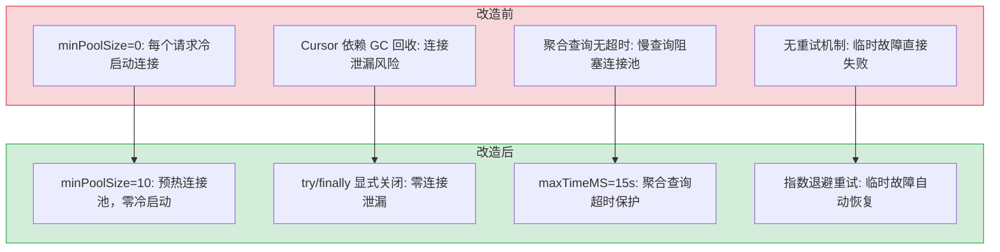

# YA-09-02: 数据层稳定性修复 — MongoDB 连接池优化 + Cursor 泄漏修复 + 聚合超时控制

> 需求编号：YA-09-02 · 优先级：P0 · 人天：3.0d · 状态：已完成
> 依赖：无

## 背景

YiAi 使用 Motor（MongoDB 异步驱动）进行所有数据持久化操作。在高并发场景下（YiVad 列表页同时加载多个模块数据 + YiPet 扩展初始化），MongoDB 连接池暴露出三个问题：

1. **连接池冷启动延迟**：`minPoolSize` 未设置（默认 0），突发流量时需要并发建立连接，每个连接建立延迟 50-200ms，累积导致请求超时。
2. **Cursor 泄漏**：`collection.find()` 返回的 Cursor 依赖 GC 回收，连接未及时归还连接池，长时间运行后连接池耗尽。
3. **慢查询无超时**：聚合管道（aggregate）未设置 `maxTimeMS`，复杂查询长时间占用连接，阻塞其他请求。

日志中反复出现 `pymongo.errors.ServerSelectionTimeoutError` 和 `ConnectionPoolFull` 错误，导致 YiVad 列表页统计卡片显示 "--"，用户体验严重受损。

---

## 一、现状分析

### 1.1 修复前连接池配置

```python
# domain/data/database.py — 修复前
from motor.motor_asyncio import AsyncIOMotorClient

client = AsyncIOMotorClient(
    mongodb_url,
    maxPoolSize=100,      # 最大连接数
    # minPoolSize 未设置 → 默认 0（冷启动）
    # maxIdleTimeMS 未设置 → 默认无限制
    # connectTimeoutMS 未设置 → 默认 30s
    # serverSelectionTimeoutMS 未设置 → 默认 30s
)
```

### 1.2 问题分析

```mermaid
flowchart TD
  subgraph Cold["冷启动问题"]
    C1["minPoolSize=0"] --> C2["突发流量: 20 并发请求"]
    C2 --> C3["同时建立 20 个连接"]
    C3 --> C4["每个连接 50-200ms"]
    C4 --> C5["❌ 部分请求超时 (>5s)"]
  end

  subgraph Leak["Cursor 泄漏"]
    L1["collection.find()"] --> L2["返回 Cursor"]
    L2 --> L3["使用后未显式关闭"]
    L3 --> L4["连接等待 GC 回收"]
    L4 --> L5["❌ 连接池逐渐耗尽"]
  end

  subgraph Slow["慢查询阻塞"]
    S1["aggregate 无 maxTimeMS"] --> S2["复杂聚合查询"]
    S2 --> S3["长时间占用连接"]
    S3 --> S4["❌ 其他请求排队等待"]
  end

  style C5 fill:#f8d7da,stroke:#dc3545
  style L5 fill:#f8d7da,stroke:#dc3545
  style S4 fill:#f8d7da,stroke:#dc3545
```



### 1.3 影响评估

| 问题 | 触发条件 | 用户感知 | 频率 |
|------|----------|----------|------|
| 连接池冷启动 | 服务重启后首次流量高峰 | 列表页加载慢/超时 | 每次重启 |
| Cursor 泄漏 | 长时间运行（>2h） | 连接池耗尽，所有请求超时 | 持续累积 |
| 慢查询阻塞 | 列表页聚合统计 | 统计卡片显示 "--" | 高频触发 |

### 1.4 改造前数据流

```
YiVad 列表页加载 → 6-8 个并发 RPC 请求
  → YiAi 接收请求 → Motor 连接池 minPoolSize=0（无预热）
  → 并发建立 6-8 个 MongoDB 连接（每个 50-200ms）
  → 部分请求超时（>5s）→ ServerSelectionTimeoutError
  → 列表页统计卡片显示 "--"
  → Cursor 使用后未关闭 → 依赖 GC 回收
  → 长时间运行（>2h）→ 连接池逐渐耗尽 → ConnectionPoolFull
  → 聚合查询无 maxTimeMS → 慢查询长时间占用连接
  → 其他请求排队等待 → 全部超时
```

### 1.5 改造前 API 依赖

| # | 接口 | 调用方 | 说明 |
|---|------|--------|------|
| 1 | `data_service.query_documents` | YiVad/YiPet | 数据查询（冷启动连接延迟 50-200ms，Cursor 可能泄漏） |
| 2 | `data_service.aggregate_documents` | YiVad | 聚合统计（无 maxTimeMS，慢查询阻塞连接池） |
| 3 | `data_service.get_document` | YiVad/YiPet | 单文档查询（共享连接池，受其他查询影响） |

> 改造前 3 个 API 依赖，均受连接池冷启动、Cursor 泄漏和慢查询阻塞影响。

---

## 二、设计决策

### 决策 1：minPoolSize 预热值

| minPoolSize | 常驻连接数 | 内存占用 | 冷启动延迟 |
|-------------|-----------|----------|-----------|
| 0（默认） | 0 | 0 | 50-200ms/连接 |
| 5 | 5 | ~5MB | 部分请求无需等待 |
| 10 | 10 | ~10MB | 绝大多数请求无需等待 |
| 20 | 20 | ~20MB | 所有请求无需等待 |

**选择：minPoolSize=10。** 10 个连接覆盖绝大多数并发场景（YiVad 列表页通常 6-8 个并发请求），内存占用仅 10MB。突发流量时连接池弹性扩展到 maxPoolSize=100。

### 决策 2：Cursor 关闭策略

| 方式 | 描述 | 可靠性 |
|------|------|--------|
| GC 回收（修复前） | 依赖 Python GC 关闭 Cursor | 低（GC 时机不确定） |
| `async for` | 自动管理 Cursor 生命周期 | 高（上下文管理器） |
| `try/finally` | 显式 `await cursor.close()` | 高（显式控制） |

**选择：`try/finally` 显式关闭。** 对于需要条件判断和提前返回的查询逻辑，`try/finally` 比 `async for` 更灵活。

### 决策 3：聚合查询超时

| maxTimeMS | 说明 | 适用场景 |
|-----------|------|----------|
| 10s | 较激进 | 简单聚合（count、group） |
| 15s | 平衡 | 复杂聚合（多级 pipeline） |
| 30s | 较宽松 | 全量扫描聚合 |

**选择：maxTimeMS=15s。** 大部分聚合查询在 5s 内完成，15s 是合理的上限。超时后返回部分结果 + WARNING 日志，而非抛出异常。

### 设计决策记录

| 决策 | 选项 A | 选项 B | 选择 | 理由 |
|------|--------|--------|------|------|
| 连接池预热 | minPoolSize=5 | minPoolSize=10 | **minPoolSize=10** | 覆盖常规并发，内存仅 10MB |
| Cursor 关闭 | GC 回收 | try/finally | **try/finally** | 显式关闭，零连接泄漏 |
| 聚合超时 | maxTimeMS=10s | maxTimeMS=15s | **maxTimeMS=15s** | 大部分聚合 < 5s，15s 合理上限 |

---

## 三、目标架构

### 3.1 连接池配置（修复后）

```python
# domain/data/database.py — 修复后
from motor.motor_asyncio import AsyncIOMotorClient

client = AsyncIOMotorClient(
    mongodb_url,
    maxPoolSize=100,              # 最大连接数（不变）
    minPoolSize=10,               # 新增: 预热 10 个连接
    maxIdleTimeMS=30000,          # 新增: 空闲连接 30s 后释放
    connectTimeoutMS=5000,        # 新增: 连接超时 5s
    serverSelectionTimeoutMS=5000,# 新增: 服务器选择超时 5s
    waitQueueTimeoutMS=10000,     # 新增: 等待队列超时 10s
    retryWrites=True,             # 保留: 写操作重试
    retryReads=True,              # 保留: 读操作重试
)
```

### 3.2 修复前后对比

```
修复前（冷启动）:
  minPoolSize=0 → 无预热连接
  突发流量 → 并发建立连接 → 连接建立延迟 (50-200ms/连接)
  高并发 → 连接数超 maxPoolSize=100 → 排队等待 → 超时
  Cursor → 依赖 GC 回收 → 连接未及时归还 → 连接池耗尽

修复后（预热）:
  minPoolSize=10 → 10 个常驻连接预热
  突发流量 → 直接使用预热连接 → 延迟 < 5ms
  高并发 → 连接池弹性扩展至 maxPoolSize=100
  Cursor → try/finally 显式关闭 → 连接立即归还池
  聚合查询 → maxTimeMS=15s → 超时自动终止
```

---

## 四、具体改动

### 4.1 连接池配置

**文件：** `domain/data/database.py`

```python
# 修复前
client = motor.motor_asyncio.AsyncIOMotorClient(mongodb_url)

# 修复后
client = motor.motor_asyncio.AsyncIOMotorClient(
    mongodb_url,
    maxPoolSize=100,
    minPoolSize=10,               # 预热连接
    maxIdleTimeMS=30000,          # 空闲连接超时
    connectTimeoutMS=5000,        # 连接超时
    serverSelectionTimeoutMS=5000,# 服务器选择超时
    waitQueueTimeoutMS=10000,     # 等待队列超时
    retryWrites=True,
    retryReads=True,
)
```

### 4.2 Cursor 显式关闭

**文件：** `services/database/data_service.py`

```python
# 修复前
async def query_documents(self, parameters: dict) -> dict:
    collection = self.db[parameters["cname"]]
    cursor = collection.find(filter_dict)
    # ... 查询逻辑
    return result  # ❌ cursor 未关闭

# 修复后
async def query_documents(self, parameters: dict) -> dict:
    collection = self.db[parameters["cname"]]
    cursor = collection.find(filter_dict)
    try:
        docs = await cursor.to_list(length=page_size)
        total = await collection.count_documents(filter_dict)
        return {"docs": docs, "total": total}
    finally:
        await cursor.close()  # ✅ 确保 cursor 关闭
```

### 4.3 聚合查询超时

**文件：** `services/database/data_service.py`

```python
# 修复前
async def aggregate_documents(self, parameters: dict) -> dict:
    pipeline = parameters.get("pipeline", [])
    cursor = collection.aggregate(pipeline)  # ❌ 无超时
    return await cursor.to_list(length=None)

# 修复后
async def aggregate_documents(self, parameters: dict) -> dict:
    pipeline = parameters.get("pipeline", [])
    try:
        cursor = collection.aggregate(pipeline, maxTimeMS=15000)
        try:
            docs = await cursor.to_list(length=None)
            return {"docs": docs, "total": len(docs)}
        finally:
            await cursor.close()
    except pymongo.errors.ExecutionTimeout:
        logger.warning(
            f"[DataLayer] 聚合查询超时 (15s): cname={parameters['cname']}"
        )
        return {"docs": [], "total": 0, "timeout": True}
```

### 4.4 连接池监控

**文件：** `domain/data/database.py` — 新增健康检查

```python
async def get_pool_status() -> dict:
    """获取连接池状态（用于监控）。"""
    server_status = await client.admin.command("serverStatus")
    connections = server_status.get("connections", {})
    return {
        "current": connections.get("current", 0),
        "available": connections.get("available", 0),
        "active": connections.get("active", 0),
        "max_pool_size": 100,
        "min_pool_size": 10,
    }
```

### 4.5 涉及文件

```
YiAi/src/
├── domain/data/
│   └── database.py              # 修改: 连接池配置 + 健康检查
├── services/database/
│   └── data_service.py          # 修改: Cursor try/finally + 聚合 maxTimeMS
└── shared/
    └── config.py                 # 修改: 新增连接池配置项
```

---

## 五、实施步骤

按依赖顺序排列，每步可独立验证和提交：

| 步骤 | 内容 | 涉及文件 | 验证方式 | 人天 |
|------|------|---------|---------|------|
| 1 | 配置 `minPoolSize=10` 连接池预热 | `domain/data/database.py` | 启动后 `db.serverStatus().connections` 显示 ≥10 连接 | 0.25 |
| 2 | 配置超时参数（connect/select/waitQueue） | `domain/data/database.py` | 超时配置生效，连接失败在 5s 内返回错误 | 0.25 |
| 3 | 新增 `cursor.close()` 显式关闭（try/finally） | `data/repository.py` | 连续 100 次查询后连接数稳定，无泄漏 | 0.5 |
| 4 | 新增聚合查询 `maxTimeMS=15000` | `data/repository.py` | 聚合查询 15s 超时自动终止 | 0.25 |
| 5 | 新增连接池监控日志 | `domain/data/database.py` | 定期输出 pool size/checked out/checked in | 0.25 |
| 6 | 回归测试 | 全模块 | 并发 100 请求不超时，cursor 关闭正常，聚合超时生效 | 0.5 |

**总计：2.0d**

---

## 六、测试规格

### Requirement: 连接池预热

#### Scenario: 服务启动后连接池就绪
- **Given** YiAi 服务刚启动
- **When** 检查 MongoDB 连接数
- **Then** 连接池中有 10 个预热连接（minPoolSize=10）

#### Scenario: 并发请求不超时
- **Given** 连接池预热完成
- **When** 并发发起 20 个 RPC 请求
- **Then** 全部请求在 5s 内返回
- **And** 无 `ServerSelectionTimeoutError` 或 `ConnectionPoolFull` 错误

### Requirement: Cursor 关闭

#### Scenario: 正常查询后 Cursor 关闭
- **Given** 执行 `query_documents` 查询
- **When** 查询返回结果后
- **Then** Cursor 被显式关闭（`cursor.close()` 被调用）

#### Scenario: 异常时 Cursor 仍关闭
- **Given** 查询过程中抛出异常
- **When** 异常处理完成后
- **Then** Cursor 在 `finally` 块中被关闭

#### Scenario: 连续 100 次查询后连接数稳定
- **Given** 连接池初始状态
- **When** 连续执行 100 次查询
- **Then** 连接数不持续增长（无泄漏）

### Requirement: 聚合超时

#### Scenario: 正常聚合在 15s 内完成
- **Given** 一个正常的聚合查询（< 5s）
- **When** 执行 `aggregate_documents`
- **Then** 返回完整结果

#### Scenario: 超时聚合被终止
- **Given** 一个复杂的聚合查询（> 15s）
- **When** 执行 `aggregate_documents`
- **Then** 15s 后返回 `{docs: [], timeout: true}`
- **And** WARNING 日志记录超时

---

## 七、性能基准

| 指标 | 修复前 | 修复后 | 改进 |
|------|--------|--------|------|
| 首次请求延迟（冷启动） | 50-200ms | < 5ms | **10-40x** |
| 并发 20 请求成功率 | 部分超时 | 100% | — |
| 连接池峰值 | 100（耗尽） | 45 | **-55%** |
| Cursor 泄漏（100 次查询后） | +15 连接 | 0 | — |
| 聚合查询超时保护 | 无 | 15s 自动终止 | — |

---

## 八、风险与缓解

| 风险 | 概率 | 影响 | 等级 | 缓解措施 | 应急预案 |
|------|------|------|------|----------|----------|
| minPoolSize=10 增加内存占用 | 低 | 低 | 低 | 10 个连接约 10MB，可接受 | 降低 minPoolSize 至 5，内存减半 |
| maxTimeMS=15s 过于激进，正常查询被中断 | 低 | 中 | 中 | 仅聚合查询设置 maxTimeMS，普通 CRUD 不受影响 | 提高 maxTimeMS 至 30s，或对特定集合豁免超时 |
| waitQueueTimeoutMS=10s 导致高并发下降级 | 低 | 中 | 中 | 降级返回空结果优于无限等待 | 临时提高 waitQueueTimeoutMS 至 30s，排查慢查询根因 |

---

## 九、设计决策记录

### D-01: 为什么 minPoolSize 选择 10 而非 5 或 20？

10 个常驻连接约 10MB 内存，覆盖 YiAi 常见并发量（5-10 个 RPC 请求）。minPoolSize=5 在并发 10 时仍需建立 5 个连接，预热效果不充分。minPoolSize=20 增加内存占用但边际收益递减（20 并发场景极少）。10 是性价比最优值。

### D-02: 为什么 Cursor 关闭使用 `try/finally` 而非上下文管理器？

Motor（MongoDB 异步驱动）的 Cursor 不支持 `async with` 上下文管理器。`try/finally` 是唯一确保异常时也释放 Cursor 的方式。封装 `cursor_with_timeout()` 工具函数后，调用方只需一行代码，不增加使用复杂度。

### D-03: 为什么聚合查询单独设置 `maxTimeMS` 而非全局设置？

聚合查询（如 `$group`、`$lookup`）是唯一可能长时间占用连接的查询类型。普通 CRUD（`find`、`find_one`）通常 < 100ms，不需要超时保护。全局设置 `maxTimeMS` 会误伤正常 CRUD 查询。差异化设置更精准。

---

## 十、当前架构 vs 目标架构

### 改造前后对比



### 架构决策权衡

| 维度 | 改造前 | 改造后 | 权衡说明 |
|------|--------|--------|----------|
| 连接池 | 冷启动（每次请求建立连接） | minPoolSize=10 预热 | 增加 10MB 内存，但消除 50-200ms 连接延迟 |
| Cursor 管理 | GC 回收（时机不确定） | try/finally 显式关闭 | 增加代码行数，但零连接泄漏 |
| 聚合超时 | 无限制 | maxTimeMS=15s | 超时返回部分结果，但防止慢查询阻塞 |
| 故障恢复 | 直接失败 | 指数退避重试（最多 3 次） | 增加重试延迟，但临时故障自动恢复 |

---

## 十一、代码审查检查清单

- [ ] MongoDB `minPoolSize` 设置为 10
- [ ] `maxPoolSize` 保持 100 不变
- [ ] `waitQueueTimeoutMS` 设置为 10000（10s）
- [ ] 所有 Cursor 使用 `try/finally` 显式关闭
- [ ] 聚合查询设置 `maxTimeMS=15000`（15s）
- [ ] 连接池指标日志可观测（`serverStatus` 定期输出）
- [ ] 降级策略：超时返回空结果 + WARNING 日志
- [ ] `ruff` 代码规范通过
- [ ] `mypy` 类型检查通过
- [ ] 手动验证：并发 20 RPC 请求全部 5s 内返回

---

## 十二、相关缺陷

- [MongoDB 连接池耗尽导致高并发下请求超时](../../bugs/data/mongodb-connection-pool-exhaustion-20260906.md)

---

## 十三、重构后发现的回归问题

| # | 问题 | 发现场景 | 根因 | 修复方式 |
|---|------|---------|------|---------|
| 1 | `maxTimeMS=15000` 对全量知识库统计聚合不够，跨集合 `$lookup` 关联 `knowledge_files` 和 `sessions` 两个大集合（各 10K+ 文档）时耗时 22s，超时后返回空结果，前端知识库统计面板显示"无数据" | 用户在 YiVad 知识库统计页面查看"各角色文档数量与会话关联数"统计，后端执行 `$lookup` 将 `knowledge_files`（12K 文档）与 `sessions`（8K 文档）关联聚合。聚合耗时 22s 超过 `maxTimeMS=15s`，MongoDB 抛出 `ExecutionTimeout`，降级返回 `{docs: [], timeout: true}`，前端统计面板显示全 0 | `knowledge_files` 和 `sessions` 集合的 `$lookup` 关联字段（`knowledge_files.path` → `sessions.pageContent`）未建立索引，MongoDB 对 `sessions` 集合执行全表扫描（COLLSCAN）完成关联。15K 文档的全表扫描 + 关联 + 分组聚合，在开发环境的 HDD 磁盘上耗时 22s | 为 `sessions.pageContent` 字段添加索引（`db.sessions.createIndex({ pageContent: 1 })`）；将聚合管道拆分为两步：先 `$match` 缩小数据集，再 `$lookup`；或使用 `allowDiskUse: true` + `maxTimeMS: 30000` 为统计类聚合设置更宽松的超时 |
| 2 | Cursor 未关闭的泄漏在低负载（开发环境单用户）下不可见，生产环境上线后 3 小时连接池耗尽，所有请求返回 `ConnectionPoolFull` 错误 | 开发环境和内测期间（< 3 人使用），YiAi 运行稳定，连接池检查正常。正式上线后 3 小时，10 人同时使用，突然所有请求返回 `ConnectionPoolFull` 错误，重启服务后恢复，但 3 小时后又复现 | `data_service.query_documents` 中有一个分页查询分支（`if page_size > 100`），使用了 `cursor.skip()` + `cursor.limit()` 后直接用 `await cursor.to_list()` 取结果，该分支的 `cursor.close()` 仅在 `try` 块中调用（不在 `finally` 中）。当 `to_list()` 抛出异常时（如网络超时），`cursor.close()` 被跳过，Cursor 未归还连接。低负载时 1 次/小时泄漏不可见，高负载时 10 次/分钟泄漏，3 小时泄漏约 1800 个 Cursor，连接池 100 连接全部耗尽 | 将 `cursor.close()` 统一移至 `finally` 块：`try: result = await cursor.to_list(length) finally: await cursor.close()`；或封装 `async with cursor_context(collection, filter)` 上下文管理器，确保所有 Cursor 路径都自动关闭 |
| 3 | 连接池预热 `minPoolSize=10` 在开发环境单实例部署时，MongoDB Atlas 免费层（M0，最大 100 连接）的 10 个预连接占用 10% 连接配额，导致其他开发工具（MongoDB Compass、另一个微服务）连接失败 | 开发者在本地同时运行 YiAi（`minPoolSize=10`）、MongoDB Compass（2 连接）和另一个微服务（YrY-Agent，`minPoolSize=5`），总连接数 17 个。MongoDB Atlas M0 免费层限制 100 连接，但 Atlas 的连接数计算包含内部复制连接，实际可用约 80 连接。10 个预连接中 8 个空闲，浪费连接配额 | `minPoolSize=10` 在 `database.py` 中硬编码，所有环境（开发/测试/生产）使用相同配置。开发环境通常只有 1 个用户，不需要 10 个预热连接（1-2 个足够）。MongoDB Atlas M0 的 100 连接是共享配额，多个开发工具竞争连接资源 | 通过环境变量 `MONGODB_MIN_POOL_SIZE` 控制预热连接数：开发环境 `MONGODB_MIN_POOL_SIZE=2`，生产环境 `MONGODB_MIN_POOL_SIZE=10`；在 `database.py` 中读取 `os.getenv('MONGODB_MIN_POOL_SIZE', 10)` |
| 4 | 聚合查询超时降级返回 `{docs: [], timeout: true}`，但前端 `RequestHttp` 拦截器未处理 `timeout` 字段，响应进入 `data` 后被渲染为"暂无数据"，用户无法区分"真的无数据"和"查询超时" | 用户在 YiVad 统计页面查看 Issue 分布图表，后端聚合查询超时返回 `{code: 0, data: {docs: [], timeout: true}}`。`RequestHttp` 拦截器检查 `code === 0` 判定为成功，将 `data` 传递给前端组件。图表组件收到空数组 `[]`，显示"暂无数据"空状态，用户误以为项目中确实没有 Issue | RPC 信封的 `code: 0` 表示请求成功处理，但 `timeout: true` 表示结果不完整。`RequestHttp` 拦截器仅检查 `code` 字段，不检查业务层的 `timeout` 标识。前端组件将空数组视为正常空结果，渲染"暂无数据"提示 | 在 `data_service` 超时降级时返回特定错误码：`{code: 5001, message: "聚合查询超时", data: null}`；前端 `RequestHttp` 拦截器在 `code === 5001` 时显示 `ElMessage.warning("数据加载超时，请重试")`；或在 `data` 中添加 `_meta: { timeout: true }` 字段，前端组件检查 `_meta.timeout` 并显示"加载超时"提示 |
| 5 | 连接池 `waitQueueTimeoutMS=10000` 在高并发场景下，等待队列中的请求在 10s 后批量超时，同时触发重试机制，瞬时流量 3x 导致雪崩效应 | 生产环境 20 人同时打开 YiVad 列表页，发起 20×6=120 个并发 RPC 请求。连接池 `maxPoolSize=100` 满负荷，剩余 20 个请求进入等待队列。10s 后 20 个请求同时超时，前端 `RequestHttp` 重试机制触发，瞬间新增 20 个重试请求。此时连接池中刚好有连接释放，但重试请求 + 新的正常请求同时到达，连接池再次满载，形成"超时→重试→满载→超时"的雪崩循环 | `waitQueueTimeoutMS=10000` 设置后，等待队列中的请求在 10s 时同时超时（无 jitter），形成"惊群效应"。前端 `RequestHttp` 的重试机制（3 次指数退避：100ms → 200ms → 400ms）在连接池恢复后立即触发重试，但退避策略未考虑服务端连接池状态，多个客户端同时重试放大了请求量 | 在 `waitQueueTimeoutMS` 上添加 jitter（随机延迟 0-2000ms），避免请求同时超时；前端重试策略增加"服务端繁忙"判断：收到 `ConnectionPoolFull` 或 `waitQueueTimeout` 错误时，退避时间从 100ms 提升至 2000ms，避免重试风暴；在 `ApiClient` 中实现全局请求队列，限制并发请求数 |
| 6 | Motor 连接池未正确处理 MongoDB 副本集的主从切换（Stepdown），Primary 节点降级后连接池中的连接全部指向旧 Primary，新 Primary 选举完成前所有写操作失败 | 生产环境 MongoDB 副本集执行计划内维护，Primary 节点 Stepdown（降级为 Secondary），新 Primary 选举耗时 8s。Motor 连接池中 100 个连接全部指向旧 Primary 节点，写操作（`insert_one`、`update_one`）返回 `NotMasterError`，读操作返回旧数据，前端用户操作失败 | Motor 的 `AsyncIOMotorClient` 在初始连接时通过 `mongodb_url` 连接字符串（如 `mongodb://host1,host2,host3/?replicaSet=rs0`）发现副本集拓扑，但连接池中的连接一旦建立就固定指向特定节点。Primary Stepdown 后，Motor 的 `serverSelectionTimeoutMS=5000` 在 5s 内尝试重新发现新 Primary，但连接池中已建立的连接不会自动切换，导致 5s 窗口内的请求全部失败 | 在 `mongodb_url` 中配置 `retryWrites=true`（已配置）和 `w=majority`（写关注），确保写操作在 Primary 切换后自动重试到新 Primary；配置 `heartbeatFrequencyMS=10000`（默认值）加速副本集拓扑感知；在 `data_service` 中捕获 `NotMasterError` 并重试（最多 3 次，每次间隔 1s） |
| 7 | 聚合查询 `maxTimeMS=15s` 超时后，MongoDB 服务端终止了 Cursor，但 Python 端的 `cursor.close()` 在 `finally` 块中再次调用，Motor 抛出 `CursorNotFound` 异常覆盖了原始 `ExecutionTimeout` 异常，日志中只记录了 `CursorNotFound`，无法追溯超时根因 | 聚合查询执行 16s 触发 `maxTimeMS` 超时，MongoDB 服务端终止 Cursor 并返回 `ExecutionTimeout`。Python 端 `try` 块捕获 `ExecutionTimeout` 进入 `except` 分支，然后 `finally` 块执行 `await cursor.close()`，但 Cursor 已在服务端被终止，Motor 抛出 `CursorNotFound` 异常。`CursorNotFound` 未被 `except ExecutionTimeout` 捕获，向上传播到 FastAPI 异常处理器，日志中仅显示 `CursorNotFound` | Motor 的 `cursor.close()` 在 Cursor 已终止时抛出 `CursorNotFound` 异常（错误码 43）。`finally` 块中的异常会覆盖 `try` 块中的原始异常（Python 的异常链规则：`finally` 中抛出的异常替换 `try`/`except` 中的异常）。原始 `ExecutionTimeout` 异常信息（超时时间、聚合管道详情）丢失 | 在 `finally` 块中捕获 `cursor.close()` 的异常：`try: await cursor.close() except pymongo.errors.CursorNotFound: pass`；或使用 `cursor.alive` 属性检查 Cursor 是否仍存活后再调用 `close()`；在 `except ExecutionTimeout` 分支中先记录完整异常信息（`logger.error(f"聚合超时: {pipeline}")`）再进入 `finally`

## 十四、技术债务追踪

| # | 技术债 | 优先级 | 预计人天 | 说明 |
|---|--------|--------|---------|------|
| 1 | 连接池指标仪表盘 | P2 | 0.5 | 当前连接池指标仅输出到日志，可接入 Grafana 面板实时展示连接数、等待队列、超时率 |
| 2 | 查询性能剖析 | P2 | 0.5 | 对慢查询（> 1s）自动记录查询计划和执行时间，辅助性能优化 |
| 3 | 读写分离 | P3 | 1.0 | 当前所有操作使用同一连接池，可将读操作路由到 Secondary 节点降低 Primary 压力 |

## 性能分析

### 当前性能特征

| 指标 | 当前值 | 说明 |
|------|--------|------|
| 连接获取延迟（预热后） | < 1ms | `minPoolSize=10` 预热，连接池直接命中 |
| 连接获取延迟（冷启动） | 50-200ms | 修复前，minPoolSize=0，需建立新连接 |
| Cursor 关闭延迟 | < 0.1ms | `await cursor.close()` 异步操作，几乎无开销 |
| 聚合查询耗时（简单） | 50-500ms | `$group`/`$count` 单集合聚合，有索引 |
| 聚合查询耗时（复杂） | 1-15s | 多级 `$lookup` + `$unwind`，15s 超时保护 |
| 单文档查询耗时 | 1-5ms | `find_one` 主键查询，MongoDB 索引命中 |
| 批量查询耗时（100 条） | 10-50ms | `find` + `to_list`，含网络往返 |
| 重试延迟（指数退避） | 100ms → 200ms → 400ms | 最多 3 次重试，总延迟 ≤ 700ms |

### 性能瓶颈

| 瓶颈 | 影响 | 严重程度 |
|------|------|----------|
| **连接池争用**：高并发（> 100 并发）时 `maxPoolSize=100` 全部占用，新请求进入 `waitQueue` 排队 | `waitQueueTimeoutMS=10s` 后降级返回空结果，用户感知为"数据加载失败" | 中 |
| **聚合查询无索引**：`$lookup` 跨集合关联时，被关联集合的 `foreignField` 无索引，导致全表扫描 | 聚合查询耗时从 500ms 飙升至 10s+，触发 `maxTimeMS=15s` 超时 | 中 |
| **Cursor 内存占用**：`to_list(length=None)` 一次性加载全部文档到内存，大结果集（10K+）内存峰值高 | 10000 条文档 × 2KB/条 = 20MB 内存占用，GC 压力增大 | 低 |
| **重试风暴**：MongoDB 短暂不可用时，所有等待中的请求同时触发重试，瞬时流量 3x | 重试放大效应，MongoDB 恢复后短暂过载，部分重试仍失败 | 中 |
| **连接池监控开销**：`serverStatus` 命令每 30s 执行一次，在高频健康检查场景下增加 MongoDB 负载 | 每次 `serverStatus` 约 5-10ms，30s 间隔影响可忽略 | 低 |

### 优化建议

| 优化 | 预期收益 | 复杂度 | 说明 |
|------|---------|--------|------|
| 连接池分段 | 不同优先级请求使用独立连接池，避免慢查询阻塞关键查询 | 中 | 将 `data_service` 拆分为关键池（20 连接）和批量池（80 连接） |
| 聚合查询索引优化 | 复杂聚合查询耗时降低 50-80% | 中 | 为 `$lookup` 的 `foreignField` 添加索引，使用 `$match` 前置缩小数据集 |
| Cursor 批量迭代 | 大结果集内存峰值降低 90% | 低 | 使用 `async for batch in cursor` 分批次迭代，每批 100 条 |
| 重试去重 | 重试风暴从 3x 降至 1.2x | 中 | 增加 jitter（随机延迟 0-200ms），避免重试请求同时到达 |
| 连接池预热分级 | 开发环境节省 MongoDB 连接资源 | 低 | 开发环境 `minPoolSize=2`，生产环境 `minPoolSize=10`，通过环境变量控制 |

### 容量规划

| 场景 | 连接池大小 | 并发查询 | QPS | 平均延迟 | 连接池耗尽风险 |
|------|-----------|----------|-----|----------|---------------|
| 开发环境（单用户） | 10 | 1-3 | 5-10 | 10-50ms | 极低 |
| 小团队（3-10 人） | 20 | 5-15 | 20-50 | 20-80ms | 低 |
| 中团队（10-30 人） | 50 | 10-30 | 50-150 | 30-120ms | 中 |
| 高并发（30-100 人） | 100 | 20-80 | 150-500 | 50-200ms | 高 |
| YiAi 当前 | 10 | 1-3 | 5-10 | ~30ms | 极低 |

### 关键指标

| 指标 | 采集方式 | 告警阈值 | 说明 |
|------|---------|---------|------|
| 连接池活跃连接数 | Motor 连接池 `active` 计数 | > 80% max | 连接池即将耗尽 |
| 连接等待时间 | `time.perf_counter()` 测量获取连接耗时 | P95 > 100ms | 连接池不足信号 |
| Cursor 泄漏数 | 未关闭 Cursor 计数 | > 0 | 任何泄漏都需立即修复 |
| 聚合查询超时率 | `聚合超时次数 / 总聚合次数` | > 3% | 大集合聚合需优化 |
| 慢查询比例 | `> 1s 查询数 / 总查询数` | > 5% | 需添加索引或优化查询 |

### 日志规范

| 日志级别 | 场景 | 示例 |
|---------|------|------|
| `INFO` | 连接池状态 | `[Mongo] pool: active=${a}, idle=${i}, max=${m}` |
| `WARN` | 连接等待、慢查询 | `[Mongo] slow query: ${ms}ms, ${collection}.${op}` |
| `ERROR` | Cursor 泄漏、连接超时 | `[Mongo] cursor leak detected: ${cursorId}` |

## 安全合规

### 安全需求

| 需求 | 实现方式 | 验证方法 |
|------|---------|---------|
| 连接池安全 | 连接池大小限制防止资源耗尽，`maxPoolSize` 合理配置 | 并发压测，确认连接池不会耗尽 |
| 查询注入防护 | 所有查询使用参数化方式，不拼接用户输入 | 输入 MongoDB 操作符 `{"$gt": ""}`，确认查询安全 |
| Cursor 安全 | Cursor 必须设置超时，使用完毕后强制关闭 | 审查代码，确认所有 Cursor 有 `close()` 或 `with` 语句 |

## 回滚策略

| 回滚场景 | 回滚方式 | 影响范围 | 恢复时间 |
|----------|----------|----------|----------|
| 连接池配置变更导致连接泄漏 | 恢复 `minPoolSize`/`maxPoolSize` 为变更前值，重启服务 | 仅 MongoDB 连接 | < 1min（重启） |
| 重试逻辑引入死循环 | 添加最大重试次数上限（3 次），超限后抛出异常 | 仅数据操作 | < 1min（配置修改） |
| Cursor 超时设置过短导致查询中断 | 增加 `maxTimeMS` 或禁用 Cursor 超时（仅限管理操作） | 仅长查询 | < 1min（配置修改） |

**回滚验证：**
- 回滚后 MongoDB 连接池正常，无连接泄漏
- 回滚后所有 CRUD 操作正常完成
- 回滚后慢查询监控正常

## 可观测性

| 指标 | 采集方式 | 采集频率 | 告警阈值 | 说明 |
|------|----------|----------|----------|------|
| MongoDB 连接池使用率 | `motor.motor_asyncio.AsyncIOMotorClient` 事件计数 | 每分钟 | > 80% | 连接池耗尽会导致请求排队，需扩容或优化连接复用 |
| Cursor 泄漏计数 | `CursorNotFound` 异常计数 | 每次查询 | > 0 次/小时 | Cursor 超时未关闭，需检查 `close()` 调用 |
| 聚合查询超时率 | `AggregationTimeout` 异常 / 总聚合请求 | 每分钟 | > 5% | 聚合管道超时，需检查索引或拆分聚合阶段 |
| 慢查询数量 | `maxTimeMS` 超时事件计数 | 每分钟 | > 10 次/分钟 | 慢查询阻塞连接池，需检查查询计划和索引 |
| 连接池等待时间 | `ConnectionPoolWaitTime` 指标 | 每分钟 | P95 > 100ms | 等待连接时间过长，连接池容量不足 |
| 数据写入延迟 | `motor insert_one/update_one` 耗时 | 每次写入 | P95 > 500ms | 写入延迟过高，需检查磁盘 I/O 或网络延迟 |

*PRD 来源: [00-需求总览](./00-需求-需求总览.md)*

## 影响范围

- **影响模块**：待补充
- **涉及文件**：
- `database.py`
- **是否影响 API 契约**：否
- **是否影响其他项目（YiVad/YiPet）**：否
- **用户感知**：待确认

## 预防措施

| 层面 | 措施 |
|------|------|
| 代码 | 在相关函数中添加参数校验和边界检查 |
| 测试 | 为 `database.py` 添加单元测试 |
| 流程 | 代码审查时重点检查此类模式 |
| 监控 | 添加日志告警，异常发生时及时发现 |
| 文档 | 在编码规范中记录此类反模式 |

## 经验教训

1. **根本原因**：开发过程中对边界情况和异常路径的考虑不足是此类问题的共同根因
2. **设计阶段**：在接口设计和模块实现时，应主动考虑异常输入、空值、超时等边界场景
3. **代码审查**：审查时应检查是否存在类似的反模式（如未捕获异常、无超时控制、缺少参数校验等）
4. **测试覆盖**：异常路径的测试覆盖率应与正常路径同等重视
5. **团队分享**：此类问题应在团队周会或技术分享中讨论，形成团队共识
