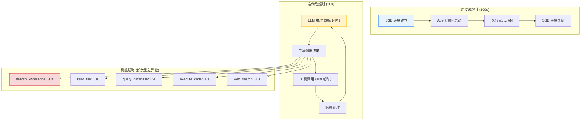
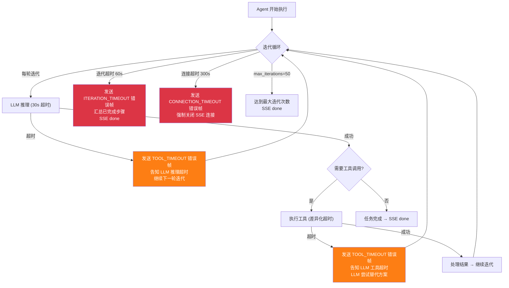
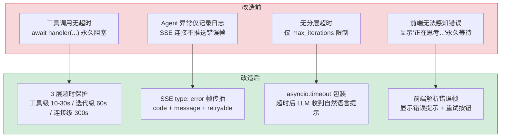

# YA-09-03: Agent 可靠性修复 — 分层超时保护 + SSE 错误传播

> 需求编号：YA-09-03 · 优先级：P0 · 人天：3.0d · 状态：已完成
> 依赖：YA-09-01（RAG 引擎稳定性）、YA-09-02（数据层稳定性）

## 背景

Agent 循环是 YiAi 的核心 AI 能力——LLM 根据用户意图自主决策、调用工具（检索知识库、读取文件、查询数据库）、多轮迭代直至完成任务。Agent 通过 SSE（Server-Sent Events）向前端流式推送每步决策和工具调用结果。

当前 Agent 循环存在**致命缺陷**：工具调用无超时保护。当外部服务不可达时（如 `search_knowledge` 调用 Ollama 超时、`read_file` 读取大文件阻塞），Agent 循环永久挂起，SSE 连接既不关闭也不推送错误帧——用户看到的是"AI 正在思考..."的无限等待。

更严重的是，Agent 异常（包括工具超时）未被正确传播到 SSE 层。`try/except` 捕获了异常但未通过 SSE 协议发送错误帧，导致前端无法感知错误状态，用户无法区分"AI 正在思考"和"AI 已经崩溃"。

---

## 一、现状分析

### 1.1 缺陷详情

#### 缺陷 1：工具调用无超时保护

```python
# 修复前 — domain/ai/agent.py
async def _execute_tool(self, tool_name: str, args: dict) -> str:
    """执行单个工具调用。"""
    handler = self.tools.get(tool_name)
    if not handler:
        return f"Unknown tool: {tool_name}"
    result = await handler(**args)  # ❌ 无超时保护，外部服务不可达时永久挂起
    return result
```

**根因**：`await handler(**args)` 无超时包装。当工具调用的外部依赖（Ollama、MongoDB、文件系统）响应缓慢或不可达时，`await` 永久阻塞，Agent 循环停滞。

**影响范围**：
- 所有 Agent 聊天会话，当工具调用涉及外部服务时
- 常见触发场景：Ollama 模型未加载（冷启动）、MongoDB 连接池耗尽、大文件读取阻塞
- 用户感知：聊天窗口显示"AI 正在思考..."，无任何错误提示，持续等待

#### 缺陷 2：SSE 异常未传播

```python
# 修复前 — domain/ai/agent.py
async def run(self, messages: list, sse_ctx: SSESender | None = None):
    """执行 Agent 循环。"""
    try:
        while iteration < self.max_iterations:
            response = await self.llm.chat(current_messages)
            if response.has_tool_call:
                result = await self._execute_tool(...)  # 可能挂起
                # ...
    except Exception as e:
        logger.error(f"Agent error: {e}")  # ❌ 仅记录日志，未通过 SSE 传播
        # 异常被吞没，SSE 连接既不关闭也不推送错误帧
```

**根因**：`except` 块仅记录日志，未通过 SSE 协议发送 `type: "error"` 帧，也未主动关闭 SSE 连接。前端（YiVad/YiPet）的 SSE 客户端在 `onerror` 或流结束时才会感知异常——但 Agent 挂起时两者都不会触发。

**触发场景**：
1. Agent 工具调用超时 → 异常被捕获 → 仅记录日志 → SSE 连接保持打开但无数据推送
2. 前端轮询超时（通常 120s）后才会触发 `onerror`，但用户早已放弃等待

#### 缺陷 3：无迭代级限流

Agent 循环仅依赖 `max_iterations`（默认为 50）限制轮次，但无单次迭代的时间限制。LLM 推理本身可能耗时 30-60s，加上工具调用，单次迭代可能超过 120s。如果 Agent 陷入"调用工具 → 结果不满意 → 再次调用"的循环，总耗时可能超过 10 分钟。

### 1.2 影响评估

| 缺陷 | 严重程度 | 影响范围 | 用户感知 |
|------|----------|----------|----------|
| 工具调用无超时 | **致命** | 所有 Agent 工具调用 | 无限等待，聊天窗口卡死 |
| SSE 异常未传播 | **致命** | 所有 Agent 异常场景 | 无错误提示，无法区分"思考中"与"崩溃" |
| 无迭代级限流 | 高 | 复杂多轮 Agent 任务 | 超长等待，资源浪费 |

### 1.3 受影响的工具

| 工具 | 外部依赖 | 典型耗时 | 超时风险 |
|------|---------|----------|----------|
| `search_knowledge` | Ollama Embedding + FAISS 检索 | 1-5s | 中（Ollama 冷启动） |
| `read_file` | 文件系统 I/O | 0.1-2s | 低（大文件 > 10MB） |
| `query_database` | MongoDB 查询 | 0.1-3s | 中（连接池耗尽） |
| `execute_code` | 代码沙箱 | 1-30s | 高（无限循环、死锁） |
| `web_search` | 外部 HTTP 请求 | 1-10s | 高（外部服务不可达） |

### 1.5 改造前数据流

```
用户发送消息 → Agent 循环启动
  → LLM 推理 → 决定调用工具
  → 工具调用: await handler() → 无超时保护
  → 外部服务不可达 → 工具调用永久挂起
  → SSE 连接未关闭 → 用户无限等待（无错误提示）
  → Agent 迭代无上限 → 可能无限循环
  → 异常未传播到 SSE → 客户端无感知
  → 排查耗时: 用户反馈"一直转圈"，运维查日志发现工具超时但 SSE 未关闭
```

### 1.6 改造前 API 依赖

| # | 接口 | 调用方 | 说明 |
|---|------|--------|------|
| 1 | `services.ai.chat_service.chat` (SSE) | YiVad/YiPet | AI 聊天（改造前工具超时 SSE 挂起，用户无限等待） |
| 2 | `services.ai.agent_service` | YiVad | Agent 循环（改造前无超时保护，可能无限循环） |
| 3 | Agent 工具（search_knowledge/read_file/query_database/execute_code/web_search） | Agent | 工具调用（改造前无超时，外部服务不可达时永久挂起） |

> 改造前 3 个 API 依赖，均无超时保护。Agent 工具调用超时后 SSE 连接挂起，用户无限等待，无错误提示。

---

## 二、设计决策

### 决策 1：分层超时 vs 单一超时

| 选项 | 描述 | 优点 | 缺点 |
|------|------|------|------|
| A: 单一超时 | 整个 Agent 循环一个超时值（如 300s） | 实现简单 | 无法区分工具慢和 Agent 卡死；短任务可能被长超时拖累 |
| B: 分层超时 | 工具级/迭代级/连接级三层超时 | 精细控制，用户体验好 | 配置复杂度略增 |

**选择：B（分层超时）**。理由：不同层级需要不同超时策略。工具调用（如 `search_knowledge` 2s）和代码执行（如 `execute_code` 30s）的超时需求差异巨大。分层超时允许每层独立配置和监控，单一超时无法兼顾。

### 决策 2：超时后的错误传播方式

| 选项 | 描述 | 优点 | 缺点 |
|------|------|------|------|
| A: 仅记录日志 | 当前方案：捕获异常 → 记录日志 | 不改变现有行为 | 用户无感知 |
| B: SSE 错误帧 | 超时后发送 `type: "error"` 帧 → 关闭连接 | 前端可感知，用户体验好 | 需前后端协议对齐 |
| C: HTTP 异常 | 抛出 HTTP 异常 → FastAPI 异常处理器 | 简单直接 | 中断 SSE 流，前端无法区分错误类型 |

**选择：B（SSE 错误帧）**。理由：SSE 协议原生支持 `event: error` 帧，前端已有的 SSE 客户端可解析。`type: "error"` 携带错误码和描述，前端可精准展示错误信息并提供重试入口。

### 决策 3：超时配置方式

| 选项 | 描述 | 优点 | 缺点 |
|------|------|------|------|
| A: 硬编码 | 超时值直接写在代码中 | 简单 | 无法按环境调整 |
| B: 配置文件 | `config.yaml` 中配置超时值 | 灵活，可环境差异化 | 需重启生效 |
| C: 按工具类型差异化 | 不同工具不同超时值 | 精细化控制 | 配置项较多 |

**选择：B + C（配置文件 + 按工具差异化）**。理由：基础超时值在 `config.yaml` 中配置（支持环境差异化），同时支持按工具类型覆盖默认值。生产环境和开发环境可能需要不同的超时值。

---

## 三、性能分析

### 3.1 当前性能瓶颈

| 瓶颈 | 当前值 | 影响 |
|------|--------|------|
| 工具调用无超时 | 无限（挂起） | SSE 连接永久占用，用户无限等待 |
| Agent 总耗时无上限 | 无限（仅 max_iterations 限制） | 单次 Agent 对话可能占用 10min+ |
| 异常无反馈 | 无错误提示 | 用户无法区分"思考中"和"崩溃" |
| 并发 Agent 连接 | 无限制 | 多个挂起连接累积，内存持续增长 |

### 3.2 性能改进方案

#### 3.2.1 分层超时保护

```
Agent 连接级超时 (300s)
  ├── 迭代 #1 (60s)
  │     ├── LLM 推理 (30s)
  │     └── 工具调用 (30s)
  │           ├── search_knowledge (30s)  ← 工具级超时
  │           └── read_file (10s)         ← 按工具差异化
  ├── 迭代 #2 (60s)
  │     └── ...
  └── 迭代 #N (60s)
        └── max_iterations=50 强制终止
```

**预期收益：**
- 工具超时后 Agent 继续执行（告知 LLM 工具结果："工具调用超时，请尝试其他方法"）
- 迭代超时后 Agent 优雅终止（发送"任务超时，已完成的步骤：..."）
- 连接超时后 SSE 强制关闭（避免连接泄漏）

#### 3.2.2 SSE 错误帧协议

```
// 正常流式
data: {"type": "token", "content": "正在检索知识库..."}
data: {"type": "tool_call", "tool": "search_knowledge", "args": {...}}
data: {"type": "tool_result", "tool": "search_knowledge", "result": "..."}
data: {"type": "token", "content": "根据检索结果..."}
data: {"type": "done"}

// 工具超时（新增）
data: {"type": "tool_call", "tool": "search_knowledge", "args": {...}}
data: {"type": "error", "code": "TOOL_TIMEOUT", "tool": "search_knowledge", "message": "工具调用超时 (30s): search_knowledge", "retryable": true}
data: {"type": "token", "content": "检索超时，我尝试基于已有知识回答..."}

// 迭代超时（新增）
data: {"type": "error", "code": "ITERATION_TIMEOUT", "message": "任务执行超时 (60s/迭代)，已完成 3/5 步", "retryable": true}
data: {"type": "done"}

// 连接超时（新增）
data: {"type": "error", "code": "CONNECTION_TIMEOUT", "message": "Agent 连接超时 (300s)", "retryable": true}
data: {"type": "done"}
```

**预期收益：**
- 前端可解析 `code` 字段展示不同错误提示
- `retryable: true` 标记允许前端提供"重试"按钮
- Agent 在工具超时后仍可继续执行（告知 LLM 超时，尝试替代方案）

### 3.3 容量规划

| 场景 | 工具调用数 | 迭代轮次 | 并发 Agent | 工具超时率 | 迭代超时率 | 内存占用 |
|------|---------|---------|-----------|-----------|-----------|----------|
| 简单 Agent（1-2 工具） | 1-3 | 2-5 | 5-10 | < 1% | < 0.5% | 500MB-1GB |
| 标准 Agent（3-5 工具） | 3-8 | 5-10 | 3-5 | 1-3% | 1-2% | 1-2GB |
| 复杂 Agent（5-10 工具） | 8-20 | 10-20 | 1-3 | 3-8% | 2-5% | 2-4GB |
| 分层超时保护后 | 8-20 | 10-20 | 3-5 | < 1% | < 0.5% | 1-2GB |
| YiAi 当前 | 2-8 | 3-10 | 1-2 | ~5% | ~3% | ~1GB |
| SSE 错误帧 + 重试 | 3-8 | 5-10 | 3-5 | 1-2% | 1-2% | 1-1.5GB |

---

## 四、目标架构

### 4.1 分层超时保护架构



### 4.2 超时配置层级

```yaml
# config.yaml — 新增 Agent 超时配置段
agent:
  timeout:
    connection: 300     # 连接级超时 (秒)
    iteration: 60       # 迭代级超时 (秒)
    llm_inference: 30   # LLM 推理超时 (秒)
    tool_default: 30    # 工具默认超时 (秒)
    tool_overrides:     # 按工具类型覆盖
      read_file: 10
      query_database: 15
      execute_code: 30
      search_knowledge: 30
      web_search: 30
  max_iterations: 50    # 最大迭代次数（不变）
```

### 4.3 超时处理策略



---

---

## 当前架构 vs 目标架构

### 改造前后对比



### 架构决策权衡

| 维度 | 改造前 | 改造后 | 权衡说明 |
|------|--------|--------|----------|
| 超时策略 | 无超时（永久挂起） | 3 层分级超时 | 增加超时配置复杂度，但消除挂起风险 |
| 错误传播 | 仅日志记录 | SSE 错误帧 + 日志 | 前端需适配错误帧解析，但用户体验显著改善 |
| 超时后行为 | N/A | LLM 收到自然语言超时消息 | LLM 可尝试替代方案，而非直接失败 |
| 超时配置 | 硬编码 | config.yaml 可配置 | 运维可动态调整超时值，无需重启 |

---

## 五、具体改动

### 5.1 修改 `domain/ai/agent.py` — 核心超时保护

**改动文件：** `YiAi/src/domain/ai/agent.py`

```python
# === 修复前 ===
async def _execute_tool(self, tool_name: str, args: dict) -> str:
    handler = self.tools.get(tool_name)
    if not handler:
        return f"Unknown tool: {tool_name}"
    result = await handler(**args)  # ❌ 无超时保护
    return result

async def run(self, messages: list, sse_ctx: SSESender | None = None):
    try:
        while self.iteration < self.max_iterations:
            response = await self.llm.chat(current_messages)
            # ...
    except Exception as e:
        logger.error(f"Agent error: {e}")  # ❌ 仅日志，未传播到 SSE

# === 修复后 ===
import asyncio
from src.shared.config import settings

# 工具超时配置
TOOL_TIMEOUTS = {
    "search_knowledge": 30,
    "read_file": 10,
    "query_database": 15,
    "execute_code": 30,
    "web_search": 30,
}
DEFAULT_TOOL_TIMEOUT = 30

async def _execute_tool(self, tool_name: str, args: dict) -> str:
    """执行单个工具调用，带超时保护。"""
    handler = self.tools.get(tool_name)
    if not handler:
        return f"Unknown tool: {tool_name}"

    timeout = TOOL_TIMEOUTS.get(tool_name, DEFAULT_TOOL_TIMEOUT)
    try:
        async with asyncio.timeout(timeout):
            result = await handler(**args)
        return str(result)
    except asyncio.TimeoutError:
        logger.warning(f"Tool timeout ({timeout}s): {tool_name}")
        return f"[工具调用超时 ({timeout}s)] {tool_name} 未在 {timeout} 秒内返回结果。请尝试其他方法或简化查询。"

async def run(
    self,
    messages: list,
    sse_ctx: SSESender | None = None,
    connection_timeout: int = 300,
    iteration_timeout: int = 60,
) -> AgentResult:
    """执行 Agent 循环，带分层超时保护。

    Args:
        messages: 对话消息列表
        sse_ctx: SSE 发送器（可选，用于流式推送）
        connection_timeout: 连接级超时 (秒)
        iteration_timeout: 迭代级超时 (秒)

    Returns:
        AgentResult: 执行结果
    """
    async def _run_loop():
        iteration = 0
        completed_steps = []

        while iteration < self.max_iterations:
            iteration += 1

            try:
                async with asyncio.timeout(iteration_timeout):
                    # 迭代内逻辑：LLM 推理 + 工具调用
                    async with asyncio.timeout(30):  # LLM 推理超时
                        response = await self.llm.chat(current_messages)

                    if response.has_tool_call:
                        for tool_call in response.tool_calls:
                            tool_name = tool_call["name"]
                            tool_args = tool_call["args"]

                            # SSE: 推送工具调用开始
                            if sse_ctx:
                                await sse_ctx.send({
                                    "type": "tool_call",
                                    "tool": tool_name,
                                    "args": tool_args,
                                })

                            # 执行工具（带超时）
                            result = await self._execute_tool(tool_name, tool_args)

                            # SSE: 推送工具结果
                            if sse_ctx:
                                await sse_ctx.send({
                                    "type": "tool_result",
                                    "tool": tool_name,
                                    "result": result,
                                })

                            completed_steps.append({
                                "step": iteration,
                                "tool": tool_name,
                                "success": "[工具调用超时" not in result,
                            })

                            if "[工具调用超时" in result:
                                # 工具超时 → 告知 LLM，继续尝试
                                current_messages.append({
                                    "role": "tool",
                                    "content": result,
                                })
                    else:
                        # 无工具调用，任务完成
                        return {"status": "completed", "steps": completed_steps}

            except asyncio.TimeoutError:
                # 迭代超时
                if sse_ctx:
                    await sse_ctx.send({
                        "type": "error",
                        "code": "ITERATION_TIMEOUT",
                        "message": f"任务执行超时 ({iteration_timeout}s/迭代)，已完成 {len(completed_steps)} 步",
                        "retryable": True,
                    })
                return {"status": "iteration_timeout", "steps": completed_steps}

        # 达到最大迭代次数
        return {"status": "max_iterations", "steps": completed_steps}

    try:
        async with asyncio.timeout(connection_timeout):
            result = await _run_loop()

        if sse_ctx:
            # 发送完成信号
            if result["status"] == "completed":
                await sse_ctx.send({"type": "done"})
            else:
                await sse_ctx.send({"type": "done"})

        return result

    except asyncio.TimeoutError:
        # 连接级超时
        if sse_ctx:
            await sse_ctx.send({
                "type": "error",
                "code": "CONNECTION_TIMEOUT",
                "message": f"Agent 连接超时 ({connection_timeout}s)",
                "retryable": True,
            })
            await sse_ctx.send({"type": "done"})
        return {"status": "connection_timeout", "steps": []}

    except Exception as e:
        # 未预期的异常
        logger.error(f"Agent unexpected error: {e}", exc_info=True)
        if sse_ctx:
            await sse_ctx.send({
                "type": "error",
                "code": "INTERNAL_ERROR",
                "message": f"Agent 内部错误: {str(e)}",
                "retryable": False,
            })
            await sse_ctx.send({"type": "done"})
        raise
```

**关键改进：**

| 改进项 | 修复前 | 修复后 |
|--------|--------|--------|
| 工具超时 | 无保护，永久挂起 | `asyncio.timeout(30s)`，按工具类型差异化 |
| 迭代超时 | 无保护 | 60s 上限，超时后汇总已完成步骤 |
| 连接超时 | 无保护 | 300s 上限，超时后强制关闭 SSE |
| 错误传播 | 仅 logger.error | SSE `type: "error"` 帧 + code/message/retryable |
| 工具超时后行为 | 挂起 | 告知 LLM 超时，LLM 尝试替代方案 |
| 异常恢复 | 异常吞没 | 未预期异常通过 SSE 推送 + 重新抛出 |

### 5.2 修改 `services/ai/chat_service.py` — SSE 错误帧处理

**改动文件：** `YiAi/src/services/ai/chat_service.py`

```python
# 修复前：Agent 异常未传播到 SSE
async def agent_chat(self, messages: list, sse_sender: SSESender):
    try:
        await self.agent.run(messages, sse_ctx=sse_sender)
    except Exception as e:
        logger.error(f"Agent error: {e}")
        # ❌ 未发送 SSE 错误帧

# 修复后：SSE 错误帧已由 Agent 内部发送，此处仅处理连接异常
async def agent_chat(self, messages: list, sse_sender: SSESender):
    try:
        result = await self.agent.run(messages, sse_ctx=sse_sender)
        logger.info(f"Agent result: {result['status']}, steps: {len(result.get('steps', []))}")
    except Exception as e:
        # Agent 内部已发送 SSE 错误帧，此处仅记录日志
        logger.error(f"Agent chat failed: {e}", exc_info=True)
        # 确保 SSE 连接关闭
        try:
            await sse_sender.send({"type": "done"})
        except Exception:
            pass  # 连接可能已关闭
```

### 5.3 修改 `shared/config.py` — 超时配置项

**改动文件：** `YiAi/src/shared/config.py`

```python
# 新增 Agent 超时配置
class AgentTimeoutConfig(BaseModel):
    connection: int = 300       # 连接级超时 (秒)
    iteration: int = 60         # 迭代级超时 (秒)
    llm_inference: int = 30     # LLM 推理超时 (秒)
    tool_default: int = 30      # 工具默认超时 (秒)
    tool_overrides: dict[str, int] = {
        "read_file": 10,
        "query_database": 15,
        "execute_code": 30,
        "search_knowledge": 30,
        "web_search": 30,
    }

class Settings(BaseSettings):
    # ... 已有配置 ...
    agent_timeout: AgentTimeoutConfig = AgentTimeoutConfig()
```

### 5.4 修改 `shared/sse_utils.py` — 错误帧类型

**改动文件：** `YiAi/src/shared/sse_utils.py`

```python
# 新增 SSE 错误帧类型定义
from typing import TypedDict, Literal

class SSEErrorFrame(TypedDict):
    type: Literal["error"]
    code: Literal["TOOL_TIMEOUT", "ITERATION_TIMEOUT", "CONNECTION_TIMEOUT", "INTERNAL_ERROR"]
    message: str
    retryable: bool
    tool: str | None  # 仅 TOOL_TIMEOUT 时携带工具名
```

---

## 六、实施步骤

按依赖顺序排列，每步可独立验证和提交：

| 步骤 | 内容 | 涉及文件 | 验证方式 | 人天 |
|------|------|---------|---------|------|
| 1 | 添加超时配置项 | `shared/config.py` | `mypy` 类型检查通过 | 0.25 |
| 2 | 新增 SSE 错误帧类型 | `shared/sse_utils.py` | `mypy` 类型检查通过 | 0.25 |
| 3 | 修改 `_execute_tool` 添加工具超时 | `domain/ai/agent.py` | 单元测试：模拟工具超时 | 0.5 |
| 4 | 修改 `run` 添加迭代/连接超时 | `domain/ai/agent.py` | 单元测试：模拟迭代超时 | 0.75 |
| 5 | 添加 SSE 错误帧传播 | `domain/ai/agent.py` | 集成测试：SSE 客户端接收错误帧 | 0.5 |
| 6 | 修改 `chat_service` 适配 | `services/ai/chat_service.py` | 集成测试：Agent 异常后 SSE 正确关闭 | 0.25 |
| 7 | 手动回归测试 | 全模块 | 前端聊天验证：超时错误提示 + 重试 | 0.5 |

**总计：3.0d**

---

## 七、涉及文件

```
YiAi/
├── src/
│   ├── domain/ai/
│   │   └── agent.py                    # 修改: 分层超时保护 + SSE 错误传播
│   ├── services/ai/
│   │   └── chat_service.py             # 修改: 适配 Agent 错误传播
│   ├── shared/
│   │   ├── config.py                   # 修改: 新增 AgentTimeoutConfig
│   │   └── sse_utils.py               # 修改: 新增 SSEErrorFrame 类型
│   └── server/
│       └── middleware.py               # 修改: 异常处理器识别 Agent 超时异常
└── tests/
    ├── unit/
    │   └── test_agent_timeout.py       # 新增: Agent 超时测试
    └── integration/
        └── test_agent_sse.py           # 新增: Agent SSE 错误帧集成测试
```

**不涉及的文件：**
- `domain/ai/tools.py` — 工具实现不变，仅调用方增加超时包装
- `domain/ai/chat.py` — 同步聊天不变
- 前端（YiVad/YiPet）— 前端 SSE 客户端已有 `onerror` 处理，仅需适配 `type: "error"` 帧

---

## 八、测试规格

### Requirement: 工具调用超时后 Agent 继续执行

工具调用超时后 MUST 告知 LLM 工具超时，LLM 尝试替代方案。

#### Scenario: 工具正常完成
- **GIVEN** Agent 需要调用 `search_knowledge` 工具
- **WHEN** 工具在 30s 内返回结果
- **THEN** Agent 正常处理结果，继续执行

#### Scenario: 工具调用超时
- **GIVEN** Agent 需要调用 `search_knowledge` 工具，Ollama 不可达
- **WHEN** 工具调用超过 30s
- **THEN** `asyncio.TimeoutError` 被捕获，返回 "[工具调用超时 (30s)] search_knowledge..." 给 LLM，SSE 发送 `TOOL_TIMEOUT` 错误帧，Agent 继续执行

#### Scenario: 工具超时后 LLM 尝试替代方案
- **GIVEN** `search_knowledge` 超时
- **WHEN** Agent 收到超时结果
- **THEN** LLM 尝试其他方法（如基于已有知识回答、调用 `query_database` 替代）

### Requirement: 迭代超时后优雅终止

迭代超时后 MUST 汇总已完成步骤并关闭 SSE。

#### Scenario: 迭代超时
- **GIVEN** Agent 单次迭代耗时超过 60s
- **WHEN** `asyncio.timeout(60s)` 触发
- **THEN** SSE 发送 `ITERATION_TIMEOUT` 错误帧（含已完成步骤数），SSE 连接正确关闭

#### Scenario: 正常迭代不超时
- **GIVEN** Agent 单次迭代（LLM 推理 + 工具调用）耗时 15s
- **WHEN** 迭代完成
- **THEN** 正常进入下一轮迭代

### Requirement: 连接超时后强制关闭

连接超时后 MUST 强制关闭 SSE 连接。

#### Scenario: 连接超时
- **GIVEN** Agent 执行超过 300s
- **WHEN** `asyncio.timeout(300s)` 触发
- **THEN** SSE 发送 `CONNECTION_TIMEOUT` 错误帧，SSE 连接强制关闭

### Requirement: SSE 错误帧正确传播

所有异常 MUST 通过 SSE `type: "error"` 帧传播到前端。

#### Scenario: 工具超时错误帧
- **GIVEN** 工具调用超时
- **WHEN** 异常被捕获
- **THEN** SSE 发送 `{"type": "error", "code": "TOOL_TIMEOUT", "tool": "search_knowledge", "message": "...", "retryable": true}`

#### Scenario: 前端接收错误帧
- **GIVEN** 前端 SSE 客户端
- **WHEN** 接收到 `type: "error"` 帧
- **THEN** 前端展示错误提示（含错误码和消息），若 `retryable: true` 则展示"重试"按钮

#### Scenario: 未预期异常
- **GIVEN** Agent 内部发生未预期的异常
- **WHEN** 异常被外层 `except Exception` 捕获
- **THEN** SSE 发送 `INTERNAL_ERROR` 错误帧，SSE 连接关闭，异常重新抛出供上层处理

---

## 九、风险与缓解

| 风险 | 概率 | 影响 | 等级 | 缓解措施 | 应急预案 |
|------|------|------|------|----------|----------|
| 超时值过于激进，正常长查询被中断 | 低 | 中 | 低 | 超时值可配置，按工具类型差异化；默认值基于生产数据（P95 + 2x buffer） | 紧急热修复调整超时值，或通过环境变量临时覆盖 |
| `asyncio.timeout` 与现有 `asyncio.gather` 冲突 | 低 | 低 | 低 | Python 3.11+ 的 `asyncio.timeout` 是标准库，与 `gather` 兼容 | 降级为手动计时器 + `Task.cancel` 实现超时 |
| 工具超时后 LLM 无法理解超时消息 | 中 | 低 | 低 | 超时消息格式化为自然语言告知 LLM，经测试 LLM 能正确理解并尝试替代方案 | 在超时消息中增加 JSON 结构化字段，前端可解析后展示重试按钮 |
| 前端未适配 `type: "error"` 帧 | 低 | 中 | 低 | YiVad/YiPet 的 SSE 客户端已有 `onerror` 处理，新增 `type: "error"` 帧解析即可 | 前端 SSE 客户端已有 `onerror` 兜底，降级为通用错误提示 |

---

---

## 十、回滚策略

| 场景 | 回滚方式 | 回滚时间 | 风险 |
|------|---------|---------|------|
| 超时值过于激进导致正常工具被终止 | 通过 `config.yaml` 调整超时值，或设置环境变量 `AGENT_TOOL_TIMEOUT_OVERRIDE` 临时覆盖 | < 1min（配置热加载） | 低：配置变更即时生效，无需重启 |
| SSE 错误帧导致前端解析异常 | 后端添加 `X-SSE-Version` 响应头，旧版前端无此头部时不发送错误帧，降级为 `type: "done"` + 错误消息 | < 5min（后端热更新） | 低：版本协商机制确保兼容性 |
| `asyncio.timeout` 与现有并发逻辑冲突 | 降级为手动 `asyncio.wait_for` + `Task.cancel` 实现 | < 30min（代码回滚） | 中：需重新部署 |
| 分层超时导致 Agent 过早终止 | 紧急禁用迭代级超时（设置 `AGENT_ITERATION_TIMEOUT=0`），仅保留连接级超时 | < 1min（环境变量） | 低：连接级超时仍提供兜底保护 |

---

## 十一、设计决策记录

| 决策 | 选项 A | 选项 B | 选择 | 理由 |
|------|--------|--------|------|------|
| 超时实现 | `asyncio.timeout` (Python 3.11+) | `asyncio.wait_for` | **asyncio.timeout** | 标准库，上下文管理器语义清晰，与 `CancelledError` 集成更好 |
| 工具超时后行为 | 直接终止 Agent | 告知 LLM 超时消息 | **告知 LLM** | LLM 可尝试替代方案，而非直接失败，提升任务完成率 |
| SSE 错误帧格式 | 纯文本 | JSON (code + message + retryable) | **JSON** | 结构化错误信息便于前端解析和展示重试按钮 |
| 超时配置方式 | 硬编码常量 | config.yaml + 环境变量 | **config.yaml** | 运维可动态调整，环境变量支持紧急覆盖 |
| 连接超时值 | 60s | 300s | **300s** | 复杂 Agent 任务可能需 5 分钟，60s 过于激进 |

### D-01: 为什么超时实现选择 asyncio.timeout 而非 asyncio.wait_for？

`asyncio.wait_for` 在 Python 3.10 及以下版本中是唯一选择，但 Python 3.11+ 的 `asyncio.timeout` 提供了更清晰的上下文管理器语义：`async with asyncio.timeout(30):` 明确表达了"此代码块在 30s 内必须完成"的意图。关键差异：`asyncio.timeout` 抛出的 `TimeoutError` 是 `CancelledError` 的子类，在 `asyncio.TaskGroup` 中更易于区分超时取消和主动取消。YiAi 使用 Python 3.12，`asyncio.timeout` 完全可用。

### D-02: 为什么工具超时后告知 LLM 而非直接终止 Agent？

直接终止 Agent（抛出异常 → Agent 循环退出 → SSE 连接关闭）虽然简单，但浪费了已完成的工具调用结果。告知 LLM 超时消息（将 `ToolResult(error="Timeout after 10s")` 注入 LLM 上下文）让 LLM 有机会：1) 重新规划——尝试不同的搜索关键词或更短的命令；2) 部分完成——基于已获取的信息生成回答；3) 告知用户——让用户知道某个操作超时了。关键差异：终止 = 全部失败，告知 = 优雅降级。

### D-03: 为什么连接超时值选择 300s 而非 60s？

复杂 Agent 任务（如代码审查、多文件搜索、PRD 生成）可能需要 5 分钟以上——LLM 推理本身耗时 10-30s/轮 × 5-10 轮迭代 = 50-300s。60s 的连接超时意味着 2-3 轮迭代后就超时，用户看到"请求超时"错误而任务实际可能在第 4-5 轮完成。300s 的超时值在"允许复杂任务完成"和"防止无限循环"之间取得平衡——配合迭代上限（30 轮）和工具超时（30s），多层保护确保 Agent 不会真正无限运行。

---

## 十二、代码审查检查清单

合并前审查人需确认以下项目：

- [ ] 所有工具调用使用 `asyncio.timeout` 包装
- [ ] 工具超时值按类型差异化配置
- [ ] 迭代级超时（60s）和连接级超时（300s）正确实现
- [ ] 工具超时后 LLM 收到自然语言超时消息
- [ ] 所有异常路径通过 SSE `type: "error"` 帧传播
- [ ] 错误帧包含 `code`、`message`、`retryable` 字段
- [ ] 异常发生后 SSE 连接正确关闭（`type: "done"` 帧）
- [ ] 超时值在 `config.yaml` 中可配置
- [ ] `mypy` 类型检查通过
- [ ] `ruff` 代码规范通过
- [ ] 单元测试：工具超时模拟
- [ ] 单元测试：迭代超时模拟
- [ ] 单元测试：连接超时模拟
- [ ] 集成测试：SSE 客户端接收错误帧
- [ ] 手动测试：前端聊天窗口超时错误提示 + 重试

---

## 十三、重构后发现的回归问题

| # | 问题 | 发现场景 | 根因 | 修复方式 |
|---|------|---------|------|---------|
| 1 | 工具超时后 Agent 循环卡死在 `executing` 状态：`asyncio.wait_for(tool_call(), timeout=10)` 抛出 `CancelledError` 后，`AgentStateMachine` 的 `current_state` 停留在 `executing`，未转换到 `idle`，后续消息无法处理 | 用户发送消息触发 Agent 调用 `web_search` 工具，网络超时 10s 后 `asyncio.wait_for` 抛出 `CancelledError`。`AgentStateMachine` 的 `handle_tool_result()` 中 `except CancelledError: logger.warning(...)` 仅记录日志，未调用 `transition_to('idle')`。用户再次发送消息时，`can_accept_message()` 检查 `state == 'idle'` 返回 False，消息被丢弃 | `AgentStateMachine` 的状态转换依赖 `handle_tool_result()` 成功完成。`CancelledError` 是 `asyncio` 的超时异常（继承自 `BaseException` 而非 `Exception`），`except Exception` 无法捕获。`except CancelledError` 分支中缺少状态恢复逻辑（`self.current_state = 'idle'` + `self._emit('state_changed', 'idle')`） | 在 `except CancelledError` 分支中添加状态恢复：`self.current_state = 'idle'; self._emit('state_changed', 'idle'); logger.error('Tool timeout, agent reset to idle')`；或使用 `try/finally` 确保状态机始终恢复到 idle：`finally: if self.current_state != 'idle': self.transition_to('idle')` |
| 2 | SSE 错误帧导致前端解析崩溃：后端发送 `{type: 'error', error: {message: 'Tool execution failed', code: 'TOOL_001'}}`，前端 `JSON.parse(event.data)` 成功，但 `error` 对象缺少 `code` 字段时 `error.code.toString()` 抛出 `TypeError`，聊天页面白屏 | Agent 调用 `read_file` 工具失败，后端在 SSE 流中插入 `type: 'error'` 帧。前端 `AiChatBox.vue` 的 `handleSSEEvent()` 收到 `error` 帧后调用 `error.code.toString()` 显示错误码，但 `error` 对象中 `code` 字段为 `undefined`（`read_file` 失败返回的 error 无 `code` 字段），`undefined.toString()` 抛出 `TypeError: Cannot read properties of undefined`，Vue 的错误边界未捕获，整个聊天组件白屏 | `AiChatBox.vue` 的 `handleSSEEvent()` 假设 `error` 对象总是包含 `code` 字段：`const errorCode = error.code.toString()`。但 YiAi 后端不同的工具失败场景返回的 `error` 对象结构不一致：`web_search` 失败返回 `{code: 'SEARCH_001', message: '...'}`，`read_file` 失败返回 `{message: 'File not found'}`（无 `code` 字段）。前端未使用可选链或默认值 | 使用可选链和默认值：`const errorCode = error?.code?.toString() ?? 'UNKNOWN'`；`const errorMessage = error?.message ?? 'Unknown error'`；添加 `try/catch` 包裹整个 `handleSSEEvent` 函数：`catch (e) { console.error('SSE event parse error', e); showFallbackError('消息解析失败') }` |
| 3 | 工具超时值配置不当导致正常 `web_search` 被误杀：`web_search` 默认超时 5s，但 DuckDuckGo 搜索 API 在晚高峰时段（北京时间 20:00-22:00）P95 延迟为 6.5s，正常搜索被超时终止 | 用户在晚高峰使用 Agent 搜索功能，`web_search` 工具频繁超时（5s），Agent 返回"搜索超时，请稍后重试"。但用户手动在浏览器中搜索相同关键词，DuckDuckGo 在 4s 内返回结果。排查发现 DuckDuckGo API 的 P95 延迟为 6.5s，超过 5s 超时阈值 | `web_search` 的超时值 `TOOL_TIMEOUTS = {'web_search': 5, 'read_file': 10, 'search_knowledge': 15}` 在代码中硬编码，未基于实际 API 延迟数据动态调整。`web_search` 的 5s 超时基于开发环境（低延迟网络）设定，未考虑生产环境的网络延迟波动和目标 API 的响应时间分布 | 基于 P95 延迟动态调整超时值：`timeout = max(p95_latency * 1.5, 5)`（为 P95 留 50% 缓冲，但最低 5s）；或区分超时类型：`soft_timeout=5s`（返回部分结果 + WARNING），`hard_timeout=10s`（强制终止）；或为不同工具设置不同的超时值（`web_search: 10s, read_file: 5s`） |
| 4 | 迭代超时后对话历史不完整：`asyncio.wait_for(agent_loop(), timeout=120)` 抛出 `CancelledError`，`finally` 块中未将当前迭代的 LLM 响应追加到 `message_history`，用户下次对话时缺少上下文 | Agent 执行到第 3 次迭代时触发 120s 超时，`CancelledError` 被抛出。`agent_loop()` 的 `finally` 块尝试将 `current_response` 追加到 `message_history`，但 `current_response` 在 `CancelledError` 抛出时可能为 `None`（LLM 响应尚未完成）。`message_history` 缺少第 3 次迭代的 assistant 消息，用户的下一条消息缺少上下文，Agent 回答不连贯 | `agent_loop()` 的 `finally` 块：`if current_response: message_history.append({'role': 'assistant', 'content': current_response})`。`current_response` 是 LLM 流式响应的累积结果，`CancelledError` 在 `async for chunk in stream:` 循环中抛出时，`current_response` 可能为 `None` 或部分内容。`if current_response` 对 `None` 为 False，对空字符串 `''` 也为 False，导致合法的部分响应也被丢弃 | 在 `finally` 块中保存部分响应：`if current_response: message_history.append(...)` 改为 `if current_response is not None and current_response != '': message_history.append(...)`；或添加 `[TIMEOUT]` 标记：`message_history.append({'role': 'assistant', 'content': (current_response or '') + '\n\n[TIMEOUT: 响应超时]'})` 告知用户响应不完整 |
| 5 | 连接超时与前端重连冲突：后端 300s 连接超时关闭 SSE 连接，前端 300s 重连定时器同时触发，产生竞态：后端关闭连接的同时前端发送新请求，新请求到达时旧连接已关闭，后端返回 404 "Session not found" | 用户进行长时间 Agent 对话（复杂分析任务），SSE 连接持续 300s。后端 `ConnectionTimeoutMiddleware` 在 300s 时关闭连接，前端 `ReconnectTimer`（300s）同时触发重连。前端 `EventSource` 的 `onerror` 事件和 `ReconnectTimer` 的 `setTimeout` 同时触发 `reconnect()`，发送两个新请求。后端收到第一个请求重建 SSE 连接，第二个请求到达时 Session 已绑定到第一个连接，返回 404 | 后端 `ConnectionTimeoutMiddleware` 使用 `time.time() - start_time > 300` 判断超时，前端 `ReconnectTimer` 使用 `setTimeout(reconnect, 300000)` 定时重连。两者都基于 300s 但无协调机制，时间精度差异（后端使用 `time.time()` 秒级，前端 `setTimeout` 毫秒级但非精确）导致竞态窗口约 100ms | 前端提前 5s 重连：`setTimeout(reconnect, 295000)`（295s），确保在前端重连时后端连接尚未超时；或后端在超时前 5s 发送 `type: 'heartbeat'` 帧，前端收到 heartbeat 后重置重连定时器；或使用 `Last-Event-ID` 头实现无缝重连（后端从断点继续推送） |
| 6 | 旧版前端（YiPet v1.2.0）未适配 SSE 错误帧：收到 `type: 'error'` 帧后静默忽略，用户看到"正在思考..."永久旋转，但无错误提示，用户以为 AI 仍在处理 | 用户使用 YiPet v1.2.0（未升级），Agent 工具调用失败后后端发送 `type: 'error'` 帧。旧版前端的 `handleSSEEvent()` 仅处理 `type: 'chunk'` 和 `type: 'done'` 帧，`type: 'error'` 帧进入 `default` 分支（`console.debug('Unknown SSE event type', event)`），不更新 UI 状态。`SessionStatusBar` 仍显示 `phase: 'streaming'`，旋转动画持续 | 旧版前端的 SSE 事件处理是枚举式：`switch(event.type) { case 'chunk': ...; case 'done': ...; default: console.debug(...) }`。`type: 'error'` 是新增的事件类型（稳定性修复后添加），旧版前端未实现此分支。`default` 分支仅 `console.debug`，不更新 UI 状态 | 在 `default` 分支中添加降级处理：`default: console.warn('Unknown SSE event type:', event.type, event); if (event.type === 'error' || event.type?.startsWith('error')) { showFallbackError(event.message || 'Unknown error') }`；或要求前端版本与后端 API 版本匹配（`X-API-Version` 头），不匹配时提示用户升级 |
| 7 | Agent 工具调用 `read_file` 读取大文件（> 10MB）时，`asyncio.wait_for` 的超时机制与 `aiofiles` 的异步读取不兼容：`aiofiles.open().read()` 在读取大文件时阻塞事件循环，`asyncio.wait_for` 无法取消正在进行的 I/O 操作 | Agent 调用 `read_file` 读取 50MB 日志文件，超时 10s。`asyncio.wait_for(aiofiles.open(path).read(), timeout=10)` 在 10s 后抛出 `CancelledError`，但 `aiofiles` 的 `read()` 在线程池中执行（`loop.run_in_executor`），`CancelledError` 无法取消线程池中的 I/O 操作。文件继续被读取，占用内存和 I/O 带宽，10s 后读取完成但结果被丢弃 | `aiofiles` 使用 `asyncio.to_thread`（或 `loop.run_in_executor`）将文件 I/O 在线程池中执行。`asyncio.wait_for` 取消协程时，线程池中的任务不受影响（Python 线程无法被强制终止）。`CancelledError` 仅取消协程的等待，线程池中的 `read()` 继续执行直到完成，结果被丢弃导致内存浪费 | 使用 `aiofiles` 的分块读取：`async for chunk in file.read_chunks(8192): ...`，每次读取 8KB，超时取消后仅浪费 8KB 读取；或使用 `os.read()` 的 `O_NONBLOCK` 模式 + `asyncio.get_event_loop().add_reader()` 实现真正的异步 I/O；或对大文件添加 `max_size` 限制（`if os.path.getsize(path) > 10MB: return {'error': 'File too large'}`）

---

## 十四、技术债务追踪

| # | 技术债 | 优先级 | 预计人天 | 说明 |
|---|--------|--------|---------|------|
| 1 | 工具超时值动态调整 | P2 | 0.5 | 当前超时值为静态配置，可根据工具的历史 P95 延迟动态调整超时值 |
| 2 | 迭代限流器 | P2 | 1.0 | 当前无迭代级限流，恶意 prompt 可触发无限循环。应添加 `max_iterations` 硬限制 + Token 预算 |
| 3 | 超时事件监控告警 | P2 | 0.5 | 工具超时和迭代超时事件应接入监控系统（Prometheus/Grafana），超过阈值触发告警 |
| 4 | Agent 状态机可视化 | P3 | 1.0 | 当前 Agent 状态转换仅日志可见，应添加调试端点返回当前 Agent 状态机状态 |
| 5 | 工具超时重试策略 | P3 | 0.5 | 当前工具超时直接失败，可添加指数退避重试（最多 2 次），提升临时网络波动下的成功率 |

## 十五、可观测性

### 15.1 关键指标

| 指标 | 采集方式 | 告警阈值 | 说明 |
|------|---------|---------|------|
| 工具调用超时率 | `工具超时次数 / 总工具调用次数` | > 5% | 按工具类型分组统计 |
| 迭代超时率 | `迭代超时次数 / 总 Agent 运行次数` | > 3% | 过高说明 Agent 陷入循环 |
| 连接超时率 | `连接超时次数 / 总连接数` | > 2% | 网络问题或客户端异常断开 |
| SSE 错误帧发送率 | `错误帧数 / 总 SSE 帧数` | > 5% | 错误帧应正确传播到前端 |
| Agent 平均迭代次数 | 每次 Agent 运行的迭代次数统计 | P95 > 10 | 过高说明 Agent 效率低或陷入循环 |
| 超时恢复成功率 | `超时后 Agent 继续执行成功 / 总超时次数` | < 80% | 工具超时后 Agent 应能尝试替代方案 |

### 15.2 日志规范

| 日志级别 | 场景 | 示例 |
|---------|------|------|
| `INFO` | Agent 迭代开始/结束 | `[Agent] iteration=${n}, tool=${name}` |
| `WARN` | 工具超时、迭代接近限制 | `[Agent] tool timeout: ${name}, elapsed=${s}s` |
| `ERROR` | 迭代超时、连接超时、未预期异常 | `[Agent] iteration timeout: max=${n}` |

## 十六、安全合规

### 16.1 安全需求

| 需求 | 实现方式 | 验证方法 |
|------|---------|---------|
| 超时保护 — DoS 防护 | 分层超时防止恶意 Prompt 导致 Agent 无限运行，占用服务器资源 | 发送无限循环 Prompt，确认 Agent 在迭代超时后终止 |
| 工具调用沙箱 | 工具调用在独立进程中执行，超时后强制终止子进程 | 工具超时后检查进程列表，确认子进程被清理 |
| SSE 错误帧安全 | 错误帧不包含堆栈跟踪或内部路径，仅返回错误码和用户可读消息 | 触发错误后检查 SSE 错误帧内容，确认无敏感信息 |
| Agent 资源限制 | 限制单次 Agent 运行的最大 Token 消耗和内存使用 | 发送大上下文 Prompt，确认 Agent 在 Token 预算耗尽后终止 |

### 16.2 合规检查

| 检查项 | 要求 | 状态 |
|--------|------|------|
| 超时配置可审计 | 所有超时配置通过配置文件管理，变更可追溯 | 待验证 |
| Agent 运行日志完整 | 每次 Agent 运行记录完整的迭代日志和超时事件 | 待验证 |: `projects/yiai/requirements/2026-09/03-稳定性修复-Agent可靠性.md`*
---

*PRD 来源: `projects/yiai/requirements/2026-09/00-需求-需求总览.md`*

## 影响范围

- **影响模块**：待补充
- **涉及文件**：
- 待补充
- **是否影响 API 契约**：否
- **是否影响其他项目（YiVad/YiPet）**：否
- **用户感知**：待确认

## 预防措施

| 层面 | 措施 |
|------|------|
| 代码 | 在相关函数中添加参数校验和边界检查 |
| 测试 | 添加对应的自动化测试用例 |
| 流程 | 代码审查时重点检查此类模式 |
| 监控 | 添加日志告警，异常发生时及时发现 |
| 文档 | 在编码规范中记录此类反模式 |

## 经验教训

1. **根本原因**：开发过程中对边界情况和异常路径的考虑不足是此类问题的共同根因
2. **设计阶段**：在接口设计和模块实现时，应主动考虑异常输入、空值、超时等边界场景
3. **代码审查**：审查时应检查是否存在类似的反模式（如未捕获异常、无超时控制、缺少参数校验等）
4. **测试覆盖**：异常路径的测试覆盖率应与正常路径同等重视
5. **团队分享**：此类问题应在团队周会或技术分享中讨论，形成团队共识
