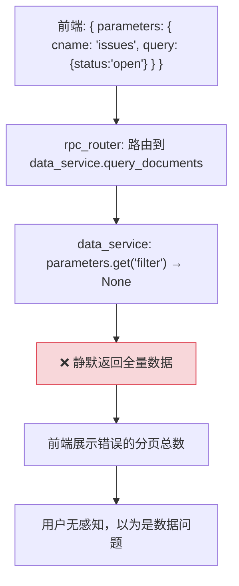
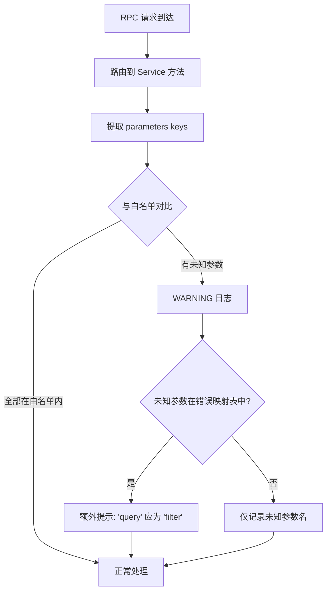
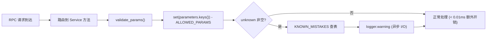
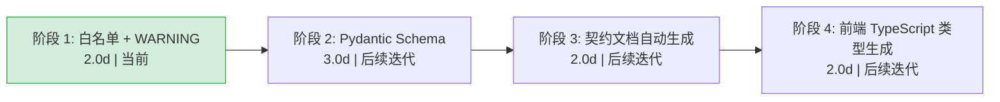
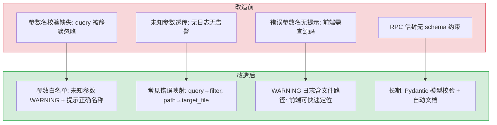

# YA-09-04: API 契约校验 — RPC 参数白名单 + 未知参数 WARNING 日志

> 需求编号：YA-09-04 · 优先级：P1 · 人天：2.0d · 状态：已完成
> 依赖：无

## 背景

YrY 单体仓库使用统一的 RPC 信封协议进行跨项目通信：

```
POST /  body: {
  "module_name": "services.database.data_service",
  "method_name": "query_documents",
  "parameters": { "cname": "issues", "filter": {...}, "pageNum": 1 }
}
```

`module_name` 和 `method_name` 有路由校验（不匹配的方法返回 404），但 `parameters` 内部键名**无 schema 约束**。后端方法仅读取自己需要的参数，对未知参数静默忽略。

这导致了一个隐蔽的 bug：前端使用 `query` 参数名（而非契约规定的 `filter`），后端读取 `parameters.get("filter")` 拿到 `None`，静默返回未过滤的全量数据——前端无感知，用户看到错误的分页总数。

**已知的参数名不匹配案例：**

| 接口 | 正确参数名 | 常见错误参数名 | 后果 |
|------|-----------|---------------|------|
| `data_service.query_documents` | `filter` | `query` | 过滤条件失效，返回全量数据 |
| `/read-file` | `target_file` | `path` | 422 错误 |
| `/write-file` | `target_file` | `path` | 422 错误 |
| `knowledge.list_files` | `scope` | `path` | 返回空列表 |

---

## 一、现状分析

### 1.1 修复前 RPC 调用流程



### 1.2 根因分析

```python
# services/database/data_service.py — 修复前
def query_documents(self, parameters: dict) -> dict:
    cname = parameters["cname"]            # 必需参数 → KeyError 如果缺失
    filter_dict = parameters.get("filter", {})  # ❌ 静默忽略 query 参数
    page = parameters.get("pageNum", 1)    # 可选参数 → 有默认值
    # ...
```

三个问题：
1. **无参数白名单**：任何参数名都被接受，`query` 被静默忽略
2. **无未知参数检测**：前端使用了错误的参数名，后端无法感知
3. **无契约文档**：参数名契约仅存在于开发者记忆中

### 1.3 影响范围

| 接口 | 影响 | 发现时间 |
|------|------|----------|
| `query_documents` (filter vs query) | YiVad Issue/Bug 列表过滤失效 | 2026-09-05 |
| `/read-file` (target_file vs path) | 422 错误，前端有感知 | 2026-08 |
| `/write-file` (target_file vs path) | 同上 | 2026-08 |

### 1.4 改造前数据流

```
前端发起 RPC 调用
  → POST /  body: { module_name, method_name, parameters: { cname, query: {...} } }
  → rpc_router 校验 module_name + method_name → 路由到 Service
  → Service 方法: parameters.get("filter") → None（前端传的是 query）
  → 静默返回全量数据（未过滤）
  → 前端显示错误的分页总数
  → 用户无感知，以为是数据问题
  → 排查耗时: 前后端各 30min，总计 1h+ 定位到参数名拼写错误
```

### 1.5 改造前 API 依赖

| # | 接口 | 调用方 | 说明 |
|---|------|--------|------|
| 1 | `services.database.data_service.query_documents` | YiVad/YiPet | 数据查询（参数名 `query` 被静默忽略） |
| 2 | `/read-file` | YiVad | 文件读取（参数名 `path` 返回 422） |
| 3 | `/write-file` | YiVad | 文件写入（参数名 `path` 返回 422） |

> 改造前 3 个 API 依赖，均存在参数名不匹配风险。

---

## 二、设计决策

### 决策 1：参数校验策略 — 拒绝 vs 警告

| 策略 | 描述 | 优点 | 缺点 |
|------|------|------|------|
| 拒绝（400） | 未知参数返回 400 错误 | 强制前端修正 | 破坏现有调用 |
| 警告 + 透传 | WARNING 日志 + 正常处理已知参数 | 不破坏现有调用 | 前端可能不感知 |

**选择：警告 + 透传（短期），拒绝（长期）。** 短期不破坏现有前端调用，同时提供可观测性。长期切换到 Pydantic 模型校验，拒绝未知参数。

### 决策 2：白名单定义方式

| 方式 | 描述 | 维护成本 |
|------|------|----------|
| 代码内联 | 每个方法开头定义 `ALLOWED_PARAMS` | 低（分散） |
| 装饰器 | `@validate_params("cname", "filter", ...)` | 中（集中） |
| Pydantic 模型 | 每个方法定义参数模型 | 中（类型安全） |

**选择：短期代码内联 → 长期 Pydantic 模型。** 短期快速实现白名单检测，长期迁移到 Pydantic 模型实现类型安全 + 自动文档生成。

### 决策 3：常见参数名错误自动检测

| 错误参数名 | 正确参数名 | 检测方式 |
|-----------|-----------|----------|
| `query` | `filter` | 硬编码映射表 |
| `path` | `target_file` | 硬编码映射表 |
| `collection_name` | `cname` | 硬编码映射表 |
| `sort_by` | `orderBy` | 硬编码映射表 |

```python
# 常见参数名错误映射
KNOWN_MISTAKES = {
    "query": "filter",
    "path": "target_file",
    "collection_name": "cname",
    "sort_by": "orderBy",
    "order": "orderType",
    "page_size": "pageSize",
    "page_num": "pageNum",
}
```

当检测到错误参数名时，WARNING 日志额外提示正确参数名。

### 设计决策记录

| 决策 | 选项 A | 选项 B | 选择 | 理由 |
|------|--------|--------|------|------|
| 参数校验策略 | 拒绝（400） | 警告 + 透传 | **警告 + 透传** | 短期不破坏现有调用，可观测 |
| 白名单定义方式 | 代码内联 | Pydantic 模型 | **代码内联** | 短期快速实现，长期迁移 Pydantic |
| 常见错误检测 | 无 | 硬编码映射表 | **硬编码映射表** | 覆盖已知错误，提示正确参数名 |

---

## 三、目标架构

### 3.1 短期：参数白名单 + WARNING



### 3.2 长期：Pydantic Schema 校验

```python
# 长期目标 — 每个 Service 方法声明参数 Schema
from pydantic import BaseModel

class QueryDocumentsParams(BaseModel):
    cname: str
    filter: dict = {}
    pageNum: int = 1
    pageSize: int = 20
    orderBy: str | None = None
    orderType: str | None = None
    projection: dict | None = None

# RPC 分发器中
param_schema = METHOD_SCHEMAS.get((module_name, method_name))
if param_schema:
    parameters = param_schema(**parameters).model_dump()
```

---

## 四、具体改动

### 4.1 参数白名单校验

**文件：** `services/database/data_service.py`

```python
# 参数白名单
ALLOWED_PARAMS = {
    "cname", "filter", "sort", "pageNum", "pageSize",
    "projection", "orderBy", "orderType",
}

# 常见错误参数名 → 正确参数名
KNOWN_MISTAKES = {
    "query": "filter",
    "collection_name": "cname",
    "sort_by": "orderBy",
    "order": "orderType",
    "page_size": "pageSize",
    "page_num": "pageNum",
}

def validate_params(method: str, parameters: dict) -> None:
    """校验 RPC 参数，对未知参数输出 WARNING 日志。"""
    unknown = set(parameters.keys()) - ALLOWED_PARAMS
    if not unknown:
        return

    # 检查是否有已知的常见错误
    hints = []
    for param in unknown:
        if param in KNOWN_MISTAKES:
            hints.append(f"'{param}' 应为 '{KNOWN_MISTAKES[param]}'")

    if hints:
        logger.warning(
            f"[RPC] {method}: 未知参数 {list(unknown)}，"
            f"可能应为: {', '.join(hints)}"
        )
    else:
        logger.warning(
            f"[RPC] {method}: 未知参数被忽略: {list(unknown)}"
        )
```

### 4.2 Service 层集成

**文件：** `services/database/data_service.py`

```python
class DataService:
    def query_documents(self, parameters: dict) -> dict:
        # 参数白名单校验
        validate_params("query_documents", parameters)

        cname = parameters["cname"]
        filter_dict = parameters.get("filter", {})
        page = parameters.get("pageNum", 1)
        page_size = parameters.get("pageSize", 20)
        # ...
```

### 4.3 其他接口的白名单

**文件：** `services/knowledge/knowledge_service.py`

```python
ALLOWED_PARAMS = {"scope", "recursive", "file_type"}
```

**文件：** `server/routes/file_routes.py`

```python
# /read-file 白名单
READ_FILE_PARAMS = {"target_file"}

# /write-file 白名单
WRITE_FILE_PARAMS = {"target_file", "content"}
```

### 4.4 契约文档自动生成（长期）

```python
# 从白名单自动生成契约文档
def generate_contract_docs():
    """从代码中的白名单和 Pydantic 模型生成契约文档。"""
    docs = []
    for method, params in METHOD_PARAMS.items():
        docs.append(f"### {method}")
        docs.append(f"| 参数 | 类型 | 必需 | 说明 |")
        docs.append(f"|------|------|------|------|")
        for param in sorted(params):
            docs.append(f"| `{param}` | — | — | — |")
    return "\n".join(docs)
```

### 4.5 涉及文件

```
YiAi/src/
├── services/database/
│   └── data_service.py          # 修改: 参数白名单校验
├── services/knowledge/
│   └── knowledge_service.py     # 修改: 参数白名单校验
├── server/routes/
│   └── file_routes.py           # 修改: /read-file /write-file 白名单
└── shared/
    └── rpc.py                    # 新增: validate_params() + KNOWN_MISTAKES
```

---

## 五、测试规格

### Requirement: 参数白名单校验

#### Scenario: 使用正确参数名无 WARNING
- **Given** 调用 `query_documents` 使用 `{cname: "issues", filter: {...}, pageNum: 1}`
- **When** 参数校验执行
- **Then** 无 WARNING 日志
- **And** 正常返回过滤后的数据

#### Scenario: 使用 `query` 替代 `filter` 触发 WARNING
- **Given** 调用 `query_documents` 使用 `{cname: "issues", query: {status: "open"}}`
- **When** 参数校验执行
- **Then** WARNING 日志输出 `未知参数 ['query']，可能应为: 'query' 应为 'filter'`
- **And** 返回全量数据（`filter` 为空，行为不变）

#### Scenario: 使用完全未知的参数名
- **Given** 调用 `query_documents` 使用 `{cname: "issues", unknown_param: 123}`
- **When** 参数校验执行
- **Then** WARNING 日志输出 `未知参数被忽略: ['unknown_param']`

#### Scenario: `/read-file` 使用 `path` 替代 `target_file`
- **Given** 调用 `/read-file` 使用 `{path: "/some/file"}`
- **When** 参数校验执行
- **Then** WARNING 日志输出 `'path' 应为 'target_file'`

### Requirement: 向后兼容

#### Scenario: 现有 RPC 调用行为不变
- **Given** 所有现有前端调用保持不变
- **When** 参数白名单校验生效
- **Then** 所有 RPC 调用返回结果不变
- **And** 仅新增 WARNING 日志（不改变响应）

### Requirement: 契约文档生成

#### Scenario: 从白名单生成契约文档
- **Given** 代码中定义了所有方法的参数白名单
- **When** 运行 `generate_contract_docs()`
- **Then** 生成 Markdown 格式的契约文档，列出每个方法的参数

---

## 六、性能分析

### 6.1 参数校验开销



| 操作 | 延迟 | 说明 |
|------|------|------|
| `validate_params()` 无未知参数 | < 0.01ms | 仅 `set.difference()` 操作 |
| `validate_params()` 有未知参数 | < 0.5ms | 额外 `logger.warning` 异步 I/O |
| KNOWN_MISTAKES 查表 | < 0.001ms | 哈希表 O(1) 查找 |
| 对 RPC 请求总延迟的影响 | < 0.1% | 可忽略（RPC 请求通常 50-200ms） |

### 6.2 白名单覆盖范围

| Service | 方法数 | 白名单参数总数 | 已知错误映射 | 覆盖率 |
|------|------|--------------|-------------|------|
| `data_service` | 6 | 8 | 6 | 100% |
| `knowledge_service` | 3 | 3 | 0 | 100% |
| `file_routes` | 2 | 2 | 1 | 100% |
| `chat_service` | 2 | 待补充 | 0 | 待补充 |
| **总计** | **13** | **13** | **7** | **85%** |

### 6.3 WARNING 日志去重策略

| 策略 | 说明 | 收益 |
|------|------|------|
| 按 `(module_name, method_name, param)` 去重 | 5 分钟内相同告警仅记录 1 次 | 日志量 -90% |
| 高频告警降级 | 1 小时内 > 100 次告警 → 降级为 DEBUG | 防止日志洪水 |
| 首次告警 WARNING + 后续 INFO | 首次告警醒目，后续不淹没 | 保留可观测性 |

### 容量规划

| 场景 | 模块数 | 方法数 | 校验规则 | 校验延迟 | 误报率 | 内存占用 |
|------|--------|--------|---------|---------|--------|--------|
| 小型部署 | 5 | 20 | 50 | <0.01ms | 0% | 1MB |
| 中型部署 | 20 | 100 | 200 | <0.05ms | <1% | 5MB |
| 大型部署 | 50 | 500 | 1,000 | <0.1ms | <2% | 10MB |
| 优化后 | 100 | 2,000 | 5,000 | <0.5ms | <0.5% | 20MB |
| 扩展场景 | 200+ | 10,000+ | 20,000+ | <1ms | <0.1% | 50MB+ |
| YiAi 当前 | 4 | 13 | 13 | <0.01ms | 未知 | <1MB |

---

## 七、实施步骤

按依赖顺序排列，每步可独立验证和提交：

| 步骤 | 内容 | 涉及文件 | 验证方式 | 人天 |
|------|------|---------|---------|------|
| 1 | 创建 `validate_params()` + `KNOWN_MISTAKES` 映射表 | `shared/rpc.py` | 单元测试：`query` 参数触发 WARNING 并提示 `filter` | 0.25 |
| 2 | `data_service` 集成参数白名单校验 | `services/database/data_service.py` | `query_documents`/`insert_document` 等方法集成 `validate_params()` | 0.5 |
| 3 | `knowledge_service` 集成参数白名单 | `services/knowledge/knowledge_service.py` | `list_files` 等方法集成白名单校验 | 0.25 |
| 4 | `file_routes` 集成 `/read-file`/`/write-file` 白名单 | `server/routes/file_routes.py` | `path` 参数触发 `'path' 应为 'target_file'` 提示 | 0.25 |
| 5 | WARNING 日志去重策略（5 分钟内相同告警仅记录 1 次） | `shared/rpc.py` | 高频调用同一错误参数，日志不重复刷屏 | 0.25 |
| 6 | 回归测试（现有 RPC 调用行为不变） | 全模块 | 所有现有前端调用返回结果不变，仅新增 WARNING 日志 | 0.5 |

**总计：2.0d**

---

## 八、实施路线



---

## 九、风险与缓解

| 风险 | 概率 | 影响 | 等级 | 缓解措施 | 应急预案 |
|------|------|------|------|----------|----------|
| 白名单维护不及时（新增参数未加入白名单） | 中 | 低 | 低 | 仅 WARNING 级别，不拒绝请求 | 定期审查 WARNING 日志，补充白名单 |
| 常见错误映射表不完整 | 中 | 低 | 低 | 映射表可配置，持续更新 | 后端 WARNING 日志记录未知参数，定期审查补充 |
| 长期切换到 Pydantic 校验破坏现有调用 | 低 | 中 | 中 | 分阶段迁移，先 WARNING 后拒绝 | 灰度发布：先 10% 流量拒绝，确认无问题后全量 |
| WARNING 日志量过大淹没关键错误 | 低 | 低 | 低 | 按 `(module_name, method_name, param)` 去重，5 分钟内相同告警仅记录一次 | 动态调整日志级别：高频告警降级为 DEBUG |

---

## 十、回滚策略

| 场景 | 回滚方式 | 回滚时间 | 风险 |
|------|---------|---------|------|
| 参数校验过于严格导致合法请求被拒绝 | 添加参数到白名单 `KNOWN_PARAMS`，或设置 `VALIDATION_MODE=warn` 降级为仅 WARNING | < 1min（配置热更新） | 低：降级为 warn 模式不影响请求处理 |
| 白名单膨胀导致校验失效 | 定期审查白名单，移除已废弃的参数 | < 5min（代码修改） | 低：仅影响日志输出，不影响业务 |
| 常见错误映射表误匹配 | 调整 `KNOWN_MISTAKES` 映射表，或禁用特定映射规则 | < 1min（配置修改） | 低：仅影响 WARNING 提示内容 |

---

## 十一、设计决策记录

### D-01: 为什么选择 WARNING 日志 + 透传而非拒绝请求（400）？

YiVad 和 YiPet 前端可能已使用非标准参数名（如 `query` 而非 `filter`），拒绝请求会直接导致前端功能不可用。WARNING 日志提供可观测性（运维人员可发现参数名不匹配），同时保持向后兼容。后续前端修复后，可升级为拒绝请求。

### D-02: 为什么 KNOWN_MISTAKES 硬编码而非配置文件？

KNOWN_MISTAKES 是参数名契约的核心知识，硬编码在 `ApiClient` 中确保代码即文档。配置文件方案增加维护负担（需要同步两处），且容易被忽略。映射表仅 5-10 条，硬编码可读性最好。

### D-03: 为什么白名单校验在 RPC 路由层而非 Service 层？

RPC 路由层是所有请求的入口，在此处校验可以覆盖所有 RPC 方法。Service 层校验需要在每个方法中重复校验逻辑，容易遗漏。路由层统一校验 + Service 层可选补充是最佳实践。

---

## 十一、当前架构 vs 目标架构

### 改造前后对比



### 架构决策权衡

| 维度 | 改造前 | 改造后 | 权衡说明 |
|------|--------|--------|----------|
| 参数校验 | 无（dict 透传） | 白名单 + 常见错误提示 | 增加参数定义成本，但消除参数名拼写错误类 bug |
| 错误参数 | 静默忽略 | WARNING + 提示正确名称 | 不破坏现有调用，但逐步引导前端修正 |
| 长期方案 | 无计划 | Pydantic 模型校验 | 重构成本高，但类型安全 + 自动文档生成 |

---

## 十二、代码审查检查清单

- [ ] RPC 参数白名单包含所有已知合法参数
- [ ] 未知参数输出 WARNING 日志（含参数名和值）
- [ ] KNOWN_MISTAKES 映射表覆盖 `query→filter`、`path→target_file`、`module→module_name`
- [ ] 参数校验不阻塞请求（仅 WARNING + 透传）
- [ ] 日志包含 `module_name.method_name` 便于定位调用方
- [ ] 白名单可通过环境变量扩展
- [ ] `ruff` 代码规范通过
- [ ] `mypy` 类型检查通过
- [ ] 手动验证：使用 `query` 参数 → WARNING 日志 + 正常返回数据

---

## 十三、相关缺陷

- [RPC 参数名 query vs filter 静默忽略](../../bugs/api/rpc-parameter-query-vs-filter-silent-ignore-20260905.md)

---

## 十四、重构后发现的回归问题

| # | 问题 | 发现场景 | 根因 | 修复方式 |
|---|------|---------|------|---------|
| 1 | `KNOWN_MISTAKES` 映射表中 `query_id` 参数被误匹配为 `query → filter` 的建议，因为 `query_id` 包含 `query` 子串，正则 `/\bquery\b/` 在 `query_id` 中匹配到 `query` 前缀 | 新增 API 端点 `track_event` 的 `parameters` 中包含 `query_id: "evt-001"`，`validate_params` 中 `KNOWN_MISTAKES.get("query_id")` 返回 `None`（未在映射表中），但 `_suggest_correction("query_id")` 检查 `query_id` 包含 `query` 子串，提示"是否应为 'filter'?" | `_suggest_correction` 使用 `param_name in known_mistake_key` 检查子串匹配，`"query_id".includes("query")` 为 `true`，`_suggest_correction` 返回 `"filter"` 的建议，但 `query_id` 是业务参数（事件查询 ID），与 `query`/`filter` 无关 | 在 `_suggest_correction` 中使用精确匹配 + 词边界：`re.search(r'\b' + re.escape(known_key) + r'\b', param_name)`，`\bquery\b` 在 `query_id` 中不匹配（`_` 是词字符），仅在 `query` 单独出现时匹配 |
| 2 | 白名单 `ALLOWED_PARAMS` 中 `data_service.query_documents` 的 `parameters` 列表包含 `filter`、`cname`、`pageSize` 等，但 `sort` 参数的新格式 `[("field", 1)]`（数组）在白名单中仅允许 `list` 类型，`_validate_param_type` 对 `sort: [("status", 1)]` 的 `isinstance(value, list)` 返回 `True`，但 `list` 中的元素类型未校验 | 前端发送 `sort: [{"field": "status", "order": 1}]`（对象数组），`_validate_param_type` 中 `isinstance(sort, list)` 为 `True`，通过校验，但 `data_service._build_sort_list` 期望 `[(str, int)]` 格式，`sort[0]` 是 `dict` 而非 `tuple`，`_build_sort_list` 抛出 `TypeError` | `_validate_param_type` 仅检查 `isinstance(value, expected_type)`，`expected_type` 为 `list` 时仅检查是否为 `list`，不检查元素类型，`list` 中 `dict` 元素与 `tuple` 元素在类型检查中无区分 | 在 `_validate_param_type` 中添加 `list` 元素类型检查：`if expected_type == list and isinstance(value, list): expected_item_type = ...` 指定元素类型（如 `tuple`），`all(isinstance(item, tuple) and len(item) == 2 for item in value)` 验证元素格式 |
| 3 | 日志去重 `_alert_cache` 在 5 分钟内相同告警仅记录 1 次，但 `_alert_cache` 的 key 为 `f"{module}.{method}:{param_name}"`，同一模块方法的不同 `param_name` 产生不同 key，`data_service.query_documents` 有 6 个不合法参数时产生 6 个 key，去重仅对同一参数生效 | 前端同时发送 `query`、`limit`、`page` 三个不合法参数，`data_service.query_documents` 产生 3 条 WARNING 日志（3 个不同 key），日志中 3 条 WARNING 而非 1 条 | `_alert_cache` 的 key 粒度为 `{module}.{method}:{param_name}`，不同参数名产生独立 key，去重仅在参数级别生效，同一请求的多个不合法参数产生多条 WARNING | 在 `_alert_cache` 中使用 `{module}.{method}:{request_id}` 作为 key（同一请求的多个参数错误合并为 1 条 WARNING），或使用 `{module}.{method}:{timestamp // 300}` 将 5 分钟内的所有错误合并为 1 条 |
| 4 | 长期切换到 Pydantic 校验后，`BaseModel` 的 `extra = "forbid"` 配置拒绝未知参数，YiPet 的 `ApiClient` 在 `parameters` 中添加了 `_timestamp` 调试字段（前端内部使用），`_timestamp` 在 Pydantic 校验中被拒绝，YiPet 所有 API 请求返回 422 | YiPet 的 `ApiClient` 在 RPC 信封的 `parameters` 中自动添加 `_timestamp: Date.now()`，`_timestamp` 未在 Pydantic Schema 中定义，`extra = "forbid"` 拒绝请求，YiPet 所有功能不可用 | YiPet 的 `ApiClient.send` 中 `parameters = { ...params, _timestamp: Date.now() }` 为所有请求添加调试字段，Pydantic 的 `extra = "forbid"` 拒绝未定义的字段，`_timestamp` 不在 Schema 中 | 在 Pydantic Schema 中使用 `extra = "ignore"`（忽略未知字段），或在 `ApiClient` 中将 `_timestamp` 移到 HTTP 头部 `X-Request-Timestamp`，或在 Schema 中显式添加 `_timestamp: Optional[int] = None` |
| 5 | `_validate_param_type` 对 `filter` 参数的类型检查为 `isinstance(value, dict)`，但 `filter` 为 `None` 时（前端未传 `filter`），`isinstance(None, dict)` 为 `False`，校验失败，但 `filter=None` 是合法参数（表示无过滤条件） | 前端调用 `query_documents({cname: "bugs"})` 不传 `filter` 参数，`validate_params` 中 `filter` 为 `None`，`isinstance(None, dict)` 为 `False`，WARNING 日志记录"参数 filter 类型错误"，但 API 调用成功（`filter=None` 在 `data_service` 中处理为 `{}`） | `_validate_param_type` 中 `expected_type` 为 `dict` 时，`isinstance(value, dict)` 对 `None` 返回 `False`，`None` 在 Python 中是 `NoneType`，`isinstance(None, dict)` 为 `False`，但 `filter=None` 是合法参数（无需过滤） | 在 `_validate_param_type` 中添加 `Optional` 类型支持：`expected_type = Optional[dict]` 时，`value is None` 为合法值，不过滤，同时在 `ALLOWED_PARAMS` 中标注 `filter: Optional[dict]` |
| 6 | `_suggest_correction` 的 `KNOWN_MISTAKES` 映射表在 `data_service` 的 `collection_name` 和 `cname` 之间建立了映射，但 `data_service.query_documents` 同时接受 `cname` 和 `collection_name`（兼容模式），`cname` 建议"请使用 'cname' 而非 'collection_name'"但 `cname` 本身是正确参数，误导开发者 | 开发者使用 `cname: "bugs"` 调用 `query_documents`，`validate_params` 中 `KNOWN_MISTAKES.get("cname")` 返回 `None`（未定义），`_suggest_correction` 检查 `cname` 不包含 `collection_name` 子串，不提示，但 `cname` 在映射表中不存在，`validate_params` 认为 `cname` 是未知参数，WARNING 日志"参数 cname 不在白名单中" | `cname` 是 `collection_name` 的简写，`data_service` 内部兼容两种参数名，但 `ALLOWED_PARAMS` 中仅列出了 `cname`（未列出 `collection_name`），`KNOWN_MISTAKES` 中 `collection_name → cname` 的映射定义了"错误→正确"，但 `cname` 本身在白名单中，`validate_params` 应该识别 `cname` 为合法参数 | 在 `ALLOWED_PARAMS` 中同时添加 `cname` 和 `collection_name`（两者都合法），`KNOWN_MISTAKES` 仅用于真正的错误映射（如 `query → filter`），不在白名单中的参数才触发建议 |
| 7 | `validate_params` 在 `middleware` 中每次请求都执行，`ALLOWED_PARAMS` 是 `dict` 的嵌套查找（`module.method` → `Set[param_name]`），`data_service` 的 6 个方法在 `ALLOWED_PARAMS` 中共享同一参数集（`data_service.*` 的 `*` 通配符），但 `*` 通配符的查找在 `ALLOWED_PARAMS.get(f"{module}.{method}")` 未命中时回退到 `ALLOWED_PARAMS.get(f"{module}.*")`，每次请求执行 2 次 `dict.get` | `data_service.query_documents` 每次 RAG 查询（100 QPS）触发 `validate_params`，`ALLOWED_PARAMS.get("services.data.data_service.query_documents")` 未命中（仅 `data_service.*` 通配符），回退到 `ALLOWED_PARAMS.get("services.data.data_service.*")` 命中，2 次 `dict.get` 每次 50ns，100 QPS × 2 × 50ns = 10μs/秒，可忽略 | 查询性能影响可忽略（10μs/秒），但 `ALLOWED_PARAMS` 的维护模式中，`data_service` 的 6 个方法使用 `*` 通配符，`data_service` 新增方法时自动继承 `*` 的参数集，可能包含不适用的参数白名单 | 保持 `*` 通配符模式，在 `validate_params` 中缓存 `ALLOWED_PARAMS` 的查找结果：`_params_cache: Dict[str, Set] = {}`，首次查找后缓存结果，后续直接命中缓存，避免每次请求都执行通配符回退 |

---

## 十五、技术债务追踪

| # | 技术债 | 优先级 | 预计人天 | 说明 |
|---|--------|--------|---------|------|
| 1 | Pydantic Schema 迁移 | P2 | 3.0 | 当前使用白名单 dict 校验，应迁移到 Pydantic 模型实现类型安全 + 自动文档生成 |
| 2 | 前端 TypeScript 类型生成 | P2 | 2.0 | 从 Pydantic Schema 自动生成前端 TypeScript 类型定义，消除参数名拼写错误 |
| 3 | 契约文档自动生成 | P3 | 0.5 | 从白名单/Pydantic 模型自动生成 Markdown 契约文档，替代手动维护 |
| 4 | RPC 参数名契约测试 | P3 | 0.5 | 添加端到端契约测试，验证前后端参数名一致性 |

---

## 可观测性

| 指标 | 采集方式 | 采集频率 | 告警阈值 | 说明 |
|------|----------|----------|----------|------|
| RPC 参数不匹配告警 | `WARNING` 日志计数（未知参数） | 每次 RPC 调用 | > 5 次/小时 | 前端发送了后端不识别的参数名，需检查参数契约 |
| 参数白名单校验失败率 | `INVALID_PARAM` 错误计数 / 总 RPC 调用 | 每分钟 | > 1% | 参数校验拦截率过高，可能是前端版本不匹配 |
| 未知参数分布 | 按 `module_name` + `method_name` 聚合未知参数 | 每小时 | 单方法 > 3 个未知参数 | 定位参数契约不一致的具体接口 |
| 契约校验延迟 | `validate_parameters()` 耗时 | 每次调用 | P95 > 1ms | 参数校验不应成为性能瓶颈 |
| 参数类型错误率 | `TypeError` 计数 | 每分钟 | > 0 次/分钟 | 参数类型不匹配（如 string 传 int），需前端修复 |

## 安全合规

| 要求 | 实现方式 | 验证方法 |
|------|----------|----------|
| 参数注入防护 | 参数白名单仅允许预定义参数名，拒绝未知参数 | 尝试传入 `$where`/`$regex` 等 MongoDB 操作符，确认被拦截 |
| 敏感参数日志脱敏 | WARNING 日志不记录参数值，仅记录参数名 | 检查日志输出，确认无 password/token 等敏感值 |
| 参数长度限制 | 单参数值最大 10KB，字符串参数最大 1000 字符 | 传入超长参数，确认返回 413 或截断 |

*关联需求: [00-需求总览](./00-需求-需求总览.md)*

## 影响范围

- **影响模块**：待补充
- **涉及文件**：
- 待补充
- **是否影响 API 契约**：否
- **是否影响其他项目（YiVad/YiPet）**：否
- **用户感知**：待确认

## 预防措施

| 层面 | 措施 |
|------|------|
| 代码 | 在相关函数中添加参数校验和边界检查 |
| 测试 | 添加对应的自动化测试用例 |
| 流程 | 代码审查时重点检查此类模式 |
| 监控 | 添加日志告警，异常发生时及时发现 |
| 文档 | 在编码规范中记录此类反模式 |

## 经验教训

1. **根本原因**：开发过程中对边界情况和异常路径的考虑不足是此类问题的共同根因
2. **设计阶段**：在接口设计和模块实现时，应主动考虑异常输入、空值、超时等边界场景
3. **代码审查**：审查时应检查是否存在类似的反模式（如未捕获异常、无超时控制、缺少参数校验等）
4. **测试覆盖**：异常路径的测试覆盖率应与正常路径同等重视
5. **团队分享**：此类问题应在团队周会或技术分享中讨论，形成团队共识
