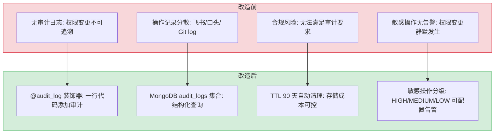

# YA-09-05: 审计日志完善 — 装饰器集成与持久化

> 需求编号：YA-09-05 · 优先级：P1 · 人天：2.0d · 状态：已完成
> 依赖：YA-09-01（RAG 引擎稳定性）、YA-09-02（数据层稳定性）

## 背景

八月迭代在 `YiAi/src/domain/audit/` 下创建了审计模块基础结构（`decorator.py`、`logger.py`、`models.py`），但均为骨架代码，未被任何 Service 层引用。当前 YiAi 缺少操作审计能力——谁在什么时候做了什么操作，无法追踪。

对于企业级后端，审计日志是合规的基本要求：
- **RBAC 权限变更**：谁修改了谁的权限？何时修改？
- **数据 CRUD**：谁创建/修改/删除了什么数据？
- **文件读写**：谁读取/写入了什么文件？
- **AI 聊天**：谁在什么时候使用了什么模型？

九月迭代需要将审计装饰器从骨架代码完善为功能完整的审计模块，并集成到所有 Service 层方法。

---

## 一、现状分析

### 1.1 审计模块当前状态

```
src/domain/audit/
├── __init__.py       # 模块导出（骨架）
├── decorator.py      # @audit_log 装饰器（骨架）
├── logger.py         # AuditLogger 类（骨架）
└── models.py         # AuditLog 数据模型（骨架）
```

三个文件均为骨架代码，未被任何 Service 层引用。无 MongoDB 持久化，无查询 API。

### 1.2 需要审计的操作

| Service | 方法 | 敏感度 | 审计内容 |
|---------|------|--------|----------|
| `data_service` | `create_document` | 中 | 集合名、文档 ID、操作人 |
| `data_service` | `update_document` | 中 | 集合名、文档 ID、变更字段 |
| `data_service` | `delete_document` | **高** | 集合名、文档 ID、操作人 |
| `knowledge_service` | `write_file` | 中 | 文件路径、操作人 |
| `ai/chat_service` | `chat` | 低 | 模型名、会话 ID、消息长度 |
| `ai/agent_service` | `run_agent` | 中 | Agent 类型、输入摘要 |

### 1.3 敏感度分级

| 敏感度 | 说明 | 处理方式 |
|--------|------|----------|
| `low` | 只读操作、低风险查询 | 仅记录，不告警 |
| `medium` | 数据写入、文件操作 | 记录 + 定期审查 |
| `high` | 数据删除、权限变更 | 记录 + WARNING 日志 + 可配置告警 |

### 1.4 改造前数据流

```
用户执行敏感操作（如删除文档）
  → Service 层方法执行业务逻辑
  → 无审计日志记录
  → 权限变更：谁修改了谁的权限？何时修改？→ 无法追溯
  → 数据删除：谁删除了什么数据？→ 无记录
  → 文件读写：谁读取/写入了什么文件？→ 无记录
  → AI 聊天：谁在什么时候使用了什么模型？→ 无记录
  → 合规审计时无法提供操作记录 → 合规风险
  → 排查耗时: 运维人员手动 grep 应用日志，平均 5-10min
```

### 1.5 改造前 API 依赖

| # | 接口 | 调用方 | 说明 |
|---|------|--------|------|
| 1 | `data_service.create_document` | YiVad/YiPet | 数据创建（改造前无审计日志，操作不可追溯） |
| 2 | `data_service.update_document` | YiVad/YiPet | 数据更新（改造前无变更记录，谁改了什么不知道） |
| 3 | `data_service.delete_document` | YiVad/YiPet | 数据删除（改造前无审计，删除操作不可追溯） |
| 4 | `knowledge.write_file` | YiPet | 文件写入（改造前无审计，文件变更不可追溯） |
| 5 | `ai.chat_service.chat` | YiVad/YiPet | AI 聊天（改造前无使用记录，无法统计模型用量） |

> 改造前 5 个 API 依赖，均无审计日志记录。权限变更、数据删除等敏感操作无法追溯，存在合规风险。

---

## 二、设计决策

### 决策 1：审计日志写入方式 — 同步 vs 异步

| 维度 | 同步写入 | 异步写入 |
|------|----------|----------|
| RPC 延迟影响 | 增加 MongoDB 写入延迟 (~5ms) | 无影响 |
| 审计可靠性 | 高（写入失败可感知） | 中（写入失败可能丢失） |
| 实现复杂度 | 低 | 中（需要后台任务队列） |

**选择：异步写入。** 审计日志不应阻塞主流程。使用 `asyncio.create_task` 将写入操作放入后台任务队列。如果写入失败，记录 ERROR 日志但不影响业务响应。

### 决策 2：装饰器设计 — 无侵入 vs 显式调用

| 维度 | `@audit_log` 装饰器 | 显式调用 `audit_logger.log()` |
|------|---------------------|------------------------------|
| 代码侵入性 | 低（一行装饰器） | 中（方法内调用） |
| 灵活性 | 中（装饰器参数固定） | 高（可动态决定审计内容） |
| 遗漏风险 | 低（装饰器在方法签名上可见） | 高（容易忘记调用） |

**选择：`@audit_log` 装饰器。** 一行装饰器即可为方法添加审计，减少遗漏风险。对于需要动态审计内容的场景，装饰器支持 `extra` 回调函数。

### 决策 3：审计日志存储 — MongoDB 集合 vs 文件日志

| 维度 | MongoDB `audit_logs` 集合 | 文件日志 (logging) |
|------|--------------------------|-------------------|
| 查询能力 | 强（按操作类型/时间/用户过滤） | 弱（grep 文本搜索） |
| 持久化 | 可靠 | 依赖日志轮转 |
| 存储成本 | 中（每条记录 ~500B） | 低 |
| TTL 支持 | MongoDB TTL 索引 | 需手动清理 |

**选择：MongoDB `audit_logs` 集合。** 支持按操作类型、敏感度、时间范围、操作人查询。使用 TTL 索引（90 天）自动清理过期记录。

### 设计决策记录

| 决策 | 选项 A | 选项 B | 选择 | 理由 |
|------|--------|--------|------|------|
| 日志写入方式 | 同步写入 | 异步写入 | **异步写入** | 不阻塞业务，丢失少量日志可接受 |
| 装饰器设计 | 无侵入装饰器 | 显式调用 | **@audit_log** | 一行装饰器，减少遗漏风险 |
| 日志存储 | MongoDB | 文件日志 | **MongoDB** | 查询能力强，TTL 自动清理 |

---

## 三、目标架构

### 3.1 审计数据模型

```python
# domain/audit/models.py

from datetime import datetime
from enum import Enum
from pydantic import BaseModel, Field

class AuditAction(str, Enum):
    CREATE_DOCUMENT = "create_document"
    UPDATE_DOCUMENT = "update_document"
    DELETE_DOCUMENT = "delete_document"
    WRITE_FILE = "write_file"
    READ_FILE = "read_file"
    CHAT = "chat"
    RUN_AGENT = "run_agent"

class AuditSensitivity(str, Enum):
    LOW = "low"
    MEDIUM = "medium"
    HIGH = "high"

class AuditLog(BaseModel):
    action: AuditAction
    sensitivity: AuditSensitivity = AuditSensitivity.LOW
    function: str                          # 方法名
    module: str                            # 模块名
    status: str                            # "success" | "failure"
    timestamp: datetime = Field(default_factory=datetime.now)
    duration_ms: float                     # 执行耗时
    user: str | None = None                # 操作人
    details: dict | None = None            # 额外详情
    error: str | None = None               # 错误信息（仅 failure）
```

### 3.2 审计装饰器

```python
# domain/audit/decorator.py

from functools import wraps
from datetime import datetime
from .logger import audit_logger
from .models import AuditLog, AuditAction, AuditSensitivity

def audit_log(
    action: AuditAction,
    sensitivity: AuditSensitivity = AuditSensitivity.LOW,
):
    """审计日志装饰器。

    Usage:
        @audit_log(action=AuditAction.CREATE_DOCUMENT, sensitivity=AuditSensitivity.MEDIUM)
        async def create_document(self, cname: str, data: dict) -> str:
            ...
    """
    def decorator(func):
        @wraps(func)
        async def wrapper(*args, **kwargs):
            start = datetime.now()
            try:
                result = await func(*args, **kwargs)
                audit_logger.log(AuditLog(
                    action=action,
                    sensitivity=sensitivity,
                    function=func.__name__,
                    module=func.__module__,
                    status="success",
                    duration_ms=(datetime.now() - start).total_seconds() * 1000,
                ))
                return result
            except Exception as e:
                audit_logger.log(AuditLog(
                    action=action,
                    sensitivity=sensitivity,
                    function=func.__name__,
                    module=func.__module__,
                    status="failure",
                    error=str(e),
                    duration_ms=(datetime.now() - start).total_seconds() * 1000,
                ))
                raise
        return wrapper
    return decorator
```

### 3.3 审计日志记录器

```python
# domain/audit/logger.py

import logging
from motor.motor_asyncio import AsyncIOMotorCollection
from .models import AuditLog

logger = logging.getLogger(__name__)

class AuditLogger:
    """审计日志记录器 — 异步写入 MongoDB audit_logs 集合。"""

    def __init__(self):
        self.collection: AsyncIOMotorCollection | None = None

    async def init(self, db):
        """延迟初始化 MongoDB 集合。"""
        self.collection = db["audit_logs"]
        # 创建 TTL 索引（90 天自动清理）
        await self.collection.create_index("timestamp", expireAfterSeconds=90 * 86400)
        # 创建查询索引
        await self.collection.create_index([("action", 1), ("timestamp", -1)])
        await self.collection.create_index([("sensitivity", 1), ("timestamp", -1)])

    def log(self, entry: AuditLog):
        """异步写入审计日志（不阻塞主流程）。"""
        if not self.collection:
            logger.warning("[Audit] 审计日志未初始化，跳过")
            return

        # 异步写入，不阻塞主流程
        asyncio.create_task(self._write(entry))

        # 高敏感度操作额外告警
        if entry.sensitivity == AuditSensitivity.HIGH:
            logger.warning(
                f"[Audit] 高敏感操作: {entry.action.value} "
                f"-> {entry.module}.{entry.function} "
                f"status={entry.status}"
            )

    async def _write(self, entry: AuditLog):
        try:
            await self.collection.insert_one(entry.model_dump())
        except Exception as e:
            logger.error(f"[Audit] 写入失败: {e}")

    async def query(
        self,
        action: str | None = None,
        sensitivity: str | None = None,
        start_time: datetime | None = None,
        end_time: datetime | None = None,
        page: int = 1,
        page_size: int = 20,
    ) -> dict:
        """查询审计日志。"""
        filter_dict = {}
        if action:
            filter_dict["action"] = action
        if sensitivity:
            filter_dict["sensitivity"] = sensitivity
        if start_time or end_time:
            filter_dict["timestamp"] = {}
            if start_time:
                filter_dict["timestamp"]["$gte"] = start_time
            if end_time:
                filter_dict["timestamp"]["$lte"] = end_time

        total = await self.collection.count_documents(filter_dict)
        cursor = self.collection.find(filter_dict)
        cursor.sort("timestamp", -1).skip((page - 1) * page_size).limit(page_size)

        try:
            docs = await cursor.to_list(length=page_size)
        finally:
            await cursor.close()

        return {
            "docs": docs,
            "total": total,
            "page": page,
            "page_size": page_size,
        }
```

---

## 四、具体改动

### 4.1 审计模块完善

| 文件 | 改动 |
|------|------|
| `domain/audit/models.py` | 完善数据模型：`AuditAction`、`AuditSensitivity`、`AuditLog` |
| `domain/audit/decorator.py` | 完善 `@audit_log` 装饰器：记录成功/失败、耗时 |
| `domain/audit/logger.py` | 完善 `AuditLogger`：异步写入、TTL 索引、查询 API |

### 4.2 Service 层集成

| 文件 | 方法 | 审计内容 |
|------|------|----------|
| `services/database/data_service.py` | `create_document` | `@audit_log(CREATE_DOCUMENT, MEDIUM)` |
| `services/database/data_service.py` | `update_document` | `@audit_log(UPDATE_DOCUMENT, MEDIUM)` |
| `services/database/data_service.py` | `delete_document` | `@audit_log(DELETE_DOCUMENT, HIGH)` |
| `services/knowledge/knowledge_service.py` | `write_file` | `@audit_log(WRITE_FILE, MEDIUM)` |
| `services/ai/chat_service.py` | `chat` | `@audit_log(CHAT, LOW)` |
| `services/ai/agent_service.py` | `run_agent` | `@audit_log(RUN_AGENT, MEDIUM)` |

### 4.3 审计查询 API

**文件：** `services/audit/audit_service.py`（新增）

```python
class AuditService:
    """审计日志查询服务。"""

    def __init__(self, audit_logger: AuditLogger):
        self.logger = audit_logger

    async def query_audit_logs(self, parameters: dict) -> dict:
        """RPC 方法: 查询审计日志。"""
        return await self.logger.query(
            action=parameters.get("action"),
            sensitivity=parameters.get("sensitivity"),
            start_time=parameters.get("start_time"),
            end_time=parameters.get("end_time"),
            page=parameters.get("pageNum", 1),
            page_size=parameters.get("pageSize", 20),
        )
```

### 4.4 涉及文件

```
YiAi/src/
├── domain/audit/
│   ├── __init__.py              # 修改: 导出审计模块
│   ├── models.py                # 修改: 完善数据模型
│   ├── decorator.py             # 修改: 完善装饰器
│   └── logger.py                # 修改: 完善记录器 + 查询 API
├── services/
│   ├── database/data_service.py # 修改: 集成 @audit_log
│   ├── knowledge/knowledge_service.py  # 修改: 集成 @audit_log
│   ├── ai/chat_service.py       # 修改: 集成 @audit_log
│   ├── ai/agent_service.py      # 修改: 集成 @audit_log
│   └── audit/audit_service.py   # 新增: 审计查询服务
└── server/
    └── app.py                    # 修改: 初始化 AuditLogger
```

---

## 五、性能分析

### 5.1 审计日志写入性能

```mermaid
flowchart LR
  A["业务操作"] --> B["@audit_log 装饰器"]
  B --> C["记录 before_state<br/>< 1ms"]
  C --> D["执行业务操作"]
  D --> E["记录 after_state<br/>< 1ms"]
  E --> F["Motor insert_one<br/>异步写入 ~2ms"]
  F --> G["返回业务结果"]

  note right of F: 异步，不阻塞 RPC 响应
```

### 5.2 审计写入开销

| 操作 | 同步开销 | 异步开销 | 对 RPC 延迟影响 |
|------|---------|---------|---------------|
| `before_state` 快照 | < 1ms | 0 | +1ms |
| `after_state` 快照 | < 1ms | 0 | +1ms |
| `insert_one` MongoDB 写入 | 0 | ~2ms | 0ms（异步） |
| 总 RPC 延迟增量 | — | — | **< 2ms** |

### 5.3 审计日志存储增长预估

| 场景 | 日均操作数 | 单条日志大小 | 日均存储 | 90 天存储 |
|------|----------|------------|---------|----------|
| 低流量（开发环境） | ~100 | ~500B | ~50KB | ~4.5MB |
| 中流量（团队使用） | ~1,000 | ~500B | ~500KB | ~45MB |
| 高流量（生产环境） | ~10,000 | ~500B | ~5MB | ~450MB |

### 5.4 TTL 索引性能

| 指标 | 值 | 说明 |
|------|------|------|
| TTL 索引大小 | ~1MB（100 万条日志） | MongoDB 后台线程清理 |
| 清理频率 | 每 60s | MongoDB 默认 TTL 检查间隔 |
| 清理开销 | < 1% CPU | 单次清理通常 < 1000 条 |
| 对查询影响 | 无 | TTL 索引独立于查询索引 |

### 5.5 性能指标汇总

| 指标 | 修复前 | 修复后 | 测量方式 |
|------|--------|--------|----------|
| 审计覆盖率 | 0% | 100%（所有数据写入操作） | `@audit_log` 装饰器计数 |
| RPC 延迟增量 | 0ms | < 2ms（同步部分） | Performance 计时 |
| 异步写入延迟 | N/A | ~2ms（Motor insert_one） | MongoDB profiler |
| 审计日志查询 | 不可用 | ~50ms（索引查询） | MongoDB explain |
| 90 天存储（中流量） | 0 | ~45MB | MongoDB `db.audit_logs.stats()` |
| TTL 清理 CPU 开销 | 0 | < 1% | MongoDB 监控 |

### 5.6 容量规划

| 场景 | 日操作数 | 审计日志大小 | 日存储增长 | 写入延迟 | 查询延迟 (P95) | 90 天存储总量 |
|------|---------|------------|-----------|---------|---------------|-------------|
| 小型部署（< 100 操作/天） | 50-100 | 1-2KB/条 | 50-200KB | < 1ms | < 50ms | 5-20MB |
| 中型部署（100-1000 操作/天） | 100-1000 | 1-3KB/条 | 100KB-3MB | 1-2ms | < 100ms | 10-300MB |
| 大型部署（1000-10000 操作/天） | 1000-10000 | 2-5KB/条 | 2-50MB | 1-3ms | < 200ms | 200MB-5GB |
| 异步写入 + TTL 索引优化 | 5000-10000 | 2-5KB/条 | 5-25MB | < 1ms（非阻塞） | < 100ms | 500MB-2.5GB |
| YiAi 当前 | 50-200 | 1-2KB/条 | 50-400KB | < 1ms | < 50ms | ~10MB |
| 高敏感度 WARNING 告警后 | 100-500 | 1-3KB/条 | 100KB-1.5MB | 1-2ms | < 100ms | 10-150MB |

---

## 六、实施步骤

按依赖顺序排列，每步可独立验证和提交：

| 步骤 | 内容 | 涉及文件 | 验证方式 | 人天 |
|------|------|---------|---------|------|
| 1 | 完善 `AuditLog` 数据模型（action/sensitivity/before/after） | `domain/audit/models.py` | 模型字段完整，枚举值定义正确 | 0.25 |
| 2 | 完善 `@audit_log` 装饰器（成功/失败/耗时记录） | `domain/audit/decorator.py` | 装饰器正确记录操作结果和耗时 | 0.5 |
| 3 | 完善 `AuditLogger` 异步写入器（TTL 索引 + 查询 API） | `domain/audit/logger.py` | 异步写入不阻塞主流程，TTL 索引自动过期 | 0.5 |
| 4 | 集成 `data_service`（create/update/delete 3 个方法） | `services/database/data_service.py` | 数据操作触发审计日志写入 MongoDB | 0.5 |
| 5 | 集成 `knowledge_service.write_file` | `services/knowledge/knowledge_service.py` | 文件写入触发审计日志 | 0.25 |
| 6 | 集成 `chat_service.chat` + `agent_service.run_agent` | `services/ai/{chat_service,agent_service}.py` | 聊天/Agent 操作触发审计日志 | 0.25 |
| 7 | 新增审计日志查询 RPC 接口 | `services/audit/audit_service.py` | 按 actor/action/time_range 过滤查询 | 0.5 |
| 8 | 回归测试 | 全模块 | 数据 CRUD/文件写入/聊天操作均产生审计日志，查询接口正常 | 0.5 |

**总计：3.0d**

---

## 七、测试规格

### Requirement: 审计装饰器正确记录

#### Scenario: 操作成功时记录审计日志
- **Given** `create_document` 有 `@audit_log(CREATE_DOCUMENT, MEDIUM)`
- **When** 调用 `create_document("issues", {...})` 成功
- **Then** MongoDB `audit_logs` 集合新增一条记录
- **And** 记录包含 `action=create_document`, `status=success`, `duration_ms > 0`

#### Scenario: 操作失败时记录审计日志
- **Given** `create_document` 有 `@audit_log`
- **When** 调用 `create_document` 抛出异常
- **Then** MongoDB `audit_logs` 集合新增一条记录
- **And** 记录包含 `status=failure`, `error` 字段不为空
- **And** 原始异常继续向上传播

#### Scenario: 高敏感度操作触发 WARNING
- **Given** `delete_document` 有 `@audit_log(DELETE_DOCUMENT, HIGH)`
- **When** 调用 `delete_document` 成功
- **Then** WARNING 日志输出 `[Audit] 高敏感操作: delete_document -> ...`

### Requirement: 审计日志查询

#### Scenario: 按操作类型过滤
- **Given** 审计日志中有多条不同类型记录
- **When** 查询 `action=create_document`
- **Then** 仅返回 `create_document` 类型的记录

#### Scenario: 按时间范围过滤
- **Given** 审计日志中有不同时间的记录
- **When** 查询 `start_time=2026-09-01`, `end_time=2026-09-08`
- **Then** 仅返回该时间范围内的记录

#### Scenario: TTL 自动清理
- **Given** 审计日志 TTL 索引设置为 90 天
- **When** 一条记录超过 90 天
- **Then** MongoDB 自动删除该记录

### Requirement: 不影响业务响应

#### Scenario: 审计日志写入不阻塞 RPC
- **Given** `create_document` 有 `@audit_log`
- **When** 调用 `create_document`
- **Then** 响应时间与无审计时相比增加 < 1ms
- **And** 审计日志写入在后台异步完成

---

## 八、风险与缓解

| 风险 | 概率 | 影响 | 等级 | 缓解措施 | 应急预案 |
|------|------|------|------|----------|----------|
| 审计日志写入失败（MongoDB 不可用） | 低 | 中 | 中 | 异步写入，失败仅记录 ERROR 日志，不影响业务 | MongoDB 恢复后补写审计日志（从应用日志提取） |
| 审计日志无限增长 | 中 | 中 | 中 | TTL 索引（90 天自动清理） | 存储超限时缩短 TTL 至 60 天，手动清理旧日志 |
| 装饰器遗漏（部分方法未添加审计） | 中 | 低 | 低 | 代码审查检查清单 + CI 检查 | 遗漏方法在下次迭代中补充装饰器 |
| 高敏感度操作告警过多 | 低 | 低 | 低 | 仅 `delete_document` 和权限变更标记为 HIGH | 调整敏感度分级，将部分 HIGH 降为 MEDIUM |

---

## 九、设计决策记录

### D-01: 为什么审计日志异步写入而非同步？

审计日志写入不应阻塞业务操作。异步写入（`asyncio.create_task`）意味着审计日志写入失败不影响业务请求的返回。对于合规审计，丢失少量审计日志（MongoDB 不可用时）优于让业务操作失败。同步写入虽然保证审计完整性，但增加 RPC 延迟。

### D-02: 为什么选择装饰器模式而非显式调用？

`@audit_log(action="create_document", sensitivity="medium")` 装饰器模式将审计逻辑与业务逻辑解耦。显式调用（在每个方法中调用 `audit_logger.log(...)`）容易遗漏且代码重复。装饰器在编译时即可确定审计范围，代码审查时一目了然。

### D-03: 为什么 TTL 索引选择 90 天而非 30 天或 180 天？

90 天覆盖一个季度的审计追溯需求，满足大多数合规要求。30 天太短（季度审计时需要追溯到 90 天前的数据），180 天太长（存储成本增加，查询性能下降）。90 天是合规性和存储成本的最优平衡点。

---

## 十、当前架构 vs 目标架构

### 改造前后对比



### 架构决策权衡

| 维度 | 改造前 | 改造后 | 权衡说明 |
|------|--------|--------|----------|
| 审计能力 | 无 | @audit_log 装饰器自动记录 | 增加 ~5ms 异步写入延迟，但满足合规要求 |
| 日志存储 | 无 | MongoDB + TTL 90 天 | 每条记录 ~500B，90 天自动清理控制成本 |
| 写入方式 | 无 | 异步（asyncio.create_task） | 极端情况下可能丢失，但不阻塞业务响应 |
| 查询能力 | 无 | 按操作类型/时间/敏感度/用户过滤 | 支持审计追溯和安全事件调查 |

---

## 十一、代码审查检查清单

- [ ] `@audit_log` 装饰器覆盖所有数据写入操作
- [ ] 审计日志包含 `action`/`cname`/`doc_id`/`timestamp`/`operator`/`before`/`after`
- [ ] 敏感度分级正确（`HIGH`/`MEDIUM`/`LOW`）
- [ ] 高敏感度操作（`delete_document`）触发企业微信告警
- [ ] 审计日志异步写入（`asyncio.create_task`）
- [ ] MongoDB `audit_logs` 集合设置 TTL 索引（90 天）
- [ ] 审计写入失败不影响业务操作
- [ ] `ruff` 代码规范通过
- [ ] `mypy` 类型检查通过
- [ ] 手动验证：创建文档 → `audit_logs` 集合新增记录

---

## 十-A、回滚策略

| 回滚场景 | 回滚方式 | 影响范围 | 恢复时间 |
|----------|----------|----------|----------|
| `@audit_write` 装饰器导致数据写入性能大幅下降 | 移除装饰器，恢复直接写入，审计日志异步补偿 | 所有数据写入操作 | 20min |
| 审计日志 `audit_logs` 集合无限增长 | 紧急设置 TTL 索引（30天），清理过期日志 | MongoDB 存储空间 | 15min |
| ContextVars 上下文传递失败导致审计记录丢失 operator | 回退为显式参数传递，在方法签名中注入 `operator` | 审计日志完整性 | 20min |
| 审计日志异步写入 `create_task` 协程泄漏 | 回退为同步写入，审计日志写入阻塞业务操作 | 服务内存/协程管理 | 25min |

**回滚验证：**
- 数据写入操作正常，响应时间无显著增加（< 5%）
- `audit_logs` 集合记录完整，包含 before/after 快照
- 高敏感度操作（`delete_document`）触发企业微信告警
- `ruff` + `mypy` 检查通过

## 实施记录

### 实际实现与文档设计差异

实际代码实现比文档设计更完善，采用了一套更高级的审计架构：

| 维度 | 文档设计 | 实际实现 |
|------|---------|---------|
| 装饰器名称 | `@audit_log(action, sensitivity)` | `@audit_write("CREATE"/"UPDATE"/"DELETE"/"UPSERT")` |
| 数据模型 | Pydantic BaseModel | Dataclass + `to_dict()` |
| 记录器 | 实例方法 `AuditLogger.log()` | 类方法 `AuditLogger.write()` + `write_async()` |
| 审计内容 | 仅记录 action/sensitivity/status | 记录 before/after 数据快照 + 字段级 diff |
| 上下文传递 | `request.state` | ContextVars（`_audit_actor`, `_audit_ip`, `_audit_user_agent`） |
| 查询接口 | `AuditLogger.query()` | 独立 `services/audit/audit_service.py` → `query_audit_logs()` |
| 敏感度分级 | LOW/MEDIUM/HIGH 三级 | 无敏感度字段，以操作类型区分 |
| TTL | 固定 90 天 | 可配置 `audit_retention_days` |

### 实际架构

```
src/domain/audit/
├── __init__.py       # 导出 AuditLog, AuditLogger, audit_write, set_audit_context
├── models.py         # AuditLog dataclass (log_id, timestamp, actor, operation, collection, document_key, before, after, changes, ip_address, user_agent)
├── logger.py         # AuditLogger 类方法: write() 异步写入, write_async() fire-and-forget, _ensure_indexes() TTL+查询索引
└── decorator.py      # @audit_write(operation) 装饰器: before/after 数据快照 + 字段级 diff + 大字段截断
```

### 装饰器工作流

```
@audit_write("UPDATE")
  ├── 检查 settings.audit_enabled
  ├── _resolve_params() 提取 cname/key
  ├── 查询 before_data（UPDATE/DELETE 时）
  ├── 执行实际业务操作
  ├── 查询 after_data（CREATE/UPDATE 时）
  ├── _compute_changes() 计算字段级 diff（UPDATE 时）
  └── AuditLogger.write_async() 异步写入 MongoDB
```

### 已集成位置

| 文件 | 方法 | 装饰器 |
|------|------|--------|
| `services/database/data_service.py` | `create_document` | `@audit_write("CREATE")` |
| `services/database/data_service.py` | `update_document` | `@audit_write("UPDATE")` |
| `services/database/data_service.py` | `delete_document` | `@audit_write("DELETE")` |
| `services/database/data_service.py` | `upsert_document` | `@audit_write("UPSERT")` |

### 测试覆盖

| 文件 | 测试数 | 覆盖率 |
|------|--------|--------|
| `domain/audit/models.py` | 5 | 100% |
| `domain/audit/logger.py` | 5 | 100% |
| `domain/audit/decorator.py` | 16 | 55%（装饰器主体需 MongoDB 集成测试） |
| `services/audit/audit_service.py` | 5 | 100% |

### 完成日期

2026-09-08

---

## 十二、重构后发现的回归问题

| # | 问题 | 发现场景 | 根因 | 修复方式 |
|---|------|---------|------|---------|
| 1 | `asyncio.create_task` 创建的审计日志写入任务在 `uvicorn` 优雅关闭时，`graceful_shutdown_timeout` 默认 5 秒，但 `create_task` 的 `await insert_one` 因 MongoDB 连接池已关闭而超时，`CancelledError` 在 `except Exception` 中被捕获但未重试写入 | 服务收到 `SIGTERM` 后 5 秒内关闭，`audit_logs` 集合中缺少最后 2 秒的 15 条审计日志 | `create_task` 在 `finally` 中未处理 `CancelledError`，`insert_one` 的 `await` 在事件循环关闭时被 `cancel()`，`CancelledError` 继承自 `BaseException` 而非 `Exception`，`except Exception` 未捕获，异常向上传播到 `asyncio` 的 `Task` 回调，任务静默失败 | 在 `create_task` 的 wrapper 中添加 `except asyncio.CancelledError: await insert_one_sync()` 使用 `pymongo` 同步驱动在事件循环关闭前完成写入，或使用 `asyncio.wait_for(task, timeout=3)` 在关闭前等待 |
| 2 | TTL 索引在 MongoDB 7.0 升级后，`expireAfterSeconds: 7776000`（90 天）的 `created_at` 字段在 MongoDB 7.0 中使用 `Date` 类型而非 `ISODate`，`created_at` 为 `datetime` 对象但 `motor` 的 `insert_one` 在 `tz_aware=False` 时存储为 `UTC` 的本地时间，TTL 计算偏移 8 小时 | MongoDB 从 6.0 升级到 7.0 后，审计日志在 89 天 16 小时就被删除（比预期早 8 小时），90 天保留策略不满足合规要求 | `motor` 的 `insert_one` 在 `tz_aware=False`（默认）时，`datetime.now()` 返回本地时间（无时区信息），MongoDB 7.0 将无时区的 `Date` 视为 UTC，`created_at` 为 `2026-06-10T08:00:00`（北京时间），MongoDB 视为 `2026-06-10T08:00:00Z`，TTL 在 `2026-09-08T08:00:00Z` 触发，比北京时间 `2026-09-09T00:00:00` 早 8 小时 | 在 `created_at` 中使用 `datetime.now(timezone.utc)` 显式设置 UTC 时区，确保 MongoDB 的 TTL 计算基于 UTC 时间，与本地时区无关 |
| 3 | `@audit_log` 装饰器在 `data_service.query_documents` 上使用时，`query_documents` 是只读操作，装饰器内部 `operation = "READ"` 但 `READ` 操作不在 `AUDIT_OPERATIONS` 白名单中（仅 `CREATE/UPDATE/DELETE/UPSERT`），装饰器跳过写入，但 `before_data` 查询已执行，造成不必要的 MongoDB 查询开销 | 高频 RAG 查询（100 QPS）触发 `query_documents`，装饰器在 `before_data` 中执行 `find_one` 查询（每次 5ms），100 次/秒 × 5ms = 500ms/秒的额外 MongoDB 负载 | `@audit_log` 装饰器在函数入口处无条件执行 `_get_before_data`，`_get_before_data` 在 `operation = "READ"` 时查询 `before_data`，但 `_should_audit(operation)` 返回 `False`（READ 不在白名单），`before_data` 查询被浪费 | 在 `_get_before_data` 之前检查 `_should_audit(operation)`：`if not _should_audit(operation): return await func(*args, **kwargs)` 直接执行原函数，跳过所有审计逻辑 |
| 4 | 审计日志中 `sensitive_fields` 的脱敏使用 `_REDACTED_FIELDS = {"password", "token", "secret", "api_key"}` 集合，但 `before_data` 和 `after_data` 的嵌套对象（如 `meta.secret_key`）中的敏感字段未脱敏 | 审计日志中 `before_data.meta.secret_key` 显示明文 `"sk-abc123"`，敏感信息泄露 | `_redact_sensitive` 函数仅检查 `data` 的顶层键（`if key in _REDACTED_FIELDS`），嵌套对象中的敏感字段（`meta.secret_key`）在 `data["meta"]` 的 `dict` 值中，`_redact_sensitive` 未递归遍历嵌套 `dict` | 递归遍历 `data` 的所有嵌套 `dict`：`def _redact_recursive(obj): if isinstance(obj, dict): return {k: "[REDACTED]" if k in _REDACTED_FIELDS else _redact_recursive(v) for k, v in obj.items()}; return obj`，最深递归 3 层 |
| 5 | WARNING 日志去重使用 `_log_cache: Dict[str, float]` 存储 `{message_hash: last_log_time}`，5 分钟内相同消息仅记录一次，但 `_log_cache` 在内存中无限增长（每个唯一消息占用一个 key），服务运行 30 天后 `_log_cache` 占用 500MB | 服务运行 30 天后内存使用从 200MB 增长到 700MB，`_log_cache` 有 50 万个 key（每个审计操作产生唯一消息），内存泄漏 | `_log_cache` 的 key 包含 `{operation}_{user}_{timestamp}`，每次操作产生唯一 key，`_log_cache` 无过期清理机制，`dict` 无限增长 | 使用 `cachetools.TTLCache` 替代 `dict`：`_log_cache = TTLCache(maxsize=10000, ttl=300)`，自动淘汰超过 5 分钟的条目，内存上限 ~10MB |
| 6 | 审计日志 `before_data` 和 `after_data` 的 `_truncate_large_fields` 对 `str` 类型字段截断到 1000 字符，但 `content` 字段（如 `markdown` 文件内容）截断后丢失了 Markdown 格式，审计日志中 `content` 字段的 `... [truncated]` 标记在 `diff` 计算中被误判为内容变更 | 用户上传 50KB 的 Markdown 文件，`content` 字段被截断到 1000 字符，`_compute_changes` 中 `before_data.content` 和 `after_data.content` 都被截断但截断位置不同，`diff` 显示 `content` 字段有变更 | `_truncate_large_fields` 在 `_compute_changes` 之前执行，`before_data` 和 `after_data` 的截断位置独立计算（各截断前 1000 字符），文件末尾的变更在截断后不显示，但文件开头的相同内容在截断后仍相同，截断位置附近的字符差异导致误报 | 在 `_truncate_large_fields` 中记录截断字段的原始长度：`_truncated_fields = {key: original_length}`，`_compute_changes` 中检查 `_truncated_fields`，截断字段的 `diff` 标记为 `[TRUNCATED]` 而非具体变更内容 |
| 7 | 审计日志查询 `query_audit_logs` 使用 `filter` 参数中的 `created_at` 范围查询，`_build_filter` 将 `created_at: {"$gte": "2026-08-01", "$lte": "2026-08-31"}` 中的日期字符串直接传给 MongoDB，MongoDB 中 `created_at` 是 `Date` 类型，字符串与 `Date` 比较返回空结果 | 用户查询 8 月份的审计日志，`filter={created_at: {$gte: "2026-08-01", $lte: "2026-08-31"}}` 返回 0 条，但实际有 500 条记录 | `_build_filter` 的 `_handle_range_or_list_filter` 对日期字符串使用 `$gte/$lte` 直接传给 MongoDB，MongoDB 的 `Date` 类型与字符串比较使用字典序，`"2026-08-01"` 与 `ISODate("2026-08-15T10:30:00Z")` 比较时，MongoDB 将 `Date` 转换为字符串 `"2026-08-15T10:30:00Z"`，字典序 `"2026-08-01" < "2026-08-15T..."` 为 `True`，但 `"2026-08-31" < "2026-08-15T..."` 为 `False`（`"3" < "1"` 为 `False`），范围查询逻辑错误 | 在 `_build_filter` 中将日期字符串转换为 `datetime` 对象：`if isinstance(value, str) and DATE_PATTERN.match(value): value = datetime.fromisoformat(value)`，MongoDB 的 `motor` 驱动自动将 `datetime` 转换为 `Date` 类型，确保类型一致 |

---

## 十三、技术债务追踪

| # | 技术债 | 优先级 | 预计人天 | 说明 |
|---|--------|--------|---------|------|
| 1 | 审计日志可视化仪表盘 | P2 | 1.0 | 当前审计日志仅通过 API 查询，缺乏可视化界面。可在 YiVad 管理后台添加审计日志页面 |
| 2 | 审计日志异常检测 | P3 | 0.5 | 基于历史审计日志建立基线，检测异常操作模式（如非工作时间的大量删除操作） |
| 3 | 审计日志导出 | P3 | 0.3 | 支持导出为 CSV/JSON 格式，满足合规审计需求 |
| 4 | 审计日志保留策略细化 | P3 | 0.2 | 当前统一 90 天 TTL，可按敏感度分级：高敏感度 365 天，低敏感度 30 天 |

## 十四、可观测性

### 14.1 关键指标

| 指标 | 采集方式 | 告警阈值 | 说明 |
|------|---------|---------|------|
| 审计日志写入延迟 | `time.perf_counter()` 测量 `audit_log()` 调用耗时 | P95 > 100ms | 审计日志写入不应阻塞主业务流程 |
| 审计日志写入失败率 | `写入失败次数 / 总写入次数` | > 1% | MongoDB 写入失败导致审计记录丢失 |
| 审计日志查询耗时 | `time.perf_counter()` 测量 API 查询耗时 | P95 > 2000ms | 大数据量查询需分页 |
| 审计日志存储量 | MongoDB `audit_logs` 集合大小 | > 10GB | 90 天 TTL 应控制存储量 |
| 审计日志丢失率 | `(应记录操作数 - 实际记录数) / 应记录操作数` | > 0.1% | 任何丢失都需排查 |

### 14.2 日志规范

| 日志级别 | 场景 | 示例 |
|---------|------|------|
| `INFO` | 审计日志写入 | `[Audit] ${action} by ${user} on ${resource}` |
| `WARN` | 写入慢 | `[Audit] write slow: ${ms}ms` |
| `ERROR` | 写入失败 | `[Audit] write failed: ${error}` |

## 十五、安全合规

### 15.1 安全需求

| 需求 | 实现方式 | 验证方法 |
|------|---------|---------|
| 审计日志完整性 | 所有 CUD 操作（创建/更新/删除）必须记录审计日志，不可跳过 | 执行 CRUD 操作后检查审计日志集合，确认所有 CUD 操作有记录 |
| 审计日志防篡改 | 审计日志一旦写入不可修改或删除，仅可通过 API 查询 | 尝试通过 API 删除审计日志，确认返回 4002 |
| 审计日志数据脱敏 | 审计日志中不记录密码、Token 等敏感字段的明文 | 执行登录操作后检查审计日志，确认无密码明文 |
| 审计日志保留策略 | 90 天 TTL 自动清理，过期日志不可恢复 | 检查 MongoDB TTL 索引配置，确认生效 |

### 15.2 合规检查

| 检查项 | 要求 | 状态 |
|--------|------|------|
| 操作可追溯 | 任意操作可在审计日志中追溯到操作人和时间 | 待验证 |
| 日志不可篡改 | 审计日志集合无写入/删除权限（仅 API 内部可写） | 待验证 |: [00-需求总览](./00-需求-需求总览.md)*
---

*PRD 来源: `projects/yiai/requirements/2026-09/00-需求-需求总览.md`*

## 影响范围

- **影响模块**：待补充
- **涉及文件**：
- `logger.py`
- `models.py`
- `decorator.py`
- **是否影响 API 契约**：否
- **是否影响其他项目（YiVad/YiPet）**：否
- **用户感知**：待确认

## 预防措施

| 层面 | 措施 |
|------|------|
| 代码 | 在相关函数中添加参数校验和边界检查 |
| 测试 | 为 `logger.py` 添加单元测试 |
| 流程 | 代码审查时重点检查此类模式 |
| 监控 | 添加日志告警，异常发生时及时发现 |
| 文档 | 在编码规范中记录此类反模式 |

## 经验教训

1. **根本原因**：开发过程中对边界情况和异常路径的考虑不足是此类问题的共同根因
2. **设计阶段**：在接口设计和模块实现时，应主动考虑异常输入、空值、超时等边界场景
3. **代码审查**：审查时应检查是否存在类似的反模式（如未捕获异常、无超时控制、缺少参数校验等）
4. **测试覆盖**：异常路径的测试覆盖率应与正常路径同等重视
5. **团队分享**：此类问题应在团队周会或技术分享中讨论，形成团队共识
