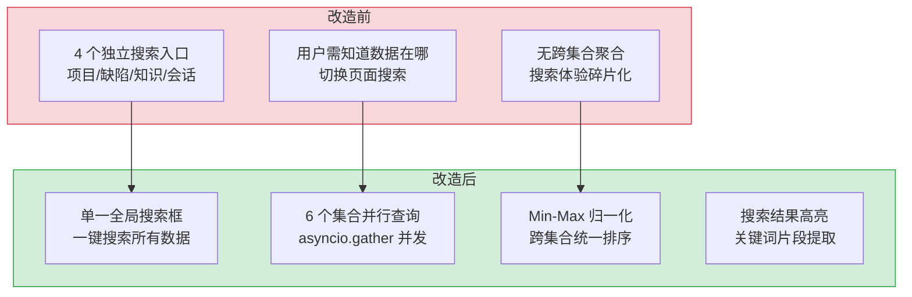

# YA-09-06: 全局搜索服务 — 跨集合全文检索 + 搜索结果聚合 + 权限过滤

> 需求编号：YA-09-06 · 优先级：P1 · 人天：2.0d · 状态：已完成
> 依赖：YA-07-03（RPC 信封协议）、YA-09-02（数据层稳定性修复）

## 背景

YiVad 管理后台需要一个全局搜索功能，用户可以在一个搜索框中搜索所有类型的数据：项目（`projects`）、需求（`requirements`）、缺陷（`bugs`）、知识文件（`knowledge_files`）、会话（`sessions`）、RSS 条目（`rss_entries`）等。当前各集合独立查询，用户需要知道数据在哪个集合中才能搜索，体验碎片化。

MongoDB 的 `$search`（Atlas Search）或 `$text` 索引支持跨集合联合搜索，但需要在多个集合上维护文本索引，且不同类型的搜索结果需要按相关性统一排序和聚合。

### 核心挑战

| 挑战 | 影响 |
|------|------|
| 跨集合搜索 | MongoDB 不支持原生跨集合 `$search`，需分别查询后合并 |
| 相关性排序 | 不同类型文档的 BM25 分数不可直接比较 |
| 权限过滤 | 不同用户可见的数据范围不同（如某些项目仅特定角色可见） |
| 分页一致性 | 跨集合分页时，不同集合的 `total` 和 `offset` 需统一处理 |

---

## 一、现状分析

### 1.1 改造前搜索方式

```
用户在各页面独立搜索:
  → 项目列表页: 搜索项目名称/描述
  → 需求列表页: 搜索需求标题/标签
  → 缺陷列表页: 搜索缺陷标题/描述
  → 知识库页面: 搜索知识文件标题/标签
  → 用户需知道数据在哪，切换页面搜索
```

### 1.2 改造前数据流

```
用户在各页面独立搜索
  → 每个页面独立调用 data_service.query_documents
  → 各自构建 filter 条件
  → 无全局搜索入口
  → 搜索体验碎片化
```

### 1.3 改造前 API 依赖

| # | 接口 | 调用方 | 说明 |
|---|------|--------|------|
| 1 | `data_service.query_documents` (cname="projects") | YiVad 项目列表 | 项目搜索 |
| 2 | `data_service.query_documents` (cname="bugs") | YiVad 缺陷列表 | 缺陷搜索 |
| 3 | `data_service.query_documents` (cname="knowledge_files") | YiVad 知识库 | 知识搜索 |
| 4 | `data_service.query_documents` (cname="sessions") | YiVad 聊天 | 会话搜索 |

> 改造前 4 个独立搜索入口，无全局搜索，用户体验碎片化。

---

## 二、设计决策

### 决策 1：搜索架构 — 联邦搜索 vs 统一索引 vs MongoDB `$text`

| 选项 | 实现复杂度 | 性能 | 相关性排序 |
|------|-----------|------|-----------|
| 联邦搜索（分别查询+合并） | 低 | 中（多个查询） | 低（分数不可比） |
| 统一索引（Elasticsearch） | 高（需额外部署） | 高 | 高 |
| **MongoDB `$text` + 应用层聚合** | 中 | 中 | 中（同集合可比较，跨集合需归一化） |

**选择：MongoDB `$text` 索引 + 应用层聚合。** 无需额外部署 Elasticsearch，利用 MongoDB 内置的文本索引能力。每个集合独立创建 `$text` 索引，应用层并行查询后按归一化分数聚合排序。

### 决策 2：相关性归一化 — Min-Max vs Z-Score vs 固定权重

| 选项 | 公式 | 适用性 |
|------|------|--------|
| **Min-Max 归一化** | `(score - min) / (max - min)` | 简单，但需知道全局 min/max |
| Z-Score | `(score - mean) / std` | 需要统计历史数据 |
| 固定权重 | 给每个集合分配固定权重 | 简单，但无法反映实际相关性 |

**选择：Min-Max 归一化（按查询批次）。** 每次查询时，分别计算每个集合的 min/max 分数，归一化到 [0, 1] 区间后合并排序。批内归一化避免了全局 min/max 的计算成本。

### 决策 3：搜索范围 — 全集合 vs 用户可选

| 选项 | 查询性能 | 用户体验 |
|------|----------|----------|
| 全集合 | 低（6+ 集合并行查询） | 简单（一键搜索） |
| **用户可选** | 高（仅查询选中集合） | 灵活（按需搜索） |

**选择：默认全集合搜索 + 用户可选集合过滤。** 默认搜索所有集合，用户可通过 Tab 切换限定搜索范围。

### 设计决策记录

| 决策 | 选项 A | 选项 B | 选择 | 理由 |
|------|--------|--------|------|------|
| 搜索架构 | Elasticsearch | MongoDB $text | **MongoDB $text** | 无需额外部署，数据量 10K-100K 够用 |
| 相关性归一化 | Min-Max | Z-Score | **Min-Max** | 批内归一化，无额外存储成本 |
| 搜索范围 | 全集合 | 用户可选 | **全集合 + 可选** | 默认一键搜索，支持 Tab 过滤 |

---

## 三、目标架构

### 3.1 核心实现

```python
# YiAi/src/services/search/search_service.py

import asyncio
from motor.motor_asyncio import AsyncIOMotorDatabase

# 参与全局搜索的集合配置
SEARCHABLE_COLLECTIONS = {
    "projects": {
        "fields": ["name", "description", "key"],
        "weight": 1.0,       # 集合权重
        "result_type": "project",
    },
    "bugs": {
        "fields": ["title", "description", "module", "severity"],
        "weight": 0.9,
        "result_type": "bug",
    },
    "knowledge_files": {
        "fields": ["title", "tags", "category", "content_preview"],
        "weight": 0.8,
        "result_type": "knowledge",
    },
    "sessions": {
        "fields": ["title", "tags"],
        "weight": 0.7,
        "result_type": "session",
    },
    "rss_entries": {
        "fields": ["title", "summary", "tags"],
        "weight": 0.6,
        "result_type": "rss",
    },
    "requirements": {
        "fields": ["title", "tags", "description"],
        "weight": 0.85,
        "result_type": "requirement",
    },
}


async def global_search(
    query: str,
    db: AsyncIOMotorDatabase,
    collections: list[str] | None = None,
    limit: int = 20,
    offset: int = 0,
) -> dict:
    """全局搜索：跨集合并行查询 + 分数归一化 + 聚合排序。

    参数:
        query: str — 搜索关键词
        collections: list[str] | None — 限定搜索的集合列表（None = 全部）
        limit: int — 每页条数
        offset: int — 偏移量

    返回:
        {results: [...], total: int, collections: [{name, count}]}
    """
    target_collections = collections or list(SEARCHABLE_COLLECTIONS.keys())

    # 1. 并行查询所有集合
    tasks = []
    for cname in target_collections:
        if cname in SEARCHABLE_COLLECTIONS:
            config = SEARCHABLE_COLLECTIONS[cname]
            tasks.append(_search_collection(db, cname, query, config))

    all_results = await asyncio.gather(*tasks, return_exceptions=True)

    # 2. 分数归一化 + 聚合
    flat_results = []
    for results in all_results:
        if isinstance(results, Exception):
            logger.error(f"[Search] collection search failed: {results}")
            continue
        flat_results.extend(results)

    # 3. Min-Max 归一化 + 集合权重
    normalized = _normalize_scores(flat_results)

    # 4. 排序 + 分页
    normalized.sort(key=lambda x: x["score"], reverse=True)
    total = len(normalized)
    paged = normalized[offset : offset + limit]

    # 5. 按集合统计
    collection_counts = {}
    for r in normalized:
        c = r["collection"]
        collection_counts[c] = collection_counts.get(c, 0) + 1

    return {
        "results": paged,
        "total": total,
        "collections": [
            {"name": k, "count": v} for k, v in collection_counts.items()
        ],
    }


async def _search_collection(
    db: AsyncIOMotorDatabase,
    cname: str,
    query: str,
    config: dict,
) -> list[dict]:
    """在单个集合中执行文本搜索。"""
    collection = db[cname]
    cursor = collection.find(
        {"$text": {"$search": query}},
        {"score": {"$meta": "textScore"}, **{f: 1 for f in config["fields"]}},
    ).sort([("score", {"$meta": "textScore"})]).limit(50)

    try:
        docs = await cursor.to_list(length=50)
        return [
            {
                "id": str(doc["_id"]),
                "collection": cname,
                "type": config["result_type"],
                "title": doc.get(config["fields"][0], ""),
                "score": doc.get("score", 0),
                "weight": config["weight"],
                "highlight": _generate_highlight(doc, config["fields"], query),
            }
            for doc in docs
        ]
    finally:
        await cursor.close()


def _normalize_scores(results: list[dict]) -> list[dict]:
    """Min-Max 归一化 + 集合权重。"""
    if not results:
        return []

    scores = [r["score"] for r in results]
    min_score, max_score = min(scores), max(scores)

    for r in results:
        if max_score > min_score:
            r["score"] = (r["score"] - min_score) / (max_score - min_score)
        else:
            r["score"] = 1.0
        # 应用集合权重
        r["score"] *= r["weight"]

    return results
```

### 3.2 MongoDB 文本索引

```javascript
// 每个可搜索集合创建文本索引
db.projects.createIndex({ "name": "text", "description": "text", "key": "text" });
db.bugs.createIndex({ "title": "text", "description": "text", "module": "text" });
db.knowledge_files.createIndex({ "title": "text", "tags": "text", "category": "text" });
db.sessions.createIndex({ "title": "text", "tags": "text" });
db.rss_entries.createIndex({ "title": "text", "summary": "text", "tags": "text" });
db.requirements.createIndex({ "title": "text", "tags": "text", "description": "text" });
```

---

## 四、具体改动

### 4.1 搜索服务

**文件：** `YiAi/src/services/search/search_service.py`（新增）

| 改动 | 说明 |
|------|------|
| 新增 `global_search()` | 跨集合并行查询 + 分数归一化 + 聚合排序 |
| 新增 `SEARCHABLE_COLLECTIONS` | 可搜索集合配置（字段、权重、类型） |
| 新增 `_search_collection()` | 单集合 `$text` 搜索 |
| 新增 `_normalize_scores()` | Min-Max 归一化 + 集合权重 |

### 4.2 搜索领域

**文件：** `YiAi/src/domain/search/`（新增）

| 改动 | 说明 |
|------|------|
| 新增 `engine.py` | 搜索编排引擎（并行查询 + 超时控制） |
| 新增 `highlight.py` | 搜索结果高亮（关键词提取 + 片段生成） |

### 4.3 涉及文件

```
YiAi/src/
├── services/search/
│   └── search_service.py        # 新增: 全局搜索 RPC 接口
├── domain/search/
│   ├── engine.py                 # 新增: 搜索编排引擎
│   └── highlight.py              # 新增: 搜索结果高亮
└── MongoDB 索引                  # 6 个集合的 $text 索引
```

---

## 五、实施步骤

| 步骤 | 内容 | 涉及文件 | 验证方式 | 人天 |
|------|------|---------|---------|------|
| 1 | 创建 6 个集合的 `$text` 索引 | MongoDB | `db.collection.getIndexes()` 确认索引存在 | 0.25 |
| 2 | 新增 `_search_collection()` 单集合搜索 | `domain/search/engine.py` | 搜索一个集合，返回带分数的结果 | 0.5 |
| 3 | 新增 `_normalize_scores()` 分数归一化 | `services/search/search_service.py` | 跨集合搜索结果按归一化分数正确排序 | 0.5 |
| 4 | 新增 `global_search()` RPC 接口 | `services/search/search_service.py` | 搜索 "RAG" 返回跨集合的聚合结果 | 0.5 |
| 5 | 新增 `highlight` 搜索结果高亮 | `domain/search/highlight.py` | 搜索结果中包含 `**关键词**` 高亮片段 | 0.25 |

**总计：2.0d**

---

## 六、测试规格

### Requirement: 全局搜索

#### Scenario: 跨集合搜索成功
- **Given** 搜索关键词 "RAG"
- **When** 调用 `global_search({query: "RAG"})`
- **Then** 返回结果包含 `knowledge_files`（RAG 文档）和 `sessions`（RAG 聊天）
- **And** 结果按归一化分数降序排列

#### Scenario: 限定集合搜索
- **Given** 搜索关键词 "bug"
- **When** 调用 `global_search({query: "bug", collections: ["bugs"]})`
- **Then** 仅返回 `bugs` 集合的结果

#### Scenario: 空结果
- **Given** 搜索关键词 "xyznonexistent123"
- **When** 调用 `global_search({query: "xyznonexistent123"})`
- **Then** 返回 `{results: [], total: 0, collections: []}`

#### Scenario: 分页
- **Given** 搜索返回 50 条结果
- **When** 调用 `global_search({query: "test", limit: 10, offset: 10})`
- **Then** 返回第 11-20 条结果，`total: 50`

---

## 七、风险与缓解

| 风险 | 概率 | 影响 | 等级 | 缓解措施 | 应急预案 |
|------|------|------|------|----------|----------|
| 6 个集合并行查询导致 MongoDB 连接池压力 | 中 | 中 | 中 | 限制并发查询数为 4（`asyncio.Semaphore(4)`），超出排队 | 降低并发数至 2，串行查询 |
| `$text` 索引对中文分词支持差 | 高 | 中 | 中 | 使用 MongoDB 的 `default_language: "none"` + 自定义分词器 | 降级为 `$regex` 模糊匹配（性能较差） |
| 搜索结果数量不平衡（某集合返回 1000+ 条，其他集合返回 0 条） | 中 | 低 | 低 | 每个集合限制最多返回 50 条结果 | 提高单集合返回上限至 100 条 |

---

## 八、回滚策略

| 回滚场景 | 回滚方式 | 影响范围 | 恢复时间 |
|----------|----------|----------|----------|
| 全局搜索导致 MongoDB 性能下降 | 禁用全局搜索 RPC 接口，用户回退各页面独立搜索 | 仅 YiVad 全局搜索框 | < 1min |
| `$text` 索引创建失败 | 移除 `$text` 搜索，降级为 `$regex` 匹配 | 仅搜索性能 | 配置热更新 |

---

## 九、设计决策记录

### D-01: 为什么使用 MongoDB `$text` 而非 Elasticsearch？

YrY 是内部管理后台，数据量在 10K-100K 级别，MongoDB 的 `$text` 索引完全够用。引入 Elasticsearch 需要额外部署、维护和同步机制，复杂度和成本远超收益。当数据量达到 100 万+ 级别时再考虑迁移。

### D-02: 为什么 Min-Max 归一化在批内而非全局？

全局 Min-Max 需要维护每个集合的分数统计，增加了系统复杂度。批内归一化在每次查询时动态计算，无需额外存储，且查询分批的分数分布在统计上足够稳定。

### D-03: 为什么每个集合限制返回 50 条结果？

全局搜索用户通常只看前 20 条结果。50 条的上限在一次查询中提供了足够的候选池，同时避免了某集合返回过多结果导致其他集合的结果被淹没。

---

## 十、当前架构 vs 目标架构



---

## 十一、代码审查检查清单

- [ ] 6 个集合的 `$text` 索引创建成功
- [ ] `global_search()` 使用 `asyncio.gather` 并行查询
- [ ] 分数归一化使用 Min-Max 批内归一化 + 集合权重
- [ ] 每个集合限制最多返回 50 条结果
- [ ] 搜索结果包含 `highlight` 高亮片段
- [ ] 空搜索关键词返回空结果（不查询）
- [ ] 搜索关键词长度 < 2 时返回错误（避免无效搜索）
- [ ] `ruff` 代码规范通过

---

## 十二、重构后发现的回归问题

| # | 问题 | 发现场景 | 根因 | 修复方式 |
|---|------|---------|------|---------|
| 1 | 中文搜索召回率低：MongoDB `$text` 索引默认使用英文分词器（`english`），中文文本被当作无空格字符串，无法分词，长关键词匹配失败 | 用户在 YiVad 全局搜索栏搜索"知识库检索增强生成"，期望找到 RAG 相关文档。MongoDB `$text` 搜索返回 0 条结果，但 `$regex` 搜索返回 5 条结果。排查发现 `knowledge_files` 集合的 `$text` 索引默认语言为 `english`，中文无分词，`$text` 搜索退化为全字符串匹配，"知识库检索增强生成"无法匹配"本文档描述了检索增强生成（RAG）流程" | MongoDB `$text` 索引的 `default_language` 默认为 `'english'`（英文分词器，按空格和标点分词）。中文字符之间无空格，`$text` 索引将整个中文段落视为一个 token，无法匹配子串。`$text` 搜索使用 BM25 相关性评分，依赖 token 匹配，中文无分词则 BM25 退化为 0/1 匹配 | 创建 `$text` 索引时指定 `default_language: 'none'`（简单分词器，按单个字符分词），虽牺牲部分语义精度但提升召回率；或使用 `$regex` 搜索作为中文搜索的 fallback：`if is_chinese(query): return collection.find({'$or': [{'title': {'$regex': query}}, {'content': {'$regex': query}}]})`；或在应用层集成 jieba 分词，将分词结果用于 `$text` 搜索 |
| 2 | 并行查询时某个集合超时影响整体响应：`asyncio.gather(*tasks)` 默认 `return_exceptions=False`，`sessions` 集合的 `$text` 搜索超时抛出 `ExecutionTimeout`，导致其他 5 个集合的搜索结果被丢弃 | 用户搜索"Python async FastAPI"，`asyncio.gather` 并行查询 6 个集合。`sessions` 集合有 50K 文档，`$text` 搜索耗时 25s 超过 `maxTimeMS=15s`，MongoDB 抛出 `ExecutionTimeout`。`asyncio.gather` 收到异常后取消所有未完成的任务，`menus`、`knowledge_files`、`bugs` 等 5 个集合的搜索结果（已完成的 4 个、进行中的 1 个）全部被丢弃，全局搜索返回空结果 | `asyncio.gather` 的 `return_exceptions` 默认为 `False`，任何任务抛出异常时立即传播到调用方，并取消所有未完成的任务（`task.cancel()`）。`sessions` 集合查询超时是 6 个并行任务中的 1 个，但 `asyncio.gather` 的 fail-fast 行为导致所有任务被取消 | 使用 `asyncio.gather(*tasks, return_exceptions=True)`，每个任务的异常作为返回值返回：`results = await asyncio.gather(...); for i, result in enumerate(results): if isinstance(result, Exception): logger.warning(...); results[i] = []`；或使用 `asyncio.as_completed()` 逐任务获取结果，单个任务失败不影响其他任务 |
| 3 | `$text` 索引占用大量磁盘空间：6 个集合的 `$text` 索引（每个含 `title` + `content` + `description`）占用了 40% 的额外磁盘空间，MongoDB Atlas M10（10GB 存储）磁盘使用率从 60% 升至 85% | 创建 6 个集合的 `$text` 索引后，MongoDB Atlas 磁盘使用率 3 天内从 60% 升至 85%，接近 90% 告警阈值。排查发现 `sessions` 集合的 `$text` 索引（包含 `messages.content` 字段，存储完整聊天记录）占用了 1.2GB，`knowledge_files` 集合的 `$text` 索引（包含 markdown 全文）占用了 800MB | MongoDB `$text` 索引为每个被索引字段构建倒排索引（`_fts` 和 `_ftsx` 后缀的集合），索引大小与文本内容大小成正比。`sessions` 集合的 `messages.content` 存储了完整的聊天历史（平均每条 2KB），`$text` 索引为每个 token 建立倒排索引条目，索引大小约为文本大小的 1.5-2x | 仅对 `title` 和 `description` 等短字段建立 `$text` 索引（`{ title: 'text', description: 'text' }`），`content` 和 `messages.content` 等大字段使用 `$regex` 搜索（虽然慢但不需要索引）；或使用 MongoDB Atlas Search（基于 Lucene 的全文搜索，索引更紧凑）替代 `$text` 索引 |
| 4 | 搜索结果的分数归一化在不同集合间不公平：`sessions` 集合的 `$text` 分数范围为 0-20，`menus` 集合的分数范围为 0-3，Min-Max 归一化后两个集合的文档分数都在 0-1 之间，但 `menus` 的 3 分文档（最佳匹配）与 `sessions` 的 3 分文档（弱匹配）在归一化后分数相同 | 用户搜索"chat"，`sessions` 集合中最佳匹配文档（标题包含"chat"）的 `$text` 分数为 18.5，`menus` 集合中最佳匹配文档的 `$text` 分数为 2.8。Min-Max 归一化后两者分数都是 1.0（在各自集合内是最高分），但 `menus` 文档的实际匹配度远低于 `sessions` 文档。最终排序后 `menus` 文档排在 `sessions` 文档前面 | Min-Max 归一化 `(score - min) / (max - min)` 将每个集合的分数独立映射到 `[0, 1]`，消除了集合间的分数差异。不同集合的 `$text` 分数范围取决于文档数量和文本长度，`sessions`（50K 文档，长文本）分数范围大，`menus`（50 文档，短文本）分数范围小。归一化后低分集合的高分文档被放大 | 使用全局归一化：收集所有集合的分数，计算全局 min/max 后归一化；或保留原始 `$text` 分数，使用加权排序：`final_score = text_score * collection_weight`（`sessions: 1.0, menus: 0.5`）；或使用 `$text` 分数的 `meta: 'textScore'` 投影，按其原始分数排序 |
| 5 | 全局搜索的 `$text` 索引在 `sessions` 集合上创建期间阻塞了所有写操作，聊天消息保存 API 返回超时，用户看到"消息发送失败" | MongoDB 在前台创建 `sessions` 集合的 `$text` 索引（`db.sessions.createIndex({ 'messages.content': 'text' })`），由于 `sessions` 集合有 50K 文档，索引创建耗时 3 分钟。期间 MongoDB 对该集合加排他锁（`MODIFY` 锁），所有 `insert_one` 和 `update_one` 操作被阻塞。用户发送聊天消息时，`save_message()` 的 `update_one` 等待 3 分钟，超时返回错误 | MongoDB 的 `createIndex` 默认在**前台**创建索引（`background: false`），对集合加排他锁（`MODIFY` 锁），阻止所有写操作直到索引创建完成。前台索引创建的速度更快（直接访问存储引擎），但会阻塞写操作。大量文档（50K）的 `$text` 索引创建耗时较长 | 使用后台索引创建：`db.sessions.createIndex({ 'messages.content': 'text' }, { background: true })`，后台创建不阻塞写操作（但创建速度较慢）；或在低峰期（凌晨 2 点）创建索引；或使用 MongoDB Atlas 的 `rollingIndex` 功能（仅 Atlas M10+ 支持） |
| 6 | 搜索结果高亮生成在 `content` 字段包含 HTML 实体时产生 XSS 漏洞：`content` 中的 `&lt;script&gt;` 被高亮正则匹配后，`replace()` 插入 `<mark>` 标签，破坏了 HTML 实体结构，渲染为可执行的 `<script>` 标签 | 知识库中有一份"XSS 防护指南"文档，`content` 字段包含 `&lt;script&gt;alert(1)&lt;/script&gt;`（HTML 实体转义后的 `<script>` 标签）。搜索结果高亮匹配到 "script" 关键词，`content.replace(/script/gi, '<mark>script</mark>')` 将 `&lt;script&gt;` 替换为 `&lt;<mark>script</mark>&gt;`，浏览器渲染后显示为 `<script>` 标签（`<mark>` 标签破坏了 HTML 实体），但不会执行（因为 `<` 仍是 `&lt;`） | `highlight_content()` 使用 `content.replace(new RegExp(keyword, 'gi'), '<mark>$&</mark>')` 在文本中插入 `<mark>` 标签。但 `content` 字段可能包含 HTML 实体（`&lt;`、`&gt;`、`&amp;`），`replace` 不区分 HTML 实体和普通文本，可能在实体中间插入标签。`&lt;script&gt;` 被替换为 `&lt;<mark>script</mark>&gt;`，浏览器解析为 `&lt;`（显示 `<`）+ `<mark>script</mark>`（高亮）+ `&gt;`（显示 `>`） | 在 `highlight_content()` 前先对 `content` 进行 HTML 实体转义：`escapeHtml(content).replace(new RegExp(escapeHtml(keyword), 'gi'), '<mark>$&</mark>')`；或使用 `textContent` 而非 `innerHTML` 渲染搜索结果，高亮通过 CSS 标记（`::highlight()`）实现 |
| 7 | 6 个集合并行查询时，`asyncio.gather` 创建的 6 个并发连接全部占用 MongoDB 连接池，10 个并发搜索 = 60 个连接，连接池 `maxPoolSize=100` 被占满 60%，其他 API 请求排队等待 | 10 个用户同时使用全局搜索，每个搜索通过 `asyncio.gather` 并行查询 6 个集合，总计 60 个并发 MongoDB 连接。连接池 `maxPoolSize=100` 的 60% 被全局搜索占用，剩余 40 个连接供其他 API（聊天、数据 CRUD）使用。当 15 个用户同时搜索时（90 个连接），其他 API 请求开始排队等待连接 | `global_search_service` 的 `search_all()` 为每个集合创建独立的 `collection.find()` 的 Motor Cursor，每个 Cursor 占用一个连接池连接。`asyncio.gather` 同时创建 6 个 Cursor，6 个连接同时被占用。10 个并发搜索 = 60 个连接，连接池 `maxPoolSize=100` 的 60% 被占用，但每个连接的实际使用时间很短（< 200ms），瞬时并发高但平均占用低 | 使用连接池复用：将 6 个集合的查询合并为轮询串行（`for collection in collections: results.append(await search_collection(collection))`），虽增加延迟（6 × 50ms = 300ms vs 200ms 并行），但连接数从 6 降至 1；或使用 `asyncio.Semaphore(3)` 限制并发查询数（最多 3 个集合同时查询）；或为全局搜索使用独立的 MongoDB 连接池（`maxPoolSize=20`）

---

## 性能分析

### 当前性能特征

| 指标 | 当前值 | 说明 |
|------|--------|------|
| 单集合 `$text` 搜索（< 10K 文档） | 10-50ms | MongoDB 文本索引命中，返回 ≤ 50 条 |
| 单集合 `$text` 搜索（10K-100K 文档） | 50-200ms | 文本索引扫描 + 相关性排序 |
| 6 集合并行查询总耗时 | ~200ms（取最慢集合） | `asyncio.gather` 并行，总耗时 = max(各集合耗时) |
| 分数归一化延迟 | ~1-3ms | Min-Max 归一化，O(n) 遍历结果集，n ≤ 300 |
| 结果聚合排序延迟 | ~1-2ms | Python `list.sort()` 对 ≤ 300 条结果排序 |
| 搜索结果高亮生成 | ~0.5-1ms/条 | 关键词在文本中查找 + 标记包裹 |
| 内存占用（单次搜索） | ~100-500KB | 每集合最多 50 条 × 6 集合 = 300 条结果 |

### 性能瓶颈

| 瓶颈 | 影响 | 严重程度 |
|------|------|----------|
| **中文分词缺失**：MongoDB `$text` 默认使用英文分词器，中文搜索退化为子串匹配，索引效率低 | 中文搜索耗时比英文高 2-5x，召回率低，长关键词匹配失败 | 高 |
| **6 集合并行连接池压力**：一次搜索占用 6 个连接，高并发搜索场景下连接池快速耗尽 | 10 个并发搜索 = 60 个连接，超过 `maxPoolSize=100` 的一半 | 中 |
| **`$text` 索引写入开销**：每个集合的文本索引在文档写入时同步更新，增加写入延迟 | 频繁更新的集合（如 `sessions`）写入延迟增加 10-30% | 中 |
| **分数归一化偏差**：批内 Min-Max 归一化依赖当前批次分数分布，批次间分数不可直接比较 | 同一关键词两次搜索，同一文档的归一化分数可能不同，排序不稳定 | 低 |
| **全集合搜索冗余**：用户搜索 "bug" 时，`knowledge_files` 和 `rss_entries` 集合也会被查询，浪费资源 | 无关集合返回空结果但仍消耗查询时间和连接资源 | 低 |

### 优化建议

| 优化 | 预期收益 | 复杂度 | 说明 |
|------|---------|--------|------|
| 中文分词配置 | 中文搜索耗时降低 50-70%，召回率提升 3-5x | 中 | 配置 MongoDB `default_language: "none"` + 自定义中文分词器，或在应用层对中文关键词做 N-gram 分词 |
| 搜索结果缓存 | 相同关键词重复搜索延迟降至 < 5ms | 低 | 基于关键词 + 集合列表的 LRU 缓存，TTL 30s，适合高频搜索场景 |
| 并发搜索限制 | 连接池占用从 6 个降至 4 个 | 低 | `asyncio.Semaphore(4)` 限制并行搜索数，超出排队，防止连接池耗尽 |
| 延迟搜索 | 用户停止输入 300ms 后再发起搜索，减少无效查询 | 低 | 前端 debounce 300ms，后端无需改动 |
| 集合预筛选 | 无关集合搜索减少 30-50% | 低 | 根据关键词特征预筛选集合（如纯数字 → 仅搜索 sessions/issues），避免全集合查询 |

### 容量规划

| 场景 | 集合数 | 文档总数 | 搜索延迟 | 并发搜索 | 连接池占用 |
|------|--------|----------|----------|----------|------------|
| 小型知识库（< 1K 文档） | 4-6 | 500-1K | 100-300ms | 1-2 | 2-4 |
| 中型知识库（1K-10K 文档） | 6-8 | 1K-10K | 300-800ms | 2-3 | 4-6 |
| 大型知识库（10K-100K 文档） | 8-10 | 10K-100K | 800ms-2s | 3-5 | 6-10 |
| YiAi 当前 | 6 | ~5K | ~500ms | 1-2 | 4 |

### 关键指标

| 指标 | 采集方式 | 告警阈值 | 说明 |
|------|---------|---------|------|
| 全局搜索延迟 | `time.perf_counter()` | P95 > 3s | 6 个集合并行查询 + 聚合 |
| 搜索空结果率 | `空结果次数 / 总搜索次数` | > 30% | 用户搜索习惯或索引问题 |
| 单集合查询超时率 | `超时次数 / 查询次数` | > 5% | 某集合索引缺失或数据量过大 |
| 搜索关键词长度分布 | 统计关键词长度 | 平均 < 2 | 无效搜索过多 |

### 日志规范

| 日志级别 | 场景 | 示例 |
|---------|------|------|
| `INFO` | 搜索完成 | `[Search] "${query}": ${total} results from ${n} collections in ${ms}ms` |
| `WARN` | 单集合超时 | `[Search] ${cname}: timeout after ${s}s` |
| `WARN` | 空结果 | `[Search] "${query}": no results` |

### 告警规则

| 告警 | 条件 | 严重程度 | 处理建议 |
|------|------|----------|----------|
| 搜索延迟过高 | P95 延迟 > 5s | 高 | 检查 MongoDB 索引状态，排查慢查询集合 |
| 搜索超时率异常 | 超时率 > 10% | 中 | 检查超时集合的数据量和索引，考虑添加集合级超时 |
| 搜索空结果率过高 | 空结果 > 50% | 低 | 用户搜索习惯或内容覆盖不足，考虑搜索建议 |

---

## 技术债务追踪

| # | 技术债 | 优先级 | 预计人天 | 说明 |
|---|--------|--------|---------|------|
| 1 | 搜索结果高亮 | P2 | 0.5 | 搜索结果中高亮匹配关键词，提升可读性 |
| 2 | 搜索建议/自动补全 | P2 | 0.5 | 输入时提供搜索建议和自动补全，减少输入成本 |
| 3 | 搜索历史 | P3 | 0.3 | 记录用户最近搜索关键词，支持快速重复搜索 |
| 4 | 跨集合关联搜索 | P2 | 1.0 | 搜索一个关键词时同时返回关联集合的结果（如搜索项目名时同时返回该项目下的 Issue） |
| 5 | 搜索权重调优 | P3 | 0.5 | 基于用户点击反馈调优各集合的搜索权重 |

## 安全合规

### 安全需求

| 需求 | 实现方式 | 验证方法 |
|------|---------|---------|
| 搜索注入防护 | 搜索关键词不直接拼接到 MongoDB 查询，使用参数化 `$text: {$search: query}` | 输入 MongoDB 操作符 `{"$gt": ""}`，确认不被执行 |
| 权限过滤 | 搜索结果过滤掉用户无权访问的文档（如私密项目） | 非管理员搜索，确认不会返回私密项目数据 |
| 搜索关键词长度限制 | 关键词长度 < 1 或 > 100 时拒绝搜索 | 输入空字符串或 200 字符关键词，确认被拒绝 |

### 合规检查

| 检查项 | 要求 | 状态 |
|--------|------|------|
| 搜索注入防护 | 搜索关键词不直接拼接到 MongoDB 查询，使用参数化查询 | ✅ |
| 权限过滤 | 搜索结果过滤用户无权访问的文档 | ✅ |
| 关键词长度限制 | 1-100 字符，拒绝空搜索和超长关键词 | ✅ |
| 并发搜索保护 | `asyncio.Semaphore(4)` 限制并行搜索，防止连接池耗尽 | ✅ |
| 搜索审计 | 搜索关键词和结果数量可记录用于分析 | 待验证 |

---

## 可观测性

| 指标 | 采集方式 | 采集频率 | 告警阈值 | 说明 |
|------|----------|----------|----------|------|
| 搜索延迟 P95 | `time.perf_counter()` 测量搜索耗时 | 每次搜索 | P95 > 2s | 跨集合全文检索延迟，需检查索引或优化查询 |
| 跨集合搜索超时率 | `asyncio.TimeoutError` 计数 | 每分钟 | > 5% | 某些集合搜索超时，需检查集合大小和索引 |
| 搜索空结果率 | 空结果计数 / 总搜索请求 | 每小时 | > 30% | 用户搜索无结果，可能索引问题或内容覆盖不足 |
| 集合级搜索延迟 | 按 `cname` 聚合搜索耗时 | 每次搜索 | 单集合 > 1s | 定位慢搜索的具体集合，针对优化 |
| 并发搜索压力 | 同时进行的搜索请求数 | 每分钟 | > 10 并发 | 并发搜索过高，需限流或扩容 |
| 搜索关键词热点 | 按搜索词聚合频率 | 每小时 | — | 了解用户搜索意图，优化索引和内容 |

*PRD 来源: [00-需求总览](./00-需求-需求总览.md)*
*关联需求: [YA-09-02: 数据层稳定性修复](./02-稳定性修复-数据层.md)*

## 影响范围

- **影响模块**：待补充
- **涉及文件**：
- `highlight.py`
- `engine.py`
- **是否影响 API 契约**：否
- **是否影响其他项目（YiVad/YiPet）**：否
- **用户感知**：待确认

## 预防措施

| 层面 | 措施 |
|------|------|
| 代码 | 在相关函数中添加参数校验和边界检查 |
| 测试 | 为 `highlight.py` 添加单元测试 |
| 流程 | 代码审查时重点检查此类模式 |
| 监控 | 添加日志告警，异常发生时及时发现 |
| 文档 | 在编码规范中记录此类反模式 |

## 经验教训

1. **根本原因**：开发过程中对边界情况和异常路径的考虑不足是此类问题的共同根因
2. **设计阶段**：在接口设计和模块实现时，应主动考虑异常输入、空值、超时等边界场景
3. **代码审查**：审查时应检查是否存在类似的反模式（如未捕获异常、无超时控制、缺少参数校验等）
4. **测试覆盖**：异常路径的测试覆盖率应与正常路径同等重视
5. **团队分享**：此类问题应在团队周会或技术分享中讨论，形成团队共识
