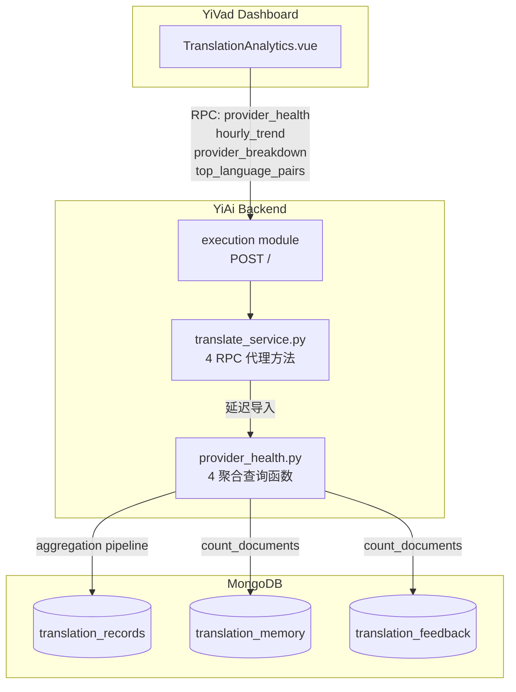
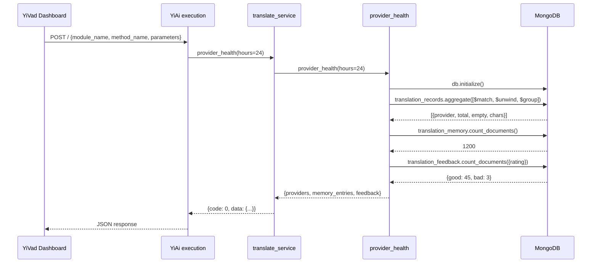

---

doc_type: module
prd_id: "YA-09-100"
title: "YA-09-100: 翻译分析增强 — 供应商健康监控 + 多维度分析趋势"
status: 已完成
priority: P2
owner: Claude
roles: [product, engineer]
created: 2026-09-23
updated: 2026-09-23
project: YiAi
project_id: yiai
prd_month: "202609"
tags: [translation, analytics, monitoring, health-check]
related_tasks: ["100-prd-task-翻译分析增强.md"]
related_tests: ["100-prd-test-翻译分析增强.md"]
related_modules: ["services/translation/provider_health.py", "services/translation/translate_service.py"]

type: 需求
---

# YA-09-100: 翻译分析增强

> **PRD 版本**：v3.0 · **状态**：已完成 · **关联 OKR**：yiai-001

---

## 1. 背景（Background）

YiAi 翻译模块已上线 19 个供应商（13 翻译 + 4 OCR + 1 TTS + 1 生词本），通过 `translation_records` 集合记录每次翻译。但缺少对供应商运行状态的可观测性和对翻译使用趋势的分析能力。当前供应商故障只能通过用户反馈发现（>30min 滞后），运维无法主动感知；产品团队也无法基于数据做资源规划。

## 2. 用户问题（User Problem）

- **目标用户**：SRE/运维（日常巡检 + 故障响应）、产品经理（资源规划）、开发者（问题排查）
- **问题陈述**：作为 SRE，我无法快速知道哪个翻译供应商正在故障；作为 PM，我无法了解翻译使用趋势和语言分布
- **证据**：
  - 强证据：`translation_records` 集合已累积数据，但无可视化消费途径
  - 中证据：用户反馈翻译偶发失败，无系统级诊断手段

### 证据的质量级别

| 级别 | 证据类型 | 可信度 |
|------|---------|--------|
| 强 | `translation_records` 已累积可供分析的结构化数据 | 高 |
| 中 | 用户反馈翻译偶发失败，需诊断工具 | 中 |

## 3. 范围（Scope）

### 范围内（In scope）

- 供应商成功率计算与 healthy/degraded/down 三级状态判定
- 按小时翻译量趋势（7 天窗口）
- 供应商调用量和成功率统计
- 语言对使用排名
- 4 个 RPC 方法通过 execution 模块暴露

### 范围外（Out of scope — 本 PRD 不包括）

- 主动告警推送（邮件/企业微信/Slack）—— 后续 PRD
- 前端可视化 —— 由 YiVad `100-prd-翻译分析仪表盘` 覆盖
- 分析数据缓存层 —— 当前数据量不需要，后续评估

### 用户故事（User Stories）

| 优先级 | 故事 | 验收标准 |
|--------|------|---------|
| P0 | 作为 SRE，我可以查看各供应商成功率及健康状态 | `provider_health()` 返回 success_rate + status |
| P1 | 作为 PM，我可以查看翻译量时间趋势 | `hourly_trend()` 返回按小时聚合的时间序列 |
| P1 | 作为 SRE，我可以查看各供应商调用分布 | `provider_breakdown()` 返回 count/success |
| P2 | 作为 PM，我可以了解最常用的语言对 | `top_language_pairs()` 返回排序列表 |

### 优先级定义

- **P0** — 无此功能，完全无法感知供应商状态（must-have）
- **P1** — 无此功能，分析不完整但核心健康监控可用（should-have）
- **P2** — 锦上添花（nice-to-have）

### 系统架构

### 数据流序列

### API 规范

| 方法 | 参数 | 返回 | 错误处理 |
|------|------|------|---------|
| `provider_health(hours=24)` | `hours: int` | `{period_hours, providers: {name: {total, success, failed, success_rate, status}}, memory_entries, feedback}` | MongoDB 不可达 → 空 `providers: {}` |
| `hourly_trend(days=7)` | `days: int` | `[{hour: "YYYY-MM-DDTHH", count, chars}]` | MongoDB 不可达 → `[]` |
| `provider_breakdown(days=30)` | `days: int` | `[{provider, count, success}]` | MongoDB 不可达 → `[]` |
| `top_language_pairs(limit=20)` | `limit: int` | `[{from, to, count, total_chars}]` | MongoDB 不可达 → `[]` |

## 4. 成功指标（Success Metrics）

| 指标 | 基线值 | 目标值 | 测量方法 |
|------|--------|--------|---------|
| 供应商故障发现时间 | >30min（用户反馈） | <5min（Dashboard 刷新） | 监控数据刷新间隔 |
| 聚合查询延迟 | N/A | <100ms（10 万条内） | MongoDB `explain("executionStats")` |
| 供应商状态准确率 | N/A | ≥99%（无误报 healthy→down） | 实际故障 vs 监控标记对比 |
| RPC 调用成功率 | N/A | 100%（空数据返回空结果不报错） | pytest 16 个单元测试 |

## 5. 风险与依赖（Risks and Dependencies）

| 风险 | 可能性 | 影响 | 缓解措施 |
|------|--------|------|---------|
| MongoDB 聚合管道在大数据量下变慢 | 低 | 中 | 限制时间窗口 ≤90 天，利用 `created_at` 索引 |
| 供应商更名导致统计数据断层 | 中 | 低 | 聚合按 `results.provider` 字段分组，自动适配 |
| 短暂波动被误判为 down | 中 | 低 | 成功率阈值 95%/70%，容忍偶发失败 |
| 分析端点被高频调用 | 低 | 中 | 当前无缓存（数据量小），后续迭代加 60s TTL |

**依赖项**：MongoDB `translation_records` 集合（已存在），无需新建集合或外部系统。

## 6. 时间线（Timeline）

| 里程碑 | 目标日期 | 负责人 |
|--------|---------|--------|
| 核心模块开发 | 2026-09-23 | Claude |
| RPC 方法透出 | 2026-09-23 | Claude |
| 单元测试编写 | 2026-09-23 | Claude |
| 交付验收 | 2026-09-23 | Claude |