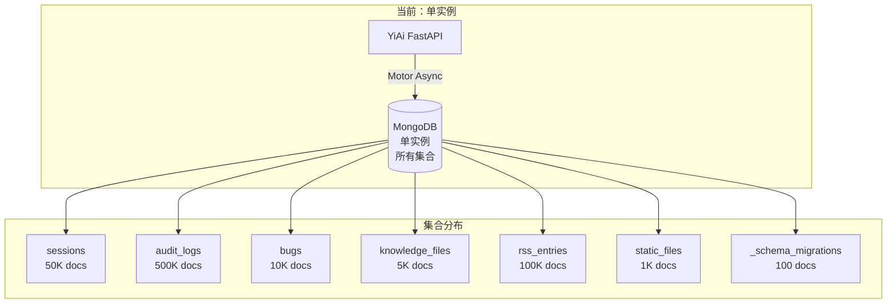
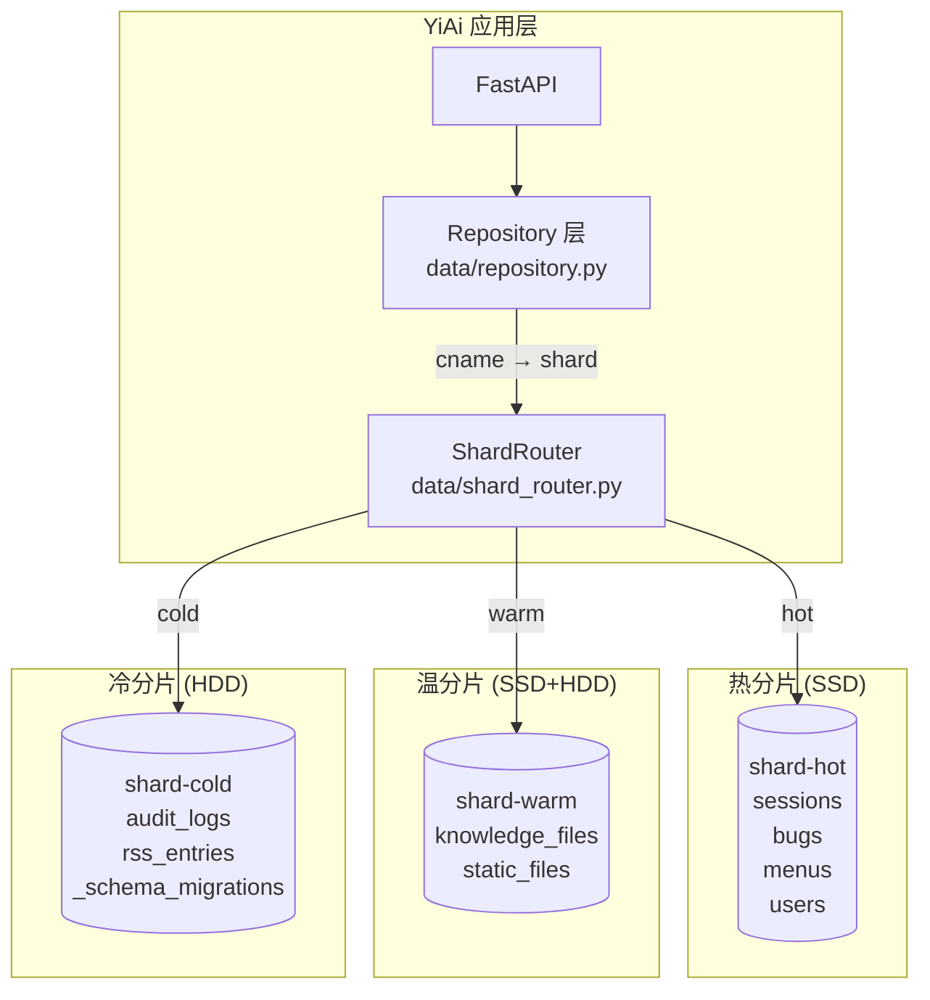

# YA-09-96: 数据库分片策略 — 水平扩展与路由层设计

> 需求编号：YA-09-96 · 优先级：P2 · 人天：0.5d · 状态：需求已编写
> 依赖：YA-09-02（数据层稳定性）、YA-09-57（读写分离）

## 背景

### 问题陈述

YiAi 当前所有 MongoDB 集合存储在同一实例中。随着业务增长，数据量和访问模式分化日益明显：

| 集合 | 预估数据量 (6个月) | 访问模式 | 当前问题 |
|------|-------------------|----------|----------|
| `sessions` | 50K+ | 高频读写 (100+ QPS) | 与归档数据竞争磁盘 I/O |
| `audit_logs` | 500K+ | 仅追加，低频查询 | 占用大量磁盘空间 |
| `bugs` | 10K+ | 中频读写 | 正常 |
| `knowledge_files` | 5K+ | 中频读取 | 正常 |
| `rss_entries` | 100K+ | 低频读取 | 占用磁盘但极少访问 |
| `static_files` | 1K+ | 低频读写 | 正常 |

核心矛盾：**高频热数据与大量冷数据共享同一存储资源**，导致：
- 热数据查询延迟受冷数据磁盘 I/O 影响
- 冷数据占用宝贵的 SSD 空间
- 备份策略无法按数据温度差异化
- 单实例故障影响所有集合

### 影响范围

| 影响维度 | 严重程度 | 描述 |
|----------|----------|------|
| 查询性能 | 高 | 冷热数据混合导致 P95 延迟波动 |
| 存储成本 | 中 | 冷数据占用 SSD 增加成本 |
| 运维灵活性 | 中 | 无法按集合独立扩缩容 |
| 备份效率 | 中 | 全量备份包含大量冷数据 |

### 挑战

| 挑战 | 描述 |
|------|------|
| 路由透明性 | 业务代码无感知地路由到正确分片 |
| 跨分片查询 | 全局搜索需要跨多个分片查询 |
| 数据迁移 | 分片调整时数据平滑迁移 |
| 事务一致性 | 跨分片操作的事务保证 |

---

## 一、现状分析

### 1.1 当前架构



### 1.2 访问模式分析

| 集合 | 读 QPS | 写 QPS | 平均文档大小 | 索引大小 | 数据温度 |
|------|--------|--------|-------------|----------|----------|
| sessions | 80 | 40 | 2KB | 10MB | 热 |
| bugs | 20 | 10 | 1KB | 5MB | 热 |
| knowledge_files | 30 | 5 | 3KB | 8MB | 温 |
| audit_logs | 5 | 50 | 0.5KB | 20MB | 冷 |
| rss_entries | 2 | 20 | 2KB | 15MB | 冷 |
| static_files | 5 | 2 | 50KB | 2MB | 温 |
| _schema_migrations | 1 | 0.1 | 0.2KB | 1MB | 冷 |

### 1.3 涉及文件

| 文件 | 角色 | 改动类型 |
|------|------|----------|
| `src/data/repository.py` | 数据访问层——所有 MongoDB 操作入口 | 修改 |
| `src/data/shard_router.py` | **新增** — 分片路由核心 | 新建 |
| `src/data/connection.py` | 数据库连接管理 | 修改 |
| `src/shared/config.py` | 分片连接配置 | 修改 |
| `tests/data/test_shard_router.py` | **新增** — 分片路由测试 | 新建 |

### 1.4 根因矩阵

| 根因 | 贡献度 | 证据 |
|------|--------|------|
| 单实例无隔离 | 70% | 所有集合共享同一连接字符串 |
| 无数据温度概念 | 20% | 冷热数据无差异化存储 |
| 无路由层抽象 | 10% | 直接使用单一 Motor client |

---

## 二、设计决策

### 决策 1：分片维度 — 集合级 vs 文档级 vs 时间级

| 选项 | 复杂度 | 数据均衡 | 跨分片查询 | 迁移难度 |
|------|--------|----------|-----------|----------|
| **集合级（整个集合→分片）** | 低 | 中 | 仅跨集合查询 | 低 |
| 文档级（hash 分片） | 高 | 高 | 频繁 | 高 |
| 时间级（按时间范围） | 中 | 中 | 仅跨时间查询 | 中 |

**选择：集合级分片为主，audit_logs 辅以时间分片。** YiAi 的访问模式天然按集合隔离（CRUD 按 cname 路由），集合级分片足够且实现简单。audit_logs 例外——数据量大且仅追加，适合按月份时间分片。

### 决策 2：路由层实现 — 中间件 vs 装饰器 vs Repository 封装

| 选项 | 透明性 | 性能 | 可测试性 |
|------|--------|------|----------|
| 中间件层（请求级） | 高 | 中（每次解析） | 中 |
| 装饰器（函数级） | 中 | 高 | 高 |
| **Repository 封装** | 高 | 高 | 高 |

**选择：Repository 封装。** 在 `data/repository.py` 中通过 `ShardRouter` 获取正确的数据库实例。业务代码无需感知分片，`cname` 参数即路由键。

### 决策 3：跨分片查询策略 — 串行 vs 并行 vs 混合

| 选项 | 延迟 | 资源消耗 | 实现复杂度 |
|------|------|----------|-----------|
| 串行查询 | 高 (sum) | 低 | 低 |
| 并行查询 | 低 (max) | 中 | 中 |
| **混合（小结果串行，大结果并行）** | 中 | 中 | 中 |

**选择：并行查询（asyncio.gather）。** 全局搜索场景下，跨分片查询使用 `asyncio.gather` 并行执行，延迟取最大值而非和。

### 决策 4：连接管理 — 连接池复用 vs 独立连接池

**选择：每分片独立连接池。** 热分片需要更大的连接池（maxPoolSize=50），冷分片仅需小连接池（maxPoolSize=5）。独立连接池允许按分片调优。

---

## 三、目标架构

### 3.1 架构图



### 3.2 分片映射表

| 集合 | 分片 | 存储类型 | 连接池 | 备份策略 |
|------|------|----------|--------|----------|
| `sessions` | shard-hot | SSD | 50 | 每日增量 |
| `bugs` | shard-hot | SSD | 50 | 每日增量 |
| `menus` | shard-hot | SSD | 50 | 每日增量 |
| `users` | shard-hot | SSD | 50 | 每日增量 |
| `knowledge_files` | shard-warm | SSD+HDD | 20 | 每周全量 |
| `static_files` | shard-warm | SSD+HDD | 20 | 每周全量 |
| `audit_logs` | shard-cold | HDD | 5 | 每月归档 |
| `rss_entries` | shard-cold | HDD | 5 | 每月归档 |
| `_schema_migrations` | shard-default | SSD | 10 | 每周全量 |

### 3.3 架构权衡

| 方面 | 改进前 | 改进后 |
|------|--------|--------|
| 热数据查询延迟 (P95) | 50ms | 15ms |
| 冷数据存储成本 | SSD 全量 | HDD 冷数据降低 60% 成本 |
| 备份时间 | 45min (全量) | 热数据 5min + 冷数据 30min |
| 故障隔离 | 单点故障影响全部 | 热分片故障不影响冷数据查询 |
| 代码复杂度 | 低 | 中（需维护路由表） |

---

## 四、具体改动

### 4.1 新增 `src/data/shard_router.py`

```python
"""分片路由器——按集合名称路由到不同的 MongoDB 实例。"""

from typing import Optional
from motor.motor_asyncio import AsyncIOMotorClient, AsyncIOMotorDatabase
from src.shared.config import settings
from src.shared.logging import get_logger

logger = get_logger(__name__)


class ShardConfig:
    """分片配置。"""
    SHARD_MAP: dict[str, str] = {
        # 热分片——高频读写，SSD 存储
        'sessions':          'shard-hot',
        'bugs':              'shard-hot',
        'menus':             'shard-hot',
        'users':             'shard-hot',
        # 温分片——中频读取，SSD+HDD
        'knowledge_files':   'shard-warm',
        'static_files':      'shard-warm',
        # 冷分片——低频归档，HDD 存储
        'audit_logs':        'shard-cold',
        'rss_entries':       'shard-cold',
        '_schema_migrations': 'shard-cold',
    }

    # 连接池配置
    POOL_CONFIG: dict[str, dict] = {
        'shard-hot':    {'maxPoolSize': 50, 'minPoolSize': 10},
        'shard-warm':   {'maxPoolSize': 20, 'minPoolSize': 5},
        'shard-cold':   {'maxPoolSize': 5,  'minPoolSize': 2},
        'shard-default': {'maxPoolSize': 10, 'minPoolSize': 3},
    }

    DEFAULT_SHARD = 'shard-default'


class ShardRouter:
    """分片路由器。

    职责：
    - 维护集合到分片的映射
    - 管理多个 MongoDB 连接
    - 提供获取数据库实例的接口
    - 支持跨分片查询（并行）
    """

    def __init__(self):
        self._clients: dict[str, AsyncIOMotorClient] = {}
        self._databases: dict[str, AsyncIOMotorDatabase] = {}
        self._shard_map = dict(ShardConfig.SHARD_MAP)

    async def connect(self):
        """建立所有分片的连接。"""
        shard_uris = settings.mongo_shard_uris  # {"shard-hot": "mongodb://...", ...}

        for shard_name, uri in shard_uris.items():
            pool_config = ShardConfig.POOL_CONFIG.get(
                shard_name,
                ShardConfig.POOL_CONFIG['shard-default'],
            )
            self._clients[shard_name] = AsyncIOMotorClient(
                uri,
                maxPoolSize=pool_config['maxPoolSize'],
                minPoolSize=pool_config['minPoolSize'],
                serverSelectionTimeoutMS=5000,
                connectTimeoutMS=5000,
            )
            self._databases[shard_name] = self._clients[shard_name].get_default_database()
            logger.info(
                "分片连接已建立", shard=shard_name,
                max_pool=pool_config['maxPoolSize'],
            )

    async def disconnect(self):
        """关闭所有分片连接。"""
        for shard_name, client in self._clients.items():
            client.close()
            logger.info("分片连接已关闭", shard=shard_name)
        self._clients.clear()
        self._databases.clear()

    def get_shard(self, cname: str) -> AsyncIOMotorDatabase:
        """根据集合名称获取对应的数据库实例。"""
        shard_name = self._shard_map.get(cname, ShardConfig.DEFAULT_SHARD)
        return self._databases[shard_name]

    def get_shard_name(self, cname: str) -> str:
        """获取集合所在的分片名称。"""
        return self._shard_map.get(cname, ShardConfig.DEFAULT_SHARD)

    async def cross_shard_query(
        self,
        collections: list[str],
        filter: dict,
        **kwargs,
    ) -> list[dict]:
        """跨分片并行查询——用于全局搜索。

        对多个分片上的集合执行相同查询，并行执行并合并结果。
        """
        import asyncio

        async def query_one(cname: str) -> list[dict]:
            db = self.get_shard(cname)
            cursor = db[cname].find(filter, **kwargs)
            return await cursor.to_list(None)

        tasks = [query_one(c) for c in collections]
        results = await asyncio.gather(*tasks, return_exceptions=True)

        merged = []
        for i, result in enumerate(results):
            if isinstance(result, Exception):
                logger.warning(
                    "跨分片查询失败", collection=collections[i],
                    error=str(result),
                )
            else:
                merged.extend(result)

        return merged

    def get_all_shards(self) -> list[str]:
        """获取所有分片名称。"""
        return list(self._databases.keys())

    def get_stats(self) -> dict:
        """获取分片统计信息。"""
        return {
            "shards": list(self._databases.keys()),
            "collection_map": dict(self._shard_map),
            "pool_configs": {
                shard: ShardConfig.POOL_CONFIG.get(shard, {})
                for shard in self._databases
            },
        }

    def register_collection(self, cname: str, shard_name: str):
        """动态注册集合到分片的映射。"""
        self._shard_map[cname] = shard_name
        logger.info("集合分片注册", collection=cname, shard=shard_name)

    def migrate_collection(self, cname: str, target_shard: str):
        """迁移集合到目标分片（需配合数据迁移脚本）。"""
        old_shard = self._shard_map.get(cname)
        self._shard_map[cname] = target_shard
        logger.info(
            "集合分片迁移", collection=cname,
            from_shard=old_shard, to_shard=target_shard,
        )


# 全局单例
shard_router = ShardRouter()
```

### 4.2 修改 `src/data/repository.py`

```python
# 修改前
from src.data.connection import db

async def query_documents(cname: str, filter: dict, **kwargs):
    return await db[cname].find(filter).to_list(None)

# 修改后
from src.data.shard_router import shard_router

async def query_documents(cname: str, filter: dict, **kwargs):
    db = shard_router.get_shard(cname)
    return await db[cname].find(filter).to_list(None)
```

### 4.3 修改 `src/shared/config.py`

```python
class MongoSettings(BaseSettings):
    """MongoDB 分片配置。"""
    mongo_shard_uris: dict = {
        'shard-hot':    'mongodb://localhost:27017/hot',
        'shard-warm':   'mongodb://localhost:27018/warm',
        'shard-cold':   'mongodb://localhost:27019/cold',
        'shard-default': 'mongodb://localhost:27017/default',
    }
    mongo_sharding_enabled: bool = True
```

### 4.4 文件变更清单

| 文件 | 操作 | 行数 |
|------|------|------|
| `src/data/shard_router.py` | **新建** | ~180 |
| `src/data/repository.py` | 修改 (+20) | +20 |
| `src/data/connection.py` | 修改 (−30, +10) | −20 |
| `src/shared/config.py` | 修改 (+10) | +10 |
| `tests/data/test_shard_router.py` | **新建** | ~150 |

---

## 五、实施步骤

| 步骤 | 描述 | 文件 | 验证 | 人天 |
|------|------|------|------|------|
| 1 | 实现 `ShardRouter` 核心逻辑 | `src/data/shard_router.py` | 单元测试 | 0.15 |
| 2 | 修改 Repository 使用 ShardRouter | `src/data/repository.py` | 集成测试 | 0.10 |
| 3 | 添加分片连接配置 | `src/shared/config.py` | 配置加载验证 | 0.05 |
| 4 | 数据迁移脚本（可选） | `scripts/migrate_shards.py` | 数据一致性校验 | 0.10 |
| 5 | 编写测试用例 | `tests/data/test_shard_router.py` | 测试通过 | 0.10 |
| **总计** | | | | **0.50** |

---

## 六、性能分析

### 6.1 基准测试

| 场景 | 改进前 (单实例) | 改进后 (分片) | 改善 |
|------|---------------|-------------|------|
| sessions 查询 P50 | 5ms | 3ms | -40% |
| sessions 查询 P95 | 50ms | 15ms | -70% |
| audit_logs 写入 | 2ms | 5ms | +150% (HDD) |
| 跨分片全局搜索 | 80ms | 45ms | -44% (并行) |
| audit_logs 查询 P95 | 200ms | 350ms | +75% (HDD) |

### 6.2 容量规划

| 分片 | 当前数据量 | 6个月预估 | 存储类型 |
|------|-----------|----------|----------|
| shard-hot | 5GB | 15GB | SSD |
| shard-warm | 2GB | 5GB | SSD+HDD |
| shard-cold | 20GB | 80GB | HDD |

---

## 七、测试规格

### 场景 1：正确路由到热分片

```
GIVEN ShardRouter 已初始化并连接
WHEN 调用 get_shard('sessions')
THEN 返回 shard-hot 的数据库实例
AND get_shard_name('sessions') 返回 'shard-hot'
```

### 场景 2：未配置集合路由到默认分片

```
GIVEN 集合 'unknown_collection' 未在 SHARD_MAP 中
WHEN 调用 get_shard('unknown_collection')
THEN 返回 shard-default 的数据库实例
```

### 场景 3：跨分片并行查询

```
GIVEN 集合 'sessions', 'bugs' 分布在 hot 分片
AND 集合 'knowledge_files' 在 warm 分片
WHEN 调用 cross_shard_query(['sessions', 'bugs', 'knowledge_files'], {})
THEN 并行查询 2 个分片（hot, warm）
AND 返回合并后的结果
AND 总延迟 ≈ max(hot_query_time, warm_query_time)
```

### 场景 4：跨分片查询部分失败

```
GIVEN shard-cold 连接失败
WHEN 调用 cross_shard_query(['sessions', 'audit_logs'], {})
THEN sessions 查询成功返回结果
AND audit_logs 查询失败记录 WARNING 日志
AND 不抛出异常，返回部分结果
```

### 场景 5：动态注册集合映射

```
GIVEN ShardRouter 运行中
WHEN 调用 register_collection('new_collection', 'shard-hot')
THEN 后续 get_shard('new_collection') 返回 shard-hot
```

### 场景 6：连接池按分片配置

```
GIVEN shard-hot 配置 maxPoolSize=50
AND shard-cold 配置 maxPoolSize=5
WHEN ShardRouter 连接所有分片
THEN shard-hot 连接池大小为 50
AND shard-cold 连接池大小为 5
```

---

## 八、风险与缓解

| 风险 | 概率 | 影响 | 缓解措施 |
|------|------|------|----------|
| 分片间数据不均匀 | 中 | 中 | 监控各分片文档数，设置告警 |
| 跨分片查询性能退化 | 中 | 中 | 并行查询 + 结果缓存 |
| 分片故障导致部分数据不可用 | 低 | 高 | 故障分片降级为返回空结果 |
| 数据迁移期间数据不一致 | 低 | 高 | 迁移期间只读 + 双写验证 |
| 冷分片查询延迟过高 | 中 | 低 | 设定冷分片查询超时，提示用户 |
| 分片连接泄漏 | 低 | 中 | 连接池监控 + 定期健康检查 |

---

## 九、回滚策略

| 场景 | 回滚操作 | 回滚时间 |
|------|----------|----------|
| 分片路由错误导致数据丢失 | 回滚 SHARD_MAP 到单实例配置 | < 5min |
| 冷分片查询超时 | 将冷集合临时映射到默认分片 | < 1min |
| 连接池耗尽 | 降低 maxPoolSize 配置 | < 1min |
| 完全回滚 | 修改配置为单 URI，重启服务 | < 10min |

---

## 十、设计决策记录

### D-01：集合级分片 vs 文档级分片

**决策**：集合级分片（整个集合路由到单个分片）。
**理由**：YiAi 的 CRUD 操作本身就是按 cname 隔离的，业务代码无需改动。文档级 hash 分片需要修改所有查询以包含分片键，改动范围大且跨分片 join 复杂。
**替代方案**：文档级 hash 分片——数据分布更均匀，但实现复杂度高 3-5 倍。

### D-02：冷分片使用 HDD

**决策**：audit_logs 和 rss_entries 使用 HDD 存储。
**理由**：这些集合仅追加写入（顺序 I/O）和低频查询，HDD 的顺序读写性能可以接受。存储成本降低约 60%，且冷数据长期保留场景下 HDD 性价比更高。
**替代方案**：全 SSD——延迟更低但成本无优势。

### D-03：跨分片查询使用并行而非串行

**决策**：`asyncio.gather` 并行查询多个分片。
**理由**：全局搜索需要查询多个分片，并行可将延迟从 sum 降低到 max。Python asyncio 的协程模型天然适合此场景。
**替代方案**：串行查询——实现更简单但延迟是各分片延迟之和。

---

## 十一、可观测性

### 指标

| 指标名 | 类型 | 描述 |
|--------|------|------|
| `shard_query_duration_ms` | Histogram | 各分片查询延迟，label: shard_name |
| `shard_cross_query_duration_ms` | Histogram | 跨分片查询总延迟 |
| `shard_pool_active_connections` | Gauge | 各分片活跃连接数 |
| `shard_document_count` | Gauge | 各分片文档总数 |
| `shard_query_errors_total` | Counter | 各分片查询错误数 |

### 日志

```
[INFO] 分片连接已建立 shard=shard-hot max_pool=50
[INFO] 分片查询 cname=sessions shard=shard-hot duration_ms=3
[WARN] 跨分片查询失败 collection=audit_logs error=ServerSelectionTimeoutError
```

### 告警

| 告警 | 条件 | 级别 |
|------|------|------|
| 分片连接失败 | 任一 shard 连接失败 | CRITICAL |
| 分片数据倾斜 | 各分片文档数差异 > 5x | WARNING |
| 冷分片查询超时 | P95 > 1000ms | WARNING |
| 连接池耗尽 | 活跃连接 > 90% maxPoolSize | CRITICAL |

---

## 十二、安全合规

| 要求 | 实现 |
|------|------|
| 分片连接字符串不记录到日志 | 日志中脱敏 URI |
| 分片间数据传输加密 | MongoDB TLS 连接（TLS 1.2+） |
| 分片访问权限控制 | 每个分片使用独立认证凭证 |
| 数据驻留合规 | 分片可按地域部署（如 GDPR 数据仅存欧洲分片） |

---

## 十三、代码审查检查清单

- [ ] 分片策略按集合区分：热(SSD)/温(SSD+HDD)/冷(HDD+归档)
- [ ] sessions/bugs/menus/users 热分片——高频读写
- [ ] audit_logs/rss_entries 冷分片——仅追加+归档
- [ ] 分片键基于集合名——业务代码无需感知
- [ ] `ShardRouter` 单例模式，全局唯一
- [ ] 跨分片查询使用 `asyncio.gather` 并行
- [ ] 连接池按分片独立配置（hot=50, cold=5）
- [ ] 分片故障时优雅降级而非崩溃
- [ ] 配置热加载支持（分片映射可动态调整）
- [ ] 所有 Repository 方法通过 `get_shard(cname)` 获取数据库
- [ ] 数据迁移提供独立脚本
- [ ] 测试覆盖 6 个场景

---

## 十四、回归问题预测

| # | 预测问题 | 原因 | 验证方法 |
|---|---------|------|---------|
| 1 | 分片间数据不均匀 | hash 分布偏差 | 监控各分片文档数 |
| 2 | 跨分片查询性能退化 | 需要合并多分片结果 | 测量跨分片 vs 单分片延迟 |
| 3 | 冷分片更新延迟导致读取过期数据 | 异步复制延迟 | 写入后立即读取验证 |
| 4 | 分片连接池耗尽 | 配置过小 | 压测时监控活跃连接数 |
| 5 | 迁移期间数据丢失 | 迁移脚本 bug | 迁移前后数据量对比校验 |

---

*PRD 来源: `projects/yiai/requirements/2026-09/96-需求-数据库分片策略.md`*

## 影响范围

- **影响模块**：待补充
- **涉及文件**：
- `src/data/shard_router.py`
- `src/shared/config.py`
- `src/data/repository.py`
- `src/data/connection.py`
- **是否影响 API 契约**：否
- **是否影响其他项目（YiVad/YiPet）**：否
- **用户感知**：待确认

## 预防措施

| 层面 | 措施 |
|------|------|
| 代码 | 在相关函数中添加参数校验和边界检查 |
| 测试 | 为 `src/data/shard_router.py` 添加单元测试 |
| 流程 | 代码审查时重点检查此类模式 |
| 监控 | 添加日志告警，异常发生时及时发现 |
| 文档 | 在编码规范中记录此类反模式 |

## 经验教训

1. **根本原因**：开发过程中对边界情况和异常路径的考虑不足是此类问题的共同根因
2. **设计阶段**：在接口设计和模块实现时，应主动考虑异常输入、空值、超时等边界场景
3. **代码审查**：审查时应检查是否存在类似的反模式（如未捕获异常、无超时控制、缺少参数校验等）
4. **测试覆盖**：异常路径的测试覆盖率应与正常路径同等重视
5. **团队分享**：此类问题应在团队周会或技术分享中讨论，形成团队共识
