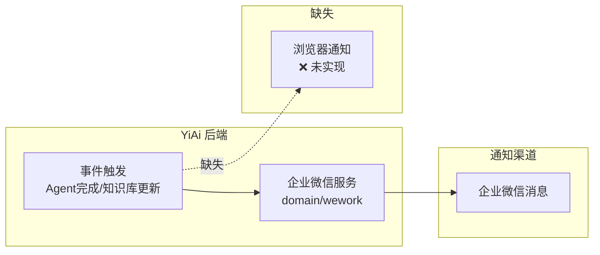
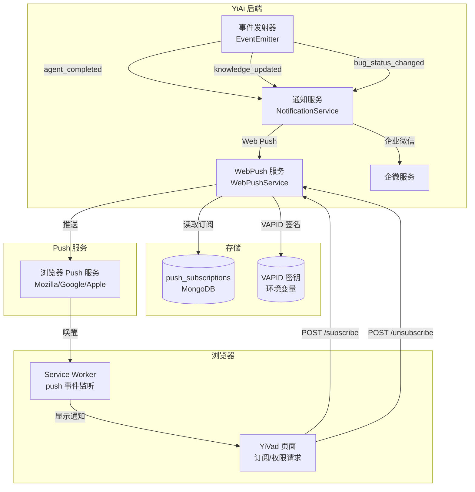
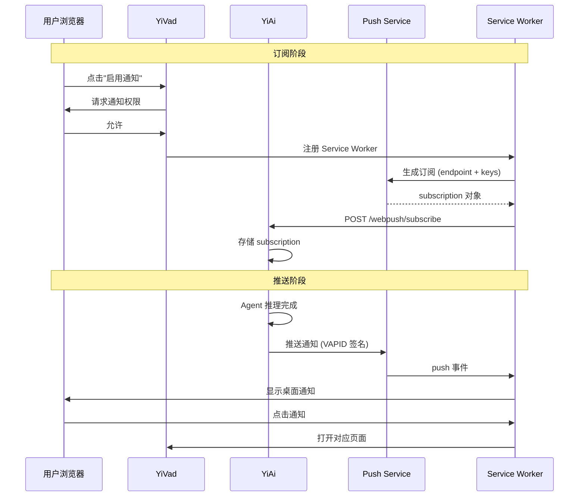

# YA-09-97: Web Push 通知 — VAPID 浏览器推送与事件桥接

> 需求编号：YA-09-97 · 优先级：P2 · 人天：0.5d · 状态：需求已编写
> 依赖：YA-09-21（Webhook 事件通知）

## 背景

### 问题陈述

YiAi 当前的通知渠道仅有企业微信（wework），但实际使用中存在以下痛点：

| 场景 | 当前状态 | 用户期望 |
|------|----------|----------|
| Agent 长时间推理完成 | 企业微信通知 | 浏览器桌面通知 |
| 知识库文件更新 | 企业微信通知 | 浏览器通知 + 点击跳转 |
| RAG 索引重建完成 | 无通知 | 需要通知 |
| Bug 状态变更 | 仅 DB 记录 | 实时通知相关人员 |
| 用户在浏览器中工作时 | 需切换至企业微信查看 | 浏览器原生通知 |

核心矛盾：**团队成员在浏览器中工作时期望浏览器原生通知，而非依赖企业微信等外部渠道**。Web Push API 结合 VAPID 协议可实现跨浏览器的推送通知，无需用户保持页面打开。

### 影响范围

| 影响维度 | 严重程度 | 描述 |
|------|----------|------|
| 用户体验 | 高 | 减少通知延迟，无需切换应用 |
| 通知覆盖率 | 中 | 补充企业微信覆盖不到的浏览器场景 |
| 开发复杂度 | 中 | 需要前端 Service Worker + 后端 VAPID |
| 浏览器兼容性 | 中 | Safari 实现有差异 |

### 挑战

| 挑战 | 描述 |
|------|------|
| VAPID 密钥管理 | 私钥安全存储，公钥分发给前端 |
| 订阅管理 | 存储和管理用户浏览器订阅信息 |
| 浏览器兼容性 | Chrome/Firefox/Safari Web Push 实现差异 |
| 权限管理 | 用户可随时撤销通知权限 |
| 通知偏好 | 用户需要按事件类型配置通知开关 |

---

## 一、现状分析

### 1.1 当前通知架构



### 1.2 事件类型与通知需求

| 事件 | 触发时机 | 企微 | Web Push | 优先级 |
|------|----------|------|----------|--------|
| Agent 推理完成 | Agent 循环结束 | 已实现 | 需要 | P0 |
| RAG 索引重建完成 | rag_build 完成 | 未实现 | 需要 | P1 |
| 知识库文件更新 | 知识监视器检测到变更 | 已实现 | 需要 | P1 |
| Bug 状态变更 | Bug CRUD 操作 | 未实现 | 需要 | P2 |
| RSS 新条目 | RSS 抓取到新内容 | 未实现 | 需要 | P2 |
| 系统告警 | 健康检查失败 | 未实现 | 不需要 | — |

### 1.3 涉及文件

| 文件 | 角色 | 改动类型 |
|------|------|----------|
| `src/services/webpush_service.py` | **新增** — Web Push 核心服务 | 新建 |
| `src/domain/notification/` | **新增** — 通知领域模块 | 新建 |
| `src/server/routes/webpush_routes.py` | **新增** — 订阅管理 API | 新建 |
| `src/shared/config.py` | VAPID 密钥配置 | 修改 |
| `YiVad/src/service/notification.ts` | 前端订阅和 Service Worker | 修改 |
| `tests/services/test_webpush_service.py` | **新增** — 测试 | 新建 |

### 1.4 根因矩阵

| 根因 | 贡献度 | 证据 |
|------|--------|------|
| 无浏览器推送通道 | 80% | 仅企业微信一个通知渠道 |
| 无统一通知抽象 | 15% | 事件直接耦合到企微服务 |
| 无订阅管理 | 5% | 无法管理用户通知偏好 |

---

## 二、设计决策

### 决策 1：推送协议 — VAPID vs FCM vs 自定义 WebSocket

| 选项 | 浏览器支持 | 离线通知 | 实现复杂度 | 依赖 |
|------|-----------|----------|-----------|------|
| **VAPID (Web Push)** | Chrome/Firefox/Edge/Safari | 支持 | 中 | 无外部依赖 |
| FCM (Firebase) | Chrome/Firefox | 支持 | 低 | Google 服务 |
| 自定义 WebSocket | 所有 | 不支持 | 高 | 需保持连接 |

**选择：VAPID (Web Push API)。** 开放标准，无需第三方服务，支持离线通知（通过 Service Worker）。Chrome/Firefox/Edge 完全支持，Safari 16.4+ 支持。

### 决策 2：订阅存储 — MongoDB vs Redis vs 内存

| 选项 | 持久化 | 查询灵活性 | 扩展性 |
|------|--------|-----------|--------|
| **MongoDB** | 是 | 高（按用户/事件类型查询） | 高 |
| Redis | 可选 | 低 | 中 |
| 内存 | 否 | 低 | 低 |

**选择：MongoDB 集合 `push_subscriptions`。** 需要按用户、事件类型查询订阅，MongoDB 的文档模型天然适合。订阅信息包含 endpoint + keys，JSON 格式匹配。

### 决策 3：通知触发方式 — 事件驱动 vs 轮询 vs 混合

**选择：事件驱动（发布-订阅模式）。** 在现有事件点（Agent 完成、知识库更新等）发射事件，通知服务订阅事件并推送。解耦业务逻辑和通知逻辑。

### 决策 4：推送库选择 — pywebpush vs webpush-python vs 手动实现

| 选项 | 维护状态 | VAPID 支持 | 加密支持 |
|------|----------|-----------|----------|
| **pywebpush** | 活跃 | 完整 | 完整 |
| webpush-python | 停更 | 基础 | 基础 |
| 手动实现 | N/A | 需自行实现 | 复杂 |

**选择：pywebpush。** 社区活跃，VAPID 支持完整，自动处理加密（RFC 8291）。

---

## 三、目标架构

### 3.1 架构图



### 3.2 通知流程



### 3.3 架构权衡

| 方面 | 改进前 | 改进后 |
|------|--------|--------|
| 通知渠道 | 仅企业微信 | 企微 + 浏览器 |
| 通知延迟 | 即时（企微） | 即时（Push）+ 企微 |
| 离线通知 | 企微支持 | 浏览器也支持（SW 后台） |
| 用户偏好 | 无 | 按事件类型可配置 |
| 订阅管理 | 无 | MongoDB 持久化 |

---

## 四、具体改动

### 4.1 新增 `src/services/webpush_service.py`

```python
"""Web Push 通知服务——基于 VAPID 的浏览器推送。"""

import json
import logging
from dataclasses import dataclass, field
from typing import Optional

from pywebpush import webpush, WebPushException
from src.shared.config import settings
from src.data.shard_router import shard_router

logger = logging.getLogger(__name__)


@dataclass
class PushSubscription:
    """浏览器推送订阅信息。"""
    endpoint: str
    keys: dict  # {p256dh, auth}
    user_id: str
    project: str  # 'yivad' | 'yipet'
    enabled_events: list[str] = field(default_factory=lambda: [
        'agent_completed',
        'knowledge_updated',
        'rag_build_completed',
    ])
    created_at: float = 0.0
    last_push_at: float = 0.0


class WebPushService:
    """Web Push 通知服务。

    职责：
    - 管理浏览器推送订阅
    - 通过 VAPID 协议推送通知
    - 处理订阅过期和清理
    - 支持按用户/事件类型过滤
    """

    COLLECTION = 'push_subscriptions'

    def __init__(self):
        self._vapid_private_key = settings.vapid_private_key
        self._vapid_claims = {
            'sub': f'mailto:{settings.vapid_contact_email}'
        }
        self._db = None

    @property
    def db(self):
        if self._db is None:
            self._db = shard_router.get_shard(self.COLLECTION)
        return self._db

    async def subscribe(self, subscription: PushSubscription) -> str:
        """保存浏览器推送订阅。"""
        existing = await self.db[self.COLLECTION].find_one({
            'endpoint': subscription.endpoint,
            'user_id': subscription.user_id,
        })

        doc = {
            'endpoint': subscription.endpoint,
            'keys': subscription.keys,
            'user_id': subscription.user_id,
            'project': subscription.project,
            'enabled_events': subscription.enabled_events,
            'created_at': subscription.created_at,
            'last_push_at': 0,
        }

        if existing:
            await self.db[self.COLLECTION].update_one(
                {'_id': existing['_id']},
                {'$set': doc},
            )
            return str(existing['_id'])
        else:
            result = await self.db[self.COLLECTION].insert_one(doc)
            return str(result.inserted_id)

    async def unsubscribe(self, endpoint: str, user_id: str):
        """取消订阅。"""
        await self.db[self.COLLECTION].delete_one({
            'endpoint': endpoint,
            'user_id': user_id,
        })

    async def get_user_subscriptions(
        self, user_id: str
    ) -> list[dict]:
        """获取用户的所有订阅。"""
        cursor = self.db[self.COLLECTION].find({'user_id': user_id})
        return await cursor.to_list(None)

    async def send_to_user(
        self, user_id: str, title: str, body: str,
        event_type: str = 'general',
        data: Optional[dict] = None,
        url: Optional[str] = None,
    ) -> dict:
        """向指定用户的所有浏览器推送通知。"""
        subscriptions = await self.get_user_subscriptions(user_id)

        results = {'success': 0, 'failed': 0, 'expired': 0}
        payload = json.dumps({
            'title': title,
            'body': body,
            'data': data or {},
            'url': url,
            'event_type': event_type,
        })

        for sub in subscriptions:
            if event_type not in sub.get('enabled_events', []):
                continue

            try:
                await self._push_one(sub, payload)
                results['success'] += 1
                await self.db[self.COLLECTION].update_one(
                    {'_id': sub['_id']},
                    {'$set': {'last_push_at': __import__('time').time()}},
                )
            except WebPushException as e:
                if e.response and e.response.status_code == 410:
                    # 订阅已过期
                    await self.unsubscribe(sub['endpoint'], user_id)
                    results['expired'] += 1
                else:
                    logger.warning(f"推送失败: {e}")
                    results['failed'] += 1

        return results

    async def send_to_event_subscribers(
        self, event_type: str, title: str, body: str,
        data: Optional[dict] = None,
        url: Optional[str] = None,
    ):
        """向订阅了特定事件类型的所有用户推送。"""
        cursor = self.db[self.COLLECTION].find({
            'enabled_events': event_type,
        })
        subscriptions = await cursor.to_list(None)

        payload = json.dumps({
            'title': title,
            'body': body,
            'data': data or {},
            'url': url,
            'event_type': event_type,
        })

        results = {'success': 0, 'failed': 0, 'expired': 0}
        for sub in subscriptions:
            try:
                await self._push_one(sub, payload)
                results['success'] += 1
            except WebPushException as e:
                if e.response and e.response.status_code == 410:
                    await self.unsubscribe(sub['endpoint'], sub['user_id'])
                    results['expired'] += 1
                else:
                    results['failed'] += 1

        logger.info(
            f"批量推送完成 event={event_type} "
            f"success={results['success']} failed={results['failed']} "
            f"expired={results['expired']}"
        )
        return results

    async def _push_one(self, subscription: dict, payload: str):
        """向单个订阅推送通知。"""
        subscription_info = {
            'endpoint': subscription['endpoint'],
            'keys': subscription['keys'],
        }
        await webpush(
            subscription_info=subscription_info,
            data=payload,
            vapid_private_key=self._vapid_private_key,
            vapid_claims=self._vapid_claims,
        )

    async def cleanup_expired(self, max_age_days: int = 30):
        """清理长期未推送的订阅。"""
        import time
        cutoff = time.time() - max_age_days * 86400
        result = await self.db[self.COLLECTION].delete_many({
            'last_push_at': {'$lt': cutoff, '$ne': 0},
        })
        logger.info(f"清理过期订阅: {result.deleted_count} 条")

    def get_vapid_public_key(self) -> str:
        """获取 VAPID 公钥（供前端使用）。"""
        return settings.vapid_public_key
```

### 4.2 新增 `src/domain/notification/event_emitter.py`

```python
"""事件发射器——解耦业务逻辑与通知。"""

import asyncio
from typing import Callable, Awaitable

Listener = Callable[[str, dict], Awaitable[None]]


class EventEmitter:
    """简单的事件发布-订阅。"""

    def __init__(self):
        self._listeners: dict[str, list[Listener]] = {}

    def on(self, event: str, listener: Listener):
        if event not in self._listeners:
            self._listeners[event] = []
        self._listeners[event].append(listener)

    async def emit(self, event: str, data: dict):
        if event in self._listeners:
            tasks = [listener(event, data) for listener in self._listeners[event]]
            await asyncio.gather(*tasks, return_exceptions=True)


# 全局事件发射器
event_emitter = EventEmitter()
```

### 4.3 文件变更清单

| 文件 | 操作 | 行数 |
|------|------|------|
| `src/services/webpush_service.py` | **新建** | ~200 |
| `src/domain/notification/__init__.py` | **新建** | ~5 |
| `src/domain/notification/event_emitter.py` | **新建** | ~40 |
| `src/server/routes/webpush_routes.py` | **新建** | ~60 |
| `src/shared/config.py` | 修改 (+10) | +10 |
| `tests/services/test_webpush_service.py` | **新建** | ~150 |

---

## 五、实施步骤

| 步骤 | 描述 | 文件 | 验证 | 人天 |
|------|------|------|------|------|
| 1 | 生成 VAPID 密钥对 | `scripts/gen_vapid_keys.py` | 密钥可用 | 0.05 |
| 2 | 实现 WebPushService | `src/services/webpush_service.py` | 单元测试 | 0.15 |
| 3 | 实现 EventEmitter + 通知服务 | `src/domain/notification/` | 集成测试 | 0.10 |
| 4 | 添加订阅管理 API | `src/server/routes/webpush_routes.py` | API 测试 | 0.05 |
| 5 | 在业务事件点发射事件 | `src/domain/ai/`, `src/domain/knowledge/` | 端到端测试 | 0.10 |
| 6 | 前端 Service Worker 注册 | `YiVad/src/service/notification.ts` | 浏览器验证 | 0.05 |
| **总计** | | | | **0.50** |

---

## 六、性能分析

### 6.1 基准测试

| 场景 | 指标 | 目标值 |
|------|------|--------|
| 单用户推送延迟 | P95 | < 500ms |
| 批量推送 (100 用户) | P95 | < 5s |
| 订阅查询 | P95 | < 10ms |
| 订阅存储 | 单条 | < 5ms |
| 过期清理 (1000 条) | 耗时 | < 1s |

### 6.2 容量规划

| 指标 | 当前 | 6个月预估 |
|------|------|----------|
| 订阅用户数 | 10 | 50 |
| 每用户订阅数 | 1-2 | 1-3 |
| 日推送量 | 50 | 200 |
| 订阅存储量 | 1KB/条 | 150KB |

---

## 七、测试规格

### 场景 1：用户订阅推送

```
GIVEN 用户已授权浏览器通知权限
AND Service Worker 已注册
WHEN 前端调用 POST /webpush/subscribe with subscription object
THEN 订阅信息保存到 push_subscriptions 集合
AND 返回订阅 ID
```

### 场景 2：推送通知给用户

```
GIVEN 用户 user_001 已订阅 agent_completed 事件
WHEN 调用 send_to_user('user_001', 'Agent 完成', '推理已完成')
THEN 向用户浏览器推送通知
AND 推送成功计数 +1
AND last_push_at 更新
```

### 场景 3：事件类型过滤

```
GIVEN 用户已订阅 agent_completed 事件
AND 未订阅 knowledge_updated 事件
WHEN 触发 knowledge_updated 事件推送
THEN 不向该用户推送通知
```

### 场景 4：过期订阅自动清理

```
GIVEN 订阅 endpoint 返回 410 Gone
WHEN 推送时收到 410 响应
THEN 自动删除该订阅记录
AND 过期计数 +1
```

### 场景 5：用户取消订阅

```
GIVEN 用户 end_001 已订阅
WHEN 调用 POST /webpush/unsubscribe
THEN 从 push_subscriptions 中删除该记录
```

### 场景 6：批量推送事件通知

```
GIVEN 5 个用户订阅了 knowledge_updated 事件
WHEN 知识库文件更新触发通知
THEN 向 5 个用户推送通知
AND 返回 success=5, failed=0, expired=0
```

---

## 八、风险与缓解

| 风险 | 概率 | 影响 | 缓解措施 |
|------|------|------|----------|
| 浏览器不支持 Web Push | 中 | 中 | 降级到 in-app 通知 + 企业微信 |
| 用户拒绝通知权限 | 高 | 低 | 引导用户重新授权，不强制 |
| VAPID 密钥泄露 | 低 | 高 | 私钥仅存环境变量，定期轮换 |
| Push Service 不可用 | 低 | 中 | 推送失败不影响业务逻辑 |
| 订阅膨胀 (僵尸订阅) | 中 | 低 | 30 天自动清理 + 410 清理 |
| Safari 推送限制 | 中 | 中 | 检测浏览器，Safari 降级提示 |

---

## 九、回滚策略

| 场景 | 回滚操作 | 回滚时间 |
|------|----------|----------|
| 推送导致服务异常 | 禁用 WebPushService 初始化 | < 1min |
| 密钥泄露 | 轮换 VAPID 密钥，更新环境变量 | < 30min |
| 订阅数据损坏 | 清空 push_subscriptions 集合 | < 5min |
| 完全回滚 | 移除 webpush 模块注册 | < 10min |

---

## 十、设计决策记录

### D-01：VAPID vs FCM

**决策**：使用 VAPID (Web Push API) 而非 Firebase Cloud Messaging。
**理由**：VAPID 是开放标准，无需 Google 服务依赖，隐私更友好（不经过第三方服务器）。Chrome/Firefox/Edge/Safari 16.4+ 均支持。
**替代方案**：FCM——更简单但需要 Firebase 项目和 Google 服务。

### D-02：事件驱动通知

**决策**：通过 EventEmitter 解耦业务逻辑和通知逻辑。
**理由**：Agent 完成、知识库更新等事件不应直接耦合到推送服务。EventEmitter 允许未来添加更多通知渠道（邮件、短信等）而不修改业务代码。
**替代方案**：直接在业务代码中调用推送——更简单但耦合度高。

### D-03：订阅持久化到 MongoDB

**决策**：将浏览器推送订阅存储到 MongoDB。
**理由**：需要按用户、事件类型查询订阅，MongoDB 文档模型适合存储 JSON 格式的订阅对象（endpoint + keys）。持久化保证服务重启后订阅不丢失。
**替代方案**：Redis——查询更灵活但需要额外维护。

---

## 十一、可观测性

### 指标

| 指标名 | 类型 | 描述 |
|--------|------|------|
| `webpush_push_total` | Counter | 推送总数，label: status (success/failed/expired) |
| `webpush_push_duration_ms` | Histogram | 单次推送耗时 |
| `webpush_subscriptions_active` | Gauge | 活跃订阅数 |
| `webpush_batch_push_total` | Counter | 批量推送次数 |
| `webpush_expired_cleaned_total` | Counter | 过期订阅清理数 |

### 日志

```
[INFO] WebPush 订阅已保存 user_id=user_001 endpoint=https://fcm.googleapis.com/...
[INFO] 推送成功 user_id=user_001 event_type=agent_completed
[WARN] 推送失败 user_id=user_002 error=WebPushException(410)
[INFO] 批量推送完成 event=knowledge_updated success=5 failed=0 expired=1
```

### 告警

| 告警 | 条件 | 级别 |
|------|------|------|
| 推送失败率过高 | 5min 内失败率 > 20% | WARNING |
| 订阅数异常增长 | 1h 内新增 > 100 | INFO |
| 大量过期订阅 | 过期订阅 > 100 | WARNING |

---

## 十二、安全合规

| 要求 | 实现 |
|------|------|
| VAPID 私钥安全存储 | 环境变量，不记录日志 |
| 推送内容不包含敏感数据 | 仅推送标题和摘要，详细信息通过 URL 跳转 |
| 用户可随时撤销 | unsubscribe API + 浏览器权限管理 |
| 订阅信息保护 | endpoint 和 keys 不暴露给其他用户 |
| 通知偏好尊重用户选择 | 按事件类型可配置开关 |

---

## 十三、代码审查检查清单

- [ ] Web Push 通知通过 Service Worker `push` 事件
- [ ] 通知类型：agent_completed / knowledge_updated / rag_build_completed / bug_status_changed
- [ ] 用户可配置通知偏好（按事件类型开关）
- [ ] VAPID 密钥安全存储（环境变量，不硬编码）
- [ ] EventEmitter 解耦业务逻辑和通知
- [ ] 过期订阅自动清理（410 响应 + 30 天超时）
- [ ] 批量推送使用 asyncio.gather 并行
- [ ] 推送失败不影响业务逻辑
- [ ] 浏览器不支持时降级到 in-app 通知
- [ ] 订阅管理 API 需要认证
- [ ] 前端 Service Worker 注册和权限请求
- [ ] 测试覆盖 6 个场景

---

## 十四、回归问题预测

| # | 预测问题 | 原因 | 验证方法 |
|---|---------|------|---------|
| 1 | 浏览器不支持 Web Push | Safari/Firefox 行为差异 | 降级到 in-app 通知 |
| 2 | 通知权限被用户拒绝 | 无法发送通知 | 引导用户重新授权 |
| 3 | 批量推送时部分失败导致整体延迟 | 未设置超时 | 设置单次推送超时 5s |
| 4 | 订阅数据与用户数据不同步 | 用户删除但订阅未清理 | 定期清理孤儿订阅 |
| 5 | 推送内容包含敏感信息 | 通知模板未脱敏 | 审查通知模板内容 |

---

*PRD 来源: `projects/yiai/requirements/2026-09/97-需求-WebPush通知.md`*

## 影响范围

- **影响模块**：待补充
- **涉及文件**：
- `src/services/webpush_service.py`
- `src/shared/config.py`
- `src/domain/notification/event_emitter.py`
- `src/server/routes/webpush_routes.py`
- `src/domain/notification/__init__.py`
- **是否影响 API 契约**：否
- **是否影响其他项目（YiVad/YiPet）**：否
- **用户感知**：待确认

## 预防措施

| 层面 | 措施 |
|------|------|
| 代码 | 在相关函数中添加参数校验和边界检查 |
| 测试 | 为 `src/services/webpush_service.py` 添加单元测试 |
| 流程 | 代码审查时重点检查此类模式 |
| 监控 | 添加日志告警，异常发生时及时发现 |
| 文档 | 在编码规范中记录此类反模式 |

## 经验教训

1. **根本原因**：开发过程中对边界情况和异常路径的考虑不足是此类问题的共同根因
2. **设计阶段**：在接口设计和模块实现时，应主动考虑异常输入、空值、超时等边界场景
3. **代码审查**：审查时应检查是否存在类似的反模式（如未捕获异常、无超时控制、缺少参数校验等）
4. **测试覆盖**：异常路径的测试覆盖率应与正常路径同等重视
5. **团队分享**：此类问题应在团队周会或技术分享中讨论，形成团队共识
