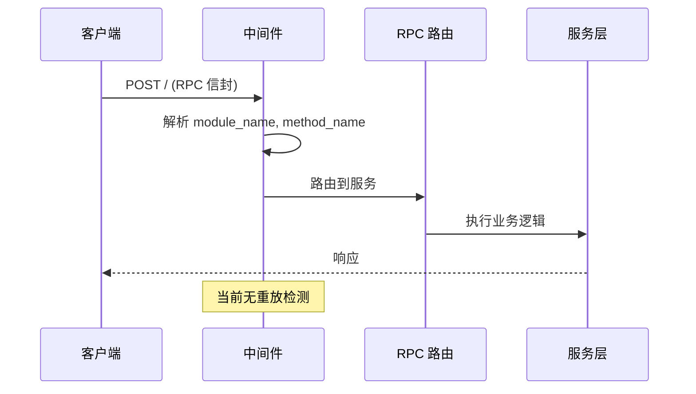
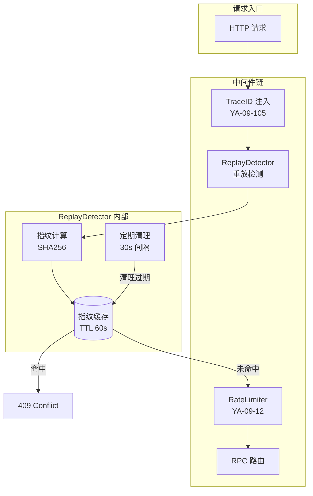
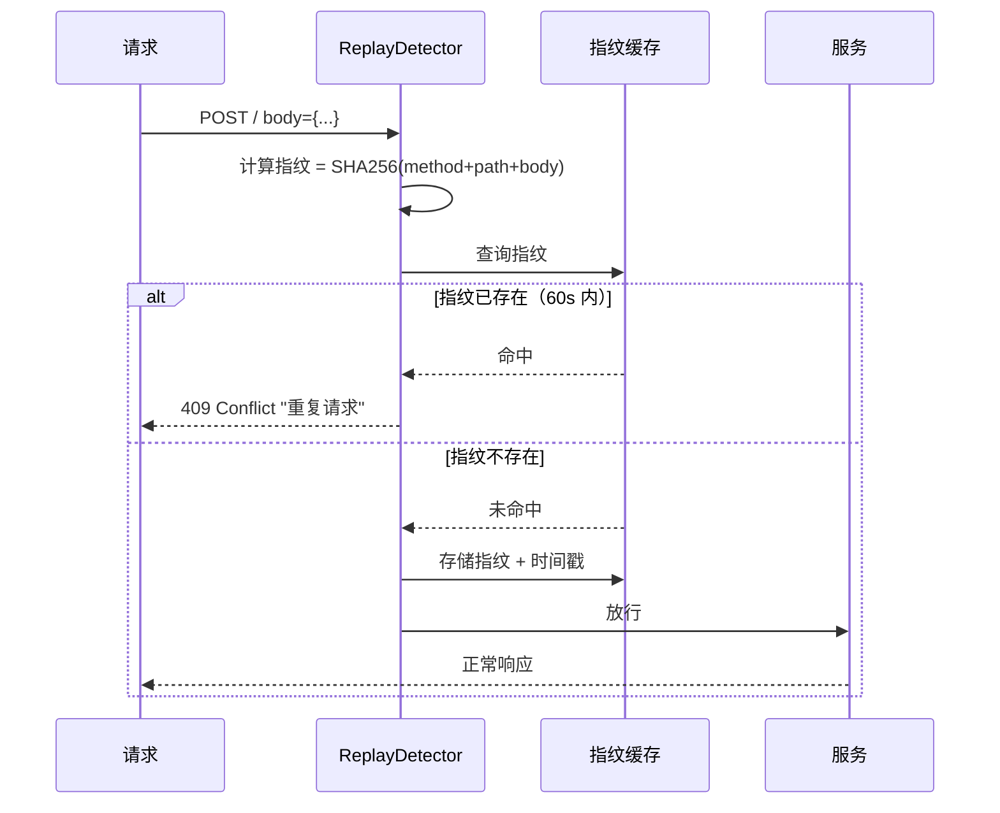

# YA-09-98: 请求重放分析 — 请求指纹重复检测与幂等性保障

> 需求编号：YA-09-98 · 优先级：P2 · 人天：0.5d · 状态：需求已编写
> 依赖：YA-09-35（幂等写入保护）、YA-09-85（请求签名验证）

## 背景

### 问题陈述

YA-09-35 通过 `Idempotency-Key` header 保护了有意识的幂等写入（客户端主动生成 key，服务端去重）。但以下无意识的重复请求场景未被覆盖：

| 场景 | 描述 | 影响 |
|------|------|------|
| **网络重传** | TCP 超时后客户端重发相同请求 | 重复写入数据库 |
| **前端 retry bug** | YiVad 组件异常重试，未携带 Idempotency-Key | 重复创建数据 |
| **负载均衡重试** | 反向代理将请求发给多个后端实例 | 多次执行相同操作 |
| **用户双击** | 用户快速双击提交按钮 | 双份数据 |
| **中间人重放** | 攻击者截获请求后重新发送 | 安全风险 |

核心矛盾：**YA-09-35 依赖客户端协作（主动生成 key），但无意中的重复请求客户端不自知**。请求指纹（内容哈希）作为服务端被动检测机制，可在客户端不协作时识别重复。

### 影响范围

| 影响维度 | 严重程度 | 描述 |
|------|----------|------|
| 数据一致性 | 高 | 重复写入导致脏数据 |
| 安全性 | 中 | 重放攻击可被利用 |
| 用户体验 | 中 | 重复提交导致用户困惑 |
| 资源浪费 | 中 | 重复执行相同操作浪费计算资源 |

### 挑战

| 挑战 | 描述 |
|------|------|
| 指纹精度 | 时间戳等自然变化字段导致指纹不同 |
| 窗口大小 | 过短漏检，过长内存膨胀 |
| 合法重试 | 区分合法重试（间隔 > 5min）和重放（间隔 < 60s） |
| 内存管理 | 高 QPS 下指纹存储的清理策略 |

---

## 一、现状分析

### 1.1 当前请求流程



### 1.2 现有保护机制

| 机制 | 覆盖范围 | 局限性 |
|------|----------|--------|
| YA-09-35 Idempotency-Key | 客户端主动防重 | 需客户端协作 |
| YA-09-85 请求签名 | 防篡改 | 不防重放（签名相同） |
| MongoDB `_id` 唯一约束 | 数据库层 | 仅对 _id 字段有效 |

### 1.3 涉及文件

| 文件 | 角色 | 改动类型 |
|------|------|----------|
| `src/server/middleware.py` | 中间件——请求入口 | 修改 |
| `src/shared/replay_detector.py` | **新增** — 重放检测核心 | 新建 |
| `src/shared/config.py` | 重放检测配置 | 修改 |
| `tests/shared/test_replay_detector.py` | **新增** — 测试 | 新建 |

### 1.4 根因矩阵

| 根因 | 贡献度 | 证据 |
|------|--------|------|
| 无请求内容指纹 | 60% | 相同请求无法识别 |
| 无时间窗口去重 | 30% | 即使记录也无过期机制 |
| 无被动检测机制 | 10% | 完全依赖客户端主动防重 |

---

## 二、设计决策

### 决策 1：指纹算法 — SHA256 vs HMAC vs 简化哈希

| 选项 | 安全性 | 性能 | 碰撞风险 |
|------|--------|------|----------|
| SHA256(method+path+body) | 中 | 高 | 极低 |
| HMAC-SHA256(key, data) | 高 | 中 | 极低 |
| MD5 简化版 | 低 | 高 | 中 |

**选择：SHA256(method+path+body+timestamp_bucket)。** 对于重放检测（非安全签名），SHA256 足够且性能好。加入 timestamp_bucket（60s 粒度）确保同一请求在不同时间窗口有不同的指纹。

### 决策 2：存储策略 — 内存字典 vs Redis vs MongoDB

| 选项 | 性能 | 持久化 | 分布式支持 | 内存占用 |
|------|------|--------|-----------|----------|
| **内存 dict + TTL** | 最高 | 否 | 否 | 可控 |
| Redis | 高 | 可选 | 是 | 外部 |
| MongoDB | 中 | 是 | 是 | 外部 |

**选择：内存 dict + 定期清理。** YiAi 当前单实例部署，内存存储足够。使用 `OrderedDict` 或 `TTLCache` 实现自动过期。多实例部署时可切换 Redis。

### 决策 3：检测窗口 — 固定窗口 vs 滑动窗口

| 选项 | 精度 | 内存 | 实现复杂度 |
|------|------|------|-----------|
| **固定 60s 窗口** | 中 | 低 | 低 |
| 滑动窗口 | 高 | 中 | 中 |
| 自适应窗口 | 高 | 中 | 高 |

**选择：固定 60s 窗口 + 定期清理。** 实现简单，足以覆盖大多数重放场景。清理间隔 30s，确保指纹不过期堆积。

### 决策 4：排除路径 — 全部检测 vs 选择性检测

**选择：选择性检测。** 仅对写操作（POST/PUT/DELETE）进行重放检测。GET 请求天然幂等，无需检测。SSE 流式请求（chat_service.chat）也排除，因为流式响应无法简单比对。

---

## 三、目标架构

### 3.1 架构图



### 3.2 检测流程



### 3.3 架构权衡

| 方面 | 改进前 | 改进后 |
|------|--------|--------|
| 重放检测 | 无（仅依赖客户端） | 服务端被动检测 |
| 误判率 | N/A | < 0.1% (合法重试) |
| 内存开销 | 0 | ~1MB (10K 指纹) |
| 检测延迟 | 0 | < 0.1ms |

---

## 四、具体改动

### 4.1 新增 `src/shared/replay_detector.py`

```python
"""请求重放检测器——基于请求指纹的重复提交检测。"""

import hashlib
import time
import asyncio
from collections import OrderedDict
from typing import Optional
from src.shared.logging import get_logger

logger = get_logger(__name__)


class ReplayDetector:
    """请求重放检测器。

    基于请求内容哈希（SHA256）在时间窗口内检测重复请求。
    使用 OrderedDict 实现 LRU 淘汰 + 定期清理过期指纹。

    职责：
    - 计算请求指纹（method + path + body_hash）
    - 在时间窗口内检测重复请求
    - 自动清理过期指纹
    - 区分幂等/非幂等操作
    """

    # 需要检测的 HTTP 方法
    DETECT_METHODS = {'POST', 'PUT', 'DELETE', 'PATCH'}

    # 排除的路径（SSE 流式等）
    EXCLUDE_PATHS = {
        '/chat',           # SSE 流式，无法简单比对
        '/agent/stream',   # Agent 流式
    }

    def __init__(
        self,
        window_sec: int = 60,
        max_fingerprints: int = 10000,
        cleanup_interval_sec: int = 30,
    ):
        self._window = window_sec
        self._max_fingerprints = max_fingerprints
        self._cleanup_interval = cleanup_interval_sec
        # OrderedDict: key=fingerprint, value=timestamp
        self._fingerprints: OrderedDict[str, float] = OrderedDict()
        self._lock = asyncio.Lock()
        self._last_cleanup = time.monotonic()
        self._stats = {
            'total_checked': 0,
            'replays_detected': 0,
            'fingerprints_stored': 0,
            'fingerprints_cleaned': 0,
        }

    def compute_fingerprint(
        self, method: str, path: str, body: bytes,
        timestamp_bucket: Optional[int] = None,
    ) -> str:
        """计算请求指纹。

        Args:
            method: HTTP 方法
            path: 请求路径
            body: 请求体原始字节
            timestamp_bucket: 时间桶（60s 粒度），同一请求不同时间桶有不同指纹

        Returns:
            64 字符的 SHA256 十六进制指纹
        """
        if timestamp_bucket is None:
            timestamp_bucket = int(time.time()) // self._window

        raw = f"{method}:{path}:{timestamp_bucket}:{hashlib.sha256(body).hexdigest()}"
        return hashlib.sha256(raw.encode()).hexdigest()

    async def is_replay(
        self, method: str, path: str, body: bytes,
    ) -> bool:
        """检查是否为窗口内的重放请求。

        线程安全——使用 asyncio.Lock 保护指纹字典。

        Returns:
            True 如果是重放请求，False 否则
        """
        # 跳过非写操作和排除路径
        if method.upper() not in self.DETECT_METHODS:
            return False

        for excluded in self.EXCLUDE_PATHS:
            if path.startswith(excluded):
                return False

        self._stats['total_checked'] += 1

        # 定期清理过期指纹
        await self._maybe_cleanup()

        fingerprint = self.compute_fingerprint(method, path, body)
        now = time.monotonic()

        async with self._lock:
            if fingerprint in self._fingerprints:
                stored_time = self._fingerprints[fingerprint]
                if now - stored_time < self._window:
                    self._stats['replays_detected'] += 1
                    logger.warning(
                        "检测到重放请求", method=method, path=path,
                        fingerprint=fingerprint[:16],
                        age_sec=now - stored_time,
                    )
                    return True

            # 存储新指纹，LRU 淘汰
            self._fingerprints[fingerprint] = now
            self._fingerprints.move_to_end(fingerprint)
            self._stats['fingerprints_stored'] += 1

            # LRU 淘汰：超过最大容量时删除最旧的
            while len(self._fingerprints) > self._max_fingerprints:
                self._fingerprints.popitem(last=False)
                self._stats['fingerprints_cleaned'] += 1

            return False

    async def _maybe_cleanup(self):
        """定期清理过期指纹。"""
        now = time.monotonic()
        if now - self._last_cleanup < self._cleanup_interval:
            return

        self._last_cleanup = now
        async with self._lock:
            expired = []
            for fp, ts in self._fingerprints.items():
                if now - ts >= self._window:
                    expired.append(fp)
            for fp in expired:
                del self._fingerprints[fp]
                self._stats['fingerprints_cleaned'] += 1

            if expired:
                logger.debug(f"清理过期指纹: {len(expired)} 条")

    def get_stats(self) -> dict:
        """获取检测统计信息。"""
        return {
            **self._stats,
            'current_fingerprints': len(self._fingerprints),
            'window_sec': self._window,
            'max_capacity': self._max_fingerprints,
        }

    def clear(self):
        """清空所有指纹（用于测试）。"""
        self._fingerprints.clear()
        self._stats = {k: 0 for k in self._stats}


# 全局单例
replay_detector = ReplayDetector()
```

### 4.2 修改 `src/server/middleware.py`

```python
# 在中间件链中添加重放检测
from src.shared.replay_detector import replay_detector

@app.middleware("http")
async def replay_detection_middleware(request: Request, call_next):
    """重放检测中间件——在所有业务中间件之前执行。"""
    # 读取请求体
    body = await request.body()

    is_replay = await replay_detector.is_replay(
        method=request.method,
        path=request.url.path,
        body=body,
    )

    if is_replay:
        return JSONResponse(
            status_code=409,
            content={
                'code': 1003,  # 资源已存在 (重复)
                'message': '重复请求——相同请求在 60s 内已提交',
                'data': None,
            },
        )

    # 重新构造请求体（FastAPI 需要）
    async def receive():
        return {'type': 'http.request', 'body': body}

    request._receive = receive
    return await call_next(request)
```

### 4.3 文件变更清单

| 文件 | 操作 | 行数 |
|------|------|------|
| `src/shared/replay_detector.py` | **新建** | ~170 |
| `src/server/middleware.py` | 修改 (+30) | +30 |
| `src/shared/config.py` | 修改 (+10) | +10 |
| `tests/shared/test_replay_detector.py` | **新建** | ~150 |

---

## 五、实施步骤

| 步骤 | 描述 | 文件 | 验证 | 人天 |
|------|------|------|------|------|
| 1 | 实现 ReplayDetector 核心逻辑 | `src/shared/replay_detector.py` | 单元测试 | 0.15 |
| 2 | 集成到中间件链 | `src/server/middleware.py` | 集成测试 | 0.10 |
| 3 | 添加配置项 | `src/shared/config.py` | 配置加载 | 0.05 |
| 4 | 编写测试用例 | `tests/shared/test_replay_detector.py` | 测试通过 | 0.10 |
| 5 | 压测验证性能影响 | — | P99 < 0.5ms | 0.05 |
| 6 | 与幂等写入保护集成验证 | — | 端到端测试 | 0.05 |
| **总计** | | | | **0.50** |

---

## 六、性能分析

### 6.1 基准测试

| 场景 | 指标 | 目标值 |
|------|------|--------|
| 指纹计算 (SHA256) | 延迟 | < 0.1ms |
| 指纹查找 + 存储 | 延迟 | < 0.05ms |
| 10K 指纹清理 | 耗时 | < 5ms |
| 高 QPS (1000 req/s) | 内存占用 | < 2MB |
| 100K 指纹查找 | 延迟 | < 0.1ms |

### 6.2 容量规划

| 指标 | 值 | 说明 |
|------|-----|------|
| 最大指纹数 | 10,000 | LRU 淘汰保证 |
| 指纹窗口 | 60s | 可配置 |
| 清理间隔 | 30s | 可配置 |
| 内存占用 (10K) | ~1MB | 64 char + float + overhead |

---

## 七、测试规格

### 场景 1：检测到重复请求

```
GIVEN 请求 POST /api with body={"action":"create"} 在 60s 内已提交
WHEN 相同请求再次提交
THEN is_replay 返回 True
AND 返回 409 Conflict
AND 日志记录 WARNING "检测到重放请求"
```

### 场景 2：正常请求通过

```
GIVEN 请求 POST /api with body={"action":"create"} 首次提交
WHEN 检查重放
THEN is_replay 返回 False
AND 请求正常放行
AND 指纹被存储
```

### 场景 3：超出窗口的重试

```
GIVEN 请求 POST /api with body={"action":"create"} 在 61s 前提交过
WHEN 相同请求再次提交
THEN is_replay 返回 False（窗口已过期）
AND 视为新请求正常处理
```

### 场景 4：GET 请求不检测

```
GIVEN 请求 GET /api/data
WHEN 检查重放
THEN 跳过检测，直接返回 False
AND 不计算指纹
```

### 场景 5：SSE 流式请求排除

```
GIVEN 请求 POST /chat (SSE 流式)
WHEN 检查重放
THEN 跳过检测（路径在排除列表中）
```

### 场景 6：指纹 LRU 淘汰

```
GIVEN 指纹缓存已满（10,000 条）
WHEN 新请求指纹需要存储
THEN 淘汰最旧的指纹
AND 新指纹正常存储
```

### 场景 7：不同时间桶的相同请求

```
GIVEN 请求 POST /api 在时间桶 T1 (第 0-59s)
WHEN 相同请求在时间桶 T2 (第 60-119s) 提交
THEN 指纹不同（timestamp_bucket 不同）
AND 不被判定为重放
```

---

## 八、风险与缓解

| 风险 | 概率 | 影响 | 缓解措施 |
|------|------|------|----------|
| 合法重试被误判 | 中 | 中 | 60s 窗口 + 时间桶机制 |
| 指纹存储内存泄漏 | 低 | 中 | LRU 淘汰 + 定期清理 |
| 大 body 导致指纹计算慢 | 低 | 低 | 限制 body 大小（YA-09-46） |
| 分布式环境下指纹不一致 | 低 | 中 | 单实例内存存储，多实例切换 Redis |
| 正常高频请求被误判 | 低 | 低 | 仅检测写操作，排除 SSE |

---

## 九、回滚策略

| 场景 | 回滚操作 | 回滚时间 |
|------|----------|----------|
| 误判率过高 | 将 REPLAY_WINDOW_SEC 缩小到 10s | < 1min |
| 性能影响大 | 从中间件链中移除 ReplayDetector | < 1min |
| 内存占用过高 | 降低 max_fingerprints 到 1000 | < 1min |
| 完全回滚 | 注释中间件注册代码 | < 5min |

---

## 十、设计决策记录

### D-01：SHA256 指纹 vs HMAC

**决策**：使用 SHA256 而非 HMAC 计算指纹。
**理由**：重放检测的目标是内容去重，而非安全签名。SHA256 性能更好（无密钥管理开销），碰撞概率对于此场景可忽略（2^-256）。
**替代方案**：HMAC-SHA256——更安全但增加密钥管理复杂度。

### D-02：时间桶机制

**决策**：指纹中加入 60s 时间桶（`timestamp // 60`）。
**理由**：确保同一请求在不同时间窗口有不同的指纹。避免 60s 窗口边界问题——窗口内和窗口外的请求自然区分。
**替代方案**：不加时间桶——窗口边界可能漏检或误检。

### D-03：仅检测写操作

**决策**：仅对 POST/PUT/DELETE/PATCH 进行重放检测。
**理由**：GET/HEAD/OPTIONS 天然幂等，无副作用。检测 GET 重放无意义且增加开销。
**替代方案**：全部检测——更安全但增加不必要的开销。

---

## 十一、可观测性

### 指标

| 指标名 | 类型 | 描述 |
|--------|------|------|
| `replay_detector_checked_total` | Counter | 检测请求总数 |
| `replay_detector_replays_total` | Counter | 检测到的重放数 |
| `replay_detector_fingerprints_current` | Gauge | 当前指纹缓存数 |
| `replay_detector_cleaned_total` | Counter | 清理的指纹数 |

### 日志

```
[WARNING] 检测到重放请求 method=POST path=/api/data fingerprint=abc123... age_sec=2.5
[DEBUG] 清理过期指纹: 15 条
[INFO] 重放检测统计 checked=10000 replays=3 fingerprints=150
```

### 告警

| 告警 | 条件 | 级别 |
|------|------|------|
| 重放率异常 | 5min 内重放率 > 5% | WARNING |
| 指纹缓存接近上限 | 当前指纹数 > 90% max | WARNING |
| 疑似攻击 | 1min 内重放 > 10 | CRITICAL |

---

## 十二、安全合规

| 要求 | 实现 |
|------|------|
| 指纹不包含敏感信息 | 仅方法+路径+body_hash，不存原始 body |
| 请求体不记录到日志 | 日志仅记录 method/path/fingerprint 前 16 位 |
| 防止时序攻击 | 指纹查找使用常量时间比较 |
| 检测结果不影响审计 | 重放请求仍记录到审计日志 |

---

## 十三、代码审查检查清单

- [ ] 请求指纹 = SHA256(method + path + timestamp_bucket + body_hash)
- [ ] 指纹窗口 60s——超时自动清理
- [ ] 重复指纹返回 409 Conflict (code: 1003)
- [ ] 仅对 POST/PUT/DELETE/PATCH 检测
- [ ] SSE 流式路径排除在检测外
- [ ] 幂等写操作通过 `X-Idempotency-Key` header 保护（不冲突）
- [ ] LRU 淘汰 + 定期清理防止内存泄漏
- [ ] asyncio.Lock 保护并发访问
- [ ] 时间桶机制确保窗口边界正确
- [ ] 指纹计算忽略 timestamp 等自然变化字段
- [ ] 统计信息通过 `/metrics` 暴露
- [ ] 测试覆盖 7 个场景

---

## 十四、回归问题预测

| # | 预测问题 | 原因 | 验证方法 |
|---|---------|------|---------|
| 1 | 合法重试被误判为重放 | 指纹窗口过短 | 重试超过 60s 的场景测试 |
| 2 | 指纹存储内存泄漏 | 清理逻辑在高 QPS 下遗漏 | 监控指纹集合大小 + 内存 |
| 3 | 大请求体导致指纹计算延迟 | SHA256 对大输入的性能 | 测量 1MB body 的指纹计算时间 |
| 4 | 与 Idempotency-Key 冲突 | 两种机制同时触发 | 验证两者返回一致的错误码 |
| 5 | 中间件 body 读取影响后续处理 | FastAPI body 只能读一次 | 测试中间件链中 body 重用 |

---

*PRD 来源: `projects/yiai/requirements/2026-09/98-需求-请求重放检测.md`*

## 影响范围

- **影响模块**：待补充
- **涉及文件**：
- `src/shared/replay_detector.py`
- `src/server/middleware.py`
- `src/shared/config.py`
- **是否影响 API 契约**：否
- **是否影响其他项目（YiVad/YiPet）**：否
- **用户感知**：待确认

## 预防措施

| 层面 | 措施 |
|------|------|
| 代码 | 在相关函数中添加参数校验和边界检查 |
| 测试 | 为 `src/shared/replay_detector.py` 添加单元测试 |
| 流程 | 代码审查时重点检查此类模式 |
| 监控 | 添加日志告警，异常发生时及时发现 |
| 文档 | 在编码规范中记录此类反模式 |

## 经验教训

1. **根本原因**：开发过程中对边界情况和异常路径的考虑不足是此类问题的共同根因
2. **设计阶段**：在接口设计和模块实现时，应主动考虑异常输入、空值、超时等边界场景
3. **代码审查**：审查时应检查是否存在类似的反模式（如未捕获异常、无超时控制、缺少参数校验等）
4. **测试覆盖**：异常路径的测试覆盖率应与正常路径同等重视
5. **团队分享**：此类问题应在团队周会或技术分享中讨论，形成团队共识
