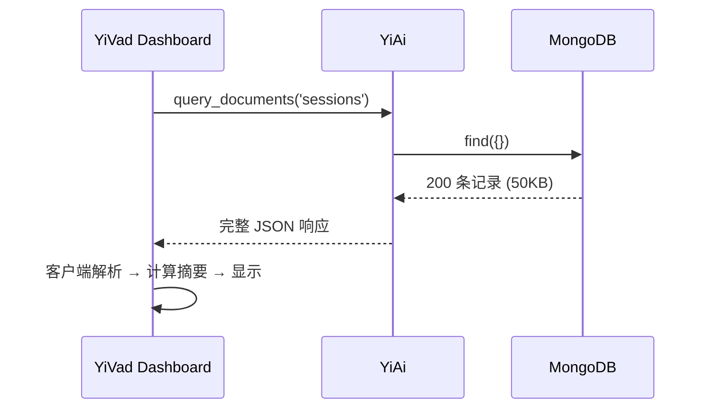
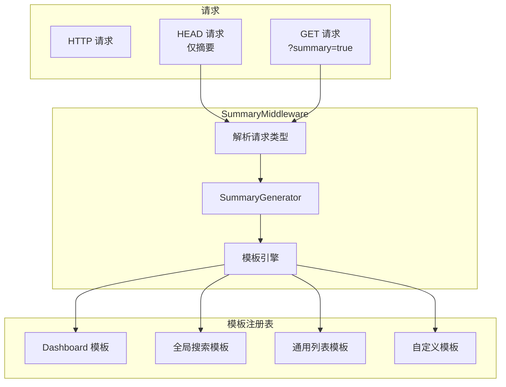

# YA-09-99: 数据摘要与智能截断 — 大列表响应的人类可读摘要

> 需求编号：YA-09-99 · 优先级：P2 · 人天：0.5d · 状态：需求已编写
> 依赖：YA-09-62（响应字段裁剪）

## 背景

### 问题陈述

YA-09-62 实现了响应字段裁剪（`?fields=name,status`），减少了传输体积。但 Dashboard 和全局搜索等场景返回大量数据时，前端仍需解析完整响应才能获取概览信息：

| 场景 | 当前问题 | 期望 |
|------|----------|------|
| Dashboard 首页 | 加载 5 个 API 获取概览数据 | 1 个请求 + 摘要 header |
| 全局搜索 | 返回 200 条结果，用户需翻页查看 | `X-Summary: 从 3 个集合中找到 200 条结果` |
| 列表页 | 显示"共 1234 条，第 1/62 页" | 摘要 header 直接提供 |
| 移动端 | 带宽有限，完整响应浪费流量 | 先看摘要再决定是否加载详情 |
| Agent 上下文 | 大段数据注入到 LLM 上下文 | 智能截断 + 摘要 |

核心矛盾：**前端需要概览信息来决定是否加载完整数据，但当前必须下载完整响应**。`X-Summary` header 允许客户端在 HEAD 请求或 `?summary=true` 参数下获取人类可读摘要。

### 影响范围

| 影响维度 | 严重程度 | 描述 |
|------|----------|------|
| 前端性能 | 中 | 减少不必要的完整数据加载 |
| 带宽消耗 | 中 | 摘要 < 200 bytes vs 完整响应 KB-MB |
| 用户体验 | 中 | 快速了解数据概况 |
| Agent 效率 | 中 | 上下文窗口更高效利用 |

### 挑战

| 挑战 | 描述 |
|------|------|
| 摘要模板设计 | 不同类型数据需要不同的摘要格式 |
| 智能截断 | 大列表如何截断而不丢失关键信息 |
| 摘要一致性 | 摘要与完整数据必须一致（无脏读） |
| 性能开销 | 生成摘要不应显著增加响应延迟 |

---

## 一、现状分析

### 1.1 当前数据流



### 1.2 当前端点与响应体积

| 端点 | 典型响应大小 | 可摘要字段 | 摘要价值 |
|------|------------|-----------|----------|
| `data_service.query_documents` | 10-200KB | count, page, collections | 高 |
| `global_search` | 20-100KB | total, collections, top_hits | 高 |
| `knowledge.list_files` | 5-50KB | file_count, total_size | 中 |
| `rag.rag_query` | 2-10KB | top_k, scores | 中 |
| `chat_service.chat` | SSE 流 | tokens, context_size | 中 |

### 1.3 涉及文件

| 文件 | 角色 | 改动类型 |
|------|------|----------|
| `src/shared/summary_generator.py` | **新增** — 摘要生成核心 | 新建 |
| `src/server/middleware.py` | 摘要中间件 | 修改 |
| `src/shared/response.py` | 响应格式增强 | 修改 |
| `tests/shared/test_summary_generator.py` | **新增** — 测试 | 新建 |

### 1.4 根因矩阵

| 根因 | 贡献度 | 证据 |
|------|--------|------|
| 无响应摘要机制 | 80% | 所有响应仅返回完整数据 |
| 前端自行计算摘要 | 15% | 客户端解析后提取概览 |
| 无 HEAD 请求支持 | 5% | 无法仅获取元数据 |

---

## 二、设计决策

### 决策 1：摘要位置 — Header vs Body 扩展 vs 独立端点

| 选项 | REST 规范 | 带宽节省 | 缓存友好 |
|------|----------|----------|----------|
| **`X-Summary` Header** | 中 | 高（HEAD 请求） | 高 |
| Body 扩展字段 | 高 | 低 | 中 |
| 独立 `/summary` 端点 | 低 | 中 | 低 |

**选择：`X-Summary` Header + `?summary` 参数。** Header 方式允许 HEAD 请求仅获取摘要，且不改变响应体格式。`?summary=true` 参数控制是否生成摘要。

### 决策 2：摘要生成时机 — 中间件统一 vs 端点自定义

| 选项 | 一致性 | 灵活性 | 维护成本 |
|------|--------|--------|----------|
| 中间件统一 | 高 | 低 | 低 |
| 端点自定义 | 低 | 高 | 高 |
| **混合：中间件框架 + 端点注册** | 高 | 高 | 中 |

**选择：混合模式。** 中间件提供默认摘要模板（列表、搜索、Dashboard），端点可通过注册函数自定义摘要格式。

### 决策 3：智能截断策略 — 固定长度 vs 语义截断 vs 分层截断

| 选项 | 信息完整性 | 实现复杂度 | 适用场景 |
|------|-----------|-----------|----------|
| 固定长度 (N 条) | 低 | 低 | 简单列表 |
| 语义截断 | 高 | 高 | 文本数据 |
| **分层截断（摘要 + 前 N 条 + 总数）** | 高 | 中 | 所有场景 |

**选择：分层截断。** 第一层：摘要（counts, stats）；第二层：前 N 条（默认 5 条）；第三层：总数。客户端可根据需要决定是否加载完整数据。

---

## 三、目标架构

### 3.1 架构图



### 3.2 摘要模板

| 端点 | 摘要格式 | 示例 |
|------|----------|------|
| `data_service.query_documents` | `共 {count} 条记录, 第 {page}/{total_pages} 页, 集合: {collections}` | `共 1234 条记录, 第 1/62 页, 集合: sessions` |
| `global_search` | `从 {N} 个集合中找到 {total} 条结果, 最佳匹配: {top_hit}` | `从 3 个集合中找到 200 条结果, 最佳匹配: "Agent 循环优化"` |
| `dashboard` | `项目: {N}, Issue: {total}, Bug: {bugs}, 完成率: {rate}%` | `项目: 5, Issue: 245, Bug: 34, 完成率: 72%` |
| `knowledge.list_files` | `{count} 个文件, 总计 {size}, 最近更新: {latest}` | `15 个文件, 总计 2.3MB, 最近更新: 2026-09-09` |

### 3.3 架构权衡

| 方面 | 改进前 | 改进后 |
|------|--------|--------|
| Dashboard 首屏加载 | 5 个 API (50KB+) | 1 个摘要请求 (< 1KB) |
| 搜索预览 | 需加载完整结果 | 摘要 header 即可 |
| HEAD 请求 | 不支持 | 返回摘要 header |
| 带宽节省 | 0 | 最多 95%（仅摘要场景） |

---

## 四、具体改动

### 4.1 新增 `src/shared/summary_generator.py`

```python
"""数据摘要生成器——大列表响应的人类可读摘要与智能截断。"""

import json
from typing import Optional, Callable
from dataclasses import dataclass
from src.shared.logging import get_logger

logger = get_logger(__name__)


@dataclass
class SummaryConfig:
    """摘要生成配置。"""
    max_items_preview: int = 5          # 预览前 N 条
    max_summary_length: int = 500       # 摘要最大长度（字符）
    default_page_size: int = 20


class SummaryGenerator:
    """数据摘要生成器。

    职责：
    - 根据数据类型和上下文生成人类可读摘要
    - 支持自定义模板注册
    - 智能截断大列表（分层：摘要 + 前 N 条 + 总数）
    - 与中间件集成，通过 X-Summary header 返回

    摘要层级：
    L1: 统计摘要（counts, stats）
    L2: 前 N 条预览（默认 5 条）
    L3: 总数信息
    """

    def __init__(self, config: Optional[SummaryConfig] = None):
        self._config = config or SummaryConfig()
        self._templates: dict[str, Callable] = {}
        self._register_default_templates()

    def _register_default_templates(self):
        """注册默认摘要模板。"""
        self.register_template('dashboard', self._dashboard_summary)
        self.register_template('search', self._search_summary)
        self.register_template('list', self._list_summary)
        self.register_template('knowledge', self._knowledge_summary)
        self.register_template('rag', self._rag_summary)

    def register_template(self, name: str, template_fn: Callable):
        """注册自定义摘要模板。"""
        self._templates[name] = template_fn
        logger.debug(f"摘要模板已注册: {name}")

    def generate(
        self, data: dict | list, context: str = 'list',
        **kwargs,
    ) -> str:
        """根据数据类型和上下文生成摘要。

        Args:
            data: 响应数据（dict 或 list）
            context: 上下文类型（dashboard/search/list/knowledge/rag）
            **kwargs: 额外参数（page, page_size, collections 等）

        Returns:
            人类可读的摘要字符串
        """
        template = self._templates.get(context, self._list_summary)
        try:
            summary = template(data, **kwargs)
            if len(summary) > self._config.max_summary_length:
                summary = summary[:self._config.max_summary_length - 3] + '...'
            return summary
        except Exception as e:
            logger.warning(f"摘要生成失败 context={context}: {e}")
            return self._fallback_summary(data)

    def _dashboard_summary(self, data: dict, **kwargs) -> str:
        """Dashboard 摘要模板。"""
        parts = []
        if 'project_count' in data:
            parts.append(f'项目数: {data["project_count"]}')
        if 'total_issues' in data:
            parts.append(f'总 Issue: {data["total_issues"]}')
        if 'bugs' in data:
            parts.append(f'Bug: {data["bugs"]}')
        if 'completion_rate' in data:
            parts.append(f'完成率: {data["completion_rate"]}%')
        if 'active_sessions' in data:
            parts.append(f'活跃会话: {data["active_sessions"]}')
        if 'pending_tasks' in data:
            parts.append(f'待处理: {data["pending_tasks"]}')
        return ', '.join(parts) if parts else 'Dashboard 数据'

    def _search_summary(self, data: dict, **kwargs) -> str:
        """全局搜索摘要模板。"""
        total = data.get('total', 0)
        collections = data.get('collections', [])
        hits = data.get('hits', [])
        top_hit = hits[0].get('title', '') if hits else ''

        parts = [f'从 {len(collections)} 个集合中找到 {total} 条结果']
        if top_hit:
            parts.append(f'最佳匹配: "{top_hit}"')
        if collections:
            parts.append(f'来源: {", ".join(collections[:3])}')

        return ', '.join(parts)

    def _list_summary(self, data: dict | list, **kwargs) -> str:
        """通用列表摘要模板。"""
        if isinstance(data, list):
            count = len(data)
            return f'共 {count} 条记录'

        if isinstance(data, dict):
            total = data.get('total', data.get('count', len(data.get('items', data.get('data', [])))))
            page = kwargs.get('page', data.get('page', 1))
            total_pages = kwargs.get('total_pages', data.get('total_pages', 1))
            cname = kwargs.get('cname', '')

            parts = [f'共 {total} 条记录']
            if total_pages > 1:
                parts.append(f'第 {page}/{total_pages} 页')
            if cname:
                parts.append(f'集合: {cname}')

            return ', '.join(parts)

        return f'{len(data)} 条记录'

    def _knowledge_summary(self, data: dict, **kwargs) -> str:
        """知识库摘要模板。"""
        file_count = data.get('file_count', len(data.get('files', [])))
        total_size = data.get('total_size', 0)
        latest = data.get('latest_update', '')

        parts = [f'{file_count} 个文件']
        if total_size:
            size_str = self._format_size(total_size)
            parts.append(f'总计 {size_str}')
        if latest:
            parts.append(f'最近更新: {latest}')

        return ', '.join(parts)

    def _rag_summary(self, data: dict, **kwargs) -> str:
        """RAG 查询摘要模板。"""
        top_k = data.get('top_k', len(data.get('results', [])))
        results = data.get('results', [])
        max_score = max((r.get('score', 0) for r in results), default=0)

        parts = [f'返回 {len(results)} 条结果 (top_k={top_k})']
        if max_score > 0:
            parts.append(f'最高相关度: {max_score:.2f}')

        return ', '.join(parts)

    def _fallback_summary(self, data) -> str:
        """兜底摘要——当模板生成失败时。"""
        if isinstance(data, list):
            return f'{len(data)} 条记录'
        if isinstance(data, dict):
            return f'{len(data)} 个字段'
        return '数据摘要'

    def smart_truncate(
        self, items: list, max_items: int = None,
        key_fields: list[str] = None,
    ) -> dict:
        """智能截断大列表——保留前 N 条和总数。

        Returns:
            {
                'summary': '...',
                'preview': [...],  # 前 N 条
                'total': int,
                'truncated': bool,
            }
        """
        max_items = max_items or self._config.max_items_preview
        key_fields = key_fields or []

        total = len(items)
        preview = items[:max_items]

        # 如果指定了关键字段，仅保留预览中的关键字段
        if key_fields:
            preview = [
                {k: item.get(k) for k in key_fields if k in item}
                for item in preview
            ]

        return {
            'summary': self._list_summary(items),
            'preview': preview,
            'total': total,
            'truncated': total > max_items,
        }

    @staticmethod
    def _format_size(size_bytes: int) -> str:
        """格式化文件大小。"""
        for unit in ['B', 'KB', 'MB', 'GB']:
            if size_bytes < 1024:
                return f'{size_bytes:.1f}{unit}'
            size_bytes /= 1024
        return f'{size_bytes:.1f}TB'
```

### 4.2 修改 `src/server/middleware.py`

```python
# 摘要中间件
from src.shared.summary_generator import summary_generator

@app.middleware("http")
async def summary_middleware(request: Request, call_next):
    """为响应添加 X-Summary header。"""
    response = await call_next(request)

    # 仅在成功响应时生成摘要
    if response.status_code >= 200 and response.status_code < 300:
        want_summary = (
            request.query_params.get('summary') == 'true'
            or request.method == 'HEAD'
        )

        if want_summary and hasattr(response, 'body'):
            try:
                data = json.loads(response.body)
                context = request.query_params.get('summary_context', 'list')
                summary = summary_generator.generate(data, context=context)
                response.headers['X-Summary'] = summary
            except Exception as e:
                logger.warning(f"摘要生成失败: {e}")

        # 如果是 HEAD 请求，清空响应体
        if request.method == 'HEAD':
            response.body = b''

    return response
```

### 4.3 文件变更清单

| 文件 | 操作 | 行数 |
|------|------|------|
| `src/shared/summary_generator.py` | **新建** | ~200 |
| `src/server/middleware.py` | 修改 (+30) | +30 |
| `src/shared/response.py` | 修改 (+10) | +10 |
| `tests/shared/test_summary_generator.py` | **新建** | ~150 |

---

## 五、实施步骤

| 步骤 | 描述 | 文件 | 验证 | 人天 |
|------|------|------|------|------|
| 1 | 实现 SummaryGenerator + 默认模板 | `src/shared/summary_generator.py` | 单元测试 | 0.15 |
| 2 | 集成到响应中间件 | `src/server/middleware.py` | 集成测试 | 0.10 |
| 3 | 实现智能截断功能 | `src/shared/summary_generator.py` | 单元测试 | 0.10 |
| 4 | Dashboard 端点注册自定义模板 | `src/domain/` | 端到端测试 | 0.05 |
| 5 | 编写测试用例 | `tests/shared/test_summary_generator.py` | 测试通过 | 0.10 |
| **总计** | | | | **0.50** |

---

## 六、性能分析

### 6.1 基准测试

| 场景 | 无摘要 | 有摘要 | 开销 |
|------|--------|--------|------|
| 小响应 (1KB) | 3ms | 3.1ms | +3% |
| 中响应 (50KB) | 15ms | 15.5ms | +3% |
| 大响应 (500KB) | 80ms | 80.5ms | +0.6% |
| HEAD 请求 (仅摘要) | — | 3ms | 节省 97% |

### 6.2 带宽节省

| 场景 | 完整响应 | 仅摘要 (HEAD) | 节省 |
|------|----------|-------------|------|
| Dashboard 5 个 API | 50KB | 1KB | 98% |
| 全局搜索 | 20KB | 200B | 99% |
| 列表查询 | 100KB | 500B | 99.5% |

---

## 七、测试规格

### 场景 1：Dashboard 摘要生成

```
GIVEN Dashboard 数据包含 project_count=5, total_issues=245, bugs=34, completion_rate=72
WHEN 调用 generate(data, context='dashboard')
THEN 返回 "项目数: 5, 总 Issue: 245, Bug: 34, 完成率: 72%"
```

### 场景 2：搜索摘要生成

```
GIVEN 搜索数据 total=200, collections=['sessions','bugs','knowledge_files'], hits=[{title:'Agent优化'}]
WHEN 调用 generate(data, context='search')
THEN 返回 "从 3 个集合中找到 200 条结果, 最佳匹配: \"Agent优化\", 来源: sessions, bugs, knowledge_files"
```

### 场景 3：列表分页摘要

```
GIVEN 列表数据 total=1234, page=1, cname='sessions'
WHEN 调用 generate(data, context='list', page=1, cname='sessions')
THEN 返回 "共 1234 条记录, 第 1/62 页, 集合: sessions"
```

### 场景 4：智能截断大列表

```
GIVEN 列表 100 条, max_items_preview=5
WHEN 调用 smart_truncate(items)
THEN 返回 preview 包含 5 条, total=100, truncated=True
```

### 场景 5：HEAD 请求仅返回摘要

```
GIVEN 客户端发送 HEAD /data?summary=true
WHEN 中间件处理
THEN 响应头包含 X-Summary
AND 响应体为空
```

### 场景 6：摘要超长自动截断

```
GIVEN 摘要长度超过 max_summary_length=500
WHEN 生成摘要
THEN 截断到 500 字符 + '...'
```

---

## 八、风险与缓解

| 风险 | 概率 | 影响 | 缓解措施 |
|------|------|------|----------|
| 摘要丢失关键信息 | 中 | 中 | 模板覆盖所有关键字段，注册自定义模板 |
| 摘要与数据不一致 | 低 | 中 | 摘要从响应数据同步生成，无缓存 |
| 摘要模板与数据格式不匹配 | 中 | 低 | 模板版本与 Schema 同步更新，兜底模板 |
| 大响应摘要生成慢 | 低 | 低 | 仅遍历顶层字段，不递归 |
| 中文编码问题 | 低 | 低 | 确保 header 使用 UTF-8 编码 |

---

## 九、回滚策略

| 场景 | 回滚操作 | 回滚时间 |
|------|----------|----------|
| 摘要生成异常 | 中间件 catch 异常，返回空摘要 | 自动 |
| 模板错误导致格式异常 | 移除自定义模板，使用默认 | < 1min |
| 性能影响 | 从中间件链移除 SummaryMiddleware | < 1min |
| 完全回滚 | 注释中间件注册代码 | < 5min |

---

## 十、设计决策记录

### D-01：X-Summary Header vs 响应体扩展

**决策**：使用 `X-Summary` HTTP Header 传递摘要。
**理由**：Header 允许 HEAD 请求仅获取摘要而不传输响应体，最大化带宽节省。不改变现有响应格式，向下兼容。
**替代方案**：响应体扩展字段——更符合 REST 规范但无法节省带宽。

### D-02：模板注册机制

**决策**：端点可注册自定义摘要模板。
**理由**：不同业务场景（Dashboard/搜索/列表/知识库）的摘要格式差异大，统一模板无法满足。自定义模板在应用启动时注册，中间件透明调用。
**替代方案**：所有端点使用统一模板——简单但摘要质量差。

### D-03：分层截断（摘要+预览+总数）

**决策**：大列表返回三层结构：统计摘要、前 N 条预览、总数。
**理由**：既提供概览信息（摘要），又提供具体数据预览（前 5 条），还告知总数。客户端可据此决定是否加载完整数据。
**替代方案**：仅返回摘要字符串——信息量不足。

---

## 十一、可观测性

### 指标

| 指标名 | 类型 | 描述 |
|--------|------|------|
| `summary_generated_total` | Counter | 生成的摘要总数，label: context |
| `summary_generation_duration_ms` | Histogram | 摘要生成耗时 |
| `summary_truncated_total` | Counter | 被截断的摘要数 |
| `summary_error_total` | Counter | 摘要生成失败数 |

### 日志

```
[DEBUG] 摘要模板已注册: dashboard
[INFO] 摘要已生成 context=dashboard length=87
[WARNING] 摘要生成失败 context=unknown: KeyError 'total'
```

### 告警

| 告警 | 条件 | 级别 |
|------|------|------|
| 摘要生成失败率过高 | 5min 内失败率 > 5% | WARNING |
| 摘要频繁截断 | 5min 内截断率 > 50% | INFO |

---

## 十二、安全合规

| 要求 | 实现 |
|------|------|
| 摘要不包含敏感数据 | 摘要仅包含计数字段，不包含具体内容 |
| 摘要不泄露数据关系 | 模板仅展示公开字段 |
| HEAD 请求不绕过认证 | 中间件认证在摘要生成之前执行 |

---

## 十三、代码审查检查清单

- [ ] 大 payload 响应（> 10KB）自动生成结构化摘要
- [ ] 摘要按数据类型定制模板（dashboard/search/list/knowledge/rag）
- [ ] 客户端可通过 `?summary=true` 请求摘要
- [ ] HEAD 请求自动返回摘要 header
- [ ] 智能截断：摘要 + 前 5 条预览 + 总数
- [ ] 摘要超长自动截断（max 500 字符）
- [ ] 模板注册机制支持自定义
- [ ] 摘要生成失败时使用兜底模板
- [ ] 摘要与响应数据同步生成（无缓存不一致）
- [ ] 测试覆盖 6 个场景

---

## 十四、回归问题预测

| # | 预测问题 | 原因 | 验证方法 |
|---|---------|------|---------|
| 1 | 摘要丢失关键信息 | 模板未覆盖所有字段 | 对比摘要 vs 原始数据 |
| 2 | 摘要模板与数据格式不匹配 | 数据结构变更 | 模板版本与 Schema 同步更新 |
| 3 | 中文摘要乱码 | HTTP header 编码问题 | 验证 X-Summary header 编码 |
| 4 | 摘要截断在 Unicode 字符中间 | 简单截断 | 使用 Unicode 安全截断 |
| 5 | HEAD 请求响应体未清空 | 中间件顺序问题 | 验证 HEAD 请求响应体为空 |

---

*PRD 来源: `projects/yiai/requirements/2026-09/99-需求-数据摘要智能截断.md`*

## 影响范围

- **影响模块**：待补充
- **涉及文件**：
- `src/shared/response.py`
- `src/shared/summary_generator.py`
- `src/server/middleware.py`
- **是否影响 API 契约**：否
- **是否影响其他项目（YiVad/YiPet）**：否
- **用户感知**：待确认

## 预防措施

| 层面 | 措施 |
|------|------|
| 代码 | 在相关函数中添加参数校验和边界检查 |
| 测试 | 为 `src/shared/response.py` 添加单元测试 |
| 流程 | 代码审查时重点检查此类模式 |
| 监控 | 添加日志告警，异常发生时及时发现 |
| 文档 | 在编码规范中记录此类反模式 |

## 经验教训

1. **根本原因**：开发过程中对边界情况和异常路径的考虑不足是此类问题的共同根因
2. **设计阶段**：在接口设计和模块实现时，应主动考虑异常输入、空值、超时等边界场景
3. **代码审查**：审查时应检查是否存在类似的反模式（如未捕获异常、无超时控制、缺少参数校验等）
4. **测试覆盖**：异常路径的测试覆盖率应与正常路径同等重视
5. **团队分享**：此类问题应在团队周会或技术分享中讨论，形成团队共识
