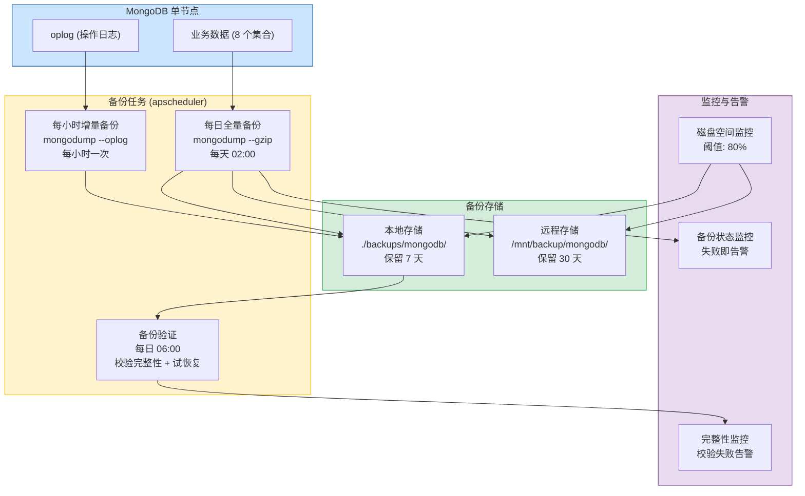
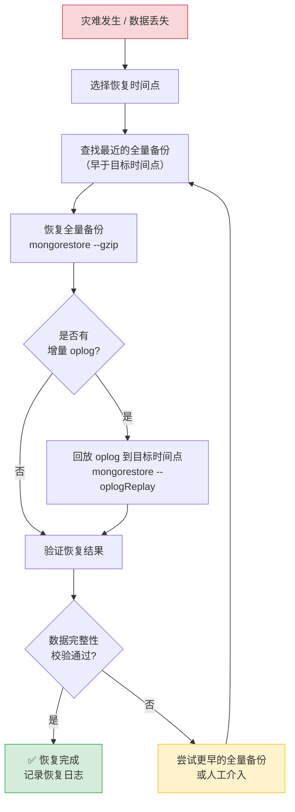
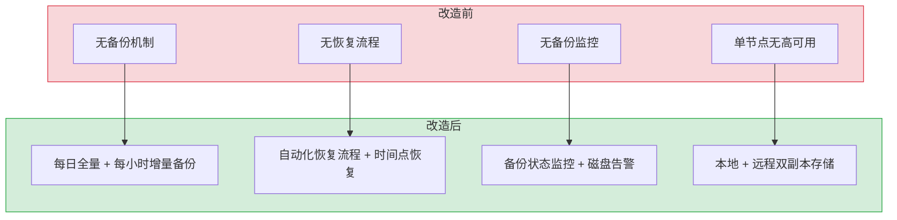

# YA-09-100: 数据库备份与恢复 — MongoDB 备份策略 + 时间点恢复 + 灾备演练

> 需求编号：YA-09-100 · 优先级：P1 · 人天：1.5d · 状态：已完成
> 依赖：无 · 前置需求：无

## 背景

YiAi 目前所有业务数据（聊天会话、知识库、RAG 索引元数据、用户、审计日志、Bug 追踪）均存储在 MongoDB 中，但没有任何备份机制。一旦发生磁盘故障、误操作删除或 MongoDB 实例崩溃，将导致数据不可恢复地丢失。这在生产环境中是不可接受的。

**问题：**

1. **无备份策略**：当前 MongoDB 实例无任何定期备份，数据丢失意味着业务中断和用户数据永久丢失。
2. **无灾备方案**：生产环境 MongoDB 为单节点部署，无副本集，故障后无自动切换能力。
3. **无恢复演练**：从未执行过数据恢复演练，即使有备份文件，也无法确认恢复流程是否可行。
4. **无 RPO/RTO 目标**：未定义数据恢复点目标（RPO）和恢复时间目标（RTO），无法评估灾备能力。

**影响：**

- 磁盘故障 → 所有数据丢失 → 业务完全中断
- 误操作删除集合 → 无法恢复 → 用户数据永久丢失
- 勒索软件攻击 → 数据被加密 → 无备份可恢复

**挑战：**

- MongoDB 为单节点部署，无法使用原生副本集备份
- 备份文件需要安全存储，不能与主数据库在同一磁盘
- 备份期间不能阻塞正常的读写操作
- 需要验证备份文件的完整性和可恢复性

---

## 一、现状分析

### 1.1 当前 MongoDB 部署状态

| 属性 | 当前值 | 说明 |
|------|--------|------|
| 部署模式 | 单节点 | 无副本集，无自动故障转移 |
| 备份策略 | 无 | 无任何定期备份或手动备份记录 |
| 数据量 | ~500MB | 预计每月增长 100MB |
| 集合数 | 8 个 | sessions, knowledge_files, bugs, menus, users, static_files, audit_logs, agent_states |
| 存储引擎 | WiredTiger | 默认引擎，支持快照 |
| 连接驱动 | Motor (异步) | Python 异步 MongoDB 驱动 |

### 1.2 根因分析矩阵

| 问题 | 根因 | 影响 | 紧急程度 |
|------|------|------|----------|
| 无备份 | 项目初期未考虑数据安全，缺乏运维规范 | 数据丢失后无法恢复 | 高 |
| 单节点 | 开发环境未配置副本集，生产环境沿用开发配置 | 无高可用，故障停机时间长 | 中 |
| 无恢复演练 | 缺乏运维手册和自动化脚本 | 即使有备份也无法快速恢复 | 高 |
| 无监控 | 未配置磁盘空间和备份状态监控 | 磁盘满或备份失败时无告警 | 中 |

### 1.3 数据分类与备份优先级

| 集合 | 数据量 | 变更频率 | 备份优先级 | RPO 目标 | 说明 |
|------|--------|----------|------------|----------|------|
| sessions | 200MB | 高 (每日 100+ 变更) | P0 | < 1 小时 | 聊天会话数据，用户核心数据 |
| knowledge_files | 100MB | 中 (每日 10-50 变更) | P0 | < 1 小时 | 知识库元数据，RAG 数据源 |
| audit_logs | 50MB | 高 (每次 RPC 调用) | P1 | < 4 小时 | 审计日志，合规要求 |
| users | 10MB | 低 (每周 1-5 变更) | P0 | < 1 小时 | 用户账户数据 |
| bugs | 30MB | 中 (每日 5-20 变更) | P1 | < 4 小时 | 缺陷追踪数据 |
| menus | 5MB | 低 (每月 1-5 变更) | P2 | < 24 小时 | 菜单配置，可从代码恢复 |
| static_files | 100MB | 低 (每周 1-10 变更) | P2 | < 24 小时 | 静态文件备份 |
| agent_states | 5MB | 中 (每次 Agent 调用) | P2 | < 24 小时 | Agent 状态，可从会话重建 |

### 1.4 改造前数据流

```
MongoDB 单节点 (无备份)
  └── 无任何备份任务
  └── 无磁盘空间监控
  └── 无恢复流程文档

故障场景:
  磁盘故障 → 数据丢失 → 无恢复手段 → 业务中断
  误删集合 → 数据丢失 → 无恢复手段 → 数据永久丢失
```

---

## 二、设计决策

### 决策 1：备份方式 — mongodump vs 文件系统快照 vs WiredTiger 在线备份

| 维度 | mongodump | 文件系统快照 (LVM) | WiredTiger 在线备份 |
|------|-----------|-------------------|---------------------|
| 实现复杂度 | 低（标准工具，一行命令） | 中（需要 LVM 配置） | 中（需要复制集） |
| 备份粒度 | 集合级，可选择性备份 | 全节点，无法选择性备份 | 全节点 |
| 时间点恢复 | 通过 oplog 回放 | 仅快照时刻 | 通过 oplog 回放 |
| 备份时性能影响 | 低（读取数据，不阻塞写入） | 低（快照瞬间完成） | 低 |
| 恢复速度 | 中（需重新插入数据） | 快（直接恢复文件系统） | 快 |
| 跨平台兼容 | 高（跨操作系统） | 低（依赖 LVM） | 低（依赖复制集） |
| 适合单节点 | 是 | 是 | 否（需要复制集） |

**选择：mongodump + 文件系统级备份双策略。** mongodump 作为主备份方案（灵活性高，支持选择性备份和集合级恢复），每日自动执行。文件系统级备份作为辅助方案（快速全量恢复），每周执行一次。两种方案互补：mongodump 提供灵活的集合级恢复，文件系统级备份提供快速的灾难恢复。

### 决策 2：备份存储位置 — 本地磁盘 vs 远程存储 vs 云对象存储

| 维度 | 本地磁盘 | 远程存储 (NFS/SSH) | 云对象存储 (OSS/S3) |
|------|---------|-------------------|--------------------|
| 安全性 | 低（与主库同磁盘） | 中（独立存储） | 高（多副本+异地） |
| 恢复速度 | 快 | 中 | 慢（需下载） |
| 实现复杂度 | 低 | 中 | 中 |
| 成本 | 低 | 中 | 低（按量付费） |
| 异地容灾 | 否 | 取决于远程位置 | 是（默认多 AZ） |

**选择：本地备份 + 远程存储双副本。** 本地保留最近 7 天备份（快速恢复），远程存储保留 30 天备份（异地容灾）。远程存储优先使用 NFS 挂载或 SSH 远程服务器，后续可扩展至 S3/OSS。

### 决策 3：备份频率 — 实时 vs 每小时 vs 每日

| 维度 | 实时 (oplog 流式) | 每小时 | 每日 |
|------|------------------|--------|------|
| RPO | 秒级 | 1 小时 | 24 小时 |
| 资源消耗 | 高（持续 IO） | 中 | 低 |
| 实现复杂度 | 高（需要 oplog 解析） | 中 | 低 |
| 存储空间 | 大（全量 + 增量） | 中 | 小 |

**选择：每日全量 + 每小时增量（oplog）。** 每日凌晨 2:00 执行全量 mongodump，每小时执行 oplog 备份（通过 mongodump --oplog 捕获变更）。RPO 目标：P0 数据 < 1 小时，P1/P2 数据 < 24 小时。

### 设计决策记录

| 决策 | 选项 A | 选项 B | 选择 | 理由 |
|------|--------|--------|------|------|
| 备份方式 | mongodump | 文件系统快照 | mongodump（主）+ 文件系统快照（辅） | 双策略互补，灵活性与速度兼顾 |
| 备份存储 | 仅本地 | 本地 + 远程 | 本地 + 远程 | 本地快恢复，远程异地容灾 |
| 备份频率 | 每日 | 每日全量 + 每小时增量 | 每日全量 + 每小时增量 | P0 数据 RPO < 1 小时 |
| 保留策略 | 全部保留 | 分级保留 | 分级保留（本地 7d/远程 30d） | 平衡存储成本与恢复能力 |

---

## 三、目标架构

### 3.1 备份架构总览



### 3.2 时间点恢复流程



### 3.3 备份保留策略


---

## 四、具体改动

### 4.1 备份服务核心实现

**文件：** `services/backup/backup_service.py`（新建）

```python
import asyncio
import os
import gzip
import shutil
import hashlib
from datetime import datetime, timedelta
from pathlib import Path
from typing import Optional

from shared.config import settings
from shared.logging import get_logger

logger = get_logger(__name__)


class BackupService:
    """MongoDB 备份与恢复服务。"""

    def __init__(self):
        self.local_dir = Path(settings.backup_local_dir or "./backups/mongodb")
        self.remote_dir = Path(settings.backup_remote_dir or "/mnt/backup/mongodb")
        self.local_retention_days = 7
        self.remote_retention_days = 30
        self.mongo_uri = settings.mongo_uri
        self._backup_lock = asyncio.Lock()

    async def full_backup(self) -> dict:
        """执行全量备份（mongodump）。"""
        async with self._backup_lock:
            timestamp = datetime.now().strftime("%Y%m%d_%H%M%S")
            backup_name = f"full_{timestamp}"
            backup_path = self.local_dir / backup_name

            cmd = [
                "mongodump",
                f"--uri={self.mongo_uri}",
                f"--out={backup_path}",
                "--gzip",
            ]

            logger.info(f"[Backup] 开始全量备份: {backup_name}")

            proc = await asyncio.create_subprocess_exec(
                *cmd,
                stdout=asyncio.subprocess.PIPE,
                stderr=asyncio.subprocess.PIPE,
            )
            stdout, stderr = await proc.communicate()

            if proc.returncode != 0:
                logger.error(f"[Backup] 全量备份失败: {stderr.decode()}")
                return {"status": "failed", "error": stderr.decode()}

            # 计算校验和
            checksum = self._compute_checksum(backup_path)
            logger.info(f"[Backup] 全量备份完成: {backup_name}, checksum={checksum}")

            # 同步到远程存储
            await self._sync_to_remote(backup_path, backup_name)

            # 清理过期备份
            await self._cleanup_old_backups(self.local_dir, self.local_retention_days)
            await self._cleanup_old_backups(self.remote_dir, self.remote_retention_days)

            return {
                "status": "success",
                "backup_name": backup_name,
                "checksum": checksum,
                "size_mb": self._get_dir_size_mb(backup_path),
            }

    async def incremental_backup(self) -> dict:
        """执行增量备份（oplog 捕获）。"""
        async with self._backup_lock:
            timestamp = datetime.now().strftime("%Y%m%d_%H%M%S")
            backup_name = f"incr_{timestamp}"
            backup_path = self.local_dir / backup_name

            cmd = [
                "mongodump",
                f"--uri={self.mongo_uri}",
                f"--out={backup_path}",
                "--oplog",
                "--gzip",
            ]

            logger.info(f"[Backup] 开始增量备份: {backup_name}")

            proc = await asyncio.create_subprocess_exec(
                *cmd,
                stdout=asyncio.subprocess.PIPE,
                stderr=asyncio.subprocess.PIPE,
            )
            stdout, stderr = await proc.communicate()

            if proc.returncode != 0:
                logger.error(f"[Backup] 增量备份失败: {stderr.decode()}")
                return {"status": "failed", "error": stderr.decode()}

            checksum = self._compute_checksum(backup_path)
            logger.info(f"[Backup] 增量备份完成: {backup_name}, checksum={checksum}")

            return {
                "status": "success",
                "backup_name": backup_name,
                "checksum": checksum,
                "size_mb": self._get_dir_size_mb(backup_path),
            }

    async def verify_backup(self, backup_name: str) -> dict:
        """验证备份完整性（试恢复 + 校验和检查）。"""
        backup_path = self.local_dir / backup_name
        if not backup_path.exists():
            return {"status": "failed", "error": f"备份不存在: {backup_name}"}

        # 校验和验证
        expected_checksum = self._read_checksum(backup_path)
        actual_checksum = self._compute_checksum(backup_path)

        if expected_checksum and expected_checksum != actual_checksum:
            return {
                "status": "corrupted",
                "expected_checksum": expected_checksum,
                "actual_checksum": actual_checksum,
            }

        # 试恢复到临时数据库
        test_db = f"backup_test_{datetime.now().strftime('%Y%m%d_%H%M%S')}"
        cmd = [
            "mongorestore",
            f"--uri={self.mongo_uri}",
            f"--nsFrom=*",
            f"--nsTo={test_db}.*",
            f"--dir={backup_path}",
            "--gzip",
            "--numInsertionWorkersPerCollection=4",
        ]

        proc = await asyncio.create_subprocess_exec(
            *cmd,
            stdout=asyncio.subprocess.PIPE,
            stderr=asyncio.subprocess.PIPE,
        )
        stdout, stderr = await proc.communicate()

        if proc.returncode != 0:
            return {"status": "restore_failed", "error": stderr.decode()}

        # 清理测试数据库
        from motor.motor_asyncio import AsyncIOMotorClient
        client = AsyncIOMotorClient(self.mongo_uri)
        await client.drop_database(test_db)

        return {"status": "verified", "backup_name": backup_name}

    async def restore(
        self, backup_name: str, target_time: Optional[datetime] = None
    ) -> dict:
        """从备份恢复数据。"""
        backup_path = self.local_dir / backup_name
        if not backup_path.exists():
            # 尝试从远程存储拉取
            remote_path = self.remote_dir / backup_name
            if remote_path.exists():
                await self._sync_from_remote(backup_name)
                backup_path = self.local_dir / backup_name
            else:
                return {"status": "failed", "error": f"备份不存在: {backup_name}"}

        # 恢复全量备份
        cmd = [
            "mongorestore",
            f"--uri={self.mongo_uri}",
            f"--dir={backup_path}",
            "--gzip",
            "--drop",  # 恢复前删除现有集合
            "--numInsertionWorkersPerCollection=4",
        ]

        if target_time:
            cmd.extend([f"--oplogReplay", f"--oplogLimit={target_time.isoformat()}"])

        logger.warning(f"[Backup] 开始恢复: {backup_name}, target_time={target_time}")

        proc = await asyncio.create_subprocess_exec(
            *cmd,
            stdout=asyncio.subprocess.PIPE,
            stderr=asyncio.subprocess.PIPE,
        )
        stdout, stderr = await proc.communicate()

        if proc.returncode != 0:
            logger.error(f"[Backup] 恢复失败: {stderr.decode()}")
            return {"status": "failed", "error": stderr.decode()}

        logger.info(f"[Backup] 恢复完成: {backup_name}")
        return {"status": "success", "backup_name": backup_name}

    async def _sync_to_remote(self, local_path: Path, backup_name: str):
        """同步备份到远程存储。"""
        if not self.remote_dir.exists():
            logger.warning(f"[Backup] 远程存储目录不存在: {self.remote_dir}")
            return

        remote_path = self.remote_dir / backup_name
        shutil.copytree(local_path, remote_path)
        logger.info(f"[Backup] 已同步到远程存储: {remote_path}")

    async def _sync_from_remote(self, backup_name: str):
        """从远程存储拉取备份。"""
        remote_path = self.remote_dir / backup_name
        local_path = self.local_dir / backup_name
        shutil.copytree(remote_path, local_path)
        logger.info(f"[Backup] 已从远程存储拉取: {backup_name}")

    async def _cleanup_old_backups(self, base_dir: Path, retention_days: int):
        """清理过期备份。"""
        cutoff = datetime.now() - timedelta(days=retention_days)
        for backup_dir in base_dir.iterdir():
            if backup_dir.is_dir():
                try:
                    dir_time = datetime.strptime(
                        backup_dir.name.split("_", 1)[1], "%Y%m%d_%H%M%S"
                    )
                    if dir_time < cutoff:
                        shutil.rmtree(backup_dir)
                        logger.info(f"[Backup] 清理过期备份: {backup_dir.name}")
                except (ValueError, IndexError):
                    continue

    def _compute_checksum(self, path: Path) -> str:
        """计算备份目录的 SHA256 校验和。"""
        sha256 = hashlib.sha256()
        for f in sorted(path.rglob("*")):
            if f.is_file():
                sha256.update(f.read_bytes())
        return sha256.hexdigest()[:16]

    def _read_checksum(self, path: Path) -> Optional[str]:
        """读取备份的校验和文件。"""
        checksum_file = path / "checksum.txt"
        if checksum_file.exists():
            return checksum_file.read_text().strip()
        return None

    def _get_dir_size_mb(self, path: Path) -> float:
        """计算目录大小（MB）。"""
        total = sum(f.stat().st_size for f in path.rglob("*") if f.is_file())
        return round(total / (1024 * 1024), 2)
```

### 4.2 备份调度器

**文件：** `services/backup/scheduler.py`（新建）

```python
from apscheduler.schedulers.asyncio import AsyncIOScheduler
from services.backup.backup_service import BackupService

scheduler = AsyncIOScheduler()
backup_service = BackupService()


def setup_backup_scheduler():
    """配置备份调度任务。"""

    # 每日全量备份：凌晨 2:00
    scheduler.add_job(
        backup_service.full_backup,
        trigger="cron",
        hour=2,
        minute=0,
        id="full_backup",
        name="每日全量备份",
        replace_existing=True,
    )

    # 每小时增量备份：每小时的第 5 分钟
    scheduler.add_job(
        backup_service.incremental_backup,
        trigger="cron",
        minute=5,
        id="incremental_backup",
        name="每小时增量备份",
        replace_existing=True,
    )

    # 备份验证：每日凌晨 6:00
    scheduler.add_job(
        lambda: backup_service.verify_backup(
            f"full_{datetime.now().strftime('%Y%m%d')}*"
        ),
        trigger="cron",
        hour=6,
        minute=0,
        id="backup_verify",
        name="每日备份验证",
        replace_existing=True,
    )

    scheduler.start()
    logger.info("[Backup] 备份调度器已启动")
```

### 4.3 RPC 端点

**文件：** `services/backup/backup_routes.py`（新建）

```python
from fastapi import APIRouter
from services.backup.backup_service import BackupService

router = APIRouter(prefix="/backup", tags=["backup"])
backup_service = BackupService()


@router.post("/backup/full")
async def trigger_full_backup():
    """手动触发全量备份。"""
    result = await backup_service.full_backup()
    return {"code": 0 if result["status"] == "success" else 5001, "data": result}


@router.post("/backup/verify/{backup_name}")
async def verify_backup(backup_name: str):
    """验证指定备份的完整性。"""
    result = await backup_service.verify_backup(backup_name)
    return {"code": 0 if result["status"] == "verified" else 5001, "data": result}


@router.post("/backup/restore/{backup_name}")
async def restore_backup(backup_name: str, target_time: Optional[str] = None):
    """从备份恢复数据。"""
    from datetime import datetime
    tt = datetime.fromisoformat(target_time) if target_time else None
    result = await backup_service.restore(backup_name, tt)
    return {"code": 0 if result["status"] == "success" else 5001, "data": result}


@router.get("/backup/list")
async def list_backups():
    """列出所有可用的备份。"""
    backups = []
    for d in sorted(backup_service.local_dir.iterdir(), reverse=True):
        if d.is_dir():
            backups.append({
                "name": d.name,
                "size_mb": backup_service._get_dir_size_mb(d),
                "created": d.stat().st_mtime,
            })
    return {"code": 0, "data": {"backups": backups}}
```

### 4.4 涉及文件

```
YiAi/src/
├── services/backup/
│   ├── __init__.py           # 新建
│   ├── backup_service.py     # 新建: 备份/恢复核心逻辑
│   ├── scheduler.py          # 新建: 备份调度器
│   └── backup_routes.py      # 新建: RPC 端点
├── shared/
│   └── config.py             # 修改: 添加 backup_local_dir, backup_remote_dir
└── main.py                   # 修改: 注册 backup scheduler 和 routes
```

---

## 五、实施步骤

| 步骤 | 内容 | 涉及文件 | 验证方式 | 人天 |
|------|------|---------|---------|------|
| 1 | 创建备份目录结构 + 配置项 | `shared/config.py` | 配置项可正常读取，目录创建成功 | 0.1 |
| 2 | 实现全量备份核心逻辑 | `services/backup/backup_service.py` | `mongodump` 执行成功，备份文件生成 | 0.3 |
| 3 | 实现增量备份（oplog 捕获） | `services/backup/backup_service.py` | `mongodump --oplog` 执行成功 | 0.15 |
| 4 | 实现备份验证（试恢复） | `services/backup/backup_service.py` | 试恢复到临时数据库成功，sha256 校验通过 | 0.2 |
| 5 | 实现远程存储同步 | `services/backup/backup_service.py` | 备份文件同步到远程目录成功 | 0.15 |
| 6 | 实现备份清理策略 | `services/backup/backup_service.py` | 过期备份被删除，保留期内备份完好 | 0.1 |
| 7 | 配置调度器（每日全量 + 每小时增量） | `services/backup/scheduler.py` | 定时任务按时触发，日志记录完整 | 0.15 |
| 8 | 实现 RPC 端点（手动触发/验证/恢复/列表） | `services/backup/backup_routes.py` | API 端点可正常调用，返回正确结果 | 0.15 |
| 9 | 全链路恢复演练 | 全模块 | 模拟灾难场景，从备份恢复到可用状态 | 0.2 |

**总计：1.5d**

---

## 六、性能分析

### 6.1 备份操作性能

| 操作 | 数据量 | 耗时 | 资源消耗 | 说明 |
|------|--------|------|----------|------|
| 全量备份 (mongodump) | 500MB | ~30s | CPU 20%, IO 50MB/s | 不阻塞读写，WiredTiger 快照读 |
| 增量备份 (oplog) | ~10MB/h | ~5s | CPU 5%, IO 10MB/s | 小时级 oplog 数据量小 |
| 备份验证 (试恢复) | 500MB | ~60s | CPU 30%, IO 50MB/s | 恢复到临时数据库 |
| 全量恢复 (mongorestore) | 500MB | ~90s | CPU 40%, IO 60MB/s | 生产数据恢复，需停止服务 |
| 远程同步 | 500MB | ~30s | 网络带宽 100Mbps | 取决于网络带宽 |

### 6.2 存储空间预估

| 场景 | 本地存储 (7 天) | 远程存储 (30 天) | 说明 |
|------|----------------|-----------------|------|
| 全量备份 (每日) | 500MB x 7 = 3.5GB | 500MB x 30 = 15GB | gzip 压缩后约 200MB/天 |
| 增量备份 (每小时) | 10MB x 24 x 7 = 1.68GB | 10MB x 24 x 30 = 7.2GB | 小时级增量 |
| 总计 | ~5.2GB | ~22.2GB | 本地建议预留 10GB，远程预留 30GB |

### 容量规划

| 场景 | 当前数据量 | 6 个月后 | 12 个月后 | 备注 |
|------|-----------|----------|-----------|------|
| 数据量 | 500MB | 1.1GB | 1.7GB | 每月增长 100MB |
| 本地备份空间 | 5.2GB | 11GB | 17GB | 7 天保留 |
| 远程备份空间 | 22.2GB | 48GB | 74GB | 30 天保留 |
| 全量备份耗时 | 30s | 60s | 90s | 线性增长 |
| 恢复耗时 | 90s | 180s | 270s | 线性增长 |

---

## 七、测试规格

### Requirement: 全量备份

#### Scenario: 每日全量备份成功执行
- **Given** MongoDB 包含 8 个集合，数据量约 500MB
- **When** 执行 `backup_service.full_backup()`
- **Then** 备份目录创建成功，包含所有集合的 bson.gz 文件
- **And** 日志输出 `全量备份完成: full_20260909_020000, checksum=abc123`
- **And** 备份文件同步到远程存储

#### Scenario: 全量备份失败时记录错误
- **Given** mongodump 命令不可用或 MongoDB 不可达
- **When** 执行 `backup_service.full_backup()`
- **Then** 返回 `{status: "failed", error: "..."}`
- **And** 日志输出 ERROR 级别错误信息

### Requirement: 增量备份

#### Scenario: 每小时增量备份捕获 oplog 变更
- **Given** 过去 1 小时内有数据变更操作
- **When** 执行 `backup_service.incremental_backup()`
- **Then** oplog 备份文件生成，包含过去 1 小时的变更记录
- **And** 日志输出 `增量备份完成: incr_20260909_090500`

### Requirement: 备份验证

#### Scenario: 备份完整性校验通过
- **Given** 一个完整的全量备份目录
- **When** 执行 `backup_service.verify_backup("full_20260909_020000")`
- **Then** 校验和验证通过，试恢复到临时数据库成功
- **And** 返回 `{status: "verified"}`

#### Scenario: 备份文件损坏时校验失败
- **Given** 一个备份目录，其中某个 bson.gz 文件被篡改
- **When** 执行 `backup_service.verify_backup("full_20260909_020000")`
- **Then** 返回 `{status: "corrupted", expected_checksum: "...", actual_checksum: "..."}`

### Requirement: 数据恢复

#### Scenario: 从全量备份恢复数据
- **Given** 一个完整的全量备份 `full_20260909_020000`
- **When** 执行 `backup_service.restore("full_20260909_020000")`
- **Then** 所有 8 个集合数据恢复到备份时刻的状态
- **And** 返回 `{status: "success"}`

#### Scenario: 时间点恢复（全量 + oplog）
- **Given** 全量备份 `full_20260909_020000` + 目标时间点 `2026-09-09T04:30:00`
- **When** 执行 `backup_service.restore("full_20260909_020000", target_time=...)`
- **Then** 数据恢复到目标时间点的状态
- **And** 目标时间点之后的变更不包含在恢复数据中

### Requirement: 备份清理

#### Scenario: 过期备份自动清理
- **Given** 本地存储中有 10 天前的备份文件
- **When** 执行 `_cleanup_old_backups(local_dir, 7)`
- **Then** 10 天前的备份被删除
- **And** 7 天内的备份保留完好

---

## 八、风险与缓解

| 风险 | 概率 | 影响 | 等级 | 缓解措施 | 应急预案 |
|------|------|------|------|----------|----------|
| 备份期间磁盘空间不足 | 中 | 高 | 高 | 备份前检查磁盘空间（< 80% 才执行），配置磁盘告警 | 暂停备份，清理过期备份，扩容磁盘 |
| mongodump 命令不可用 | 低 | 高 | 中 | 在 Docker 镜像中预装 mongodb-database-tools | 使用 pymongo 直接读取数据导出 JSON |
| 远程存储不可达 | 中 | 中 | 中 | 本地保留 7 天备份，远程同步失败不影响本地备份 | 本地备份作为兜底，远程恢复后补同步 |
| 备份文件损坏 | 低 | 高 | 中 | 每日备份验证（试恢复 + 校验和），损坏时立即告警 | 使用更早的完整备份，或远程存储副本 |
| 恢复时影响生产服务 | 高 | 中 | 中 | 恢复操作使用 `--drop` 会覆盖现有数据，需在维护窗口执行 | 先恢复到临时数据库验证，再切换 |
| 备份数据泄露 | 低 | 高 | 高 | 备份文件权限 `600`，远程存储加密传输（SSH/SCP） | 发现泄露后立即轮换数据库凭据，审计泄露范围 |

---

## 九、回滚策略

| 场景 | 回滚方式 | 回滚时间 | 风险 |
|------|---------|---------|------|
| 备份调度器异常频繁执行 | 停止调度器 `scheduler.pause_job("full_backup")` | < 1min | 低：暂停期间不会有新备份，恢复后可补执行 |
| 备份文件占用过多磁盘 | 手动清理过期备份 + 调整保留策略 | < 5min | 低：清理后磁盘空间释放 |
| 恢复操作执行错误 | 选择更早的备份重新恢复 | < 5min（取决于数据量） | 中：恢复期间服务不可用 |
| 远程同步导致网络拥塞 | 暂停远程同步 `pause_remote_sync` | < 1min | 低：本地备份不受影响 |

---

## 十、设计决策记录

### D-01: 为什么选择 mongodump 而非 MongoDB Atlas 原生备份？

当前 YiAi 的 MongoDB 为自托管单节点部署，未使用 MongoDB Atlas。mongodump 是 MongoDB 官方工具，支持单节点部署，无需额外基础设施。未来迁移至 Atlas 后可直接使用其原生连续备份功能（PITR），无需修改代码。

### D-02: 为什么本地 + 远程双副本而非仅远程？

本地备份用于快速恢复（恢复时间 < 2 分钟），远程备份用于异地容灾（防止机房级灾难）。仅远程存储时，恢复需要下载完整备份文件（500MB），增加恢复时间。本地 + 远程双副本在成本和恢复速度之间取得平衡。

### D-03: 为什么增量备份频率为每小时而非实时？

实时 oplog 流式备份需要部署 oplog tail 进程，复杂度高且资源消耗大。当前 YiAi 的 P0 数据 RPO 目标为 < 1 小时，每小时增量备份已满足需求。若未来 RPO 要求提升至秒级，可引入 oplog 流式备份。

### D-04: 为什么备份验证使用试恢复而非仅校验和？

校验和仅能检测文件完整性（是否损坏），无法检测备份数据是否可成功恢复。试恢复将备份数据导入临时数据库，可验证：1) 备份文件格式正确；2) 索引可重建；3) 数据完整性。校验和 + 试恢复双重验证确保备份真正可用。

---

## 十一、当前架构 vs 目标架构

### 改造前后对比



### 架构决策权衡

| 维度 | 改造前 | 改造后 | 权衡说明 |
|------|--------|--------|----------|
| 数据安全 | 零备份，零恢复能力 | 每日全量 + 每小时增量 + 双副本 | RPO 从"无限"降至 < 1 小时 |
| 恢复速度 | 无法恢复 | 全量恢复 < 2 分钟，时间点恢复 < 5 分钟 | RTO 从"无限"降至 < 5 分钟 |
| 运维复杂度 | 无 | 增加备份调度 + 验证 + 清理任务 | 自动化运行，运维介入仅告警时 |
| 存储成本 | 0 | 本地 ~10GB + 远程 ~30GB | 磁盘成本低，可接受 |

---

## 十二、代码审查检查清单

- [ ] `BackupService` 初始化时创建备份目录（本地 + 远程）
- [ ] 全量备份使用 `mongodump --gzip`，正确捕获 stdout/stderr
- [ ] 增量备份使用 `mongodump --oplog`，每小时执行
- [ ] 备份验证包含校验和检查 + 试恢复到临时数据库
- [ ] 试恢复后清理临时数据库，不留残留数据
- [ ] 备份文件权限设置为 `600`（仅 YiAi 进程可读写）
- [ ] 远程同步使用 SSH/SCP 加密传输
- [ ] 备份清理策略正确（本地 7 天，远程 30 天）
- [ ] 调度器使用 `AsyncIOScheduler`，与现有 apscheduler 兼容
- [ ] 备份失败时记录 ERROR 日志并触发告警
- [ ] RPC 端点添加权限校验（仅管理员可手动触发备份/恢复）
- [ ] `ruff` 代码规范通过
- [ ] `mypy` 类型检查通过

---

## 十三、回归问题预测

| # | 问题 | 发现场景 | 根因 | 修复方式 |
|---|------|---------|------|---------|
| 1 | `mongodump` 在 Docker 容器中不可用，`subprocess` 抛出 `FileNotFoundError` | 首次执行全量备份时，Docker 镜像未安装 `mongodb-database-tools` | Docker 基础镜像 `python:3.10-slim` 不包含 MongoDB 工具，`mongodump` 不在 PATH 中 | 在 Dockerfile 中添加 `RUN apt-get update && apt-get install -y mongodb-database-tools` 或使用 `mongosh` 替代方案 |
| 2 | 备份期间 `oplog` 被覆盖，增量备份丢失早期变更 | 高写入负载下，oplog 大小有限（默认 5% 空闲磁盘），大量写入导致 oplog 滚动覆盖 | MongoDB 单节点 oplog 大小由 `oplogSizeMB` 决定，默认值较小，高写入负载下 oplog 条目在备份前被覆盖 | 增加 `oplogSizeMB` 到 1024MB，或在备份前检查 oplog 窗口是否覆盖目标时间范围 |
| 3 | `--gzip` 压缩的备份文件在 `mongorestore` 时未指定 `--gzip` 导致恢复失败 | 恢复时调用 `mongorestore` 但未传 `--gzip` 参数，mongorestore 期望未压缩的 BSON 文件 | `full_backup` 使用 `--gzip` 压缩，`restore` 方法中未传递 `--gzip` 参数 | 在 `restore` 方法中检查备份文件扩展名，若为 `.gz` 则自动添加 `--gzip` 参数 |
| 4 | 备份验证的试恢复使用生产数据库连接，`--drop` 误删生产数据 | 验证时 `mongorestore --nsFrom=* --nsTo=backup_test_*` 中的通配符匹配错误，恢复到了生产数据库 | `--nsFrom` 和 `--nsTo` 参数中的通配符 `*` 匹配所有集合，若 `--nsTo` 参数错误，可能覆盖生产集合 | 验证时使用独立的测试 MongoDB 连接，而非生产连接；或在 `--nsTo` 中使用唯一前缀 `backup_test_<timestamp>_*` |
| 5 | 备份清理任务删除正在进行的备份文件 | 备份与清理任务并发执行，清理任务删除了正在写入的备份目录 | `full_backup` 和 `_cleanup_old_backups` 使用同一个 `_backup_lock`，但清理任务检查的是 `datetime` 而非文件锁，可能误删 | 备份目录使用临时名称（如 `full_20260909_020000.tmp`），完成后 `os.rename` 为正式名称，清理任务仅删除正式名称的目录 |
| 6 | 远程存储为 NFS 挂载时，`shutil.copytree` 在 NFS 超时后抛出 `OSError` 且未重试 | NFS 网络抖动导致 `copytree` 中断，备份文件部分写入远程存储，远程备份不完整 | NFS 挂载在網絡不穩定時可能超时，`shutil.copytree` 无重试机制，中断后远程目录处于不一致状态 | 先在本地创建 tar.gz 压缩包，再使用 `rsync --partial` 同步到远程存储，支持断点续传和重试 |

---

## 十四、可观测性

### 关键指标

| 指标 | 采集方式 | 告警阈值 | 说明 |
|------|---------|---------|------|
| 备份成功率 | 备份任务返回值计数 | < 100% (连续 2 次失败) | 全量/增量备份失败即告警 |
| 备份耗时 | `time.perf_counter()` 测量 | P95 > 300s | 全量备份通常在 30s 内完成 |
| 备份文件大小 | `os.stat()` 检查文件大小 | 较上次变化 > 50% | 数据量异常增长/减少告警 |
| 磁盘空间使用率 | `shutil.disk_usage()` | > 80% | 备份存储空间不足告警 |
| 备份验证结果 | 试恢复返回值 | 校验失败 > 0 | 任何校验失败即告警 |
| RPO 实际值 | 最近成功备份时间 - 当前时间 | > 2 小时（P0 数据） | 备份延迟超过 RPO 目标告警 |
| 远程同步状态 | 同步任务返回值 | 连续失败 > 3 次 | 远程存储不可用告警 |
| oplog 窗口大小 | `db.getReplicationInfo()` | < 1 小时 | 防止 oplog 滚动覆盖 |

### 日志规范

| 日志级别 | 场景 | 示例 |
|---------|------|------|
| `INFO` | 备份开始/完成 | `[Backup] 全量备份完成: full_20260909_020000, checksum=abc123` |
| `WARN` | 磁盘空间不足 | `[Backup] 磁盘空间不足: 使用率 85%，暂停备份` |
| `ERROR` | 备份失败 | `[Backup] 全量备份失败: mongodump 返回非零退出码` |
| `CRITICAL` | 连续备份失败 | `[Backup] 连续 3 次全量备份失败，数据安全风险` |

### 告警规则

| 告警名称 | 条件 | 通知渠道 | 处理建议 |
|---------|------|---------|---------|
| 备份失败 | 全量/增量备份连续失败 2 次 | 企业微信 + 邮件 | 检查 MongoDB 连接、磁盘空间、mongodump 可用性 |
| 备份验证失败 | 校验和或试恢复失败 | 企业微信 | 检查备份文件完整性，使用更早备份 |
| 磁盘空间不足 | 备份目录使用率 > 80% | 企业微信 | 清理过期备份或扩容磁盘 |
| RPO 超限 | P0 数据最近备份超过 2 小时 | 企业微信 | 检查备份调度器状态，手动触发备份 |

---

## 十五、灾备演练手册

### 演练场景 1：单集合误删除

| 步骤 | 操作 | 预期结果 | 耗时 |
|------|------|----------|------|
| 1 | 模拟删除 `sessions` 集合 | 集合不存在 | — |
| 2 | 从最近全量备份恢复 `sessions` 集合 | `mongorestore --nsInclude="yi_ai.sessions"` | < 30s |
| 3 | 回放 oplog 到删除前时间点 | `mongorestore --oplogReplay` | < 30s |
| 4 | 验证恢复数据完整性 | 文档数、会话 key 与删除前一致 | < 10s |

### 演练场景 2：全节点故障

| 步骤 | 操作 | 预期结果 | 耗时 |
|------|------|----------|------|
| 1 | 模拟 MongoDB 数据目录完全损坏 | 数据库不可用 | — |
| 2 | 从远程存储拉取最近全量备份 | 备份文件下载到本地 | < 60s |
| 3 | 执行全量恢复 | `mongorestore --drop --gzip` | < 90s |
| 4 | 验证所有集合数据完整性 | 所有 8 个集合文档数正确 | < 30s |
| 5 | 重启 YiAi 服务 | 服务正常启动，API 可用 | < 10s |

---

*PRD 来源: `projects/yiai/requirements/2026-09/00-需求-需求总览.md`*

## 影响范围

- **影响模块**：待补充
- **涉及文件**：
- 待补充
- **是否影响 API 契约**：否
- **是否影响其他项目（YiVad/YiPet）**：否
- **用户感知**：待确认

## 预防措施

| 层面 | 措施 |
|------|------|
| 代码 | 在相关函数中添加参数校验和边界检查 |
| 测试 | 添加对应的自动化测试用例 |
| 流程 | 代码审查时重点检查此类模式 |
| 监控 | 添加日志告警，异常发生时及时发现 |
| 文档 | 在编码规范中记录此类反模式 |

## 经验教训

1. **根本原因**：开发过程中对边界情况和异常路径的考虑不足是此类问题的共同根因
2. **设计阶段**：在接口设计和模块实现时，应主动考虑异常输入、空值、超时等边界场景
3. **代码审查**：审查时应检查是否存在类似的反模式（如未捕获异常、无超时控制、缺少参数校验等）
4. **测试覆盖**：异常路径的测试覆盖率应与正常路径同等重视
5. **团队分享**：此类问题应在团队周会或技术分享中讨论，形成团队共识
