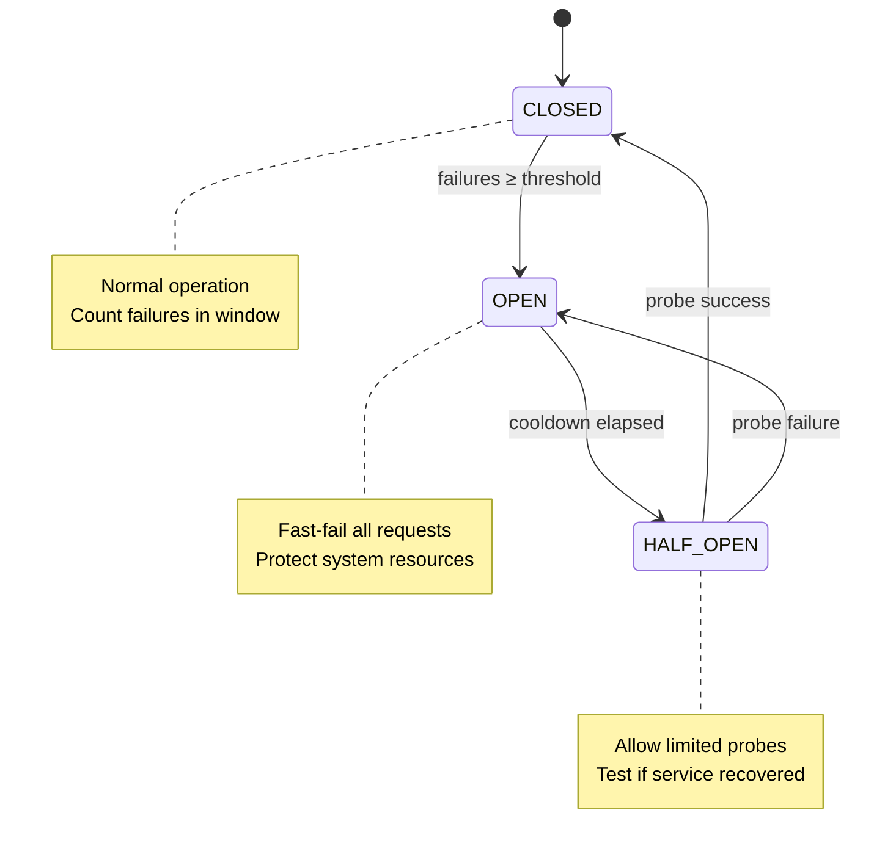

---

doc_type: module
prd_id: "YA-09-105"
title: "YA-09-105: 熔断器 — 外部服务故障隔离与自动恢复"
status: 已完成
priority: P0
owner: Claude
roles: [product, engineer]
created: 2026-09-23
updated: 2026-09-23
project: YiAi
project_id: yiai
prd_month: "202609"
related_tasks: ["105-prd-task-熔断器.md"]
related_tests: ["105-prd-test-熔断器.md"]

type: 需求
---

# YA-09-105: 熔断器

> **PRD 版本**：v3.0 · **状态**：已完成

## 1. 背景

YiAi 依赖外部 AI 服务（Ollama/DeepSeek）。当外部服务故障时，持续重试会耗尽连接池和超时预算，拖垮整个服务。熔断器在连续失败达到阈值时快速失败，保护系统资源。

## 2. 用户问题

- **目标用户**：SRE/运维
- **问题陈述**：作为 SRE，我需要系统在外部服务故障时自动熔断，避免雪崩效应
- **证据**：强 — 代码已实现（`shared/circuit_breaker.py`）

## 3. 范围

**In scope**：时间窗口熔断器，open/half-open/closed 三态，集成到 LLMProviderRouter

**Out of scope**：分布式熔断（当前单实例足够）

| 优先级 | 故事 | 验收标准 |
|--------|------|---------|
| P0 | 连续失败自动熔断 | 达到阈值后快速失败 |
| P1 | 冷却期后半开探测 | 半数请求通过后恢复 |

### 三态转换图

### 配置参数

| 参数 | 默认值 | 说明 |
|------|--------|------|
| `window_seconds` | 60 | 滑动窗口大小 |
| `failure_threshold` | 5 | 触发 OPEN 的连续失败数 |
| `cooldown_seconds` | 30 | OPEN → HALF_OPEN 等待时间 |
| `half_open_max` | 1 | HALF_OPEN 状态放行请求数 |

### 集成点

| 集成位置 | 方法 | 行为 |
|---------|------|------|
| `LLMProviderRouter.chat_with_fallback` | chat | 熔断时抛 `CircuitBreakerOpenError` |
| `LLMProviderRouter.embed_with_fallback` | embed | 同上 |
| `/debug/performance` | GET | 返回熔断器状态 + inflight 计数 |

## 4. 成功指标

| 指标 | 目标 |
|------|------|
| 故障检测延迟 | <60s（1 个窗口） |
| 误熔断率 | <1%（短暂波动不触发） |
| 恢复探测延迟 | 30s（1 个冷却期） |

## 5. 风险

| 风险 | 缓解 |
|------|------|
| 阈值过低频繁熔断 | failure_threshold=5，允许短暂波动 |
| 阈值过高保护不足 | 结合连接池超时（30s），双重保护 |
| 半开状态并发探测过多 | half_open_max=1，严格控制 |