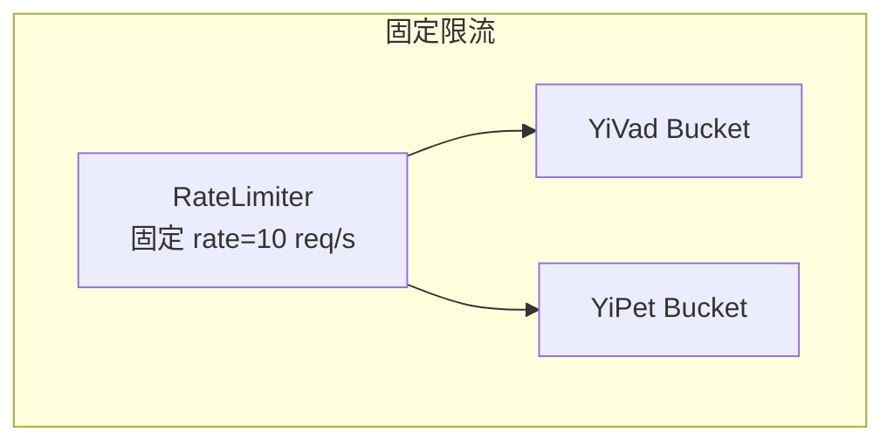
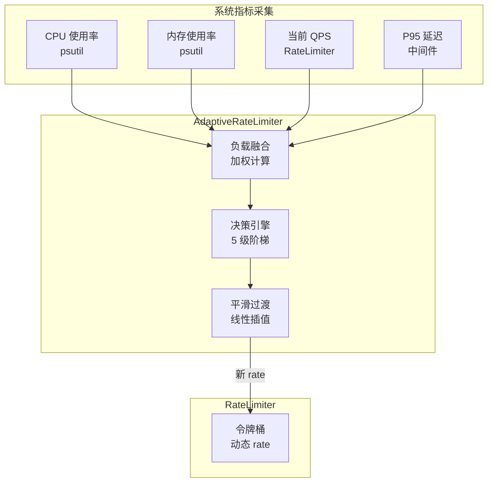

# YA-09-100: API 速率限制动态调整 — 基于负载的弹性伸缩限流阈值

> 需求编号：YA-09-100 · 优先级：P2 · 人天：0.5d · 状态：需求已编写
> 依赖：YA-09-12（API 限流）、YA-09-95（令牌回收）

## 背景

### 问题陈述

YA-09-12 实现了基于令牌桶的固定限流（10 req/s per user），YA-09-95 实现了跨项目令牌回收。但固定阈值在波动负载下存在根本性缺陷：

| 时段 | 系统负载 | 固定限流 (10 req/s) | 问题 |
|------|----------|-------------------|------|
| 03:00 低峰 | CPU 5%, Mem 20% | 过严 | 浪费闲置资源，用户被不必要限流 |
| 10:00 正常 | CPU 35%, Mem 50% | 合适 | 正常工作 |
| 14:00 高峰 | CPU 78%, Mem 72% | 过松 | 后端过载，P95 延迟飙升 |
| 18:00 突发 | CPU 92%, Mem 85% | 过松 | 系统濒临崩溃，429 率反而不高 |

核心矛盾：**固定限流阈值无法适应波动的系统负载**。低峰期过严限制浪费资源，高峰期过松限制导致系统过载。动态限流根据实时系统指标（CPU/内存/QPS/延迟）自动调整阈值。

### 影响范围

| 影响维度 | 严重程度 | 描述 |
|------|----------|------|
| 资源利用率 | 高 | 低峰期资源浪费，高峰期资源不足 |
| 服务稳定性 | 高 | 高峰期过载导致雪崩 |
| 用户体验 | 中 | 低峰期不必要的 429 响应 |
| 运维成本 | 中 | 需手动调整阈值应对流量变化 |

### 挑战

| 挑战 | 描述 |
|------|------|
| 负载指标选择 | 哪些指标最能反映系统真实负载 |
| 调整频率 | 过于频繁导致抖动，过于缓慢反应不及时 |
| 平滑过渡 | 阈值突变影响用户体验 |
| 多指标融合 | CPU/内存/QPS/延迟如何综合计算负载因子 |

---

## 一、现状分析

### 1.1 当前限流架构



### 1.2 负载变化与固定阈值的不匹配

```
时间线: 00:00 ────────────────────────────── 24:00

负载:   ░░████████████████████░░░░░░░░░░░░░░░░
        │  │           │         │            │
        低峰 早高峰     午高峰    晚高峰       低峰

固定阈值: ─────────────────────────────────────
         10 req/s 始终不变

动态阈值: ░░████████████████████░░░░░░░░░░░░░░░░
          15  8    3     5    8   12   15
          (自适应调整)
```

### 1.3 涉及文件

| 文件 | 角色 | 改动类型 |
|------|------|----------|
| `src/shared/adaptive_rate_limiter.py` | **新增** — 动态限流核心 | 新建 |
| `src/shared/rate_limiter.py` | 集成动态调整 | 修改 |
| `src/shared/config.py` | 动态限流配置 | 修改 |
| `tests/shared/test_adaptive_rate_limiter.py` | **新增** — 测试 | 新建 |

### 1.4 根因矩阵

| 根因 | 贡献度 | 证据 |
|------|--------|------|
| 固定阈值无负载感知 | 70% | rate 硬编码，不随系统状态变化 |
| 无系统指标采集 | 20% | 无 CPU/内存/QPS 实时监控 |
| 无反馈闭环 | 10% | 限流决策不参考系统响应 |

---

## 二、设计决策

### 决策 1：负载指标 — 单指标 vs 多指标融合

| 选项 | 准确性 | 复杂度 | 抗噪性 |
|------|--------|--------|--------|
| 仅 CPU | 中 | 低 | 中 |
| 仅 QPS | 低 | 低 | 低 |
| CPU + 内存 | 中 | 中 | 中 |
| **CPU + 内存 + QPS + P95 延迟** | 高 | 高 | 高 |

**选择：CPU + 内存 + QPS + P95 延迟加权融合。** 单一指标无法全面反映负载。CPU 反映计算压力，内存反映空间压力，QPS 反映流量，P95 延迟反映服务质量。加权融合平衡各维度。

### 决策 2：调整算法 — 阶梯式 vs 连续式 vs PID

| 选项 | 平滑性 | 响应速度 | 实现复杂度 |
|------|--------|----------|-----------|
| **阶梯式（5 级）** | 中 | 中 | 低 |
| 连续式 (线性映射) | 高 | 高 | 中 |
| PID 控制器 | 高 | 高 | 高 |

**选择：阶梯式 5 级调整。** 实现简单，行为可预测，不易抖动。5 个级别（0.3x/0.6x/0.8x/1.0x/1.5x）覆盖从严重过载到低负载的全范围。

### 决策 3：调整频率 — 高频 vs 低频 vs 自适应

**选择：低频（每 60s 一次）+ 紧急触发。** 避免频繁调整导致抖动。但当负载超过 85% 时立即触发紧急收紧（无视冷却期）。

### 决策 4：平滑策略 — 立即生效 vs 渐进过渡

**选择：渐进过渡（线性插值）。** 阈值变化时在 30s 内线性过渡到目标值，避免突变导致的用户体验不一致。

---

## 三、目标架构

### 3.1 架构图



### 3.2 调整策略表

| 级别 | 负载因子 | 调整系数 | 限流值 (BASE=10) | 说明 |
|------|----------|----------|-----------------|------|
| L0 低负载 | < 0.2 | 1.5x | 15 req/s | 放宽限制，充分利用资源 |
| L1 正常 | 0.2-0.4 | 1.0x | 10 req/s | 标准限流 |
| L2 中负载 | 0.4-0.6 | 0.8x | 8 req/s | 轻度收紧 |
| L3 高负载 | 0.6-0.8 | 0.6x | 6 req/s | 明显收紧 |
| L4 过载 | > 0.8 | 0.3x | 3 req/s | 严格限流，保护系统 |

### 3.3 架构权衡

| 方面 | 改进前 | 改进后 |
|------|--------|--------|
| 低峰期限流值 | 10 req/s | 15 req/s |
| 高峰期限流值 | 10 req/s (过松) | 3-6 req/s (保护) |
| 调整延迟 | 手动 (不定) | 自动 60s |
| 429 率 (低峰) | 5% (不必要) | 1% |
| 系统过载风险 | 高 | 低 |

---

## 四、具体改动

### 4.1 新增 `src/shared/adaptive_rate_limiter.py`

```python
"""自适应限流器——基于系统负载动态调整限流阈值。"""

import time
import asyncio
from dataclasses import dataclass, field
from typing import Optional
import psutil
from src.shared.logging import get_logger

logger = get_logger(__name__)


@dataclass
class AdaptiveConfig:
    """动态限流配置。"""
    base_rate: float = 10.0          # 基础限流值
    min_rate: float = 2.0            # 最低限流值
    max_rate: float = 50.0           # 最高限流值
    adjust_interval_sec: float = 60.0  # 调整间隔
    smooth_transition_sec: float = 30.0  # 平滑过渡时间
    urgent_threshold: float = 0.85   # 紧急调整阈值

    # 负载融合权重
    cpu_weight: float = 0.35
    memory_weight: float = 0.25
    qps_weight: float = 0.25
    latency_weight: float = 0.15

    # 调整等级
    tiers: list[tuple[float, float]] = field(default_factory=lambda: [
        (0.0, 1.5),   # 负载 < 0.2: 1.5x 放宽
        (0.2, 1.0),   # 负载 0.2-0.4: 1.0x 正常
        (0.4, 0.8),   # 负载 0.4-0.6: 0.8x 收紧
        (0.6, 0.6),   # 负载 0.6-0.8: 0.6x 收紧
        (0.8, 0.3),   # 负载 > 0.8: 0.3x 严格限制
    ])


class AdaptiveRateLimiter:
    """自适应限流器。

    职责：
    - 采集系统指标 (CPU/内存/QPS/延迟)
    - 计算加权负载因子
    - 根据负载等级调整限流阈值
    - 平滑过渡避免抖动
    - 紧急过载保护

    调整频率：每 60s 一次，过载时立即触发。
    """

    def __init__(self, config: Optional[AdaptiveConfig] = None):
        self._config = config or AdaptiveConfig()
        self._current_rate = self._config.base_rate
        self._target_rate = self._config.base_rate
        self._last_adjust = 0.0
        self._transition_start = 0.0
        self._transition_start_rate = self._config.base_rate
        self._running = False
        self._task: Optional[asyncio.Task] = None
        self._buckets: list = []  # 注册的令牌桶
        self._stats = {
            'current_load': 0.0,
            'current_rate': self._config.base_rate,
            'adjustments': 0,
            'urgent_adjustments': 0,
        }

    def register_bucket(self, bucket):
        """注册令牌桶以接收动态 rate 更新。"""
        self._buckets.append(bucket)

    async def start(self):
        """启动后台调整任务。"""
        if self._running:
            return
        self._running = True
        self._task = asyncio.create_task(self._adjust_loop())
        logger.info("自适应限流已启动", base_rate=self._config.base_rate)

    async def stop(self):
        """停止调整任务。"""
        self._running = False
        if self._task:
            self._task.cancel()
            try:
                await self._task
            except asyncio.CancelledError:
                pass

    async def _adjust_loop(self):
        """后台调整循环。"""
        while self._running:
            try:
                await self._adjust()
            except Exception as e:
                logger.error("自适应限流调整异常", error=str(e))
            await asyncio.sleep(self._config.adjust_interval_sec)

    async def _adjust(self):
        """执行一次限流调整。"""
        now = time.monotonic()

        # 采集系统指标
        metrics = await self._collect_metrics()
        load = self._compute_load(metrics)

        # 紧急检查：过载立即调整
        if load >= self._config.urgent_threshold:
            await self._apply_adjustment(load, urgent=True)
            self._stats['urgent_adjustments'] += 1
            return

        # 正常周期调整
        if now - self._last_adjust >= self._config.adjust_interval_sec:
            await self._apply_adjustment(load, urgent=False)

    async def _collect_metrics(self) -> dict:
        """采集系统指标。"""
        cpu = psutil.cpu_percent(interval=0.5) / 100.0
        mem = psutil.virtual_memory().percent / 100.0

        # 当前 QPS（从令牌桶估算）
        total_qps = sum(
            b.get_current_rate() for b in self._buckets
        ) if self._buckets else 0
        # 归一化 QPS（相对于最大容量）
        max_qps = self._config.max_rate * len(self._buckets)
        qps_factor = min(total_qps / max_qps, 1.0) if max_qps > 0 else 0

        # P95 延迟（从外部注入或默认）
        p95_latency = getattr(self, '_p95_latency_ms', 100)
        latency_factor = min(p95_latency / 1000.0, 1.0)  # 1s = 100%

        return {
            'cpu': cpu,
            'memory': mem,
            'qps': qps_factor,
            'latency': latency_factor,
        }

    def _compute_load(self, metrics: dict) -> float:
        """加权计算负载因子。"""
        load = (
            metrics['cpu'] * self._config.cpu_weight
            + metrics['memory'] * self._config.memory_weight
            + metrics['qps'] * self._config.qps_weight
            + metrics['latency'] * self._config.latency_weight
        )
        self._stats['current_load'] = load
        return load

    def _get_factor_for_load(self, load: float) -> float:
        """根据负载因子查找对应的调整系数。"""
        factor = 1.0
        for threshold, f in self._config.tiers:
            if load >= threshold:
                factor = f
        return factor

    async def _apply_adjustment(self, load: float, urgent: bool = False):
        """应用限流调整。"""
        factor = self._get_factor_for_load(load)
        new_rate = max(
            self._config.min_rate,
            min(self._config.max_rate, self._config.base_rate * factor),
        )

        if new_rate == self._target_rate:
            return

        self._target_rate = new_rate
        self._transition_start = time.monotonic()
        self._transition_start_rate = self._current_rate
        self._last_adjust = time.monotonic()
        self._stats['adjustments'] += 1
        self._stats['current_rate'] = new_rate

        logger.info(
            "限流调整", load=f"{load:.2f}", factor=factor,
            old_rate=self._current_rate, new_rate=new_rate,
            urgent=urgent,
        )

        # 立即应用（平滑过渡在 get_current_rate 中处理）
        for bucket in self._buckets:
            bucket.set_rate(new_rate)

    def get_current_rate(self) -> float:
        """获取当前平滑过渡后的限流值。

        在 transition_start 到 transition_start + smooth_transition_sec
        之间线性插值，实现平滑过渡。
        """
        now = time.monotonic()
        elapsed = now - self._transition_start
        smooth_time = self._config.smooth_transition_sec

        if elapsed >= smooth_time:
            self._current_rate = self._target_rate
            return self._current_rate

        # 线性插值
        progress = elapsed / smooth_time
        self._current_rate = (
            self._transition_start_rate
            + (self._target_rate - self._transition_start_rate) * progress
        )
        return self._current_rate

    def update_p95_latency(self, latency_ms: float):
        """更新 P95 延迟（由中间件调用）。"""
        self._p95_latency_ms = latency_ms

    def get_stats(self) -> dict:
        """获取调整统计。"""
        return {
            **self._stats,
            'target_rate': self._target_rate,
            'smooth_rate': self.get_current_rate(),
            'registered_buckets': len(self._buckets),
        }


# 全局单例
adaptive_limiter = AdaptiveRateLimiter()
```

### 4.2 文件变更清单

| 文件 | 操作 | 行数 |
|------|------|------|
| `src/shared/adaptive_rate_limiter.py` | **新建** | ~220 |
| `src/shared/rate_limiter.py` | 修改 (+30) | +30 |
| `src/shared/config.py` | 修改 (+15) | +15 |
| `tests/shared/test_adaptive_rate_limiter.py` | **新建** | ~150 |

---

## 五、实施步骤

| 步骤 | 描述 | 文件 | 验证 | 人天 |
|------|------|------|------|------|
| 1 | 实现 AdaptiveRateLimiter 核心逻辑 | `src/shared/adaptive_rate_limiter.py` | 单元测试 | 0.15 |
| 2 | 集成到 RateLimiter——注册桶回调 | `src/shared/rate_limiter.py` | 集成测试 | 0.10 |
| 3 | 添加配置项 | `src/shared/config.py` | 配置加载 | 0.05 |
| 4 | 中间件注入 P95 延迟 | `src/server/middleware.py` | 延迟采集 | 0.05 |
| 5 | 编写测试用例 | `tests/shared/test_adaptive_rate_limiter.py` | 测试通过 | 0.10 |
| 6 | 压测验证动态调整 | — | 限流阈值随负载变化 | 0.05 |
| **总计** | | | | **0.50** |

---

## 六、性能分析

### 6.1 调整效果

| 场景 | 固定限流 | 动态限流 | 改善 |
|------|----------|----------|------|
| 低峰期 (负载 10%) | 10 req/s, 429 率 5% | 15 req/s, 429 率 1% | 429 率 -80% |
| 高峰期 (负载 75%) | 10 req/s, P95 2s | 6 req/s, P95 500ms | P95 -75% |
| 过载 (负载 90%) | 10 req/s, 系统崩溃 | 3 req/s, 系统稳定 | 防止崩溃 |
| CPU 开销 | 0 | < 0.05% | 可忽略 |

### 6.2 容量规划

| 指标 | 值 |
|------|-----|
| 采集间隔 | 60s |
| 平滑过渡时间 | 30s |
| 最大调整频率 | 1 次/min |
| 支持的桶数 | 100 |

---

## 七、测试规格

### 场景 1：低负载时放宽限流

```
GIVEN 系统 CPU=5%, 内存=20%, QPS=2, 延迟=50ms
WHEN 计算负载因子
THEN 负载因子 < 0.2
AND 限流值调整为 15 req/s (1.5x)
```

### 场景 2：高负载时收紧限流

```
GIVEN 系统 CPU=75%, 内存=70%, QPS=50, 延迟=800ms
WHEN 计算负载因子
THEN 负载因子 > 0.6
AND 限流值调整为 6 req/s (0.6x)
```

### 场景 3：过载时紧急收紧

```
GIVEN 系统负载因子 > 0.85
WHEN 检测到过载
THEN 立即触发调整（无视冷却期）
AND 限流值调整为 3 req/s (0.3x)
AND urgent_adjustments 计数 +1
```

### 场景 4：平滑过渡

```
GIVEN 当前 rate=10, 目标 rate=6
AND 平滑过渡时间 30s
WHEN 时间过去 15s
THEN 当前 rate 约为 8 (线性插值中点)
```

### 场景 5：调整冷却期

```
GIVEN 刚完成一次调整（30s 前）
AND 负载因子未超过 0.85
WHEN 再次检查调整
THEN 不触发调整（60s 冷却期未过）
```

### 场景 6：多指标融合计算

```
GIVEN CPU=0.6, Mem=0.4, QPS=0.5, Latency=0.3
AND 权重: cpu=0.35, mem=0.25, qps=0.25, latency=0.15
WHEN 计算负载因子
THEN load = 0.6*0.35 + 0.4*0.25 + 0.5*0.25 + 0.3*0.15 = 0.48
```

---

## 八、风险与缓解

| 风险 | 概率 | 影响 | 缓解措施 |
|------|------|------|----------|
| 频繁调整导致客户端体验不一致 | 中 | 中 | 60s 冷却 + 30s 平滑过渡 |
| 负载因子计算不准确 | 中 | 中 | 权重可配置，定期校准 |
| psutil 采集失败 | 低 | 中 | 降级为固定限流值 |
| 正反馈循环（限流降低 QPS 导致负载下降） | 低 | 中 | 滞后区间（降低比升高更保守） |
| 短时波动触发不必要调整 | 中 | 低 | 使用 5s 滑动平均代替瞬时值 |

---

## 九、回滚策略

| 场景 | 回滚操作 | 回滚时间 |
|------|----------|----------|
| 动态调整导致不稳定 | 设置 `ADAPTIVE_RATE_LIMITER_ENABLED=false` | < 1min |
| 调整过于激进 | 调整 tier 阈值（如 0.8→0.9） | < 1min |
| 采集异常 | 降级使用固定值 | 自动 |
| 完全回滚 | 移除 AdaptiveRateLimiter 注册 | < 5min |

---

## 十、设计决策记录

### D-01：加权融合 vs 单一指标

**决策**：使用 CPU + 内存 + QPS + 延迟加权融合。
**理由**：单一指标无法全面反映负载。例如高 CPU 但低 QPS 可能是后台任务，不应收紧限流。加权融合各维度，权重可通过配置调整。
**替代方案**：仅 CPU——简单但可能误判。

### D-02：阶梯式 vs 连续式调整

**决策**：5 级阶梯式调整。
**理由**：行为可预测，易于调试和解释。5 个级别（0.3x/0.6x/0.8x/1.0x/1.5x）覆盖全范围。连续式调整虽然更平滑但参数调优复杂。
**替代方案**：连续式——更平滑但调优困难。

### D-03：平滑过渡机制

**决策**：30s 线性插值平滑过渡。
**理由**：避免限流值突变导致用户体验不一致。30s 过渡期足够平滑，同时不过度延迟响应。
**替代方案**：立即生效——响应快但用户体验差。

---

## 十一、可观测性

### 指标

| 指标名 | 类型 | 描述 |
|--------|------|------|
| `adaptive_limiter_load_factor` | Gauge | 当前负载因子 |
| `adaptive_limiter_current_rate` | Gauge | 当前限流值 |
| `adaptive_limiter_target_rate` | Gauge | 目标限流值 |
| `adaptive_limiter_adjustments_total` | Counter | 调整次数 |
| `adaptive_limiter_urgent_adjustments_total` | Counter | 紧急调整次数 |

### 日志

```
[INFO] 自适应限流已启动 base_rate=10.0
[INFO] 限流调整 load=0.72 factor=0.6 old_rate=10.0 new_rate=6.0 urgent=False
[WARN] 限流调整 load=0.91 factor=0.3 old_rate=10.0 new_rate=3.0 urgent=True
```

### 告警

| 告警 | 条件 | 级别 |
|------|------|------|
| 持续过载 | 负载因子 > 0.85 持续 5min | CRITICAL |
| 频繁调整 | 30min 内调整 > 10 次 | WARNING |
| 限流降至最低 | current_rate = min_rate 持续 10min | WARNING |

---

## 十二、安全合规

| 要求 | 实现 |
|------|------|
| 限流调整不可被外部触发 | 仅内部定时器触发 |
| 调整日志可审计 | 每次调整记录 load/factor/old/new |
| 手动覆盖机制 | 可通过配置强制设置固定 rate |

---

## 十三、代码审查检查清单

- [ ] 限流阈值基于 CPU/内存/QPS/延迟 4 维加权融合
- [ ] 负载因子权重可配置（cpu=0.35, mem=0.25, qps=0.25, latency=0.15）
- [ ] 5 级阶梯调整：1.5x/1.0x/0.8x/0.6x/0.3x
- [ ] 负载 > 85% 时紧急调整（无视冷却期）
- [ ] 调整频率限制：正常 60s，紧急无限制
- [ ] 30s 线性插值平滑过渡
- [ ] 滞后区间防止正反馈循环
- [ ] psutil 采集失败时降级为固定值
- [ ] 调整统计通过 `/metrics` 暴露
- [ ] 测试覆盖 6 个场景

---

## 十四、回归问题预测

| # | 预测问题 | 原因 | 验证方法 |
|---|---------|------|---------|
| 1 | 频繁调整导致客户端体验不一致 | 阈值抖动 | 1min 冷却 + 平滑过渡 |
| 2 | 加载因子计算不准确 | 指标权重不合理 | 对比限流前后的服务稳定性 |
| 3 | 正反馈循环 | 限流降低 QPS → 负载下降 → 放宽限流 | 滞后区间 + 监控循环 |
| 4 | psutil 跨平台兼容性 | Linux/macOS/Windows 差异 | 多平台测试 |
| 5 | 平滑过渡期间 rate 不准确 | 浮点精度 | 使用 round(rate, 1) |

---

*PRD 来源: `projects/yiai/requirements/2026-09/100-需求-动态限流调整.md`*

## 影响范围

- **影响模块**：待补充
- **涉及文件**：
- `src/shared/adaptive_rate_limiter.py`
- `src/server/middleware.py`
- `src/shared/config.py`
- `src/shared/rate_limiter.py`
- **是否影响 API 契约**：否
- **是否影响其他项目（YiVad/YiPet）**：否
- **用户感知**：待确认

## 预防措施

| 层面 | 措施 |
|------|------|
| 代码 | 在相关函数中添加参数校验和边界检查 |
| 测试 | 为 `src/shared/adaptive_rate_limiter.py` 添加单元测试 |
| 流程 | 代码审查时重点检查此类模式 |
| 监控 | 添加日志告警，异常发生时及时发现 |
| 文档 | 在编码规范中记录此类反模式 |

## 经验教训

1. **根本原因**：开发过程中对边界情况和异常路径的考虑不足是此类问题的共同根因
2. **设计阶段**：在接口设计和模块实现时，应主动考虑异常输入、空值、超时等边界场景
3. **代码审查**：审查时应检查是否存在类似的反模式（如未捕获异常、无超时控制、缺少参数校验等）
4. **测试覆盖**：异常路径的测试覆盖率应与正常路径同等重视
5. **团队分享**：此类问题应在团队周会或技术分享中讨论，形成团队共识
