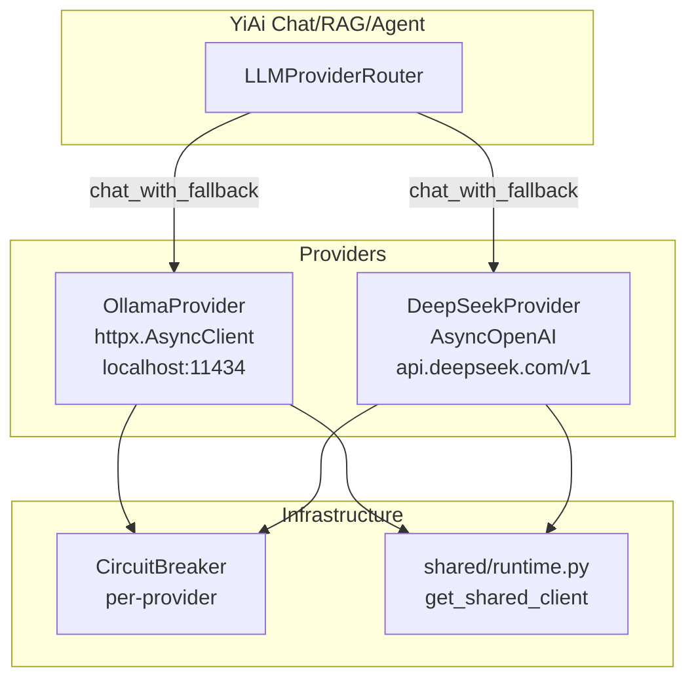
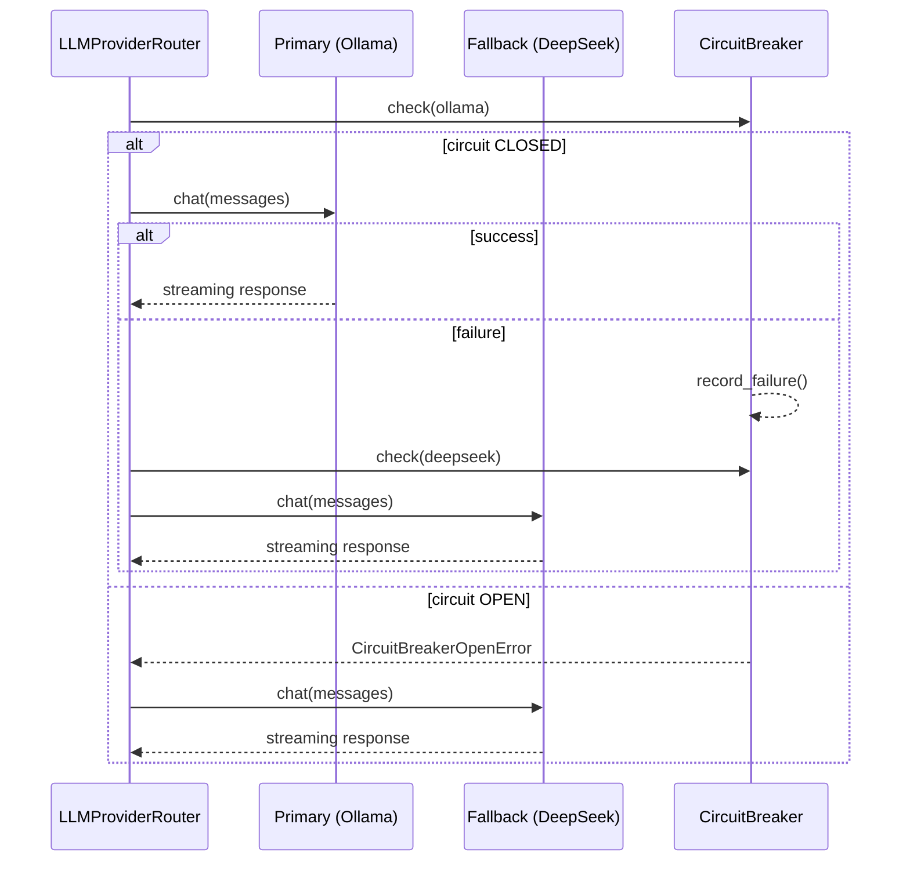

---

doc_type: module
prd_id: "YA-09-106"
title: "YA-09-106: LLM Provider 抽象 — Ollama/DeepSeek 统一路由与 fallback"
status: 已完成
priority: P0
owner: Claude
roles: [product, engineer]
created: 2026-09-23
updated: 2026-09-23
project: YiAi
project_id: yiai
prd_month: "202609"
related_tasks: ["106-prd-task-LLMProvider.md"]
related_tests: ["106-prd-test-LLMProvider.md"]

type: 需求
---

# YA-09-106: LLM Provider 抽象

> **PRD 版本**：v3.0 · **状态**：已完成

## 1. 背景

YiAi 需支持多个 LLM 供应商（Ollama 本地、DeepSeek 云端）。需统一抽象层：chat/embed 接口统一、自动 fallback、连接池复用。

## 2. 用户问题

- **目标用户**：开发者
- **问题陈述**：作为开发者，我需要在 Ollama 不可用时自动 fallback 到 DeepSeek
- **证据**：强 — 代码已实现（`services/ai/llm_provider.py`）

## 3. 范围

**In scope**：LLMProvider 基类、OllamaProvider、DeepSeekProvider、LLMProviderRouter（chat_with_fallback/embed_with_fallback）、共享 httpx 连接池

**Out of scope**：更多供应商（后续 PRD）

| 优先级 | 故事 | 验收标准 |
|--------|------|---------|
| P0 | 多供应商 chat | Ollama/DeepSeek 统一接口 |
| P0 | 自动 fallback | 主供应商失败 → 备用 |
| P1 | 连接池复用 | 共享 AsyncClient |

### Provider 路由架构

### Fallback 序列

### 连接池配置

| 参数 | 值 | 说明 |
|------|-----|------|
| `httpx.AsyncClient` | 全局单例 | `get_shared_client()` |
| keep-alive | 启用 | HTTP/1.1 Connection: keep-alive |
| 超时 | 30s | connect + read |
| 最大连接数 | 20 | 每个 provider |

## 4. 成功指标

| 指标 | 目标 |
|------|------|
| Fallback 切换延迟 | <100ms |
| 连接池复用 TCP 握手减少 | 90%+ |
| 首次请求冷启动 | <500ms |