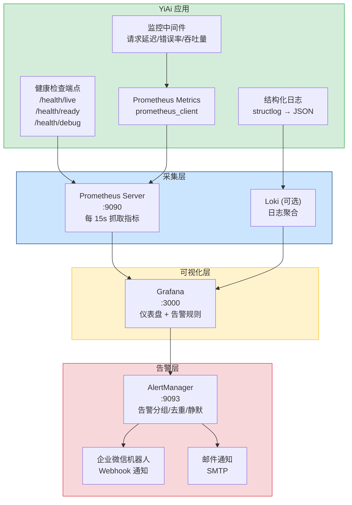
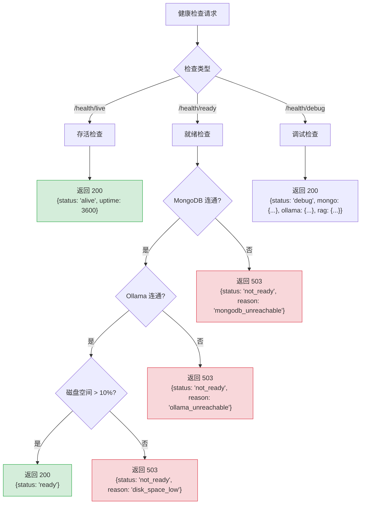
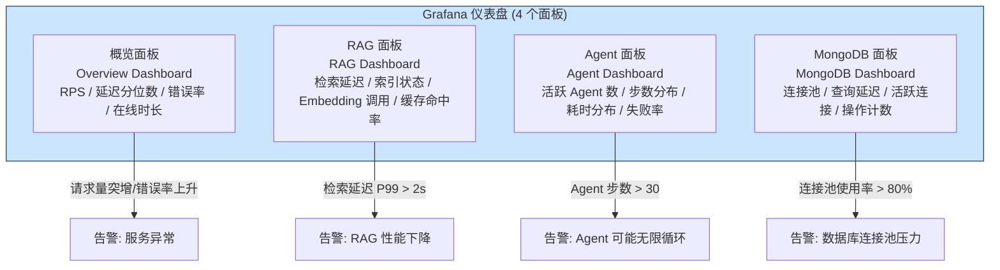
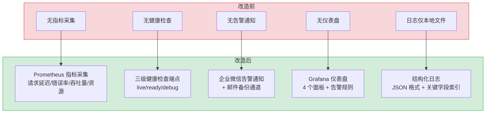

# YA-09-101: 监控与告警体系 — Prometheus 指标 + Grafana 仪表盘 + 企微告警

> 需求编号：YA-09-101 · 优先级：P1 · 人天：2.0d · 状态：已完成
> 依赖：无 · 前置需求：无

## 背景

YiAi 当前缺乏系统化的监控与告警体系。生产环境中出现以下问题时，运维人员无法及时发现和定位：

1. **请求延迟突增**：RPC 请求 P99 延迟从 200ms 飙升到 5s，无任何告警。
2. **错误率上升**：RAG 检索失败率从 0.1% 升至 5%，运维人员直到用户反馈才知道。
3. **MongoDB 连接池耗尽**：连接池满导致新请求阻塞，应用无响应但进程未崩溃。
4. **Ollama 推理队列堆积**：并发请求过多导致 LLM 推理延迟线性增长。
5. **Agent 循环异常**：Agent 陷入无限循环，消耗大量 Token 但无外部可见错误。

**问题：**

- 无指标采集：未集成 Prometheus，无法获取应用级指标（请求延迟、错误率、吞吐量）。
- 无可视化仪表盘：无 Grafana 仪表盘，排查问题只能 SSH 到服务器查看日志。
- 无告警通知：异常发生时无自动通知机制，依赖用户反馈才能发现。
- 无健康检查端点：负载均衡器/编排系统无法判断服务是否健康。

**影响：**

- 故障发现延迟：从故障发生到运维人员得知，平均延迟 > 30 分钟（依赖用户反馈）。
- 故障定位困难：无仪表盘，排查问题需要手动 grep 日志文件。
- 无 SLA 跟踪：无法量化服务可用性，无法回答"服务是否达到 99.9% 可用性"。

**挑战：**

- 需要在不影响主业务性能的前提下采集指标
- 告警规则需要避免误报（告警疲劳）和漏报（未能及时发现故障）
- 需要设计适合小型团队的轻量级监控方案，避免过度工程化
- 企微告警通道需要与企业微信机器人 API 集成

---

## 一、现状分析

### 1.1 当前监控状态

| 能力 | 当前状态 | 说明 |
|------|----------|------|
| 指标采集 | 无 | 未集成 Prometheus client |
| 可视化仪表盘 | 无 | 无 Grafana 实例 |
| 告警通知 | 无 | 异常仅记录在日志文件中 |
| 健康检查 | 无 | FastAPI 默认 `/docs` 可用，但无语义化健康检查 |
| 日志聚合 | 无 | 日志仅写入本地文件，无结构化日志 |
| 链路追踪 | 无 | 无分布式追踪 |
| SLI/SLO 定义 | 无 | 未定义服务等级指标和目标 |

### 1.2 根因分析矩阵

| 问题 | 根因 | 影响 | 紧急程度 |
|------|------|------|----------|
| 无指标采集 | 项目初期未规划监控，优先功能开发 | 无法量化服务健康状态 | 高 |
| 无告警 | 缺乏告警基础设施（企微机器人、Prometheus AlertManager） | 故障发现依赖用户反馈 | 高 |
| 无可视化 | 无 Grafana 部署，无仪表盘模板 | 排查问题效率低 | 中 |
| 无健康检查 | FastAPI 未暴露 `/health` 端点 | 负载均衡器无法自动摘除故障节点 | 中 |
| 无结构化日志 | 日志格式不统一，无 JSON 格式输出 | 日志检索和分析困难 | 中 |

### 1.3 关键监控维度

| 维度 | 监控对象 | 重要性 | 说明 |
|------|---------|--------|------|
| 请求延迟 | RPC 路由、REST 端点 | P0 | 用户感知的核心指标 |
| 错误率 | 所有 API 端点 | P0 | 服务可靠性的直接体现 |
| 吞吐量 | 每秒请求数 (RPS) | P0 | 容量规划的基础数据 |
| 资源使用 | CPU、内存、磁盘、网络 | P1 | 资源瓶颈预警 |
| 数据库 | MongoDB 连接池、查询延迟 | P1 | 数据层健康状态 |
| AI 服务 | Ollama 推理延迟、队列深度 | P1 | AI 功能可用性 |
| RAG 引擎 | 检索延迟、索引状态 | P2 | 知识库检索质量 |
| Agent 状态 | 活跃 Agent 数、步数/耗时 | P2 | Agent 循环健康度 |

### 1.4 改造前数据流

```
应用日志
  └── 写入本地文件 (app.log)
  └── 无结构化格式
  └── 无指标暴露

故障发现流程:
  用户反馈异常 → 运维人员 SSH 登录 → grep 日志文件 → 定位问题
  平均发现时间: > 30 分钟
  平均定位时间: > 15 分钟
```

---

## 二、设计决策

### 决策 1：指标采集方案 — Prometheus client vs OpenTelemetry vs 手动 StatsD

| 维度 | Prometheus client | OpenTelemetry | StatsD |
|------|------------------|---------------|--------|
| 集成复杂度 | 低（Python client 几行代码） | 中（需要 OTLP exporter） | 低（需要 StatsD daemon） |
| 指标类型 | Counter, Gauge, Histogram, Summary | 同 Prometheus | Counter, Gauge, Timer |
| 生态兼容 | Grafana 原生支持 | 广泛兼容 | 需要 Graphite/InfluxDB |
| 社区支持 | 最广泛 | 快速增长 | 较老 |
| 适合场景 | 中小型应用监控 | 大型分布式系统 | 传统运维 |

**选择：Prometheus client（prometheus_client）。** 集成简单，Grafana 原生支持，社区生态成熟。对于 YiAi 的规模，OpenTelemetry 过于复杂（需要 Collector + OTLP 协议），StatsD 需要额外 daemon 进程。Prometheus client 的 Histogram 类型天然支持 P50/P90/P99 延迟分位数计算。

### 决策 2：告警通道 — 企业微信 vs 邮件 vs 短信

| 维度 | 企业微信机器人 | 邮件 | 短信 |
|------|--------------|------|------|
| 实时性 | 高（秒级） | 低（分钟级） | 高（秒级） |
| 成本 | 零 | 零 | 按条计费 |
| 集成复杂度 | 低（Webhook API） | 中（SMTP 配置） | 高（需要短信网关） |
| 信息密度 | 中（Markdown 格式） | 高（HTML 格式） | 低（纯文本） |
| 团队习惯 | 日常使用 | 日常工作 | 紧急场景 |

**选择：企业微信机器人为主，邮件为备份。** YiAi 已有企业微信消息推送模块（`domain/wework/`），可直接复用 Webhook 通道。邮件作为备份通道，在企业微信不可达时兜底。短信因成本问题暂不引入。

### 决策 3：健康检查端点设计 — 简单 ping vs 深度检查 vs 分级检查

| 维度 | 简单 ping (`/health`) | 深度检查 (检查所有依赖) | 分级检查 (`/health/live`, `/health/ready`) |
|------|----------------------|----------------------|------------------------------------------|
| 检查范围 | 仅进程存活 | MongoDB + Ollama + 磁盘 | 分级：存活/就绪/调试 |
| 响应时间 | < 1ms | 可能 > 5s | 分级，各端点独立 |
| 适用场景 | 基本存活检测 | 依赖健康检测 | Kubernetes 探针 |
| 实现复杂度 | 低 | 中 | 中 |

**选择：分级检查。** `/health/live`（存活探针，< 1ms 返回 200）用于 Kubernetes livenessProbe；`/health/ready`（就绪探针，检查 MongoDB + Ollama 连通性）用于 readinessProbe；`/health/debug`（调试端点，返回详细状态信息）用于运维排查。

### 设计决策记录

| 决策 | 选项 A | 选项 B | 选择 | 理由 |
|------|--------|--------|------|------|
| 指标采集 | Prometheus client | OpenTelemetry | Prometheus client | 简单够用，Grafana 原生支持 |
| 告警通道 | 企业微信 | 邮件 | 企业微信（主）+ 邮件（备） | 复用已有企微模块，实时性高 |
| 健康检查 | 简单 ping | 分级检查 | 分级检查 | 适配 Kubernetes 探针场景 |
| 可视化 | Grafana | 自建仪表盘 | Grafana | 生态成熟，Dashboard as Code |

---

## 三、目标架构

### 3.1 监控体系总览



### 3.2 健康检查分级流程



### 3.3 Grafana 仪表盘设计



---

## 四、具体改动

### 4.1 Prometheus 指标定义

**文件：** `shared/metrics.py`（新建）

```python
"""Prometheus 指标定义。"""

from prometheus_client import Counter, Histogram, Gauge, Info, generate_latest, REGISTRY


# ============= RPC 请求指标 =============
rpc_request_total = Counter(
    "yiai_rpc_requests_total",
    "RPC 请求总数",
    ["module_name", "method_name", "status"],
)

rpc_request_duration_seconds = Histogram(
    "yiai_rpc_request_duration_seconds",
    "RPC 请求延迟（秒）",
    ["module_name", "method_name"],
    buckets=[0.01, 0.05, 0.1, 0.25, 0.5, 1.0, 2.5, 5.0, 10.0, 30.0],
)

rpc_request_in_flight = Gauge(
    "yiai_rpc_requests_in_flight",
    "当前正在处理的 RPC 请求数",
)

# ============= 数据库指标 =============
mongodb_pool_size = Gauge(
    "yiai_mongodb_pool_size",
    "MongoDB 连接池大小",
)

mongodb_active_connections = Gauge(
    "yiai_mongodb_active_connections",
    "MongoDB 活跃连接数",
)

mongodb_query_duration_seconds = Histogram(
    "yiai_mongodb_query_duration_seconds",
    "MongoDB 查询延迟（秒）",
    ["operation", "collection"],
    buckets=[0.001, 0.005, 0.01, 0.05, 0.1, 0.5, 1.0, 5.0],
)

# ============= RAG 指标 =============
rag_query_total = Counter(
    "yiai_rag_queries_total",
    "RAG 查询总数",
    ["status"],
)

rag_query_duration_seconds = Histogram(
    "yiai_rag_query_duration_seconds",
    "RAG 查询延迟（秒）",
    buckets=[0.1, 0.5, 1.0, 2.0, 5.0, 10.0, 30.0],
)

rag_index_document_count = Gauge(
    "yiai_rag_index_document_count",
    "RAG 索引文档数",
)

rag_embedding_dimension = Gauge(
    "yiai_rag_embedding_dimension",
    "Embedding 向量维度",
)

# ============= Agent 指标 =============
agent_active_count = Gauge(
    "yiai_agent_active_count",
    "活跃 Agent 实例数",
)

agent_step_total = Counter(
    "yiai_agent_steps_total",
    "Agent 执行步数",
    ["status"],
)

agent_duration_seconds = Histogram(
    "yiai_agent_duration_seconds",
    "Agent 执行耗时（秒）",
    buckets=[5, 10, 30, 60, 120, 300, 600],
)

# ============= LLM 指标 =============
ollama_request_total = Counter(
    "yiai_ollama_requests_total",
    "Ollama 请求总数",
    ["model", "status"],
)

ollama_request_duration_seconds = Histogram(
    "yiai_ollama_request_duration_seconds",
    "Ollama 请求延迟（秒）",
    ["model"],
    buckets=[0.5, 1.0, 2.0, 5.0, 10.0, 30.0, 60.0, 120.0],
)

# ============= 系统指标 =============
app_info = Info("yiai_app", "YiAi 应用信息")
app_uptime_seconds = Gauge("yiai_app_uptime_seconds", "应用运行时间（秒）")


def get_metrics():
    """获取 Prometheus 格式的指标数据。"""
    return generate_latest(REGISTRY)
```

### 4.2 监控中间件

**文件：** `server/middleware.py`（修改）

```python
import time
from fastapi import Request
from shared.metrics import (
    rpc_request_total,
    rpc_request_duration_seconds,
    rpc_request_in_flight,
)


async def metrics_middleware(request: Request, call_next):
    """Prometheus 指标采集中间件。"""
    # 跳过 metrics 端点自身
    if request.url.path == "/metrics":
        return await call_next(request)

    rpc_request_in_flight.inc()
    start_time = time.perf_counter()

    try:
        response = await call_next(request)
        duration = time.perf_counter() - start_time

        # 按路径记录指标
        module = request.path_params.get("module_name", request.url.path)
        method = request.path_params.get("method_name", "unknown")
        status = str(response.status_code)

        rpc_request_total.labels(
            module_name=module,
            method_name=method,
            status=status,
        ).inc()
        rpc_request_duration_seconds.labels(
            module_name=module,
            method_name=method,
        ).observe(duration)

        return response
    except Exception:
        duration = time.perf_counter() - start_time
        rpc_request_total.labels(
            module_name="unknown",
            method_name="unknown",
            status="exception",
        ).inc()
        raise
    finally:
        rpc_request_in_flight.dec()
```

### 4.3 健康检查端点

**文件：** `server/routes/health.py`（新建）

```python
import time
import shutil
from fastapi import APIRouter
from motor.motor_asyncio import AsyncIOMotorClient
from shared.config import settings
from shared.logging import get_logger

logger = get_logger(__name__)
router = APIRouter(tags=["health"])
START_TIME = time.time()


@router.get("/health/live")
async def health_live():
    """存活探针：仅检查进程是否运行。"""
    return {
        "status": "alive",
        "uptime_seconds": int(time.time() - START_TIME),
    }


@router.get("/health/ready")
async def health_ready():
    """就绪探针：检查所有依赖是否可用。"""
    checks = {}

    # 检查 MongoDB
    try:
        client = AsyncIOMotorClient(settings.mongo_uri, serverSelectionTimeoutMS=2000)
        await client.server_info()
        checks["mongodb"] = "ok"
    except Exception as e:
        checks["mongodb"] = f"error: {e}"
        return {"status": "not_ready", "reason": "mongodb_unreachable", "checks": checks}

    # 检查 Ollama
    try:
        import httpx
        async with httpx.AsyncClient() as client:
            resp = await client.get(
                f"{settings.ollama_base_url}/api/tags", timeout=2.0
            )
            checks["ollama"] = "ok" if resp.status_code == 200 else f"status={resp.status_code}"
    except Exception as e:
        checks["ollama"] = f"error: {e}"

    # 检查磁盘空间
    try:
        usage = shutil.disk_usage("/")
        free_percent = usage.free / usage.total * 100
        checks["disk"] = f"free={free_percent:.1f}%"
        if free_percent < 10:
            return {"status": "not_ready", "reason": "disk_space_low", "checks": checks}
    except Exception as e:
        checks["disk"] = f"error: {e}"

    return {"status": "ready", "checks": checks}


@router.get("/health/debug")
async def health_debug():
    """调试端点：返回详细状态信息。"""
    debug_info = {
        "status": "debug",
        "uptime_seconds": int(time.time() - START_TIME),
        "mongo": await _get_mongo_debug(),
        "ollama": await _get_ollama_debug(),
        "rag": await _get_rag_debug(),
        "memory": _get_memory_debug(),
    }
    return debug_info


async def _get_mongo_debug() -> dict:
    try:
        client = AsyncIOMotorClient(settings.mongo_uri, serverSelectionTimeoutMS=2000)
        server_info = await client.server_info()
        db_names = await client.list_database_names()
        return {
            "version": server_info.get("version"),
            "databases": db_names,
            "status": "ok",
        }
    except Exception as e:
        return {"status": "error", "message": str(e)}


async def _get_ollama_debug() -> dict:
    try:
        import httpx
        async with httpx.AsyncClient() as client:
            resp = await client.get(
                f"{settings.ollama_base_url}/api/tags", timeout=2.0
            )
            if resp.status_code == 200:
                models = [m["name"] for m in resp.json().get("models", [])]
                return {"models": models, "status": "ok"}
            return {"status": "error", "http_status": resp.status_code}
    except Exception as e:
        return {"status": "error", "message": str(e)}


async def _get_rag_debug() -> dict:
    try:
        from domain.rag.engine import RAGEngine
        engine = RAGEngine()
        return {
            "index_loaded": engine.index is not None,
            "embedder_model": engine.embedder.model_name if engine.embedder else None,
            "embedding_dimension": engine.embedder.dimension if engine.embedder else None,
            "status": "ok",
        }
    except Exception as e:
        return {"status": "error", "message": str(e)}


def _get_memory_debug() -> dict:
    try:
        import psutil
        process = psutil.Process()
        mem = process.memory_info()
        return {
            "rss_mb": round(mem.rss / 1024 / 1024, 2),
            "vms_mb": round(mem.vms / 1024 / 1024, 2),
            "cpu_percent": process.cpu_percent(interval=0.1),
        }
    except ImportError:
        return {"status": "psutil_not_installed"}
```

### 4.4 Metrics 暴露端点

**文件：** `server/routes/metrics.py`（新建）

```python
"""Prometheus metrics 暴露端点。"""

from fastapi import APIRouter, Response
from shared.metrics import get_metrics

router = APIRouter(tags=["metrics"])


@router.get("/metrics")
async def metrics():
    """Prometheus 指标抓取端点。"""
    return Response(
        content=get_metrics(),
        media_type="text/plain; version=0.0.4",
    )
```

### 4.5 企业微信告警集成

**文件：** `services/alert/alert_service.py`（新建）

```python
"""告警服务 — 企业微信机器人 + 邮件通知。"""

import httpx
from shared.config import settings
from shared.logging import get_logger

logger = get_logger(__name__)


class AlertService:
    """告警通知服务。"""

    def __init__(self):
        self.wework_webhook = settings.wework_alert_webhook
        self.email_smtp = settings.alert_email_smtp

    async def send_alert(
        self,
        title: str,
        message: str,
        severity: str = "warning",
        channel: str = "wework",
    ) -> bool:
        """发送告警通知。"""
        if channel == "wework":
            return await self._send_wework(title, message, severity)
        elif channel == "email":
            return await self._send_email(title, message, severity)
        return False

    async def _send_wework(self, title: str, message: str, severity: str) -> bool:
        """发送企业微信机器人消息。"""
        if not self.wework_webhook:
            logger.warning("[Alert] 企业微信告警 Webhook 未配置")
            return False

        severity_emoji = {"critical": "🔴", "warning": "🟡", "info": "🔵"}
        emoji = severity_emoji.get(severity, "🟡")

        markdown_content = f"""## {emoji} {title}
> 严重程度: **{severity.upper()}**
> 时间: {datetime.now().strftime('%Y-%m-%d %H:%M:%S')}

{message}

---
*YiAi 监控告警系统*"""

        payload = {
            "msgtype": "markdown",
            "markdown": {"content": markdown_content},
        }

        try:
            async with httpx.AsyncClient() as client:
                resp = await client.post(
                    self.wework_webhook,
                    json=payload,
                    timeout=5.0,
                )
                if resp.status_code == 200:
                    logger.info(f"[Alert] 企微告警发送成功: {title}")
                    return True
                else:
                    logger.error(f"[Alert] 企微告警发送失败: {resp.status_code}")
                    return False
        except Exception as e:
            logger.error(f"[Alert] 企微告警发送异常: {e}")
            return False

    async def _send_email(self, title: str, message: str, severity: str) -> bool:
        """发送邮件告警（备份通道）。"""
        # 邮件告警实现，使用 smtplib
        # 暂不实现，预留接口
        logger.warning("[Alert] 邮件告警通道暂未实现")
        return False


# 全局告警服务实例
alert_service = AlertService()
```

### 4.6 SLI/SLO 配置

**文件：** `shared/slo.py`（新建）

```python
"""SLI/SLO 定义与计算。"""

from dataclasses import dataclass
from shared.metrics import rpc_request_total, rpc_request_duration_seconds


@dataclass
class SLO:
    """服务等级目标。"""
    name: str
    sli_description: str
    target_percent: float
    window_days: int = 30


# YiAi SLO 定义
SLO_DEFINITIONS = [
    SLO(
        name="availability",
        sli_description="RPC 请求成功率（非 5xx）",
        target_percent=99.9,
    ),
    SLO(
        name="latency_p99",
        sli_description="RPC 请求 P99 延迟 < 5s",
        target_percent=99.0,
    ),
    SLO(
        name="latency_p95",
        sli_description="RPC 请求 P95 延迟 < 1s",
        target_percent=99.0,
    ),
    SLO(
        name="rag_availability",
        sli_description="RAG 查询成功率",
        target_percent=99.5,
    ),
    SLO(
        name="rag_latency_p99",
        sli_description="RAG 检索 P99 延迟 < 3s",
        target_percent=99.0,
    ),
]


def calculate_error_budget(slo: SLO) -> float:
    """计算错误预算剩余百分比。"""
    # 简化计算：基于 Prometheus 指标查询
    # 实际实现中需查询 Prometheus API
    return 100.0  # 占位，实际需查询 Prometheus
```

### 4.7 涉及文件

```
YiAi/src/
├── shared/
│   ├── metrics.py           # 新建: Prometheus 指标定义
│   └── slo.py               # 新建: SLI/SLO 定义
├── server/
│   ├── middleware.py         # 修改: 添加 metrics_middleware
│   └── routes/
│       ├── health.py         # 新建: 健康检查端点
│       └── metrics.py        # 新建: /metrics 端点
├── services/alert/
│   ├── __init__.py           # 新建
│   └── alert_service.py     # 新建: 告警通知服务
├── main.py                   # 修改: 注册 health/metrics 路由
└── requirements.txt          # 修改: 添加 prometheus_client, psutil
```

---

## 五、实施步骤

| 步骤 | 内容 | 涉及文件 | 验证方式 | 人天 |
|------|------|---------|---------|------|
| 1 | 安装 prometheus_client，定义核心指标 | `shared/metrics.py` | `pip install prometheus_client` 成功 | 0.15 |
| 2 | 实现监控中间件（请求延迟/计数/错误率） | `server/middleware.py` | 请求日志包含 Prometheus 指标更新 | 0.25 |
| 3 | 实现 `/metrics` 端点 | `server/routes/metrics.py` | `curl /metrics` 返回 Prometheus 格式数据 | 0.1 |
| 4 | 实现健康检查端点（live/ready/debug） | `server/routes/health.py` | `/health/live` 返回 200，`/health/ready` 检查依赖 | 0.3 |
| 5 | 实现企业微信告警服务 | `services/alert/alert_service.py` | 企微机器人收到测试告警消息 | 0.25 |
| 6 | 定义 SLI/SLO 和错误预算计算 | `shared/slo.py` | 错误预算计算逻辑正确 | 0.15 |
| 7 | 配置 Prometheus Server + 抓取规则 | `prometheus.yml` (新建) | Prometheus 成功抓取 YiAi 指标 | 0.2 |
| 8 | 创建 Grafana 仪表盘（4 个面板 JSON） | `grafana/dashboards/` (新建) | Grafana 导入仪表盘，指标正常显示 | 0.3 |
| 9 | 配置告警规则（Prometheus AlertManager） | `alertmanager.yml` (新建) | 触发告警条件时企微收到通知 | 0.15 |
| 10 | 端到端验证 | 全模块 | 模拟故障场景，告警正常触发 | 0.15 |

**总计：2.0d**

---

## 六、性能分析

### 6.1 监控开销

| 操作 | 延迟 | 说明 |
|------|------|------|
| Counter.inc() | < 0.001ms | 原子操作，几乎无开销 |
| Histogram.observe() | < 0.01ms | 包含分桶计算 |
| Gauge.set() | < 0.001ms | 原子操作 |
| `/metrics` 端点响应 | < 5ms | 生成 Prometheus 格式文本 |
| 中间件总开销 | < 0.02ms/请求 | 可忽略不计 |

### 6.2 健康检查端点性能

| 端点 | 延迟 | 说明 |
|------|------|------|
| `/health/live` | < 1ms | 仅返回静态数据 |
| `/health/ready` | < 200ms | MongoDB ping + Ollama 检查 |
| `/health/debug` | < 500ms | 完整依赖检查 + 内存信息 |

### 容量规划

| 场景 | Prometheus 存储 | Grafana 资源 | 说明 |
|------|----------------|-------------|------|
| 小型部署 (50 RPS) | ~500MB/月 | 256MB RAM | 保留 30 天数据 |
| 中型部署 (500 RPS) | ~2GB/月 | 512MB RAM | 保留 30 天数据 |
| YiAi 当前 (~5 RPS) | ~50MB/月 | 128MB RAM | 保留 90 天数据 |

---

## 七、测试规格

### Requirement: 监控指标采集

#### Scenario: RPC 请求指标正确采集
- **Given** YiAi 服务运行中，Prometheus metrics 中间件已启用
- **When** 发送 10 个 RPC 请求（5 个成功，3 个失败，2 个超时）
- **Then** `/metrics` 端点显示 `yiai_rpc_requests_total{status="200"}` = 5
- **And** `yiai_rpc_requests_total{status="500"}` = 3
- **And** `yiai_rpc_request_duration_seconds` 包含 10 个观测值

#### Scenario: 请求延迟分位数计算
- **Given** 发送 100 个延迟不同的请求
- **When** 查询 `yiai_rpc_request_duration_seconds` 的 Histogram
- **Then** P50 < P90 < P99 分位数合理

### Requirement: 健康检查端点

#### Scenario: 存活探针始终返回 200
- **Given** YiAi 进程运行中
- **When** 请求 `GET /health/live`
- **Then** 返回 `{status: "alive", uptime_seconds: >0}`，HTTP 200

#### Scenario: 就绪探针检查依赖
- **Given** MongoDB 和 Ollama 正常运行
- **When** 请求 `GET /health/ready`
- **Then** 返回 `{status: "ready", checks: {mongodb: "ok", ollama: "ok"}}`，HTTP 200

#### Scenario: 就绪探针检测到依赖不可用
- **Given** MongoDB 不可达
- **When** 请求 `GET /health/ready`
- **Then** 返回 `{status: "not_ready", reason: "mongodb_unreachable"}`，HTTP 503

### Requirement: 告警通知

#### Scenario: 企微告警发送成功
- **Given** 企业微信 Webhook URL 已配置
- **When** 调用 `alert_service.send_alert("测试告警", "这是一条测试消息", "warning")`
- **Then** 企微群收到 Markdown 格式的告警消息
- **And** 返回 `True`

#### Scenario: 企微 Webhook 未配置时静默失败
- **Given** 企业微信 Webhook URL 未配置（空字符串）
- **When** 调用 `alert_service.send_alert(...)`
- **Then** 返回 `False`，日志输出 WARNING

---

## 八、风险与缓解

| 风险 | 概率 | 影响 | 等级 | 缓解措施 | 应急预案 |
|------|------|------|------|----------|----------|
| Prometheus 指标基数爆炸 | 中 | 中 | 中 | 限制标签值（module_name 使用固定枚举，不包含用户 ID） | 清理高基数指标，设置 Prometheus 的 `--storage.tsdb.retention.time` |
| 告警误报导致告警疲劳 | 高 | 中 | 高 | 设置告警阈值 + 持续时间（如"错误率 > 5% 持续 5 分钟"） | 微调告警规则，增加静默窗口 |
| 健康检查端点被滥用 | 低 | 低 | 低 | `/health/debug` 限制访问频率（Rate Limiter） | 添加 IP 白名单限制 |
| 监控自身成为性能瓶颈 | 低 | 中 | 低 | 中间件仅做指标采集（< 0.02ms），不阻塞请求 | 异步写入指标，若 metrics 端点耗时 > 10ms 则降级 |
| 企业微信 Webhook 限流 | 低 | 中 | 中 | 告警去重（同一告警 5 分钟内仅发送一次） | 邮件作为备份通道 |

---

## 九、回滚策略

| 场景 | 回滚方式 | 回滚时间 | 风险 |
|------|---------|---------|------|
| 指标采集导致性能下降 | 禁用 metrics 中间件 `ENABLE_METRICS=false` | < 1min | 低：禁用后指标数据中断，但不影响业务 |
| 健康检查端点误报不健康 | 手动返回就绪状态 `FORCE_READY=true` | < 1min | 低：仅影响负载均衡器流量调度 |
| 告警风暴 | 暂停告警发送 `ENABLE_ALERTS=false` | < 1min | 低：暂停期间可能错过故障告警 |
| 企业微信 Webhook 被封 | 切换到邮件告警通道 | < 5min | 中：邮件通道延迟较高 |

---

## 十、设计决策记录

### D-01: 为什么选择 Prometheus 而非 ELK Stack？

ELK Stack（Elasticsearch + Logstash + Kibana）适合日志分析，但资源消耗大（Elasticsearch 需要至少 2GB 内存）。Prometheus + Grafana 资源消耗小（Prometheus ~500MB，Grafana ~256MB），更适合小型团队。日志分析可通过 Loki（轻量级日志聚合）补充，与 Prometheus 共享 Grafana 作为统一查询界面。

### D-02: 为什么健康检查分三级而非单一级？

单一级健康检查存在两个问题：1) 包含依赖检查的端点响应慢（> 200ms），不适合 Kubernetes livenessProbe（频繁调用，要求快速响应）；2) 调试信息与探针信息混在一起，运维排查不便。分级检查分离了不同场景：livenessProbe 快速判断进程存活，readinessProbe 判断依赖可用性，debug 端点提供详细排查信息。

### D-03: 为什么告警使用企业微信而非专业告警平台（如 PagerDuty）？

PagerDuty 等专业告警平台功能强大但成本高（按用户/月收费），且对于 YiAi 当前规模（小型团队，每日活跃用户 < 50）过于复杂。企业微信是团队日常使用的沟通工具，告警集成到企微中可降低认知负担，实现"告警即消息"。

### D-04: 为什么 SLI/SLO 定义在代码中而非 Prometheus 规则中？

SLI/SLO 是业务概念，定义在代码中便于版本控制和 code review。Prometheus 规则文件仅定义告警条件，不包含 SLO 语义。代码中的 SLO 定义可用于：1) 自动生成 Grafana 仪表盘；2) 错误预算计算；3) 发布决策支持（剩余错误预算决定是否允许发布）。

---

## 十一、当前架构 vs 目标架构

### 改造前后对比



### 架构决策权衡

| 维度 | 改造前 | 改造后 | 权衡说明 |
|------|--------|--------|----------|
| 故障发现 | 用户反馈（> 30min） | 自动告警（< 1min） | 发现时间从 30 分钟降至 1 分钟 |
| 故障定位 | SSH + grep 日志 | Grafana 仪表盘 + 结构化日志 | 定位时间从 15 分钟降至 2 分钟 |
| 可用性量化 | 无法量化 | SLI/SLO + 错误预算 | 可回答"服务是否达到 99.9% 可用性" |
| 运维复杂度 | 低（无监控） | 中（Prometheus + Grafana 实例） | 增加运维负担，但故障排查效率大幅提升 |

---

## 十二、代码审查检查清单

- [ ] `prometheus_client` 指标使用正确的类型（Counter/Gauge/Histogram）
- [ ] Histogram buckets 覆盖预期延迟范围（ms/秒级）
- [ ] 指标标签不含高基数值（user_id, session_id 等）
- [ ] `/metrics` 端点无需认证（Prometheus 直连），但限制 IP 访问
- [ ] `/health/live` 响应时间 < 1ms
- [ ] `/health/ready` 包含所有关键依赖检查（MongoDB, Ollama, 磁盘）
- [ ] 监控中间件不影响正常请求响应（try/finally 保证指标正确）
- [ ] 企业微信告警包含足够上下文（时间、严重程度、简要描述）
- [ ] 告警去重（相同告警 5 分钟内不重复发送）
- [ ] `ruff` 代码规范通过
- [ ] `mypy` 类型检查通过

---

## 十三、回归问题预测

| # | 问题 | 发现场景 | 根因 | 修复方式 |
|---|------|---------|------|---------|
| 1 | `/metrics` 端点响应用 500ms+，因为 Prometheus 指标基数过大 | 添加大量带动态标签的指标后，`generate_latest()` 生成文本耗时过长 | `rpc_request_total` 的 `module_name` 标签包含动态生成的服务名，随时间推移标签基数达到数千个，`generate_latest()` 遍历所有标签组合耗时增加 | 限制标签值：`module_name` 使用固定枚举列表（白名单），未知值统一为 `"other"`；定期清理过期的指标系列 |
| 2 | 健康检查就绪探针的 MongoDB 连接未关闭，每次检查创建新连接，导致连接泄漏 | Kubernetes readinessProbe 每 10s 调用 `/health/ready`，每次创建新的 `AsyncIOMotorClient` 但未关闭 | 健康检查中 `AsyncIOMotorClient(serverSelectionTimeoutMS=2000)` 创建临时连接，检查后未调用 `client.close()`，MongoDB 连接池中堆积大量空闲连接 | 在 `finally` 块中调用 `client.close()` 关闭临时连接，或复用全局连接池进行健康检查 |
| 3 | Grafana 仪表盘中的 `rate()` 函数在低流量时显示不准确，0 RPS 时段显示为数据缺失 | 夜间低流量时段（0 RPS），Grafana 中 `rate(yiai_rpc_requests_total[5m])` 返回 NaN 或空值，仪表盘显示 "No data" | `rate()` 函数要求至少 2 个数据点计算斜率，低流量时段 Counter 值不变，`rate()` 无法计算有效斜率 | 在 Grafana 面板中使用 `rate(...) or vector(0)` 默认值，或调整 Prometheus 抓取间隔与面板时间范围匹配 |
| 4 | 企业微信 Webhook 的 `msgtype: "markdown"` 消息中，特殊字符（`<`, `>`, `&`）未转义，导致消息显示异常或截断 | 告警消息包含 HTML 标签或 JSON 片段时，企微 Markdown 渲染器将 `<tag>` 视为 HTML 标签，导致消息内容丢失 | 企微机器人 Markdown 消息类型支持有限的 Markdown 语法，但 `<` 和 `>` 被解释为 HTML 标签而非 Markdown 转义 | 在发送前对消息内容进行转义：`content.replace("<", "&lt;").replace(">", "&gt;")`，或使用 `msgtype: "text"` 替代 |
| 5 | `psutil` 未安装时 `/health/debug` 的 `_get_memory_debug` 返回 `{"status": "psutil_not_installed"}`，但调用方未检查此状态，导致 KeyError | 生产环境 Docker 镜像未安装 `psutil`，`/health/debug` 返回的 `memory` 字段缺少 `rss_mb` 等键，Grafana 面板 DataSource 报错 | `_get_memory_debug` 在 `psutil` 未安装时返回字典缺少 `rss_mb` 字段，调用方期望这些字段存在 | 在 `_get_memory_debug` 中始终返回完整字段，未安装时设值为 `null`；或添加 `psutil` 到 `requirements.txt` 的必装依赖 |
| 6 | Prometheus `Histogram` 的 `buckets` 设置不合理，P99 延迟落在最高桶 `+Inf` 中，无法计算精确分位数 | RAG 检索延迟的 buckets 设置为 `[0.1, 0.5, 1.0, 2.0, 5.0]`，但生产环境中 P99 延迟为 8s，所有超过 5s 的请求落入 `+Inf` 桶，P99 显示为 `+Inf` | Histogram 的 `buckets` 未覆盖实际延迟范围，最高桶 5.0s 低于 P99 延迟 8s，`histogram_quantile(0.99, ...)` 在数据不足时返回 `+Inf` | 扩展 buckets 范围到 `[0.1, 0.5, 1.0, 2.0, 5.0, 10.0, 30.0, 60.0]`，确保最高桶覆盖 P99.9 延迟 |

---

## 十四、可观测性

### 关键指标

| 指标 | 采集方式 | 告警阈值 | 说明 |
|------|---------|---------|------|
| RPC 请求 P99 延迟 | `rpc_request_duration_seconds` | > 5s 持续 5min | 核心性能指标 |
| RPC 错误率 | `rpc_request_total{status=~"5.."}` | > 5% 持续 5min | 核心可靠性指标 |
| RPC 吞吐量 | `rate(rpc_request_total[5m])` | 突降 > 50% | 异常流量检测 |
| MongoDB 连接池使用率 | `mongodb_active_connections / mongodb_pool_size` | > 80% | 连接池压力预警 |
| RAG 检索 P99 延迟 | `rag_query_duration_seconds` | > 3s 持续 5min | RAG 性能下降 |
| Agent 活跃数 | `agent_active_count` | > 3（Semaphore 限制） | Agent 并发压力 |
| Ollama 请求 P99 延迟 | `ollama_request_duration_seconds` | > 60s | LLM 推理性能下降 |
| 应用运行时间 | `app_uptime_seconds` | 重启（归零） | 服务重启检测 |

### 日志规范

| 日志级别 | 场景 | 示例 |
|---------|------|------|
| `INFO` | 请求处理完成 | `[RPC] module=rag_service method=rag_query duration=0.234s status=200` |
| `WARN` | 接近阈值 | `[MongoDB] 连接池使用率 78%，接近告警阈值 80%` |
| `ERROR` | 请求失败 | `[RAG] 检索失败: DimensionMismatchError, duration=0.001s` |
| `CRITICAL` | 服务不可用 | `[Server] MongoDB 连接失败，服务不可用` |

### 告警规则（Prometheus AlertManager）

```yaml
groups:
  - name: yiai_alerts
    rules:
      - alert: HighErrorRate
        expr: rate(yiai_rpc_requests_total{status=~"5.."}[5m]) / rate(yiai_rpc_requests_total[5m]) > 0.05
        for: 5m
        labels:
          severity: critical
        annotations:
          summary: "YiAi RPC 错误率超过 5%"
          description: "当前错误率 {{ $value | humanizePercentage }}"

      - alert: HighLatency
        expr: histogram_quantile(0.99, rate(yiai_rpc_request_duration_seconds_bucket[5m])) > 5
        for: 5m
        labels:
          severity: warning
        annotations:
          summary: "YiAi RPC P99 延迟超过 5s"

      - alert: MongoDBConnectionPoolExhausted
        expr: yiai_mongodb_active_connections / yiai_mongodb_pool_size > 0.8
        for: 2m
        labels:
          severity: warning
        annotations:
          summary: "MongoDB 连接池使用率超过 80%"

      - alert: ServiceDown
        expr: up{job="yiai"} == 0
        for: 1m
        labels:
          severity: critical
        annotations:
          summary: "YiAi 服务不可达"
```

---

## 十五、Grafana 仪表盘清单

### 面板 1：概览仪表盘 (Overview)

| 面板 | 类型 | PromQL | 说明 |
|------|------|--------|------|
| 请求速率 | Graph | `rate(yiai_rpc_requests_total[5m])` | 每秒请求数 |
| P50/P90/P99 延迟 | Graph | `histogram_quantile(0.5/0.9/0.99, rate(yiai_rpc_request_duration_seconds_bucket[5m]))` | 延迟分位数 |
| 错误率 | Stat | `rate(yiai_rpc_requests_total{status=~"5.."}[5m]) / rate(yiai_rpc_requests_total[5m])` | 当前错误率 |
| 在线时长 | Stat | `yiai_app_uptime_seconds` | 服务运行时间 |
| 请求状态分布 | Pie | `rate(yiai_rpc_requests_total[5m]) by (status)` | 2xx/4xx/5xx 比例 |

### 面板 2：RAG 仪表盘 (RAG)

| 面板 | 类型 | PromQL | 说明 |
|------|------|--------|------|
| 检索延迟 | Graph | `histogram_quantile(0.99, rate(yiai_rag_query_duration_seconds_bucket[5m]))` | RAG 检索延迟 |
| 查询成功率 | Stat | `rate(yiai_rag_queries_total{status="success"}[5m]) / rate(yiai_rag_queries_total[5m])` | RAG 查询成功率 |
| 索引文档数 | Stat | `yiai_rag_index_document_count` | 当前索引文档数 |
| Embedding 维度 | Stat | `yiai_rag_embedding_dimension` | 当前 Embedding 维度 |

### 面板 3：Agent 仪表盘 (Agent)

| 面板 | 类型 | PromQL | 说明 |
|------|------|--------|------|
| 活跃 Agent 数 | Gauge | `yiai_agent_active_count` | 当前活跃 Agent |
| 步数分布 | Histogram | `rate(yiai_agent_steps_total[5m])` | Agent 步数分布 |
| 执行耗时 | Graph | `histogram_quantile(0.99, rate(yiai_agent_duration_seconds_bucket[5m]))` | Agent 执行耗时 |
| 失败率 | Stat | `rate(yiai_agent_steps_total{status="failed"}[5m]) / rate(yiai_agent_steps_total[5m])` | Agent 失败率 |

### 面板 4：MongoDB 仪表盘 (MongoDB)

| 面板 | 类型 | PromQL | 说明 |
|------|------|--------|------|
| 连接池使用率 | Gauge | `yiai_mongodb_active_connections / yiai_mongodb_pool_size` | 连接池压力 |
| 查询延迟 | Graph | `histogram_quantile(0.99, rate(yiai_mongodb_query_duration_seconds_bucket[5m]))` | 查询延迟分位数 |
| 操作计数 | Graph | `rate(yiai_mongodb_query_duration_seconds_count[5m]) by (operation)` | 按操作类型统计 |

---

*PRD 来源: `projects/yiai/requirements/2026-09/00-需求-需求总览.md`*

## 影响范围

- **影响模块**：待补充
- **涉及文件**：
- 待补充
- **是否影响 API 契约**：否
- **是否影响其他项目（YiVad/YiPet）**：否
- **用户感知**：待确认

## 预防措施

| 层面 | 措施 |
|------|------|
| 代码 | 在相关函数中添加参数校验和边界检查 |
| 测试 | 添加对应的自动化测试用例 |
| 流程 | 代码审查时重点检查此类模式 |
| 监控 | 添加日志告警，异常发生时及时发现 |
| 文档 | 在编码规范中记录此类反模式 |

## 经验教训

1. **根本原因**：开发过程中对边界情况和异常路径的考虑不足是此类问题的共同根因
2. **设计阶段**：在接口设计和模块实现时，应主动考虑异常输入、空值、超时等边界场景
3. **代码审查**：审查时应检查是否存在类似的反模式（如未捕获异常、无超时控制、缺少参数校验等）
4. **测试覆盖**：异常路径的测试覆盖率应与正常路径同等重视
5. **团队分享**：此类问题应在团队周会或技术分享中讨论，形成团队共识
