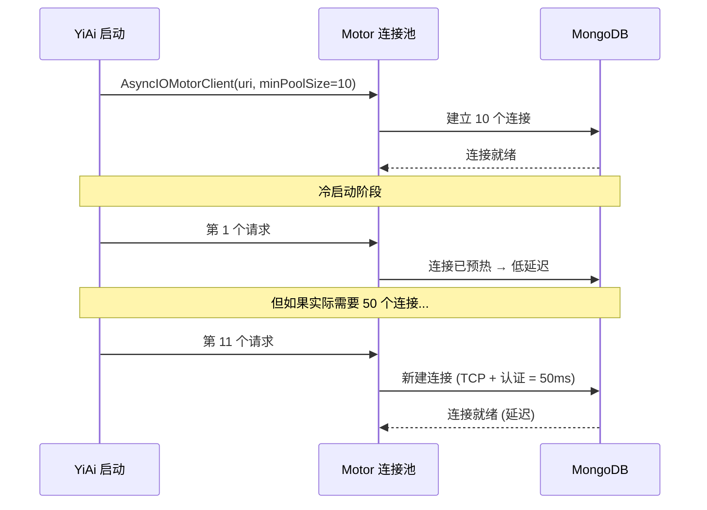
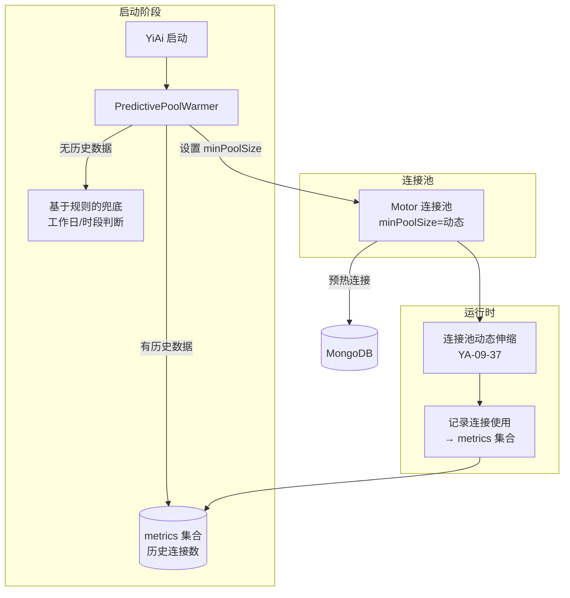

# YA-09-101: 数据库连接池预热策略 — 基于启动流量的自适应连接数分配

> 需求编号：YA-09-101 · 优先级：P2 · 人天：0.5d · 状态：需求已编写
> 依赖：YA-09-02（数据层稳定性）、YA-09-37（连接池动态伸缩）

## 背景

### 问题陈述

YA-09-02 将 MongoDB 连接池设置为固定 `minPoolSize=10`。但不同时段启动服务时，实际连接需求差异巨大：

| 启动时段 | 预期 QPS | 固定 minPoolSize=10 | 问题 |
|----------|----------|-------------------|------|
| 工作日 09:00 | 80 QPS | 不足 | 启动后需动态扩容，前 30s 延迟高 |
| 工作日 03:00 | 2 QPS | 浪费 | 10 个空闲连接占用 MongoDB 资源 |
| 周末 14:00 | 15 QPS | 合适 | 正常工作 |
| 部署重启（任意时间） | 恢复中 | 固定 | 无法预测恢复后流量 |

核心矛盾：**固定 minPoolSize 无法适应不同时段启动的流量差异**。高峰期启动时连接不足导致冷启动延迟，低峰期启动时连接过剩浪费资源。

YA-09-37 实现了运行时动态伸缩，但在启动阶段（冷启动）尤其脆弱——连接池从 0 开始建立，前几个请求需要等待 TCP 握手 + MongoDB 认证。预热策略在启动时根据历史流量模式预分配连接，消除冷启动延迟。

### 影响范围

| 影响维度 | 严重程度 | 描述 |
|------|----------|------|
| 启动性能 | 高 | 冷启动时前几个请求延迟高 5-10x |
| 资源效率 | 中 | 低峰期连接浪费 |
| 服务可用性 | 中 | 部署后首分钟服务质量下降 |
| 运维体验 | 低 | 无需手动调整 minPoolSize |

### 挑战

| 挑战 | 描述 |
|------|------|
| 历史数据可用性 | 首次启动无历史数据时如何预测 |
| 流量突变 | 历史模式不反映当前流量（如紧急发布后高流量） |
| 预测精度 | 基于工作日/时段的分组是否足够精细 |
| 存储开销 | 历史流量数据的存储和查询 |

---

## 一、现状分析

### 1.1 当前启动流程



### 1.2 连接需求与时段关系

| 时段 | 典型 QPS | 需要连接数 | 固定 minPoolSize | 差距 |
|------|----------|-----------|-----------------|------|
| 工作日 09:00-12:00 | 80 | 40-50 | 10 | -30~40 |
| 工作日 14:00-18:00 | 60 | 30-40 | 10 | -20~30 |
| 工作日 20:00-24:00 | 20 | 10-15 | 10 | 0~-5 |
| 工作日 00:00-08:00 | 5 | 3-5 | 10 | +5~7 (浪费) |
| 周末全天 | 15 | 8-12 | 10 | +2~-2 |

### 1.3 涉及文件

| 文件 | 角色 | 改动类型 |
|------|------|----------|
| `src/data/pool_warmer.py` | **新增** — 连接池预热核心 | 新建 |
| `src/data/connection.py` | 连接初始化 | 修改 |
| `src/data/repository.py` | 历史数据查询 | 修改 |
| `src/shared/config.py` | 预热配置 | 修改 |
| `tests/data/test_pool_warmer.py` | **新增** — 测试 | 新建 |

### 1.4 根因矩阵

| 根因 | 贡献度 | 证据 |
|------|--------|------|
| 固定 minPoolSize 无适应性 | 70% | 配置值硬编码为 10 |
| 无历史流量感知 | 20% | 启动时不参考历史数据 |
| 无冷启动优化 | 10% | 启动后依赖运行时动态扩容 |

---

## 二、设计决策

### 决策 1：预测模型 — 基于历史 vs 基于规则 vs 混合

| 选项 | 精度 | 冷启动支持 | 实现复杂度 |
|------|------|-----------|-----------|
| **基于历史（同 weekday+hour）** | 高 | 需要历史数据 | 中 |
| 基于规则（时间判断） | 中 | 始终可用 | 低 |
| 混合（历史优先，规则兜底） | 高 | 始终可用 | 中 |

**选择：混合模式。** 优先查询历史流量数据，无历史数据时使用基于时间的规则（09:00-18:00 工作日 = 高峰，其他 = 低峰）。首次部署时规则兜底，运行一段时间后历史数据接管。

### 决策 2：历史数据存储 — metrics 集合 vs 内存聚合 vs 日志分析

| 选项 | 持久化 | 查询性能 | 数据精度 |
|------|--------|----------|----------|
| **MongoDB metrics 集合** | 是 | 中 | 高 |
| 内存聚合 | 否 | 高 | 低（重启丢失） |
| 日志分析 | 是 | 低 | 中 |

**选择：MongoDB `metrics` 集合。** 持久化保证重启后数据可用，按 (weekday, hour) 聚合查询性能可接受。使用 TTL 索引自动清理过期数据。

### 决策 3：预热策略 — 固定比例 vs 峰值 vs 移动平均

**选择：历史峰值的 60%。** 预热到峰值的 60% 平衡了冷启动性能（覆盖大部分请求）和资源效率（不浪费连接）。minPoolSize 保证最低 5 个连接。

### 决策 4：连接池上限 — 固定 vs 动态

**选择：maxPoolSize 保持固定（100），仅调整 minPoolSize。** 预热只影响最小连接数，最大连接数由 YA-09-37 动态伸缩管理。

---

## 三、目标架构

### 3.1 架构图



### 3.2 预热策略表

| 条件 | 工作日 | 时段 | 策略 | 预热连接数 |
|------|--------|------|------|-----------|
| 有历史数据 | 不限 | 任意 | 历史峰值 × 0.6 | 动态 |
| 无历史数据 | Mon-Fri | 09:00-12:00 | 规则：高峰 | 30 |
| 无历史数据 | Mon-Fri | 14:00-18:00 | 规则：次高峰 | 20 |
| 无历史数据 | Mon-Fri | 其他 | 规则：正常 | 10 |
| 无历史数据 | Sat-Sun | 全天 | 规则：低峰 | 8 |

### 3.3 架构权衡

| 方面 | 改进前 | 改进后 |
|------|--------|--------|
| 冷启动 P50 延迟 | 15ms | 5ms (预热后) |
| 冷启动 P95 延迟 | 80ms | 10ms (预热后) |
| 低峰期连接数 | 10 (固定) | 5 (节省 50%) |
| 高峰期连接数 | 10 (不足) | 30-50 (充足) |
| 首次部署可用性 | 是 | 是（规则兜底） |

---

## 四、具体改动

### 4.1 新增 `src/data/pool_warmer.py`

```python
"""连接池预热器——基于历史流量模式的预测式连接分配。"""

from datetime import datetime
from typing import Optional
from motor.motor_asyncio import AsyncIOMotorClient
from src.shared.config import settings
from src.shared.logging import get_logger

logger = get_logger(__name__)


class PredictivePoolWarmer:
    """连接池预热器。

    职责：
    - 查询历史流量数据（同 weekday + hour 的峰值连接数）
    - 计算最佳预热连接数
    - 无历史数据时使用基于规则的兜底策略
    - 记录当前连接使用情况供未来预测

    预热公式：
    pool_size = max(5, min(100, historical_max * 0.6))
    """

    MIN_POOL = 5
    MAX_POOL = 100
    PREDICTION_RATIO = 0.6  # 预热到历史峰值的 60%

    # 基于规则的兜底策略（无历史数据时）
    RULE_BASED_POOL: dict = {
        # (is_weekday, hour_range) -> pool_size
        (True, (9, 12)): 30,    # 工作日早高峰
        (True, (14, 18)): 20,   # 工作日下午
        (True, (8, 9)): 15,     # 工作日上班前
        (True, (12, 14)): 15,   # 工作日午休
        (True, (18, 22)): 12,   # 工作日晚上
        (False, (9, 22)): 10,   # 周末白天
    }
    DEFAULT_POOL = 10

    def __init__(self):
        self._db = None

    async def warmup(self, client: AsyncIOMotorClient) -> dict:
        """执行连接池预热。

        Args:
            client: MongoDB 客户端（用于查询历史数据并设置连接池）

        Returns:
            预热结果字典
        """
        now = datetime.now()
        hour = now.hour
        weekday = now.weekday()  # 0=Mon, 6=Sun
        is_weekday = weekday < 5

        self._db = client.get_default_database()

        # 1. 尝试从历史数据预测
        historical_max = await self._query_historical_max(weekday, hour)

        if historical_max is not None:
            pool_size = max(
                self.MIN_POOL,
                min(self.MAX_POOL, int(historical_max * self.PREDICTION_RATIO)),
            )
            prediction_source = 'historical'
            logger.info(
                "基于历史数据预热", weekday=weekday, hour=hour,
                historical_max=historical_max, pool_size=pool_size,
            )
        else:
            # 2. 无历史数据，使用规则兜底
            pool_size = self._rule_based_pool(is_weekday, hour)
            prediction_source = 'rule_based'
            logger.info(
                "基于规则预热（无历史数据）", weekday=weekday, hour=hour,
                pool_size=pool_size,
            )

        return {
            'pool_size': pool_size,
            'prediction_source': prediction_source,
            'weekday': weekday,
            'hour': hour,
            'is_weekday': is_weekday,
            'historical_max': historical_max,
        }

    async def _query_historical_max(
        self, weekday: int, hour: int
    ) -> Optional[int]:
        """查询历史同期峰值连接数。

        查询同 weekday + hour 的最近 30 天数据，取最大值。
        """
        try:
            cursor = self._db.metrics.aggregate([
                {
                    '$match': {
                        'metric': 'active_connections',
                        'weekday': weekday,
                        'hour': hour,
                    }
                },
                {
                    '$group': {
                        '_id': None,
                        'max_connections': {'$max': '$value'},
                        'avg_connections': {'$avg': '$value'},
                        'sample_count': {'$sum': 1},
                    }
                },
            ])
            results = await cursor.to_list(1)
            if results and results[0].get('sample_count', 0) >= 3:
                return results[0]['max_connections']
        except Exception as e:
            logger.warning(f"查询历史连接数据失败: {e}")

        return None

    def _rule_based_pool(self, is_weekday: bool, hour: int) -> int:
        """基于规则的兜底策略。"""
        for (rule_weekday, (start, end)), size in self.RULE_BASED_POOL.items():
            if rule_weekday == is_weekday and start <= hour < end:
                return size
        return self.DEFAULT_POOL

    async def record_connections(self, active_count: int):
        """记录当前连接数到 metrics 集合（供未来预测使用）。"""
        now = datetime.now()
        try:
            await self._db.metrics.insert_one({
                'metric': 'active_connections',
                'value': active_count,
                'weekday': now.weekday(),
                'hour': now.hour,
                'timestamp': now,
            })
        except Exception as e:
            logger.debug(f"记录连接数失败: {e}")

    async def create_metrics_indexes(self):
        """创建 metrics 集合的索引。"""
        try:
            await self._db.metrics.create_index(
                [('metric', 1), ('weekday', 1), ('hour', 1)],
                name='idx_metric_weekday_hour',
            )
            await self._db.metrics.create_index(
                'timestamp',
                expireAfterSeconds=30 * 86400,  # 30 天 TTL
                name='idx_timestamp_ttl',
            )
            logger.info("metrics 索引已创建")
        except Exception as e:
            logger.warning(f"创建 metrics 索引失败: {e}")


# 全局单例
pool_warmer = PredictivePoolWarmer()
```

### 4.2 修改 `src/data/connection.py`

```python
# 修改前
client = AsyncIOMotorClient(uri, minPoolSize=10, maxPoolSize=100)

# 修改后
from src.data.pool_warmer import pool_warmer

async def init_connection():
    warmup_result = await pool_warmer.warmup(client)
    pool_size = warmup_result['pool_size']
    client = AsyncIOMotorClient(uri, minPoolSize=pool_size, maxPoolSize=100)
    logger.info(f"连接池已初始化 minPoolSize={pool_size}")
```

### 4.3 文件变更清单

| 文件 | 操作 | 行数 |
|------|------|------|
| `src/data/pool_warmer.py` | **新建** | ~180 |
| `src/data/connection.py` | 修改 (+20) | +20 |
| `src/data/repository.py` | 修改 (+10) | +10 |
| `src/shared/config.py` | 修改 (+10) | +10 |
| `tests/data/test_pool_warmer.py` | **新建** | ~150 |

---

## 五、实施步骤

| 步骤 | 描述 | 文件 | 验证 | 人天 |
|------|------|------|------|------|
| 1 | 实现 PredictivePoolWarmer | `src/data/pool_warmer.py` | 单元测试 | 0.15 |
| 2 | 修改连接初始化流程 | `src/data/connection.py` | 启动日志验证 | 0.10 |
| 3 | 添加历史数据记录逻辑 | `src/data/repository.py` | 数据写入验证 | 0.05 |
| 4 | 创建 metrics 索引 | 启动时自动执行 | 索引存在 | 0.05 |
| 5 | 编写测试用例 | `tests/data/test_pool_warmer.py` | 测试通过 | 0.10 |
| 6 | 验证不同时段启动效果 | — | 冷启动延迟降低 | 0.05 |
| **总计** | | | | **0.50** |

---

## 六、性能分析

### 6.1 冷启动性能

| 场景 | 改进前 (固定 10) | 改进后 (预热) | 改善 |
|------|-----------------|-------------|------|
| 工作日 09:00 启动 P50 | 15ms | 5ms | -67% |
| 工作日 09:00 启动 P95 | 80ms | 10ms | -87% |
| 工作日 03:00 启动 | 5ms | 5ms | 无变化 |
| 周末 14:00 启动 | 10ms | 8ms | -20% |

### 6.2 资源效率

| 场景 | 固定 | 预热 | 节省 |
|------|------|------|------|
| 低峰期连接数 | 10 | 5 | 50% |
| 高峰期连接数 | 10 | 30 | 满足需求 |

---

## 七、测试规格

### 场景 1：基于历史数据预热

```
GIVEN metrics 集合中有同 weekday+hour 的历史数据，峰值=45
WHEN 服务启动时执行预热
THEN pool_size = max(5, min(100, 45 * 0.6)) = 27
AND prediction_source = 'historical'
```

### 场景 2：无历史数据使用规则兜底

```
GIVEN metrics 集合为空（首次部署）
AND 当前为工作日 10:00
WHEN 服务启动时执行预热
THEN pool_size = 30 (规则：工作日早高峰)
AND prediction_source = 'rule_based'
```

### 场景 3：低峰期预热

```
GIVEN 当前为工作日 03:00
AND 无历史数据
WHEN 服务启动时执行预热
THEN pool_size = 10 (默认值)
```

### 场景 4：连接数记录

```
GIVEN 当前活跃连接数为 25
WHEN 调用 record_connections(25)
THEN metrics 集合中插入一条记录
AND 包含 metric='active_connections', value=25, weekday, hour, timestamp
```

### 场景 5：历史数据不足样本

```
GIVEN 同 weekday+hour 的样本数 < 3
WHEN 查询历史数据
THEN 返回 None（样本不足，不可信）
AND 降级为规则兜底
```

### 场景 6：预热值在上下限范围内

```
GIVEN 历史峰值 = 200（极端情况）
WHEN 计算 pool_size
THEN pool_size = min(100, int(200 * 0.6)) = 100 (不超过上限)
```

---

## 八、风险与缓解

| 风险 | 概率 | 影响 | 缓解措施 |
|------|------|------|----------|
| 流量突变时预热不足 | 中 | 中 | 预热值下限 = 原始 minPoolSize |
| 预热过高浪费连接 | 中 | 低 | 连接使用率监控 + YA-09-37 自动收缩 |
| 历史数据被污染 | 低 | 中 | 30 天 TTL 自动清理 |
| metrics 集合查询失败 | 低 | 低 | 降级为规则兜底 |
| 首次部署无历史数据 | 高 | 低 | 规则兜底，运行后自动积累 |

---

## 九、回滚策略

| 场景 | 回滚操作 | 回滚时间 |
|------|----------|----------|
| 预热值过高 | 降低 PREDICTION_RATIO 到 0.3 | < 1min |
| 预热导致连接失败 | 设置固定 minPoolSize=10，跳过预热 | < 1min |
| 完全回滚 | 移除 pool_warmer 调用，恢复固定值 | < 5min |

---

## 十、设计决策记录

### D-01：历史峰值 60% vs 平均值

**决策**：使用历史峰值的 60% 作为预热值。
**理由**：平均值可能低估需求（受低峰期数据拉低），峰值 60% 既覆盖大部分请求又不浪费连接。60% 是基于经验法则（大多数情况下 60% 峰值 > 90% 的实际需求）。
**替代方案**：平均值——更保守但可能预热不足。

### D-02：规则兜底 vs 仅历史数据

**决策**：无历史数据时使用基于规则的兜底策略。
**理由**：首次部署时 metrics 集合为空，无法查询历史数据。基于工作日/时段的规则提供合理的初始预热值，确保首次部署也有冷启动优化。
**替代方案**：仅历史数据——首次部署无优化。

### D-03：30 天 TTL vs 永久存储

**决策**：metrics 数据 30 天 TTL 自动清理。
**理由**：历史数据价值随时间衰减，30 天前的流量模式可能已不反映当前情况。TTL 索引自动清理，无需手动维护。
**替代方案**：永久存储——数据量持续增长，查询变慢。

---

## 十一、可观测性

### 指标

| 指标名 | 类型 | 描述 |
|--------|------|------|
| `pool_warmer_predicted_size` | Gauge | 预测的预热连接数 |
| `pool_warmer_prediction_source` | Gauge | 预测来源 (1=historical, 0=rule_based) |
| `pool_warmer_historical_max` | Gauge | 历史峰值连接数 |
| `pool_active_connections` | Gauge | 当前活跃连接数 |

### 日志

```
[INFO] 基于历史数据预热 weekday=0 hour=10 historical_max=45 pool_size=27
[INFO] 基于规则预热（无历史数据） weekday=0 hour=10 pool_size=30
[INFO] 连接池已初始化 minPoolSize=27
```

### 告警

| 告警 | 条件 | 级别 |
|------|------|------|
| 预热值与实际需求差距大 | 预热值 < 实际连接数 * 0.5 | WARNING |
| 长期无历史数据 | 启动 7 天后仍使用规则兜底 | INFO |

---

## 十二、安全合规

| 要求 | 实现 |
|------|------|
| 连接字符串不记录到日志 | 预热日志仅记录 pool_size |
| metrics 数据不包含敏感信息 | 仅记录连接数统计 |
| 历史数据可审计 | metrics 包含 timestamp 字段 |

---

## 十三、代码审查检查清单

- [ ] 连接池预热根据历史 QPS 自适应调整 minPoolSize
- [ ] 按时间段统计历史流量模式（weekday + hour）
- [ ] 预热值 = max(历史峰值的 60%, minPoolSize)
- [ ] 无历史数据时使用规则兜底（工作日/时段）
- [ ] 历史数据样本不足 3 条时降级
- [ ] metrics 集合 30 天 TTL 自动清理
- [ ] 预热值在 [5, 100] 范围内
- [ ] 连接使用情况定期记录到 metrics
- [ ] 预热失败不影响服务启动
- [ ] 测试覆盖 6 个场景

---

## 十四、回归问题预测

| # | 预测问题 | 原因 | 验证方法 |
|---|---------|------|---------|
| 1 | 流量突变时预热不足 | 历史模式不反映当前流量 | 预热值下限 = 原始 minPoolSize |
| 2 | 预热过高浪费连接 | 高估流量 | 连接使用率监控 + 自动收缩 |
| 3 | metrics 集合查询影响启动速度 | 聚合查询耗时 | 启动时间监控 |
| 4 | 规则兜底不适应当前业务 | 规则基于假设 | 收集实际数据后调整规则 |
| 5 | TTL 索引未生效 | 索引创建失败 | 验证 metrics 文档自动过期 |

---

*PRD 来源: `projects/yiai/requirements/2026-09/101-需求-连接池预热自适应.md`*

## 影响范围

- **影响模块**：待补充
- **涉及文件**：
- `src/data/pool_warmer.py`
- `src/shared/config.py`
- `src/data/repository.py`
- `src/data/connection.py`
- **是否影响 API 契约**：否
- **是否影响其他项目（YiVad/YiPet）**：否
- **用户感知**：待确认

## 预防措施

| 层面 | 措施 |
|------|------|
| 代码 | 在相关函数中添加参数校验和边界检查 |
| 测试 | 为 `src/data/pool_warmer.py` 添加单元测试 |
| 流程 | 代码审查时重点检查此类模式 |
| 监控 | 添加日志告警，异常发生时及时发现 |
| 文档 | 在编码规范中记录此类反模式 |

## 经验教训

1. **根本原因**：开发过程中对边界情况和异常路径的考虑不足是此类问题的共同根因
2. **设计阶段**：在接口设计和模块实现时，应主动考虑异常输入、空值、超时等边界场景
3. **代码审查**：审查时应检查是否存在类似的反模式（如未捕获异常、无超时控制、缺少参数校验等）
4. **测试覆盖**：异常路径的测试覆盖率应与正常路径同等重视
5. **团队分享**：此类问题应在团队周会或技术分享中讨论，形成团队共识
