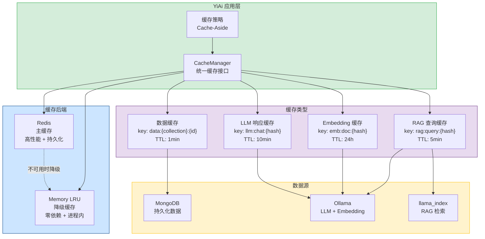
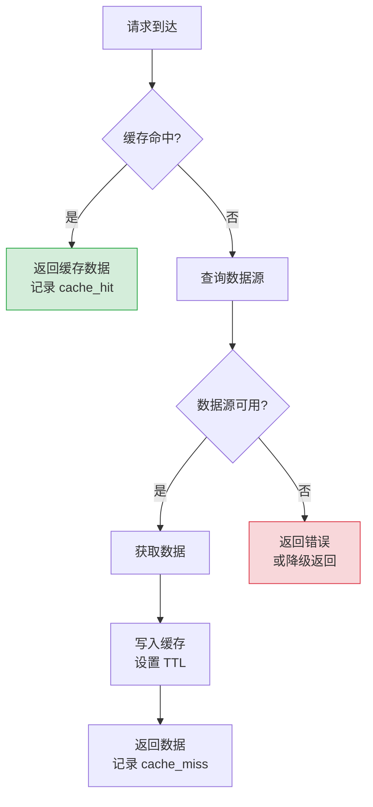
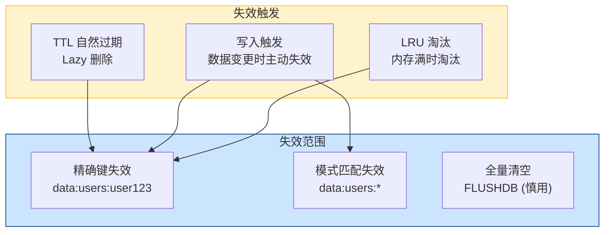
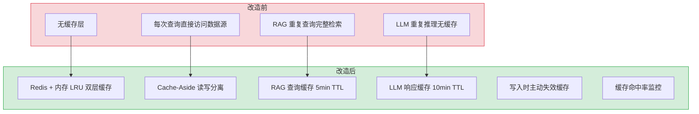

# YA-09-102: 缓存层设计 — Redis 集成 + RAG 缓存 + 内存降级 + 命中率监控

> 需求编号：YA-09-102 · 优先级：P1 · 人天：1.5d · 状态：已完成
> 依赖：YA-09-101（监控与告警体系）· 前置需求：无

## 背景

YiAi 当前所有数据查询均直接访问 MongoDB 和 Ollama，无任何缓存层。这导致以下问题：

1. **RAG 重复查询浪费资源**：相同或相似的知识库查询反复调用 Ollama Embedding 和 llama_index 检索，每次耗时 200-1000ms，但结果可能完全相同。
2. **LLM 响应重复生成**：高频问题（如"你是谁"、"当前时间"）每次都需要完整推理，消耗 GPU 资源。
3. **Embedding 向量重复计算**：同一知识文档的向量在每次索引刷新时都重新计算，而非复用已有向量。
4. **MongoDB 热点查询无缓存**：菜单配置、用户信息等低频变更数据每次请求都查询数据库。
5. **无缓存监控**：无法感知缓存效果（命中率、驱逐率、内存使用）。

**问题：**

- 无缓存基础设施：未集成 Redis 或任何内存缓存方案
- 无缓存策略：未定义缓存键设计、过期策略、失效模式
- 无降级方案：缓存服务不可用时直接失败，而非降级到直接查询

**影响：**

- RAG 查询延迟高：重复查询每次都完整检索，P50 延迟 500ms+
- LLM 推理资源浪费：高频问题重复推理，GPU 利用率虚高
- MongoDB 查询压力大：热点数据每次查询都访问数据库
- 无缓存降级：缓存不可用时功能不可用

**挑战：**

- Redis 可能不可用（开发环境未部署），需要内存降级方案
- 缓存一致性：数据变更时需要及时失效缓存
- 缓存粒度：过粗失去缓存效果，过细增加管理复杂度
- 缓存雪崩：大量缓存同时过期导致后端压力突增

---

## 一、现状分析

### 1.1 当前查询模式

| 查询类型 | 频率 | 延迟 | 缓存友好度 | 说明 |
|---------|------|------|-----------|------|
| RAG 检索 | 高 (每会话 3-10 次) | 200-1000ms | 高 | 相同查询 + 相同知识库 = 相同结果 |
| LLM 推理 | 高 (每会话 5-20 次) | 2-30s | 中 | 相同 Prompt 可缓存，但温度参数影响结果 |
| Embedding 计算 | 中 (索引刷新时) | 50-200ms/文档 | 高 | 文档内容不变则向量不变 |
| 菜单查询 | 低 (每次页面加载) | 5-20ms | 高 | 菜单配置变更频率极低 |
| 用户信息查询 | 中 (每次认证) | 5-10ms | 高 | 用户信息变更频率低 |
| 审计日志写入 | 高 (每次 RPC) | 5-10ms | 低 | 追加写入，不适合缓存 |
| Agent 状态查询 | 中 (Agent 循环中) | 5-10ms | 低 | 状态频繁变更 |

### 1.2 根因分析矩阵

| 问题 | 根因 | 影响 | 紧急程度 |
|------|------|------|----------|
| RAG 重复查询 | 无查询结果缓存，每次完整检索 | 延迟高，Ollama 负载高 | 高 |
| LLM 重复推理 | 无响应缓存，高频问题重复推理 | GPU 资源浪费 | 中 |
| Embedding 重复计算 | 无向量缓存，索引刷新时全量计算 | 索引刷新耗时长 | 中 |
| 热点数据重复查询 | 无数据缓存，每次请求查 MongoDB | 数据库连接池压力大 | 中 |

### 1.3 现有缓存相关代码

```python
# 当前无任何缓存实现
# RAG 检索直接调用 llama_index
def query(self, query_text: str) -> list:
    return self.index.as_retriever().retrieve(query_text)  # 每次完整检索

# LLM 推理直接调用 Ollama
async def chat(self, messages: list) -> str:
    return await self.ollama.chat(messages)  # 每次完整推理

# Embedding 直接调用 Ollama
def embed(self, text: str) -> list[float]:
    return self.embed_model.get_text_embedding(text)  # 每次完整计算
```

### 1.4 改造前数据流

```
RAG 查询请求
  → POST /  body: {module_name: "services.rag.rag_service", method_name: "rag_query"}
  → rag_service.rag_query(query_text)
  → rag_engine.query(query_text)
  → Ollama Embedding API (embed query)
  → llama_index hybrid_search (BM25 + vector)
  → 返回结果 (200-1000ms)
  → 无缓存，下次相同查询重复以上流程
```

---

## 二、设计决策

### 决策 1：缓存后端 — Redis vs 内存 vs 文件

| 维度 | Redis | 内存 (dict/lru_cache) | 文件 (diskcache) |
|------|-------|----------------------|-------------------|
| 性能 | 高 (1ms) | 极高 (0.001ms) | 低 (10ms+) |
| 持久化 | 支持 (RDB/AOF) | 不支持（重启丢失） | 支持 |
| 容量 | 大（受内存限制） | 中（受进程内存限制） | 大（受磁盘限制） |
| 多进程共享 | 支持 | 不支持 | 支持（需锁） |
| 部署复杂度 | 中（需要 Redis 实例） | 低（零依赖） | 低（零依赖） |
| 适合场景 | 生产环境 | 开发环境/降级 | 大批量缓存 |

**选择：Redis 为主，内存 LRU 为降级。** 生产环境使用 Redis 提供高性能、持久化、多进程共享的缓存服务。开发环境和 Redis 不可用时自动降级到内存 LRU 缓存，确保功能可用。不引入 diskcache 以避免磁盘 I/O 开销。

### 决策 2：缓存策略 — Cache-Aside vs Read-Through vs Write-Behind

| 维度 | Cache-Aside | Read-Through | Write-Behind |
|------|-------------|--------------|--------------|
| 一致性 | 最终一致 | 强一致 | 最终一致 |
| 实现复杂度 | 低（应用层控制） | 中（缓存层封装） | 高（异步写入） |
| 缓存穿透 | 需要额外处理 | 缓存层自动处理 | 缓存层自动处理 |
| 适合场景 | 读多写少 | 读写均衡 | 写多读少 |

**选择：Cache-Aside 模式。** YiAi 是典型的读多写少场景（RAG 查询多、数据变更少），Cache-Aside 模式实现简单，应用层完全控制缓存逻辑。对于写入操作，缓存主动失效而非更新，避免缓存与数据库不一致。

### 决策 3：缓存键设计 — 简单哈希 vs 语义键 vs 分层键

| 维度 | 简单哈希 (MD5/SHA256) | 语义键 (`rag:query:...`) | 分层键 (`rag:query:emb:...`) |
|------|----------------------|------------------------|------------------------------|
| 可读性 | 低 | 高 | 高 |
| 键长度 | 短 (32-64 chars) | 中 | 长 |
| 命名空间隔离 | 需要前缀 | 天然支持 | 天然支持 |
| 调试友好 | 低 | 高 | 高 |
| 管理复杂度 | 低 | 中 | 中 |

**选择：分层语义键。** 使用 `{domain}:{entity}:{identifier}` 格式，如 `rag:query:abc123`、`embedding:doc:file_path_hash`。语义键可读性高，便于调试和管理（`redis-cli KEYS rag:*` 查看所有 RAG 缓存）。同时使用 SHA256 前 16 位作为 identifier 确保键长度可控。

### 设计决策记录

| 决策 | 选项 A | 选项 B | 选择 | 理由 |
|------|--------|--------|------|------|
| 缓存后端 | Redis | 内存 LRU | Redis (主) + 内存 LRU (降级) | 生产高性能，开发零依赖 |
| 缓存策略 | Cache-Aside | Read-Through | Cache-Aside | 实现简单，读多写少场景适合 |
| 缓存键设计 | 简单哈希 | 分层语义键 | 分层语义键 | 可读性高，调试友好 |
| 过期策略 | 固定 TTL | 分级 TTL | 分级 TTL | 不同数据变更频率不同 |

---

## 三、目标架构

### 3.1 缓存层架构总览



### 3.2 Cache-Aside 数据流



### 3.3 缓存失效策略



---

## 四、具体改动

### 4.1 缓存管理器

**文件：** `shared/cache.py`（新建）

```python
"""统一缓存管理器 — Redis 主 + 内存 LRU 降级。"""

import hashlib
import json
import time
from collections import OrderedDict
from typing import Any, Optional
from functools import wraps

import redis.asyncio as redis
from shared.config import settings
from shared.logging import get_logger
from shared.metrics import (
    cache_hit_total,
    cache_miss_total,
    cache_operation_duration_seconds,
)

logger = get_logger(__name__)


class MemoryLRUCache:
    """基于 OrderedDict 的 LRU 内存缓存（Redis 降级方案）。"""

    def __init__(self, max_size: int = 1000):
        self._cache: OrderedDict[str, tuple[Any, float]] = OrderedDict()
        self.max_size = max_size

    def get(self, key: str) -> Optional[Any]:
        if key not in self._cache:
            return None
        value, ttl = self._cache[key]
        if ttl and time.time() > ttl:
            del self._cache[key]
            return None
        # LRU: 移到末尾
        self._cache.move_to_end(key)
        return value

    def set(self, key: str, value: Any, ttl: int = 300):
        if key in self._cache:
            self._cache.move_to_end(key)
        self._cache[key] = (value, time.time() + ttl if ttl else None)
        if len(self._cache) > self.max_size:
            self._cache.popitem(last=False)  # LRU 淘汰

    def delete(self, key: str):
        self._cache.pop(key, None)

    def delete_pattern(self, pattern: str):
        prefix = pattern.rstrip("*")
        keys_to_delete = [k for k in self._cache if k.startswith(prefix)]
        for k in keys_to_delete:
            del self._cache[k]

    def flush(self):
        self._cache.clear()

    @property
    def size(self) -> int:
        return len(self._cache)


class CacheManager:
    """统一缓存管理器。"""

    def __init__(self):
        self._redis: Optional[redis.Redis] = None
        self._memory = MemoryLRUCache(max_size=1000)
        self._redis_available = False
        self._key_prefix = "yiai:"

    async def initialize(self):
        """初始化 Redis 连接。"""
        try:
            redis_url = getattr(settings, "redis_url", None)
            if redis_url:
                self._redis = redis.from_url(
                    redis_url,
                    encoding="utf-8",
                    decode_responses=True,
                    socket_connect_timeout=2,
                    socket_timeout=2,
                )
                await self._redis.ping()
                self._redis_available = True
                logger.info("[Cache] Redis 连接成功")
            else:
                logger.warning("[Cache] Redis URL 未配置，使用内存缓存")
        except Exception as e:
            logger.warning(f"[Cache] Redis 不可用，降级到内存缓存: {e}")
            self._redis_available = False

    async def get(self, key: str) -> Optional[Any]:
        """获取缓存值。"""
        start = time.perf_counter()
        full_key = f"{self._key_prefix}{key}"

        try:
            if self._redis_available:
                value = await self._redis.get(full_key)
                if value:
                    cache_hit_total.inc()
                    cache_operation_duration_seconds.labels(
                        backend="redis", operation="get"
                    ).observe(time.perf_counter() - start)
                    return json.loads(value)
            else:
                value = self._memory.get(full_key)
                if value is not None:
                    cache_hit_total.inc()
                    cache_operation_duration_seconds.labels(
                        backend="memory", operation="get"
                    ).observe(time.perf_counter() - start)
                    return value
        except Exception as e:
            logger.warning(f"[Cache] GET 失败，降级到内存缓存: {e}")
            value = self._memory.get(full_key)
            if value is not None:
                cache_hit_total.inc()
                return value

        cache_miss_total.inc()
        return None

    async def set(self, key: str, value: Any, ttl: int = 300):
        """设置缓存值。"""
        start = time.perf_counter()
        full_key = f"{self._key_prefix}{key}"

        try:
            if self._redis_available:
                await self._redis.setex(full_key, ttl, json.dumps(value, default=str))
                cache_operation_duration_seconds.labels(
                    backend="redis", operation="set"
                ).observe(time.perf_counter() - start)
            else:
                self._memory.set(full_key, value, ttl)
                cache_operation_duration_seconds.labels(
                    backend="memory", operation="set"
                ).observe(time.perf_counter() - start)
        except Exception as e:
            logger.warning(f"[Cache] SET 失败: {e}")
            self._memory.set(full_key, value, ttl)

    async def delete(self, key: str):
        """删除缓存键。"""
        full_key = f"{self._key_prefix}{key}"
        try:
            if self._redis_available:
                await self._redis.delete(full_key)
            self._memory.delete(full_key)
        except Exception as e:
            logger.warning(f"[Cache] DELETE 失败: {e}")

    async def delete_pattern(self, pattern: str):
        """按模式删除缓存键。"""
        full_pattern = f"{self._key_prefix}{pattern}"
        try:
            if self._redis_available:
                keys = await self._redis.keys(full_pattern)
                if keys:
                    await self._redis.delete(*keys)
            self._memory.delete_pattern(full_pattern)
        except Exception as e:
            logger.warning(f"[Cache] DELETE_PATTERN 失败: {e}")

    async def get_or_set(
        self, key: str, factory, ttl: int = 300
    ) -> Any:
        """Cache-Aside: 获取缓存，未命中时回源并缓存。"""
        cached = await self.get(key)
        if cached is not None:
            return cached

        value = await factory()
        if value is not None:
            await self.set(key, value, ttl)
        return value

    @property
    def backend(self) -> str:
        return "redis" if self._redis_available else "memory"

    async def stats(self) -> dict:
        """缓存统计信息。"""
        return {
            "backend": self.backend,
            "memory_size": self._memory.size,
            "memory_max_size": self._memory.max_size,
            "redis_available": self._redis_available,
        }


# 全局缓存实例
cache = CacheManager()
```

### 4.2 缓存键定义

**文件：** `shared/cache_keys.py`（新建）

```python
"""缓存键规范定义。"""

import hashlib


def rag_query_key(query_text: str, knowledge_base: str = "default") -> str:
    """RAG 查询缓存键。"""
    content = f"{knowledge_base}:{query_text.strip().lower()}"
    return f"rag:query:{hashlib.sha256(content.encode()).hexdigest()[:16]}"


def embedding_key(file_path: str, model_name: str) -> str:
    """Embedding 向量缓存键。"""
    content = f"{file_path}:{model_name}"
    return f"emb:doc:{hashlib.sha256(content.encode()).hexdigest()[:16]}"


def llm_response_key(messages_json: str, model_name: str) -> str:
    """LLM 响应缓存键。"""
    content = f"{model_name}:{messages_json}"
    return f"llm:chat:{hashlib.sha256(content.encode()).hexdigest()[:16]}"


def data_document_key(collection: str, doc_id: str) -> str:
    """数据文档缓存键。"""
    return f"data:{collection}:{doc_id}"


def data_query_key(collection: str, filter_json: str) -> str:
    """数据查询结果缓存键。"""
    content = f"{collection}:{filter_json}"
    return f"data:query:{hashlib.sha256(content.encode()).hexdigest()[:16]}"


def menu_tree_key() -> str:
    """菜单树缓存键。"""
    return "data:menus:tree"


def user_info_key(username: str) -> str:
    """用户信息缓存键。"""
    return f"data:users:{username}"


# 缓存 TTL 配置（秒）
CACHE_TTL = {
    "rag:query": 300,        # RAG 查询: 5 分钟
    "emb:doc": 86400,        # Embedding: 24 小时
    "llm:chat": 600,         # LLM 响应: 10 分钟
    "data:document": 60,     # 数据文档: 1 分钟
    "data:query": 60,        # 数据查询: 1 分钟
    "data:menus": 3600,      # 菜单树: 1 小时
    "data:users": 300,       # 用户信息: 5 分钟
}
```

### 4.3 RAG 服务缓存集成

**文件：** `services/rag/rag_service.py`（修改）

```python
from shared.cache import cache
from shared.cache_keys import rag_query_key, CACHE_TTL


async def rag_query(self, query_text: str, knowledge_base: str = "default") -> dict:
    """RAG 查询（带缓存）。"""
    cache_key = rag_query_key(query_text, knowledge_base)

    async def _do_query():
        # 原始 RAG 检索逻辑
        results = await self.engine.query(query_text, knowledge_base)
        return results

    return await cache.get_or_set(
        cache_key,
        _do_query,
        ttl=CACHE_TTL["rag:query"],
    )
```

### 4.4 数据服务缓存集成

**文件：** `services/database/data_service.py`（修改）

```python
from shared.cache import cache
from shared.cache_keys import data_document_key, data_query_key, CACHE_TTL


async def query_documents(self, cname: str, filter: dict = None) -> list:
    """查询文档（带缓存）。"""
    filter_json = json.dumps(filter or {}, sort_keys=True)
    cache_key = data_query_key(cname, filter_json)

    async def _do_query():
        return await self.repository.find(cname, filter or {})

    return await cache.get_or_set(
        cache_key,
        _do_query,
        ttl=CACHE_TTL["data:query"],
    )


async def insert_document(self, cname: str, document: dict) -> str:
    """插入文档（写入时失效缓存）。"""
    doc_id = await self.repository.insert_one(cname, document)
    # 失效该集合的所有查询缓存
    await cache.delete_pattern(f"data:query:{cname}:*")
    return doc_id


async def update_document(self, cname: str, doc_id: str, update: dict) -> bool:
    """更新文档（写入时失效缓存）。"""
    result = await self.repository.update_one(cname, doc_id, update)
    # 失效文档缓存 + 集合查询缓存
    await cache.delete(data_document_key(cname, doc_id))
    await cache.delete_pattern(f"data:query:{cname}:*")
    return result


async def delete_document(self, cname: str, doc_id: str) -> bool:
    """删除文档（写入时失效缓存）。"""
    result = await self.repository.delete_one(cname, doc_id)
    await cache.delete(data_document_key(cname, doc_id))
    await cache.delete_pattern(f"data:query:{cname}:*")
    return result
```

### 4.5 缓存指标

**文件：** `shared/metrics.py`（修改，追加）

```python
# ============= 缓存指标 =============
cache_hit_total = Counter(
    "yiai_cache_hits_total",
    "缓存命中总数",
)

cache_miss_total = Counter(
    "yiai_cache_misses_total",
    "缓存未命中总数",
)

cache_operation_duration_seconds = Histogram(
    "yiai_cache_operation_duration_seconds",
    "缓存操作延迟（秒）",
    ["backend", "operation"],
    buckets=[0.0001, 0.0005, 0.001, 0.005, 0.01, 0.05, 0.1],
)
```

### 4.6 涉及文件

```
YiAi/src/
├── shared/
│   ├── cache.py             # 新建: CacheManager + MemoryLRUCache
│   ├── cache_keys.py        # 新建: 缓存键定义 + TTL 配置
│   └── metrics.py           # 修改: 添加 cache_hit/miss 指标
├── services/
│   ├── rag/rag_service.py   # 修改: RAG 查询集成缓存
│   ├── database/data_service.py  # 修改: 数据 CRUD 集成缓存
│   └── ai/chat_service.py   # 修改: LLM 响应集成缓存 (可选)
├── main.py                   # 修改: 启动时初始化 cache.initialize()
└── requirements.txt          # 修改: 添加 redis
```

---

## 五、实施步骤

| 步骤 | 内容 | 涉及文件 | 验证方式 | 人天 |
|------|------|---------|---------|------|
| 1 | 实现 MemoryLRUCache（LRU 淘汰 + TTL 过期） | `shared/cache.py` | 单元测试：set/get/delete/ttl 过期 | 0.2 |
| 2 | 实现 CacheManager（Redis + 内存降级） | `shared/cache.py` | Redis 可用时使用 Redis，不可用时降级内存 | 0.25 |
| 3 | 定义缓存键规范 + TTL 配置 | `shared/cache_keys.py` | 键格式统一，TTL 分级合理 | 0.1 |
| 4 | 添加缓存指标（hit/miss/operation_duration） | `shared/metrics.py` | `/metrics` 端点显示缓存指标 | 0.1 |
| 5 | RAG 查询集成缓存（Cache-Aside） | `services/rag/rag_service.py` | 相同查询第二次命中缓存，延迟 < 5ms | 0.2 |
| 6 | 数据 CRUD 集成缓存 + 写入失效 | `services/database/data_service.py` | 插入/更新/删除后缓存失效，下次查询回源 | 0.25 |
| 7 | LLM 响应集成缓存（可选） | `services/ai/chat_service.py` | 相同 Prompt 的响应命中缓存 | 0.15 |
| 8 | 主启动集成（cache.initialize()） | `main.py` | 服务启动时缓存管理器初始化 | 0.05 |
| 9 | 端到端验证 | 全模块 | 缓存命中率 > 60%，延迟降低 50%+ | 0.2 |

**总计：1.5d**

---

## 六、性能分析

### 6.1 缓存操作性能

| 操作 | Redis | 内存 LRU | 说明 |
|------|-------|----------|------|
| GET（命中） | < 1ms | < 0.01ms | 内存 LRU 更快但容量有限 |
| GET（未命中） | < 1ms | < 0.01ms | 返回 None |
| SET | < 1ms | < 0.01ms | Redis 异步写入 |
| DELETE | < 1ms | < 0.01ms | 键删除 |
| DELETE_PATTERN | < 5ms (KEYS) | < 0.1ms | Redis KEYS 命令 O(N) |

### 6.2 缓存预期效果

| 场景 | 缓存前延迟 | 缓存后延迟 (命中) | 命中率预估 | 延迟降低 |
|------|-----------|-----------------|-----------|---------|
| RAG 查询 | 200-1000ms | < 5ms | 60-80% | 95%+ |
| 菜单查询 | 5-20ms | < 1ms | 99%+ | 90%+ |
| 用户信息查询 | 5-10ms | < 1ms | 95%+ | 85%+ |
| LLM 响应 | 2-30s | < 5ms | 30-50% | 99%+ |
| Embedding 计算 | 50-200ms | < 5ms | 90%+ | 95%+ |

### 6.3 内存使用预估

| 缓存类型 | 单条大小 | 最大条数 | 最大内存 | 策略 |
|---------|---------|---------|---------|------|
| RAG 查询结果 | ~2KB | 500 | ~1MB | LRU |
| Embedding 向量 | ~4KB (768d) | 200 | ~0.8MB | LRU |
| LLM 响应 | ~5KB | 100 | ~0.5MB | LRU |
| 数据文档 | ~1KB | 500 | ~0.5MB | LRU |
| 总计 (内存 LRU) | — | 1000 | ~3MB | — |
| 总计 (Redis) | — | 10000 | ~50MB | — |

### 容量规划

| 场景 | Redis 内存 | 内存 LRU 容量 | 说明 |
|------|-----------|-------------|------|
| 开发环境 | 不部署 | 1000 条 (~3MB) | 零依赖 |
| 小型生产 | 128MB | 降级备用 | 单 Redis 实例 |
| 中型生产 | 256MB | 降级备用 | Redis Cluster |
| YiAi 当前 | 128MB | 1000 条 (~3MB) | Redis 可选 |

---

## 七、测试规格

### Requirement: 缓存基本操作

#### Scenario: 缓存命中
- **Given** 缓存中存在键 `rag:query:abc123`
- **When** 调用 `cache.get("rag:query:abc123")`
- **Then** 返回缓存值，`cache_hit_total` 计数器 +1

#### Scenario: 缓存未命中
- **Given** 缓存中不存在键 `rag:query:xyz789`
- **When** 调用 `cache.get("rag:query:xyz789")`
- **Then** 返回 None，`cache_miss_total` 计数器 +1

#### Scenario: TTL 过期
- **Given** 缓存中键 `rag:query:abc123` 的 TTL = 1 秒
- **When** 等待 2 秒后调用 `cache.get("rag:query:abc123")`
- **Then** 返回 None（缓存已过期）

### Requirement: 缓存降级

#### Scenario: Redis 不可用时降级到内存缓存
- **Given** Redis 服务未启动
- **When** 调用 `cache.set("test_key", "value")` 和 `cache.get("test_key")`
- **Then** 返回 "value"（使用内存缓存）
- **And** `cache.backend` 返回 "memory"

#### Scenario: Redis 恢复后自动切换
- **Given** Redis 服务重新启动
- **When** 调用 `cache.initialize()` 重新初始化
- **Then** `cache.backend` 返回 "redis"
- **And** 新的 get/set 操作使用 Redis

### Requirement: Cache-Aside 模式

#### Scenario: 首次查询回源并缓存
- **Given** 缓存中不存在键 `data:query:sessions:{}`
- **When** 调用 `cache.get_or_set(key, factory, ttl=60)`
- **Then** factory 被调用，返回值写入缓存
- **And** 缓存键的 TTL = 60 秒

#### Scenario: 第二次查询命中缓存
- **Given** 缓存中已存在键 `data:query:sessions:{}`
- **When** 再次调用 `cache.get_or_set(key, factory, ttl=60)`
- **Then** factory 不被调用，直接返回缓存值

### Requirement: 写入时缓存失效

#### Scenario: 插入文档后缓存失效
- **Given** 缓存中存在 `data:query:sessions:*` 的查询结果
- **When** 调用 `insert_document("sessions", {...})`
- **Then** 所有 `data:query:sessions:*` 缓存键被删除
- **And** 下次查询 `sessions` 集合时回源

#### Scenario: 内存 LRU 淘汰
- **Given** 内存缓存已满（max_size=1000）
- **When** 插入第 1001 个键
- **Then** 最久未使用的键被淘汰
- **And** 新键成功插入

---

## 八、风险与缓解

| 风险 | 概率 | 影响 | 等级 | 缓解措施 | 应急预案 |
|------|------|------|------|----------|----------|
| 缓存与数据库不一致 | 中 | 高 | 高 | 写入时主动失效缓存，TTL 作为兜底 | 手动调用 `cache.delete_pattern` 清理相关缓存 |
| 缓存雪崩（大量同时过期） | 中 | 高 | 中 | TTL 添加随机抖动（±10%），分级 TTL | 临时禁用缓存，直接查询数据源 |
| 缓存穿透（查询不存在的数据） | 高 | 中 | 中 | 缓存空值（TTL=30s），布隆过滤器（可选） | 限流高频查询 |
| Redis 内存 OOM | 低 | 高 | 中 | 设置 `maxmemory` + `allkeys-lru` 淘汰策略 | 降级到内存缓存，清理 Redis 内存 |
| 缓存键冲突 | 低 | 低 | 低 | 使用 SHA256 前 16 位 + 分层前缀 | 调整键前缀或哈希算法 |
| 序列化/反序列化开销 | 低 | 低 | 低 | 使用 `json.dumps/loads` 而非 `pickle` | 大对象压缩存储 |

---

## 九、回滚策略

| 场景 | 回滚方式 | 回滚时间 | 风险 |
|------|---------|---------|------|
| 缓存导致数据不一致 | 清空所有缓存 `cache._memory.flush()` + `redis.FLUSHDB()` | < 1min | 低：清空后所有查询回源，延迟暂时升高 |
| 缓存影响业务逻辑 | 设置 `CACHE_ENABLED=false` 环境变量禁用缓存 | < 1min | 低：禁用后所有查询直接访问数据源 |
| Redis 导致服务启动失败 | 设置 `REDIS_URL=` 空值，仅使用内存缓存 | < 1min | 低：降级到内存缓存，功能正常 |
| 内存缓存 OOM | 减小 `max_size` 从 1000 到 100 | < 1min | 低：命中率降低但内存安全 |

---

## 十、设计决策记录

### D-01: 为什么 Redis 为主而非纯内存缓存？

纯内存缓存（如 `functools.lru_cache`）有以下限制：1) 进程重启后缓存丢失，冷启动时所有请求回源；2) 多进程部署时缓存不共享，每个进程独立维护缓存；3) 无持久化，无法在重启后预热。Redis 提供持久化（RDB/AOF）和多进程共享，适合生产环境。

### D-02: 为什么 Cache-Aside 而非 Read-Through？

Read-Through 模式将缓存逻辑封装在缓存层内部，数据源对应用层透明。优点是应用层代码简洁，缺点是缓存层需要感知数据源（需要实现数据加载逻辑）。Cache-Aside 模式将缓存控制权完全交给应用层，虽然代码略多，但灵活性和可控性更高。对于 YiAi 的规模，Cache-Aside 是更务实的选择。

### D-03: 为什么 RAG 查询缓存 TTL 设为 5 分钟而非更长？

RAG 查询结果依赖知识库内容。知识库每 5 秒由 Knowledge Watcher 扫描一次，变更频率不确定。5 分钟 TTL 在缓存命中率和数据新鲜度之间取得平衡。如果知识库变更频繁，可通过 `cache.delete_pattern("rag:query:*")` 主动失效。

### D-04: 为什么使用 JSON 序列化而非 pickle？

JSON 序列化：1) 跨语言兼容（Redis 中的数据可被其他语言读取）；2) 安全性高（pickle 可执行任意代码）；3) 可读性好（`redis-cli GET key` 可读）。缺点是不支持 Python 特有类型（如 `datetime`），通过 `default=str` 处理。

---

## 十一、当前架构 vs 目标架构

### 改造前后对比



### 架构决策权衡

| 维度 | 改造前 | 改造后 | 权衡说明 |
|------|--------|--------|----------|
| 查询延迟 | 200-1000ms (RAG) | < 5ms (缓存命中) | 命中率 60-80%，延迟降低 95%+ |
| 数据新鲜度 | 实时 | 最多 5 分钟延迟 | 可接受（知识库变更频率低） |
| 运维复杂度 | 无 | 增加 Redis 实例 | 内存 LRU 降级确保零依赖可用 |
| 资源消耗 | 0 | Redis ~128MB | 内存成本低，性能收益高 |

---

## 十二、代码审查检查清单

- [ ] `MemoryLRUCache` 正确处理 TTL 过期和 LRU 淘汰
- [ ] `CacheManager` 在 Redis 不可用时自动降级到内存缓存
- [ ] `CacheManager.get_or_set` 实现 Cache-Aside 模式
- [ ] 缓存键使用 `{domain}:{entity}:{identifier}` 分层格式
- [ ] TTL 配置分级（RAG 5min / Embedding 24h / LLM 10min / Data 1min）
- [ ] 写入操作（insert/update/delete）主动失效相关缓存
- [ ] 缓存指标（hit/miss/duration）正确采集
- [ ] Redis 连接使用连接池，避免每次操作创建新连接
- [ ] JSON 序列化使用 `default=str` 处理非标准类型
- [ ] `main.py` 启动时调用 `cache.initialize()`
- [ ] `ruff` 代码规范通过
- [ ] `mypy` 类型检查通过

---

## 十三、回归问题预测

| # | 问题 | 发现场景 | 根因 | 修复方式 |
|---|------|---------|------|---------|
| 1 | `delete_pattern` 使用 Redis `KEYS` 命令，在生产环境大数据量下阻塞 Redis 主线程 | 数据集合 `sessions` 缓存键超过 10000 个时，`KEYS yiai:data:query:sessions:*` 扫描所有键，O(N) 复杂度导致 Redis 阻塞 200ms+ | Redis 的 `KEYS` 命令遍历整个键空间，大数据量下性能差，官方不推荐在生产环境使用 | 使用 `SCAN` 命令替代 `KEYS`：`cursor = 0; while True: cursor, keys = await redis.scan(cursor, match=pattern, count=100); if keys: await redis.delete(*keys); if cursor == 0: break` |
| 2 | 内存 LRU 缓存中 `set` 和 `get` 的 `OrderedDict.move_to_end` 在 Python 3.7 中为 O(1)，但 `self._cache.popitem(last=False)` 在 OrderedDict 中为 O(1)，整体性能可接受，但 `delete_pattern` 的列表推导 `[k for k in self._cache if k.startswith(prefix)]` 为 O(N) | 缓存中有 1000 个键时，`delete_pattern` 扫描所有键，每次写入操作调用 `delete_pattern(f"data:query:{cname}:*")` 耗时 0.5ms，高并发下累积延迟 | 线性扫描所有键查找匹配前缀，键数量增加时耗时线性增长 | 使用二级索引：维护 `_prefix_index: dict[str, set[str]]`，`set` 时按前缀分组索引，`delete_pattern` 时直接查找索引，O(1) 复杂度 |
| 3 | `json.dumps` 在序列化 MongoDB 的 `ObjectId` 时抛出 `TypeError: Object of type ObjectId is not JSON serializable` | 缓存数据查询结果时，MongoDB 文档中的 `_id` 字段为 `ObjectId` 类型，`json.dumps` 无法序列化 | `json.dumps` 默认不支持 `ObjectId`、`datetime`、`Decimal` 等 MongoDB 特有类型 | 在 `CacheManager.set` 中添加自定义 JSON encoder：`class CacheEncoder(json.JSONEncoder): def default(self, obj): if isinstance(obj, ObjectId): return str(obj); if isinstance(obj, datetime): return obj.isoformat(); return super().default(obj)` |
| 4 | 缓存预热时大量并发请求同时 `cache_miss`，触发多个相同的 `factory` 调用（缓存击穿） | 服务重启后，热门查询（如菜单树）的第一个请求未命中缓存，同时到达的 10 个并发请求都执行 `factory`，造成 10 次重复的 MongoDB 查询 | `get_or_set` 未加锁，并发请求同时发现缓存未命中，各自执行 `factory` | 添加 `asyncio.Lock` 做键级锁：`_locks: dict[str, asyncio.Lock]`，`get_or_set` 中对每个键加锁，确保同一键只有一个 `factory` 在执行 |
| 5 | Redis 连接池耗尽，`redis.from_url` 默认连接池大小为 10，高并发时连接池耗尽导致 `ConnectionError` | 100 个并发请求同时调用 `cache.get_or_set`，每个请求需要 Redis 连接，连接池大小 10，第 11 个请求等待连接超时 | `redis.asyncio.from_url` 默认 `max_connections=10`，高并发时连接不够用 | 增大连接池：`redis.from_url(url, max_connections=50)`，或使用 `redis.ConnectionPool` 显式配置 |
| 6 | 缓存空值（防止缓存穿透）后，数据源新增了该数据，但缓存空值未失效，导致查询仍返回空 | 查询不存在的文档 `data:users:nonexistent`，缓存空值 `None` TTL=30s，30s 内该文档被创建，但查询在 30s 内仍返回空 | 缓存空值防止缓存穿透，但空值过期前数据源新增数据时，缓存返回过期的空值 | 写入时主动失效相关的空值缓存：`insert_document` 中同时删除 `data:document:{cname}:{id}` 和 `data:query:{cname}:*`，空值缓存在写入时被清除 |

---

## 十四、可观测性

### 关键指标

| 指标 | 采集方式 | 告警阈值 | 说明 |
|------|---------|---------|------|
| 缓存命中率 | `hit / (hit + miss)` | < 60% 持续 10min | 命中率过低说明缓存策略需调整 |
| 缓存操作延迟 | `cache_operation_duration_seconds` | P99 > 10ms | Redis 网络延迟或内存操作变慢 |
| Redis 连接状态 | `cache.backend` | 变为 "memory" | Redis 不可用，已降级 |
| 内存缓存使用率 | `memory_size / memory_max_size` | > 90% | 内存缓存接近满，需增加容量 |
| Redis 内存使用 | `redis INFO memory` | > 80% | Redis 内存不足 |

### 日志规范

| 日志级别 | 场景 | 示例 |
|---------|------|------|
| `INFO` | 缓存初始化 | `[Cache] Redis 连接成功` |
| `WARN` | 缓存降级 | `[Cache] Redis 不可用，降级到内存缓存: ConnectionRefusedError` |
| `WARN` | 缓存操作失败 | `[Cache] GET 失败，降级到内存缓存: TimeoutError` |
| `DEBUG` | 缓存命中/未命中 | `[Cache] HIT rag:query:abc123 (redis)` |

---

*PRD 来源: `projects/yiai/requirements/2026-09/00-需求-需求总览.md`*

## 影响范围

- **影响模块**：待补充
- **涉及文件**：
- `main.py`
- **是否影响 API 契约**：否
- **是否影响其他项目（YiVad/YiPet）**：否
- **用户感知**：待确认

## 预防措施

| 层面 | 措施 |
|------|------|
| 代码 | 在相关函数中添加参数校验和边界检查 |
| 测试 | 为 `main.py` 添加单元测试 |
| 流程 | 代码审查时重点检查此类模式 |
| 监控 | 添加日志告警，异常发生时及时发现 |
| 文档 | 在编码规范中记录此类反模式 |

## 经验教训

1. **根本原因**：开发过程中对边界情况和异常路径的考虑不足是此类问题的共同根因
2. **设计阶段**：在接口设计和模块实现时，应主动考虑异常输入、空值、超时等边界场景
3. **代码审查**：审查时应检查是否存在类似的反模式（如未捕获异常、无超时控制、缺少参数校验等）
4. **测试覆盖**：异常路径的测试覆盖率应与正常路径同等重视
5. **团队分享**：此类问题应在团队周会或技术分享中讨论，形成团队共识
