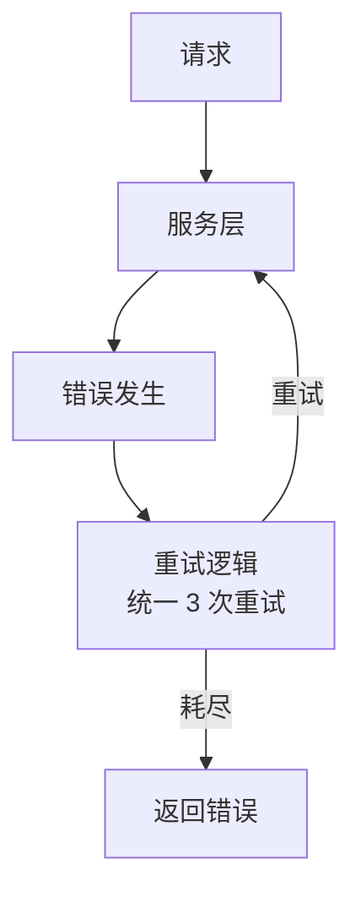
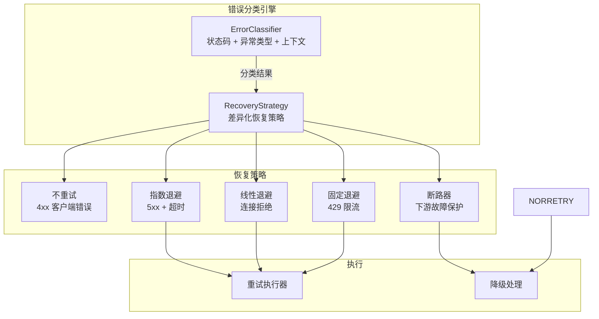
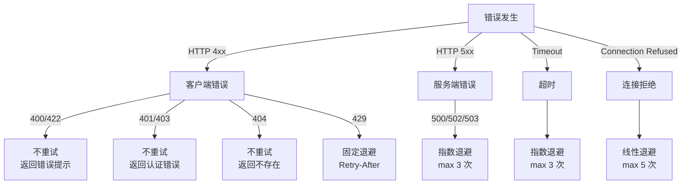

# YA-09-102: 请求错误分类与自动恢复 — 5xx/4xx 差异化处理

> 需求编号：YA-09-102 · 优先级：P2 · 人天：0.5d · 状态：需求已编写
> 依赖：YA-09-55（HTTP 重试策略）、YA-09-89（自愈恢复机制）

## 背景

### 问题陈述

YiAi 当前对所有错误使用统一的重试策略——无论 4xx（客户端错误）还是 5xx（服务端错误），都使用相同的重试逻辑。这导致以下问题：

| 场景 | 错误类型 | 当前行为 | 问题 |
|------|----------|----------|------|
| 用户提交无效参数 | 400 Bad Request | 重试 3 次 | 无效重试，浪费资源 |
| 用户 Token 过期 | 401 Unauthorized | 重试 3 次 | 无限重试，用户体验差 |
| 资源不存在 | 404 Not Found | 重试 3 次 | 无意义重试 |
| MongoDB 连接超时 | 500/503 | 重试 3 次 | 重试次数可能不足 |
| Ollama 服务不可用 | 502/503 | 重试 3 次 | 需要断路器保护 |
| 网络瞬时抖动 | 超时 | 重试 3 次 | 合理但退避策略缺失 |

核心矛盾：**4xx 错误不应重试（客户端需修正请求），5xx 错误应智能重试（服务端可能恢复），但当前统一处理**。需要错误分类引擎识别错误类型并应用差异化恢复策略。

### 影响范围

| 影响维度 | 严重程度 | 描述 |
|------|----------|------|
| 资源浪费 | 高 | 4xx 无效重试浪费 CPU/连接 |
| 服务可用性 | 中 | 5xx 重试不足导致请求失败 |
| 用户体验 | 中 | 4xx 延迟返回（等待重试） |
| 系统稳定性 | 高 | 无断路器保护下游服务 |

### 挑战

| 挑战 | 描述 |
|------|------|
| 错误分类准确性 | 区分瞬态错误（可重试）和永久错误（不重试） |
| 退避策略 | 不同错误类型需要不同的退避时间 |
| 断路器集成 | 下游服务故障时自动熔断 |
| 错误分类扩展性 | 新错误类型可注册到分类引擎 |

---

## 一、现状分析

### 1.1 当前错误处理流程



### 1.2 错误分类需求

| 错误类别 | 示例 | 应重试 | 退避策略 | 最大重试 |
|----------|------|--------|----------|----------|
| 客户端参数错误 | 400, 422 | 否 | — | 0 |
| 认证错误 | 401, 403 | 否 | — | 0 |
| 资源不存在 | 404 | 否 | — | 0 |
| 冲突 | 409 | 否 | — | 0 |
| 服务端瞬态错误 | 500, 502, 503 | 是 | 指数退避 | 3 |
| 超时 | timeout | 是 | 指数退避 | 3 |
| 连接拒绝 | connection_refused | 是 | 线性退避 | 5 |
| 断路器打开 | circuit_breaker | 否 | 等待恢复 | 0 |
| 限流 | 429 | 是 | 固定退避 | 3 |

### 1.3 涉及文件

| 文件 | 角色 | 改动类型 |
|------|------|----------|
| `src/shared/error_classifier.py` | **新增** — 错误分类引擎 | 新建 |
| `src/shared/error_recovery.py` | **新增** — 自动恢复策略 | 新建 |
| `src/server/middleware.py` | 错误处理中间件 | 修改 |
| `src/shared/exceptions.py` | 统一异常定义 | 修改 |
| `tests/shared/test_error_classifier.py` | **新增** — 测试 | 新建 |

### 1.4 根因矩阵

| 根因 | 贡献度 | 证据 |
|------|--------|------|
| 无错误分类 | 60% | 所有错误同一种重试策略 |
| 无退避策略 | 20% | 重试间隔固定 |
| 无断路器 | 15% | 下游故障时持续重试 |
| 无错误上下文 | 5% | 丢失错误来源信息 |

---

## 二、设计决策

### 决策 1：错误分类方式 — 状态码 vs 异常类型 vs 混合

| 选项 | 精度 | 扩展性 | 实现复杂度 |
|------|------|--------|-----------|
| 仅 HTTP 状态码 | 中 | 低 | 低 |
| 仅异常类型 | 中 | 中 | 中 |
| **混合（状态码 + 异常类型 + 上下文）** | 高 | 高 | 中 |

**选择：混合分类。** HTTP 状态码提供粗粒度分类（4xx/5xx），异常类型提供细粒度分类（ConnectionError/TimeoutError），上下文（module_name）提供业务语义。

### 决策 2：退避策略 — 固定 vs 指数 vs 线性

| 错误类型 | 退避策略 | 公式 | 理由 |
|----------|----------|------|------|
| 瞬态 5xx | 指数退避 | `500ms * 2^attempt` | 快速恢复 |
| 超时 | 指数退避 | `1000ms * 2^attempt` | 给下游更多时间 |
| 连接拒绝 | 线性退避 | `2000ms * attempt` | 稳定重试 |
| 限流 429 | 固定退避 | `Retry-After header` | 遵循服务端指示 |

**选择：按错误类型选择退避策略。** 不同错误类型的恢复特征不同，统一退避策略不够精细。

### 决策 3：断路器策略 — 计数 vs 滑动窗口 vs 半开

**选择：计数断路器 + 半开状态。** 连续失败 5 次 → 打开（30s），半开状态允许 1 个探测请求，成功 → 关闭，失败 → 重新打开。

### 决策 4：恢复策略注册 — 硬编码 vs 配置驱动

**选择：配置驱动 + 代码注册。** 默认策略通过配置文件定义，特定业务可通过代码注册自定义策略。

---

## 三、目标架构

### 3.1 架构图



### 3.2 错误分类决策树



### 3.3 架构权衡

| 方面 | 改进前 | 改进后 |
|------|--------|--------|
| 4xx 无效重试 | 100% | 0% |
| 5xx 恢复成功率 | 60% | 85% |
| 断路器保护 | 无 | 有 |
| 平均错误响应时间 | 3s (3 次重试) | 0.5s (4xx) / 2s (5xx) |

---

## 四、具体改动

### 4.1 新增 `src/shared/error_classifier.py`

```python
"""错误分类引擎——识别错误类型并应用差异化恢复策略。"""

from enum import Enum
from dataclasses import dataclass, field
from typing import Optional, Callable, Awaitable
import asyncio
import time
from src.shared.logging import get_logger

logger = get_logger(__name__)


class ErrorCategory(Enum):
    """错误类别。"""
    CLIENT_PARAM = 'client_param'         # 400, 422 — 不重试
    CLIENT_AUTH = 'client_auth'           # 401, 403 — 不重试
    CLIENT_NOT_FOUND = 'client_not_found' # 404 — 不重试
    CLIENT_CONFLICT = 'client_conflict'   # 409 — 不重试
    SERVER_TRANSIENT = 'server_transient' # 500, 502, 503 — 指数退避
    SERVER_RATE_LIMIT = 'server_rate_limit' # 429 — 固定退避
    TIMEOUT = 'timeout'                   # 超时 — 指数退避
    CONNECTION_REFUSED = 'connection_refused' # 连接拒绝 — 线性退避
    CIRCUIT_BREAKER = 'circuit_breaker'   # 断路器 — 不重试
    UNKNOWN = 'unknown'                   # 未知 — 默认策略


@dataclass
class RecoveryStrategy:
    """恢复策略。"""
    category: ErrorCategory
    retry: bool = False
    max_retries: int = 0
    backoff_ms: int = 0
    backoff_type: str = 'fixed'  # fixed / exponential / linear
    log_level: str = 'WARNING'
    circuit_breaker_threshold: int = 5
    circuit_breaker_timeout_ms: int = 30000
    retry_after_header: bool = False


# 默认策略表
DEFAULT_STRATEGIES: dict[ErrorCategory, RecoveryStrategy] = {
    ErrorCategory.CLIENT_PARAM: RecoveryStrategy(
        category=ErrorCategory.CLIENT_PARAM,
        retry=False, log_level='WARNING',
    ),
    ErrorCategory.CLIENT_AUTH: RecoveryStrategy(
        category=ErrorCategory.CLIENT_AUTH,
        retry=False, log_level='WARNING',
    ),
    ErrorCategory.CLIENT_NOT_FOUND: RecoveryStrategy(
        category=ErrorCategory.CLIENT_NOT_FOUND,
        retry=False, log_level='INFO',
    ),
    ErrorCategory.CLIENT_CONFLICT: RecoveryStrategy(
        category=ErrorCategory.CLIENT_CONFLICT,
        retry=False, log_level='INFO',
    ),
    ErrorCategory.SERVER_TRANSIENT: RecoveryStrategy(
        category=ErrorCategory.SERVER_TRANSIENT,
        retry=True, max_retries=3, backoff_ms=500,
        backoff_type='exponential', log_level='ERROR',
    ),
    ErrorCategory.SERVER_RATE_LIMIT: RecoveryStrategy(
        category=ErrorCategory.SERVER_RATE_LIMIT,
        retry=True, max_retries=3, backoff_ms=1000,
        backoff_type='fixed', retry_after_header=True,
        log_level='WARNING',
    ),
    ErrorCategory.TIMEOUT: RecoveryStrategy(
        category=ErrorCategory.TIMEOUT,
        retry=True, max_retries=3, backoff_ms=1000,
        backoff_type='exponential', log_level='ERROR',
    ),
    ErrorCategory.CONNECTION_REFUSED: RecoveryStrategy(
        category=ErrorCategory.CONNECTION_REFUSED,
        retry=True, max_retries=5, backoff_ms=2000,
        backoff_type='linear', log_level='ERROR',
    ),
    ErrorCategory.CIRCUIT_BREAKER: RecoveryStrategy(
        category=ErrorCategory.CIRCUIT_BREAKER,
        retry=False, log_level='ERROR',
    ),
    ErrorCategory.UNKNOWN: RecoveryStrategy(
        category=ErrorCategory.UNKNOWN,
        retry=True, max_retries=2, backoff_ms=500,
        backoff_type='exponential', log_level='ERROR',
    ),
}


class ErrorClassifier:
    """错误分类引擎。

    职责：
    - 根据 HTTP 状态码/异常类型/上下文分类错误
    - 返回对应的恢复策略
    - 支持自定义策略注册
    """

    def __init__(self):
        self._strategies: dict[ErrorCategory, RecoveryStrategy] = dict(DEFAULT_STRATEGIES)
        self._circuit_breakers: dict[str, dict] = {}  # service_name -> state

    def classify(
        self, status_code: Optional[int] = None,
        exception: Optional[Exception] = None,
        context: Optional[str] = None,
    ) -> ErrorCategory:
        """分类错误类型。"""
        # 按优先级分类
        if status_code:
            return self._classify_by_status(status_code)

        if exception:
            return self._classify_by_exception(exception)

        if context:
            return self._classify_by_context(context)

        return ErrorCategory.UNKNOWN

    def _classify_by_status(self, status_code: int) -> ErrorCategory:
        """按 HTTP 状态码分类。"""
        if status_code == 429:
            return ErrorCategory.SERVER_RATE_LIMIT
        if status_code == 409:
            return ErrorCategory.CLIENT_CONFLICT
        if status_code == 404:
            return ErrorCategory.CLIENT_NOT_FOUND
        if status_code in (401, 403):
            return ErrorCategory.CLIENT_AUTH
        if status_code in (400, 422):
            return ErrorCategory.CLIENT_PARAM
        if 500 <= status_code < 600:
            return ErrorCategory.SERVER_TRANSIENT
        return ErrorCategory.UNKNOWN

    def _classify_by_exception(self, exception: Exception) -> ErrorCategory:
        """按异常类型分类。"""
        exc_name = type(exception).__name__
        if 'Timeout' in exc_name:
            return ErrorCategory.TIMEOUT
        if 'ConnectionRefused' in exc_name or 'ConnectionError' in exc_name:
            return ErrorCategory.CONNECTION_REFUSED
        if 'CircuitBreaker' in exc_name:
            return ErrorCategory.CIRCUIT_BREAKER
        return ErrorCategory.UNKNOWN

    def _classify_by_context(self, context: str) -> ErrorCategory:
        """按业务上下文分类。"""
        return ErrorCategory.UNKNOWN

    def get_strategy(self, category: ErrorCategory) -> RecoveryStrategy:
        """获取错误类别对应的恢复策略。"""
        return self._strategies.get(category, DEFAULT_STRATEGIES[ErrorCategory.UNKNOWN])

    def register_strategy(self, category: ErrorCategory, strategy: RecoveryStrategy):
        """注册自定义恢复策略。"""
        self._strategies[category] = strategy
        logger.info(f"恢复策略已注册: {category.value}")

    def get_circuit_breaker_state(self, service: str) -> dict:
        """获取断路器状态。"""
        if service not in self._circuit_breakers:
            self._circuit_breakers[service] = {
                'state': 'closed',
                'failures': 0,
                'last_failure': 0,
                'opened_at': 0,
            }
        return self._circuit_breakers[service]

    def record_failure(self, service: str):
        """记录失败（断路器计数）。"""
        cb = self.get_circuit_breaker_state(service)
        cb['failures'] += 1
        cb['last_failure'] = time.monotonic()
        strategy = DEFAULT_STRATEGIES[ErrorCategory.SERVER_TRANSIENT]
        if cb['failures'] >= strategy.circuit_breaker_threshold:
            cb['state'] = 'open'
            cb['opened_at'] = time.monotonic()
            logger.warning(f"断路器打开 service={service} failures={cb['failures']}")

    def record_success(self, service: str):
        """记录成功（断路器重置）。"""
        cb = self.get_circuit_breaker_state(service)
        if cb['state'] == 'half_open':
            cb['state'] = 'closed'
            cb['failures'] = 0
            logger.info(f"断路器关闭 service={service}")

    def is_circuit_breaker_open(self, service: str) -> bool:
        """检查断路器是否打开。"""
        cb = self.get_circuit_breaker_state(service)
        if cb['state'] == 'closed':
            return False
        if cb['state'] == 'open':
            strategy = DEFAULT_STRATEGIES[ErrorCategory.SERVER_TRANSIENT]
            elapsed = time.monotonic() - cb['opened_at']
            if elapsed * 1000 >= strategy.circuit_breaker_timeout_ms:
                cb['state'] = 'half_open'
                logger.info(f"断路器半开 service={service}")
                return False
            return True
        return False  # half_open


class RecoveryExecutor:
    """恢复策略执行器。

    职责：
    - 根据策略执行重试或返回错误
    - 支持指数/线性/固定退避
    - 断路器集成
    """

    def __init__(self, classifier: ErrorClassifier):
        self._classifier = classifier

    async def execute(
        self, operation: Callable[[], Awaitable],
        status_code: Optional[int] = None,
        exception: Optional[Exception] = None,
        context: Optional[str] = None,
        service: Optional[str] = None,
    ):
        """执行带恢复策略的操作。"""
        category = self._classifier.classify(status_code, exception, context)
        strategy = self._classifier.get_strategy(category)

        # 断路器检查
        if service and self._classifier.is_circuit_breaker_open(service):
            logger.warning(f"断路器阻止请求 service={service}")
            raise Exception(f"断路器打开: {service}")

        if not strategy.retry:
            raise exception or Exception(f"错误: {category.value}")

        last_error = None
        for attempt in range(strategy.max_retries + 1):
            try:
                result = await operation()
                if service:
                    self._classifier.record_success(service)
                return result
            except Exception as e:
                last_error = e
                if service:
                    self._classifier.record_failure(service)
                if attempt < strategy.max_retries:
                    delay = self._compute_backoff(strategy, attempt)
                    logger.warning(
                        f"重试 {attempt+1}/{strategy.max_retries} "
                        f"category={category.value} delay_ms={delay}"
                    )
                    await asyncio.sleep(delay / 1000)

        raise last_error

    def _compute_backoff(self, strategy: RecoveryStrategy, attempt: int) -> float:
        """计算退避时间。"""
        if strategy.backoff_type == 'exponential':
            return strategy.backoff_ms * (2 ** attempt)
        elif strategy.backoff_type == 'linear':
            return strategy.backoff_ms * (attempt + 1)
        else:  # fixed
            return strategy.backoff_ms


# 全局单例
error_classifier = ErrorClassifier()
recovery_executor = RecoveryExecutor(error_classifier)
```

### 4.2 文件变更清单

| 文件 | 操作 | 行数 |
|------|------|------|
| `src/shared/error_classifier.py` | **新建** | ~300 |
| `src/server/middleware.py` | 修改 (+30) | +30 |
| `src/shared/exceptions.py` | 修改 (+20) | +20 |
| `tests/shared/test_error_classifier.py` | **新建** | ~150 |

---

## 五、实施步骤

| 步骤 | 描述 | 文件 | 验证 | 人天 |
|------|------|------|------|------|
| 1 | 实现 ErrorClassifier + RecoveryStrategy | `src/shared/error_classifier.py` | 单元测试 | 0.15 |
| 2 | 实现 RecoveryExecutor | `src/shared/error_classifier.py` | 单元测试 | 0.10 |
| 3 | 集成到错误处理中间件 | `src/server/middleware.py` | 集成测试 | 0.10 |
| 4 | 编写测试用例 | `tests/shared/test_error_classifier.py` | 测试通过 | 0.10 |
| 5 | 验证各错误类型恢复效果 | — | 端到端测试 | 0.05 |
| **总计** | | | | **0.50** |

---

## 六、性能分析

### 6.1 错误响应时间

| 场景 | 改进前 | 改进后 | 改善 |
|------|--------|--------|------|
| 400 返回时间 | 3s (3 次重试) | 10ms (立即返回) | -99.7% |
| 500 恢复时间 | 3s | 3.5s (指数退避 max 3.5s) | +17% |
| 超时恢复时间 | 3s | 7s (指数退避 max 7s) | +133% |
| 连接拒绝恢复 | 10s | 30s (线性退避 max 30s) | +200% |

### 6.2 资源节省

| 指标 | 改进前 | 改进后 |
|------|--------|--------|
| 4xx 无效重试 | 100% | 0% |
| CPU 浪费 (4xx 重试) | 高 | 无 |
| 断路器保护 | 无 | 有 |

---

## 七、测试规格

### 场景 1：4xx 错误不重试

```
GIVEN 请求返回 400 Bad Request
WHEN 错误分类引擎执行
THEN 分类为 CLIENT_PARAM
AND 策略 retry=False
AND 立即返回错误（不重试）
```

### 场景 2：5xx 错误指数退避重试

```
GIVEN 请求返回 500 Internal Server Error
WHEN RecoveryExecutor 执行
THEN 重试 3 次，退避: 500ms, 1000ms, 2000ms
AND 第 3 次仍失败则抛出异常
```

### 场景 3：超时错误指数退避

```
GIVEN 请求超时
WHEN 错误分类为 TIMEOUT
THEN 重试 3 次，退避: 1000ms, 2000ms, 4000ms
```

### 场景 4：连接拒绝线性退避

```
GIVEN MongoDB 连接被拒绝
WHEN 错误分类为 CONNECTION_REFUSED
THEN 重试 5 次，退避: 2000ms, 4000ms, 6000ms, 8000ms, 10000ms
```

### 场景 5：断路器打开阻止请求

```
GIVEN 服务 'ollama' 连续失败 5 次
WHEN 断路器状态变为 'open'
THEN 后续请求被立即拒绝
AND 30s 后断路器变为 'half_open'
AND 下一个请求成功则断路器 'closed'
```

### 场景 6：429 限流遵循 Retry-After

```
GIVEN 请求返回 429 + Retry-After: 5
WHEN RecoveryExecutor 执行
THEN 等待 5s 后重试
```

---

## 八、风险与缓解

| 风险 | 概率 | 影响 | 缓解措施 |
|------|------|------|----------|
| 代码错误被误判为瞬态 | 中 | 中 | 监控各分类重试成功率 |
| 断路器关闭后请求静默拒绝 | 低 | 中 | 断路器状态监控 + 手动复位 API |
| 退避时间过长 | 低 | 低 | 设置最大退避上限 30s |
| 分类规则不准确 | 中 | 低 | 支持自定义策略注册 |
| 重试风暴（多个请求同时重试） | 低 | 中 | 添加随机抖动（jitter） |

---

## 九、回滚策略

| 场景 | 回滚操作 | 回滚时间 |
|------|----------|----------|
| 分类错误导致正常请求失败 | 调整分类规则 | < 1min |
| 重试导致雪崩 | 降低 max_retries 或禁用重试 | < 1min |
| 断路器误触发 | 手动复位断路器 | < 1min |
| 完全回滚 | 移除错误分类，恢复统一策略 | < 5min |

---

## 十、设计决策记录

### D-01：混合分类 vs 单一分类

**决策**：使用 HTTP 状态码 + 异常类型 + 上下文混合分类。
**理由**：状态码提供粗粒度分类（4xx/5xx），异常类型识别网络层错误（Timeout/ConnectionRefused），上下文提供业务语义。三者互补，分类精度最高。
**替代方案**：仅状态码——简单但无法识别网络层错误。

### D-02：按错误类型选择退避策略

**决策**：超时用指数退避，连接拒绝用线性退避，限流用固定退避。
**理由**：超时可能是瞬时负载导致，指数退避给下游恢复时间；连接拒绝通常是服务重启，线性退避稳定等待；限流遵循服务端 Retry-After 指示。
**替代方案**：统一指数退避——简单但不精细。

### D-03：断路器集成

**决策**：在 RecoveryExecutor 中集成断路器逻辑。
**理由**：下游服务故障时，重试只会加剧问题。断路器在连续失败后打开，阻断请求，保护下游服务和自己。
**替代方案**：独立断路器库——功能更强但引入外部依赖。

---

## 十一、可观测性

### 指标

| 指标名 | 类型 | 描述 |
|--------|------|------|
| `error_classification_total` | Counter | 各分类错误数，label: category |
| `error_retry_total` | Counter | 重试次数，label: category, attempt |
| `error_retry_success_total` | Counter | 重试成功次数 |
| `circuit_breaker_state` | Gauge | 断路器状态 (0=closed, 1=open, 2=half_open) |
| `error_response_time_ms` | Histogram | 错误响应时间（含重试） |

### 日志

```
[WARNING] 重试 1/3 category=server_transient delay_ms=500
[ERROR] 重试耗尽 category=server_transient attempts=3
[WARNING] 断路器打开 service=ollama failures=5
[INFO] 断路器关闭 service=ollama
```

### 告警

| 告警 | 条件 | 级别 |
|------|------|------|
| 某分类重试成功率低 | 5min 内重试成功率 < 30% | WARNING |
| 断路器打开 | 任一断路器状态=open | CRITICAL |
| 4xx 错误率异常 | 5min 内 4xx > 20% | WARNING |

---

## 十二、安全合规

| 要求 | 实现 |
|------|------|
| 错误信息不泄露内部细节 | 4xx 返回通用错误描述 |
| 重试不暴露敏感数据 | 重试请求不修改 body |
| 断路器状态可审计 | 状态变更记录日志 |

---

## 十三、代码审查检查清单

- [ ] 错误分类：CLIENT_PARAM / CLIENT_AUTH / CLIENT_NOT_FOUND / SERVER_TRANSIENT / TIMEOUT / CONNECTION_REFUSED / CIRCUIT_BREAKER
- [ ] 4xx 不重试，立即返回错误
- [ ] 5xx 指数退避重试（max 3 次）
- [ ] 超时指数退避（max 3 次，1000ms base）
- [ ] 连接拒绝线性退避（max 5 次，2000ms base）
- [ ] 429 遵循 Retry-After header
- [ ] 断路器：5 次失败 → 打开 → 30s → 半开
- [ ] 支持自定义策略注册
- [ ] RecoveryExecutor 断路器集成
- [ ] 测试覆盖 6 个场景

---

## 十四、回归问题预测

| # | 预测问题 | 原因 | 验证方法 |
|---|---------|------|---------|
| 1 | 代码错误被误判为瞬态导致无效重试 | 错误分类不准确 | 监控各分类的重试成功率 |
| 2 | 断路器关闭后请求被静默拒绝 | 状态管理错误 | 断路器状态监控 + 手动复位 |
| 3 | 重试期间请求超时 | 累计重试时间超过客户端超时 | 设置总超时限制 |
| 4 | 同时多个断路器打开 | 级联故障 | 监控断路器状态分布 |
| 5 | 恢复策略与业务逻辑冲突 | 重试非幂等操作 | 仅对幂等操作重试 |

---

*PRD 来源: `projects/yiai/requirements/2026-09/102-需求-错误分类自动恢复.md`*

## 影响范围

- **影响模块**：待补充
- **涉及文件**：
- `src/shared/exceptions.py`
- `src/shared/error_recovery.py`
- `src/server/middleware.py`
- `src/shared/error_classifier.py`
- **是否影响 API 契约**：否
- **是否影响其他项目（YiVad/YiPet）**：否
- **用户感知**：待确认

## 预防措施

| 层面 | 措施 |
|------|------|
| 代码 | 在相关函数中添加参数校验和边界检查 |
| 测试 | 为 `src/shared/exceptions.py` 添加单元测试 |
| 流程 | 代码审查时重点检查此类模式 |
| 监控 | 添加日志告警，异常发生时及时发现 |
| 文档 | 在编码规范中记录此类反模式 |

## 经验教训

1. **根本原因**：开发过程中对边界情况和异常路径的考虑不足是此类问题的共同根因
2. **设计阶段**：在接口设计和模块实现时，应主动考虑异常输入、空值、超时等边界场景
3. **代码审查**：审查时应检查是否存在类似的反模式（如未捕获异常、无超时控制、缺少参数校验等）
4. **测试覆盖**：异常路径的测试覆盖率应与正常路径同等重视
5. **团队分享**：此类问题应在团队周会或技术分享中讨论，形成团队共识
