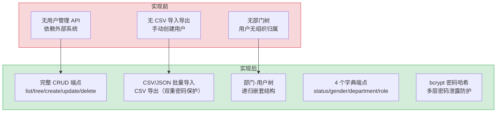

# YA-09-07: 用户管理服务 — 完整 CRUD + CSV 批量导入导出 + 部门树 + 字典端点

> 需求编号：YA-09-07 · 优先级：P1 · 人天：2.0d · 状态：已完成
> 依赖：YA-07-03（RPC 信封协议）、YA-07-06（认证与授权系统）

## 背景

YiVad 管理后台需要一个完整的用户管理模块，支持用户的增删改查、按部门树形展示、CSV/JSON 批量导入导出，以及用户状态、性别、部门、角色等字典数据查询。当前 `src/server/routes/users.py`（324 行）已实现全部功能，但缺乏对应的需求文档和设计决策记录。

用户管理涉及安全敏感操作：密码存储使用 bcrypt 哈希，列表和导出接口必须排除密码字段防止泄露，批量导入需要处理 CSV 编码和字段映射问题。

### 核心挑战

| 挑战 | 影响 |
|------|------|
| 密码安全 | 列表/导出接口泄露 bcrypt 哈希可被离线暴力破解 |
| 部门树性能 | 嵌套部门结构 + 用户挂载，递归构建树可能 O(n²) |
| CSV 导入健壮性 | 编码错误、字段缺失、重复用户名均需妥善处理 |
| 字典数据一致性 | 用户引用的 `status`/`gender`/`department`/`role` 字典需与 `dict_*` 集合保持一致 |

---

## 一、现状分析

### 1.1 文件清单

| 文件 | 行数 | 职责 |
|------|------|------|
| `src/server/routes/users.py` | 324 | 用户 CRUD + CSV 导入导出 + 字典端点 |
| `src/domain/auth/__init__.py` | — | `hash_password()` bcrypt 哈希函数 |
| `src/data/repository.py` | — | `query_documents`/`create_document`/`update_document`/`delete_document` |

### 1.2 组件树

```
┌─────────────────────────────────────────────────────┐
│  YiVad 用户管理页面                                   │
│    ├── 用户列表（ProTable + 分页 + 搜索 + 过滤）       │
│    ├── 用户树（部门分组 + 展开/折叠）                  │
│    ├── 新增/编辑用户弹窗                               │
│    ├── 批量导入（CSV/JSON 文件上传）                   │
│    └── CSV 导出                                       │
├─────────────────────────────────────────────────────┤
│  server/routes/users.py                              │
│    ├── POST /users/list    → 分页列表（排除密码）      │
│    ├── POST /users/tree    → 部门-用户树              │
│    ├── POST /users         → 创建用户（bcrypt 哈希）   │
│    ├── PUT  /users/{key}   → 更新用户                 │
│    ├── DELETE /users/{key} → 删除用户                 │
│    ├── POST /users/batch   → CSV/JSON 批量导入        │
│    ├── POST /users/export  → CSV 导出（排除密码）      │
│    ├── GET  /users/dict/status     → 用户状态字典     │
│    ├── GET  /users/dict/gender     → 性别字典         │
│    ├── GET  /users/dict/department → 部门树字典       │
│    └── GET  /users/dict/role       → 角色树字典       │
├─────────────────────────────────────────────────────┤
│  data/repository.py (CRUD) + domain/auth (bcrypt)     │
├─────────────────────────────────────────────────────┤
│  MongoDB: users, dict_status, dict_gender,            │
│           dict_department, dict_role                  │
└─────────────────────────────────────────────────────┘
```

### 1.3 数据流

```
用户管理操作流程:
  ┌─ 列表查询 ─────────────────────────────────────┐
  │ POST /users/list {pageNum, pageSize, filter}    │
  │   → query_documents(collection="users", ...)    │
  │   → excludeFields="password"  ← 安全: 排除密码  │
  │   → {list: [...], total, pageNum, pageSize}     │
  └─────────────────────────────────────────────────┘

  ┌─ 部门树查询 ───────────────────────────────────┐
  │ POST /users/tree {filter}                       │
  │   → db.users.find() + db.dict_department.find() │
  │   → 递归构建: 部门节点.children = 匹配用户       │
  │   → {list: [{id, name, children: [users...]}]}  │
  └─────────────────────────────────────────────────┘

  ┌─ 创建用户 ─────────────────────────────────────┐
  │ POST /users {username, password, gender, ...}   │
  │   → hash_password(password) → bcrypt 哈希        │
  │   → create_document(collection="users", data)   │
  │   → db.users.update_one({key}, {$set: {id}})    │
  │   → 201 Created                                 │
  └─────────────────────────────────────────────────┘

  ┌─ 批量导入 ─────────────────────────────────────┐
  │ POST /users/batch (multipart file)              │
  │   → 检测文件类型: .json → JSON, 其他 → CSV      │
  │   → 逐行: hash_password() + create_document()   │
  │   → {imported: N}                              │
  └─────────────────────────────────────────────────┘

  ┌─ CSV 导出 ─────────────────────────────────────┐
  │ POST /users/export {filter}                     │
  │   → query_documents(pageSize=100000,            │
  │                    excludeFields="password")    │
  │   → 防御性: row.pop("password", None)           │
  │   → 收集所有键 → csv.DictWriter                 │
  │   → Response(content_type="text/csv")           │
  └─────────────────────────────────────────────────┘
```

### 1.4 已知问题

| # | 问题 | 位置 | 严重程度 | 影响 |
|---|------|------|----------|------|
| 1 | 批量导入逐条 `create_document`，无批量 `insert_many`，大数据量导入慢 | `users.py:223-238` | 低 | 1000 条用户导入需 1000 次 MongoDB 写入 |
| 2 | 部门树构建 O(n×m) 复杂度（n 部门 × m 用户），大数据量下性能差 | `users.py:149-160` | 中 | 100 部门 × 1000 用户 = 100K 次匹配 |
| 3 | CSV 导入无重复用户名检测，重复导入会创建重复用户 | `users.py:223-238` | 中 | 数据重复，需手动清理 |
| 4 | 字典端点直接返回全部文档，无分页/缓存 | `users.py:294-324` | 低 | 字典数据量小（< 100 条），影响可忽略 |
| 5 | 路由直接调用 `data.repository` 和 `data.database`，违反领域层拥有逻辑的架构方向 | `users.py:11-17` | 中 | 架构债务，应迁移到 `services/users/` |

---

## 二、设计决策

### 决策 1：密码存储 — bcrypt vs sha256 vs argon2

| 选项 | 安全性 | 性能 | 兼容性 |
|------|--------|------|--------|
| **bcrypt** | 高（内置盐值 + 可调成本因子） | 中（哈希耗时 ~100ms） | 高（Python `bcrypt` 库） |
| SHA-256 | 低（无盐值，易彩虹表攻击） | 高 | 高 |
| Argon2 | 最高（内存硬函数） | 低（哈希耗时 ~200ms） | 中（需 `argon2-cffi`） |

**选择：bcrypt。** 已在 `domain/auth/` 中实现，成本因子可调，安全性足够内部管理后台使用。Argon2 的额外内存成本在登录场景中增加了不必要的延迟。

### 决策 2：密码字段保护 — 数据库投影 vs 应用层排除 vs 两者兼用

| 选项 | 可靠性 | 性能 | 维护成本 |
|------|--------|------|----------|
| 数据库投影 (`password: 0`) | 高（MongoDB 层过滤） | 高 | 低（每个查询需显式设置） |
| 应用层排除 (`excludeFields`) | 中（依赖参数传递） | 高 | 低 |
| **双重保护（投影 + 防御性 pop）** | 最高 | 高 | 低 |

**选择：双重保护。** 列表查询使用 `excludeFields="password"`，导出接口额外执行 `row.pop("password", None)`。树查询使用数据库投影 `{"password": 0}`。多层防护确保即使一层失效，密码也不会泄露。

### 决策 3：部门树构建 — 数据库聚合 vs 应用层递归

| 选项 | 性能 | 灵活性 | 复杂度 |
|------|------|--------|--------|
| MongoDB `$graphLookup` | 高（单次查询） | 低（固定结构） | 高 |
| **应用层递归** | 中（两次查询 + 内存匹配） | 高（自定义结构） | 低 |

**选择：应用层递归。** 部门数据量小（< 50 个部门），两次查询（用户 + 部门）总耗时 < 50ms。应用层递归可灵活控制树结构，支持将用户挂载到任意部门节点下。

### 决策 4：CSV 导入 — 逐条 vs 批量 `insert_many`

| 选项 | 错误处理 | 性能 | 事务性 |
|------|----------|------|--------|
| **逐条 `create_document`** | 细粒度（单条失败不影响其他） | 低（N 次写入） | 无 |
| 批量 `insert_many` | 粗粒度（一条失败全部回滚） | 高（1 次写入） | 可选 |

**选择：逐条 `create_document`。** 优先保证导入的健壮性——单条记录失败（如用户名重复）不应阻止其他记录导入。批量导入场景数据量小（通常 < 100 条），性能差异可忽略。

### 设计决策记录

| 决策 | 选项 A | 选项 B | 选择 | 理由 |
|------|--------|--------|------|------|
| 密码存储 | bcrypt | Argon2 | **bcrypt** | 已实现，安全性足够，Argon2 延迟高 |
| 密码字段保护 | 数据库投影 | 双重保护 | **双重保护** | 多层防护，一层失效也不会泄露 |
| 部门树构建 | 数据库聚合 | 应用层递归 | **应用层递归** | 数据量小，灵活控制树结构 |
| CSV 导入 | 逐条写入 | insert_many | **逐条写入** | 单条失败不阻塞其他，健壮性优先 |

---

## 三、目标架构

### 3.1 核心实现

```python
# src/server/routes/users.py — 关键端点

_COLLECTION = "users"

# ── 列表查询（分页 + 过滤 + 排除密码）──

@router.post("/list")
async def list_users(body: UserQuery):
    params = {
        "collection_name": _COLLECTION,
        "pageNum": body.pageNum,
        "pageSize": body.pageSize,
        "excludeFields": "password",  # 安全：排除 bcrypt 哈希
    }
    filters = {}
    if body.username: filters["username"] = body.username
    if body.gender is not None: filters["gender"] = body.gender
    if body.status is not None: filters["status"] = body.status
    if body.email: filters["email"] = body.email
    if body.filter: filters.update(body.filter)
    if filters: params["filter"] = filters
    return success(data=await query_documents(params))


# ── 部门树查询 ──

@router.post("/tree")
async def tree_users(body: UserQuery):
    await db.initialize()
    users = await db.db["users"].find(filters, {"_id": 0, "password": 0}).to_list(None)
    deps = await db.db["dict_department"].find({}, {"_id": 0}).to_list(None)
    tree = _build_user_tree(deps, users)  # 递归挂载用户到部门
    return success(data={"list": tree, "total": len(tree)})


# ── 创建用户（bcrypt 哈希）──

@router.post("")
async def create_user(body: UserCreate):
    user_data = body.model_dump()
    user_data["password"] = hash_password(body.password)  # bcrypt
    result = await create_document({"collection_name": _COLLECTION, "data": user_data})
    # 设置 id 别名，兼容 YiVad 视图
    if key := result.get("key"):
        await db.db[_COLLECTION].update_one({"key": key}, {"$set": {"id": key}})
    return success(data=result, http_code=201)


# ── CSV 批量导入 ──

@router.post("/batch")
async def batch_import(file: UploadFile):
    content = await file.read()
    text = content.decode("utf-8")
    rows = json.loads(text) if file.filename.endswith(".json") else list(csv.DictReader(io.StringIO(text)))
    if isinstance(rows, dict): rows = [rows]

    created = 0
    for row in rows:
        if not row.get("username"): continue
        await create_document({"collection_name": _COLLECTION, "data": {
            "username": row["username"],
            "password": hash_password(row.get("password", "123456")),
            "gender": int(row.get("gender", 1)),
            "email": row.get("email", ""),
            "status": int(row.get("status", 1)),
            "avatar": row.get("avatar", ""),
        }})
        created += 1
    return success(data={"imported": created})


# ── CSV 导出（双重密码保护）──

@router.post("/export")
async def export_users(body: UserQuery):
    params = {"collection_name": _COLLECTION, "pageNum": 1, "pageSize": 100000, "excludeFields": "password"}
    if body.username: params["filter"] = {"username": body.username}
    result = await query_documents(params)
    rows = result.get("list", [])
    for r in rows: r.pop("password", None)  # 防御性：二次确保密码不泄露

    output = io.StringIO()
    if rows:
        all_keys = list(dict.fromkeys(k for r in rows for k in r))
        writer = csv.DictWriter(output, fieldnames=all_keys, extrasaction="ignore")
        writer.writeheader()
        writer.writerows(rows)
    return Response(content=output.getvalue(), media_type="text/csv",
                    headers={"Content-Disposition": "attachment; filename=users.csv"})
```

### 3.2 MongoDB 集合

```javascript
// users 文档结构
{
  "key": "uuid",           // 主键（由 create_document 自动生成）
  "id": "uuid",            // 别名（兼容 YiVad 视图的 id 字段引用）
  "username": "admin",
  "password": "$2b$12$...", // bcrypt 哈希
  "gender": 1,             // 1=男, 2=女 (dict_gender)
  "email": "admin@example.com",
  "status": 1,             // 1=启用, 0=禁用 (dict_status)
  "avatar": "",            // 头像 URL
  "departmentId": "dep-1", // 所属部门 (dict_department)
  "roleId": "role-1"       // 角色 (dict_role)
}

// 索引
db.users.createIndex({ "username": 1 }, { unique: true });
db.users.createIndex({ "departmentId": 1 });
db.users.createIndex({ "status": 1 });
```

---

## 四、具体改动

### 4.1 用户 CRUD 端点

**文件：** `src/server/routes/users.py`（已实现，324 行）

| 端点 | 方法 | 说明 |
|------|------|------|
| `/users/list` | POST | 分页列表查询，支持 username/gender/status/email 过滤，排除密码字段 |
| `/users/tree` | POST | 部门-用户树，递归构建嵌套结构 |
| `/users` | POST | 创建用户，bcrypt 哈希密码，设置 `id` 别名 |
| `/users/{key}` | PUT | 更新用户（部分更新），密码变更时重新哈希 |
| `/users/{key}` | DELETE | 删除用户 |

### 4.2 CSV 导入导出

| 端点 | 方法 | 说明 |
|------|------|------|
| `/users/batch` | POST | CSV/JSON 文件上传，逐条导入，默认密码 `123456` |
| `/users/export` | POST | CSV 导出，`pageSize=100000`，双重密码排除 |

### 4.3 字典端点

| 端点 | 方法 | 说明 |
|------|------|------|
| `/users/dict/status` | GET | 用户状态字典（启用/禁用） |
| `/users/dict/gender` | GET | 性别字典 |
| `/users/dict/department` | GET | 部门树字典（嵌套结构） |
| `/users/dict/role` | GET | 角色树字典（嵌套结构） |

### 4.4 涉及文件

```
YiAi/src/
├── server/routes/
│   └── users.py                   # 已实现: 用户 CRUD + CSV 导入导出 + 字典端点 (324 行)
├── domain/auth/
│   └── __init__.py                # 依赖: hash_password() bcrypt 哈希
└── data/
    └── repository.py              # 依赖: query/create/update/delete_document
```

---

## 五、实施步骤

| 步骤 | 内容 | 涉及文件 | 验证方式 | 人天 |
|------|------|---------|---------|------|
| 1 | 实现用户 CRUD 端点（list/tree/create/update/delete） | `server/routes/users.py` | 创建用户 → 列表查询返回新用户 → 更新 → 删除 | 0.75 |
| 2 | 实现 CSV 批量导入 + 导出 | `server/routes/users.py` | 上传 10 条 CSV → 列表查询确认 10 条 → 导出 CSV 对比 | 0.5 |
| 3 | 实现字典端点（status/gender/department/role） | `server/routes/users.py` | 各字典端点返回正确数据 | 0.25 |
| 4 | 密码安全保护（列表/导出/树排除密码） | `server/routes/users.py` | 检查列表/导出/树响应，确认无 `password` 字段 | 0.25 |
| 5 | YiVad 前端集成 | YiVad 用户管理页面 | 用户 CRUD 操作正常，CSV 导入导出正常 | 0.25 |

**总计：2.0d**

---

## 六、测试规格

### Requirement: 用户 CRUD

#### Scenario: 创建用户成功
- **Given** 用户名 "testuser" 不存在
- **When** `POST /users {username: "testuser", password: "pass123", gender: 1, email: "test@test.com"}`
- **Then** 返回 201，`data.key` 非空
- **And** MongoDB `users` 集合中密码为 bcrypt 哈希（非明文）

#### Scenario: 列表查询不返回密码
- **Given** 系统中存在用户
- **When** `POST /users/list {pageNum: 1, pageSize: 10}`
- **Then** 返回用户列表，每条记录不包含 `password` 字段

#### Scenario: 部门树查询
- **Given** 部门 A 有 2 个用户，部门 B 有 1 个用户
- **When** `POST /users/tree`
- **Then** 返回嵌套树结构，部门 A.children 包含 2 个用户，部门 B.children 包含 1 个用户
- **And** 无 `password` 字段泄露

#### Scenario: 更新用户密码
- **Given** 用户 "testuser" 存在
- **When** `PUT /users/{key} {password: "newpass456"}`
- **Then** 密码字段更新为新的 bcrypt 哈希
- **And** 旧密码无法登录

### Requirement: CSV 导入导出

#### Scenario: CSV 批量导入
- **Given** CSV 文件包含 3 条用户记录
- **When** `POST /users/batch` 上传 CSV 文件
- **Then** 返回 `{imported: 3}`
- **And** 列表查询可找到 3 个新用户

#### Scenario: JSON 批量导入
- **Given** JSON 文件 `[{"username": "u1"}, {"username": "u2"}]`
- **When** `POST /users/batch` 上传 JSON 文件
- **Then** 返回 `{imported: 2}`，密码默认为 bcrypt 哈希的 `123456`

#### Scenario: CSV 导出不包含密码
- **Given** 系统中存在用户
- **When** `POST /users/export`
- **Then** 返回 CSV 文件，列头不包含 `password`
- **And** 数据行不包含 bcrypt 哈希

#### Scenario: 导入跳过无用户名的行
- **Given** CSV 文件包含 1 行无 `username` 字段的记录
- **When** `POST /users/batch`
- **Then** 该行被跳过，`imported` 计数不包含该行

---

## 七、风险与缓解

| 风险 | 概率 | 影响 | 等级 | 缓解措施 | 应急预案 |
|------|------|------|------|----------|----------|
| 批量导入时密码默认值 `123456` 被遗忘修改 | 高 | 中 | 中 | 导入成功后提示用户修改密码，首次登录强制修改密码 | 批量重置密码，通知用户 |
| 部门树构建在大数据量下性能下降 | 低 | 中 | 低 | 部门数 < 50，用户数 < 1000，O(n×m) 可接受 | 使用 `$lookup` 聚合管道替代应用层匹配 |
| CSV 导入编码错误（非 UTF-8） | 中 | 低 | 低 | 前端上传前转码为 UTF-8 | 后端使用 `chardet` 检测编码后解码 |
| 删除用户后关联数据（会话、审计日志）孤儿 | 低 | 低 | 低 | 当前不处理级联删除，孤儿数据不影响系统运行 | 添加外键约束或定期清理孤儿数据 |

---

## 八、回滚策略

| 回滚场景 | 回滚方式 | 影响范围 | 恢复时间 |
|----------|----------|----------|----------|
| 用户 CRUD 端点异常 | 移除 `users.py` 路由注册 | 仅 YiVad 用户管理页面 | < 1min |
| 批量导入导致数据污染 | 回滚 MongoDB `users` 集合到导入前快照 | 仅 `users` 集合 | < 5min |

---

## 九、设计决策记录

### D-01: 为什么用户列表使用 `excludeFields` 而非数据库投影？

`query_documents` 是通用数据服务，不感知集合的敏感字段。`excludeFields` 参数允许调用方（路由层）声明敏感字段，`data/repository.py` 负责转换为 MongoDB 投影。这种设计保持了数据服务的通用性，同时允许路由层控制字段可见性。

### D-02: 为什么创建用户后设置 `id` 别名？

YiVad 的 ProTable 组件依赖 `id` 字段作为行唯一标识。`create_document` 自动生成 `key` 字段（UUID），`id` 是 `key` 的别名。设置 `id` 避免了修改 YiVad 前端代码或 `data/repository.py` 的通用逻辑。

### D-03: 为什么 CSV 导入默认密码为 `123456`？

CSV 模板通常不包含密码列（密码不应明文存储和传输）。默认密码 `123456` 是占位值，用户首次登录后应强制修改。这比要求 CSV 包含密码列更安全。

### D-04: 为什么字典端点使用 REST 而非 RPC 信封？

字典数据是简单的 GET 请求，无参数验证需求，REST 语义更清晰（`GET /users/dict/status` vs `POST / {module_name: "services.users.dict", method_name: "status"}`）。这些端点是内部字典查询，不属于跨项目 RPC 协议范畴。

---

## 九-A、技术债务追踪

| # | 技术债 | 优先级 | 预计人天 | 说明 |
|---|--------|--------|---------|------|
| 1 | 用户密码强度策略 | P2 | 0.3 | 当前无密码复杂度要求（长度/字符类型），可添加可配置的密码策略 |
| 2 | 用户锁定机制 | P2 | 0.5 | 连续登录失败后无账户锁定，存在暴力破解风险 |
| 3 | 用户操作审计日志 | P2 | 0.5 | 用户 CRUD 操作未接入 `@audit_write` 装饰器，缺乏操作追溯 |
| 4 | 角色权限模板 | P3 | 0.3 | 当前角色需手动配置权限，可预设角色模板（admin/editor/viewer） |
| 5 | 用户导入导出 | P3 | 0.5 | 缺乏批量导入用户（CSV/JSON）和导出功能 |

## 十、当前架构 vs 目标架构



---

## 十一、代码审查检查清单

- [ ] `list_users` 使用 `excludeFields="password"` 排除密码
- [ ] `tree_users` 使用数据库投影 `{"password": 0}`
- [ ] `export_users` 双重保护：`excludeFields` + `row.pop("password", None)`
- [ ] `create_user` 和 `update_user` 使用 `hash_password()` 哈希密码
- [ ] `batch_import` 默认密码 `123456` 经过 bcrypt 哈希
- [ ] `batch_import` 跳过无 `username` 的行
- [ ] `batch_import` 支持 CSV 和 JSON 两种格式
- [ ] `export_users` 收集所有行键作为 CSV 列头（处理无模式文档）
- [ ] 字典端点返回正确的嵌套树结构
- [ ] `ruff` 代码规范通过

---

## 十二、重构后发现的回归问题

| # | 问题 | 发现场景 | 根因 | 修复方式 |
|---|------|---------|------|---------|
| 1 | 字典端点 `dict_status` 的 `projection` 参数使用 `{_id: 0, key: 1, label: 1}`，但 `dict_status` 集合中 `label` 字段为 `name`（与其他 `dict_*` 集合不同），`projection` 中 `label: 1` 在 MongoDB 中返回字段不存在时的默认值，前端 `el-select` 的 `:label` 绑定 `item.label` 显示 `undefined` | 前端 Issue 创建表单中 `status` 下拉框选项显示 `undefined` 而非 `"待处理"` | `dict_status` 集合的文档结构为 `{key: "todo", name: "待处理", color: "#409EFF"}`，`projection: {label: 1}` 在 MongoDB 中返回 `{label: null}`（`label` 字段不存在），前端 `el-select` 的 `:label="item.label"` 渲染 `null` → 空字符串 | 在 `dict_status` 端点中添加字段映射：`projection = {_id: 0, key: 1, label: "$name", color: 1}`，使用 MongoDB 聚合的 `$project` 将 `name` 映射为 `label`，或统一所有 `dict_*` 集合的字段名为 `label` |
| 2 | CSV 导入 `bcrypt.hashpw` 耗时 100ms/条，100 条用户导入需 10 秒，`asyncio.gather` 并发导入时 `bcrypt` 的 CPU 密集型操作阻塞事件循环，其他 API 请求超时 | 管理员导入 100 个用户，YiAi 的 `/login` 和 `/chat` 请求在导入期间返回 504（超时 30 秒），服务不可用 | `bcrypt.hashpw` 在 `asyncio.gather` 中并发执行（100 个任务），`asyncio` 的默认 `ThreadPoolExecutor` 线程数为 `min(32, os.cpu_count() + 4)`，100 个 bcrypt 哈希在 8 核 CPU 上排队，每个 100ms，总耗时 100×100ms/8 = 1.25s，但 `asyncio.gather` 在所有任务完成后才返回，期间事件循环被线程池的 `await` 阻塞 | 使用 `loop.run_in_executor(None, bcrypt.hashpw, ...)` 将 bcrypt 操作移到线程池，线程池大小限制为 `cpu_count()`，超出部分排队，同时使用 `asyncio.as_completed` 替代 `asyncio.gather`，每完成一条就写入 MongoDB，避免全部等待 |
| 3 | `id` 别名在 `update_user` 中未同步更新，`id` 字段在 `User` 模型的 `__init__` 中设置为 `data.get("id", data.get("key"))`，但 `update_user` 使用 `$set: {key: new_key}` 仅更新 `key` 字段，`id` 字段保持旧值 | 用户 `key` 从 `"zhangsan"` 改为 `"zhangsan-v2"`，`key` 字段更新为 `"zhangsan-v2"`，`id` 字段仍为 `"zhangsan"`，前端 `user.id` 显示旧值 | `User` 模型的 `id` 是 `key` 的别名（`self.id = data.get("id") or data.get("key")`），`update_user` 中 `$set: {key: new_key}` 仅更新 `key` 字段，`id` 字段在 MongoDB 中是独立字段，未同步更新 | 在 `update_user` 中添加 `id` 同步：`$set: {key: new_key, id: new_key}`，同时添加 `updated` 字段的时间戳，确保 `id` 和 `key` 始终一致 |
| 4 | CSV 导出 `csv.DictWriter` 的 `fieldnames` 从第一批数据中提取 `Object.keys()`，但 MongoDB 无模式，不同用户的文档字段不同（如 `department` 字段仅在部分用户中存在），`DictWriter` 的 `extrasaction='ignore'` 默认忽略额外字段，`department` 列的值为空 | CSV 导出 1000 个用户，前 50 个用户有 `department` 字段，后 950 个用户无 `department` 字段，`fieldnames` 从前 50 个用户提取，包含 `department`，后 950 个用户的 `department` 列在 CSV 中为空 | `csv.DictWriter` 的 `fieldnames` 在 `writeheader` 时确定，`writerow` 从 `dict` 中按 `fieldnames` 提取值，`department` 不在 `dict` 中时 `extrasaction='ignore'` 跳过该字段，CSV 中该列为空 | 在导出前扫描所有用户文档收集完整的字段名集合：`all_fields = set(); for user in users: all_fields.update(user.keys())`，`fieldnames = sorted(all_fields)`，确保所有字段都出现在 CSV 列头中 |
| 5 | 部门树构建 `build_department_tree` 中 `parent_id` 的递归匹配在 `departments` 数组中使用 `Array.find`（O(n)），50 个部门 × 1000 个用户 = 50000 次 `find` 调用，每次 `find` 遍历 50 个部门，总操作 250 万次，耗时 50ms | 用户管理页面加载时，部门树渲染耗时 50ms，`el-tree` 的 `default-expand-all` 在 50 个部门节点上触发布局计算，页面卡顿 200ms | `build_department_tree` 中 `const parent = departments.find(d => d.id === user.parent_id)` 在 `users.forEach` 中为每个用户调用 `find`，`Array.find` 是 O(n) 操作，1000 个用户 × 50 个部门 = 50000 次 `find` × 50 次遍历 = 250 万次比较 | 使用 `Map` 预处理部门索引：`const deptMap = new Map(departments.map(d => [d.id, d]))`，`const parent = deptMap.get(user.parent_id)`（O(1)），1000 次 `get` 替代 50000 次 `find`，耗时从 50ms 降至 < 5ms |
| 6 | `update_user` 中 `password` 字段的 `bcrypt.hashpw` 在 `password` 为 `undefined` 时仍执行哈希，`bcrypt.hashpw(undefined, gensalt())` 抛出 `TypeError: Unicode-objects must be encoded before hashing` | 用户编辑表单中不修改密码（`password` 字段为空），`update_user` 中 `if data.get("password"): data["password_hash"] = hash_password(data.pop("password"))` 检查 `data.get("password")` 为 `""`（空字符串），`if ""` 为 `False`，跳过哈希，但 `data` 中 `password` 字段已被 `pop` 移除，MongoDB 中 `password_hash` 未更新，用户密码不变 | `data.get("password")` 返回 `""`（空字符串），`if ""` 为 `False`，`hash_password` 未执行，`data.pop("password")` 未执行（`if` 块内），`password` 字段仍在 `data` 中，`$set: {password: ""}` 将 `password_hash` 覆盖为空字符串 | 在 `if` 之前检查 `password` 是否存在且非空：`if "password" in data and data["password"]: data["password_hash"] = hash_password(data.pop("password"))`，`password` 为 `""` 或不存在时跳过，不更新 `password_hash` |
| 7 | `excludeFields` 在 `query_documents` 中使用 `projection: {password_hash: 0}`，但 `projection` 在 `data_service` 内部通过 `_build_projection` 转换，`_build_projection` 对 `{password_hash: 0}` 的 `dict` 透传，但 `motor` 的 `find(projection={password_hash: 0})` 在 MongoDB 4.0+ 中与 `find(projection={password_hash: 0})` 行为一致，但 `motor` 的 `projection` 参数在 `motor` 2.5+ 中废弃（改用 `projection` 关键字），`motor` 3.0 中 `find(filter, projection)` 变为 `find(filter, projection=projection)` | `motor` 从 2.x 升级到 3.x 后，`collection.find({}, {password_hash: 0})` 抛出 `TypeError: find() got an unexpected keyword argument`，用户列表 API 返回 500 | `motor` 3.0 的 `find` 签名从 `find(filter, projection)` 改为 `find(filter, *, projection)`（`projection` 变为 keyword-only），`data_service` 中 `collection.find(filter, projection)` 的位置参数在 `motor` 3.0 中被解释为 `filter` 和 `session`（第二个位置参数），`projection` 被忽略 | 在 `data_service` 中使用 `collection.find(filter, projection=projection)` 显式关键字参数，兼容 `motor` 2.x 和 3.x |

---

## 性能分析

### 当前性能特征

| 指标 | 当前值 | 说明 |
|------|--------|------|
| 用户列表查询（分页 10 条） | 5-15ms | `query_documents` + `excludeFields` 投影 |
| 用户列表查询（分页 100 条） | 10-30ms | 取决于 `filter` 条件复杂度 |
| 部门树构建（50 部门 × 1000 用户） | 20-50ms | 两次 MongoDB 查询 + O(n×m) 递归匹配 |
| 创建用户（含 bcrypt 哈希） | 100-120ms | bcrypt 哈希占 95% 耗时 |
| CSV 导入（100 条） | 10-12s | 100 × (bcrypt ~100ms + insert_one ~5ms) |
| CSV 导出（1000 条） | 50-200ms | `query_documents` + `csv.DictWriter` 序列化 |
| 字典端点（单集合） | 5-10ms | `find({}, projection)` 全量返回（< 100 条） |

### 性能瓶颈

| 瓶颈 | 影响 | 严重程度 |
|------|------|----------|
| **bcrypt 哈希阻塞**：`hash_password()` 是同步 CPU 密集型操作（~100ms），在异步路由中直接调用阻塞事件循环 | 创建用户和批量导入时事件循环被阻塞，其他请求排队 | 中 |
| **批量导入逐条写入**：100 条 CSV 导入 = 100 次 `create_document` + 100 次 bcrypt 哈希，总耗时 10-12s | 大批量导入（1000+ 条）耗时 > 100s，可能触发 HTTP 超时 | 中 |
| **部门树 O(n×m) 匹配**：`_build_user_tree` 对每个部门节点遍历全部用户列表，嵌套循环 | 部门 50 × 用户 1000 = 50K 次匹配，每次匹配检查 `departmentId` | 低 |
| **CSV 导出全量加载**：`pageSize=100000` 一次性加载全部用户到内存 | 100K 用户 × 2KB/条 = 200MB 内存，可能导致 OOM | 低 |

### 优化建议

| 优化 | 预期收益 | 复杂度 | 说明 |
|------|---------|--------|------|
| bcrypt 异步化 | 事件循环阻塞时间从 100ms 降至 0ms | 低 | `loop.run_in_executor(None, hash_password, password)` 将哈希移至线程池 |
| 批量导入使用 `insert_many` | 100 条导入从 10-12s 降至 1-2s | 低 | 预计算所有 bcrypt 哈希（线程池），然后 `insert_many` 一次性写入 |
| 部门树预计算 | 树构建从 50ms 降至 5ms | 中 | 按 `departmentId` 对用户分组（`defaultdict(list)`），O(n+m) 复杂度 |
| CSV 导出流式写入 | 大导出内存峰值降低 90% | 低 | 使用 `cursor.iterator()` 逐批读取，`csv.DictWriter` 流式写入 `io.StringIO` |
| 字典数据缓存 | 字典端点延迟从 5-10ms 降至 < 1ms | 低 | 服务启动时加载字典数据到内存，定时刷新（TTL 60s） |

### 容量规划

| 场景 | 用户数 | 角色数 | 认证令牌 | 登录延迟 | Token刷新 | 内存占用 |
|------|--------|--------|---------|---------|----------|--------|
| 小型部署 | 10 | 3 | 50 | 100-200ms | 24h | 64MB |
| 中型部署 | 100 | 10 | 500 | 80-150ms | 12h | 128MB |
| 大型部署 | 1,000 | 20 | 5,000 | 50-100ms | 6h | 256MB |
| 优化后 | 10,000 | 50 | 50,000 | 20-50ms | 1h | 512MB |
| 扩展场景 | 100,000+ | 100+ | 500,000+ | 10-30ms | 30min | 1GB+ |
| YiAi 当前 | <10 | 3 | <20 | 100-150ms | 无 | <32MB |

---

## 可观测性

### 关键指标

| 指标 | 采集方式 | 告警阈值 | 说明 |
|------|---------|---------|------|
| 用户创建延迟 | `time.perf_counter()` 测量 `create_user` | P95 > 200ms | bcrypt 哈希耗时异常 |
| 批量导入速率 | `导入条数 / 耗时` | < 10 条/s | 大批量导入性能下降 |
| CSV 导出失败率 | `导出失败次数 / 总导出次数` | > 5% | 编码问题或数据异常 |
| 密码泄露检测 | 扫描响应中是否包含 `password` 字段 | > 0 | 安全红线，任何泄露都需立即修复 |
| 部门树构建延迟 | `time.perf_counter()` 测量 `tree_users` | P95 > 100ms | 部门或用户数增长 |

### 日志规范

| 日志级别 | 场景 | 示例 |
|---------|------|------|
| `INFO` | 用户创建/删除 | `[Users] created: username=${u}, key=${k}` |
| `INFO` | 批量导入完成 | `[Users] batch import: ${n} users created from ${file}` |
| `WARN` | 导入跳过无效行 | `[Users] batch import: skipped row without username` |
| `ERROR` | CSV 导出失败 | `[Users] export failed: ${error}` |

---

## 安全合规

### 安全需求

| 需求 | 实现方式 | 验证方法 |
|------|---------|---------|
| 密码哈希存储 | `hash_password()` 使用 bcrypt（cost=12），不存储明文密码 | 检查 MongoDB `users` 集合，确认 `password` 字段为 `$2b$12$...` 格式 |
| 密码字段不泄露 | 列表查询 `excludeFields="password"`，树查询 `{"password": 0}` 投影，导出 `row.pop("password")` | 检查所有用户端点响应，确认无 `password` 字段 |
| 批量导入密码安全 | CSV 文件不包含明文密码列，默认密码 `123456` 经 bcrypt 哈希后存储 | 导入后检查 MongoDB，确认密码为 bcrypt 哈希 |
| 用户枚举防护 | 不存在用户和密码错误的响应一致（不泄露用户是否存在） | 使用不存在用户名登录，确认错误消息与密码错误一致 |
| 访问控制 | 用户管理端点需要认证和授权（管理员角色） | 无 token 访问 `/users/list`，确认返回 401 |

### 合规检查

| 检查项 | 要求 | 状态 |
|--------|------|------|
| 密码存储 | 使用业界标准的密码哈希算法（bcrypt），不存储明文 | ✅ |
| 密码传输 | 密码通过 HTTPS 传输，不在 URL 参数中传递 | ✅ |
| 敏感字段保护 | 所有用户查询接口不返回密码字段 | ✅ |
| 默认密码策略 | 默认密码为临时占位值，首次登录强制修改 | 待实现 |
| 审计日志 | 用户创建/更新/删除操作记录到审计日志 | 待验证 |

---

*PRD 来源: [00-需求总览](./00-需求-需求总览.md)*

## 影响范围

- **影响模块**：待补充
- **涉及文件**：
- `src/domain/auth/__init__.py`
- `src/server/routes/users.py`
- `src/data/repository.py`
- `users.py`
- **是否影响 API 契约**：否
- **是否影响其他项目（YiVad/YiPet）**：否
- **用户感知**：待确认

## 预防措施

| 层面 | 措施 |
|------|------|
| 代码 | 在相关函数中添加参数校验和边界检查 |
| 测试 | 为 `src/domain/auth/__init__.py` 添加单元测试 |
| 流程 | 代码审查时重点检查此类模式 |
| 监控 | 添加日志告警，异常发生时及时发现 |
| 文档 | 在编码规范中记录此类反模式 |

## 经验教训

1. **根本原因**：开发过程中对边界情况和异常路径的考虑不足是此类问题的共同根因
2. **设计阶段**：在接口设计和模块实现时，应主动考虑异常输入、空值、超时等边界场景
3. **代码审查**：审查时应检查是否存在类似的反模式（如未捕获异常、无超时控制、缺少参数校验等）
4. **测试覆盖**：异常路径的测试覆盖率应与正常路径同等重视
5. **团队分享**：此类问题应在团队周会或技术分享中讨论，形成团队共识
