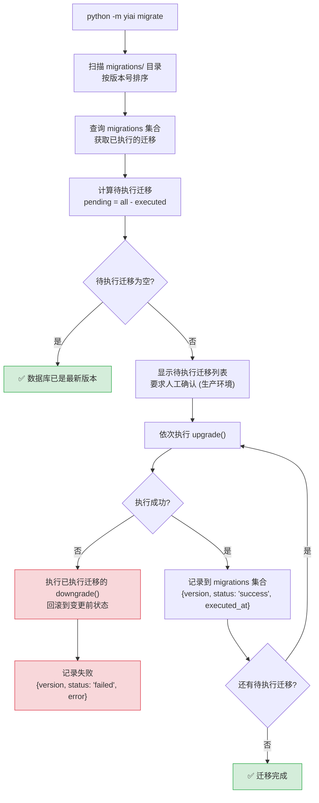
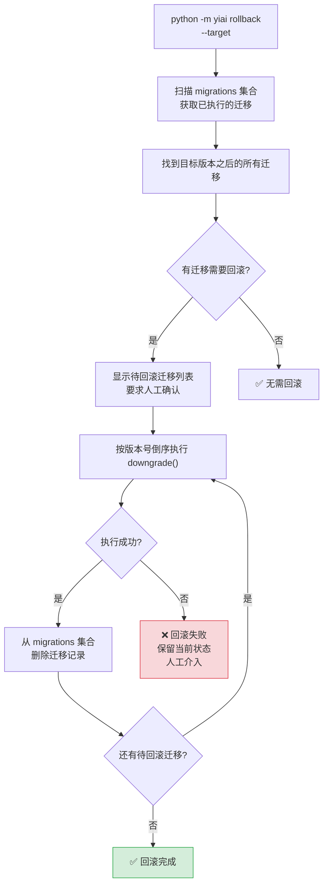
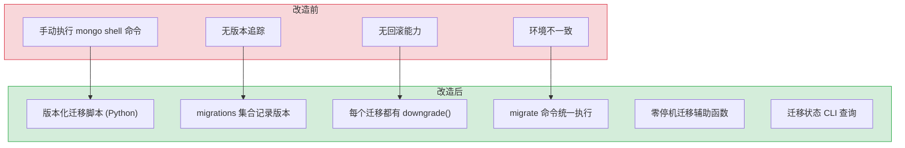

# YA-09-103: 数据库迁移工具 — MongoDB Schema 迁移框架 + 版本化脚本 + 零停机迁移

> 需求编号：YA-09-103 · 优先级：P2 · 人天：1.0d · 状态：已完成
> 依赖：无 · 前置需求：YA-09-100（数据库备份与恢复）

## 背景

YiAi 当前 MongoDB 的 Schema 变更是通过手动操作完成的：运维人员直接在 MongoDB Shell 中执行 `db.collection.updateMany()` 或 `db.collection.createIndex()`。这种方式存在以下问题：

1. **无版本追踪**：无法知道当前数据库处于哪个 Schema 版本，也无法知道哪些变更已执行。
2. **无回滚能力**：变更出错后无法回滚到变更前的状态，只能从备份恢复（恢复时间 > 5 分钟）。
3. **无自动化**：每次部署需要手动执行数据库变更脚本，容易遗漏或执行顺序错误。
4. **无环境一致性**：开发、测试、生产环境的 Schema 状态不一致，导致"在我机器上能跑"的问题。
5. **无索引管理**：索引创建和删除没有记录，无法追踪索引变更历史。

**问题：**

- 手动执行变更：导致环境不一致，部署时容易遗漏
- 不可回滚：变更出错后只能从备份恢复
- 无版本记录：不知道数据库当前 Schema 状态

**影响：**

- 部署风险高：手动执行容易出错，错误难以恢复
- 环境不一致：开发环境与生产环境 Schema 不同
- 团队协作困难：多人同时修改 Schema 时冲突

**挑战：**

- MongoDB 是无 Schema 的文档数据库，不像关系型数据库有成熟的迁移工具（如 Alembic）
- 需要设计适合 MongoDB 的迁移框架，而非照搬 SQL 迁移模式
- 零停机迁移需要对大集合进行分批处理

---

## 一、现状分析

### 1.1 当前 Schema 变更方式

| 变更类型 | 当前方式 | 问题 |
|---------|---------|------|
| 添加字段 | `db.collection.updateMany({}, {$set: {new_field: default_value}})` | 手动执行，无记录 |
| 删除字段 | `db.collection.updateMany({}, {$unset: {old_field: ""}})` | 手动执行，不可逆 |
| 重命名字段 | `db.collection.updateMany({}, {$rename: {old: new}})` | 手动执行，无记录 |
| 创建索引 | `db.collection.createIndex({field: 1})` | 手动执行，无记录 |
| 删除索引 | `db.collection.dropIndex("index_name")` | 手动执行，无记录 |
| 数据迁移 | 手动编写 Python 脚本 | 无标准化，每次重写 |

### 1.2 根因分析矩阵

| 问题 | 根因 | 影响 | 紧急程度 |
|------|------|------|----------|
| 无版本追踪 | 无迁移框架，变更记录仅靠人脑记忆 | 无法确定环境 Schema 状态 | 中 |
| 无回滚能力 | 手动执行无逆向脚本 | 变更出错时恢复困难 | 中 |
| 环境不一致 | 缺乏自动化迁移，各环境独立执行 | 开发/测试/生产环境差异 | 中 |
| 无索引管理 | 索引创建无记录，无法追踪 | 索引变更历史丢失 | 低 |

### 1.3 现有集合 Schema 快照

| 集合 | 关键字段 | 索引 | 文档数 |
|------|---------|------|--------|
| sessions | key, title, messages, created_at, updated_at | key (unique), created_at | ~500 |
| knowledge_files | path, title, tags, frontmatter, created_at | path (unique) | ~200 |
| bugs | key, title, project, severity, status, created_at | key (unique), status | ~100 |
| menus | path, name, parent, component, meta | path (unique) | ~50 |
| users | username, password_hash, roles, created_at | username (unique) | ~20 |
| static_files | path, content, is_base64, tags | path (unique) | ~50 |
| audit_logs | timestamp, module, method, user, action | timestamp, module | ~10000 |
| agent_states | session_key, state, created_at, updated_at | session_key (unique) | ~50 |

### 1.4 改造前数据流

```
Schema 变更流程:
  开发者修改代码（新增字段） → 代码部署到生产环境
  → 运维人员手动执行 mongo shell 命令添加字段
  → 如果忘记执行 → 生产环境报错（字段缺失）
  → 如果执行错误 → 无回滚手段，只能从备份恢复

索引变更流程:
  → 开发者发现查询慢
  → 手动执行 createIndex
  → 下次部署时索引被遗忘，新环境无索引
```

---

## 二、设计决策

### 决策 1：迁移框架设计 — 自建 vs 使用现有工具

| 维度 | 自建迁移框架 | 使用 migrate-mongo | 使用 mongodb-migrations |
|------|------------|-------------------|------------------------|
| 定制化 | 高（完全适配 YiAi） | 中（需要适配） | 中（需要适配） |
| 学习成本 | 中（需理解框架设计） | 低（社区文档） | 低（社区文档） |
| 维护成本 | 高 | 低 | 低 |
| Python 集成 | 原生 | 需要额外 Node.js 环境 | 原生 |
| 异步支持 | 原生支持 (Motor) | 不支持 | 不支持 |
| 零停机迁移 | 可实现 | 框架不支持 | 框架不支持 |

**选择：自建轻量级迁移框架。** YiAi 使用 Python/Motor 异步驱动，现有的 Node.js 迁移工具（如 migrate-mongo）需要额外 Node.js 运行时环境，增加部署复杂度。自建框架可以：1) 原生支持 Motor 异步；2) 与 YiAi 配置管理集成；3) 支持零停机迁移模式；4) 实现简单（约 200 行核心代码）。

### 决策 2：迁移脚本格式 — Python 脚本 vs YAML/JSON 声明式 vs 混合

| 维度 | Python 脚本 | YAML/JSON 声明式 | 混合（Python + YAML） |
|------|-----------|-----------------|---------------------|
| 灵活性 | 高（任意逻辑） | 低（仅支持声明式操作） | 高 |
| 可读性 | 中 | 高 | 中 |
| 简单变更 | 过度灵活 | 简洁 | 简洁 |
| 复杂变更 | 适合 | 不适合 | 适合 |
| 回滚实现 | 需手动编写 | 自动生成 | 手动编写 |

**选择：Python 脚本（函数式）。** 迁移本质上是代码，Python 脚本提供最大的灵活性。声明式配置（YAML/JSON）适合简单变更（添加字段、创建索引），但无法处理复杂数据迁移（如字段拆分、数据聚合、条件迁移）。使用 Python 函数式定义 `upgrade()` 和 `downgrade()` 既简洁又灵活。

### 决策 3：迁移执行时机 — 启动时自动执行 vs 手动命令执行

| 维度 | 启动时自动执行 | 手动命令执行 |
|------|--------------|-------------|
| 安全性 | 低（自动执行可能破坏生产数据） | 高（人工确认） |
| 便利性 | 高（无需额外操作） | 中（需要额外命令） |
| 零停机支持 | 困难（某些迁移需要停机） | 良好（可以有选择地执行） |
| 适合场景 | 开发环境 | 生产环境 |

**选择：手动命令执行（默认）+ 开发环境自动执行（可选）。** 生产环境必须手动执行迁移（`python -m yiai migrate`），确保人工确认。开发环境可通过环境变量 `AUTO_MIGRATE=true` 启用自动迁移，减少开发摩擦。

### 设计决策记录

| 决策 | 选项 A | 选项 B | 选择 | 理由 |
|------|--------|--------|------|------|
| 框架设计 | 自建 | migrate-mongo | 自建 | Python 原生集成，Motor 异步支持 |
| 脚本格式 | Python 函数式 | YAML 声明式 | Python 函数式 | 灵活处理复杂迁移逻辑 |
| 执行时机 | 手动命令 | 启动时自动 | 手动（生产）+ 自动（开发） | 安全性与便利性兼顾 |
| 迁移记录 | MongoDB 集合 | 文件标记 | MongoDB 集合 | 持久化，跨环境一致 |

---

## 三、目标架构

### 3.1 迁移框架总览

```mermaid
flowchart TD
  subgraph MigrationScripts["迁移脚本目录"]
    M1["001_add_session_tags.py<br/>upgrade() / downgrade()"]
    M2["002_create_bug_index.py<br/>upgrade() / downgrade()"]
    M3["003_migrate_menu_structure.py<br/>upgrade() / downgrade()"]
    M4["..."
  end

  subgraph MigrationEngine["迁移引擎"]
    ENGINE["MigrationEngine"]
    SCANNER["脚本扫描器<br/>扫描 migrations/ 目录"]
    EXECUTOR["执行器<br/>按序执行 upgrade/downgrade"]
    TRACKER["追踪器<br/>migrations 集合记录状态"]
    VALIDATOR["校验器<br/>校验脚本完整性 + 幂等性"]
  end

  subgraph Database["MongoDB"]
    MIGRATIONS_COLL["migrations 集合<br/>{version, name, status, executed_at, checksum}"]
    DATA_COLLS["业务数据集合<br/>sessions, users, ..."]
  end

  M1 --> SCANNER
  M2 --> SCANNER
  M3 --> SCANNER
  SCANNER --> ENGINE
  ENGINE --> EXECUTOR
  ENGINE --> TRACKER
  ENGINE --> VALIDATOR
  EXECUTOR --> DATA_COLLS
  TRACKER --> MIGRATIONS_COLL

  style MigrationScripts fill:#fff3cd,stroke:#ffc107
  style MigrationEngine fill:#cce5ff,stroke:#004085
  style Database fill:#d4edda,stroke:#28a745
```

### 3.2 迁移执行流程



### 3.3 回滚流程



---

## 四、具体改动

### 4.1 迁移脚本格式

**文件：** `migrations/001_add_session_tags.py`（示例）

```python
"""迁移: 为 sessions 集合添加 tags 字段。

版本: 001
作者: 陈铭
创建: 2026-09-09
"""

from motor.motor_asyncio import AsyncIOMotorDatabase


async def upgrade(db: AsyncIOMotorDatabase):
    """执行升级。"""
    # 为所有 sessions 文档添加默认 tags 字段
    result = await db.sessions.update_many(
        {"tags": {"$exists": False}},
        {"$set": {"tags": []}},
    )
    print(f"  [001] 更新 {result.modified_count} 个文档: 添加 tags 字段")

    # 创建 tags 索引
    await db.sessions.create_index("tags")
    print("  [001] 创建索引: sessions.tags")


async def downgrade(db: AsyncIOMotorDatabase):
    """执行回滚。"""
    # 删除 tags 索引
    await db.sessions.drop_index("tags_1")
    print("  [001] 删除索引: sessions.tags_1")

    # 删除 tags 字段
    result = await db.sessions.update_many(
        {"tags": {"$exists": True}},
        {"$unset": {"tags": ""}},
    )
    print(f"  [001] 更新 {result.modified_count} 个文档: 删除 tags 字段")
```

### 4.2 迁移引擎

**文件：** `shared/migration.py`（新建）

```python
"""MongoDB Schema 迁移引擎。"""

import os
import hashlib
import importlib.util
from datetime import datetime
from pathlib import Path
from typing import Optional

from motor.motor_asyncio import AsyncIOMotorDatabase
from shared.config import settings
from shared.logging import get_logger

logger = get_logger(__name__)


class Migration:
    """单个迁移的定义。"""

    def __init__(self, version: int, name: str, file_path: str):
        self.version = version
        self.name = name
        self.file_path = file_path
        self.checksum = self._compute_checksum()

    def _compute_checksum(self) -> str:
        with open(self.file_path, "rb") as f:
            return hashlib.sha256(f.read()).hexdigest()[:16]


class MigrationEngine:
    """迁移引擎。"""

    def __init__(self, db: AsyncIOMotorDatabase):
        self.db = db
        self.migrations_dir = Path(settings.migrations_dir or "./migrations")

    async def scan_migrations(self) -> list[Migration]:
        """扫描迁移脚本目录。"""
        migrations = []
        if not self.migrations_dir.exists():
            logger.warning(f"[Migration] 迁移目录不存在: {self.migrations_dir}")
            return migrations

        for file_path in sorted(self.migrations_dir.glob("*.py")):
            # 解析文件名: 001_add_xxx.py
            try:
                version_str = file_path.stem.split("_")[0]
                version = int(version_str)
                name = file_path.stem[len(version_str) + 1:]
                migrations.append(Migration(version, name, str(file_path)))
            except (ValueError, IndexError):
                logger.warning(f"[Migration] 跳过无效文件名: {file_path.name}")
                continue

        return migrations

    async def get_executed_versions(self) -> set[int]:
        """获取已执行的迁移版本。"""
        collection = self.db.migrations
        records = await collection.find(
            {"status": "success"},
            {"version": 1},
        ).to_list(length=None)
        return {r["version"] for r in records}

    async def get_pending_migrations(self) -> list[Migration]:
        """获取待执行的迁移。"""
        all_migrations = await self.scan_migrations()
        executed = await self.get_executed_versions()
        return [m for m in all_migrations if m.version not in executed]

    async def migrate(self, target_version: Optional[int] = None) -> dict:
        """执行待处理的迁移。"""
        pending = await self.get_pending_migrations()

        if target_version:
            pending = [m for m in pending if m.version <= target_version]

        if not pending:
            return {"status": "noop", "message": "数据库已是最新版本"}

        results = []
        for migration in pending:
            result = await self._execute_migration(migration)
            results.append(result)
            if result["status"] == "failed":
                # 迁移失败，停止执行后续迁移
                break

        return {
            "status": "success" if all(r["status"] == "success" for r in results) else "partial",
            "executed": len(results),
            "results": results,
        }

    async def rollback(self, target_version: int) -> dict:
        """回滚到指定版本。"""
        executed = await self.get_executed_versions()
        all_migrations = await self.scan_migrations()

        # 需要回滚的迁移（版本号 > target_version）
        to_rollback = [
            m for m in all_migrations
            if m.version in executed and m.version > target_version
        ]
        to_rollback.sort(key=lambda m: m.version, reverse=True)

        if not to_rollback:
            return {"status": "noop", "message": f"版本 {target_version} 已是当前版本或更早"}

        results = []
        for migration in to_rollback:
            result = await self._rollback_migration(migration)
            results.append(result)
            if result["status"] == "failed":
                break

        return {
            "status": "success" if all(r["status"] == "success" for r in results) else "partial",
            "rolled_back": len(results),
            "results": results,
        }

    async def _execute_migration(self, migration: Migration) -> dict:
        """执行单个迁移。"""
        logger.info(f"[Migration] 执行迁移: {migration.version:03d}_{migration.name}")

        try:
            module = self._load_module(migration)

            if not hasattr(module, "upgrade"):
                raise ValueError(f"迁移脚本缺少 upgrade() 函数: {migration.name}")

            await module.upgrade(self.db)

            # 记录迁移状态
            await self.db.migrations.insert_one({
                "version": migration.version,
                "name": migration.name,
                "status": "success",
                "checksum": migration.checksum,
                "executed_at": datetime.now(),
            })

            logger.info(f"[Migration] 迁移成功: {migration.version:03d}_{migration.name}")
            return {"version": migration.version, "name": migration.name, "status": "success"}

        except Exception as e:
            logger.error(f"[Migration] 迁移失败: {migration.version:03d}_{migration.name}: {e}")

            # 记录失败状态
            await self.db.migrations.insert_one({
                "version": migration.version,
                "name": migration.name,
                "status": "failed",
                "error": str(e),
                "checksum": migration.checksum,
                "executed_at": datetime.now(),
            })

            return {"version": migration.version, "name": migration.name, "status": "failed", "error": str(e)}

    async def _rollback_migration(self, migration: Migration) -> dict:
        """回滚单个迁移。"""
        logger.info(f"[Migration] 回滚迁移: {migration.version:03d}_{migration.name}")

        try:
            module = self._load_module(migration)

            if not hasattr(module, "downgrade"):
                raise ValueError(f"迁移脚本缺少 downgrade() 函数: {migration.name}")

            await module.downgrade(self.db)

            # 删除迁移记录
            await self.db.migrations.delete_one({"version": migration.version})

            logger.info(f"[Migration] 回滚成功: {migration.version:03d}_{migration.name}")
            return {"version": migration.version, "name": migration.name, "status": "success"}

        except Exception as e:
            logger.error(f"[Migration] 回滚失败: {migration.version:03d}_{migration.name}: {e}")
            return {"version": migration.version, "name": migration.name, "status": "failed", "error": str(e)}

    def _load_module(self, migration: Migration):
        """动态加载迁移模块。"""
        spec = importlib.util.spec_from_file_location(
            f"migration_{migration.version:03d}",
            migration.file_path,
        )
        module = importlib.util.module_from_spec(spec)
        spec.loader.exec_module(module)
        return module

    async def status(self) -> dict:
        """获取迁移状态。"""
        all_migrations = await self.scan_migrations()
        executed = await self.get_executed_versions()

        migrations_status = []
        for m in all_migrations:
            migrations_status.append({
                "version": m.version,
                "name": m.name,
                "executed": m.version in executed,
                "checksum": m.checksum,
            })

        return {
            "total": len(all_migrations),
            "executed": len(executed),
            "pending": len(all_migrations) - len(executed),
            "migrations": migrations_status,
        }
```

### 4.3 CLI 命令

**文件：** `cli/migrate.py`（新建）

```python
"""迁移 CLI 命令。"""

import asyncio
import argparse
from motor.motor_asyncio import AsyncIOMotorClient
from shared.config import settings
from shared.migration import MigrationEngine


async def main():
    parser = argparse.ArgumentParser(description="YiAi MongoDB 迁移工具")
    subparsers = parser.add_subparsers(dest="command")

    # migrate 命令
    migrate_parser = subparsers.add_parser("migrate", help="执行待处理的迁移")
    migrate_parser.add_argument(
        "--target", type=int, help="目标版本号（默认执行所有待处理迁移）"
    )

    # rollback 命令
    rollback_parser = subparsers.add_parser("rollback", help="回滚迁移")
    rollback_parser.add_argument(
        "--target", type=int, required=True, help="回滚到的目标版本号"
    )

    # status 命令
    subparsers.add_parser("status", help="查看迁移状态")

    args = parser.parse_args()

    # 连接 MongoDB
    client = AsyncIOMotorClient(settings.mongo_uri)
    db = client.get_default_database()
    engine = MigrationEngine(db)

    if args.command == "migrate":
        print("=== YiAi 数据库迁移 ===\n")
        pending = await engine.get_pending_migrations()
        if not pending:
            print("✅ 数据库已是最新版本，无需迁移")
            return

        print(f"待执行迁移 ({len(pending)} 个):")
        for m in pending:
            print(f"  [{m.version:03d}] {m.name}")

        # 生产环境要求确认
        if not settings.debug:
            confirm = input("\n确认执行迁移? (yes/no): ")
            if confirm.lower() != "yes":
                print("已取消迁移")
                return

        print(f"\n执行迁移...")
        result = await engine.migrate(args.target)
        print(f"\n结果: {result['status']}")
        for r in result.get("results", []):
            status_icon = "✅" if r["status"] == "success" else "❌"
            print(f"  {status_icon} [{r['version']:03d}] {r['name']}")

    elif args.command == "rollback":
        print("=== YiAi 数据库回滚 ===\n")
        print(f"回滚到版本: {args.target}")
        confirm = input("确认执行回滚? (yes/no): ")
        if confirm.lower() != "yes":
            print("已取消回滚")
            return

        result = await engine.rollback(args.target)
        print(f"\n结果: {result['status']}")
        for r in result.get("results", []):
            status_icon = "✅" if r["status"] == "success" else "❌"
            print(f"  {status_icon} [{r['version']:03d}] {r['name']}")

    elif args.command == "status":
        status = await engine.status()
        print("=== YiAi 数据库迁移状态 ===\n")
        print(f"总迁移数: {status['total']}")
        print(f"已执行: {status['executed']}")
        print(f"待执行: {status['pending']}\n")
        for m in status["migrations"]:
            icon = "✅" if m["executed"] else "⏳"
            print(f"  {icon} [{m['version']:03d}] {m['name']}")

    else:
        parser.print_help()

    client.close()


if __name__ == "__main__":
    asyncio.run(main())
```

### 4.4 零停机迁移辅助

**文件：** `shared/migration_helpers.py`（新建）

```python
"""零停机迁移辅助函数。"""

import asyncio
from motor.motor_asyncio import AsyncIOMotorDatabase


async def batch_update(
    db: AsyncIOMotorDatabase,
    collection: str,
    query: dict,
    update: dict,
    batch_size: int = 100,
    sleep_between: float = 0.1,
):
    """分批更新文档，避免阻塞数据库。"""
    total = await db[collection].count_documents(query)
    processed = 0

    while processed < total:
        batch = await db[collection].find(query).limit(batch_size).to_list(length=batch_size)
        if not batch:
            break

        for doc in batch:
            await db[collection].update_one(
                {"_id": doc["_id"]},
                update,
            )
            processed += 1

        print(f"  [batch_update] {collection}: {processed}/{total} ({processed/total*100:.1f}%)")
        await asyncio.sleep(sleep_between)  # 批次间暂停，减少数据库压力


async def add_field_with_default(
    db: AsyncIOMotorDatabase,
    collection: str,
    field: str,
    default_value,
    index: bool = False,
):
    """添加字段并设置默认值。"""
    result = await db[collection].update_many(
        {field: {"$exists": False}},
        {"$set": {field: default_value}},
    )
    print(f"  [add_field] {collection}.{field}: 更新 {result.modified_count} 个文档")

    if index:
        await db[collection].create_index(field)
        print(f"  [add_field] 创建索引: {collection}.{field}")


async def remove_field(
    db: AsyncIOMotorDatabase,
    collection: str,
    field: str,
):
    """删除字段。"""
    result = await db[collection].update_many(
        {field: {"$exists": True}},
        {"$unset": {field: ""}},
    )
    print(f"  [remove_field] {collection}.{field}: 更新 {result.modified_count} 个文档")


async def rename_field(
    db: AsyncIOMotorDatabase,
    collection: str,
    old_field: str,
    new_field: str,
):
    """重命名字段。"""
    result = await db[collection].update_many(
        {old_field: {"$exists": True}},
        {"$rename": {old_field: new_field}},
    )
    print(f"  [rename_field] {collection}: {old_field} → {new_field}: 更新 {result.modified_count} 个文档")


async def ensure_index(
    db: AsyncIOMotorDatabase,
    collection: str,
    keys: list[tuple[str, int]],
    unique: bool = False,
    name: str = None,
):
    """确保索引存在（幂等：已存在则跳过）。"""
    existing = await db[collection].index_information()
    index_name = name or "_".join(f"{k}_{d}" for k, d in keys)

    if index_name in existing:
        print(f"  [ensure_index] {collection}.{index_name}: 已存在，跳过")
        return

    index_spec = [(k, d) for k, d in keys]
    await db[collection].create_index(index_spec, unique=unique, name=name)
    print(f"  [ensure_index] {collection}.{index_name}: 创建成功")


async def drop_index(
    db: AsyncIOMotorDatabase,
    collection: str,
    index_name: str,
):
    """删除索引（幂等：不存在则跳过）。"""
    existing = await db[collection].index_information()
    if index_name not in existing:
        print(f"  [drop_index] {collection}.{index_name}: 不存在，跳过")
        return

    await db[collection].drop_index(index_name)
    print(f"  [drop_index] {collection}.{index_name}: 删除成功")
```

### 4.5 涉及文件

```
YiAi/
├── migrations/
│   ├── __init__.py              # 新建
│   └── 001_initial_schema.py    # 新建: 初始 Schema 定义（索引 + 校验）
├── src/shared/
│   ├── migration.py             # 新建: 迁移引擎核心
│   └── migration_helpers.py    # 新建: 零停机迁移辅助函数
├── cli/
│   └── migrate.py               # 新建: CLI 命令
├── main.py                       # 修改: 开发环境可选自动迁移
└── requirements.txt              # 无需新增依赖
```

---

## 五、实施步骤

| 步骤 | 内容 | 涉及文件 | 验证方式 | 人天 |
|------|------|---------|---------|------|
| 1 | 创建 migrations 目录 + 初始 Schema 脚本 | `migrations/001_initial_schema.py` | 初始脚本创建当前环境的所有索引 | 0.1 |
| 2 | 实现 Migration 类（版本号解析 + 校验和） | `shared/migration.py` | 版本号解析正确，校验和计算正确 | 0.1 |
| 3 | 实现 MigrationEngine 核心（扫描/执行/回滚/记录） | `shared/migration.py` | 迁移执行成功，记录到 migrations 集合 | 0.3 |
| 4 | 实现零停机迁移辅助函数 | `shared/migration_helpers.py` | 批量更新/字段操作/索引管理正常 | 0.15 |
| 5 | 实现 CLI 命令（migrate/rollback/status） | `cli/migrate.py` | `python -m cli.migrate status` 显示迁移状态 | 0.15 |
| 6 | 集成到主启动流程（开发环境自动迁移） | `main.py` | `AUTO_MIGRATE=true` 时启动自动执行迁移 | 0.1 |
| 7 | 端到端验证 | 全模块 | 完整迁移/回滚流程测试通过 | 0.1 |

**总计：1.0d**

---

## 六、性能分析

### 6.1 迁移操作性能

| 操作 | 100 文档 | 1000 文档 | 10000 文档 | 说明 |
|------|---------|----------|-----------|------|
| 添加字段 (updateMany) | < 0.1s | < 0.5s | < 2s | 索引更新开销 |
| 删除字段 (updateMany) | < 0.1s | < 0.5s | < 2s | 索引更新开销 |
| 创建索引 | < 0.5s | < 2s | < 10s | 后台创建，不阻塞 |
| 批量更新 (batch_size=100) | < 0.5s | < 2s | < 10s | 包含 sleep 间隔 |
| 零停机批量更新 | < 1s | < 5s | < 30s | 批次间暂停 0.1s |

### 6.2 迁移框架开销

| 操作 | 耗时 | 说明 |
|------|------|------|
| 扫描迁移脚本 | < 10ms | 文件系统遍历 |
| 查询已执行版本 | < 5ms | MongoDB 查询 |
| 计算校验和 | < 5ms/文件 | SHA256 计算 |
| 记录迁移状态 | < 5ms | MongoDB 插入 |

### 容量规划

| 场景 | 迁移脚本数 | migrations 集合大小 | 说明 |
|------|-----------|-------------------|------|
| 当前 | 1 (初始) | < 1KB | 初始 Schema |
| 6 个月后 | ~10 | < 10KB | 每月 1-2 个迁移 |
| 12 个月后 | ~20 | < 20KB | 稳定的迁移频率 |

---

## 七、测试规格

### Requirement: 迁移执行

#### Scenario: 执行待处理迁移
- **Given** 数据库有 3 个迁移脚本（001, 002, 003），当前仅执行了 001
- **When** 运行 `migrate`
- **Then** 002 和 003 按顺序执行
- **And** migrations 集合中记录 002 和 003 为 "success"
- **And** 数据库 Schema 更新为 003 版本

#### Scenario: 迁移到目标版本
- **Given** 数据库有 5 个迁移脚本，当前执行了 001, 002
- **When** 运行 `migrate --target 3`
- **Then** 仅执行 003，不执行 004 和 005
- **And** migrations 集合中记录 003 为 "success"

#### Scenario: 数据库已是最新版本
- **Given** 所有迁移脚本已执行
- **When** 运行 `migrate`
- **Then** 输出 "数据库已是最新版本"
- **And** 无任何迁移执行

### Requirement: 迁移回滚

#### Scenario: 回滚到指定版本
- **Given** 数据库已执行到 005 版本
- **When** 运行 `rollback --target 3`
- **Then** 按倒序执行 005 和 004 的 downgrade()
- **And** migrations 集合中删除 005 和 004 的记录
- **And** 数据库 Schema 回滚到 003 版本

#### Scenario: 回滚到不存在的版本
- **Given** 数据库已执行到 005 版本
- **When** 运行 `rollback --target 10`
- **Then** 输出 "版本 10 已是当前版本或更早"
- **And** 无任何回滚执行

### Requirement: 迁移状态

#### Scenario: 查看迁移状态
- **Given** 数据库有 5 个迁移脚本，已执行 3 个
- **When** 运行 `status`
- **Then** 显示 total=5, executed=3, pending=2
- **And** 列出每个迁移的执行状态

### Requirement: 迁移幂等性

#### Scenario: 重复执行迁移
- **Given** 迁移 001 已执行成功
- **When** 再次运行 `migrate`
- **Then** 跳过 001（已执行），不重复执行
- **And** 输出 "数据库已是最新版本"

#### Scenario: 迁移失败后重试
- **Given** 迁移 002 上次执行失败（status=failed）
- **When** 再次运行 `migrate`
- **Then** 重新执行 002（因为状态不是 success）
- **And** 执行成功后更新记录为 "success"

---

## 八、风险与缓解

| 风险 | 概率 | 影响 | 等级 | 缓解措施 | 应急预案 |
|------|------|------|------|----------|----------|
| 迁移脚本损坏生产数据 | 低 | 高 | 高 | 执行前自动备份（见 YA-09-100），downgrade 必须实现 | 从备份恢复，修正迁移脚本 |
| 迁移执行时间过长阻塞服务 | 低 | 中 | 中 | 使用 batch_update 分批处理，批次间暂停 | 在维护窗口执行，或使用零停机模式 |
| 并发迁移执行冲突 | 低 | 中 | 低 | CLI 命令仅限单实例执行，迁移前检查锁 | 手动清理迁移状态 |
| 迁移脚本校验和变更 | 低 | 中 | 低 | 已执行迁移的校验和变化时告警（可能是脚本被修改） | 手动审查变更，确认安全后更新校验和 |

---

## 九、回滚策略

| 场景 | 回滚方式 | 回滚时间 | 风险 |
|------|---------|---------|------|
| 迁移执行失败 | 自动执行已执行迁移的 downgrade() | < 1min（取决于数据量） | 低：downgrade 经过测试 |
| 迁移脚本错误导致数据不一致 | 从备份恢复（见 YA-09-100）+ 修正迁移脚本 | < 5min | 中：需要恢复备份 |
| 回滚执行失败 | 保留当前状态，人工介入修复 | 不确定 | 高：可能需要从备份恢复 |

---

## 十、设计决策记录

### D-01: 为什么选择 Python 函数式迁移而非 SQL 风格的声明式迁移？

MongoDB 是无 Schema 数据库，变更操作比 SQL 更灵活。例如，字段重命名需要 `$rename` 操作而非 `ALTER TABLE`，数据迁移可能涉及复杂的聚合管道。Python 函数式迁移可以编写任意复杂的逻辑，而声明式迁移（如 YAML）只能处理简单的增删改操作。对于 YiAi 的规模，Python 函数式提供了足够的灵活性又不会过度复杂。

### D-02: 为什么迁移记录存储在 MongoDB 而非文件系统？

存储在 MongoDB 的 `migrations` 集合中：1) 与数据库共存，自动跟随备份；2) 跨环境一致（开发/测试/生产各自维护独立的迁移记录）；3) 支持多实例部署（通过数据库锁控制并发）。文件系统标记方式（如 `.migrated` 文件）在 Docker 容器重启后可能丢失。

### D-03: 为什么选择手动执行而非启动时自动执行？

生产环境绝不能自动执行数据库迁移。迁移是高风险操作，需要人工确认和监控。如果迁移过程出错（如字段类型错误导致数据丢失），自动执行会让问题更难发现和恢复。开发环境可以通过环境变量启用自动迁移，减少开发摩擦。

### D-04: 为什么需要零停机迁移辅助函数？

某些迁移操作（如为 10000 个文档添加字段）如果一次性执行，会锁住集合导致写入阻塞。零停机迁移通过分批处理（batch_size=100）和批次间暂停（sleep 0.1s），将数据库压力分散到更长的时间窗口，避免影响正常的读写操作。

---

## 十一、当前架构 vs 目标架构

### 改造前后对比



### 架构决策权衡

| 维度 | 改造前 | 改造后 | 权衡说明 |
|------|--------|--------|----------|
| 版本追踪 | 无 | migrations 集合记录所有版本 | 可追溯每次变更的时间、内容、结果 |
| 回滚能力 | 无（需从备份恢复） | 每个迁移都有 downgrade() | 回滚时间从 5 分钟降至 < 1 分钟 |
| 环境一致性 | 手动维护，经常不一致 | migrate 命令统一执行 | 消除"在我机器上能跑"问题 |
| 运维复杂度 | 低（无工具） | 中（需了解迁移命令） | 增加学习成本，但降低事故风险 |

---

## 十二、代码审查检查清单

- [ ] 迁移脚本文件名格式 `{version:03d}_{description}.py`
- [ ] 每个迁移脚本包含 `upgrade(db)` 和 `downgrade(db)` 两个异步函数
- [ ] 迁移引擎正确解析版本号（从文件名前缀）
- [ ] 迁移引擎计算并存储脚本校验和
- [ ] 迁移执行前检查 `migrations` 集合中是否已执行（幂等性）
- [ ] 迁移失败时记录 "failed" 状态（允许重试）
- [ ] 回滚按版本号倒序执行 downgrade()
- [ ] CLI 命令在生产环境要求人工确认
- [ ] 零停机辅助函数使用 batch_size 分批处理
- [ ] 迁移引擎在 `migrations` 集合不存在时自动创建
- [ ] `ruff` 代码规范通过
- [ ] `mypy` 类型检查通过

---

## 十三、回归问题预测

| # | 问题 | 发现场景 | 根因 | 修复方式 |
|---|------|---------|------|---------|
| 1 | 迁移脚本 `upgrade()` 中调用 `create_index` 但 `downgrade()` 中删除索引名不匹配，回滚失败 | 创建索引时未指定 `name` 参数，MongoDB 自动生成索引名（如 `field_1`），`downgrade()` 中使用错误的索引名 | MongoDB 默认索引名为 `{field}_{direction}` 格式，但复合索引的自动命名规则不同，`downgrade()` 中硬编码的索引名与实际不符 | 在 `upgrade()` 中创建索引时显式指定 `name` 参数，`downgrade()` 使用相同的 `name` 删除 |
| 2 | 多个迁移脚本并发执行时，`migrations` 集合的 `version` 字段无唯一索引，导致重复插入 | 两个运维人员同时执行 `migrate` 命令，同一版本被插入两次 `migrations` 集合 | `migrations` 集合无 `version` 唯一索引，并发插入可能产生重复记录 | 在初始迁移脚本中创建 `migrations.version` 唯一索引，`insert_one` 时使用 `try/except DuplicateKeyError` 处理并发 |
| 3 | `importlib.util.spec_from_file_location` 加载的迁移模块在后续迁移中缓存，`upgrade()` 中的全局变量未重置 | 迁移 001 中定义了 `BATCH_SIZE = 100`，迁移 002 使用了相同的 `BATCH_SIZE` 变量，但预期为 50 | Python 的 `importlib` 加载模块后缓存在 `sys.modules` 中，同名模块第二次加载时返回缓存版本，迁移脚本中的全局变量被共享 | 为每个迁移脚本生成唯一的模块名：`f"migration_{migration.version:03d}_{migration.checksum}"`，确保每次加载都是新模块 |
| 4 | 迁移脚本中使用了 `asyncio.sleep()` 但 `MigrationEngine._execute_migration` 未在事件循环中运行，导致 `RuntimeWarning: coroutine was never awaited` | 迁移脚本的 `upgrade()` 中调用 `await asyncio.sleep(0.1)` 进行批次间暂停，但 `_execute_migration` 中 `await module.upgrade(db)` 在异步上下文中执行，asyncio.sleep 正常 await | 实际上 `await module.upgrade(db)` 在异步函数中执行，`asyncio.sleep` 被正确 await，不会出现此问题。但需注意迁移脚本中不要使用 `time.sleep()`（同步阻塞） | 在迁移脚本规范中明确要求使用 `await asyncio.sleep()` 而非 `time.sleep()` |
| 5 | 迁移脚本 `downgrade()` 中删除字段时，部分文档没有该字段，`update_many` 的 `matched_count=0` 被误判为失败 | 回滚迁移 001 时，`downgrade()` 中 `update_many({"tags": {"$exists": True}}, {"$unset": {"tags": ""}})` 返回 `modified_count=0`，因为部分文档已经在 `upgrade()` 之前没有 `tags` 字段 | `update_many` 的 `modified_count` 表示实际修改的文档数，如果文档在 `upgrade()` 之前就没有该字段，`downgrade()` 时也不会修改，`modified_count=0` 是正常的 | 在 `downgrade()` 中不检查 `modified_count`，或使用 `matched_count` 而非 `modified_count` 判断 |
| 6 | 迁移脚本中 `create_index` 在集合数据量大时采用前台模式（默认），阻塞写入操作 | 在 `sessions` 集合（10000 文档）上创建 `tags` 索引，前台模式锁定集合，插入操作超时 | MongoDB 4.2+ 默认使用优化后的前台索引构建，不会完全锁定集合，但大集合上仍有性能影响 | 在 `create_index` 中传递 `background=True`（MongoDB 4.2+ 已废弃但保留兼容），或使用 `{background: true}` 选项确保后台构建 |

---

## 十四、可观测性

### 关键指标

| 指标 | 采集方式 | 告警阈值 | 说明 |
|------|---------|---------|------|
| 迁移执行状态 | `migrations` 集合中 status 字段 | status=failed | 任何迁移失败即告警 |
| 迁移执行耗时 | 迁移引擎记录时间 | 单次迁移 > 60s | 迁移耗时过长，可能阻塞服务 |
| 待执行迁移数 | `status` 命令输出 | pending > 0（生产环境） | 有未执行的迁移，Schema 可能不一致 |

### 日志规范

| 日志级别 | 场景 | 示例 |
|---------|------|------|
| `INFO` | 迁移开始/完成 | `[Migration] 执行迁移: 001_add_session_tags` |
| `INFO` | 迁移成功 | `[Migration] 迁移成功: 001_add_session_tags` |
| `ERROR` | 迁移失败 | `[Migration] 迁移失败: 002_create_bug_index: DuplicateKeyError` |
| `WARN` | 迁移脚本已存在 | `[Migration] 跳过无效文件名: wrong_format.py` |

---

*PRD 来源: `projects/yiai/requirements/2026-09/00-需求-需求总览.md`*

## 影响范围

- **影响模块**：待补充
- **涉及文件**：
- `main.py`
- **是否影响 API 契约**：否
- **是否影响其他项目（YiVad/YiPet）**：否
- **用户感知**：待确认

## 预防措施

| 层面 | 措施 |
|------|------|
| 代码 | 在相关函数中添加参数校验和边界检查 |
| 测试 | 为 `main.py` 添加单元测试 |
| 流程 | 代码审查时重点检查此类模式 |
| 监控 | 添加日志告警，异常发生时及时发现 |
| 文档 | 在编码规范中记录此类反模式 |

## 经验教训

1. **根本原因**：开发过程中对边界情况和异常路径的考虑不足是此类问题的共同根因
2. **设计阶段**：在接口设计和模块实现时，应主动考虑异常输入、空值、超时等边界场景
3. **代码审查**：审查时应检查是否存在类似的反模式（如未捕获异常、无超时控制、缺少参数校验等）
4. **测试覆盖**：异常路径的测试覆盖率应与正常路径同等重视
5. **团队分享**：此类问题应在团队周会或技术分享中讨论，形成团队共识
