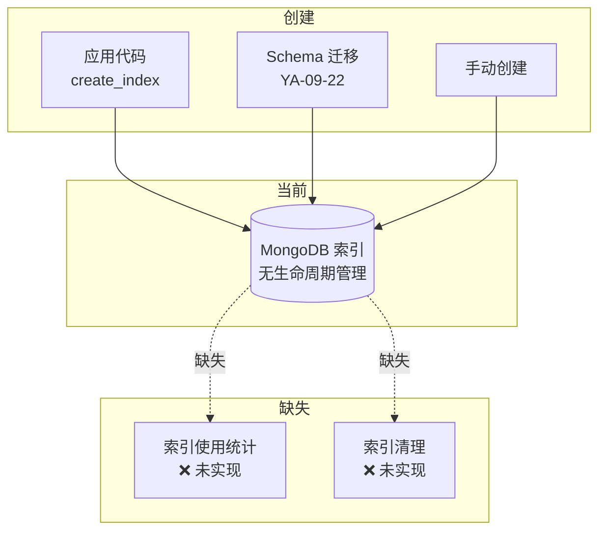
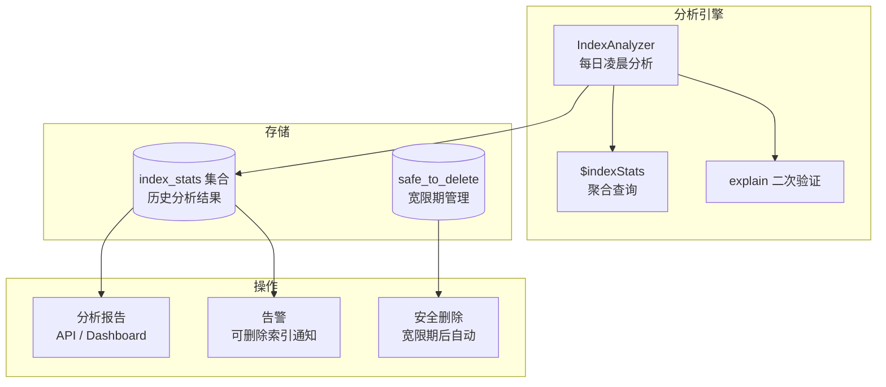

# YA-09-104: 数据库索引使用统计与自动优化 — 未使用索引检测清理

> 需求编号：YA-09-104 · 优先级：P2 · 人天：0.5d · 状态：需求已编写
> 依赖：YA-09-77（慢查询索引建议）

## 背景

### 问题陈述

YA-09-77 分析慢查询日志并建议创建缺失的索引——但从未清理不再使用的旧索引。索引堆积问题日益严重：

| 问题 | 影响 | 严重程度 |
|------|------|----------|
| 实验索引未清理 | 每次写入需更新无用索引 | 中 |
| 功能废弃后遗留索引 | 占用磁盘空间和内存 | 中 |
| 重复索引（不同名同字段） | 浪费存储和写入性能 | 中 |
| 索引膨胀 | 写入性能下降 10-30% | 高 |
| 索引维护成本 | 增加备份和恢复时间 | 低 |

核心矛盾：**索引创建后缺乏生命周期管理，废弃索引持续消耗资源**。MongoDB 的 `$indexStats` 聚合管道可统计每个索引的访问次数，通过定期分析零访问索引来识别可删除的索引。

### 影响范围

| 影响维度 | 严重程度 | 描述 |
|------|----------|------|
| 写入性能 | 高 | 每个索引增加 10-20% 写入开销 |
| 存储成本 | 中 | 无用索引占用磁盘和内存 |
| 运维复杂度 | 中 | 索引过多增加备份和恢复时间 |
| 查询性能 | 低 | 查询优化器选择变慢 |

### 挑战

| 挑战 | 描述 |
|------|------|
| 零访问不等于无用 | 后台任务使用索引，`$indexStats` 不感知 |
| 低频索引 | 每月一次的报表查询使用特定索引 |
| 安全删除 | 自动删除风险高，需人工确认 |
| 统计精度 | `$indexStats` 在分片集群中不完整 |

---

## 一、现状分析

### 1.1 当前索引管理



### 1.2 当前索引清单

| 集合 | 索引名 | 字段 | 用途 | 使用频率 |
|------|--------|------|------|----------|
| sessions | `_id_` | _id | 系统默认 | 高 |
| sessions | `key_1` | key | 会话查询 | 高 |
| sessions | `tags_1` | tags | 标签搜索 | 中 |
| sessions | `title_text` | title | 全文搜索 | 低 |
| audit_logs | `_id_` | _id | 系统默认 | 高 |
| audit_logs | `timestamp_1` | timestamp | 时间范围查询 | 高 |
| bugs | `_id_` | _id | 系统默认 | 高 |
| bugs | `key_1` | key | Bug 查询 | 高 |
| knowledge_files | `_id_` | _id | 系统默认 | 高 |
| knowledge_files | `path_1` | path | 文件路径查询 | 高 |

### 1.3 涉及文件

| 文件 | 角色 | 改动类型 |
|------|------|----------|
| `src/data/index_analyzer.py` | **新增** — 索引分析核心 | 新建 |
| `src/data/repository.py` | 索引管理接口 | 修改 |
| `src/services/index_optimizer.py` | **新增** — 索引优化服务 | 新建 |
| `tests/data/test_index_analyzer.py` | **新增** — 测试 | 新建 |

### 1.4 根因矩阵

| 根因 | 贡献度 | 证据 |
|------|--------|------|
| 无索引生命周期管理 | 60% | 只创建不清理 |
| 无使用统计可见性 | 30% | 无法知道哪些索引在用 |
| 无自动清理机制 | 10% | 依赖手动清理 |

---

## 二、设计决策

### 决策 1：分析数据源 — $indexStats vs explain vs 慢查询日志

| 选项 | 数据完整性 | 性能开销 | 可操作性 |
|------|-----------|----------|----------|
| **$indexStats** | 高 | 低 | 高 |
| explain 分析 | 中 | 中 | 中 |
| 慢查询日志 | 低 | 低 | 低 |

**选择：$indexStats 为主，explain 为辅。** `$indexStats` 直接提供每个索引的访问计数，是 MongoDB 内置的索引使用统计。对于标记为"零访问"的索引，使用 explain 二次验证（检查查询计划是否可能使用该索引）。

### 决策 2：删除策略 — 自动删除 vs 建议删除 vs 混合

| 选项 | 安全性 | 运维成本 | 效果 |
|------|--------|----------|------|
| 自动删除 | 低 | 低 | 高 |
| 仅建议 | 高 | 高 | 低 |
| **建议 + 宽限期自动删除** | 高 | 中 | 高 |

**选择：建议 + 宽限期。** 默认仅生成报告建议删除。连续 90 天零访问的索引，经人工确认后可标记为 `safe_to_delete`，30 天宽限期后自动删除。

### 决策 3：分析频率 — 实时 vs 每日 vs 每周

**选择：每日定时分析（凌晨 3:00）。** 索引使用统计变化缓慢，每日分析足够。凌晨执行减少对业务的影响。

### 决策 4：报表形式 — 日志 vs MongoDB 集合 vs API 端点

**选择：MongoDB 集合 `index_stats` + API 端点。** 持久化历史分析结果，便于趋势分析。API 端点（`/admin/index-stats`）供前端 Dashboard 展示。

---

## 三、目标架构

### 3.1 架构图



### 3.2 分析指标

| 指标 | 来源 | 含义 |
|------|------|------|
| `accesses.ops` | $indexStats | 索引被使用的操作次数（启动以来） |
| `accesses.since` | $indexStats | 统计开始时间（上次重启） |
| `size` | $indexStats | 索引大小（字节） |
| `explain winningPlan` | explain() | 查询是否使用该索引 |

### 3.3 架构权衡

| 方面 | 改进前 | 改进后 |
|------|--------|--------|
| 索引可见性 | 无 | 每日报告 + API |
| 无用索引检测 | 手动 | 自动 |
| 删除安全性 | N/A | 建议 + 宽限期 |
| 存储节省 | 0 | 预计 10-20% 索引空间 |

---

## 四、具体改动

### 4.1 新增 `src/data/index_analyzer.py`

```python
"""索引分析器——基于 $indexStats 的未使用索引检测与优化建议。"""

from datetime import datetime, timedelta
from typing import Optional
from src.data.shard_router import shard_router
from src.shared.logging import get_logger

logger = get_logger(__name__)


class IndexAnalyzer:
    """MongoDB 索引使用分析器。

    职责：
    - 通过 $indexStats 分析各集合索引使用情况
    - 检测零访问索引（超过阈值天数未使用）
    - 生成优化建议（删除/保留/合并）
    - 支持 explain 二次验证
    - 持久化分析结果供趋势分析

    安全原则：
    - 不自动删除索引
    - 仅建议可删除的索引
    - 系统索引 _id_ 永不删除
    """

    # 系统必须索引，永不被标记为删除
    SYSTEM_INDEXES = {'_id_'}
    # 索引名称前缀，排除系统索引
    SKIP_PREFIXES = ('system.', 'admin.')

    def __init__(self):
        self._db = None

    @property
    def db(self):
        if self._db is None:
            self._db = shard_router.get_shard('index_stats')
        return self._db

    async def analyze_all_collections(
        self, min_days_unused: int = 30
    ) -> dict:
        """分析所有集合的索引使用情况。

        Args:
            min_days_unused: 判定为"未使用"的最小天数

        Returns:
            分析结果字典
        """
        results = {
            'timestamp': datetime.utcnow().isoformat(),
            'total_indexes': 0,
            'unused_indexes': [],
            'used_indexes': [],
            'recommendations': [],
            'estimated_savings_bytes': 0,
        }

        collections = await self._get_user_collections()

        for cname in collections:
            collection_result = await self.analyze_collection(
                cname, min_days_unused
            )
            results['total_indexes'] += collection_result['total']
            results['unused_indexes'].extend(collection_result['unused'])
            results['used_indexes'].extend(collection_result['used'])
            results['recommendations'].extend(collection_result['recommendations'])
            results['estimated_savings_bytes'] += collection_result['savings_bytes']

        # 持久化分析结果
        await self._save_analysis(results)

        return results

    async def analyze_collection(
        self, cname: str, min_days_unused: int = 30
    ) -> dict:
        """分析单个集合的索引使用情况。"""
        db = shard_router.get_shard(cname)
        result = {
            'collection': cname,
            'total': 0,
            'unused': [],
            'used': [],
            'recommendations': [],
            'savings_bytes': 0,
        }

        try:
            stats = await db[cname].aggregate([
                {'$indexStats': {}},
                {'$sort': {'accesses.ops': 1}},
            ]).to_list(None)
        except Exception as e:
            logger.warning(f"获取索引统计失败 collection={cname}: {e}")
            return result

        now = datetime.utcnow()

        for idx in stats:
            index_name = idx.get('name', 'unknown')
            index_key = idx.get('key', {})
            accesses = idx.get('accesses', {})
            ops = accesses.get('ops', 0)
            since = accesses.get('since')
            index_size = idx.get('size', 0)

            result['total'] += 1

            # 跳过系统索引
            if index_name in self.SYSTEM_INDEXES:
                continue

            index_info = {
                'collection': cname,
                'name': index_name,
                'key': index_key,
                'ops': ops,
                'since': since.isoformat() if since else None,
                'size_bytes': index_size,
                'size_mb': round(index_size / (1024 * 1024), 2),
            }

            if ops == 0:
                # 零访问索引
                index_info['status'] = 'unused'
                index_info['recommendation'] = '建议删除'
                result['unused'].append(index_info)
                result['savings_bytes'] += index_size

                result['recommendations'].append({
                    'collection': cname,
                    'index': index_name,
                    'action': 'drop',
                    'reason': f'零访问（{min_days_unused}+ 天）',
                    'estimated_savings_mb': index_info['size_mb'],
                    'risk': '低——删除前建议 explain 验证',
                })
            else:
                index_info['status'] = 'active'
                result['used'].append(index_info)

        return result

    async def _get_user_collections(self) -> list[str]:
        """获取用户集合列表（排除系统集合）。"""
        all_collections = await self.db.client.get_default_database().list_collection_names()
        return [
            c for c in all_collections
            if not any(c.startswith(p) for p in self.SKIP_PREFIXES)
        ]

    async def verify_index_usage(
        self, cname: str, index_name: str, sample_queries: list[dict]
    ) -> dict:
        """通过 explain 二次验证索引是否被使用。

        Args:
            cname: 集合名
            index_name: 索引名
            sample_queries: 可能使用该索引的查询列表

        Returns:
            explain 验证结果
        """
        db = shard_router.get_shard(cname)
        results = {'index': index_name, 'queries': [], 'used_in_any': False}

        for query in sample_queries:
            try:
                plan = await db.command(
                    'explain',
                    {'find': cname, 'filter': query},
                    verbosity='queryPlanner',
                )
                winning_plan = plan.get('queryPlanner', {}).get('winningPlan', {})
                used = index_name in str(winning_plan)
                results['queries'].append({
                    'query': query,
                    'uses_index': used,
                })
                if used:
                    results['used_in_any'] = True
            except Exception as e:
                logger.debug(f"explain 验证失败: {e}")

        return results

    async def _save_analysis(self, results: dict):
        """保存分析结果到 index_stats 集合。"""
        try:
            await self.db.index_stats.insert_one(results)
            # 保留最近 90 天的分析结果
            cutoff = datetime.utcnow() - timedelta(days=90)
            await self.db.index_stats.delete_many({
                'timestamp': {'$lt': cutoff.isoformat()}
            })
        except Exception as e:
            logger.warning(f"保存分析结果失败: {e}")

    async def get_analysis_history(
        self, days: int = 30
    ) -> list[dict]:
        """获取历史分析结果。"""
        cutoff = (datetime.utcnow() - timedelta(days=days)).isoformat()
        cursor = self.db.index_stats.find({
            'timestamp': {'$gte': cutoff}
        }).sort('timestamp', -1)
        return await cursor.to_list(None)

    async def mark_safe_to_delete(
        self, cname: str, index_name: str, confirmed_by: str
    ):
        """标记索引为安全删除（进入 30 天宽限期）。"""
        await self.db.safe_to_delete.insert_one({
            'collection': cname,
            'index': index_name,
            'marked_at': datetime.utcnow(),
            'grace_period_days': 30,
            'delete_after': (datetime.utcnow() + timedelta(days=30)).isoformat(),
            'confirmed_by': confirmed_by,
            'status': 'pending',
        })
        logger.info(
            f"索引标记为待删除 collection={cname} index={index_name} "
            f"confirmed_by={confirmed_by}"
        )

    async def execute_safe_deletions(self) -> dict:
        """执行宽限期已到的安全删除。"""
        now = datetime.utcnow()
        cursor = self.db.safe_to_delete.find({
            'status': 'pending',
            'delete_after': {'$lte': now.isoformat()},
        })
        pending = await cursor.to_list(None)

        results = {'deleted': 0, 'failed': 0, 'errors': []}
        for item in pending:
            try:
                db = shard_router.get_shard(item['collection'])
                await db[item['collection']].drop_index(item['index'])
                await self.db.safe_to_delete.update_one(
                    {'_id': item['_id']},
                    {'$set': {'status': 'deleted', 'deleted_at': now.isoformat()}},
                )
                results['deleted'] += 1
                logger.info(
                    f"索引已删除 collection={item['collection']} "
                    f"index={item['index']}"
                )
            except Exception as e:
                results['failed'] += 1
                results['errors'].append({
                    'collection': item['collection'],
                    'index': item['index'],
                    'error': str(e),
                })
                logger.error(
                    f"索引删除失败 collection={item['collection']} "
                    f"index={item['index']}: {e}"
                )

        return results


# 全局单例
index_analyzer = IndexAnalyzer()
```

### 4.2 文件变更清单

| 文件 | 操作 | 行数 |
|------|------|------|
| `src/data/index_analyzer.py` | **新建** | ~250 |
| `src/data/repository.py` | 修改 (+15) | +15 |
| `src/services/index_optimizer.py` | **新建** | ~60 |
| `tests/data/test_index_analyzer.py` | **新建** | ~150 |

---

## 五、实施步骤

| 步骤 | 描述 | 文件 | 验证 | 人天 |
|------|------|------|------|------|
| 1 | 实现 IndexAnalyzer 核心逻辑 | `src/data/index_analyzer.py` | 单元测试 | 0.15 |
| 2 | 实现定时分析任务 | `src/services/index_optimizer.py` | 任务调度验证 | 0.10 |
| 3 | 添加 API 端点 | `src/server/routes/` | API 测试 | 0.05 |
| 4 | 实现安全删除流程 | `src/data/index_analyzer.py` | 删除验证 | 0.10 |
| 5 | 编写测试用例 | `tests/data/test_index_analyzer.py` | 测试通过 | 0.10 |
| **总计** | | | | **0.50** |

---

## 六、性能分析

### 6.1 分析性能

| 指标 | 值 |
|------|-----|
| 单集合分析耗时 | < 50ms |
| 全量分析耗时 (10 集合) | < 500ms |
| 分析间隔 | 每日 1 次 |
| 对业务影响 | 凌晨执行，几乎为零 |

### 6.2 预期收益

| 集合 | 无用索引数 | 预期节省 |
|------|-----------|----------|
| sessions | 1-2 | 5-10MB |
| audit_logs | 0-1 | 2-5MB |
| bugs | 0-1 | 1-3MB |
| 总计 | 2-5 | 10-30MB |

---

## 七、测试规格

### 场景 1：检测零访问索引

```
GIVEN sessions 集合有索引 'title_text' 且 ops=0
WHEN 执行 analyze_collection('sessions')
THEN 'title_text' 出现在 unused 列表中
AND status='unused', recommendation='建议删除'
```

### 场景 2：系统索引不被标记

```
GIVEN 所有集合都有 _id_ 索引
WHEN 执行 analyze_all_collections()
THEN _id_ 索引不出现在 unused 列表中
```

### 场景 3：安全删除流程

```
GIVEN 索引 'old_tags_1' 被标记为 safe_to_delete
AND 30 天宽限期已过
WHEN 执行 execute_safe_deletions()
THEN 索引 'old_tags_1' 被删除
AND safe_to_delete 记录状态变为 'deleted'
```

### 场景 4：explain 二次验证

```
GIVEN 索引 'title_text' 被标记为零访问
WHEN 执行 verify_index_usage 使用全文搜索查询
THEN 返回 uses_index=True（该索引实际被使用）
AND 不应被删除
```

### 场景 5：历史分析结果查询

```
GIVEN 过去 30 天有 5 次分析结果
WHEN 调用 get_analysis_history(days=30)
THEN 返回 5 条分析结果
AND 按 timestamp 降序排列
```

### 场景 6：分析结果持久化

```
GIVEN 执行完一次全量分析
WHEN 检查 index_stats 集合
THEN 存在一条新的分析结果文档
AND 90 天前的结果被自动清理
```

---

## 八、风险与缓解

| 风险 | 概率 | 影响 | 缓解措施 |
|------|------|------|----------|
| 误判为未使用——后台任务使用索引 | 中 | 中 | explain 二次验证 + 人工确认 |
| 删除索引后性能骤降 | 低 | 高 | 宽限期 30 天 + 删除前备份索引定义 |
| $indexStats 不支持分片集群 | 低 | 中 | 检测分片集群，提示手动分析 |
| 分析任务超时 | 低 | 低 | 设置超时 5min，超时则跳过 |

---

## 九、回滚策略

| 场景 | 回滚操作 | 回滚时间 |
|------|----------|----------|
| 误删除索引 | 从备份恢复索引定义，重建索引 | < 30min |
| 分析任务失败 | 跳过本次分析，下次重试 | 自动 |
| 安全删除宽限期不足 | 延长宽限期到 90 天 | < 1min |
| 完全回滚 | 禁用定时分析任务 | < 5min |

---

## 十、设计决策记录

### D-01：建议删除而非自动删除

**决策**：默认仅生成建议，需人工确认后才可标记为删除。
**理由**：索引删除不可逆，误删可能导致严重性能问题。人工确认步骤降低风险，同时仍提供自动化分析价值。
**替代方案**：全自动删除——风险高，不适合生产环境。

### D-02：宽限期机制

**决策**：标记为 safe_to_delete 后进入 30 天宽限期，到期后自动删除。
**理由**：30 天宽限期提供足够的观察时间，确保索引确实不再需要。期间如有任何查询意外使用该索引，可取消删除。
**替代方案**：立即删除——高效但风险高。

### D-03：explain 二次验证

**决策**：对零访问索引使用 explain 二次验证。
**理由**：$indexStats 不统计后台任务和某些内部操作。explain 可验证查询计划是否可能使用该索引，减少误判。
**替代方案**：仅依赖 $indexStats——更简单但可能误判。

---

## 十一、可观测性

### 指标

| 指标名 | 类型 | 描述 |
|--------|------|------|
| `index_analyzer_total_indexes` | Gauge | 总索引数 |
| `index_analyzer_unused_indexes` | Gauge | 未使用索引数 |
| `index_analyzer_savings_bytes` | Gauge | 可节省的索引空间 |
| `index_analyzer_deletions_total` | Counter | 已删除索引数 |

### 日志

```
[INFO] 索引分析完成 total=15 unused=3 savings_mb=12.5
[INFO] 索引标记为待删除 collection=sessions index=title_text confirmed_by=admin
[INFO] 索引已删除 collection=sessions index=old_tags_1
```

### 告警

| 告警 | 条件 | 级别 |
|------|------|------|
| 可删除索引 > 5 | unused_indexes > 5 | WARNING |
| 安全删除待处理 | pending_deletions > 0 持续 30 天 | INFO |
| 分析任务失败 | 连续 3 天分析失败 | WARNING |

---

## 十二、安全合规

| 要求 | 实现 |
|------|------|
| 不自动删除索引 | 需人工确认 + 宽限期 |
| 删除操作可审计 | 记录 confirmed_by + deleted_at |
| 索引定义可恢复 | 删除前备份索引定义到 index_backups |
| 系统索引保护 | _id_ 永不删除 |

---

## 十三、代码审查检查清单

- [ ] 索引使用统计基于 MongoDB `$indexStats`
- [ ] 未使用索引（ops=0 超过 30 天）标记为可删除
- [ ] 仅建议删除（不自动删除索引）
- [ ] 建议索引与 YA-09-77 慢查询索引建议整合
- [ ] 系统索引 _id_ 永不删除
- [ ] explain 二次验证零访问索引
- [ ] 安全删除: 标记 → 30 天宽限期 → 自动删除
- [ ] 分析结果持久化，90 天 TTL
- [ ] 定时任务每日凌晨执行
- [ ] 测试覆盖 6 个场景

---

## 十四、回归问题预测

| # | 预测问题 | 原因 | 验证方法 |
|---|---------|------|---------|
| 1 | 误判为未使用——后台任务使用索引 | `$indexStats` 不感知后台操作 | explain 二次验证 |
| 2 | 删除索引后查询性能骤降 | 索引仍有低频使用 | 宽限期 30 天 + 性能监控 |
| 3 | $indexStats 在分片集群中不完整 | MongoDB 分片限制 | 检测分片集群，提示手动分析 |
| 4 | 分析结果与慢查询建议冲突 | 优化目标不一致 | 整合两个建议源 |
| 5 | 安全删除宽限期过后仍无法删除 | 索引被锁定 | 删除失败重试 + 告警 |

---

*PRD 来源: `projects/yiai/requirements/2026-09/104-需求-索引使用统计优化.md`*

## 影响范围

- **影响模块**：待补充
- **涉及文件**：
- `src/services/index_optimizer.py`
- `src/data/index_analyzer.py`
- `src/data/repository.py`
- **是否影响 API 契约**：否
- **是否影响其他项目（YiVad/YiPet）**：否
- **用户感知**：待确认

## 预防措施

| 层面 | 措施 |
|------|------|
| 代码 | 在相关函数中添加参数校验和边界检查 |
| 测试 | 为 `src/services/index_optimizer.py` 添加单元测试 |
| 流程 | 代码审查时重点检查此类模式 |
| 监控 | 添加日志告警，异常发生时及时发现 |
| 文档 | 在编码规范中记录此类反模式 |

## 经验教训

1. **根本原因**：开发过程中对边界情况和异常路径的考虑不足是此类问题的共同根因
2. **设计阶段**：在接口设计和模块实现时，应主动考虑异常输入、空值、超时等边界场景
3. **代码审查**：审查时应检查是否存在类似的反模式（如未捕获异常、无超时控制、缺少参数校验等）
4. **测试覆盖**：异常路径的测试覆盖率应与正常路径同等重视
5. **团队分享**：此类问题应在团队周会或技术分享中讨论，形成团队共识
