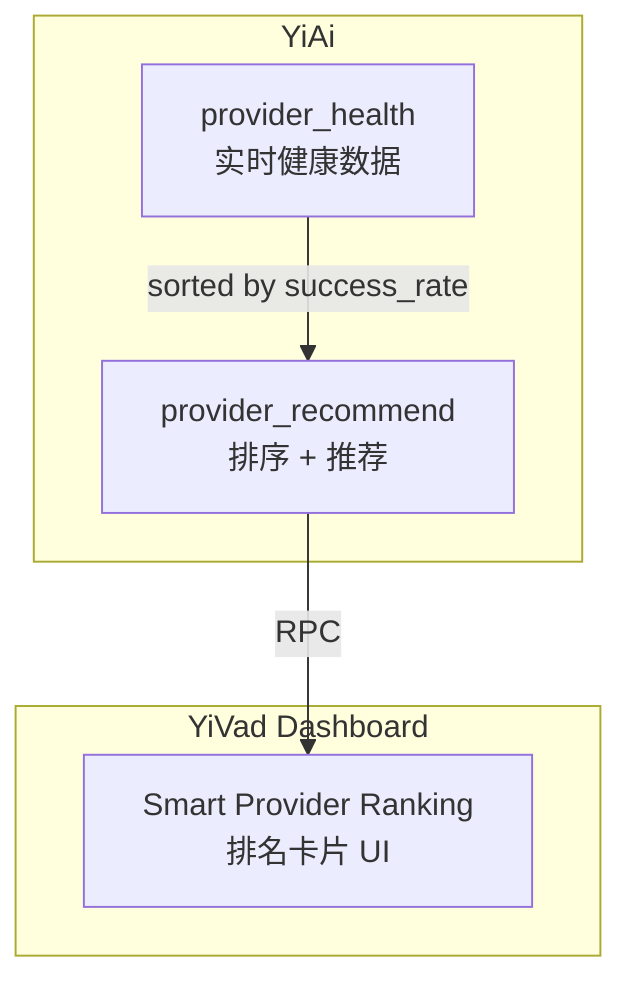

---

doc_type: module
prd_id: "YA-09-113"
title: "YA-09-113: 智能供应商推荐 — 基于实时健康数据的引擎排名"
status: 已完成
priority: P1
owner: Claude + Linter
roles: [product, engineer]
created: 2026-09-23
updated: 2026-09-23
project: YiAi
project_id: yiai
prd_month: "202609"
related_tasks: ["113-prd-task-智能供应商推荐.md"]
related_tests: ["113-prd-test-智能供应商推荐.md"]
tags: [translation, recommendation, smart-routing, cross-project]

type: 需求
---

# YA-09-113: 智能供应商推荐

> **PRD 版本**：v3.0 · **状态**：已完成

## 1. 背景

客户端应用在选择翻译引擎时依赖手动配置或默认引擎。当某个供应商故障时，用户会收到翻译错误。YiAi 已实时追踪各供应商健康状态——可以利用这些数据为客户端应用自动推荐最佳引擎。

## 2. 用户问题

- **目标用户**：客户端用户（自动引擎选择）、YiVad 运维（排名可视化）
- **问题陈述**：作为客户端用户，我希望系统自动选择当前最健康的翻译引擎，而非手动切换
- **证据**：强 — provider_health 实时数据可直接消费

## 3. 范围

**In scope**：`provider_recommend(from_lang, to_lang)` — 按 success_rate 降序排列供应商，标注 healthy/degraded/down，推荐第一名

**Out of scope**：语言对级别的历史成功率（当前仅全局排名）

| 优先级 | 故事 | 验收标准 |
|--------|------|---------|
| P1 | 客户端自动选择健康引擎 | recommended 指向排名第一的 healthy 供应商 |
| P1 | YiVad 可视化排名 | Smart Provider Ranking 卡片显示 Top N |

## 4. 成功指标

| 指标 | 目标 |
|------|------|
| 推荐准确率 | 推荐引擎 success_rate ≥ 95% |
| RPC 延迟 | < 50ms（复用 provider_health） |
| 降级处理 | 所有引擎 down → recommended: null |

## 5. 时间线

全部 2026-09-23（Claude + Linter 协作完成）