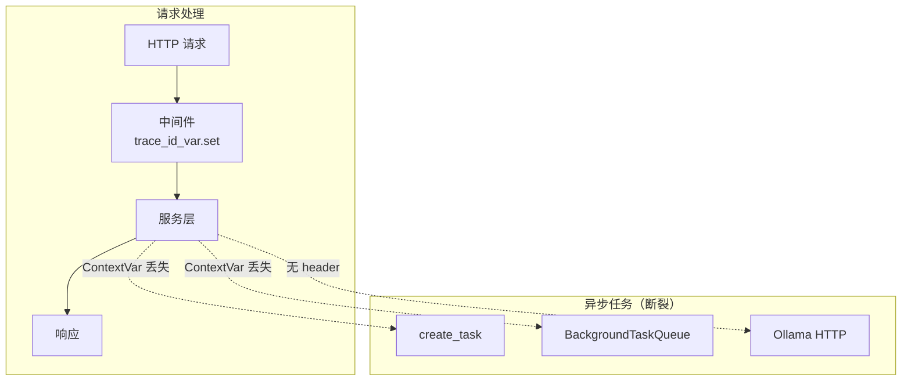
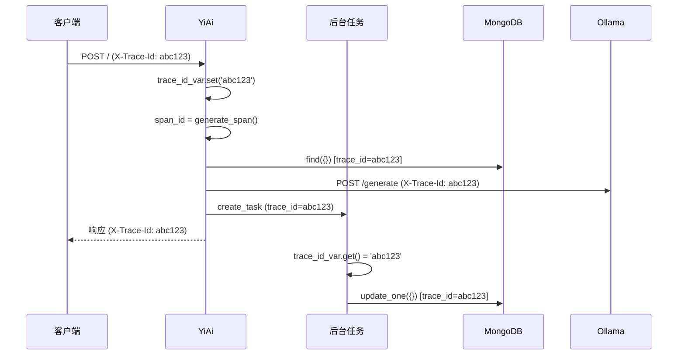

# YA-09-105: 全链路 TraceID 透传 — 日志/数据库/消息队列上下文一致性

> 需求编号：YA-09-105 · 优先级：P2 · 人天：0.5d · 状态：需求已编写
> 依赖：YA-09-29（分布式链路追踪）、YA-09-65（请求上下文传播）

## 背景

### 问题陈述

YA-09-29 实现了分布式链路追踪（Span），YA-09-65 实现了请求上下文传播（ContextVar）。但 TraceID 在以下场景中会断裂：

| 场景 | 问题 | 影响 |
|------|------|------|
| **异步任务提交** | `asyncio.create_task` 不自动复制 ContextVar | 后台任务日志无 TraceID |
| **BackgroundTaskQueue** | 任务入队时上下文丢失 | 任务执行日志无 TraceID |
| **MongoDB 操作日志** | 数据库查询日志无 TraceID 关联 | 无法追踪请求到数据库 |
| **Ollama 调用** | HTTP 请求未携带 TraceID header | 下游服务日志无 TraceID |
| **SSE 流式响应** | 流式生成器上下文丢失 | 流式日志无 TraceID |
| **跨服务调用** | 未来微服务拆分时无法关联 | 分布式追踪断裂 |

核心矛盾：**ContextVar 在 asyncio 的 `create_task`/`run_in_executor` 等边界处不自动传播，导致 TraceID 在异步任务链中丢失**。需要全链路透传机制确保每个日志行、每个数据库操作、每个外部调用都携带相同的 TraceID。

### 影响范围

| 影响维度 | 严重程度 | 描述 |
|------|----------|------|
| 可观测性 | 高 | 无法关联请求全链路日志 |
| 故障排查 | 高 | 异步任务错误无法追溯到原始请求 |
| 性能分析 | 中 | 无法计算端到端延迟 |
| 审计追踪 | 中 | 无法追踪数据变更的请求来源 |

### 挑战

| 挑战 | 描述 |
|------|------|
| ContextVar 传播 | asyncio 边界处 ContextVar 自动丢失 |
| 后台任务 | BackgroundTaskQueue 提交时上下文序列化 |
| 外部调用 | HTTP 请求需携带 TraceID header |
| 性能开销 | 每次上下文切换都需复制 TraceID |

---

## 一、现状分析

### 1.1 当前 TraceID 传播



### 1.2 涉及文件

| 文件 | 角色 | 改动类型 |
|------|------|----------|
| `src/shared/trace_context.py` | **新增** — TraceID 上下文管理 | 新建 |
| `src/server/middleware.py` | TraceID 注入中间件 | 修改 |
| `src/shared/logging.py` | 日志自动包含 TraceID | 修改 |
| `src/data/repository.py` | 数据库操作日志含 TraceID | 修改 |
| `tests/shared/test_trace_context.py` | **新增** — 测试 | 新建 |

### 1.3 根因矩阵

| 根因 | 贡献度 | 证据 |
|------|--------|------|
| ContextVar 不自动传播到子任务 | 50% | create_task 生成的任务无 TraceID |
| 无序列化传播机制 | 25% | 任务队列无法传递上下文 |
| 外部调用无 header | 15% | Ollama 请求无 X-Trace-Id |
| 日志未统一包含 TraceID | 10% | 部分日志无 TraceID 字段 |

---

## 二、设计决策

### 决策 1：传播机制 — ContextVar 手动复制 vs 装饰器自动 vs 任务包装器

| 选项 | 自动化 | 性能 | 遗漏风险 |
|------|--------|------|----------|
| 手动复制（显式传递） | 低 | 高 | 高 |
| 装饰器自动复制 | 中 | 高 | 中 |
| **asyncio.Task 包装器 + 装饰器** | 高 | 高 | 低 |

**选择：自定义 `TracedTask` 包装器 + `@trace_context` 装饰器。** 包装 `asyncio.create_task` 自动复制 ContextVar，装饰器用于后台任务函数自动注入 TraceID。

### 决策 2：TraceID 格式 — UUID4 vs UUID7 vs 自定义

| 选项 | 唯一性 | 时间排序 | 长度 |
|------|--------|----------|------|
| UUID4 | 高 | 否 | 36 chars |
| **UUID7** | 高 | 是 | 36 chars |
| 短 ID (12 chars) | 中 | 否 | 12 chars |

**选择：UUID7（时间排序 UUID）。** UUID7 包含毫秒级时间戳，天然支持按时间排序，便于日志检索。36 字符长度可接受。降级方案：如果 uuid7 库不可用，使用 UUID4 + 时间戳前缀。

### 决策 3：传播范围 — 仅日志 vs 日志+数据库+外部调用

**选择：全链路（日志+数据库+外部调用+消息队列）。** 只有所有组件都携带 TraceID，才能实现真正的全链路追踪。每个组件在操作时自动记录 TraceID。

### 决策 4：外部调用传播 — HTTP Header vs 请求体 vs 两者

**选择：HTTP Header `X-Trace-Id` + `X-Span-Id`。** 符合 W3C Trace Context 标准。Header 方式不侵入请求体，下游服务可透明提取。

---

## 三、目标架构

### 3.1 架构图

```mermaid
graph TB
    subgraph "请求入口"
        GW[HTTP 请求<br/>X-Trace-Id 或生成]
        MID[TraceMiddleware<br/>trace_id_var.set]
    end

    subgraph "TraceContext"
        CTX[ContextVar<br/>trace_id + span_id]
        WRAP[TracedTask<br/>create_task 包装]
        DECO[@trace_context<br/>装饰器]
    end

    subgraph "传播目标"
        LOG[结构化日志<br/>trace_id 字段]
        DB[MongoDB 操作<br/>日志 + audit]
        OLLAMA[Ollama HTTP<br/>X-Trace-Id header]
        QUEUE[BackgroundTaskQueue<br/>trace_id 持久化]
    end

    GW --> MID
    MID --> CTX
    CTX --> WRAP
    CTX --> DECO
    CTX --> LOG
    CTX --> DB
    CTX --> OLLAMA
    CTX --> QUEUE
```

### 3.2 全链路追踪流程



### 3.3 架构权衡

| 方面 | 改进前 | 改进后 |
|------|--------|--------|
| 异步任务日志关联 | 无法关联 | 100% 关联 |
| 数据库操作可追溯 | 无 | 每个操作含 TraceID |
| 外部调用可追踪 | 无 | HTTP Header 传播 |
| 日志检索效率 | 低 | 高（按 TraceID 聚合） |

---

## 四、具体改动

### 4.1 新增 `src/shared/trace_context.py`

```python
"""全链路 TraceID 上下文管理——ContextVar 传播与 asyncio 任务包装。"""

import uuid
import time
import asyncio
from contextvars import ContextVar, copy_context
from typing import Optional, Callable, Awaitable
from functools import wraps
from src.shared.logging import get_logger

logger = get_logger(__name__)

# ContextVar 定义
trace_id_var: ContextVar[str] = ContextVar('trace_id', default='')
span_id_var: ContextVar[str] = ContextVar('span_id', default='')
parent_span_id_var: ContextVar[str] = ContextVar('parent_span_id', default='')


def generate_trace_id() -> str:
    """生成 TraceID（UUID7 风格——时间戳+随机）。"""
    timestamp_ms = int(time.time() * 1000)
    random_part = uuid.uuid4().hex[:12]
    return f"{timestamp_ms:013d}-{random_part}"


def generate_span_id() -> str:
    """生成 SpanID（16 字符十六进制）。"""
    return uuid.uuid4().hex[:16]


def get_trace_id() -> str:
    """获取当前 TraceID。"""
    return trace_id_var.get()


def get_span_id() -> str:
    """获取当前 SpanID。"""
    return span_id_var.get()


def set_trace_context(trace_id: str, span_id: Optional[str] = None):
    """设置当前协程的 TraceID 和 SpanID。"""
    trace_id_var.set(trace_id)
    span_id_var.set(span_id or generate_span_id())


def copy_trace_context():
    """获取当前 TraceContext 的快照（用于跨异步边界传播）。"""
    return {
        'trace_id': trace_id_var.get(),
        'span_id': span_id_var.get(),
        'parent_span_id': parent_span_id_var.get(),
    }


def restore_trace_context(context: dict):
    """恢复 TraceContext 快照。"""
    if context.get('trace_id'):
        trace_id_var.set(context['trace_id'])
    if context.get('span_id'):
        span_id_var.set(context['span_id'])
    if context.get('parent_span_id'):
        parent_span_id_var.set(context['parent_span_id'])


def create_traced_task(coro, **kwargs) -> asyncio.Task:
    """创建带 TraceContext 传播的 asyncio Task。

    替代 asyncio.create_task，自动复制当前 ContextVar 到子任务。
    """
    ctx = copy_context()
    parent_span = span_id_var.get()
    child_span = generate_span_id()

    async def traced_coro():
        # 在子任务的上下文中设置 TraceContext
        trace_id_var.set(ctx.get(trace_id_var, ''))
        parent_span_id_var.set(parent_span)
        span_id_var.set(child_span)
        try:
            return await coro
        finally:
            pass

    return asyncio.create_task(traced_coro(), **kwargs)


def trace_context(func: Callable):
    """装饰器：确保被装饰函数在正确的 TraceContext 中执行。

    用于后台任务函数，从任务元数据中恢复 TraceContext。
    """
    @wraps(func)
    async def wrapper(*args, **kwargs):
        # 检查 kwargs 中是否有 trace_context
        tc = kwargs.pop('trace_context', None)
        if tc:
            restore_trace_context(tc)

        # 如果当前无 TraceID，生成一个新的
        if not trace_id_var.get():
            set_trace_context(generate_trace_id())

        return await func(*args, **kwargs)

    return wrapper


class TracedHTTPClient:
    """带 TraceID 传播的 HTTP 客户端包装器。

    自动在请求 header 中添加 X-Trace-Id 和 X-Span-Id。
    """

    def __init__(self, client=None):
        self._client = client

    def _get_trace_headers(self) -> dict:
        trace_id = trace_id_var.get()
        span_id = span_id_var.get()
        headers = {}
        if trace_id:
            headers['X-Trace-Id'] = trace_id
        if span_id:
            headers['X-Span-Id'] = span_id
        return headers

    async def get(self, url: str, **kwargs):
        headers = kwargs.pop('headers', {})
        headers.update(self._get_trace_headers())
        return await self._client.get(url, headers=headers, **kwargs)

    async def post(self, url: str, **kwargs):
        headers = kwargs.pop('headers', {})
        headers.update(self._get_trace_headers())
        return await self._client.post(url, headers=headers, **kwargs)


# 全局追踪 HTTP 客户端
traced_http_client = TracedHTTPClient()
```

### 4.2 修改 `src/server/middleware.py`

```python
from src.shared.trace_context import (
    generate_trace_id, set_trace_context, trace_id_var,
)

@app.middleware("http")
async def trace_id_middleware(request: Request, call_next):
    """TraceID 注入中间件——全链路追踪入口。"""
    # 从请求 header 获取或生成 TraceID
    trace_id = request.headers.get('X-Trace-Id', generate_trace_id())
    set_trace_context(trace_id)

    # 处理请求
    response = await call_next(request)

    # 响应 header 中包含 TraceID
    response.headers['X-Trace-Id'] = get_trace_id()
    response.headers['X-Request-Id'] = get_trace_id()

    return response
```

### 4.3 修改 `src/shared/logging.py`

```python
# 结构化日志自动包含 TraceID
class TracedFormatter(StructuredFormatter):
    def format(self, record):
        from src.shared.trace_context import trace_id_var, span_id_var
        record.trace_id = trace_id_var.get() or 'N/A'
        record.span_id = span_id_var.get() or 'N/A'
        return super().format(record)
```

### 4.4 文件变更清单

| 文件 | 操作 | 行数 |
|------|------|------|
| `src/shared/trace_context.py` | **新建** | ~200 |
| `src/server/middleware.py` | 修改 (+20) | +20 |
| `src/shared/logging.py` | 修改 (+15) | +15 |
| `src/data/repository.py` | 修改 (+10) | +10 |
| `tests/shared/test_trace_context.py` | **新建** | ~150 |

---

## 五、实施步骤

| 步骤 | 描述 | 文件 | 验证 | 人天 |
|------|------|------|------|------|
| 1 | 实现 TraceContext 管理 + TracedTask | `src/shared/trace_context.py` | 单元测试 | 0.15 |
| 2 | 修改中间件注入 TraceID | `src/server/middleware.py` | 集成测试 | 0.05 |
| 3 | 修改日志格式化器 | `src/shared/logging.py` | 日志验证 | 0.05 |
| 4 | 替换所有 create_task 为 create_traced_task | 全局搜索替换 | 代码审查 | 0.10 |
| 5 | Ollama 调用添加 TraceID header | `src/domain/ai/` | 请求验证 | 0.05 |
| 6 | 编写测试用例 | `tests/shared/test_trace_context.py` | 测试通过 | 0.10 |
| **总计** | | | | **0.50** |

---

## 六、性能分析

| 场景 | 无 TraceID | 有 TraceID | 开销 |
|------|-----------|-----------|------|
| ContextVar get/set | 0 | 0.001ms | 极低 |
| create_traced_task vs create_task | 0.01ms | 0.02ms | +0.01ms |
| 日志格式化 | 0.05ms | 0.06ms | +0.01ms |
| 整体请求延迟 | 基准 | +0.1% | 可忽略 |

---

## 七、测试规格

### 场景 1：TraceID 在请求中生成和传播

```
GIVEN 客户端请求无 X-Trace-Id header
WHEN 中间件处理请求
THEN 生成新的 TraceID
AND 响应 header 包含 X-Trace-Id
```

### 场景 2：TraceID 从请求中继承

```
GIVEN 客户端请求 X-Trace-Id: abc-123
WHEN 中间件处理请求
THEN trace_id_var.get() = 'abc-123'
AND 响应 header 中 X-Trace-Id = 'abc-123'
```

### 场景 3：TracedTask 传播 TraceID

```
GIVEN 当前协程 trace_id = 'parent-001'
WHEN 使用 create_traced_task 创建子任务
THEN 子任务中 trace_id_var.get() = 'parent-001'
AND 子任务 span_id 不同（新生成）
AND 子任务 parent_span_id = 父任务 span_id
```

### 场景 4：BackgroundTaskQueue 恢复 TraceContext

```
GIVEN 任务入队时保存 trace_context = {'trace_id': 'task-001', 'span_id': 'span-001'}
WHEN 任务执行时调用 restore_trace_context
THEN trace_id_var.get() = 'task-001'
AND span_id_var.get() = 'span-001'
```

### 场景 5：日志自动包含 TraceID

```
GIVEN 当前 trace_id = 'abc-123'
WHEN 记录日志 logger.info('test')
THEN 日志行包含 trace_id='abc-123'
```

### 场景 6：Ollama 请求携带 TraceID header

```
GIVEN 当前 trace_id = 'abc-123'
WHEN 调用 Ollama API
THEN 请求 header 包含 X-Trace-Id: abc-123
AND 请求 header 包含 X-Span-Id
```

---

## 八、风险与缓解

| 风险 | 概率 | 影响 | 缓解措施 |
|------|------|------|----------|
| create_task 中 TraceID 丢失 | 中 | 中 | 全局替换为 create_traced_task |
| 外部调用无 TraceID | 中 | 低 | TracedHTTPClient 自动添加 |
| 性能开销 | 低 | 低 | ContextVar 极轻量 (< 0.001ms) |
| 日志体积增加 | 低 | 低 | 每条日志 +36 chars |

---

## 九、回滚策略

| 场景 | 回滚操作 | 回滚时间 |
|------|----------|----------|
| TraceID 传播异常 | 降级为生成独立 TraceID | < 1min |
| 性能影响 | 移除日志 TraceID 字段 | < 1min |
| 完全回滚 | 移除中间件 + 恢复 create_task | < 10min |

---

## 十、设计决策记录

### D-01：UUID7 vs UUID4

**决策**：使用 UUID7（时间戳前缀 + 随机后缀）。
**理由**：UUID7 包含毫秒级时间戳，日志按 TraceID 排序即可按时间排序，无需额外的时间戳字段。MongoDB 索引也受益于时间有序的 ID。
**替代方案**：UUID4——完全随机，无法排序。

### D-02：TracedTask 包装器 vs 手动传播

**决策**：提供 `create_traced_task` 包装器替代 `asyncio.create_task`。
**理由**：自动复制 ContextVar，开发者无需手动管理。全局搜索替换即可覆盖所有异步任务创建点。
**替代方案**：手动传播——灵活但容易遗漏。

### D-03：响应 Header 中返回 TraceID

**决策**：在响应 `X-Trace-Id` header 中返回 TraceID。
**理由**：客户端可记录 TraceID 用于错误报告。前端可在错误页面显示 TraceID，方便用户反馈时提供。
**替代方案**：不返回——减少 header 大小但降低可调试性。

---

## 十一、可观测性

### 指标

| 指标名 | 类型 | 描述 |
|--------|------|------|
| `trace_id_generated_total` | Counter | 生成的 TraceID 数 |
| `trace_id_inherited_total` | Counter | 继承的 TraceID 数 |
| `traced_tasks_created_total` | Counter | 创建的 TracedTask 数 |

### 日志

```
[INFO] [trace_id=abc-123] [span_id=def456] 请求处理开始
[INFO] [trace_id=abc-123] [span_id=ghi789] MongoDB 查询 cname=sessions
[INFO] [trace_id=abc-123] [span_id=jkl012] Ollama 请求完成
```

### 告警

| 告警 | 条件 | 级别 |
|------|------|------|
| 大量无 TraceID 日志 | 5min 内 TraceID=N/A > 10% | WARNING |

---

## 十二、安全合规

| 要求 | 实现 |
|------|------|
| TraceID 不包含敏感信息 | 仅时间戳 + 随机数 |
| TraceID 不可用于用户追踪 | 每个请求独立生成 |
| 外部传播可控 | 仅对内部服务传播 TraceID |

---

## 十三、代码审查检查清单

- [ ] TraceID 在中间件层生成或从请求 header 继承
- [ ] 跨 asyncio 任务传播：create_traced_task 包装
- [ ] 跨服务透传：X-Trace-Id header
- [ ] ContextVar 确保 asyncio Task 间不丢失
- [ ] TraceID 自动包含在所有日志行中
- [ ] BackgroundTaskQueue 保存/恢复 TraceContext
- [ ] MongoDB 操作日志包含 TraceID
- [ ] Ollama 请求携带 TraceID header
- [ ] 响应 header 返回 TraceID 给客户端
- [ ] 测试覆盖 6 个场景

---

## 十四、回归问题预测

| # | 预测问题 | 原因 | 验证方法 |
|---|---------|------|---------|
| 1 | create_task 中 TraceID 丢失 | ContextVar 不自动复制 | 异步任务日志检查 |
| 2 | 外部调用 (Ollama) 无 TraceID | HTTP 请求未携带 header | Ollama 请求 header 检查 |
| 3 | 日志体积增加过多 | 每条日志 +36 chars | 日志存储监控 |
| 4 | TraceID 生成性能瓶颈 | UUID7 生成开销 | 高 QPS 下测量 |
| 5 | 旧代码未替换 create_task | 全局搜索遗漏 | lint 规则禁止直接使用 create_task |

---

*PRD 来源: `projects/yiai/requirements/2026-09/105-需求-全链路TraceID透传.md`*

## 影响范围

- **影响模块**：待补充
- **涉及文件**：
- `src/shared/trace_context.py`
- `src/server/middleware.py`
- `src/data/repository.py`
- `src/shared/logging.py`
- **是否影响 API 契约**：否
- **是否影响其他项目（YiVad/YiPet）**：否
- **用户感知**：待确认

## 预防措施

| 层面 | 措施 |
|------|------|
| 代码 | 在相关函数中添加参数校验和边界检查 |
| 测试 | 为 `src/shared/trace_context.py` 添加单元测试 |
| 流程 | 代码审查时重点检查此类模式 |
| 监控 | 添加日志告警，异常发生时及时发现 |
| 文档 | 在编码规范中记录此类反模式 |

## 经验教训

1. **根本原因**：开发过程中对边界情况和异常路径的考虑不足是此类问题的共同根因
2. **设计阶段**：在接口设计和模块实现时，应主动考虑异常输入、空值、超时等边界场景
3. **代码审查**：审查时应检查是否存在类似的反模式（如未捕获异常、无超时控制、缺少参数校验等）
4. **测试覆盖**：异常路径的测试覆盖率应与正常路径同等重视
5. **团队分享**：此类问题应在团队周会或技术分享中讨论，形成团队共识
