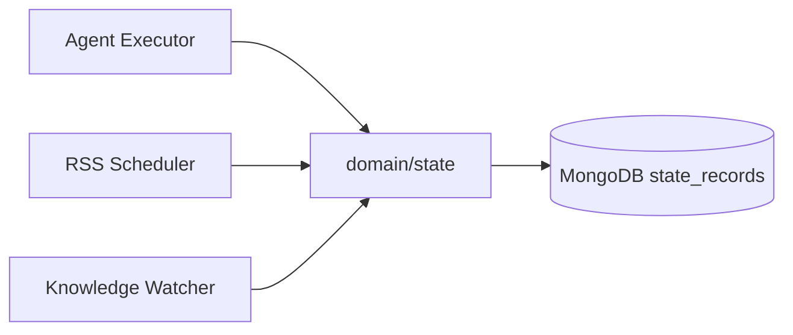

---

doc_type: module
prd_id: "YA-09-114"
title: "YA-09-114: 状态记录服务 — 通用键值状态持久化 CRUD"
status: 已完成
priority: P1
owner: Claude
roles: [engineer]
created: 2026-09-23
updated: 2026-09-23
project: YiAi
project_id: yiai
prd_month: "202609"
related_tasks: ["114-prd-task-状态记录服务.md"]
related_tests: ["114-prd-test-状态记录服务.md"]
tags: [state, crud, persistence, key-value]

type: 需求
---

# YA-09-114: 状态记录服务

> **PRD 版本**：v3.0 · **状态**：已完成

## 1. 背景

YiAi 多个模块（Agent 执行状态、RSS 抓取进度、知识库扫描游标）需要持久化状态记录。`domain/state/` 提供通用键值状态 CRUD，避免各模块各自实现状态存储。

## 2. 范围

**In scope**：`domain/state/` — 状态记录创建/查询/更新/删除 + TTL 过期 + `state_records` MongoDB 集合

| 优先级 | 故事 | 验收标准 |
|--------|------|---------|
| P1 | 通用状态 CRUD | create/query/update/delete 四操作 |
| P1 | TTL 过期 | 过期记录自动清理 |

## 3. 时间线

历史实现