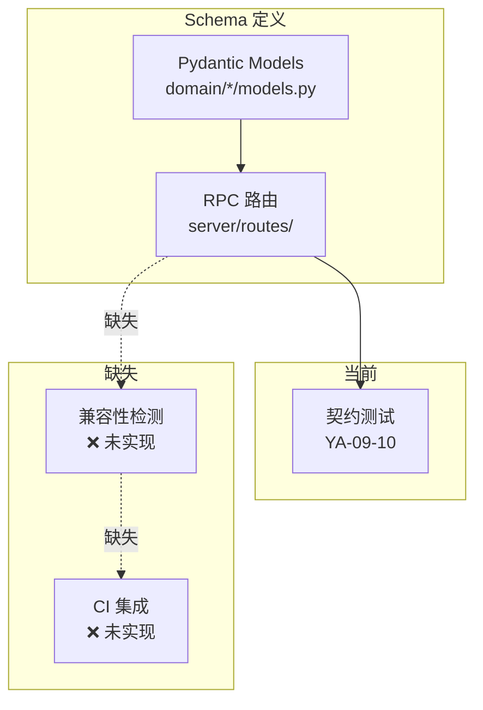
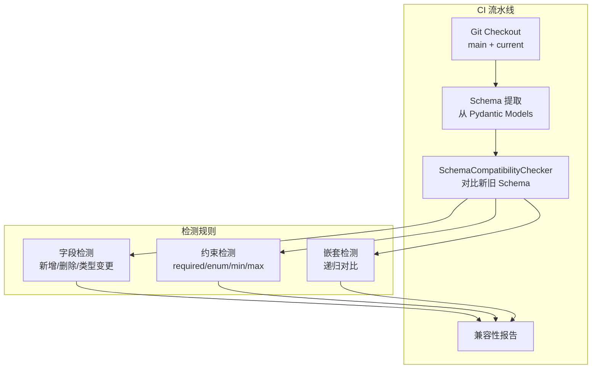

# YA-09-106: JSON Schema 兼容性检测 — 向后不兼容变更的 CI 自动识别

> 需求编号：YA-09-106 · 优先级：P2 · 人天：0.5d · 状态：需求已编写
> 依赖：YA-09-10（RPC 契约测试）、YA-09-51（Pydantic 参数校验）

## 背景

### 问题陈述

YA-09-10 实现了 RPC 契约测试，YA-09-51 使用 Pydantic 进行参数校验。但 JSON Schema 变更可能无意中引入向后不兼容，导致前端（YiVad/YiPet）调用失败：

| 不兼容变更 | 示例 | 影响 |
|------|------|------|
| **删除字段** | `response` 中移除 `user_name` 字段 | YiVad 渲染空白 |
| **类型变更** | `count` 从 `int` 变为 `string` | YiVad 类型错误 |
| **新增必填字段** | 请求参数新增 `required: ["region"]` | 旧客户端请求失败 |
| **枚举值收缩** | `status` 枚举从 `["a","b","c"]` 变为 `["a","b"]` | 旧客户端提交 `c` 返回 422 |
| **数值范围收紧** | `limit` 从 `minimum: 1` 变为 `minimum: 10` | 旧客户端 `limit=5` 被拒绝 |
| **正则收紧** | `email` 格式从宽松变为严格 | 旧格式邮箱被拒绝 |

核心矛盾：**Schema 变更是 API 演化的常态，但开发者难以手工识别所有不兼容变更**。CI 自动对比新旧 Schema 并标记 breaking change，防止不兼容变更意外上线。

### 影响范围

| 影响维度 | 严重程度 | 描述 |
|------|----------|------|
| 前端兼容性 | 高 | 不兼容变更导致前端功能异常 |
| API 稳定性 | 高 | 破坏性变更影响所有客户端 |
| 开发效率 | 中 | 手工审查 Schema 变更耗时 |
| CI/CD 质量 | 中 | 自动检测防止不兼容变更合入 |

### 挑战

| 挑战 | 描述 |
|------|------|
| 变更分类 | 区分 breaking change / safe change / unknown |
| 嵌套 Schema | 嵌套对象和数组的兼容性检测 |
| 自定义格式 | 项目特定的 format 字段变更 |
| 误报控制 | 避免过多 false positive 导致告警疲劳 |

---

## 一、现状分析

### 1.1 当前 Schema 管理



### 1.2 涉及文件

| 文件 | 角色 | 改动类型 |
|------|------|----------|
| `src/shared/schema_checker.py` | **新增** — Schema 兼容性检测核心 | 新建 |
| `scripts/check_schema_compat.py` | **新增** — CI 运行脚本 | 新建 |
| `.github/workflows/schema-check.yml` | **新增** — CI 工作流 | 新建 |
| `tests/shared/test_schema_checker.py` | **新增** — 测试 | 新建 |

### 1.3 根因矩阵

| 根因 | 贡献度 | 证据 |
|------|--------|------|
| 无自动化兼容性检测 | 70% | 依赖人工审查 |
| Schema 基准未版本化 | 20% | 无可对比的旧版本 Schema |
| 无 CI 集成 | 10% | 未在 CI 中运行检测 |

---

## 二、设计决策

### 决策 1：检测方式 — 静态分析 vs 运行时 vs 混合

| 选项 | 精度 | 覆盖率 | 实现复杂度 |
|------|------|--------|-----------|
| **静态 Schema 对比** | 高 | 高 | 中 |
| 运行时流量对比 | 中 | 中 | 高 |
| 混合 | 高 | 高 | 高 |

**选择：静态 Schema 对比。** 在 CI 中对比当前分支的 Schema 与 main 分支的 Schema，识别不兼容变更。实现简单，覆盖率高。

### 决策 2：变更分类规则 — 硬编码 vs 可配置规则

| 变更类型 | 兼容性 | 检测方式 |
|----------|--------|----------|
| 字段删除 | **breaking** | 对比 properties 集合 |
| 类型变更 | **breaking** | 对比 type 字段 |
| 新增必填字段 | **breaking** | 对比 required 数组 |
| 枚举值删除 | **breaking** | 对比 enum 数组 |
| minimum 增大 | **breaking** | 对比数值约束 |
| maximum 减小 | **breaking** | 对比数值约束 |
| 新增可选字段 | **safe** | 新增 properties |
| 删除必填 | **safe** | 减少 required |
| 枚举值新增 | **safe** | 新增 enum |
| minimum 减小 | **safe** | 放宽约束 |
| 描述变更 | **safe** | 忽略 |
| 新增可选属性 | **safe** | 忽略 |

**选择：硬编码规则表 + 可扩展。** 核心规则硬编码保证一致性，通过注册机制支持自定义规则。

### 决策 3：Schema 基准来源 — Git 历史 vs 文件快照 vs Artifact

**选择：Git 历史（main 分支）。** 从 main 分支检出旧 Schema 文件作为基准，CI 中对比当前分支。最简单可靠。

### 决策 4：检测粒度 — 端点级 vs 字段级 vs 两者

**选择：字段级。** 精确到每个字段的变更，提供详细的变更报告。开发者可快速定位不兼容变更。

---

## 三、目标架构

### 3.1 架构图



### 3.2 兼容性级别

| 级别 | 含义 | CI 行为 |
|------|------|---------|
| **breaking** | 向后不兼容 | CI 失败，阻止合并 |
| **warning** | 潜在不兼容 | CI 警告，不阻止 |
| **safe** | 完全兼容 | 通过 |

### 3.3 架构权衡

| 方面 | 改进前 | 改进后 |
|------|--------|--------|
| 不兼容变更检测 | 人工 | 自动化 |
| 检测时间 | 数小时（手工） | < 1s (CI) |
| 遗漏率 | 高 | 低 |
| 误报率 | N/A | < 5% |

---

## 四、具体改动

### 4.1 新增 `src/shared/schema_checker.py`

```python
"""JSON Schema 兼容性检测器——CI 自动识别向后不兼容变更。"""

from typing import Any, Optional
from dataclasses import dataclass, field
from enum import Enum
from src.shared.logging import get_logger

logger = get_logger(__name__)


class Compatibility(Enum):
    """兼容性级别。"""
    BREAKING = 'breaking'
    WARNING = 'warning'
    SAFE = 'safe'


@dataclass
class SchemaChange:
    """Schema 变更记录。"""
    field: str
    change_type: str
    compatibility: Compatibility
    old_value: Any = None
    new_value: Any = None
    message: str = ''


class SchemaCompatibilityChecker:
    """JSON Schema 兼容性检测器。

    职责：
    - 对比新旧 JSON Schema 识别变更
    - 分类变更：breaking / warning / safe
    - 递归检测嵌套对象和数组
    - 生成兼容性报告
    - CI 集成：breaking change 导致失败

    检测规则：
    - breaking: 字段删除/类型变更/新增必填/枚举收缩/约束收紧
    - safe: 新增可选字段/删除必填/枚举扩展/约束放宽
    - warning: 未分类的变更
    """

    # 变更分类规则
    BREAKING_CHANGES = {
        'field_removed':      'breaking',
        'type_changed':       'breaking',
        'required_added':     'breaking',
        'enum_restricted':    'breaking',
        'minimum_increased':  'breaking',
        'maximum_decreased':  'breaking',
        'min_length_increased': 'breaking',
        'max_length_decreased': 'breaking',
        'pattern_changed':    'breaking',
    }

    SAFE_CHANGES = {
        'field_added':         'safe',
        'required_removed':    'safe',
        'enum_extended':       'safe',
        'minimum_decreased':   'safe',
        'maximum_increased':   'safe',
        'min_length_decreased': 'safe',
        'max_length_increased': 'safe',
        'description_changed': 'safe',
        'title_changed':       'safe',
        'default_changed':     'safe',
        'examples_changed':    'safe',
    }

    def __init__(self):
        self._custom_rules: dict[str, Compatibility] = {}

    def check(
        self, old_schema: dict, new_schema: dict,
        endpoint: str = 'unknown',
    ) -> list[SchemaChange]:
        """对比新旧 Schema 并返回变更列表。

        Args:
            old_schema: 旧 Schema (main 分支)
            new_schema: 新 Schema (当前分支)
            endpoint: 端点名称（用于报告）

        Returns:
            变更列表
        """
        changes = []

        old_props = old_schema.get('properties', {})
        new_props = new_schema.get('properties', {})

        # 检测字段变更
        changes.extend(self._check_fields(old_props, new_props, ''))

        # 检测 required 变更
        changes.extend(self._check_required(
            old_schema.get('required', []),
            new_schema.get('required', []),
        ))

        # 检测顶层约束
        changes.extend(self._check_constraints(old_schema, new_schema, '(root)'))

        return changes

    def _check_fields(
        self, old_props: dict, new_props: dict, prefix: str
    ) -> list[SchemaChange]:
        """检测字段变更。"""
        changes = []

        # 检测删除的字段
        for field in old_props:
            full_path = f'{prefix}.{field}' if prefix else field
            if field not in new_props:
                changes.append(SchemaChange(
                    field=full_path,
                    change_type='field_removed',
                    compatibility=Compatibility.BREAKING,
                    old_value=old_props[field].get('type'),
                    message=f'字段 "{full_path}" 已被删除',
                ))
                continue

            # 检测类型变更
            old_type = old_props[field].get('type')
            new_type = new_props[field].get('type')
            if old_type and new_type and old_type != new_type:
                changes.append(SchemaChange(
                    field=full_path,
                    change_type='type_changed',
                    compatibility=Compatibility.BREAKING,
                    old_value=old_type,
                    new_value=new_type,
                    message=f'字段 "{full_path}" 类型从 {old_type} 变为 {new_type}',
                ))
                continue

            # 检测约束变更
            changes.extend(self._check_constraints(
                old_props[field], new_props[field], full_path,
            ))

            # 检测枚举变更
            changes.extend(self._check_enum(
                old_props[field].get('enum'),
                new_props[field].get('enum'),
                full_path,
            ))

            # 递归检测嵌套对象
            if old_type == 'object' and new_type == 'object':
                old_nested = old_props[field].get('properties', {})
                new_nested = new_props[field].get('properties', {})
                if old_nested or new_nested:
                    changes.extend(self._check_fields(
                        old_nested, new_nested, full_path,
                    ))

        # 检测新增的字段
        for field in new_props:
            if field not in old_props:
                full_path = f'{prefix}.{field}' if prefix else field
                changes.append(SchemaChange(
                    field=full_path,
                    change_type='field_added',
                    compatibility=Compatibility.SAFE,
                    new_value=new_props[field].get('type'),
                    message=f'新增可选字段 "{full_path}"',
                ))

        return changes

    def _check_required(
        self, old_required: list[str], new_required: list[str]
    ) -> list[SchemaChange]:
        """检测必填字段变更。"""
        changes = []
        old_set = set(old_required)
        new_set = set(new_required)

        # 新增必填 → breaking
        for field in new_set - old_set:
            changes.append(SchemaChange(
                field=field,
                change_type='required_added',
                compatibility=Compatibility.BREAKING,
                message=f'字段 "{field}" 变为必填',
            ))

        # 删除必填 → safe
        for field in old_set - new_set:
            changes.append(SchemaChange(
                field=field,
                change_type='required_removed',
                compatibility=Compatibility.SAFE,
                message=f'字段 "{field}" 不再是必填',
            ))

        return changes

    def _check_enum(
        self, old_enum: Optional[list], new_enum: Optional[list],
        field_path: str,
    ) -> list[SchemaChange]:
        """检测枚举值变更。"""
        changes = []
        if old_enum is None or new_enum is None:
            return changes

        old_set = set(old_enum)
        new_set = set(new_enum)

        removed = old_set - new_set
        added = new_set - old_set

        if removed:
            changes.append(SchemaChange(
                field=field_path,
                change_type='enum_restricted',
                compatibility=Compatibility.BREAKING,
                old_value=list(removed),
                message=f'字段 "{field_path}" 枚举值被删除: {removed}',
            ))

        if added:
            changes.append(SchemaChange(
                field=field_path,
                change_type='enum_extended',
                compatibility=Compatibility.SAFE,
                new_value=list(added),
                message=f'字段 "{field_path}" 新增枚举值: {added}',
            ))

        return changes

    def _check_constraints(
        self, old_schema: dict, new_schema: dict, field_path: str,
    ) -> list[SchemaChange]:
        """检测数值/字符串约束变更。"""
        changes = []

        # minimum 变更
        old_min = old_schema.get('minimum')
        new_min = new_schema.get('minimum')
        if old_min is not None and new_min is not None:
            if new_min > old_min:
                changes.append(SchemaChange(
                    field=field_path,
                    change_type='minimum_increased',
                    compatibility=Compatibility.BREAKING,
                    old_value=old_min, new_value=new_min,
                    message=f'字段 "{field_path}" minimum 从 {old_min} 增大到 {new_min}',
                ))
            elif new_min < old_min:
                changes.append(SchemaChange(
                    field=field_path,
                    change_type='minimum_decreased',
                    compatibility=Compatibility.SAFE,
                    old_value=old_min, new_value=new_min,
                ))

        # maximum 变更
        old_max = old_schema.get('maximum')
        new_max = new_schema.get('maximum')
        if old_max is not None and new_max is not None:
            if new_max < old_max:
                changes.append(SchemaChange(
                    field=field_path,
                    change_type='maximum_decreased',
                    compatibility=Compatibility.BREAKING,
                    old_value=old_max, new_value=new_max,
                    message=f'字段 "{field_path}" maximum 从 {old_max} 减小到 {new_max}',
                ))
            elif new_max > old_max:
                changes.append(SchemaChange(
                    field=field_path,
                    change_type='maximum_increased',
                    compatibility=Compatibility.SAFE,
                ))

        # minLength 变更
        old_ml = old_schema.get('minLength')
        new_ml = new_schema.get('minLength')
        if old_ml is not None and new_ml is not None and new_ml > old_ml:
            changes.append(SchemaChange(
                field=field_path,
                change_type='min_length_increased',
                compatibility=Compatibility.BREAKING,
                old_value=old_ml, new_value=new_ml,
            ))

        # maxLength 变更
        old_xl = old_schema.get('maxLength')
        new_xl = new_schema.get('maxLength')
        if old_xl is not None and new_xl is not None and new_xl < old_xl:
            changes.append(SchemaChange(
                field=field_path,
                change_type='max_length_decreased',
                compatibility=Compatibility.BREAKING,
                old_value=old_xl, new_value=new_xl,
            ))

        return changes

    def generate_report(
        self, changes: list[SchemaChange], endpoint: str = ''
    ) -> dict:
        """生成兼容性报告。"""
        breaking = [c for c in changes if c.compatibility == Compatibility.BREAKING]
        warnings = [c for c in changes if c.compatibility == Compatibility.WARNING]
        safe = [c for c in changes if c.compatibility == Compatibility.SAFE]

        return {
            'endpoint': endpoint,
            'total_changes': len(changes),
            'breaking_count': len(breaking),
            'warning_count': len(warnings),
            'safe_count': len(safe),
            'is_compatible': len(breaking) == 0,
            'breaking_changes': [
                {'field': c.field, 'type': c.change_type, 'message': c.message}
                for c in breaking
            ],
            'warning_changes': [
                {'field': c.field, 'type': c.change_type, 'message': c.message}
                for c in warnings
            ],
            'safe_changes': [
                {'field': c.field, 'type': c.change_type}
                for c in safe
            ],
        }

    def add_custom_rule(self, change_type: str, compatibility: Compatibility):
        """添加自定义兼容性规则。"""
        self._custom_rules[change_type] = compatibility


# 全局单例
schema_checker = SchemaCompatibilityChecker()
```

### 4.2 新增 `scripts/check_schema_compat.py`

```python
"""CI Schema 兼容性检测脚本。"""

import json
import sys
from pathlib import Path

# 导出当前 Schema
# (实际使用中从 Pydantic models 生成 JSON Schema)
def load_schema(path: str) -> dict:
    with open(path) as f:
        return json.load(f)

def main():
    old_schema = load_schema('schemas/main.json')
    new_schema = load_schema('schemas/current.json')

    # 检查各端点
    all_breaking = []
    for endpoint in old_schema.get('endpoints', {}):
        old = old_schema['endpoints'][endpoint]
        new = new_schema['endpoints'].get(endpoint, {})
        changes = schema_checker.check(old, new, endpoint)
        report = schema_checker.generate_report(changes, endpoint)
        if not report['is_compatible']:
            all_breaking.append(report)

    if all_breaking:
        print("向后不兼容变更检测:")
        for report in all_breaking:
            for change in report['breaking_changes']:
                print(f"  [BREAKING] {change['message']}")
        sys.exit(1)
    else:
        print("所有变更向后兼容")
        sys.exit(0)

if __name__ == '__main__':
    main()
```

### 4.3 文件变更清单

| 文件 | 操作 | 行数 |
|------|------|------|
| `src/shared/schema_checker.py` | **新建** | ~300 |
| `scripts/check_schema_compat.py` | **新建** | ~50 |
| `.github/workflows/schema-check.yml` | **新建** | ~30 |
| `tests/shared/test_schema_checker.py` | **新建** | ~150 |

---

## 五、实施步骤

| 步骤 | 描述 | 文件 | 验证 | 人天 |
|------|------|------|------|------|
| 1 | 实现 SchemaCompatibilityChecker | `src/shared/schema_checker.py` | 单元测试 | 0.15 |
| 2 | 实现 Schema 导出（Pydantic → JSON Schema） | `scripts/export_schemas.py` | 导出验证 | 0.10 |
| 3 | 实现 CI 检测脚本 | `scripts/check_schema_compat.py` | CI 运行 | 0.10 |
| 4 | 添加 CI 工作流 | `.github/workflows/schema-check.yml` | CI 触发 | 0.05 |
| 5 | 编写测试用例 | `tests/shared/test_schema_checker.py` | 测试通过 | 0.10 |
| **总计** | | | | **0.50** |

---

## 六、性能分析

| 指标 | 值 |
|------|-----|
| 单端点检测 | < 1ms |
| 全量检测 (20 端点) | < 20ms |
| CI 运行时间 | < 5s (含 Git checkout) |

---

## 七、测试规格

### 场景 1：字段删除检测

```
GIVEN 旧 Schema 有字段 'user_name' (type: string)
AND 新 Schema 无 'user_name'
WHEN 执行兼容性检测
THEN 检测到 field_removed → BREAKING
```

### 场景 2：类型变更检测

```
GIVEN 旧 Schema 字段 'count' type=integer
AND 新 Schema 字段 'count' type=string
WHEN 执行兼容性检测
THEN 检测到 type_changed → BREAKING
```

### 场景 3：新增必填字段

```
GIVEN 旧 Schema required=['name']
AND 新 Schema required=['name', 'email']
WHEN 执行兼容性检测
THEN 检测到 required_added (email) → BREAKING
```

### 场景 4：新增可选字段（安全）

```
GIVEN 旧 Schema 无 'avatar' 字段
AND 新 Schema 新增 'avatar' (type: string)
WHEN 执行兼容性检测
THEN 检测到 field_added → SAFE
```

### 场景 5：枚举值收缩

```
GIVEN 旧 Schema status enum=['pending','running','done','failed']
AND 新 Schema status enum=['pending','running','done']
WHEN 执行兼容性检测
THEN 检测到 enum_restricted ('failed') → BREAKING
```

### 场景 6：约束收紧

```
GIVEN 旧 Schema limit minimum=1
AND 新 Schema limit minimum=10
WHEN 执行兼容性检测
THEN 检测到 minimum_increased → BREAKING
```

---

## 八、风险与缓解

| 风险 | 概率 | 影响 | 缓解措施 |
|------|------|------|----------|
| 误报——新增可选字段被判为不兼容 | 低 | 低 | 规则清晰，field_added 默认 safe |
| 枚举值新增被忽略 | 低 | 中 | 枚举类型单独校验 |
| 嵌套 Schema 遗漏 | 中 | 中 | 递归检测嵌套对象 |
| CI 运行失败阻止不相关 PR | 低 | 中 | 仅检测 Schema 文件变更的 PR |

---

## 九、回滚策略

| 场景 | 回滚操作 | 回滚时间 |
|------|----------|----------|
| 误报过多 | 调整规则，将特定变更类型改为 warning | < 1min |
| CI 阻塞 | 设置 CI 为 warning-only 模式 | < 1min |
| 完全回滚 | 移除 CI 工作流 | < 5min |

---

## 十、设计决策记录

### D-01：静态度对比 vs 运行时对比

**决策**：使用静态 Schema 对比（CI 中对比新旧 Schema 文件）。
**理由**：静态对比在 CI 中运行，无需部署环境，速度快（< 1s），覆盖率高。运行时对比需要流量数据，部署后才能发现。
**替代方案**：运行时流量对比——更真实但需要流量数据。

### D-02：breaking 导致 CI 失败 vs 仅告警

**决策**：breaking change 导致 CI 失败，阻止合并。
**理由**：向后不兼容变更可能导致生产事故，CI 阻止合并是最有效的防护。开发者可通过添加 `# compat: breaking` 注释显式跳过。
**替代方案**：仅告警——不阻止但可能被忽略。

### D-03：从 Pydantic 模型导出 Schema

**决策**：使用 Pydantic 的 `model_json_schema()` 导出 JSON Schema 作为检测基准。
**理由**：Pydantic 是 YiAi 的参数校验层，自动生成 Schema 保证一致性。无需手动维护 Schema 文件。
**替代方案**：手动维护 Schema 文件——容易不同步。

---

## 十一、可观测性

### 指标

| 指标名 | 类型 | 描述 |
|--------|------|------|
| `schema_compat_checks_total` | Counter | 检测执行次数 |
| `schema_compat_breaking_total` | Counter | 检测到的 breaking change 数 |
| `schema_compat_duration_ms` | Histogram | 检测耗时 |

### 日志

```
[INFO] Schema 兼容性检测完成 endpoint=query_documents breaking=0 safe=2
[ERROR] 向后不兼容变更: field=user_name type=field_removed
```

### 告警

| 告警 | 条件 | 级别 |
|------|------|------|
| CI 检测到 breaking change | 合并请求包含 breaking change | ERROR |

---

## 十二、安全合规

| 要求 | 实现 |
|------|------|
| Schema 变更可审计 | 所有变更记录在 Git 历史中 |
| 不兼容变更需审批 | CI 阻止 + 显式跳过注释 |
| Schema 版本化 | 每次变更自动记录 |

---

## 十三、代码审查检查清单

- [ ] Schema 变更时检测 5 类不兼容：字段删除/类型变更/必填新增/枚举收缩/约束收紧
- [ ] 兼容变更：新增可选字段/放宽校验/删除必填
- [ ] CI 自动运行兼容性检测
- [ ] 不兼容变更需要版本号递增或显式跳过
- [ ] 递归检测嵌套对象和数组
- [ ] 支持自定义规则注册
- [ ] 从 Pydantic 模型自动导出 Schema
- [ ] 检测报告包含详细的变更说明
- [ ] 测试覆盖 6 个场景

---

## 十四、回归问题预测

| # | 预测问题 | 原因 | 验证方法 |
|---|---------|------|---------|
| 1 | 误报——新增可选字段被判为不兼容 | 检测规则过于严格 | 规则微调 + 人工 review |
| 2 | 枚举值新增被忽略 | 枚举变更检测缺失 | 枚举类型单独校验 |
| 3 | 嵌套 Schema 检测不完整 | 递归深度限制 | 测试深层嵌套 Schema |
| 4 | 自定义 format 变更未检测 | 规则未覆盖 format | 添加 format 检测规则 |
| 5 | Schema 导出与 Pydantic 模型不同步 | 导出时机问题 | CI 中自动导出而非手动 |

---

*PRD 来源: `projects/yiai/requirements/2026-09/106-需求-Schema兼容性检测.md`*

## 影响范围

- **影响模块**：待补充
- **涉及文件**：
- `src/shared/schema_checker.py`
- **是否影响 API 契约**：否
- **是否影响其他项目（YiVad/YiPet）**：否
- **用户感知**：待确认

## 预防措施

| 层面 | 措施 |
|------|------|
| 代码 | 在相关函数中添加参数校验和边界检查 |
| 测试 | 为 `src/shared/schema_checker.py` 添加单元测试 |
| 流程 | 代码审查时重点检查此类模式 |
| 监控 | 添加日志告警，异常发生时及时发现 |
| 文档 | 在编码规范中记录此类反模式 |

## 经验教训

1. **根本原因**：开发过程中对边界情况和异常路径的考虑不足是此类问题的共同根因
2. **设计阶段**：在接口设计和模块实现时，应主动考虑异常输入、空值、超时等边界场景
3. **代码审查**：审查时应检查是否存在类似的反模式（如未捕获异常、无超时控制、缺少参数校验等）
4. **测试覆盖**：异常路径的测试覆盖率应与正常路径同等重视
5. **团队分享**：此类问题应在团队周会或技术分享中讨论，形成团队共识
