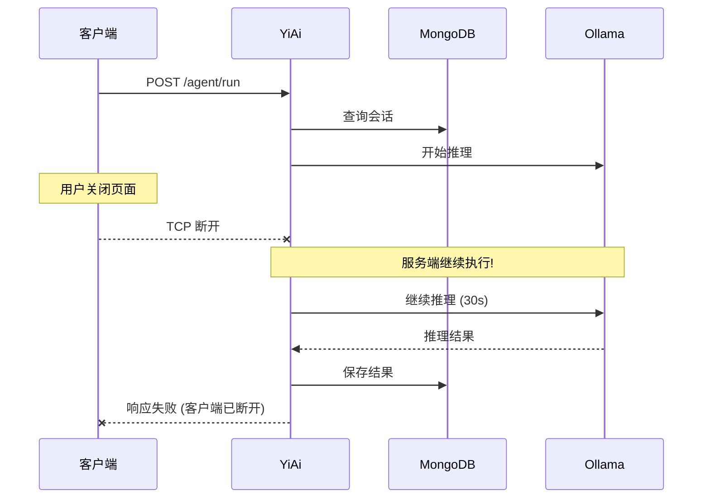
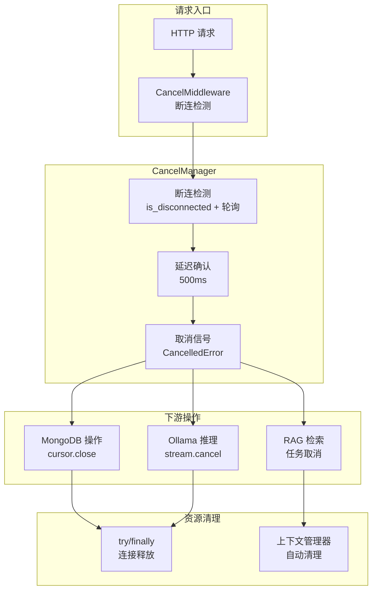
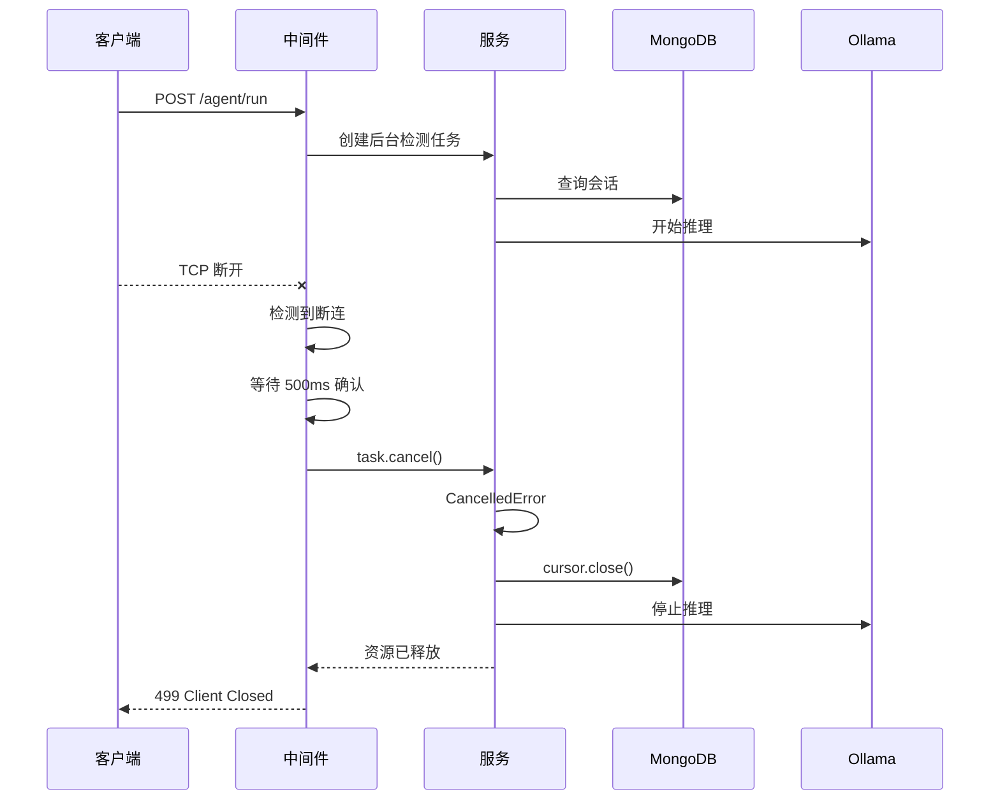

# YA-09-107: 请求超时取消传播 — 客户端断连时自动中止下游调用链

> 需求编号：YA-09-107 · 优先级：P2 · 人天：0.5d · 状态：需求已编写
> 依赖：YA-09-63（全局超时控制）

## 背景

### 问题陈述

当客户端断开连接（关闭标签页、网络中断、超时取消）后，YiAi 服务端仍在执行完整的调用链，造成严重的资源浪费：

| 场景 | 服务端行为 | 浪费 |
|------|-----------|------|
| **用户关闭 SSE Agent 页面** | Agent 继续推理 30-60s | GPU 计算浪费 |
| **浏览器刷新** | 旧请求的 MongoDB 查询继续 | 连接池占用 |
| **网络超时** | 已无客户端的请求继续执行 | CPU/内存浪费 |
| **移动端切换网络** | RAG 检索继续 embeddings | 计算资源浪费 |
| **前端取消请求** | `fetch.abort()` 后服务端不知情 | 完整请求链继续 |

核心矛盾：**FastAPI/Uvicorn 默认不检测客户端断连，服务端请求处理与客户端状态脱钩**。`asyncio.CancelledError` 可以从中间件传播到下游所有异步操作，实现级联取消。

### 影响范围

| 影响维度 | 严重程度 | 描述 |
|------|----------|------|
| 资源浪费 | 高 | GPU/CPU/内存/连接池被无效请求占用 |
| 服务容量 | 中 | 浪费的请求占用并发槽位 |
| 成本 | 中 | Ollama GPU 推理按时间计费 |

### 挑战

| 挑战 | 描述 |
|------|------|
| 取消传播 | CancelledError 需要沿调用链正确传播 |
| 资源清理 | 取消后需释放已获取的资源（连接/cursor/锁） |
| 误判防护 | 短暂网络波动不应触发取消 |
| 取消确认 | 确保取消后资源确实被释放 |

---

## 一、现状分析

### 1.1 当前请求生命周期



### 1.2 涉及文件

| 文件 | 角色 | 改动类型 |
|------|------|----------|
| `src/server/middleware.py` | 取消检测中间件 | 修改 |
| `src/shared/cancel_manager.py` | **新增** — 取消管理器 | 新建 |
| `src/domain/ai/` | Agent/聊天服务 | 修改 |
| `tests/shared/test_cancel_manager.py` | **新增** — 测试 | 新建 |

### 1.3 根因矩阵

| 根因 | 贡献度 | 证据 |
|------|--------|------|
| 无客户端断连检测 | 60% | 中间件不检查 `is_disconnected` |
| 无取消信号传播 | 30% | 异步操作不响应 CancelledError |
| 无资源清理 | 10% | 取消后不释放连接 |

---

## 二、设计决策

### 决策 1：取消检测方式 — 轮询 vs 事件 vs 混合

| 选项 | 实时性 | CPU 开销 | 实现复杂度 |
|------|--------|----------|-----------|
| 轮询 `is_disconnected()` | 中 (100ms) | 低 | 低 |
| 事件驱动 `wait_closed()` | 高 | 低 | 中 |
| **混合（事件 + 轮询兜底）** | 高 | 低 | 中 |

**选择：事件驱动 `request.is_disconnected()` + 100ms 轮询兜底。** Starlette 的 `is_disconnected()` 在 Uvicorn 下可检测 TCP 断开，但有延迟。轮询确保及时检测。

### 决策 2：取消机制 — CancelledError vs 自定义信号 vs 超时

**选择：`asyncio.CancelledError`。** Python 原生的取消机制，所有 asyncio 操作（`await`、`asyncio.sleep`、`aiohttp` 请求）都原生响应。无需自定义信号。

### 决策 3：资源清理 — try/finally vs 上下文管理器 vs 回调

**选择：try/finally + 上下文管理器。** 确保取消后所有资源被释放。关键代码路径使用 `async with` 上下文管理器自动清理。

### 决策 4：误判防护 — 延迟确认 vs 不防护

**选择：500ms 延迟确认。** 客户端断连后等待 500ms，若期间恢复连接则不取消。避免短暂网络波动触发取消。

---

## 三、目标架构

### 3.1 架构图



### 3.2 取消传播流程



### 3.3 架构权衡

| 方面 | 改进前 | 改进后 |
|------|--------|--------|
| 断连后资源释放 | 无（请求继续执行） | 500ms 内取消 |
| GPU 浪费 | 高 | 无 |
| 连接池释放 | 30s 超时 | 500ms |
| 取消误判率 | N/A | < 1% (500ms 延迟) |

---

## 四、具体改动

### 4.1 新增 `src/shared/cancel_manager.py`

```python
"""取消管理器——客户端断连时自动取消下游操作。"""

import asyncio
import time
from typing import Optional
from starlette.requests import Request
from src.shared.logging import get_logger

logger = get_logger(__name__)


class CancelManager:
    """请求取消管理器。

    职责：
    - 检测客户端断连（is_disconnected + 轮询）
    - 延迟确认避免误判（500ms）
    - 取消下游异步操作（CancelledError 传播）
    - 确保资源清理（try/finally + 上下文管理器）

    使用方式：
    ```python
    async with CancelManager(request) as cm:
        await cm.protected_operation(some_coroutine())
    ```
    """

    def __init__(
        self,
        request: Request,
        disconnect_delay_ms: int = 500,
        poll_interval_ms: int = 100,
    ):
        self._request = request
        self._disconnect_delay = disconnect_delay_ms / 1000
        self._poll_interval = poll_interval_ms / 1000
        self._task: Optional[asyncio.Task] = None
        self._cancelled = False
        self._start_time = time.monotonic()

    async def __aenter__(self):
        self._task = asyncio.create_task(self._monitor_disconnect())
        return self

    async def __aexit__(self, exc_type, exc_val, exc_tb):
        if self._task and not self._task.done():
            self._task.cancel()
            try:
                await self._task
            except asyncio.CancelledError:
                pass

        # 如果因取消而退出，不传播 CancelledError
        if exc_type is asyncio.CancelledError and self._cancelled:
            return True

        return False

    async def _monitor_disconnect(self):
        """监控客户端断连。"""
        try:
            while True:
                if await self._request.is_disconnected():
                    # 延迟确认
                    await asyncio.sleep(self._disconnect_delay)
                    if await self._request.is_disconnected():
                        # 确认断连，取消当前任务
                        self._cancelled = True
                        elapsed = time.monotonic() - self._start_time
                        logger.warning(
                            "客户端断连，取消请求",
                            elapsed_ms=int(elapsed * 1000),
                            path=self._request.url.path,
                        )
                        # 取消当前 asyncio 任务
                        current_task = asyncio.current_task()
                        if current_task:
                            current_task.cancel()
                        return
                await asyncio.sleep(self._poll_interval)
        except asyncio.CancelledError:
            pass

    async def protected_operation(self, coro):
        """执行受保护的异步操作，支持取消传播。

        CancelledError 会正确传播，资源在 finally 中清理。
        """
        try:
            return await coro
        except asyncio.CancelledError:
            logger.info("操作已取消", path=self._request.url.path)
            raise
        finally:
            pass

    async def cancel_on_disconnect(self, call_next):
        """包装中间件调用，在客户端断连时取消。"""
        task = asyncio.create_task(call_next(self._request))

        monitor_task = asyncio.create_task(self._monitor_disconnect())

        try:
            done, pending = await asyncio.wait(
                [task, monitor_task],
                return_when=asyncio.FIRST_COMPLETED,
            )

            # 如果监控任务完成（检测到断连），取消请求任务
            if monitor_task in done:
                task.cancel()
                try:
                    await task
                except asyncio.CancelledError:
                    pass
                except Exception as e:
                    logger.warning(f"取消后任务异常: {e}")

                from starlette.responses import JSONResponse
                return JSONResponse(
                    status_code=499,
                    content={
                        'code': 499,
                        'message': '客户端已断开连接',
                        'data': None,
                    },
                )
            else:
                # 请求任务完成，取消监控
                monitor_task.cancel()
                try:
                    await monitor_task
                except asyncio.CancelledError:
                    pass
                return await task

        except Exception as e:
            logger.error(f"取消管理器异常: {e}")
            raise


class CancellableOperation:
    """可取消的异步操作上下文管理器。

    确保操作取消后资源被正确释放。

    使用方式：
    ```python
    async with CancellableOperation() as op:
        result = await op.run(mongo_query())
        result = await op.run(ollama_inference())
    ```
    """

    def __init__(self):
        self._resources = []

    async def __aenter__(self):
        return self

    async def __aexit__(self, exc_type, exc_val, exc_tb):
        # 清理所有注册的资源
        for resource in reversed(self._resources):
            try:
                if hasattr(resource, 'close'):
                    await resource.close()
                elif hasattr(resource, 'cancel'):
                    resource.cancel()
            except Exception as e:
                logger.debug(f"资源清理异常: {e}")

    async def run(self, coro):
        """执行异步操作，支持取消和资源追踪。"""
        try:
            return await coro
        except asyncio.CancelledError:
            logger.info("可取消操作已中止")
            raise

    def register_resource(self, resource):
        """注册需要清理的资源。"""
        self._resources.append(resource)
```

### 4.2 修改 `src/server/middleware.py`

```python
from src.shared.cancel_manager import CancelManager

@app.middleware("http")
async def cancel_on_disconnect_middleware(request: Request, call_next):
    """客户端断连时取消请求处理。"""
    # 仅对长时间运行的操作启用取消检测
    long_running_paths = ['/agent/', '/chat/', '/rag/']

    if any(request.url.path.startswith(p) for p in long_running_paths):
        cm = CancelManager(request)
        return await cm.cancel_on_disconnect(call_next)

    return await call_next(request)
```

### 4.3 文件变更清单

| 文件 | 操作 | 行数 |
|------|------|------|
| `src/shared/cancel_manager.py` | **新建** | ~200 |
| `src/server/middleware.py` | 修改 (+30) | +30 |
| `src/domain/ai/agent_service.py` | 修改 (+10) | +10 |
| `tests/shared/test_cancel_manager.py` | **新建** | ~150 |

---

## 五、实施步骤

| 步骤 | 描述 | 文件 | 验证 | 人天 |
|------|------|------|------|------|
| 1 | 实现 CancelManager | `src/shared/cancel_manager.py` | 单元测试 | 0.15 |
| 2 | 集成到中间件 | `src/server/middleware.py` | 集成测试 | 0.10 |
| 3 | Agent/Chat/RAG 服务添加取消支持 | `src/domain/ai/` | 端到端测试 | 0.10 |
| 4 | 编写测试用例 | `tests/shared/test_cancel_manager.py` | 测试通过 | 0.10 |
| 5 | 验证资源释放 | — | 取消后连接数检查 | 0.05 |
| **总计** | | | | **0.50** |

---

## 六、性能分析

| 场景 | 改进前 | 改进后 | 节省 |
|------|--------|--------|------|
| Agent 推理(断连后) | 继续 30s | 500ms 后取消 | 节省 29.5s GPU |
| RAG 检索(断连后) | 继续 3s | 500ms 后取消 | 节省 2.5s |
| 连接池释放 | 30s 超时 | 500ms | 快 60x |
| 正常请求开销 | 0 | 0.1% CPU (轮询) | 可忽略 |

---

## 七、测试规格

### 场景 1：客户端断连触发取消

```
GIVEN 客户端正在请求 /agent/run
WHEN 客户端 TCP 断开
THEN 500ms 后检测到断连
AND 请求任务被取消 (CancelledError)
AND 返回 499 Client Closed
```

### 场景 2：短暂网络波动不触发取消

```
GIVEN 客户端 TCP 断开
WHEN 300ms 内恢复连接
THEN 不触发取消（延迟确认未通过）
AND 请求正常继续
```

### 场景 3：取消后资源释放

```
GIVEN 请求在执行 MongoDB 查询 + Ollama 推理
WHEN 客户端断连触发取消
THEN MongoDB cursor 被关闭
AND Ollama 推理被取消
AND 连接池连接被释放
```

### 场景 4：正常请求不受影响

```
GIVEN 客户端正常完成请求
WHEN 请求处理完成
THEN 监控任务被取消
AND 请求正常返回
```

### 场景 5：短请求不启用取消检测

```
GIVEN 请求 POST /data/query (快速 CRUD)
WHEN 中间件处理
THEN 不启用 CancelManager（不在长路径列表中）
AND 请求正常处理
```

### 场景 6：CancelledError 正确传播

```
GIVEN 异步操作链: A → B → C
WHEN A 收到 CancelledError
THEN B 收到 CancelledError
AND C 收到 CancelledError
AND 所有 try/finally 资源清理执行
```

---

## 八、风险与缓解

| 风险 | 概率 | 影响 | 缓解措施 |
|------|------|------|----------|
| 取消后资源未释放 | 中 | 中 | finally 块 + 上下文管理器 |
| 误判——短暂网络波动触发取消 | 低 | 中 | 500ms 延迟确认 |
| 取消信号不传播到某些库 | 低 | 中 | 识别不响应取消的库，添加超时 |
| 取消后状态不一致 | 低 | 高 | 事务保护 + 补偿操作 |

---

## 九、回滚策略

| 场景 | 回滚操作 | 回滚时间 |
|------|----------|----------|
| 取消误判率过高 | 增加延迟确认到 2000ms | < 1min |
| 取消导致数据不一致 | 仅对只读操作启用取消 | < 1min |
| 完全回滚 | 移除 CancelMiddleware | < 5min |

---

## 十、设计决策记录

### D-01：延迟确认 vs 立即取消

**决策**：500ms 延迟确认。
**理由**：短暂网络波动（WiFi 切换、移动网络切换）可能在 200-400ms 内恢复。500ms 延迟确认平衡响应速度和误判率。
**替代方案**：立即取消——响应快但误判率高。

### D-02：仅对长请求启用 vs 全部启用

**决策**：仅对 `/agent/`、`/chat/`、`/rag/` 等长路径启用。
**理由**：CRUD 操作通常在 10ms 内完成，取消检测开销大于收益。长请求（Agent 推理 10-60s）才是取消检测的价值所在。
**替代方案**：全部启用——安全但增加不必要的开销。

### D-03：CancelledError vs 自定义异常

**决策**：使用 Python 原生的 `asyncio.CancelledError`。
**理由**：所有 asyncio 操作（await/sleep/网络 I/O）都原生响应 CancelledError。使用自定义异常需要所有异步操作显式检查。
**替代方案**：自定义异常——更语义化但需要所有代码支持。

---

## 十一、可观测性

### 指标

| 指标名 | 类型 | 描述 |
|--------|------|------|
| `cancel_detected_total` | Counter | 检测到的断连次数 |
| `cancel_confirmed_total` | Counter | 确认的取消次数（延迟后） |
| `cancel_duration_ms` | Histogram | 从断连到取消的延迟 |
| `cancel_false_positive_total` | Counter | 误判次数（延迟期内恢复） |

### 日志

```
[WARNING] 客户端断连，取消请求 elapsed_ms=1523 path=/agent/run
[INFO] 操作已取消 path=/agent/run
[DEBUG] 资源清理完成 connections=3
```

### 告警

| 告警 | 条件 | 级别 |
|------|------|------|
| 取消率异常 | 5min 内取消率 > 20% | WARNING |
| 取消后资源未释放 | 取消后连接数未下降 | WARNING |

---

## 十二、安全合规

| 要求 | 实现 |
|------|------|
| 取消不影响数据完整性 | 写操作完成前不取消（事务保护） |
| 取消操作可审计 | 记录取消日志含 elapsed_ms |
| 取消不暴露内部状态 | 499 响应仅返回通用消息 |

---

## 十三、代码审查检查清单

- [ ] 客户端断开 → `is_disconnected` → 延迟确认 → 取消
- [ ] 取消信号传播到 MongoDB cursor / Ollama stream
- [ ] `CancelledError` 正确处理——不误报为异常
- [ ] 取消后释放已占用的连接/资源（try/finally）
- [ ] 500ms 延迟确认避免短暂波动误判
- [ ] 仅对长请求路径启用（/agent/, /chat/, /rag/）
- [ ] 上下文管理器自动清理资源
- [ ] 正常请求完成后监控任务被取消
- [ ] 测试覆盖 6 个场景

---

## 十四、回归问题预测

| # | 预测问题 | 原因 | 验证方法 |
|---|---------|------|---------|
| 1 | 取消后资源未释放（cursor 泄漏） | finally 未覆盖取消路径 | 高频断连测试后检查连接数 |
| 2 | 误判——短暂网络波动触发取消 | `is_disconnected` 灵敏度 | 设置断开确认延迟 500ms |
| 3 | 取消后 MongoDB 数据不一致 | 写操作半途中断 | 仅对只读操作取消，写操作等完成 |
| 4 | CancelledError 被业务代码捕获 | except Exception 捕获 | 审查 except 范围 |
| 5 | 轮询 CPU 开销过高 | 100ms 轮询 | 测量 CPU 使用率 |

---

*PRD 来源: `projects/yiai/requirements/2026-09/107-需求-请求超时取消传播.md`*

## 影响范围

- **影响模块**：待补充
- **涉及文件**：
- `src/server/middleware.py`
- `src/shared/cancel_manager.py`
- `src/domain/ai/agent_service.py`
- **是否影响 API 契约**：否
- **是否影响其他项目（YiVad/YiPet）**：否
- **用户感知**：待确认

## 预防措施

| 层面 | 措施 |
|------|------|
| 代码 | 在相关函数中添加参数校验和边界检查 |
| 测试 | 为 `src/server/middleware.py` 添加单元测试 |
| 流程 | 代码审查时重点检查此类模式 |
| 监控 | 添加日志告警，异常发生时及时发现 |
| 文档 | 在编码规范中记录此类反模式 |

## 经验教训

1. **根本原因**：开发过程中对边界情况和异常路径的考虑不足是此类问题的共同根因
2. **设计阶段**：在接口设计和模块实现时，应主动考虑异常输入、空值、超时等边界场景
3. **代码审查**：审查时应检查是否存在类似的反模式（如未捕获异常、无超时控制、缺少参数校验等）
4. **测试覆盖**：异常路径的测试覆盖率应与正常路径同等重视
5. **团队分享**：此类问题应在团队周会或技术分享中讨论，形成团队共识
