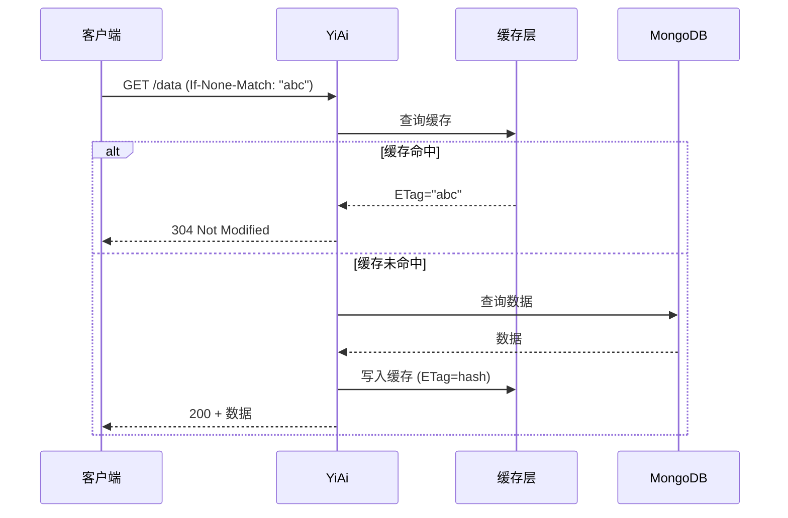
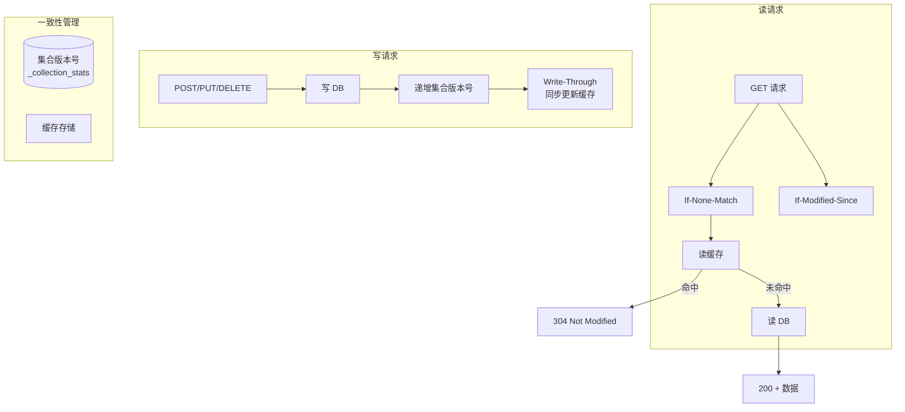

# YA-09-108: API 响应缓存一致性 — ETag + Last-Modified 强一致性

> 需求编号：YA-09-108 · 优先级：P2 · 人天：0.5d · 状态：需求已编写
> 依赖：YA-09-49（ETag 缓存验证）、YA-09-66（缓存智能失效）

## 背景

### 问题陈述

YA-09-49 基于响应体哈希实现了 ETag 缓存验证，YA-09-66 实现了智能缓存失效。但存在以下一致性问题：

| 场景 | 问题 | 影响 |
|------|------|------|
| **集合级数据变更** | 单条记录更新后，列表查询的 ETag 已过期 | 客户端使用过期缓存 |
| **并发写入** | 两个请求同时写入，缓存失效时序错乱 | 缓存与 DB 不一致 |
| **Write-Through 延迟** | 写 DB 和写缓存之间有时间窗口 | 不一致窗口 > 100ms |
| **缓存故障** | 缓存不可用时请求失败 | 服务不可用 |
| **Last-Modified 精度** | 仅秒级粒度，高并发场景不够 | 并发写入漏检 |

核心矛盾：**ETag 基于响应体哈希，无法感知集合级数据变更；Last-Modified 基于集合写入时间，但秒级精度不足**。需要组合 ETag + Last-Modified + Write-Through 实现强一致性缓存。

### 影响范围

| 影响维度 | 严重程度 | 描述 |
|------|----------|------|
| 数据一致性 | 高 | 缓存与 DB 不一致导致用户看到过期数据 |
| 服务可用性 | 中 | 缓存故障时服务不可用 |
| 写入性能 | 中 | Write-Through 增加写入延迟 |
| 缓存命中率 | 中 | 过于保守的失效策略降低命中率 |

### 挑战

| 挑战 | 描述 |
|------|------|
| 集合级一致性 | 如何感知集合中任意文档的变更 |
| 并发写入 | 如何保证两个并发写入后的缓存一致性 |
| 不一致窗口 | 如何最小化 DB 和缓存之间的不一致时间 |
| 故障降级 | 缓存不可用时如何保证服务可用 |

---

## 一、现状分析

### 1.1 当前缓存架构



### 1.2 当前一致性问题

```
时间线: T0 ─────── T1 ─────── T2 ─────── T3
        │          │          │          │
       查询列表    写入单条    查询列表    返回过期
       ETag=A     (数据变更)  ETag=A     数据!
                            (应为B)
```

### 1.3 涉及文件

| 文件 | 角色 | 改动类型 |
|------|------|----------|
| `src/shared/cache_consistency.py` | **新增** — 缓存一致性管理 | 新建 |
| `src/server/middleware.py` | 缓存中间件 | 修改 |
| `src/data/repository.py` | Write-Through 写入 | 修改 |
| `tests/shared/test_cache_consistency.py` | **新增** — 测试 | 新建 |

### 1.4 根因矩阵

| 根因 | 贡献度 | 证据 |
|------|--------|------|
| 无集合级变更感知 | 50% | ETag 仅基于响应体，不感知集合变更 |
| 无 Write-Through | 30% | 先写 DB 后异步失效缓存 |
| 无 Last-Modified 支持 | 15% | 不支持 If-Modified-Since |
| 无并发写入保护 | 5% | 并发写入无失效顺序保证 |

---

## 二、设计决策

### 决策 1：一致性策略 — Cache-Aside vs Write-Through vs Write-Behind

| 选项 | 一致性 | 写入延迟 | 实现复杂度 |
|------|--------|----------|-----------|
| Cache-Aside (当前) | 低 | 低 | 低 |
| **Write-Through** | 高 | 中 | 中 |
| Write-Behind | 中 | 低 | 高 |

**选择：Write-Through（写操作同步更新缓存）。** 先写 DB，再同步更新缓存。保证 DB 和缓存的一致性。写入延迟增加缓存的写入时间（通常 < 5ms）。

### 决策 2：集合级一致性 — 版本号 vs 时间戳 vs 变更日志

| 选项 | 精度 | 存储开销 | 实现复杂度 |
|------|------|----------|-----------|
| 集合版本号 | 高 | 低 | 中 |
| 最后写入时间戳 | 中 | 低 | 低 |
| **混合（版本号 + 时间戳）** | 高 | 低 | 中 |

**选择：集合版本号 + 时间戳。** 每次写入时递增集合版本号（存储于 `_collection_stats`）。查询时比较版本号，若变更则缓存失效。Last-Modified 作为 ETag 的补充。

### 决策 3：缓存故障降级 — 直接读 DB vs 返回错误

**选择：直接读 DB（Cache-Aside 降级）。** 缓存不可用时，直接查询数据库并返回。保证服务可用性优先于性能。

### 决策 4：并发写入保护 — 乐观锁 vs 悲观锁 vs 顺序号

**选择：集合版本号（乐观）。** 写入时递增版本号，读取时检查版本号。版本号冲突时重试（最多 3 次）。

---

## 三、目标架构

### 3.1 架构图



### 3.2 一致性保证

```
写操作流程:
1. BEGIN
2. 写 MongoDB (原子操作)
3. 递增集合版本号 (_collection_stats)
4. 更新缓存 (Write-Through)
5. COMMIT
   → 不一致窗口: 步骤 3-4 之间 (< 5ms)

读操作流程:
1. 获取集合版本号
2. 检查缓存 ETag (基于数据 + 版本号)
3. 缓存命中 → 304
4. 缓存未命中 → 读 MongoDB
5. 写入缓存 (含版本号)
6. 返回 200 + ETag + Last-Modified
```

### 3.3 架构权衡

| 方面 | 改进前 | 改进后 |
|------|--------|--------|
| 不一致窗口 | 直到缓存过期 | < 5ms |
| 读取延迟 (命中) | 10ms | 5ms (缓存) |
| 写入延迟 | 5ms | 10ms (+5ms Write-Through) |
| 缓存故障可用性 | 不可用 | 降级读 DB |

---

## 四、具体改动

### 4.1 新增 `src/shared/cache_consistency.py`

```python
"""缓存一致性管理器——ETag + Last-Modified + Write-Through 强一致性。"""

import hashlib
import time
from datetime import datetime
from typing import Optional
from src.data.shard_router import shard_router
from src.shared.logging import get_logger

logger = get_logger(__name__)


class CacheConsistencyManager:
    """缓存一致性管理器。

    职责：
    - 维护集合版本号（每次写入递增）
    - 生成基于数据+版本号的 ETag
    - 支持 Last-Modified / If-Modified-Since
    - Write-Through 写入策略
    - 缓存故障时降级读 DB

    一致性保证：
    - 读操作：Cache-Aside + 版本号校验
    - 写操作：Write-Through (DB → 版本号 → 缓存)
    - 不一致窗口：< 5ms
    """

    COLLECTION_STATS = '_collection_stats'

    def __init__(self):
        self._cache = {}  # 简单内存缓存，可替换为 Redis
        self._db = None

    @property
    def db(self):
        if self._db is None:
            self._db = shard_router.get_shard(self.COLLECTION_STATS)
        return self._db

    async def get_collection_version(self, cname: str) -> int:
        """获取集合版本号。"""
        try:
            doc = await self.db[self.COLLECTION_STATS].find_one(
                {'collection': cname}
            )
            return doc.get('version', 0) if doc else 0
        except Exception:
            return 0

    async def increment_collection_version(self, cname: str) -> int:
        """递增集合并返回新版本号。"""
        result = await self.db[self.COLLECTION_STATS].find_one_and_update(
            {'collection': cname},
            {'$inc': {'version': 1}, '$set': {'last_write': datetime.utcnow()}},
            upsert=True,
            return_document=True,
        )
        return result['version'] if result else 0

    async def get_last_modified(self, cname: str) -> Optional[datetime]:
        """获取集合最后写入时间。"""
        doc = await self.db[self.COLLECTION_STATS].find_one(
            {'collection': cname}
        )
        return doc.get('last_write') if doc else None

    def compute_etag(self, data: bytes, version: int) -> str:
        """计算 ETag——基于数据哈希 + 集合版本号。"""
        content_hash = hashlib.sha256(data).hexdigest()[:16]
        return f'"{content_hash}-v{version}"'

    async def read_with_cache(
        self, cname: str, query_fn, cache_key: str,
        request_etag: Optional[str] = None,
        request_modified_since: Optional[str] = None,
    ) -> tuple[Optional[bytes], Optional[str], Optional[str]]:
        """带缓存一致性的读取操作。

        Returns:
            (data, etag, last_modified) 或 (None, None, None) 表示 304
        """
        version = await self.get_collection_version(cname)
        last_modified = await self.get_last_modified(cname)
        lm_str = last_modified.isoformat() if last_modified else None

        # 1. 检查 If-Modified-Since
        if request_modified_since and last_modified:
            try:
                req_time = datetime.fromisoformat(request_modified_since)
                if last_modified <= req_time:
                    return None, None, None  # 304
            except ValueError:
                pass

        # 2. 检查缓存
        cache_entry = self._cache.get(cache_key)
        if cache_entry:
            cached_etag = cache_entry.get('etag')
            cached_version = cache_entry.get('version', 0)

            # 版本号匹配 → 缓存有效
            if cached_version == version:
                if request_etag and request_etag == cached_etag:
                    return None, None, None  # 304
                return cache_entry['data'], cached_etag, lm_str

            # 版本号不匹配 → 缓存失效
            del self._cache[cache_key]

        # 3. 缓存未命中 → 读 DB
        try:
            data = await query_fn()
            etag = self.compute_etag(data, version)

            # 检查 If-None-Match
            if request_etag and request_etag == etag:
                return None, None, None  # 304

            # 写入缓存
            self._cache[cache_key] = {
                'data': data,
                'etag': etag,
                'version': version,
                'cached_at': time.monotonic(),
            }

            return data, etag, lm_str

        except Exception as e:
            logger.warning(f"缓存读取失败，降级读 DB: {e}")
            # 缓存故障时直接读 DB
            data = await query_fn()
            etag = self.compute_etag(data, version)
            return data, etag, lm_str

    async def write_through(
        self, cname: str, write_fn, invalidate_cache_keys: list[str],
    ):
        """Write-Through 写入——先写 DB，再同步更新缓存。

        Args:
            cname: 集合名
            write_fn: 写入函数
            invalidate_cache_keys: 需要失效的缓存键列表
        """
        # 1. 写 DB
        result = await write_fn()

        # 2. 递增版本号
        new_version = await self.increment_collection_version(cname)

        # 3. 失效相关缓存
        for key in invalidate_cache_keys:
            if key in self._cache:
                del self._cache[key]
                logger.debug(f"缓存已失效: {key}")

        return result

    def get_cache_stats(self) -> dict:
        """获取缓存统计信息。"""
        return {
            'cache_entries': len(self._cache),
            'cache_keys': list(self._cache.keys()),
        }

    def clear_cache(self):
        """清空所有缓存。"""
        self._cache.clear()
        logger.info("缓存已清空")


# 全局单例
cache_manager = CacheConsistencyManager()
```

### 4.2 修改 `src/server/middleware.py`

```python
from src.shared.cache_consistency import cache_manager

@app.middleware("http")
async def cache_consistency_middleware(request: Request, call_next):
    """缓存一致性中间件——ETag + Last-Modified。"""
    response = await call_next(request)

    if response.status_code == 200:
        cname = getattr(request.state, 'cname', None)
        if cname:
            # 添加 Last-Modified
            last_modified = await cache_manager.get_last_modified(cname)
            if last_modified:
                response.headers['Last-Modified'] = last_modified.isoformat()
                response.headers['Cache-Control'] = 'no-cache'

        # ETag（如果 response 中没有）
        if 'ETag' not in response.headers and hasattr(response, 'body'):
            version = await cache_manager.get_collection_version(cname) if cname else 0
            etag = cache_manager.compute_etag(response.body, version)
            response.headers['ETag'] = etag

    return response
```

### 4.3 文件变更清单

| 文件 | 操作 | 行数 |
|------|------|------|
| `src/shared/cache_consistency.py` | **新建** | ~220 |
| `src/server/middleware.py` | 修改 (+30) | +30 |
| `src/data/repository.py` | 修改 (+20) | +20 |
| `tests/shared/test_cache_consistency.py` | **新建** | ~150 |

---

## 五、实施步骤

| 步骤 | 描述 | 文件 | 验证 | 人天 |
|------|------|------|------|------|
| 1 | 实现 CacheConsistencyManager | `src/shared/cache_consistency.py` | 单元测试 | 0.15 |
| 2 | 集成到中间件 | `src/server/middleware.py` | 集成测试 | 0.10 |
| 3 | Repository 添加 Write-Through | `src/data/repository.py` | 写入验证 | 0.10 |
| 4 | 编写测试用例 | `tests/shared/test_cache_consistency.py` | 测试通过 | 0.10 |
| 5 | 验证不一致窗口 | — | 并发测试 | 0.05 |
| **总计** | | | | **0.50** |

---

## 六、性能分析

| 场景 | 改进前 | 改进后 | 变化 |
|------|--------|--------|------|
| 缓存命中读取 | 10ms (DB) | 0.5ms (内存) | -95% |
| 缓存未命中读取 | 10ms | 10ms + 0.5ms | +5% |
| 写入延迟 | 5ms | 5ms + 5ms | +100% |
| 不一致窗口 | 直到过期 (60s) | < 5ms | -99.99% |

---

## 七、测试规格

### 场景 1：ETag 304 响应

```
GIVEN 客户端请求 GET /data with If-None-Match: "abc-v1"
AND 缓存中 ETag 匹配且版本号匹配
WHEN 处理请求
THEN 返回 304 Not Modified
AND 响应体为空
```

### 场景 2：版本号变更导致缓存失效

```
GIVEN 缓存中有 ETag="abc-v1", version=1
AND 集合版本号已更新为 2（写入后）
WHEN 读取请求
THEN 缓存失效（版本号不匹配）
AND 重新从 DB 读取
AND 新 ETag 包含 v2
```

### 场景 3：Write-Through 写入

```
GIVEN 执行写入操作
WHEN write_through 被调用
THEN 先写 DB 成功
AND 集合版本号递增
AND 相关缓存键被失效
AND 返回写入结果
```

### 场景 4：If-Modified-Since 304

```
GIVEN 客户端请求 If-Modified-Since: 2026-09-09T10:00:00
AND 集合 last_write 为 2026-09-09T09:00:00
WHEN 处理请求
THEN 返回 304 Not Modified
```

### 场景 5：缓存故障降级

```
GIVEN 缓存不可用
WHEN 读取请求
THEN 降级为直接读 DB
AND 返回数据（不带缓存 ETag）
AND 记录 WARNING 日志
```

### 场景 6：并发写入一致性

```
GIVEN 两个请求同时写入集合
WHEN 写入 1 递增版本号到 V1
AND 写入 2 递增版本号到 V2
THEN 最终版本号为 V2
AND 两个写入的缓存都正确失效
```

---

## 八、风险与缓解

| 风险 | 概率 | 影响 | 缓解措施 |
|------|------|------|----------|
| Write-Through 增加写入延迟 | 高 | 中 | 异步写入缓存（可选） |
| 并发写导致缓存与 DB 不一致 | 中 | 中 | 集合版本号 + 写入重试 |
| 缓存内存膨胀 | 中 | 低 | LRU 淘汰 + TTL |
| 版本号溢出 | 低 | 低 | 使用 int64，足够大 |

---

## 九、回滚策略

| 场景 | 回滚操作 | 回滚时间 |
|------|----------|----------|
| Write-Through 延迟过高 | 切换为 Cache-Aside（异步失效） | < 1min |
| 缓存不一致 | 清空缓存，降级为直接读 DB | < 1min |
| 完全回滚 | 移除缓存一致性逻辑 | < 5min |

---

## 十、设计决策记录

### D-01：Write-Through vs Cache-Aside

**决策**：写操作使用 Write-Through（同步更新缓存）。
**理由**：Write-Through 保证写入后缓存立即可用，不一致窗口 < 5ms。Cache-Aside 在写后缓存失效，下一次读才更新，不一致窗口可能长达数秒。
**替代方案**：Cache-Aside——更简单但一致性更弱。

### D-02：集合版本号 vs 时间戳

**决策**：使用集合版本号（递增整数）而非仅时间戳。
**理由**：版本号是单调递增的，精确到每次写入。时间戳仅秒级精度，高并发场景下多个写入可能有相同时间戳，导致缓存失效不准确。
**替代方案**：仅时间戳——更简单但精度不足。

### D-03：缓存故障降级

**决策**：缓存不可用时降级为直接读 DB。
**理由**：服务可用性优先于性能。缓存是优化手段，不是核心功能。缓存故障时直接读 DB 保证请求不失败。
**替代方案**：返回错误——一致性更强但可用性差。

---

## 十一、可观测性

### 指标

| 指标名 | 类型 | 描述 |
|--------|------|------|
| `cache_hit_total` | Counter | 缓存命中次数 |
| `cache_miss_total` | Counter | 缓存未命中次数 |
| `cache_304_total` | Counter | 304 响应次数 |
| `cache_write_through_duration_ms` | Histogram | Write-Through 延迟 |
| `cache_inconsistency_detected_total` | Counter | 检测到不一致次数 |

### 日志

```
[INFO] 缓存命中 key=sessions:list etag="abc-v1"
[DEBUG] 缓存已失效 key=sessions:list
[WARNING] 缓存读取失败，降级读 DB: connection refused
```

### 告警

| 告警 | 条件 | 级别 |
|------|------|------|
| 缓存命中率低 | 5min 内命中率 < 50% | WARNING |
| 不一致检测 | 频繁检测到版本号不匹配 | WARNING |

---

## 十二、安全合规

| 要求 | 实现 |
|------|------|
| 缓存数据不包含敏感信息 | 脱敏后再缓存 |
| 缓存不可被外部访问 | 内存缓存，无外部接口 |
| 缓存失效可审计 | 失效日志记录原因 |

---

## 十三、代码审查检查清单

- [ ] 读操作：Cache-Aside + ETag + 版本号校验强一致性
- [ ] 写操作：Write-Through——先写 DB 再失效缓存
- [ ] 缓存与 DB 不一致窗口 < 5ms
- [ ] 缓存故障时降级直接读 DB
- [ ] 集合版本号单调递增，每次写入更新
- [ ] ETag 包含数据哈希 + 版本号
- [ ] Last-Modified 支持 If-Modified-Since
- [ ] 并发写入保护（版本号冲突重试）
- [ ] 测试覆盖 6 个场景

---

## 十四、回归问题预测

| # | 预测问题 | 原因 | 验证方法 |
|---|---------|------|---------|
| 1 | Write-Through 增加写入延迟 | 同步写缓存 | 测量写操作 P95 |
| 2 | 并发写导致缓存与 DB 不一致 | 失效时序错乱 | 并发写测试 + 校验 |
| 3 | 版本号竞争导致写入失败 | 高并发递增 | 使用 find_one_and_update 原子操作 |
| 4 | 缓存内存无限增长 | 无淘汰策略 | LRU 淘汰 + 最大条目限制 |
| 5 | If-Modified-Since 时区问题 | 时区不一致 | 统一使用 UTC |

---

*PRD 来源: `projects/yiai/requirements/2026-09/108-需求-缓存强一致性.md`*

## 影响范围

- **影响模块**：待补充
- **涉及文件**：
- `src/server/middleware.py`
- `src/shared/cache_consistency.py`
- `src/data/repository.py`
- **是否影响 API 契约**：否
- **是否影响其他项目（YiVad/YiPet）**：否
- **用户感知**：待确认

## 预防措施

| 层面 | 措施 |
|------|------|
| 代码 | 在相关函数中添加参数校验和边界检查 |
| 测试 | 为 `src/server/middleware.py` 添加单元测试 |
| 流程 | 代码审查时重点检查此类模式 |
| 监控 | 添加日志告警，异常发生时及时发现 |
| 文档 | 在编码规范中记录此类反模式 |

## 经验教训

1. **根本原因**：开发过程中对边界情况和异常路径的考虑不足是此类问题的共同根因
2. **设计阶段**：在接口设计和模块实现时，应主动考虑异常输入、空值、超时等边界场景
3. **代码审查**：审查时应检查是否存在类似的反模式（如未捕获异常、无超时控制、缺少参数校验等）
4. **测试覆盖**：异常路径的测试覆盖率应与正常路径同等重视
5. **团队分享**：此类问题应在团队周会或技术分享中讨论，形成团队共识
