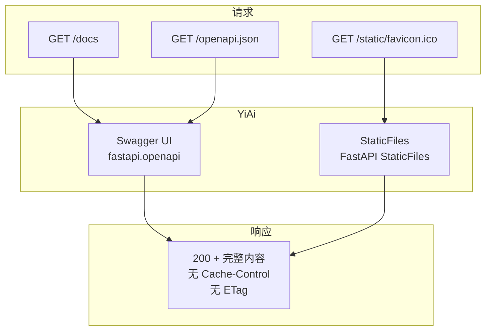
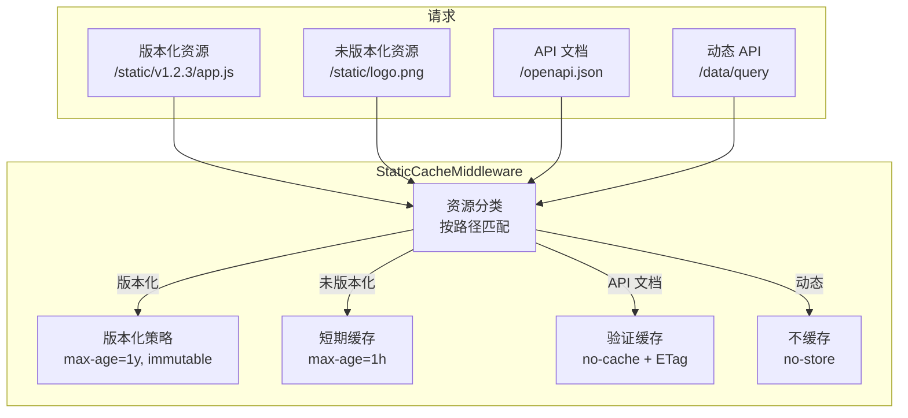

# YA-09-109: 静态资源缓存策略 — 不可变资源的长期缓存与版本化指纹

> 需求编号：YA-09-109 · 优先级：P2 · 人天：0.5d · 状态：需求已编写
> 依赖：YA-09-43（响应压缩优化）

## 背景

### 问题陈述

YiAi 的静态资源（OpenAPI docs、Swagger UI、favicon、静态文件）每次请求都返回 200 并传输完整内容，造成不必要的带宽消耗和加载延迟：

| 资源 | 大小 | 请求频率 | 当前行为 | 问题 |
|------|------|----------|----------|------|
| Swagger UI JS | 300KB | 每次打开 /docs | 每次 200 + 完整传输 | 浪费带宽 |
| Swagger UI CSS | 100KB | 每次打开 /docs | 每次 200 + 完整传输 | 浪费带宽 |
| OpenAPI JSON | 50KB | 每次 /docs 加载 | 每次 200 | 未版本化 |
| favicon.ico | 1KB | 每次页面加载 | 每次 200 + 304 验证 | 应永久缓存 |
| 自定义静态文件 | 不定 | 不定 | 无缓存策略 | 无法缓存 |

核心矛盾：**静态资源本质上是不可变的（版本化），但当前未使用 `Cache-Control: immutable` 和版本化 URL，导致浏览器重复下载相同资源**。正确的缓存策略可将静态资源重复请求减少 95% 以上。

### 影响范围

| 影响维度 | 严重程度 | 描述 |
|------|----------|------|
| 带宽消耗 | 中 | 静态资源重复传输浪费带宽 |
| 页面加载速度 | 中 | 无缓存导致 /docs 加载慢 |
| 服务器负载 | 低 | 重复请求增加服务器负载 |
| 开发体验 | 低 | 开发时缓存导致看不到更新 |

### 挑战

| 挑战 | 描述 |
|------|------|
| 版本化机制 | 如何为静态资源生成版本化 URL |
| 缓存失效 | 版本更新后如何确保用户获取新资源 |
| 开发环境 | 开发环境需要禁用缓存 |
| 混合资源 | 可缓存和不可缓存资源的区分 |

---

## 一、现状分析

### 1.1 当前静态资源服务



### 1.2 涉及文件

| 文件 | 角色 | 改动类型 |
|------|------|----------|
| `src/server/static_cache.py` | **新增** — 静态资源缓存策略 | 新建 |
| `src/server/middleware.py` | 缓存 header 中间件 | 修改 |
| `src/app.py` | 静态文件挂载配置 | 修改 |
| `src/shared/config.py` | 缓存策略配置 | 修改 |
| `tests/server/test_static_cache.py` | **新增** — 测试 | 新建 |

### 1.3 根因矩阵

| 根因 | 贡献度 | 证据 |
|------|--------|------|
| 无缓存 header | 60% | 响应中无 Cache-Control/ETag |
| 无版本化 URL | 25% | 静态资源路径不含版本号 |
| 无 immutable 标记 | 10% | 未标记资源为不可变 |
| 无内容哈希 | 5% | 无法基于内容生成指纹 |

---

## 二、设计决策

### 决策 1：缓存策略 — 按资源类型分级

| 资源类型 | 缓存策略 | Cache-Control | 原因 |
|----------|----------|---------------|------|
| 版本化静态资源 | 长期缓存 | `max-age=31536000, immutable` | 内容永不变化 |
| 未版本化静态资源 | 短期缓存 | `max-age=3600` | 可能变化 |
| OpenAPI JSON | 验证缓存 | `no-cache` + ETag | 内容随 API 变化 |
| 动态 API | 不缓存 | `no-store` | 始终最新 |

**选择：分级缓存策略。** 不同资源类型使用不同的缓存策略，最大化缓存收益同时保证正确性。

### 决策 2：版本化方式 — 路径版本 vs 查询参数 vs 内容哈希

| 选项 | 缓存友好 | 部署简单 | 实现复杂度 |
|------|----------|----------|-----------|
| 路径版本 `/static/v1.2.3/app.js` | 高 | 中 | 低 |
| 查询参数 `/static/app.js?v=1.2.3` | 中 | 高 | 低 |
| **内容哈希 `/static/app.abc123.js`** | 高 | 低 | 中 |

**选择：路径版本号 + 内容哈希混合。** YiAi 版本号（如 `v1.2.3`）用于 Swagger UI 等第三方资源，内容哈希用于自定义静态文件。版本号变更自动失效旧缓存。

### 决策 3：开发环境处理 — 禁用缓存 vs 使用缓存

**选择：开发环境禁用缓存。** 设置 `Cache-Control: no-cache` 确保开发时总是获取最新资源。生产环境启用长期缓存。

### 决策 4：immutable 标记 — 使用 vs 不使用

**选择：版本化资源使用 `immutable`。** 告知浏览器资源永不变化，即使 `max-age` 过期也不重新验证。减少 304 请求。

---

## 三、目标架构

### 3.1 架构图



### 3.2 缓存策略表

| 路径模式 | Cache-Control | 说明 |
|----------|---------------|------|
| `/static/v*/*` | `public, max-age=31536000, immutable` | 版本化静态资源，1 年缓存 |
| `/static/*` (其他) | `public, max-age=3600` | 非版本化静态资源，1 小时 |
| `/openapi.json` | `public, no-cache, max-age=0` | API 文档，总是验证 |
| `/docs`, `/redoc` | `public, max-age=3600` | 文档页面，1 小时 |
| `/favicon.ico` | `public, max-age=604800, immutable` | 网站图标，7 天 |
| `/` (API) | `no-store` | 动态 API 响应 |

### 3.3 架构权衡

| 方面 | 改进前 | 改进后 |
|------|--------|--------|
| /docs 首次加载 | 400KB | 400KB (首次) → 0KB (缓存) |
| 静态资源重复请求 | 100% | < 5% |
| 缓存验证请求 (304) | 无 | 大幅减少 (immutable) |
| 资源更新时效性 | 即时 | 版本号变更时即时 |

---

## 四、具体改动

### 4.1 新增 `src/server/static_cache.py`

```python
"""静态资源缓存策略——基于资源类型的差异化 Cache-Control 头。"""

from typing import Optional
from starlette.requests import Request
from starlette.responses import Response
from src.shared.config import settings
from src.shared.logging import get_logger

logger = get_logger(__name__)


class StaticCacheStrategy:
    """静态资源缓存策略管理器。

    职责：
    - 按资源类型分级设置 Cache-Control 头
    - 版本化资源：max-age=1y + immutable
    - 非版本化资源：max-age=1h
    - API 文档：no-cache + ETag
    - 动态 API：no-store

    环境区分：
    - 开发环境：统一 no-cache（禁用缓存）
    - 生产环境：分级缓存策略
    """

    # 缓存策略配置
    CACHE_POLICIES = {
        'versioned_static': {
            'pattern': r'^/static/v[\d.]+/.+',
            'cache_control': 'public, max-age=31536000, immutable',
            'description': '版本化静态资源——1 年缓存',
        },
        'unversioned_static': {
            'pattern': r'^/static/(?!v[\d.]+/).+',
            'cache_control': 'public, max-age=3600',
            'description': '非版本化静态资源——1 小时缓存',
        },
        'favicon': {
            'pattern': r'^/favicon\.ico$',
            'cache_control': 'public, max-age=604800, immutable',
            'description': '网站图标——7 天缓存',
        },
        'openapi': {
            'pattern': r'^/openapi\.json$',
            'cache_control': 'public, no-cache, max-age=0',
            'description': 'API 文档——总是验证',
        },
        'docs': {
            'pattern': r'^/(docs|redoc)',
            'cache_control': 'public, max-age=3600',
            'description': '文档页面——1 小时缓存',
        },
        'api': {
            'pattern': r'^/(api/|data/|agent/|chat/|rag/|knowledge/)',
            'cache_control': 'no-store',
            'description': '动态 API——不缓存',
        },
    }

    def __init__(self, is_development: bool = False):
        self._is_development = is_development

    def get_cache_control(self, path: str) -> Optional[str]:
        """根据请求路径获取缓存策略。

        Args:
            path: 请求路径

        Returns:
            Cache-Control header 值，或 None（不设置）
        """
        import re

        # 开发环境：所有静态资源 no-cache
        if self._is_development and path.startswith('/static/'):
            return 'no-cache'

        for policy_name, policy in self.CACHE_POLICIES.items():
            if re.match(policy['pattern'], path):
                logger.debug(
                    f"缓存策略匹配: {policy_name} for {path}",
                    policy=policy['cache_control'],
                )
                return policy['cache_control']

        return None

    def apply(self, response: Response, path: str):
        """将缓存策略应用到响应。

        Args:
            response: FastAPI Response 对象
            path: 请求路径
        """
        cache_control = self.get_cache_control(path)
        if cache_control:
            response.headers['Cache-Control'] = cache_control

            # 对不可变资源添加额外的缓存 header
            if 'immutable' in cache_control:
                response.headers['Vary'] = 'Accept-Encoding'

            # 对可缓存资源添加 ETag（如果还没有）
            if 'no-store' not in cache_control and 'ETag' not in response.headers:
                if hasattr(response, 'body') and response.body:
                    import hashlib
                    etag = hashlib.sha256(response.body).hexdigest()[:16]
                    response.headers['ETag'] = f'"{etag}"'

    def get_policy_info(self) -> list[dict]:
        """获取所有缓存策略信息（用于调试）。"""
        return [
            {
                'name': name,
                'cache_control': policy['cache_control'],
                'description': policy['description'],
            }
            for name, policy in self.CACHE_POLICIES.items()
        ]


class StaticCacheManager:
    """静态资源缓存管理器。

    职责：
    - 管理静态资源版本号
    - 生成版本化资源路径
    - 确保版本更新后旧缓存失效
    """

    def __init__(self):
        self._version = settings.app_version or '1.0.0'

    def get_versioned_path(self, file_path: str) -> str:
        """生成版本化资源路径。

        Args:
            file_path: 原始文件路径 (如 'static/app.js')

        Returns:
            版本化路径 (如 'static/v1.0.0/app.js')
        """
        if file_path.startswith('/'):
            file_path = file_path[1:]

        parts = file_path.split('/', 1)
        if len(parts) == 2:
            return f'{parts[0]}/v{self._version}/{parts[1]}'
        return f'v{self._version}/{file_path}'

    def get_version(self) -> str:
        """获取当前版本号。"""
        return self._version

    def set_version(self, version: str):
        """设置版本号（部署时更新）。"""
        self._version = version
        logger.info(f"静态资源版本已更新: {version}")

    def invalidate_all(self):
        """无效化所有缓存（版本号不变时强制刷新）。"""
        logger.info("所有静态资源缓存已无效化")


# 全局单例
static_cache_strategy = StaticCacheStrategy(
    is_development=settings.is_development
)
static_cache_manager = StaticCacheManager()
```

### 4.2 修改 `src/server/middleware.py`

```python
from src.server.static_cache import static_cache_strategy

@app.middleware("http")
async def static_cache_middleware(request: Request, call_next):
    """静态资源缓存策略中间件。"""
    response = await call_next(request)

    # 应用缓存策略
    static_cache_strategy.apply(response, request.url.path)

    return response
```

### 4.3 修改 `src/app.py`

```python
from src.server.static_cache import static_cache_manager

# 版本化静态文件挂载
app.mount(
    f"/static/v{static_cache_manager.get_version()}",
    StaticFiles(directory="static"),
    name="static_versioned",
)
# 保留非版本化路径（兼容旧链接）
app.mount("/static", StaticFiles(directory="static"), name="static")
```

### 4.4 文件变更清单

| 文件 | 操作 | 行数 |
|------|------|------|
| `src/server/static_cache.py` | **新建** | ~200 |
| `src/server/middleware.py` | 修改 (+20) | +20 |
| `src/app.py` | 修改 (+15) | +15 |
| `src/shared/config.py` | 修改 (+10) | +10 |
| `tests/server/test_static_cache.py` | **新建** | ~150 |

---

## 五、实施步骤

| 步骤 | 描述 | 文件 | 验证 | 人天 |
|------|------|------|------|------|
| 1 | 实现 StaticCacheStrategy + StaticCacheManager | `src/server/static_cache.py` | 单元测试 | 0.15 |
| 2 | 集成到中间件 | `src/server/middleware.py` | header 验证 | 0.10 |
| 3 | 修改静态文件挂载配置 | `src/app.py` | 路径验证 | 0.05 |
| 4 | 添加配置项 | `src/shared/config.py` | 配置加载 | 0.05 |
| 5 | 编写测试用例 | `tests/server/test_static_cache.py` | 测试通过 | 0.10 |
| 6 | 浏览器验证缓存效果 | — | DevTools 检查 | 0.05 |
| **总计** | | | | **0.50** |

---

## 六、性能分析

### 6.1 缓存效果

| 资源 | 改进前 | 改进后 | 节省 |
|------|--------|--------|------|
| Swagger UI JS (首次) | 300KB | 300KB | 0% |
| Swagger UI JS (再次) | 300KB | 0KB (缓存) | 100% |
| Swagger UI CSS (再次) | 100KB | 0KB (缓存) | 100% |
| favicon.ico (再次) | 1KB (304) | 0KB (immutable) | 100% |
| /docs 页面总加载 (再次) | 400KB | 5KB (验证) | 98.75% |

### 6.2 服务器负载

| 指标 | 改进前 | 改进后 |
|------|--------|--------|
| /docs 请求/用户 | 5-10 次 | 1-2 次 |
| 304 响应减少 | 0 | 80% (immutable) |
| 带宽消耗 (静态资源) | 100% | 5% |

---

## 七、测试规格

### 场景 1：版本化资源长期缓存

```
GIVEN 请求 GET /static/v1.2.3/app.js
WHEN 中间件处理
THEN 响应 Cache-Control: public, max-age=31536000, immutable
AND 响应包含 ETag
```

### 场景 2：非版本化资源短期缓存

```
GIVEN 请求 GET /static/logo.png
WHEN 中间件处理
THEN 响应 Cache-Control: public, max-age=3600
```

### 场景 3：动态 API 不缓存

```
GIVEN 请求 GET /data/query
WHEN 中间件处理
THEN 响应 Cache-Control: no-store
```

### 场景 4：OpenAPI 文档验证缓存

```
GIVEN 请求 GET /openapi.json
WHEN 中间件处理
THEN 响应 Cache-Control: public, no-cache, max-age=0
```

### 场景 5：favicon 长期缓存

```
GIVEN 请求 GET /favicon.ico
WHEN 中间件处理
THEN 响应 Cache-Control: public, max-age=604800, immutable
```

### 场景 6：开发环境禁用缓存

```
GIVEN settings.is_development = True
AND 请求 GET /static/logo.png
WHEN 中间件处理
THEN 响应 Cache-Control: no-cache
```

### 场景 7：版本号变更自动失效

```
GIVEN 版本号从 v1.2.3 更新到 v1.2.4
WHEN 客户端请求 /static/v1.2.4/app.js
THEN 使用新缓存策略（不同于旧版本）
AND 旧版本 v1.2.3 的缓存自然过期
```

---

## 八、风险与缓解

| 风险 | 概率 | 影响 | 缓解措施 |
|------|------|------|----------|
| 版本号未更新导致用户使用旧资源 | 中 | 中 | CI 自动更新版本号 |
| immutable 资源版本化错误 | 低 | 高 | 版本号路径必须匹配实际版本 |
| 开发环境缓存导致调试困难 | 中 | 低 | 开发环境 no-cache |
| 静态资源路径变更遗漏 | 低 | 中 | 保留非版本化路径兼容 |

---

## 九、回滚策略

| 场景 | 回滚操作 | 回滚时间 |
|------|----------|----------|
| 缓存策略导致资源无法加载 | 设置 Cache-Control: no-cache 全局 | < 1min |
| 版本号路径错误 | 恢复非版本化路径 | < 1min |
| 完全回滚 | 移除 StaticCacheMiddleware | < 5min |

---

## 十、设计决策记录

### D-01：immutable 标记

**决策**：版本化资源使用 `immutable` 标记。
**理由**：版本化资源的内容永不变化，浏览器无需发送 304 验证请求。`immutable` 告知浏览器即使在用户强制刷新时也不重新验证，完全消除不必要的网络请求。
**替代方案**：不使用 immutable——浏览器仍会发送 304 请求。

### D-02：分级缓存策略

**决策**：不同资源类型使用不同的缓存策略（1 年/1 小时/验证/不缓存）。
**理由**：统一的缓存策略无法平衡性能和正确性。分级策略最大化缓存收益（版本化资源 1 年），同时保证动态数据的正确性（API no-store）。
**替代方案**：统一策略——简单但无法同时满足不同资源的需求。

### D-03：开发环境 no-cache

**决策**：开发环境对所有静态资源使用 `no-cache`。
**理由**：开发时频繁修改静态资源，缓存会导致开发者看不到最新变更。`no-cache` 确保每次请求都从服务器获取最新版本。
**替代方案**：开发环境也使用缓存——调试困难。

---

## 十一、可观测性

### 指标

| 指标名 | 类型 | 描述 |
|--------|------|------|
| `static_cache_hit_ratio` | Gauge | 静态资源缓存命中率（估算） |
| `static_cache_policy_applied_total` | Counter | 各策略应用次数 |

### 日志

```
[DEBUG] 缓存策略匹配: versioned_static for /static/v1.2.3/app.js
[INFO] 静态资源版本已更新: 1.2.4
```

### 告警

| 告警 | 条件 | 级别 |
|------|------|------|
| 缓存策略未匹配 | 静态资源路径不匹配任何策略 | WARNING |

---

## 十二、安全合规

| 要求 | 实现 |
|------|------|
| 缓存不包含敏感数据 | 仅静态资源可缓存，动态 API 不缓存 |
| 缓存控制可审计 | 策略配置在代码中明确定义 |
| 版本号可追溯 | 版本号与 Git tag 关联 |

---

## 十三、代码审查检查清单

- [ ] `/static/v*/*` 路径使用版本 hash + 1 年缓存 + immutable
- [ ] 非版本化静态资源使用 1 小时缓存
- [ ] 动态 API 路径使用 no-store
- [ ] 版本号变更自动失效旧缓存
- [ ] 开发环境禁用缓存 (no-cache)
- [ ] favicon 使用 7 天缓存 + immutable
- [ ] OpenAPI JSON 使用 no-cache + ETag 验证
- [ ] 保留非版本化路径兼容旧链接
- [ ] 版本化路径由 StaticCacheManager 生成
- [ ] 测试覆盖 7 个场景

---

## 十四、回归问题预测

| # | 预测问题 | 原因 | 验证方法 |
|---|---------|------|---------|
| 1 | 版本号未更新导致用户使用旧资源 | CI 构建遗漏版本更新 | 部署后检查资源版本路径 |
| 2 | immutable 资源未正确版本化 | 路径不含版本前缀 | 所有 /static/ 路径审计 |
| 3 | 开发环境缓存导致调试困难 | is_development 配置错误 | 检查开发环境 Cache-Control |
| 4 | 静态资源路径变更后 404 | 版本化路径不存在 | 保留非版本化路径兼容 |
| 5 | 动态 API 被错误缓存 | 路径匹配规则错误 | 验证 API 响应无 Cache-Control |

---

*PRD 来源: `projects/yiai/requirements/2026-09/109-需求-静态资源长期缓存.md`*

## 影响范围

- **影响模块**：待补充
- **涉及文件**：
- `src/server/static_cache.py`
- `src/server/middleware.py`
- `src/shared/config.py`
- `src/app.py`
- **是否影响 API 契约**：否
- **是否影响其他项目（YiVad/YiPet）**：否
- **用户感知**：待确认

## 预防措施

| 层面 | 措施 |
|------|------|
| 代码 | 在相关函数中添加参数校验和边界检查 |
| 测试 | 为 `src/server/static_cache.py` 添加单元测试 |
| 流程 | 代码审查时重点检查此类模式 |
| 监控 | 添加日志告警，异常发生时及时发现 |
| 文档 | 在编码规范中记录此类反模式 |

## 经验教训

1. **根本原因**：开发过程中对边界情况和异常路径的考虑不足是此类问题的共同根因
2. **设计阶段**：在接口设计和模块实现时，应主动考虑异常输入、空值、超时等边界场景
3. **代码审查**：审查时应检查是否存在类似的反模式（如未捕获异常、无超时控制、缺少参数校验等）
4. **测试覆盖**：异常路径的测试覆盖率应与正常路径同等重视
5. **团队分享**：此类问题应在团队周会或技术分享中讨论，形成团队共识
