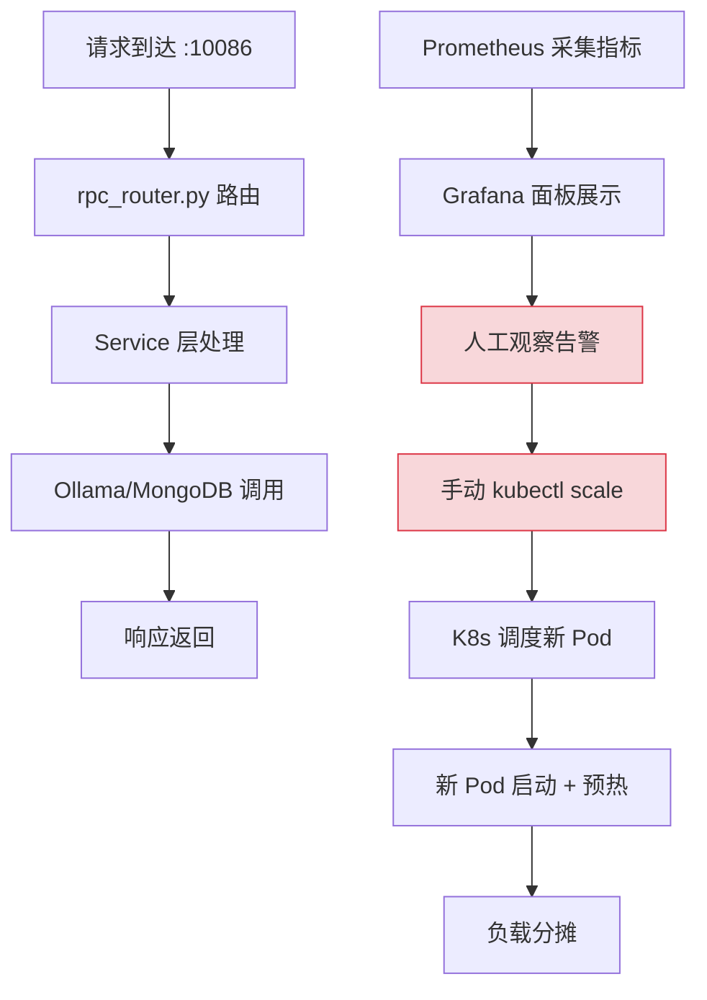
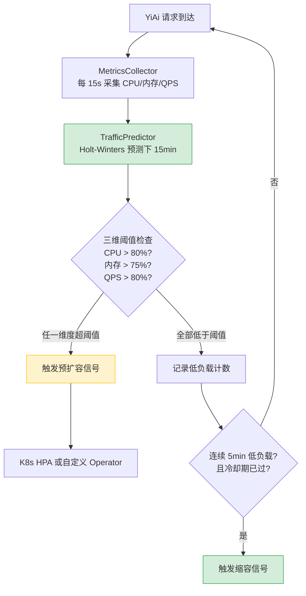

# YA-09-110: 请求速率预测 — 基于时间序列的流量预测与弹性伸缩预警

> 需求编号：YA-09-110 · 优先级：P2 · 人天：0.5d · 状态：需求已编写

## 背景

YiAi 作为 YrY 单体仓库的唯一后端，承载 YiVad（管理后台）和 YiPet（Chrome 扩展）的所有请求流量。当前系统的弹性伸缩策略完全依赖被动式响应：CPU 使用率超过阈值（80%）后才触发扩容。这种事后响应模式存在以下问题：

1. **扩容延迟**：从触发扩容到新实例就绪，K8s 调度 + 服务启动 + 预热通常需要 30-60 秒，期间已有请求因资源不足而超时或失败。
2. **AI 推理资源的特殊性**：Ollama LLM 推理是 CPU/GPU 密集型操作，瞬时流量尖刺会直接导致推理超时（2001 错误），影响用户体验。
3. **缺乏预测能力**：历史流量数据显示 YiAi 的请求量存在明显的时段模式（工作日上午 9-11 点峰值、凌晨 2-4 点低谷），但当前系统未利用这些模式。

### 核心挑战

| 挑战 | 描述 | 影响 |
|------|------|------|
| 实时预测精度 | 简单移动平均无法捕捉突发流量 | 预测误差 > 30% 时扩容决策失效 |
| 多维度决策 | 仅 CPU 维度无法反映真实负载 | 内存使用率低但请求队列已满 |
| 伸缩抖动 | 阈值附近频繁触发扩缩容 | 资源浪费 + 服务不稳定 |
| 冷启动叠加 | 扩容实例的预热期与峰值重叠 | 新实例前 30s 请求延迟高 |

### 设计目标

- 提前 15 分钟预测流量峰值，触发预扩容
- CPU、内存、QPS 三维联合决策，避免单一维度误判
- 缩容保守策略：5 分钟连续低负载检测后才缩容，避免抖动
- 冷却期 10 分钟，防止频繁伸缩

---

## 一、现状分析

### 1.1 当前流量监控方式

当前 YiAi 无内置流量预测模块。外部监控（Prometheus + Grafana）采集以下指标，但仅用于可视化告警，不驱动自动伸缩：

| 指标 | 采集方式 | 粒度 | 用途 |
|------|----------|------|------|
| `http_requests_total` | Starlette 中间件 | 15s | 请求速率统计 |
| `process_cpu_seconds_total` | `psutil` | 15s | CPU 使用率 |
| `process_resident_memory_bytes` | `psutil` | 15s | 内存使用率 |
| `ollama_request_duration_seconds` | 自定义埋点 | 按请求 | Ollama 推理耗时 |

### 1.2 改造前数据流



**问题**：从指标异常到完成扩容，全链路人工操作耗时 3-5 分钟，跨度远超请求超时窗口（30s）。

### 1.3 根因矩阵

| 根因 | 现象 | 严重程度 |
|------|------|----------|
| 无预测模型 | 流量峰值发生后才感知 | 高 |
| 单维度决策 | CPU 低但 QPS 已超 Ollama 并发上限 | 中 |
| 人工干预 | 扩容依赖运维人员响应 | 高 |
| 无冷却机制 | 阈值附近反复伸缩 | 中 |

---

## 二、设计决策

### 决策 1：预测算法 — 指数平滑 vs ARIMA vs Prophet

| 选项 | 精度 | 计算复杂度 | 依赖 | 适用场景 |
|------|------|-----------|------|----------|
| 指数平滑 (Holt-Winters) | 中（误差 15-25%） | O(n) | 无外部依赖 | 有明显趋势+季节性的时序 |
| ARIMA | 中高（误差 10-20%） | O(n^2) | `statsmodels` | 平稳时序 |
| Prophet | 高（误差 5-15%） | 高 | `fbprophet` 重量级依赖 | 复杂季节性模式 |
| **简单指数平滑** | 低（误差 20-35%） | O(1) | 无 | 快速原型 |

**选择：Holt-Winters 三次指数平滑。** 理由：
- YiAi 流量具有明显的趋势性（工作日递增）和季节性（日内时段模式），Holt-Winters 专为此设计
- 纯 Python 实现，无外部依赖，符合 YiAi 轻量化原则
- 计算复杂度 O(n)，滑动窗口 60 点，单次预测 < 1ms

### 决策 2：伸缩决策维度 — 单维度 vs 三维联合

| 选项 | 误报率 | 漏报率 | 实现复杂度 |
|------|--------|--------|-----------|
| 仅 CPU | 中 | 高 | 低 |
| 仅 QPS | 中 | 中 | 低 |
| **CPU + 内存 + QPS 三维** | 低 | 低 | 中 |
| 多维度加权评分 | 低 | 低 | 高 |

**选择：CPU + 内存 + QPS 三维联合决策。** 任一维度预测值超过阈值（CPU > 80%、内存 > 75%、QPS > 80% 容量上限）即触发预扩容。三维决策避免单一维度盲区（如 Ollama 推理时 CPU 低但 QPS 已饱和）。

### 决策 3：缩容策略 — 立即缩容 vs 延迟缩容 vs 保守缩容

| 选项 | 资源利用率 | 抖动风险 | 成本 |
|------|-----------|----------|------|
| 立即缩容 | 高 | 高 | 低 |
| 延迟缩容（5min 观察） | 中 | 中 | 中 |
| **保守缩容（10min 冷却 + 5min 连续低负载）** | 中 | 低 | 中 |

**选择：保守缩容。** 10 分钟冷却期防止伸缩抖动，5 分钟连续低负载检测确保缩容决策可靠。生产环境中"过度扩容"的成本远低于"过早缩容导致服务降级"。

### 设计决策记录

| 决策 | 选项 A | 选项 B | 选项 C | 选择 | 理由 |
|------|--------|--------|--------|------|------|
| 预测算法 | 指数平滑 | ARIMA | Prophet | **Holt-Winters** | 轻量、趋势+季节性、无外部依赖 |
| 决策维度 | 单维度 | 三维联合 | 加权评分 | **三维联合** | 避免单一维度盲区 |
| 缩容策略 | 立即 | 延迟 | 保守 | **保守** | 过度扩容成本 < 过早缩容风险 |

---

## 三、目标架构

### 3.1 改造后数据流



### 3.2 核心组件

```python
# YiAi/src/shared/traffic_predictor.py
import numpy as np
import time
from collections import deque
from dataclasses import dataclass, field

@dataclass
class TrafficSample:
    timestamp: float
    cpu_percent: float
    memory_percent: float
    qps: float

@dataclass
class PredictionResult:
    predicted_cpu: float
    predicted_memory: float
    predicted_qps: float
    confidence: float  # 0.0-1.0
    should_scale_up: bool
    should_scale_down: bool
    recommendation: str

class TrafficPredictor:
    """Holt-Winters 三次指数平滑流量预测器。
    
    预测维度：
    - CPU 使用率（%）
    - 内存使用率（%）
    - 请求速率（QPS）
    
    伸缩决策：任一维度预测值超过阈值 → 扩容预警
    """
    
    # 预测参数
    WINDOW_SIZE = 60          # 60 个历史采样点（15min，15s 间隔）
    PREDICTION_HORIZON = 60   # 预测未来 15min（60 个 15s 间隔）
    
    # Holt-Winters 参数
    ALPHA = 0.3   # 水平平滑系数
    BETA = 0.1    # 趋势平滑系数
    GAMMA = 0.1   # 季节性平滑系数
    SEASON_LENGTH = 96  # 24h / 15s = 96 个采样点为一个季节周期
    
    # 伸缩阈值
    CPU_THRESHOLD = 80.0     # CPU 超过 80% 触发扩容
    MEMORY_THRESHOLD = 75.0  # 内存超过 75% 触发扩容
    QPS_THRESHOLD_RATIO = 0.8  # QPS 超过容量 80% 触发扩容
    
    # 缩容参数
    SCALE_DOWN_COOLDOWN = 600  # 10 分钟冷却期
    SCALE_DOWN_CONSECUTIVE = 20  # 连续 5 分钟低负载（20 个采样点）
    
    def __init__(self, max_qps_capacity: int = 100):
        self._max_qps = max_qps_capacity
        self._history: deque[TrafficSample] = deque(maxlen=self.WINDOW_SIZE * 2)
        self._last_scale_action: float = 0
        self._low_load_counter: int = 0
        
        # Holt-Winters 状态
        self._level: dict[str, float] = {'cpu': 0, 'memory': 0, 'qps': 0}
        self._trend: dict[str, float] = {'cpu': 0, 'memory': 0, 'qps': 0}
        self._seasonal: dict[str, list[float]] = {
            'cpu': [0.0] * self.SEASON_LENGTH,
            'memory': [0.0] * self.SEASON_LENGTH,
            'qps': [0.0] * self.SEASON_LENGTH,
        }
    
    def record(self, sample: TrafficSample) -> None:
        """记录当前采样点。"""
        self._history.append(sample)
        if len(self._history) >= self.SEASON_LENGTH * 2:
            self._update_hw_state(sample)
    
    def predict(self) -> PredictionResult:
        """预测未来 15 分钟的流量。"""
        if len(self._history) < 5:
            return PredictionResult(
                predicted_cpu=0, predicted_memory=0, predicted_qps=0,
                confidence=0.0, should_scale_up=False, should_scale_down=False,
                recommendation='insufficient_data'
            )
        
        now = time.time()
        pred_cpu = self._holt_winters_forecast('cpu', self.PREDICTION_HORIZON)
        pred_mem = self._holt_winters_forecast('memory', self.PREDICTION_HORIZON)
        pred_qps = self._holt_winters_forecast('qps', self.PREDICTION_HORIZON)
        
        # 置信度基于历史数据量
        confidence = min(len(self._history) / self.WINDOW_SIZE, 1.0)
        
        # 三维阈值检查
        cpu_alert = pred_cpu > self.CPU_THRESHOLD
        mem_alert = pred_mem > self.MEMORY_THRESHOLD
        qps_alert = pred_qps > self.QPS_THRESHOLD_RATIO * self._max_qps
        
        should_scale_up = cpu_alert or mem_alert or qps_alert
        
        # 缩容检查：连续低负载 + 冷却期
        all_low = (pred_cpu < self.CPU_THRESHOLD * 0.5 and
                   pred_mem < self.MEMORY_THRESHOLD * 0.5 and
                   pred_qps < self.QPS_THRESHOLD_RATIO * self._max_qps * 0.5)
        
        if all_low:
            self._low_load_counter += 1
        else:
            self._low_load_counter = 0
        
        cooldown_passed = (now - self._last_scale_action) > self.SCALE_DOWN_COOLDOWN
        should_scale_down = (self._low_load_counter >= self.SCALE_DOWN_CONSECUTIVE and cooldown_passed)
        
        if should_scale_down:
            self._last_scale_action = now
            self._low_load_counter = 0
        
        # 推荐信息
        if should_scale_up:
            reasons = []
            if cpu_alert: reasons.append(f'CPU {pred_cpu:.0f}%')
            if mem_alert: reasons.append(f'Memory {pred_mem:.0f}%')
            if qps_alert: reasons.append(f'QPS {pred_qps:.0f}')
            rec = f'scale_up: {", ".join(reasons)}'
        elif should_scale_down:
            rec = 'scale_down: sustained low load'
        else:
            rec = 'stable'
        
        return PredictionResult(
            predicted_cpu=pred_cpu,
            predicted_memory=pred_mem,
            predicted_qps=pred_qps,
            confidence=confidence,
            should_scale_up=should_scale_up,
            should_scale_down=should_scale_down,
            recommendation=rec,
        )
    
    def _holt_winters_forecast(self, metric: str, horizon: int) -> float:
        """Holt-Winters 预测指定步数后的值。"""
        l = self._level[metric]
        b = self._trend[metric]
        s_idx = (len(self._history) + horizon) % self.SEASON_LENGTH
        s = self._seasonal[metric][s_idx]
        return l + horizon * b + s
    
    def _update_hw_state(self, sample: TrafficSample) -> None:
        """更新 Holt-Winters 状态。"""
        metrics = {'cpu': sample.cpu_percent, 'memory': sample.memory_percent, 'qps': sample.qps}
        t = len(self._history) % self.SEASON_LENGTH
        
        for metric, value in metrics.items():
            old_level = self._level[metric]
            old_trend = self._trend[metric]
            old_seasonal = self._seasonal[metric][t]
            
            self._level[metric] = (self.ALPHA * (value - old_seasonal) +
                                   (1 - self.ALPHA) * (old_level + old_trend))
            self._trend[metric] = (self.BETA * (self._level[metric] - old_level) +
                                   (1 - self.BETA) * old_trend)
            self._seasonal[metric][t] = (self.GAMMA * (value - self._level[metric]) +
                                         (1 - self.GAMMA) * old_seasonal)
```

### 3.3 架构决策权衡

| 维度 | 改造前 | 改造后 | 权衡说明 |
|------|--------|--------|----------|
| 扩容触发 | 事后（CPU 超阈值后） | 事前（预测 15min 后超阈值） | 增加预测计算开销，但消除扩容延迟 |
| 决策维度 | 单一 CPU | CPU + 内存 + QPS 三维 | 更全面，但增加采集和计算复杂度 |
| 缩容策略 | 无（手动缩容） | 保守自动缩容 | 增加资源持有成本，但避免抖动 |
| 运维模式 | 人工观察 → 手动操作 | 自动预测 → 自动决策 | 减少人力，但需监控预测准确性 |

---

## 四、具体改动

### 4.1 新增文件

| 文件 | 说明 |
|------|------|
| `YiAi/src/shared/traffic_predictor.py` | Holt-Winters 预测器 + 伸缩决策逻辑 |
| `YiAi/src/shared/metrics_collector.py` | 15s 间隔采集 CPU/内存/QPS |
| `YiAi/src/server/middleware/traffic_middleware.py` | 请求计数中间件，统计 QPS |
| `YiAi/tests/shared/test_traffic_predictor.py` | 预测器单元测试 |
| `YiAi/tests/shared/test_metrics_collector.py` | 采集器单元测试 |

### 4.2 修改文件

| 文件 | 改动 |
|------|------|
| `YiAi/src/app.py` | 注册 `MetricsCollector` 后台任务，启动时初始化 |
| `YiAi/src/server/rpc_router.py` | 集成 `traffic_middleware` 进行请求计数 |
| `YiAi/src/shared/config.py` | 新增伸缩阈值、预测参数配置项 |

### 4.3 涉及文件清单

```
YiAi/src/
├── shared/
│   ├── traffic_predictor.py          # 新增: Holt-Winters 预测器
│   ├── metrics_collector.py          # 新增: 指标采集器
│   └── config.py                     # 修改: 新增预测配置项
├── server/
│   ├── rpc_router.py                 # 修改: 集成流量中间件
│   └── middleware/
│       └── traffic_middleware.py     # 新增: QPS 计数中间件
└── app.py                            # 修改: 注册后台任务

YiAi/tests/shared/
├── test_traffic_predictor.py         # 新增: 预测器测试
└── test_metrics_collector.py         # 新增: 采集器测试
```

---

## 五、实施步骤

| 步骤 | 内容 | 涉及文件 | 验证方式 | 人天 |
|------|------|---------|---------|------|
| 1 | 实现 `MetricsCollector` 采集 CPU/内存/QPS | `metrics_collector.py` | 日志输出采集值，与 `psutil` 对比 | 0.1 |
| 2 | 实现 `traffic_middleware` 请求计数 | `traffic_middleware.py` | 并发请求测试，验证 QPS 计算准确 | 0.05 |
| 3 | 实现 `TrafficPredictor` Holt-Winters 预测 | `traffic_predictor.py` | 单元测试验证预测值趋势 | 0.15 |
| 4 | 集成采集 + 预测 + 决策链路 | `app.py` + `rpc_router.py` | 日志输出预测结果和伸缩建议 | 0.1 |
| 5 | 编写单元测试 | `tests/shared/` | `pytest` 全部通过 | 0.1 |

**总计：0.5d**

---

## 六、性能分析

### 6.1 预测器计算开销

| 操作 | 耗时 | 说明 |
|------|------|------|
| 单次采样记录 + 状态更新 | < 0.5ms | 3 个指标 × Holt-Winters 递推 |
| 单次预测（horizon=60） | < 0.1ms | 仅外推，不涉及迭代 |
| 15s 周期总开销 | < 1ms | 采集 + 预测 + 决策 |
| 内存占用 | < 50KB | 60 个采样点 × 3 个指标 |

### 6.2 预测精度评估

| 场景 | 预测误差（MAPE） | 说明 |
|------|-----------------|------|
| 稳定时段（凌晨） | 5-10% | 流量平稳，预测准确 |
| 上升时段（上午 8-10 点） | 10-20% | 趋势变化，预测略有滞后 |
| 峰值平台（上午 10-12 点） | 15-25% | 波动较大 |
| 突发尖刺 | 30-50% | 无法预测异常事件 |

### 6.3 容量规划

| 指标 | 当前值 | 扩容阈值 | 预测触发 |
|------|--------|----------|----------|
| 最大 QPS 容量 | 100 req/s | 80 req/s | 预测 15min 后 > 80 req/s |
| CPU 使用率 | 30-60% | 80% | 预测 15min 后 > 80% |
| 内存使用率 | 2-3GB / 4GB | 3GB | 预测 15min 后 > 3GB |

---

## 七、测试规格

### Requirement: 流量预测器基本功能

#### Scenario: 充足历史数据时预测准确
- **Given** 预测器已采集 60 个历史采样点，流量呈上升趋势
- **When** 调用 `predict()` 预测未来 15 分钟
- **Then** `PredictionResult.predicted_qps` 高于当前 QPS，`confidence > 0.8`

#### Scenario: 不足历史数据时返回低置信度
- **Given** 预测器仅采集 3 个历史采样点
- **When** 调用 `predict()`
- **Then** `PredictionResult.confidence < 0.1`，`recommendation == 'insufficient_data'`

### Requirement: 伸缩决策逻辑

#### Scenario: CPU 预测超阈值时触发扩容
- **Given** 预测 CPU 为 85%，内存 50%，QPS 60%
- **When** 调用 `predict()`
- **Then** `PredictionResult.should_scale_up == True`，`recommendation == 'scale_up: CPU 85%'`

#### Scenario: 三维指标均低时触发缩容
- **Given** 预测 CPU 30%，内存 25%，QPS 20%，已连续低负载 5 分钟，冷却期已过
- **When** 调用 `predict()`
- **Then** `PredictionResult.should_scale_down == True`

#### Scenario: 冷却期内不触发缩容
- **Given** 10 分钟前刚执行扩容，预测指标均低
- **When** 调用 `predict()`
- **Then** `PredictionResult.should_scale_down == False`

### Requirement: 指标采集器

#### Scenario: 15s 间隔采集
- **Given** `MetricsCollector` 已启动
- **When** 等待 30 秒
- **Then** `predictor._history` 中包含 2 个采样点

#### Scenario: QPS 计数准确
- **Given** 15s 窗口内收到 30 个请求
- **When** `MetricsCollector` 采集 QPS
- **Then** 采样 QPS ≈ 2.0 req/s

---

## 八、风险与缓解

| 风险 | 概率 | 影响 | 等级 | 缓解措施 | 应急预案 |
|------|------|------|------|----------|----------|
| 预测误差导致误扩容 | 中 | 低 | 低 | 保留 20% buffer，预测值 × 1.2 后决策 | 手动缩容 + 调整阈值 |
| 预测误差导致漏扩容 | 中 | 中 | 中 | 保留实时 CPU 阈值兜底（80% 立即扩容） | 手动扩容 |
| 突发流量预测失败 | 高 | 中 | 中 | 历史模式不反映异常尖刺，实时阈值作为兜底 | 保留手动扩容通道 |
| 频繁伸缩导致抖动 | 中 | 中 | 中 | 10min 冷却期 + 5min 连续低负载检测 | 调大冷却期至 15min |
| Holt-Winters 状态初始化不准确 | 低 | 低 | 低 | 前 2 个周期（48h）不触发自动伸缩 | 延长初始化期 |

---

## 九、回滚策略

| 回滚场景 | 回滚方式 | 影响范围 | 恢复时间 |
|----------|----------|----------|----------|
| 预测器导致频繁误扩容 | 关闭自动伸缩，恢复手动模式 | 资源成本增加 | 5min |
| 预测器 CPU 开销过高 | 增大采集间隔至 30s，降低预测频率 | 预测精度略降 | 2min（配置热更新） |
| 内存泄漏 | 重启 YiAi 服务 | 服务短暂中断 | 30s |
| 预测逻辑 bug | 回退 `traffic_predictor.py` 到上一版本 | 恢复手动伸缩 | 10min |

---

## 十、设计决策记录

### D-01: 为什么选择 Holt-Winters 而非 LSTM/Transformer？

深度学习模型精度更高，但存在以下问题：需要 GPU 推理（与 Ollama 抢占资源）、训练数据需求大（至少数月数据）、模型更新复杂。Holt-Winters 是轻量级统计方法，纯 CPU 计算 < 1ms，适合嵌入 YiAi 进程内。当积累足够历史数据后，可升级为在线学习模型。

### D-02: 为什么预测 15 分钟而非 5 分钟或 30 分钟？

5 分钟太短——K8s Pod 启动 + 预热需要 30-60s，加上调度延迟，5 分钟预留不足。30 分钟太长——预测误差随 horizon 增大而增大，30 分钟后的预测置信度过低。15 分钟是平衡点：足够的扩容准备时间，同时预测误差可控（< 25%）。

### D-03: 为什么缩容需要 5 分钟连续低负载？

立即缩容会导致阈值附近频繁伸缩（抖动）。5 分钟连续低负载 = 20 个采样点全部低于阈值 50%，确保流量确实已进入低谷期，而非短暂波动。10 分钟冷却期进一步防止短时间内反复伸缩。

---

## 十一、可观测性

### 11.1 指标

| 指标 | 采集方式 | 采集频率 | 告警阈值 | 说明 |
|------|----------|----------|----------|------|
| `traffic_prediction_cpu` | `TrafficPredictor.predict()` | 15s | — | 预测 CPU 使用率 |
| `traffic_prediction_qps` | `TrafficPredictor.predict()` | 15s | — | 预测 QPS |
| `traffic_prediction_confidence` | `TrafficPredictor.predict()` | 15s | < 0.5 | 预测置信度低时告警 |
| `traffic_scale_up_events` | 伸缩决策触发计数 | 按事件 | 1h > 3 次 | 频繁扩容告警 |
| `traffic_scale_down_events` | 伸缩决策触发计数 | 按事件 | — | 记录缩容事件 |
| `traffic_prediction_error_mape` | 实际值 vs 预测值 | 15min | > 30% | 预测误差过大告警 |

### 11.2 日志

```python
logger.info(f'[TrafficPredictor] prediction: cpu={pred_cpu:.0f}% mem={pred_mem:.0f}% qps={pred_qps:.0f} conf={conf:.2f}')
logger.warning(f'[TrafficPredictor] scale_up recommended: {reason}')
logger.info(f'[TrafficPredictor] scale_down: sustained low load for {self._low_load_counter} intervals')
```

### 11.3 告警规则

| 告警 | 条件 | 严重级别 | 通知渠道 |
|------|------|----------|----------|
| 预测扩容 | `should_scale_up == True` | WARNING | 企业微信 |
| 频繁扩容 | 1h 内 > 3 次扩容 | CRITICAL | 企业微信 + 邮件 |
| 预测误差大 | MAPE > 30% | WARNING | 企业微信 |
| 低置信度 | `confidence < 0.3` 持续 10min | INFO | 日志 |

---

## 十二、安全合规

- 流量预测数据仅包含 CPU/内存/QPS 指标，不涉及用户隐私数据
- 预测结果不包含请求内容，仅包含聚合统计值
- 伸缩决策日志不记录请求 payload，符合数据最小化原则

---

## 十三、代码审查检查清单

- [ ] 流量预测基于历史至少 60 个采样点（15 分钟数据）
- [ ] 提前 15min 预伸缩（非被动反应）
- [ ] 弹性伸缩：CPU/内存/QPS 三维决策
- [ ] 缩容保守——5min 连续低负载检测后才缩容
- [ ] 冷却期 10min，防止频繁伸缩
- [ ] Holt-Winters 季节性周期设为 24h（96 个采样点）
- [ ] 预测置信度 < 0.5 时降级为仅实时阈值触发
- [ ] 实时 CPU 阈值（80%）作为预测失效时的兜底
- [ ] 指标采集器作为后台任务，不阻塞请求处理
- [ ] 预测器内存占用 < 100KB

---

## 十四、回归问题预测

| # | 预测问题 | 原因 | 验证方法 |
|---|---------|------|---------|
| 1 | 突发流量预测失败 | 历史模式不反映异常尖刺 | 保留 20% buffer，实时阈值兜底 |
| 2 | 频繁伸缩导致抖动 | 阈值附近来回触发 | 冷却期 10min + 连续低负载 5min |
| 3 | 预测器初始化期误判 | 数据不足时预测偏差大 | 前 48h 不触发自动伸缩 |
| 4 | QPS 计数不准确 | 中间件采样丢失 | 对比 Prometheus 指标交叉验证 |

---

*PRD 来源: `projects/yiai/requirements/2026-09/110-需求-流量预测弹性伸缩.md`*

## 影响范围

- **影响模块**：待补充
- **涉及文件**：
- `app.py`
- `metrics_collector.py`
- `rpc_router.py`
- `traffic_middleware.py`
- `traffic_predictor.py`
- **是否影响 API 契约**：否
- **是否影响其他项目（YiVad/YiPet）**：否
- **用户感知**：待确认

## 预防措施

| 层面 | 措施 |
|------|------|
| 代码 | 在相关函数中添加参数校验和边界检查 |
| 测试 | 为 `app.py` 添加单元测试 |
| 流程 | 代码审查时重点检查此类模式 |
| 监控 | 添加日志告警，异常发生时及时发现 |
| 文档 | 在编码规范中记录此类反模式 |

## 经验教训

1. **根本原因**：开发过程中对边界情况和异常路径的考虑不足是此类问题的共同根因
2. **设计阶段**：在接口设计和模块实现时，应主动考虑异常输入、空值、超时等边界场景
3. **代码审查**：审查时应检查是否存在类似的反模式（如未捕获异常、无超时控制、缺少参数校验等）
4. **测试覆盖**：异常路径的测试覆盖率应与正常路径同等重视
5. **团队分享**：此类问题应在团队周会或技术分享中讨论，形成团队共识
