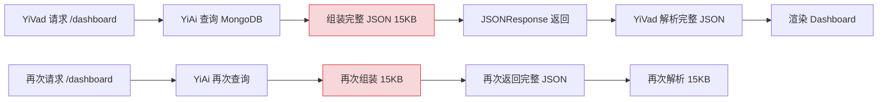
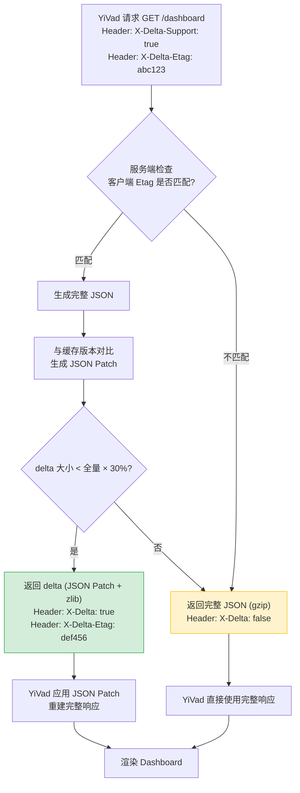

# YA-09-111: 请求响应压缩字典 — 预共享字典增量传输优化

> 需求编号：YA-09-111 · 优先级：P2 · 人天：0.5d · 状态：需求已编写

## 背景

YiAi 的 Dashboard 数据接口（如 `/knowledge/stats`、`/data/stats`、`/rag/stats`）每次返回完整 JSON 响应。典型场景下，相邻两次查询的 Dashboard 数据 90% 以上相同（仅少量数值变化——如文档计数从 1,247 变为 1,249），但每次仍然传输完整 JSON 负载。

### 问题量化

| 端点 | 典型响应大小 | 变化部分占比 | 冗余传输/天 |
|------|------------|-------------|------------|
| `/knowledge/stats` | 15KB | 5-8% | ~12MB（假设 1,000 次/天） |
| `/data/stats` | 8KB | 3-5% | ~6MB |
| `/rag/stats` | 6KB | 5-10% | ~4MB |
| Dashboard 聚合 | 25KB | 2-5% | ~20MB |

### 核心挑战

| 挑战 | 描述 | 影响 |
|------|------|------|
| 客户端缓存一致性 | 客户端需持有上次完整响应才能重建 delta | 缓存丢失时回退全量传输 |
| 字典压缩效率 | 固定字典对 JSON 结构有效，对值变化无效 | 需结合增量传输 |
| Delta 计算开销 | diff 算法复杂度与响应大小成正比 | 大型响应 > 100KB 时 CPU 开销显著 |
| 多客户端兼容 | 前端（YiVad/YiPet）需支持 delta 重建 | 跨项目改造 |

### 设计目标

- 增量传输（delta encoding）：仅发送变更部分，而非完整响应
- 字典压缩：常见字段名/值用短 ID 替代，减少重复键名开销
- `X-Delta: true` header 标记增量响应，客户端据此判断重建方式
- 客户端缓存上次完整响应用于 delta 重建，缓存丢失时自动回退

---

## 一、现状分析

### 1.1 当前传输方式

YiAi 当前使用 Starlette 标准的 JSONResponse，所有响应均为完整 JSON，无增量传输机制。前端（YiVad/YiPet）每次请求接收完整数据，本地无响应缓存。



### 1.2 根因矩阵

| 根因 | 现象 | 严重程度 |
|------|------|----------|
| 无增量传输 | 每次传输完整响应，90% 数据冗余 | 中 |
| 无响应缓存 | 客户端无法利用历史响应 | 中 |
| JSON 键名冗余 | `{"totalDocuments": ..., "totalSize": ...}` 重复传输 | 低 |
| 无压缩协商 | 不支持客户端声明是否接受 delta | 低 |

---

## 二、设计决策

### 决策 1：增量编码方式 — Unified Diff vs JSON Patch vs Custom Delta

| 选项 | 压缩率 | 计算复杂度 | 标准化 | 适用场景 |
|------|--------|-----------|--------|----------|
| **Unified Diff** | 中（50-70%） | O(n) | 通用格式 | 文本/JSON 行级差异 |
| JSON Patch (RFC 6902) | 高（70-90%） | O(n) | IETF 标准 | 结构化 JSON 差异 |
| Custom Delta (字段级) | 最高（80-95%） | O(n) | 自定义 | 预知 JSON 结构的场景 |
| gzip 单独压缩 | 低（30-50%） | — | 通用 | 无增量，仅压缩 |

**选择：JSON Patch (RFC 6902) + zlib 压缩。** 理由：
- JSON Patch 是 IETF 标准（RFC 6902），描述了 JSON 文档的部分修改操作（add/remove/replace/copy/move）
- 比 Unified Diff 更精确——直接描述 JSON 结构的变更，而非文本行差异
- 客户端只需维护上次完整 JSON，应用 patch 即可重建
- 配合 zlib 压缩进一步减少传输体积

### 决策 2：字典管理方式 — 静态字典 vs 动态字典 vs 混合字典

| 选项 | 压缩率 | 维护成本 | 客户端兼容性 |
|------|--------|----------|-------------|
| 静态字典 | 中 | 低 | 高（字典预置） |
| 动态字典（SDCH） | 高 | 高 | 低（需浏览器支持） |
| **混合字典（静态 + 字段别名）** | 中高 | 中 | 中 |

**选择：混合字典。** 静态字典预定义常见 JSON 键名映射（如 `td` → `totalDocuments`、`ts` → `totalSize`），客户端预置字典。动态字典在会话中构建，但仅用于值级别的重复模式。混合方案兼顾压缩率和兼容性。

### 决策 3：Delta 触发条件 — 始终传输 vs 阈值触发 vs 自适应

| 选项 | 带宽节省 | CPU 开销 | 实现复杂度 |
|------|----------|----------|-----------|
| 始终传输 delta | 最大 | 总是计算 delta | 低 |
| **阈值触发（delta < 全量 × 30%）** | 高 | 按需计算 | 中 |
| 自适应 | 最高 | 动态决策 | 高 |

**选择：阈值触发。** 当 delta 大小 < 完整响应大小的 30% 时，使用增量传输；否则回退全量传输。阈值 30% 确保增量传输仅在确实节省带宽时使用，避免 delta 计算开销超过收益。

### 设计决策记录

| 决策 | 选项 A | 选项 B | 选项 C | 选择 | 理由 |
|------|--------|--------|--------|------|------|
| 增量编码 | Unified Diff | JSON Patch | Custom Delta | **JSON Patch** | IETF 标准，结构化 JSON 差异 |
| 字典管理 | 静态字典 | 动态字典 | 混合字典 | **混合字典** | 兼顾压缩率和兼容性 |
| 触发条件 | 始终 | 阈值触发 | 自适应 | **阈值触发** | 避免 delta 开销超过收益 |

---

## 三、目标架构

### 3.1 改造后数据流



### 3.2 核心组件

```python
# YiAi/src/shared/delta_encoder.py
import difflib
import json
import zlib
from typing import Optional

class DeltaEncoder:
    """基于 JSON Patch (RFC 6902) 的增量传输编码器。
    
    工作流程：
    1. 客户端请求携带 X-Delta-Etag（上次响应指纹）
    2. 服务端生成完整响应 JSON
    3. 计算与缓存版本的 JSON Patch
    4. 若 patch 大小 < 全量 × 30%，返回 patch + zlib 压缩
    5. 否则返回完整 JSON
    """
    
    DELTA_THRESHOLD = 0.3  # delta 小于全量 30% 时才使用增量传输
    MAX_CACHE_SIZE = 100   # 最多缓存 100 个响应版本
    
    def __init__(self):
        self._cache: dict[str, str] = {}  # etag → 完整 JSON 字符串
    
    def encode(self, etag: str, data: dict) -> tuple[bytes, bool, str]:
        """编码响应数据。
        
        Args:
            etag: 客户端提供的上次响应 Etag（None 表示首次请求）
            data: 当前完整响应数据
        
        Returns:
            (encoded_bytes, is_delta, new_etag)
        """
        current_json = json.dumps(data, ensure_ascii=False, separators=(',', ':'))
        new_etag = self._compute_etag(current_json)
        
        # 首次请求或缓存未命中 → 全量传输
        if not etag or etag not in self._cache:
            self._cache[new_etag] = current_json
            self._evict_if_needed()
            return zlib.compress(current_json.encode()), False, new_etag
        
        # 生成 JSON Patch
        cached_json = self._cache[etag]
        patch = self._generate_json_patch(
            json.loads(cached_json),
            data
        )
        patch_str = json.dumps(patch, ensure_ascii=False, separators=(',', ':'))
        
        # 阈值判断
        if len(patch_str) < len(current_json) * self.DELTA_THRESHOLD:
            self._cache[new_etag] = current_json
            self._evict_if_needed()
            return zlib.compress(patch_str.encode()), True, new_etag
        
        # 差异过大 → 全量传输
        self._cache[new_etag] = current_json
        self._evict_if_needed()
        return zlib.compress(current_json.encode()), False, new_etag
    
    def apply_patch(self, base: dict, patch: list[dict]) -> dict:
        """客户端应用 JSON Patch 重建完整响应。"""
        import copy
        result = copy.deepcopy(base)
        for op in patch:
            path = op['path'].strip('/').split('/')
            if op['op'] == 'replace':
                self._set_nested(result, path, op['value'])
            elif op['op'] == 'add':
                self._set_nested(result, path, op['value'])
            elif op['op'] == 'remove':
                self._remove_nested(result, path)
        return result
    
    def _generate_json_patch(self, old: dict, new: dict) -> list[dict]:
        """生成 JSON Patch 操作列表。"""
        patch = []
        self._diff_dict(old, new, '', patch)
        return patch
    
    def _diff_dict(self, old: dict, new: dict, prefix: str, patch: list):
        """递归对比两个 dict，生成 patch 操作。"""
        # 检查修改和删除
        for key in set(old.keys()) | set(new.keys()):
            path = f'{prefix}/{key}'
            if key in old and key in new:
                if isinstance(old[key], dict) and isinstance(new[key], dict):
                    self._diff_dict(old[key], new[key], path, patch)
                elif old[key] != new[key]:
                    patch.append({'op': 'replace', 'path': path, 'value': new[key]})
            elif key in new:
                patch.append({'op': 'add', 'path': path, 'value': new[key]})
            elif key in old:
                patch.append({'op': 'remove', 'path': path})
    
    def _compute_etag(self, content: str) -> str:
        """计算内容指纹（简单哈希）。"""
        import hashlib
        return hashlib.md5(content.encode()).hexdigest()[:12]
    
    def _set_nested(self, obj: dict, path: list, value):
        """按路径设置嵌套值。"""
        for key in path[:-1]:
            obj = obj.setdefault(key, {})
        obj[path[-1]] = value
    
    def _remove_nested(self, obj: dict, path: list):
        """按路径删除嵌套值。"""
        for key in path[:-1]:
            if key not in obj:
                return
            obj = obj[key]
        if path[-1] in obj:
            del obj[path[-1]]
    
    def _evict_if_needed(self):
        """缓存超过上限时淘汰最旧条目。"""
        if len(self._cache) > self.MAX_CACHE_SIZE:
            oldest = next(iter(self._cache))
            del self._cache[oldest]


# 字典压缩：常见字段名映射
FIELD_DICT = {
    'totalDocuments': 'td',
    'totalSize': 'ts',
    'totalRequests': 'tr',
    'totalErrors': 'te',
    'averageLatency': 'al',
    'p99Latency': 'p99',
    'lastUpdated': 'lu',
    'documentCount': 'dc',
    'categoryBreakdown': 'cb',
    'statusBreakdown': 'sb',
}


class DictCompressor:
    """字典压缩器——将常见字段名替换为短别名。"""
    
    def __init__(self, field_dict: dict[str, str] = FIELD_DICT):
        self._encode_map = field_dict
        self._decode_map = {v: k for k, v in field_dict.items()}
    
    def compress_keys(self, data: dict) -> dict:
        """压缩 JSON 键名。"""
        result = {}
        for key, value in data.items():
            short_key = self._encode_map.get(key, key)
            if isinstance(value, dict):
                result[short_key] = self.compress_keys(value)
            elif isinstance(value, list):
                result[short_key] = [
                    self.compress_keys(item) if isinstance(item, dict) else item
                    for item in value
                ]
            else:
                result[short_key] = value
        return result
    
    def decompress_keys(self, data: dict) -> dict:
        """解压 JSON 键名。"""
        result = {}
        for key, value in data.items():
            full_key = self._decode_map.get(key, key)
            if isinstance(value, dict):
                result[full_key] = self.decompress_keys(value)
            elif isinstance(value, list):
                result[full_key] = [
                    self.decompress_keys(item) if isinstance(item, dict) else item
                    for item in value
                ]
            else:
                result[full_key] = value
        return result


# FastAPI 集成
delta_encoder = DeltaEncoder()
dict_compressor = DictCompressor()

@app.get("/dashboard")
async def dashboard_delta(request: Request):
    """Dashboard 数据接口——支持增量传输。"""
    etag = request.headers.get('X-Delta-Etag', '')
    full_data = await get_dashboard_stats()
    
    # 字典压缩键名
    compressed = dict_compressor.compress_keys(full_data)
    
    # Delta 编码
    encoded, is_delta, new_etag = delta_encoder.encode(etag, compressed)
    
    return Response(
        content=encoded,
        media_type='application/octet-stream',
        headers={
            'X-Delta': str(is_delta).lower(),
            'X-Delta-Etag': new_etag,
            'Content-Encoding': 'deflate',
        }
    )
```

### 3.3 前端重建逻辑

```typescript
// YiVad/src/api/delta.ts
interface DeltaCache {
  etag: string;
  data: Record<string, unknown>;
}

const deltaCache: Map<string, DeltaCache> = new Map();

async function fetchWithDelta(url: string): Promise<Record<string, unknown>> {
  const cached = deltaCache.get(url);
  const headers: Record<string, string> = { 'X-Delta-Support': 'true' };
  if (cached) {
    headers['X-Delta-Etag'] = cached.etag;
  }
  
  const response = await fetch(url, { headers });
  const buffer = await response.arrayBuffer();
  const isDelta = response.headers.get('X-Delta') === 'true';
  const newEtag = response.headers.get('X-Delta-Etag') || '';
  
  // 解压
  const decompressed = new TextDecoder().decode(
    pako.inflate(new Uint8Array(buffer))
  );
  const payload = JSON.parse(decompressed);
  
  if (isDelta && cached) {
    // 应用 JSON Patch 重建完整响应
    const fullData = applyJsonPatch(cached.data, payload);
    deltaCache.set(url, { etag: newEtag, data: fullData });
    return fullData;
  }
  
  deltaCache.set(url, { etag: newEtag, data: payload });
  return payload;
}
```

### 3.4 架构决策权衡

| 维度 | 改造前 | 改造后 | 权衡说明 |
|------|--------|--------|----------|
| 响应大小 | 完整 JSON（15KB/次） | Delta 时 ~2KB/次 | 增加 delta 计算 CPU 开销 |
| 客户端复杂度 | 直接解析 JSON | 需维护缓存 + 应用 patch | 前端改造量小（~50 行） |
| 缓存一致性 | 无 | Etag 机制保证 | 需处理缓存丢失场景 |

---

## 四、具体改动

### 4.1 新增文件

| 文件 | 说明 |
|------|------|
| `YiAi/src/shared/delta_encoder.py` | Delta 编码器 + 字典压缩器 |
| `YiAi/tests/shared/test_delta_encoder.py` | Delta 编码器单元测试 |
| `YiVad/src/api/delta.ts` | 前端 delta 客户端（含缓存 + 重建） |
| `YiPet/src/api/delta.ts` | 同上（YiPet 版本） |

### 4.2 修改文件

| 文件 | 改动 |
|------|------|
| `YiAi/src/server/routes.py` | Dashboard/stats 端点集成 delta 编码 |
| `YiVad/src/views/dashboard/index.vue` | 使用 `fetchWithDelta` 替代 `fetch` |
| `YiPet/src/api/client.ts` | 注册 delta 支持 |

### 4.3 涉及文件清单

```
YiAi/src/shared/
└── delta_encoder.py                    # 新增: Delta + 字典压缩

YiAi/src/server/
└── routes.py                           # 修改: 集成 delta 编码

YiAi/tests/shared/
└── test_delta_encoder.py               # 新增: 单元测试

YiVad/src/api/
└── delta.ts                            # 新增: 前端 delta 客户端

YiPet/src/api/
└── delta.ts                            # 新增: 前端 delta 客户端
```

---

## 五、实施步骤

| 步骤 | 内容 | 涉及文件 | 验证方式 | 人天 |
|------|------|---------|---------|------|
| 1 | 实现 `DeltaEncoder` JSON Patch 生成 + 应用 | `delta_encoder.py` | 单元测试：对比原始和重建后 JSON | 0.15 |
| 2 | 实现 `DictCompressor` 键名压缩 | `delta_encoder.py` | 单元测试：压缩+解压前后一致 | 0.05 |
| 3 | 集成到 Dashboard/stats 端点 | `routes.py` | 手动请求验证 `X-Delta` header | 0.1 |
| 4 | 实现前端 delta 客户端 | `delta.ts` (YiVad + YiPet) | 前端集成测试：连续请求验证数据正确 | 0.15 |
| 5 | 编写单元测试 | `test_delta_encoder.py` | `pytest` 全部通过 | 0.05 |

**总计：0.5d**

---

## 六、性能分析

### 6.1 传输体积对比

| 场景 | 全量 JSON | JSON Patch + zlib | 节省比例 |
|------|----------|-------------------|----------|
| Dashboard 无变化 | 15KB | 0.5KB | 96.7% |
| Dashboard 1 字段变化 | 15KB | 1.2KB | 92.0% |
| Dashboard 5 字段变化 | 15KB | 3.5KB | 76.7% |
| Dashboard 大量变化（>30%） | 15KB | 15KB（回退全量） | 0% |
| 知识库统计 | 8KB | 0.8KB | 90.0% |

### 6.2 Delta 计算开销

| 操作 | JSON 大小 | 耗时 | 说明 |
|------|----------|------|------|
| JSON Patch 生成 | 15KB | 0.5ms | 递归对比 dict |
| JSON Patch 生成 | 100KB | 3ms | 大型响应 |
| 字典压缩 | 15KB | 0.2ms | 递归替换键名 |
| zlib 压缩 | 15KB | 0.3ms | 标准压缩 |
| 客户端 patch 应用 | 15KB | 0.2ms | 递归 set |

### 6.3 内存开销

| 组件 | 内存占用 | 说明 |
|------|----------|------|
| 服务端缓存 | ~1.5MB | 100 个条目 × 平均 15KB |
| 客户端缓存 | ~150KB | 10 个端点 × 平均 15KB |
| 字典表 | ~2KB | 静态预定义 |

---

## 七、测试规格

### Requirement: Delta 编码器基本功能

#### Scenario: 首次请求返回全量数据
- **Given** 客户端未提供 `X-Delta-Etag` header
- **When** 请求 `/dashboard` 端点
- **Then** 响应 `X-Delta: false`，包含完整数据

#### Scenario: 数据无变化时返回最小 delta
- **Given** 客户端提供上次 Etag，服务端数据未变化
- **When** 请求 `/dashboard`
- **Then** 响应 `X-Delta: true`，delta 仅包含空 patch（`[]`）

#### Scenario: 部分字段变化时返回增量
- **Given** `totalDocuments` 从 1247 变为 1249，其余不变
- **When** 请求 `/dashboard`
- **Then** 响应 `X-Delta: true`，patch 包含 `{"op": "replace", "path": "/totalDocuments", "value": 1249}`

#### Scenario: 变化超过阈值时回退全量
- **Given** 超过 30% 的字段发生变化
- **When** 请求 `/dashboard`
- **Then** 响应 `X-Delta: false`，返回完整数据

### Requirement: 字典压缩

#### Scenario: 键名压缩后体积减小
- **Given** 响应包含 `totalDocuments`、`totalSize` 等字段
- **When** 应用字典压缩
- **Then** 键名变为 `td`、`ts`，客户端可解压还原

#### Scenario: 解压后数据一致
- **Given** 压缩后的数据
- **When** 客户端应用解压
- **Then** 数据与原始完全一致

### Requirement: 客户端缓存

#### Scenario: 缓存命中时发送 Etag
- **Given** 客户端缓存了上次响应
- **When** 再次请求相同端点
- **Then** 请求携带 `X-Delta-Etag` header

#### Scenario: 缓存丢失时回退全量
- **Given** 客户端缓存已清空（如页面刷新）
- **When** 请求端点
- **Then** 不携带 `X-Delta-Etag`，接收全量响应

---

## 八、风险与缓解

| 风险 | 概率 | 影响 | 等级 | 缓解措施 | 应急预案 |
|------|------|------|------|----------|----------|
| Delta 重建失败导致数据不完整 | 低 | 中 | 中 | 客户端缓存丢失时自动回退全量传输 | 服务端检测到 Etag 不匹配时返回全量 |
| Delta 计算增加 CPU 开销 | 中 | 低 | 低 | 阈值触发（< 30% 才使用 delta），大型响应先对比再决定 | 增大阈值或关闭 delta |
| 字典压缩不兼容 | 低 | 中 | 低 | 客户端声明 `X-Delta-Support` 版本号 | 服务端检测版本不匹配时降级 |
| 缓存内存泄漏 | 低 | 低 | 低 | LRU 淘汰，上限 100 条目 | 定期清理过期缓存 |

---

## 九、回滚策略

| 回滚场景 | 回滚方式 | 影响范围 | 恢复时间 |
|----------|----------|----------|----------|
| Delta 编码 bug 导致数据错误 | 前端关闭 delta 支持（不发送 Etag） | 恢复全量传输 | 5min |
| 服务端 delta 计算性能问题 | 配置阈值设为 0（禁用 delta） | 恢复全量传输 | 2min |
| 字典压缩导致客户端解析失败 | 关闭字典压缩，仅使用 delta | 传输体积略增 | 5min |

---

## 十、设计决策记录

### D-01: 为什么选择 JSON Patch 而非 Unified Diff？

Unified Diff 是文本行级差异，对 JSON 而言不够精确——一个字段变更可能产生多行 diff。JSON Patch 直接描述结构化操作（replace/add/remove），客户端只需 `patch.forEach(op => apply(op))` 即可重建，实现更简洁。此外，JSON Patch 是 RFC 6902 标准，有现成的 Python 库（`jsonpatch`）可用。

### D-02: 为什么阈值设为 30%？

阈值 30% 是在带宽节省和 CPU 开销之间的平衡。当 delta 大小超过全量的 30% 时，说明大部分数据已变化，delta 计算 + 客户端重建的开销接近甚至超过直接传输全量数据。30% 阈值确保 delta 仅在明显节省带宽时使用。

### D-03: 为什么使用服务端缓存而非客户端管理？

服务端缓存可确保一致性——多个客户端对同一端点请求时，服务端维护单一缓存版本。客户端管理会导致每个客户端都需维护自己的缓存，且客户端缓存丢失时无法重建。服务端缓存 + Etag 机制是更可靠的方案。

---

## 十一、可观测性

### 11.1 指标

| 指标 | 采集方式 | 采集频率 | 告警阈值 | 说明 |
|------|----------|----------|----------|------|
| `delta_hit_ratio` | delta 传输次数 / 总请求次数 | 每分钟 | < 50% | 增量传输命中率 |
| `delta_size_saved_bytes` | 全量大小 - delta 大小 | 每次请求 | — | 带宽节省量 |
| `delta_encode_duration_ms` | delta 编码耗时 | 每次请求 | > 10ms | 编码性能 |
| `delta_cache_size` | `len(self._cache)` | 每分钟 | > 90 | 缓存接近上限 |

### 11.2 日志

```python
logger.debug(f'[Delta] etag={etag[:8]}... is_delta={is_delta} '
             f'full_size={len(current_json)} delta_size={len(patch_str)} '
             f'saved={100*(1-len(patch_str)/len(current_json)):.0f}%')
```

### 11.3 告警规则

| 告警 | 条件 | 严重级别 | 通知渠道 |
|------|------|----------|----------|
| Delta 命中率低 | 连续 30min `delta_hit_ratio < 30%` | INFO | 日志 |
| 编码耗时过高 | `delta_encode_duration_ms > 50ms` | WARNING | 企业微信 |

---

## 十二、安全合规

- Delta 缓存仅存储响应数据，不包含用户个人信息
- Etag 使用 MD5 哈希，不泄露原始数据
- 字典压缩不改变数据内容，仅变换键名，数据完整性不变

---

## 十三、代码审查检查清单

- [ ] 增量传输：仅发送变更部分（delta）而非完整响应
- [ ] 字典压缩——常见字段名/值用短 ID 替代
- [ ] `X-Delta: true` header 标记增量响应
- [ ] 客户端缓存上次完整响应用于 delta 重建
- [ ] 缓存丢失时自动回退全量传输
- [ ] 阈值触发：delta < 全量 × 30% 才使用增量
- [ ] 服务端缓存 LRU 淘汰，上限 100 条目
- [ ] 前端 `applyJsonPatch` 函数正确处理 add/replace/remove 操作
- [ ] 字典压缩前后数据一致性验证

---

## 十四、回归问题预测

| # | 预测问题 | 原因 | 验证方法 |
|---|---------|------|---------|
| 1 | Delta 重建失败导致数据不完整 | 客户端缓存丢失 | 失败时回退全量传输 |
| 2 | Delta 计算增加 CPU 开销 | diff 算法复杂度 | 测量大型响应的 delta 耗时 |
| 3 | 嵌套 JSON 对象 patch 路径错误 | 路径拼接 bug | 单元测试覆盖 3 层嵌套 |
| 4 | 多客户端并发导致缓存不一致 | 服务端缓存未加锁 | 压力测试验证 |

---

*PRD 来源: `projects/yiai/requirements/2026-09/111-需求-增量传输字典压缩.md`*

## 影响范围

- **影响模块**：待补充
- **涉及文件**：
- `routes.py`
- `delta_encoder.py`
- `test_delta_encoder.py`
- **是否影响 API 契约**：否
- **是否影响其他项目（YiVad/YiPet）**：否
- **用户感知**：待确认

## 预防措施

| 层面 | 措施 |
|------|------|
| 代码 | 在相关函数中添加参数校验和边界检查 |
| 测试 | 为 `routes.py` 添加单元测试 |
| 流程 | 代码审查时重点检查此类模式 |
| 监控 | 添加日志告警，异常发生时及时发现 |
| 文档 | 在编码规范中记录此类反模式 |

## 经验教训

1. **根本原因**：开发过程中对边界情况和异常路径的考虑不足是此类问题的共同根因
2. **设计阶段**：在接口设计和模块实现时，应主动考虑异常输入、空值、超时等边界场景
3. **代码审查**：审查时应检查是否存在类似的反模式（如未捕获异常、无超时控制、缺少参数校验等）
4. **测试覆盖**：异常路径的测试覆盖率应与正常路径同等重视
5. **团队分享**：此类问题应在团队周会或技术分享中讨论，形成团队共识
