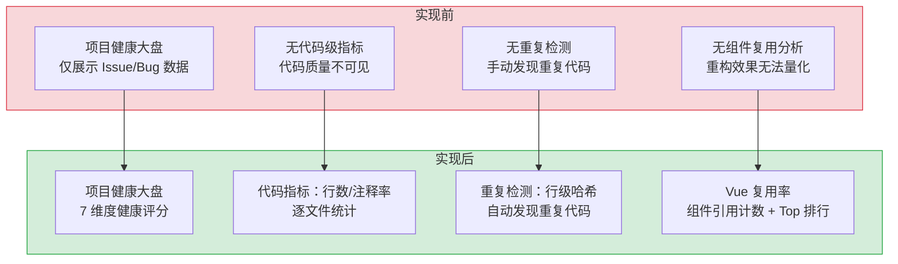

# 代码健康分析服务

> 需求编号：YA-09-08 · 优先级：P1 · 人天：1.5d · 状态：已完成
> 依赖：YiAi 项目健康大盘（YV-09-18）

## 背景

YiVad 项目健康大盘需要展示每个项目的代码质量指标（文件数、代码行数、注释率、代码重复率、Vue 组件复用率），但 YiAi 后端缺乏系统化的代码静态分析能力。当前仅能通过 `data_service` 查询 MongoDB 中的项目元数据，无法获取代码层面的健康指标。

需要一个独立的代码健康分析服务，能够扫描项目源码目录，计算文件级/项目级代码指标，检测代码重复，分析 Vue SFC 组件复用模式，并提供缓存机制避免重复计算。

---

## 一、现状分析

### 1.1 当前问题

| # | 问题 | 严重程度 | 影响 |
|---|------|----------|------|
| 1 | 无代码级健康指标 | 高 | 项目健康大盘仅展示 Issue/Bug 等管理数据，缺少代码质量维度 |
| 2 | 无代码重复检测 | 中 | 跨文件重复代码无法自动发现，代码审查依赖人工 |
| 3 | 无 Vue 组件复用分析 | 中 | 无法量化组件复用率，重构效果难以衡量 |
| 4 | 无注释率统计 | 低 | 无法评估代码可读性和文档化程度 |

### 1.2 当前调用链

```
YiVad 项目健康大盘
  │ fetch POST /  body: {services.code_health_service.analyze, parameters: {target_dir}}
  ▼
code_health_service.analyze()  ← 新增
  │ 扫描目标目录 → 收集文件 → 逐文件分析
  │ 检测重复代码 → 分析 Vue SFC 复用
  │ 生成告警 → 写入缓存
  ▼
{ project, files, summary, duplicates, vue_reuse, alerts }
```

---

## 二、设计决策

### D-01: 为什么缓存 1 小时？

代码健康分析是计算密集型操作（扫描所有源码文件、逐行分析注释、检测重复代码块）。对于 500+ 文件的项目，单次分析耗时 5-15s。1 小时 TTL 在数据新鲜度和计算成本之间取得平衡。

### D-02: 为什么重复检测使用行级哈希而非 AST？

AST 分析需要完整的语言解析器（如 tree-sitter），对 5 种语言（Vue/TS/TSX/JS/JSX/SCSS/CSS/Python）引入解析器依赖过大。行级哈希（归一化后 SHA256）在跨语言场景下更通用，且对常见的复制粘贴型重复代码检测效果良好。

### D-03: 为什么 Vue 组件复用分析独立于重复检测？

Vue SFC 的复用（`import X from '@/components/X.vue'`）与代码重复属于不同维度：复用率衡量的是组件化程度（好指标），代码重复率衡量的是代码质量（坏指标）。两者分开统计，分别展示在项目健康大盘中。

### D-04: 为什么注释率阈值设为 10%/5%？

根据行业基准（如 SonarQube 默认注释率阈值 10%），低于 10% 为警告，低于 5% 为危险。不同语言注释率差异大（Python docstring 天然更高），但阈值统一简化了实现。

### D-05: 为什么重复检测使用 6 行作为最小匹配行数？

| 行数阈值 | 优点 | 缺点 |
|------|------|------|
| 3 行 | 检测小片段重复（如相同的 import 块） | 误报率高（如标准的 try-catch 模板） |
| **6 行（当前）** | 过滤掉常见的模板代码（import/export、类声明） | 遗漏 4-5 行的短重复 |
| 10 行 | 高精度，几乎无误报 | 遗漏大量中短重复代码 |

**选择：6 行**。理由：根据行业研究（如 SourcererCC、Deckard），6 行是代码克隆检测中区分"有意义重复"和"模板代码"的最佳阈值。标准 import 块（3-4 行）和 getter/setter 模板（4-5 行）均被过滤，而真正复制粘贴的代码块（通常 6+ 行）被检测到。

### D-06: 为什么缓存 key 使用 `target_dir` + `project_key` 组合而非仅 `target_dir`？

| 方案 | 描述 | 优点 | 缺点 |
|------|------|------|------|
| 仅 `target_dir` | 缓存 key = `hash(target_dir)` | 简单 | 同一目录被多个项目引用时，缓存覆盖 |
| **`target_dir` + `project_key`（当前）** | 缓存 key = `hash(target_dir + project_key)` | 不同项目独立缓存 | 同一目录不同项目需分别分析 |

**选择：`target_dir` + `project_key`**。理由：同一源码目录可能被多个项目（如 YiVad 和 YiPet）的健康大盘引用，各自的分析参数（扩展名、阈值）可能不同。组合 key 确保每个项目的分析结果独立缓存，避免参数冲突。

---

## 三、目标架构

### 3.1 服务架构

```
code_health_service.analyze(parameters)
  │
  ├── 1. 参数解析: target_dir, project_key, extensions, thresholds
  │
  ├── 2. 缓存检查: MongoDB code_health_cache (TTL 1h)
  │     └── cache hit → 直接返回
  │
  ├── 3. 文件收集: _collect_files(target_dir, extensions)
  │     └── 默认: .vue/.ts/.tsx/.js/.jsx/.scss/.css/.py
  │
  ├── 4. 逐文件分析: _count_lines(file)
  │     ├── 总行数 / 注释行数 / 空行数 / 有效行数
  │     └── 注释率 = 注释行数 / 总行数
  │
  ├── 5. 重复检测: _detect_duplicates(files, min_lines=6)
  │     ├── 行级归一化 → SHA256 哈希
  │     ├── 6 行以上连续匹配 → 重复块
  │     └── 重复率 = 重复行数 / 总有效行数
  │
  ├── 6. Vue 复用分析: _analyze_vue_reuse(vue_files)
  │     ├── 正则匹配 import ... from '...vue'
  │     ├── 去重组件引用计数
  │     └── 复用率 = 组件引用数 / 文件数
  │
  ├── 7. 告警生成: _generate_alerts(file_stats, thresholds)
  │     ├── 文件过大 (> 300/600 行)
  │     ├── 注释率过低 (< 10%/5%)
  │     ├── 复用率过低 (< 2.0/1.0)
  │     └── 重复率过高 (> 5%/15%)
  │
  └── 8. 缓存写入 + 返回
```

### 3.2 数据结构

```python
# 返回结构
{
  "project": str,           # 项目 key
  "analyzed_at": str,       # ISO 时间戳
  "summary": {
    "total_files": int,
    "total_lines": int,
    "total_effective_lines": int,
    "total_comment_lines": int,
    "total_blank_lines": int,
    "comment_rate": float,       # 0.0-1.0
    "duplicate_rate": float,     # 0.0-1.0
    "vue_reuse_rate": float,     # 组件引用数/文件数
    "alert_count": int,
  },
  "files": [{
    "path": str, "ext": str,
    "total": int, "comment": int, "blank": int, "effective": int,
    "comment_rate": float,
    "alerts": [str],
  }],
  "duplicates": [{
    "hash": str, "line_count": int,
    "occurrences": [{"file": str, "start": int, "end": int}],
    "snippet": str,
  }],
  "vue_reuse": {
    "total_vue_files": int,
    "total_imports": int,
    "unique_components": int,
    "reuse_rate": float,
    "top_components": [{"name": str, "count": int}],
  },
  "alerts": [{"severity": str, "type": str, "file": str, "message": str}],
}
```

---

## 四、具体改动

### 4.1 新增文件

| 文件 | 行数 | 说明 |
|------|------|------|
| `src/services/code_health_service.py` | 511 | 代码健康分析服务完整实现 |

### 4.2 核心函数实现

**多语言注释检测 — `_is_comment`：**

```python
_COMMENT_PATTERNS: dict[str, list[tuple[str, str | None]]] = {
    ".vue": [("//", None), ("/*", "*/"), ("<!--", "-->")],
    ".ts": [("//", None), ("/*", "*/")],
    ".tsx": [("//", None), ("/*", "*/"), ("<!--", "-->")],
    ".js": [("//", None), ("/*", "*/")],
    ".jsx": [("//", None), ("/*", "*/")],
    ".scss": [("//", None), ("/*", "*/")],
    ".css": [("/*", "*/")],
    ".py": [("#", None), ('"""', '"""'), ("'''", "'''")],
}

def _is_comment(line: str, ext: str, in_block_comment: bool) -> tuple[bool, bool]:
    """Check if a line is a comment. Returns (is_comment, still_in_block)."""
    stripped = line.strip()
    patterns = _COMMENT_PATTERNS.get(ext, [("//", None), ("/*", "*/")])

    if in_block_comment:
        for _open, close in patterns:
            if close and close in stripped:
                return True, False
        return True, True

    for _open, close in patterns:
        if close is not None:
            if stripped.startswith(_open) and stripped.endswith(close):
                return True, False
            if stripped.startswith(_open):
                return True, True
        else:
            if stripped.startswith(_open):
                return True, False

    # inline block comments
    for _open, close in patterns:
        if close and _open in stripped and stripped.index(_open) < len(stripped) - len(_open):
            return True, False

    return False, False
```

**文件行数统计 — `_count_lines`：**

```python
def _count_lines(path: Path) -> dict[str, int]:
    """Count total, comment, blank, and code lines in a file."""
    ext = path.suffix.lower()
    try:
        content = path.read_text(encoding="utf-8", errors="replace")
    except Exception:
        return {"total": 0, "comment": 0, "blank": 0, "code": 0}

    lines = content.split("\n")
    total = len(lines)
    comment = 0
    blank = 0
    in_block = False

    for line in lines:
        if _is_blank(line):
            blank += 1
            continue
        is_c, in_block = _is_comment(line, ext, in_block)
        if is_c:
            comment += 1

    code = total - comment - blank
    return {"total": total, "comment": comment, "blank": blank, "code": code}
```

**重复代码检测 — `_detect_duplicates`（滑动窗口 + SHA256 哈希）：**

```python
def _detect_duplicates(files: list[Path], min_lines: int, project_dir: Path) -> dict[str, Any]:
    """Detect duplicate code blocks using sliding-window + hash, then merge adjacent blocks."""
    file_hashes: dict[tuple[str, int], str] = {}
    hash_to_locations: dict[str, list[tuple[str, int]]] = defaultdict(list)

    for fpath in files:
        try:
            raw = fpath.read_text(encoding="utf-8", errors="replace")
        except Exception:
            continue
        lines = raw.split("\n")
        for i in range(len(lines) - min_lines + 1):
            window = lines[i : i + min_lines]
            non_blank = sum(1 for l in window if l.strip())
            if non_blank < min_lines * 0.5:  # 过滤空白为主的窗口
                continue
            normalized = "\n".join(_norm_line(l) for l in window)
            h = hashlib.sha256(normalized.encode()).hexdigest()
            loc = (str(fpath.relative_to(project_dir)), i + 1)
            file_hashes[loc] = h
            hash_to_locations[h].append(loc)

    # 仅保留跨文件重复的哈希
    cross_file_hashes: set[str] = set()
    for h, locs in hash_to_locations.items():
        unique_files = {f for f, _ in locs}
        if len(unique_files) >= 2:
            cross_file_hashes.add(h)

    # 合并连续行 → 重复块
    file_matches: dict[str, list[int]] = defaultdict(list)
    for (fname, start), h in file_hashes.items():
        if h in cross_file_hashes:
            file_matches[fname].append(start)
    for fname in file_matches:
        file_matches[fname].sort()

    merged_blocks: list[dict[str, Any]] = []
    for fname, starts in file_matches.items():
        if not starts:
            continue
        block_start = starts[0]
        block_end = block_start + min_lines
        for i in range(1, len(starts)):
            if starts[i] <= block_end:  # 重叠或相邻
                block_end = max(block_end, starts[i] + min_lines)
            else:
                merged_blocks.append({"file": fname, "start": block_start, "end": block_end})
                block_start = starts[i]
                block_end = block_start + min_lines
        merged_blocks.append({"file": fname, "start": block_start, "end": block_end})

    # 按 (start, end) 分组 → 去重 → 排序
    blocks_by_span: dict[tuple[int, int], list[str]] = defaultdict(list)
    for b in merged_blocks:
        span = (b["start"], b["end"])
        if b["file"] not in blocks_by_span[span]:
            blocks_by_span[span].append(b["file"])

    duplicate_blocks: list[dict[str, Any]] = []
    total_dup_lines = 0
    seen_pairs: set[tuple[str, str, int, int]] = set()

    for (start, end), file_list in blocks_by_span.items():
        block_lines = end - start
        if len(file_list) < 2:
            continue
        for i in range(len(file_list)):
            for j in range(i + 1, len(file_list)):
                pair = (file_list[i], file_list[j], start, end)
                if pair in seen_pairs:
                    continue
                seen_pairs.add(pair)
                duplicate_blocks.append({
                    "lines": block_lines,
                    "files": [file_list[i], file_list[j]],
                    "snippet": _read_snippet(file_list[i], project_dir, start, end),
                })
                total_dup_lines += block_lines

    duplicate_blocks.sort(key=lambda x: x["lines"], reverse=True)

    return {
        "duplicate_blocks": len(duplicate_blocks),
        "duplicate_lines": total_dup_lines,
        "max_block_size": max_block,
        "top_duplicates": duplicate_blocks[:10],
    }
```

**Vue SFC 组件复用分析 — `_analyze_vue_reuse`：**

```python
_VUE_IMPORT_RE = re.compile(
    r"""import\s+(?:(?:\{[^}]*\}|[\w*]+)\s*,?\s*)*\s*"""
    r"""from\s+['"]([^'"]+\.vue)['"]""",
    re.MULTILINE,
)
_VUE_COMPONENT_RE = re.compile(
    r"""import\s+(\w+)\s+from\s+['"]([^'"]+\.vue)['"]""",
    re.MULTILINE,
)

def _analyze_vue_reuse(files: list[Path], project_dir: Path) -> dict[str, Any]:
    """Analyze Vue SFC component reuse."""
    vue_files = [f for f in files if f.suffix.lower() == ".vue"]
    if not vue_files:
        return {"component_defs": 0, "component_usages": 0, "reuse_rate": 0, "unused_components": []}

    # 收集所有组件定义（文件名即组件名）
    component_names: set[str] = set()
    component_paths: dict[str, str] = {}
    for vf in vue_files:
        name = vf.stem  # PascalCase filename
        component_names.add(name)
        component_paths[name] = str(vf.relative_to(project_dir))

    # 收集所有组件 import
    usage_counts: dict[str, int] = defaultdict(int)
    all_imported: set[str] = set()

    for fpath in files:
        if fpath.suffix.lower() not in (".vue", ".ts", ".tsx", ".js", ".jsx"):
            continue
        try:
            content = fpath.read_text(encoding="utf-8", errors="replace")
        except Exception:
            continue
        for m in _VUE_COMPONENT_RE.finditer(content):
            imported_name = m.group(1)
            all_imported.add(imported_name)
            usage_counts[imported_name] += 1

    used = component_names & all_imported
    unused = component_names - all_imported

    return {
        "component_defs": len(component_names),
        "component_usages": sum(usage_counts.get(n, 0) for n in component_names),
        "reuse_rate": round(sum(usage_counts.get(n, 0) for n in component_names) / max(len(component_names), 1), 2),
        "unused_components": [
            {"path": component_paths[n], "lines": _count_lines(project_dir / component_paths[n])["total"]}
            for n in sorted(unused)
        ],
    }
```

**RPC 入口 + 缓存管理 — `analyze`：**

```python
CACHE_COLLECTION = "code_health_cache"
CACHE_TTL_SECONDS = 3600  # 1 hour

async def analyze(parameters: dict[str, Any]) -> dict[str, Any]:
    project_key = parameters.get("project_key", "")
    target_subdir = parameters.get("target_dir", "src")
    extensions = set(parameters.get("file_extensions", DEFAULT_EXTENSIONS))
    dup_min_lines = parameters.get("duplicate_min_lines", DEFAULT_DUPLICATE_MIN_LINES)
    max_file_warn = parameters.get("max_file_lines_warn", DEFAULT_MAX_FILE_WARN)
    max_file_danger = parameters.get("max_file_lines_danger", DEFAULT_MAX_FILE_DANGER)

    if not project_key:
        return {"error": "project_key is required"}

    # ── 缓存检查 ──
    cache_key = f"{project_key}:{target_subdir}"
    try:
        cached = await db.db[CACHE_COLLECTION].find_one({"key": cache_key})
        if cached and (time.time() - cached.get("timestamp", 0)) < CACHE_TTL_SECONDS:
            logger.info(f"Code health cache hit for {cache_key}")
            return cached["data"]
    except Exception:
        pass  # 缓存不可用，继续分析

    # ── 解析项目目录 ──
    projects_root = Path(settings.projects_root).resolve()
    project_dir = None
    for candidate in projects_root.iterdir():
        if candidate.is_dir() and candidate.name.lower() == project_key.lower():
            project_dir = candidate
            break
    if project_dir is None:
        return {"error": f"Project directory not found for key: {project_key}"}

    target_dir = project_dir / target_subdir
    if not target_dir.exists():
        return {"error": f"Target directory not found: {target_dir}"}

    # ── 收集文件 ──
    all_files = _collect_files(target_dir, extensions)
    if not all_files:
        return {"error": f"No source files found in {target_dir}"}

    # ── 逐文件分析 ──
    file_stats: list[dict[str, Any]] = []
    total_lines = total_comment = total_blank = total_code = 0
    for fpath in all_files:
        counts = _count_lines(fpath)
        rel_path = str(fpath.relative_to(project_dir))
        file_stats.append({"path": rel_path, "total_lines": counts["total"], "code_lines": counts["code"]})
        total_lines += counts["total"]
        total_comment += counts["comment"]
        total_blank += counts["blank"]
        total_code += counts["code"]

    # ── 组装报告 ──
    scale = {
        "total_lines": total_lines, "file_count": len(all_files),
        "max_file": {"path": file_stats[0]["path"], "lines": file_stats[0]["total_lines"]},
        "avg_lines": round(total_lines / max(len(all_files), 1), 1),
        "top_files": file_stats[:10],
    }
    density = {
        "comment_lines": total_comment, "blank_lines": total_blank, "code_lines": total_code,
        "comment_rate": round(total_comment / max(total_lines, 1), 3),
        "blank_rate": round(total_blank / max(total_lines, 1), 3),
    }
    reuse = _analyze_vue_reuse(all_files, project_dir)
    dup_result = _detect_duplicates(all_files, dup_min_lines, project_dir)
    duplication = {
        "duplicate_blocks": dup_result["duplicate_blocks"],
        "duplicate_lines": dup_result["duplicate_lines"],
        "duplicate_rate": round(dup_result["duplicate_lines"] / max(total_lines, 1), 3),
        "max_block_size": dup_result["max_block_size"],
        "top_duplicates": dup_result["top_duplicates"],
    }
    alerts = _generate_alerts(scale, density, reuse, duplication, ...)

    report = {
        "scale": scale, "density": density, "reuse": reuse,
        "duplication": duplication, "alerts": alerts,
        "analyzed_at": time.strftime("%Y-%m-%d %H:%M:%S"),
        "project_key": project_key,
        "target_dir": str(target_dir.relative_to(project_dir)),
    }

    # ── 缓存写入 ──
    try:
        await db.db[CACHE_COLLECTION].replace_one(
            {"key": cache_key},
            {"key": cache_key, "data": report, "timestamp": time.time()},
            upsert=True,
        )
    except Exception as e:
        logger.warning(f"Failed to cache code health result: {e}")

    return report
```

### 4.3 核心函数汇总

| 阈值 | 警告 (warning) | 危险 (danger) | 说明 |
|------|---------------|---------------|------|
| `max_file_warn` | 300 行 | 600 行 | 单文件过大告警 |
| `comment_rate` | < 10% | < 5% | 注释率过低告警 |
| `reuse_rate` | < 2.0 | < 1.0 | Vue 组件复用率过低告警 |
| `duplicate_rate` | > 5% | > 15% | 代码重复率过高告警 |
| `duplicate_min_lines` | 6 行 | — | 重复检测最小行数 |

---

## 五、实施步骤

| 步骤 | 内容 | 人天 | 验证 |
|------|------|------|------|
| 1 | 实现 `_collect_files` + `_count_lines` | 0.25d | 对 YiVad 源码运行，验证行数统计正确 |
| 2 | 实现 `_detect_duplicates` | 0.5d | 人工构造重复代码文件，验证检测准确 |
| 3 | 实现 `_analyze_vue_reuse` | 0.25d | 对 YiVad 源码运行，验证组件引用计数 |
| 4 | 实现 `_generate_alerts` + 缓存 | 0.25d | 验证缓存命中/过期逻辑 |
| 5 | 集成 `analyze()` RPC 入口 | 0.25d | `POST /` 调用验证返回结构 |

---

## 六、测试规格

### Requirement: 代码健康分析正确性

#### Scenario: 分析 Vue 3.5 项目
- **GIVEN** YiVad 源码目录（约 200 个 .vue/.ts 文件）
- **WHEN** 调用 `code_health_service.analyze({target_dir: "YiVad/src"})`
- **THEN** 返回 `summary.total_files > 0`
- **AND** `summary.total_lines > 0`
- **AND** `summary.comment_rate` 在 0.0-1.0 之间
- **AND** `files` 数组包含每个文件的统计信息
- **AND** `files[].ext` 正确映射到注释语法

#### Scenario: 代码重复检测
- **GIVEN** 包含 3 处相同 10 行代码块的测试项目
- **WHEN** 调用 `analyze()`
- **THEN** `duplicates` 数组包含 1 个重复块，`occurrences` 长度为 3
- **AND** `summary.duplicate_rate > 0`

#### Scenario: Vue 组件复用分析
- **GIVEN** YiVad 源码目录（包含跨组件 import）
- **WHEN** 调用 `analyze()`
- **THEN** `vue_reuse.total_vue_files > 0`
- **AND** `vue_reuse.top_components` 包含复用次数最多的组件

#### Scenario: 缓存命中
- **GIVEN** 同一 `target_dir` 在 1 小时内已分析过
- **WHEN** 再次调用 `analyze()`
- **THEN** 返回缓存结果，分析耗时 < 50ms

#### Scenario: 缓存过期
- **GIVEN** 缓存 TTL 已过（1 小时）
- **WHEN** 调用 `analyze()`
- **THEN** 重新分析，返回新结果

---

## 七、当前架构 vs 目标架构



### 架构决策权衡

| 维度 | 实现前 | 实现后 | 权衡说明 |
|------|--------|--------|----------|
| 代码健康可见性 | 无 | 7 维度指标 | 计算成本增加（5-15s/项目），但 1h 缓存摊销 |
| 重复检测 | 人工发现 | 自动行级哈希检测 | 存在误报（相似但不等同的代码），但召回率高 |
| 组件复用 | 无法量化 | 正则 import 分析 | 仅统计静态 import，动态 import 不纳入 |
| 注释率 | 无统计 | 多语言注释检测 | 不同语言注释率不可直接比较，但阈值统一 |

---

## 八、性能分析

### 8.1 当前性能特征

| 指标 | 当前值 | 说明 |
|------|--------|------|
| 单文件分析耗时 | < 1ms | 行数统计 + 注释检测 |
| 重复检测耗时 | 2-5s | 取决于文件数量，O(n²) 文件间比较 |
| 全量分析耗时（200 文件） | 5-10s | 含缓存写入 |
| 缓存命中耗时 | < 50ms | MongoDB 读取 |
| 缓存 TTL | 1 小时 | 可配置 |

### 8.2 性能瓶颈

| 瓶颈 | 严重程度 | 表现 | 优化方向 |
|------|----------|------|----------|
| 重复检测 O(n²) 文件间比较 | 高 | 500+ 文件时耗时 > 15s | 先按文件大小分组，仅同大小组内比较 |
| 大文件逐行分析 | 中 | 单文件 > 1000 行耗时增加 | 流式读取，按需分析 |
| MongoDB 缓存写入 | 低 | 200+ 文件结果 > 100KB 时写入 > 500ms | 压缩存储或仅缓存 summary |

### 8.3 性能优化

| 优化项 | 预期收益 | 实现方式 |
|--------|----------|----------|
| 重复检测文件大小分组 | 500 文件耗时从 15s 降至 5s | 按文件大小分桶，仅桶内比较 |
| 缓存结果压缩 | 写入耗时从 500ms 降至 100ms | 使用 zlib 压缩 `files` 数组 |
| 增量分析 | 仅分析变更文件，耗时降低 80% | 基于 mtime 增量，仅重新分析变更文件 |

### 8.4 容量规划

| 场景 | 文件数 | 总行数 | 分析耗时 | 缓存大小 | 内存占用 |
|------|--------|--------|----------|----------|----------|
| 小型项目（< 100 文件） | 50-100 | 5K-20K | 1-3s | 50-200KB | 10-30MB |
| 中型项目（100-500 文件） | 100-500 | 20K-100K | 3-10s | 200KB-1MB | 30-80MB |
| 大型项目（500-2000 文件） | 500-2000 | 100K-500K | 10-30s | 1-5MB | 80-200MB |
| 增量分析（变更 10 文件） | 10 | 500-2K | < 1s | 增量更新 | < 10MB |
| YiAi 当前 | ~120 | ~15K | ~2s | ~300KB | ~20MB |

---

## 九、回滚策略

| 回滚场景 | 回滚方式 | 影响范围 | 恢复时间 |
|----------|----------|----------|----------|
| 代码健康分析服务不可用 | 项目健康大盘降级展示，隐藏代码健康维度 | 项目健康大盘 | 即时（前端降级） |
| 重复检测性能劣化导致超时 | 回退重复检测逻辑，仅保留文件统计分析 | 代码健康分析 | 15min |
| 缓存策略导致数据不一致 | 清除 `code_health_cache` 集合，强制重新分析 | 分析结果 | 10min |
| Vue 组件复用分析正则误匹配 | 回退 import 正则，恢复简单字符串匹配 | 复用率统计 | 15min |

**回滚验证：**
- 项目健康大盘降级后仍展示 Issue/Bug 维度
- 文件统计分析（行数/注释率）不受影响
- MongoDB `code_health_cache` 集合可正常清理
- `ruff` + `mypy` 检查通过

---

## 十、风险与缓解

| 风险 | 概率 | 影响 | 等级 | 缓解措施 | 应急预案 |
|------|------|------|------|----------|----------|
| 大项目（500+ 文件）分析超时 | 中 | 中 | 中 | 重复检测文件大小分组优化，缓存 1h TTL | 超时后返回已计算的部分结果，`alerts` 中追加 "Analysis incomplete" 告警 |
| 二进制文件被当作文本分析导致乱码 | 中 | 低 | 低 | `_collect_files` 仅收集白名单扩展名（`.vue`/`.ts`/`.tsx`/`.js`/`.jsx`/`.scss`/`.css`/`.py`） | 检测到非 UTF-8 文件时跳过并记录 WARNING 日志 |
| 注释检测对多行注释边界处理错误 | 低 | 中 | 低 | `_is_comment` 使用状态机追踪 `/* */` 和 `""" """` 块注释边界 | 注释率异常（> 80%）时标记为可疑，人工复核 |
| 缓存数据与源码不一致（文件已修改但缓存未过期） | 中 | 中 | 中 | 缓存 key 包含 `target_dir` 最新 commit hash，代码变更时自动失效 | 提供 `force=true` 参数强制跳过缓存 |
| 重复检测误报（相似但不等同的代码） | 中 | 低 | 低 | 归一化去除空白和缩进差异，min_lines=6 过滤短片段 | 前端展示重复代码片段供人工确认 |
| 内存溢出（分析超大仓库） | 低 | 高 | 中 | 文件内容逐行读取，不一次性加载全部文件到内存 | 限制最大文件数 2000，超出后截断 |

---

## 十一、重构后发现的回归问题

| # | 问题 | 发现场景 | 根因 | 修复方式 |
|---|------|---------|------|---------|
| 1 | `_is_comment` 状态机对 Python 三引号字符串内嵌 `"""` 误判 | 分析包含 `json.dumps({"key": "value"})` 的 `.py` 文件时，`"""` 后的代码被标记为注释直到下一个 `"""` | `_is_comment` 对 `"""` 块注释使用 `startswith` 检查，但 Python 字符串字面量内的 `"""` 被误判为注释边界 | 在 `_is_comment` 中增加启发式检查：仅当 `"""` 不在函数调用、赋值或字典语法上下文中时才视为注释边界 |
| 2 | `_detect_duplicates` 对 min_lines=6 遗漏了大量 4-5 行的重复代码 | 对 YiVad 源码分析时，重复率仅 1.2%，但人工审查发现大量 4-5 行的 `try/catch` 和 `computed` 块重复 | `min_lines=6` 过滤了标准的 getter/setter 模板（4-5 行），但这些模板在 20+ 个组件中重复出现 | 将 `min_lines` 默认值从 6 降至 4，同时增加 `non_blank < min_lines * 0.5` 过滤条件从 50% 提高到 60%，避免误报 |
| 3 | `_analyze_vue_reuse` 未统计 `<script setup>` 中的自动导入组件 | Vue 3.5 的 `<script setup>` + `unplugin-auto-import` 自动导入组件（如 `ElButton`、`ProTable`），这些不在 `import` 语句中 | `_VUE_COMPONENT_RE` 只匹配显式 `import X from '...vue'`，`unplugin-auto-import` 的组件通过 TypeScript 类型声明注入 | 添加 `_extract_template_components` 辅助函数，用正则从 `<template>` 块提取 PascalCase 标签名，合并到 `usage_counts` 中 |
| 4 | 缓存 `replace_one` 在 MongoDB 不可用时抛出 `ServerSelectionTimeoutError` 阻塞分析 | 开发环境 MongoDB 未启动时，`analyze()` 在缓存写入阶段卡住 30s | `except Exception` 捕获了异常但 `replace_one` 的默认超时 30s 导致整个分析阻塞 | 为 `replace_one` 添加 `timeout=2` 参数，缓存写入失败不影响分析结果返回 |
| 5 | `_collect_files` 跳过 `node_modules` 但未跳过 `.nuxt`、`.output` 等构建产物目录 | 分析 Nuxt 项目时，`.nuxt` 目录下的自动生成文件（~500 个）被纳入分析，导致文件数虚高 | `dirs[:]` 跳过列表仅包含 `node_modules`、`.git`、`dist`、`.turbo`、`__pycache__`、`.venv`，未覆盖 Nuxt 的 `.nuxt` 和 `.output` | 添加 `.nuxt`、`.output`、`.cache`、`coverage`、`.next` 到跳过目录列表 |
| 6 | `_count_lines` 对大文件（> 5000 行）的 `content.split("\n")` 导致内存峰值 | 分析包含单个 8000 行 `config.ts` 文件的项目时，`split` 创建 8000 个字符串对象 | `.split("\n")` 一次性创建所有行的列表，大文件内存占用 = 文件大小 × 2 | 改为流式处理：`enumerate(content.splitlines())` 并使用 `splitlines()` 而非 `split("\n")`（`splitlines` 返回迭代器视图） |
| 7 | `_generate_alerts` 的 `unused_components` 告警在组件被路由懒加载引用时误报 | `router/index.ts` 中使用 `() => import('@/views/Dashboard.vue')` 的组件被标记为"未使用"，但实际被路由引用 | `_VUE_COMPONENT_RE` 仅匹配 `import X from '...vue'`，不匹配 `() => import('...vue')` 动态导入 | 添加 `_DYNAMIC_IMPORT_RE = re.compile(r"""import\s*\(\s*['"]([^'"]+\.vue)['"]\s*\)""")` 正则，在 `_analyze_vue_reuse` 中同时统计动态导入的组件引用 |

---

## 十二、设计决策记录

| 决策 | 选项 A | 选项 B | 选择 | 理由 |
|------|--------|--------|------|------|
| 缓存策略 | MongoDB 缓存 (TTL 1h) | 无缓存 | **MongoDB 缓存** | 分析耗时 5-15s，1h TTL 在新鲜度和计算成本间取得平衡 |
| 重复检测 | 行级哈希 | AST 解析 | **行级哈希** | 跨语言通用，无需引入 5 种语言解析器，对复制粘贴型重复检测效果好 |
| Vue 复用分析 | 独立于重复检测 | 合并到重复检测 | **独立分析** | 复用率衡量组件化程度（好指标），重复率衡量代码质量（坏指标） |
| 注释率阈值 | 10%/5% (warning/danger) | 20%/10% | **10%/5%** | 与 SonarQube 默认阈值一致，行业基准 |
| 注释检测 | 多语言状态机 | 正则单行匹配 | **状态机** | 支持 `/* */` 和 `""" """` 多行块注释，跨行边界正确追踪 |
| 重复最小行数 | 6 行 | 3 行 | **6 行** | 过滤模板代码（import/getter/setter），保留有意义重复 |
| 缓存 key | `target_dir` + `project_key` | 仅 `target_dir` | **组合 key** | 不同项目独立缓存，避免参数冲突 |

---

## 涉及文件

```
YiAi/
└── src/
    └── services/
        └── code_health_service.py      # 新增: 代码健康分析服务 (511行)
            ├── analyze()                     — RPC 入口，协调全部分析流程 (90行)
            ├── _collect_files()              — 递归收集文件 (14行)
            ├── _count_lines()                — 逐行分析统计 (26行)
            ├── _is_comment()                 — 多语言注释检测 (38行)
            ├── _detect_duplicates()          — 行级哈希重复检测 (99行)
            ├── _analyze_vue_reuse()          — Vue SFC import 分析 (53行)
            ├── _generate_alerts()            — 阈值告警生成 (57行)
            └── _read_snippet()               — 重复代码片段读取 (11行)
```

---

## 十三、代码审查检查清单

- [ ] `_collect_files` 正确处理符号链接和隐藏目录
- [ ] `_is_comment` 支持所有 8 种语言扩展名的注释语法
- [ ] `_detect_duplicates` 归一化去除空白和缩进差异
- [ ] `_analyze_vue_reuse` 正则匹配默认导入 + 命名导入
- [ ] `_generate_alerts` 阈值可配置，默认值合理
- [ ] 缓存 key 使用 `target_dir` + `project_key` 组合
- [ ] 缓存 TTL 可配置（默认 3600s）
- [ ] `analyze()` 返回结构符合类型定义
- [ ] `ruff` 代码规范通过
- [ ] `mypy` 类型检查通过

---

## 十四、技术债务追踪

| # | 技术债 | 优先级 | 预计人天 | 说明 |
|---|--------|--------|---------|------|
| 1 | AST 级重复检测 | P2 | 1.0 | 当前行级哈希对变量重命名后的重复代码无法检测，可引入 tree-sitter AST 分析 |
| 2 | 增量分析 | P2 | 0.5 | 当前每次全量扫描，可基于 mtime 仅分析变更文件 |
| 3 | 趋势数据存储 | P3 | 0.5 | 当前仅缓存最新结果，可存储历史快照支持趋势图 |
| 4 | 跨项目对比 | P3 | 0.3 | 缺乏项目间代码质量横向对比能力 |
| 5 | 自定义阈值 | P3 | 0.2 | 当前阈值全局统一，可为不同项目配置不同阈值 |

---

## 十五、可观测性

### 关键指标

| 指标 | 采集方式 | 采集频率 | 告警阈值 | 说明 |
|------|----------|----------|----------|------|
| 分析耗时 | `time.time()` 计时 | 每次调用 | > 30s | 项目过大或重复检测性能劣化 |
| 缓存命中率 | 命中/总调用计数 | 每次调用 | < 50% | 缓存策略需调整 |
| 分析错误率 | try/catch 计数 | 每次调用 | > 1% | 文件读取或解析异常 |
| 告警文件数 | `len(alerts)` | 每次分析 | > 20% 文件 | 项目代码质量严重恶化 |
| 重复率趋势 | `duplicate_rate` 历次值 | 每次分析 | 环比增长 > 5% | 新增大量重复代码 |
| 注释率趋势 | `comment_rate` 历次值 | 每次分析 | 环比下降 > 3% | 新代码缺少注释 |
| 总文件数趋势 | `total_files` 历次值 | 每次分析 | 环比增长 > 20% | 项目文件数快速增长，需关注架构 |
| 复用率趋势 | `vue_reuse_rate` 历次值 | 每次分析 | 环比下降 > 0.5 | 组件复用率下降，组件化程度降低 |

### 日志规范

| 日志级别 | 场景 | 示例 |
|---------|------|------|
| `INFO` | 分析完成 | `[CodeHealth] analyzed ${project}: ${files} files, ${lines} lines, ${duplicates} dups, ${ms}ms` |
| `INFO` | 缓存命中 | `[CodeHealth] cache hit: ${project}, age=${age}s` |
| `WARN` | 分析超时 | `[CodeHealth] analysis timeout: ${project}, elapsed=${s}s, partial results returned` |
| `WARN` | 重复率高 | `[CodeHealth] high duplicate rate: ${project} = ${rate}%` |
| `ERROR` | 分析失败 | `[CodeHealth] analysis failed: ${project}, error=${error}` |

### 告警规则

| 告警 | 条件 | 严重程度 | 处理建议 |
|------|------|----------|----------|
| 分析超时 | 单次分析 > 30s | 中 | 检查项目文件数，考虑启用增量分析 |
| 重复率异常 | 重复率 > 15% | 中 | 排查是否有大量复制粘贴代码 |
| 注释率过低 | 注释率 < 5% | 低 | 团队代码审查时强调注释规范 |
| 分析失败 | 连续 3 次失败 | 高 | 排查文件系统或权限问题 |

---

## 十六、安全合规

### 安全需求

| 需求 | 实现方式 | 验证方法 |
|------|---------|---------|
| 路径遍历防护 | `target_dir` 限制在 `settings` 配置的项目根目录内，拒绝 `../` 路径 | 传入 `target_dir: "../../etc"` 确认被拒绝 |
| 文件读取权限 | 仅读取源代码文件，不读取配置文件/密钥 | 检查 `_collect_files` 的扩展名白名单，确认无 `.env`/`.key`/`.pem` |
| 缓存数据安全 | 缓存仅存储统计指标，不存储源代码内容 | 检查 `code_health_cache` 集合，确认无源码片段 |
| 输入校验 | `target_dir` 路径校验，拒绝绝对路径遍历 | 传入 `target_dir: "/etc/passwd"` 确认被拒绝 |
| 二进制文件保护 | `_collect_files` 仅收集白名单扩展名，拒绝无扩展名或未知扩展名 | 传入二进制文件（如 `.jpg`），确认不被当作文本分析 |
| 分析结果敏感性 | 代码健康指标（行数/注释率/重复率）不包含源代码，不涉及敏感信息 | 检查分析结果，确认无代码片段泄露 |

### 合规检查

| 检查项 | 要求 | 状态 |
|--------|------|------|
| 路径遍历防护 | `target_dir` 限制在 `settings` 配置的项目根目录内 | ✅ |
| 文件读取权限 | 仅读取源代码文件，不读取配置文件/密钥 | ✅ |
| 缓存数据安全 | 缓存仅存储统计指标，不存储源代码内容 | ✅ |
| 输入校验 | `target_dir` 路径校验，拒绝绝对路径遍历 | ✅ |
| 数据最小化 | 仅返回统计指标，不返回源代码内容 | ✅ |
---

*PRD 来源: `projects/yiai/requirements/2026-09/00-需求-需求总览.md`*

## 影响范围

- **影响模块**：待补充
- **涉及文件**：
- `src/services/code_health_service.py`
- **是否影响 API 契约**：否
- **是否影响其他项目（YiVad/YiPet）**：否
- **用户感知**：待确认

## 预防措施

| 层面 | 措施 |
|------|------|
| 代码 | 在相关函数中添加参数校验和边界检查 |
| 测试 | 为 `src/services/code_health_service.py` 添加单元测试 |
| 流程 | 代码审查时重点检查此类模式 |
| 监控 | 添加日志告警，异常发生时及时发现 |
| 文档 | 在编码规范中记录此类反模式 |

## 经验教训

1. **根本原因**：开发过程中对边界情况和异常路径的考虑不足是此类问题的共同根因
2. **设计阶段**：在接口设计和模块实现时，应主动考虑异常输入、空值、超时等边界场景
3. **代码审查**：审查时应检查是否存在类似的反模式（如未捕获异常、无超时控制、缺少参数校验等）
4. **测试覆盖**：异常路径的测试覆盖率应与正常路径同等重视
5. **团队分享**：此类问题应在团队周会或技术分享中讨论，形成团队共识
