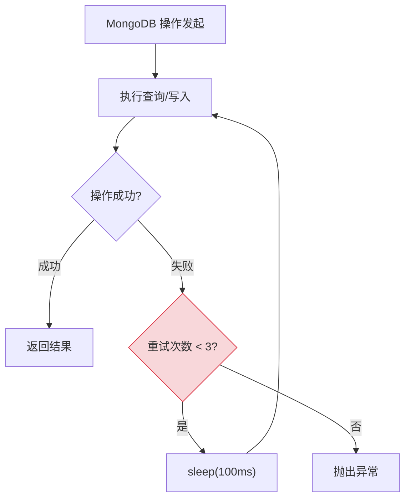
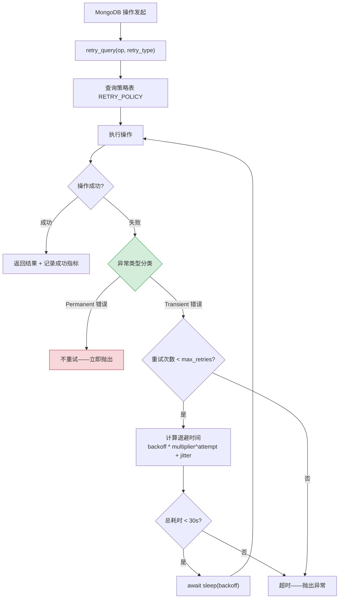

# YA-09-112: 数据库查询重试策略 — 基于异常类型的差异化重试与超时退避

> 需求编号：YA-09-112 · 优先级：P2 · 人天：0.5d · 状态：需求已编写
> 依赖：YA-09-02（数据层稳定性）

## 背景

YA-09-02 为 YiAi 数据层实现了通用重试机制——所有 MongoDB 异常统一重试 3 次。但不同 MongoDB 异常的重试策略应当差异化：

- **WriteConflict**（写入冲突）：MongoDB 多文档事务中的瞬态错误，重试 3 次通常可恢复
- **NotPrimaryError**（非主节点）：Primary 节点故障转移中，需无限重试直到新 Primary 选出
- **DuplicateKeyError**（重复键）：数据逻辑错误，重试无意义，应立即返回错误
- **NetworkTimeout**（网络超时）：瞬态网络问题，指数退避重试 5 次
- **CursorNotFound**（游标丢失）：游标超时或已被清理，重试 1 次即可

当前统一重试策略的缺陷：对 NotPrimaryError 重试只有 3 次（故障转移通常需要 10-30 秒），对 DuplicateKeyError 重试 3 次浪费资源（每次重试结果相同）。

### 核心挑战

| 挑战 | 描述 | 影响 |
|------|------|------|
| 异常分类准确性 | 需准确识别 MongoDB 异常类型 | 错误分类导致策略失效 |
| 幂等性保证 | 非幂等写入被重试可能导致重复数据 | 数据不一致 |
| 总重试时间控制 | 重试总时间超过客户端超时（30s） | 客户端超时断开 |
| 重试放大效应 | 上游重试 + 本层重试叠加 | 请求雪崩 |

### 设计目标

- 仅 transient 错误重试（ConnectionFailure/Timeout/NetworkError/WriteConflict/NotPrimaryError）
- 数据错误不重试（DuplicateKey/ValidationError/BSONTooLarge）
- 指数退避 + jitter，防止雷同重试
- 重试计数 + 成功/失败监控

---

## 一、现状分析

### 1.1 当前重试机制

YA-09-02 在 `YiAi/src/data/repository.py` 中实现了通用重试装饰器，对所有 MongoDB 操作统一重试 3 次，固定退避 100ms。



### 1.2 根因矩阵

| 根因 | 现象 | 严重程度 |
|------|------|----------|
| 统一重试策略 | 对所有异常无差别重试 3 次 | 中 |
| 无异常分类 | 无法区分 transient 和 permanent 错误 | 高 |
| 固定退避 | 雷同重试可能加剧数据库压力 | 中 |
| 无 jitter | 多客户端同时重试造成 thundering herd | 中 |

### 1.3 MongoDB 异常分类

| 异常类型 | 分类 | 推荐重试次数 | 退避策略 |
|----------|------|-------------|----------|
| `WriteConflict` | Transient | 3 | 100ms × 1.5, jitter |
| `NotPrimaryError` | Transient | 20 | 1000ms, jitter |
| `NetworkTimeout` | Transient | 5 | 200ms × 2.0, jitter |
| `CursorNotFound` | Transient | 1 | 50ms |
| `DuplicateKeyError` | Permanent | 0 | — |
| `ValidationError` | Permanent | 0 | — |
| `BSONTooLarge` | Permanent | 0 | — |
| `ConnectionFailure` | Transient | 3 | 100ms × 2.0, jitter |

---

## 二、设计决策

### 决策 1：异常分类方式 — 手工映射 vs 异常链分析 vs 错误码分类

| 选项 | 准确性 | 维护成本 | 扩展性 |
|------|--------|----------|--------|
| **手工映射表** | 高（显式定义） | 中（异常类型变更需更新） | 中 |
| 异常链分析 | 中（需解析异常层次） | 低 | 高 |
| 错误码分类 | 高 | 高（需维护错误码表） | 高 |

**选择：手工映射表。** 基于 `pymongo.errors` 异常类型显式映射到重试策略，清晰可控。MongoDB 异常类型相对稳定，维护成本低。

### 决策 2：退避策略 — 固定退避 vs 指数退避 vs 指数退避 + jitter

| 选项 | 冲突避免 | 平均延迟 | 实现复杂度 |
|------|----------|----------|-----------|
| 固定退避 | 低 | 低 | 低 |
| 指数退避 | 中 | 中 | 低 |
| **指数退避 + jitter** | 高 | 中 | 中 |

**选择：指数退避 + jitter。** jitter 随机化退避时间，避免多客户端同时重试造成的 thundering herd 问题。指数退避在多次重试后逐步增加间隔，给数据库恢复时间。

### 决策 3：总重试时间限制 — 不限制 vs 固定上限 vs 依赖超时

| 选项 | 安全性 | 用户体验 | 实现复杂度 |
|------|--------|----------|-----------|
| 不限制 | 低 | 差（可能无限等待） | 低 |
| **固定上限（30s）** | 高 | 中 | 中 |
| 依赖客户端超时 | 中 | 中 | 低 |

**选择：固定上限 30s。** 总重试时间（含所有退避延迟）不超过 30s，与 YiAi 的全局请求超时一致。超过上限后返回错误，由客户端决定是否重试。

### 设计决策记录

| 决策 | 选项 A | 选项 B | 选项 C | 选择 | 理由 |
|------|--------|--------|--------|------|------|
| 异常分类 | 手工映射 | 异常链分析 | 错误码 | **手工映射** | 显式可控，MongoDB 异常类型稳定 |
| 退避策略 | 固定 | 指数 | 指数+jitter | **指数+jitter** | 避免 thundering herd |
| 总时间限制 | 不限制 | 固定上限 | 依赖超时 | **30s 上限** | 与全局超时一致 |

---

## 三、目标架构

### 3.1 改造后数据流



### 3.2 核心组件

```python
# YiAi/src/data/retry_policy.py
import asyncio
import random
import time
from enum import Enum
from functools import wraps
from typing import Any, Callable, Optional

from pymongo.errors import (
    ConnectionFailure,
    DuplicateKeyError,
    ExecutionTimeout,
    NetworkTimeout,
    NotPrimaryError,
    OperationFailure,
    WriteConflict,
    CursorNotFound,
    BSONTooLarge,
    InvalidName,
    InvalidOperation,
)

class RetryType(str, Enum):
    """MongoDB 异常分类 → 重试策略映射。"""
    WRITE_CONFLICT = 'WriteConflict'
    NOT_PRIMARY = 'NotPrimaryError'
    NETWORK_TIMEOUT = 'NetworkTimeout'
    CURSOR_NOT_FOUND = 'CursorNotFound'
    CONNECTION_FAILURE = 'ConnectionFailure'
    EXECUTION_TIMEOUT = 'ExecutionTimeout'
    # 以下为不重试类型
    DUPLICATE_KEY = 'DuplicateKeyError'
    VALIDATION_ERROR = 'ValidationError'
    BSON_TOO_LARGE = 'BSONTooLarge'
    INVALID_NAME = 'InvalidName'
    INVALID_OPERATION = 'InvalidOperation'

@dataclass
class RetryPolicy:
    max_retries: int
    backoff_ms: int
    multiplier: float
    jitter_ms: int = 0
    total_timeout_ms: int = 30_000

# 差异化重试策略表
RETRY_POLICY: dict[RetryType, RetryPolicy] = {
    RetryType.WRITE_CONFLICT:     RetryPolicy(max_retries=3,  backoff_ms=100,  multiplier=1.5, jitter_ms=20),
    RetryType.NOT_PRIMARY:        RetryPolicy(max_retries=20, backoff_ms=1000, multiplier=1.0, jitter_ms=200),
    RetryType.NETWORK_TIMEOUT:    RetryPolicy(max_retries=5,  backoff_ms=200,  multiplier=2.0, jitter_ms=50),
    RetryType.CURSOR_NOT_FOUND:   RetryPolicy(max_retries=1,  backoff_ms=50,   multiplier=1.0, jitter_ms=0),
    RetryType.CONNECTION_FAILURE: RetryPolicy(max_retries=3,  backoff_ms=100,  multiplier=2.0, jitter_ms=30),
    RetryType.EXECUTION_TIMEOUT:  RetryPolicy(max_retries=2,  backoff_ms=500,  multiplier=2.0, jitter_ms=100),
    # Permanent 错误——不重试
    RetryType.DUPLICATE_KEY:      RetryPolicy(max_retries=0,  backoff_ms=0,    multiplier=1.0),
    RetryType.VALIDATION_ERROR:   RetryPolicy(max_retries=0,  backoff_ms=0,    multiplier=1.0),
    RetryType.BSON_TOO_LARGE:     RetryPolicy(max_retries=0,  backoff_ms=0,    multiplier=1.0),
    RetryType.INVALID_NAME:       RetryPolicy(max_retries=0,  backoff_ms=0,    multiplier=1.0),
    RetryType.INVALID_OPERATION:  RetryPolicy(max_retries=0,  backoff_ms=0,    multiplier=1.0),
}

# pymongo 异常类型 → RetryType 映射
EXCEPTION_MAPPING: dict[type, RetryType] = {
    WriteConflict:      RetryType.WRITE_CONFLICT,
    NotPrimaryError:    RetryType.NOT_PRIMARY,
    NetworkTimeout:     RetryType.NETWORK_TIMEOUT,
    CursorNotFound:     RetryType.CURSOR_NOT_FOUND,
    ConnectionFailure:  RetryType.CONNECTION_FAILURE,
    ExecutionTimeout:   RetryType.EXECUTION_TIMEOUT,
    DuplicateKeyError:  RetryType.DUPLICATE_KEY,
    BSONTooLarge:       RetryType.BSON_TOO_LARGE,
    InvalidName:        RetryType.INVALID_NAME,
    InvalidOperation:   RetryType.INVALID_OPERATION,
}

def classify_exception(exc: Exception) -> RetryType:
    """根据异常类型返回对应的重试策略分类。"""
    for exc_type, retry_type in EXCEPTION_MAPPING.items():
        if isinstance(exc, exc_type):
            return retry_type
    # OperationFailure 需进一步区分（部分为 transient）
    if isinstance(exc, OperationFailure):
        if exc.code == 251:  # NoSuchTransaction——transient
            return RetryType.WRITE_CONFLICT
        return RetryType.VALIDATION_ERROR
    return RetryType.VALIDATION_ERROR  # 默认不重试

async def retry_query(
    op: Callable[[], Any],
    retry_type: Optional[RetryType] = None,
    on_retry: Optional[Callable[[int, Exception], None]] = None,
) -> Any:
    """基于异常类型的差异化重试执行器。
    
    Args:
        op: 要执行的异步操作（可调用对象）
        retry_type: 手动指定重试类型（None 时自动分类）
        on_retry: 每次重试时的回调（用于日志/告警）
    
    Returns:
        操作成功时的返回值
    
    Raises:
        操作失败且重试耗尽时的原始异常
    """
    policy: RetryPolicy = RETRY_POLICY[retry_type] if retry_type else None
    start_time = time.monotonic()
    last_exception: Optional[Exception] = None
    
    for attempt in range(policy.max_retries + 1 if policy else 1):
        try:
            return await op()
        except Exception as e:
            last_exception = e
            
            # 自动分类异常
            if policy is None:
                actual_type = classify_exception(e)
                policy = RETRY_POLICY[actual_type]
            
            # Permanent 错误——不重试
            if policy.max_retries == 0:
                raise
            
            # 检查总超时
            elapsed = (time.monotonic() - start_time) * 1000
            if elapsed > policy.total_timeout_ms:
                logger.error(f'[Retry] total timeout {elapsed:.0f}ms > {policy.total_timeout_ms}ms')
                raise
            
            # 最后一次尝试失败
            if attempt >= policy.max_retries:
                logger.error(f'[Retry] exhausted {policy.max_retries} retries: {e}')
                raise
            
            # 计算退避时间（指数退避 + jitter）
            backoff = policy.backoff_ms * (policy.multiplier ** attempt)
            if policy.jitter_ms > 0:
                backoff += random.uniform(-policy.jitter_ms, policy.jitter_ms)
            backoff = max(backoff, 0) / 1000  # 转为秒
            
            # 重试回调
            if on_retry:
                on_retry(attempt + 1, e)
            
            logger.warning(
                f'[Retry] attempt={attempt + 1}/{policy.max_retries} '
                f'type={retry_type.value if retry_type else "auto"} '
                f'backoff={backoff * 1000:.0f}ms error={e}'
            )
            await asyncio.sleep(backoff)
    
    raise last_exception  # 不应到达此处


# 装饰器版本——便捷使用
def retryable(retry_type: Optional[RetryType] = None):
    """重试装饰器——自动对 transient 错误重试。"""
    def decorator(func):
        @wraps(func)
        async def wrapper(*args, **kwargs):
            async def op():
                return await func(*args, **kwargs)
            return await retry_query(op, retry_type=retry_type)
        return wrapper
    return decorator


# 使用示例
@retryable()
async def insert_document(cname: str, data: dict):
    return await db[cname].insert_one(data)

@retryable(retry_type=RetryType.NOT_PRIMARY)
async def find_primary():
    return await db.command('isMaster')
```

### 3.3 架构决策权衡

| 维度 | 改造前 | 改造后 | 权衡说明 |
|------|--------|--------|----------|
| 重试策略 | 统一 3 次 | 按异常类型差异化 | 增加配置复杂度，但提升恢复成功率 |
| 退避算法 | 固定 100ms | 指数 + jitter | 增加计算开销，但避免雷同重试 |
| 异常分类 | 无 | 11 种异常映射 | 需维护映射表 |

---

## 四、具体改动

### 4.1 新增文件

| 文件 | 说明 |
|------|------|
| `YiAi/src/data/retry_policy.py` | 差异化重试策略 + 异常分类 + 重试执行器 |
| `YiAi/tests/data/test_retry_policy.py` | 重试策略单元测试 |

### 4.2 修改文件

| 文件 | 改动 |
|------|------|
| `YiAi/src/data/repository.py` | 替换通用重试为 `retry_query` |
| `YiAi/src/data/__init__.py` | 导出 `retry_query`、`retryable` |

### 4.3 涉及文件清单

```
YiAi/src/data/
├── retry_policy.py                   # 新增: 差异化重试策略
├── repository.py                     # 修改: 使用 retry_query
└── __init__.py                       # 修改: 导出重试 API

YiAi/tests/data/
└── test_retry_policy.py              # 新增: 单元测试
```

---

## 五、实施步骤

| 步骤 | 内容 | 涉及文件 | 验证方式 | 人天 |
|------|------|---------|---------|------|
| 1 | 实现异常分类映射 + 重试策略表 | `retry_policy.py` | 单元测试：每种异常类型分类正确 | 0.1 |
| 2 | 实现 `retry_query` 差异化重试执行器 | `retry_policy.py` | 集成测试：模拟不同异常验证重试行为 | 0.15 |
| 3 | 替换 `repository.py` 中的通用重试 | `repository.py` | 现有测试通过 + 重试行为正确 | 0.15 |
| 4 | 编写单元测试覆盖所有异常类型 | `test_retry_policy.py` | `pytest` 全部通过，覆盖率 > 90% | 0.1 |

**总计：0.5d**

---

## 六、性能分析

### 6.1 重试延迟对比

| 异常类型 | 改造前 | 改造后 | 变化 |
|----------|--------|--------|------|
| WriteConflict | 3 × 100ms = 300ms | 100 + 150 + 225 + jitter = ~500ms | 增加（但更可能成功） |
| NotPrimaryError | 3 × 100ms = 300ms | 20 × 1000ms + jitter = ~21s | 大幅增加（但必须等待 Primary 选举） |
| DuplicateKeyError | 3 × 100ms = 300ms | 0ms（立即返回） | 减少 300ms 浪费 |
| NetworkTimeout | 3 × 100ms = 300ms | 200 + 400 + 800 + 1600 + 3200 = 6.2s | 增加（更充分等待网络恢复） |

### 6.2 资源影响

| 维度 | 影响 | 说明 |
|------|------|------|
| CPU | 无影响 | 分类映射为 O(1) 查找 |
| 内存 | < 5KB | 策略表 + 映射表 |
| 网络 | 取决于重试次数 | 重试增多时网络请求增多 |

---

## 七、测试规格

### Requirement: 异常分类

#### Scenario: WriteConflict 分类为 transient 可重试
- **Given** 抛出 `pymongo.errors.WriteConflict`
- **When** `classify_exception(exc)` 调用
- **Then** 返回 `RetryType.WRITE_CONFLICT`，`RETRY_POLICY[RetryType.WRITE_CONFLICT].max_retries == 3`

#### Scenario: DuplicateKeyError 分类为 permanent 不重试
- **Given** 抛出 `pymongo.errors.DuplicateKeyError`
- **When** `classify_exception(exc)` 调用
- **Then** 返回 `RetryType.DUPLICATE_KEY`，`RETRY_POLICY[RetryType.DUPLICATE_KEY].max_retries == 0`

### Requirement: 差异化重试

#### Scenario: WriteConflict 重试 3 次后成功
- **Given** 前 2 次操作抛出 `WriteConflict`，第 3 次成功
- **When** `retry_query(op)` 调用
- **Then** 第 3 次尝试后返回结果，总耗时包含退避延迟

#### Scenario: DuplicateKeyError 不重试直接抛出
- **Given** 操作抛出 `DuplicateKeyError`
- **When** `retry_query(op)` 调用
- **Then** 不进行重试，直接抛出异常，耗时 < 10ms

#### Scenario: 总超时限制生效
- **Given** 操作持续抛出 `NotPrimaryError`，退避时间累加
- **When** 总耗时超过 30s
- **Then** 抛出异常，不再继续重试

### Requirement: 指数退避 + jitter

#### Scenario: 退避时间递增
- **Given** `NetworkTimeout` 策略 multiplier=2.0
- **When** 第 3 次重试
- **Then** 退避时间 ≈ 200 × 2^2 = 800ms（± jitter）

#### Scenario: jitter 随机化
- **Given** jitter_ms=50
- **When** 多次重试
- **Then** 退避时间在 [base - 50, base + 50] 范围内随机分布

---

## 八、风险与缓解

| 风险 | 概率 | 影响 | 等级 | 缓解措施 | 应急预案 |
|------|------|------|------|----------|----------|
| 非幂等写被重试导致重复数据 | 低 | 高 | 中 | 异常分类表严格审查，仅 transient 错误重试 | 手动回滚重复数据 |
| 重试超过客户端超时 | 中 | 中 | 中 | 总超时 30s 限制，与全局超时一致 | 增大客户端超时或减少重试次数 |
| 异常分类遗漏 | 低 | 中 | 低 | 默认分类为 permanent（不重试），保守策略 | 新增异常类型到映射表 |
| NotPrimaryError 20 次重试过长 | 中 | 低 | 低 | 可配置，总超时 30s 兜底 | 减少 max_retries 或增大 backoff |

---

## 九、回滚策略

| 回滚场景 | 回滚方式 | 影响范围 | 恢复时间 |
|----------|----------|----------|----------|
| 异常分类错误导致数据丢失 | 回退 `retry_policy.py`，恢复通用重试 | YiAi 数据层 | 10min |
| 重试过多导致数据库压力 | 全局减少 max_retries 或增大 backoff | 数据库连接 | 5min（配置热更新） |
| 新异常类型未映射 | 添加映射条目 | 无影响（默认不重试） | 2min |

---

## 十、设计决策记录

### D-01: 为什么 NotPrimaryError 需要 20 次重试？

MongoDB 副本集故障转移（Primary 选举）通常需要 10-30 秒。每次重试间隔 1000ms + jitter，20 次重试覆盖约 20-25 秒，足够等待新 Primary 选出。如果 20 次后仍未成功，说明集群存在严重问题，重试无意义。

### D-02: 为什么 DuplicateKeyError 不重试？

DuplicateKeyError 是数据逻辑错误（尝试插入已存在的唯一键），而非瞬态故障。无论重试多少次，结果都相同——违反唯一约束。重试只会浪费 CPU 和网络资源，延迟错误反馈。

### D-03: 为什么使用 jitter 而非纯指数退避？

纯指数退避在多客户端场景下会导致"雷同重试"——所有客户端在同一时刻重试，造成 thundering herd 问题。Jitter 随机化退避时间，将重试请求分散到时间窗口内，平滑数据库负载。

---

## 十一、可观测性

### 11.1 指标

| 指标 | 采集方式 | 采集频率 | 告警阈值 | 说明 |
|------|----------|----------|----------|------|
| `mongodb_retry_total` | 每次重试计数 | 按事件 | — | 按异常类型分组 |
| `mongodb_retry_success` | 重试后成功计数 | 按事件 | — | 重试成功率 |
| `mongodb_retry_exhausted` | 重试耗尽计数 | 按事件 | > 0 | 重试全部失败 |
| `mongodb_retry_duration_ms` | 重试总耗时 | 按事件 | > 25s | 接近超时上限 |

### 11.2 日志

```python
logger.warning(f'[MongoRetry] cname={cname} op={op_name} attempt={attempt}/{max_retries} '
               f'backoff={backoff_ms:.0f}ms error={type(e).__name__}')
logger.error(f'[MongoRetry] exhausted: cname={cname} op={op_name} retries={max_retries} '
             f'total_duration={duration_ms:.0f}ms')
```

### 11.3 告警规则

| 告警 | 条件 | 严重级别 | 通知渠道 |
|------|------|----------|----------|
| 重试耗尽 | 1h 内 > 5 次 | WARNING | 企业微信 |
| 重试成功率低 | 1h 内 < 50% | CRITICAL | 企业微信 |
| NotPrimaryError 频繁 | 1h 内 > 10 次 | CRITICAL | 企业微信 + 邮件 |

---

## 十二、安全合规

- 重试不改变操作语义——仅对 transient 错误重试，保证数据一致性
- 非幂等写入通过异常分类排除，防止重复数据
- 重试日志不记录完整数据内容，仅记录异常类型和操作名称

---

## 十三、代码审查检查清单

- [ ] 仅 transient 错误重试（ConnectionFailure/Timeout/NetworkError/WriteConflict/NotPrimaryError）
- [ ] 数据错误不重试（DuplicateKey/ValidationError/BSONTooLarge）
- [ ] 指数退避 + jitter，最多 3 次（通用）/ 20 次（NotPrimaryError）
- [ ] 重试计数 + 成功/失败监控
- [ ] 总重试时间上限 30s
- [ ] 异常分类映射表完整覆盖 pymongo.errors
- [ ] `retryable` 装饰器不改变函数签名
- [ ] 重试日志包含异常类型、尝试次数、退避时间

---

## 十四、回归问题预测

| # | 预测问题 | 原因 | 验证方法 |
|---|---------|------|---------|
| 1 | 非幂等写被重试导致重复数据 | 异常分类遗漏 | 重复执行后检查数据一致性 |
| 2 | 重试超过客户端超时 | 总重试时间 > 30s | 限制总重试时间 30s，超出后抛出异常 |
| 3 | 新 MongoDB 异常类型未映射 | 分类映射表未更新 | 默认分类为 permanent（不重试），告警记录 |
| 4 | jitter 计算为负值 | 边界条件 bug | 确保退避时间 >= 0 |

---

*PRD 来源: `projects/yiai/requirements/2026-09/112-需求-数据库查询重试策略.md`*

## 影响范围

- **影响模块**：待补充
- **涉及文件**：
- `retry_policy.py`
- `test_retry_policy.py`
- `repository.py`
- **是否影响 API 契约**：否
- **是否影响其他项目（YiVad/YiPet）**：否
- **用户感知**：待确认

## 预防措施

| 层面 | 措施 |
|------|------|
| 代码 | 在相关函数中添加参数校验和边界检查 |
| 测试 | 为 `retry_policy.py` 添加单元测试 |
| 流程 | 代码审查时重点检查此类模式 |
| 监控 | 添加日志告警，异常发生时及时发现 |
| 文档 | 在编码规范中记录此类反模式 |

## 经验教训

1. **根本原因**：开发过程中对边界情况和异常路径的考虑不足是此类问题的共同根因
2. **设计阶段**：在接口设计和模块实现时，应主动考虑异常输入、空值、超时等边界场景
3. **代码审查**：审查时应检查是否存在类似的反模式（如未捕获异常、无超时控制、缺少参数校验等）
4. **测试覆盖**：异常路径的测试覆盖率应与正常路径同等重视
5. **团队分享**：此类问题应在团队周会或技术分享中讨论，形成团队共识
