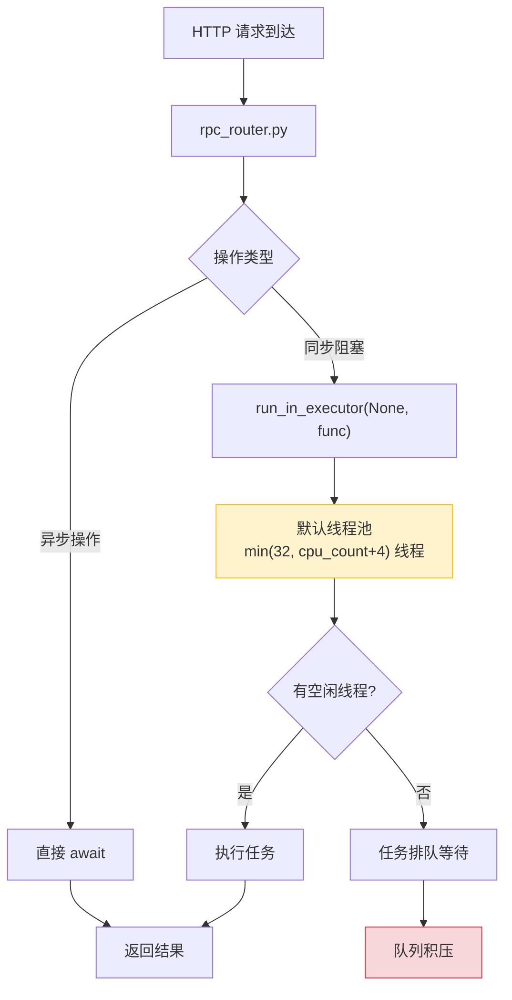
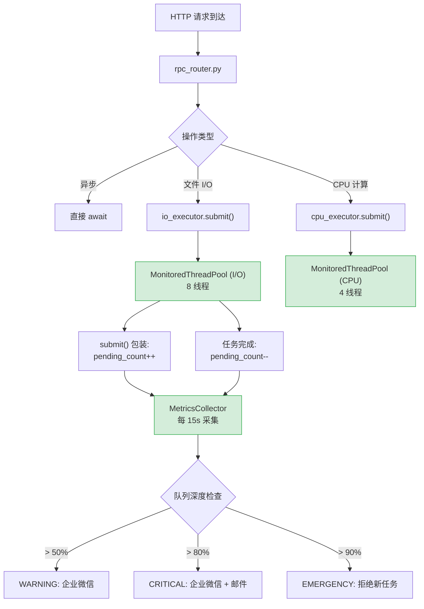

# YA-09-113: 线程池监控 — asyncio 线程池使用率/队列深度实时预警

> 需求编号：YA-09-113 · 优先级：P2 · 人天：0.5d · 状态：需求已编写

## 背景

YiAi 使用 `asyncio` 作为异步运行时，但存在大量同步阻塞操作通过 `run_in_executor` 提交到默认线程池执行：

- **文件 I/O**：`/read-file`、`/write-file` 端点的文件读写操作
- **CPU 密集计算**：RAG 检索中的 Embedding 计算、向量相似度搜索
- **PIL 图像处理**：知识库附件预览生成
- **同步库调用**：部分第三方库的同步 API

当线程池中所有线程都在执行任务时，后续提交的任务将在线程池队列中排队等待。如果队列积压严重，所有 I/O 操作（包括健康检查、日志写入）都会被阻塞，导致服务整体不可用。

### 核心挑战

| 挑战 | 描述 | 影响 |
|------|------|------|
| 默认线程池不可见 | Python 默认 `ThreadPoolExecutor` 无内置监控 | 队列积压无感知 |
| 线程池饥饿 | 同步任务占满所有线程，新任务无限排队 | 服务整体阻塞 |
| 后台任务干扰 | 知识库扫描等后台任务与请求线程竞争 | 请求延迟尖刺 |
| 缺乏告警机制 | 线程池使用率 100% 时无通知 | 运维被动发现 |

### 设计目标

- 实时监控线程池使用率、队列深度、任务积压量
- 队列深度超过阈值时告警（企业微信推送）
- 支持自定义线程池替换默认池，实现任务隔离
- 监控数据通过 Prometheus 指标暴露

---

## 一、现状分析

### 1.1 当前线程池使用方式

YiAi 当前使用 Python 默认的 `asyncio` 线程池（`concurrent.futures.ThreadPoolExecutor`），默认线程数为 `min(32, os.cpu_count() + 4)`。所有 `run_in_executor` 调用共享此线程池。



### 1.2 根因矩阵

| 根因 | 现象 | 严重程度 |
|------|------|----------|
| 线程池无监控 | 队列积压无法感知 | 高 |
| 共享线程池 | 文件 I/O 和 LLM 推理竞争线程 | 中 |
| 无任务隔离 | 慢任务阻塞快任务 | 中 |
| 无告警机制 | 问题发现依赖用户投诉 | 高 |

---

## 二、设计决策

### 决策 1：监控方式 — 包装 Executor vs 定期采样 vs Hook 注入

| 选项 | 准确性 | 侵入性 | 维护成本 |
|------|--------|--------|----------|
| **包装 Executor（自定义子类）** | 高 | 中 | 中 |
| 定期采样（读 `_work_queue`） | 低 | 低 | 低 |
| Hook 注入（monkey-patch） | 中 | 高 | 高 |

**选择：包装 Executor（自定义子类）。** 继承 `ThreadPoolExecutor` 并包装 `submit()` 方法，在任务提交和完成时更新计数。此方案准确且不依赖内部实现细节（`_work_queue` 是私有属性，版本间可能变化）。

### 决策 2：线程池隔离 — 单池 vs 双池 vs 多池

| 选项 | 隔离性 | 资源利用率 | 实现复杂度 |
|------|--------|-----------|-----------|
| 单池（默认） | 低 | 高 | 低 |
| 双池（I/O 池 + CPU 池） | 中 | 中 | 中 |
| **多池（按优先级）** | 高 | 中 | 高 |

**选择：双池隔离。** 创建两个独立线程池：`io_executor`（文件 I/O，8 线程）和 `cpu_executor`（Embedding 计算，4 线程）。避免 CPU 密集任务阻塞 I/O 任务。

### 决策 3：告警阈值 — 固定阈值 vs 动态阈值 vs 多级告警

| 选项 | 灵敏度 | 误报率 | 实现复杂度 |
|------|--------|--------|-----------|
| 固定阈值 | 中 | 中 | 低 |
| 动态阈值 | 高 | 低 | 高 |
| **多级告警（警告/严重/紧急）** | 高 | 低 | 中 |

**选择：多级告警。** 队列深度达到 50% 为 WARNING，80% 为 CRITICAL，90% 为 EMERGENCY。分级告警提供渐进式响应，运维可提前干预。

### 设计决策记录

| 决策 | 选项 A | 选项 B | 选项 C | 选择 | 理由 |
|------|--------|--------|--------|------|------|
| 监控方式 | 包装 Executor | 定期采样 | Hook 注入 | **包装 Executor** | 准确且不依赖私有属性 |
| 线程池隔离 | 单池 | 双池 | 多池 | **双池隔离** | I/O 和 CPU 分开，避免相互阻塞 |
| 告警阈值 | 固定 | 动态 | 多级 | **多级告警** | 渐进式响应，减少误报 |

---

## 三、目标架构

### 3.1 改造后数据流



### 3.2 核心组件

```python
# YiAi/src/shared/thread_pool_monitor.py
import concurrent.futures
import threading
import time
from dataclasses import dataclass, field
from collections import deque
from typing import Optional

@dataclass
class ThreadPoolStats:
    """线程池统计快照。"""
    pool_name: str
    max_workers: int
    active_tasks: int            # 当前正在执行的任务数
    pending_tasks: int           # 队列中等待的任务数
    completed_tasks: int         # 历史完成任务总数
    failed_tasks: int            # 历史失败任务总数
    utilization: float           # 使用率 0.0-1.0
    queue_depth_ratio: float     # 队列深度/最大线程数
    avg_task_duration_ms: float  # 任务平均耗时
    p99_task_duration_ms: float  # 任务 P99 耗时
    timestamp: float


class MonitoredThreadPoolExecutor(concurrent.futures.ThreadPoolExecutor):
    """带监控的线程池——包装 submit() 追踪任务状态。
    
    特性：
    - 实时追踪活跃/等待/完成任务数
    - 任务耗时统计（平均/P99）
    - 线程安全的计数更新
    """
    
    def __init__(self, max_workers: int = None, pool_name: str = 'default',
                 task_duration_window: int = 1000):
        super().__init__(max_workers=max_workers)
        self._pool_name = pool_name
        self._lock = threading.Lock()
        self._active_count = 0
        self._pending_count = 0
        self._completed_count = 0
        self._failed_count = 0
        self._task_durations: deque[float] = deque(maxlen=task_duration_window)
    
    def submit(self, fn, *args, **kwargs):
        """包装 submit——追踪任务生命周期。"""
        with self._lock:
            self._pending_count += 1
        
        start_time = time.monotonic()
        
        def _wrapped_fn():
            with self._lock:
                self._pending_count -= 1
                self._active_count += 1
            
            try:
                result = fn(*args, **kwargs)
                duration = (time.monotonic() - start_time) * 1000
                with self._lock:
                    self._active_count -= 1
                    self._completed_count += 1
                    self._task_durations.append(duration)
                return result
            except Exception:
                duration = (time.monotonic() - start_time) * 1000
                with self._lock:
                    self._active_count -= 1
                    self._failed_count += 1
                    self._task_durations.append(duration)
                raise
        
        return super().submit(_wrapped_fn)
    
    def get_stats(self) -> ThreadPoolStats:
        """获取当前线程池统计快照。"""
        with self._lock:
            durations = list(self._task_durations)
            avg_duration = sum(durations) / max(len(durations), 1)
            p99_duration = sorted(durations)[int(len(durations) * 0.99)] if len(durations) >= 100 else avg_duration
            
            total = self._active_count + self._pending_count
            utilization = self._active_count / max(self._max_workers, 1)
            queue_ratio = self._pending_count / max(self._max_workers, 1)
            
            return ThreadPoolStats(
                pool_name=self._pool_name,
                max_workers=self._max_workers,
                active_tasks=self._active_count,
                pending_tasks=self._pending_count,
                completed_tasks=self._completed_count,
                failed_tasks=self._failed_count,
                utilization=min(utilization, 1.0),
                queue_depth_ratio=min(queue_ratio, 1.0),
                avg_task_duration_ms=avg_duration,
                p99_task_duration_ms=p99_duration,
                timestamp=time.monotonic(),
            )


class ThreadPoolMonitor:
    """线程池监控器——多池管理 + 告警。
    
    管理多个 MonitoredThreadPoolExecutor，定期采集统计信息，
    根据队列深度分级告警。
    """
    
    # 告警阈值
    QUEUE_WARNING = 0.5    # 队列深度 > 50% 最大线程数
    QUEUE_CRITICAL = 0.8   # 队列深度 > 80%
    QUEUE_EMERGENCY = 0.9  # 队列深度 > 90%
    
    def __init__(self):
        self._pools: dict[str, MonitoredThreadPoolExecutor] = {}
        self._alert_cooldown: dict[str, float] = {}  # 告警冷却期
        self._alert_interval = 300  # 5 分钟冷却
    
    def register(self, pool: MonitoredThreadPoolExecutor) -> None:
        """注册线程池到监控器。"""
        self._pools[pool._pool_name] = pool
        self._alert_cooldown[pool._pool_name] = 0
    
    def get_all_stats(self) -> list[ThreadPoolStats]:
        """获取所有线程池的统计信息。"""
        return [pool.get_stats() for pool in self._pools.values()]
    
    def check_alerts(self) -> list[dict]:
        """检查告警条件——返回触发告警的池列表。"""
        alerts = []
        now = time.monotonic()
        
        for name, pool in self._pools.items():
            stats = pool.get_stats()
            
            # 冷却期检查
            if now - self._alert_cooldown[name] < self._alert_interval:
                continue
            
            if stats.queue_depth_ratio >= self.QUEUE_EMERGENCY:
                alerts.append({
                    'level': 'EMERGENCY',
                    'pool': name,
                    'queue_depth_ratio': stats.queue_depth_ratio,
                    'pending_tasks': stats.pending_tasks,
                    'message': f'线程池 {name} 队列深度 {stats.queue_depth_ratio:.0%}——紧急'
                })
                self._alert_cooldown[name] = now
            elif stats.queue_depth_ratio >= self.QUEUE_CRITICAL:
                alerts.append({
                    'level': 'CRITICAL',
                    'pool': name,
                    'queue_depth_ratio': stats.queue_depth_ratio,
                    'pending_tasks': stats.pending_tasks,
                    'message': f'线程池 {name} 队列深度 {stats.queue_depth_ratio:.0%}——严重'
                })
                self._alert_cooldown[name] = now
            elif stats.queue_depth_ratio >= self.QUEUE_WARNING:
                alerts.append({
                    'level': 'WARNING',
                    'pool': name,
                    'queue_depth_ratio': stats.queue_depth_ratio,
                    'pending_tasks': stats.pending_tasks,
                    'message': f'线程池 {name} 队列深度 {stats.queue_depth_ratio:.0%}——警告'
                })
                self._alert_cooldown[name] = now
        
        return alerts


# 全局线程池实例
io_executor = MonitoredThreadPoolExecutor(max_workers=8, pool_name='io')
cpu_executor = MonitoredThreadPoolExecutor(max_workers=4, pool_name='cpu')
monitor = ThreadPoolMonitor()
monitor.register(io_executor)
monitor.register(cpu_executor)


# 使用示例
async def read_file_safe(target_file: str) -> bytes:
    """使用专用 I/O 线程池读取文件。"""
    loop = asyncio.get_running_loop()
    return await loop.run_in_executor(io_executor, _sync_read_file, target_file)

async def compute_embedding(text: str) -> list[float]:
    """使用专用 CPU 线程池计算 Embedding。"""
    loop = asyncio.get_running_loop()
    return await loop.run_in_executor(cpu_executor, _sync_compute_embedding, text)
```

### 3.3 FastAPI 健康检查端点

```python
# YiAi/src/server/routes.py
@app.get("/health/thread-pools")
async def thread_pool_health():
    """线程池健康检查端点。"""
    stats = monitor.get_all_stats()
    return {
        'pools': [
            {
                'name': s.pool_name,
                'max_workers': s.max_workers,
                'active': s.active_tasks,
                'pending': s.pending_tasks,
                'utilization': f'{s.utilization:.1%}',
                'queue_depth': f'{s.queue_depth_ratio:.1%}',
                'avg_duration_ms': f'{s.avg_task_duration_ms:.1f}',
                'p99_duration_ms': f'{s.p99_task_duration_ms:.1f}',
            }
            for s in stats
        ]
    }
```

### 3.4 架构决策权衡

| 维度 | 改造前 | 改造后 | 权衡说明 |
|------|--------|--------|----------|
| 线程池可见性 | 无监控 | 实时统计 + 告警 | 增加轻量计数开销 |
| 任务隔离 | 共享单池 | I/O 池 + CPU 池分离 | 需修改所有 `run_in_executor` 调用 |
| 告警机制 | 无 | 三级告警 + 冷却期 | 需配置企业微信通知 |

---

## 四、具体改动

### 4.1 新增文件

| 文件 | 说明 |
|------|------|
| `YiAi/src/shared/thread_pool_monitor.py` | 监控线程池 + 监控器 + 双池实例 |
| `YiAi/tests/shared/test_thread_pool_monitor.py` | 线程池监控单元测试 |

### 4.2 修改文件

| 文件 | 改动 |
|------|------|
| `YiAi/src/app.py` | 启动时初始化双线程池 + 注册监控器 |
| `YiAi/src/server/routes.py` | 新增 `/health/thread-pools` 端点 |
| `YiAi/src/server/rpc_router.py` | `run_in_executor` 调用改用专用线程池 |
| `YiAi/src/services/knowledge/knowledge_service.py` | 文件操作改用 `io_executor` |
| `YiAi/src/services/rag/rag_service.py` | Embedding 计算改用 `cpu_executor` |

### 4.3 涉及文件清单

```
YiAi/src/shared/
└── thread_pool_monitor.py             # 新增: 监控线程池 + 监控器

YiAi/src/server/
├── routes.py                          # 修改: 新增健康检查端点
└── rpc_router.py                      # 修改: 指定线程池

YiAi/src/services/
├── knowledge/knowledge_service.py     # 修改: 文件 I/O 专用池
└── rag/rag_service.py                 # 修改: CPU 计算专用池

YiAi/src/app.py                        # 修改: 初始化双线程池

YiAi/tests/shared/
└── test_thread_pool_monitor.py        # 新增: 单元测试
```

---

## 五、实施步骤

| 步骤 | 内容 | 涉及文件 | 验证方式 | 人天 |
|------|------|---------|---------|------|
| 1 | 实现 `MonitoredThreadPoolExecutor` 包装类 | `thread_pool_monitor.py` | 单元测试：提交任务后 stats 正确 | 0.1 |
| 2 | 实现 `ThreadPoolMonitor` 监控器 + 告警 | `thread_pool_monitor.py` | 单元测试：模拟队列积压触发告警 | 0.1 |
| 3 | 创建双池实例（io + cpu） | `app.py` | 启动后 `/health/thread-pools` 返回双池状态 | 0.05 |
| 4 | 迁移 `run_in_executor` 调用指定线程池 | `rpc_router.py` + services | 功能测试：文件读写和 Embedding 计算正常 | 0.15 |
| 5 | 新增 `/health/thread-pools` 端点 | `routes.py` | 请求端点返回 JSON 统计数据 | 0.05 |
| 6 | 编写单元测试 | `test_thread_pool_monitor.py` | `pytest` 全部通过 | 0.05 |

**总计：0.5d**

---

## 六、性能分析

### 6.1 监控开销

| 操作 | 耗时 | 说明 |
|------|------|------|
| `submit()` 包装计数 | < 1us | 仅 `threading.Lock` 获取 + 整数加减 |
| `get_stats()` 快照 | < 0.5ms | 需计算 P99（排序 1000 个元素） |
| 告警检查 | < 1ms | 遍历所有池 + 阈值比较 |

### 6.2 线程池配置

| 线程池 | 线程数 | 适用场景 | 队列深度告警 |
|--------|--------|----------|-------------|
| `io_executor` | 8 | 文件读写、网络同步调用 | > 4 等待（WARNING） |
| `cpu_executor` | 4 | Embedding 计算、向量搜索 | > 2 等待（WARNING） |

---

## 七、测试规格

### Requirement: 监控线程池基本功能

#### Scenario: 任务提交后计数更新
- **Given** 一个 `MonitoredThreadPoolExecutor` 实例
- **When** 提交 5 个任务，每个任务耗时 100ms
- **Then** 提交后 `active_tasks` > 0，任务完成后 `completed_tasks == 5`

#### Scenario: 并发任务统计准确
- **Given** 线程池 max_workers=4
- **When** 同时提交 10 个耗时任务
- **Then** `active_tasks <= 4`，`pending_tasks >= 6`

### Requirement: 告警机制

#### Scenario: 队列深度超 50% 触发 WARNING
- **Given** max_workers=4，同时提交 8 个任务
- **When** `ThreadPoolMonitor.check_alerts()` 调用
- **Then** 返回 WARNING 级别告警

#### Scenario: 队列深度超 80% 触发 CRITICAL
- **Given** max_workers=4，同时提交 10 个任务
- **When** `ThreadPoolMonitor.check_alerts()` 调用
- **Then** 返回 CRITICAL 级别告警

#### Scenario: 冷却期内不重复告警
- **Given** 刚触发 WARNING 告警
- **When** 5 分钟冷却期内再次检查
- **Then** 不返回重复告警

### Requirement: 健康检查端点

#### Scenario: 返回双池统计
- **Given** io_executor 和 cpu_executor 均已注册
- **When** 请求 `/health/thread-pools`
- **Then** 返回 JSON 包含两个池的统计数据

---

## 八、风险与缓解

| 风险 | 概率 | 影响 | 等级 | 缓解措施 | 应急预案 |
|------|------|------|------|----------|----------|
| 线程池隔离导致资源浪费 | 低 | 低 | 低 | 线程数按需配置，空闲线程不占 CPU | 合并为单池 |
| 监控计数竞争 | 低 | 低 | 低 | `threading.Lock` 保护计数更新 | 使用 `atomic` 无锁计数 |
| 告警风暴 | 中 | 低 | 低 | 5 分钟冷却期 | 增大冷却期 |
| 任务耗时统计内存占用 | 低 | 低 | 低 | 滑动窗口 1000 条目，~80KB | 减小窗口 |

---

## 九、回滚策略

| 回滚场景 | 回滚方式 | 影响范围 | 恢复时间 |
|----------|----------|----------|----------|
| 双池导致任务调度异常 | 恢复默认线程池（`run_in_executor(None, ...)`） | 所有 `run_in_executor` 调用 | 10min |
| 监控器内存泄漏 | 关闭监控器，仅保留线程池 | 监控数据丢失 | 5min |
| 告警误报过多 | 调高告警阈值或关闭告警 | 运维感知 | 2min（配置热更新） |

---

## 十、设计决策记录

### D-01: 为什么使用双池而非多池？

过度隔离（如每类操作独立池）会导致线程资源浪费。I/O 和 CPU 是两种本质不同的负载类型——I/O 线程大部分时间在等待（磁盘/网络），CPU 线程持续占用——将它们分离是最小但有效的隔离方案。双池在隔离性和资源利用率之间取得平衡。

### D-02: 为什么使用包装 Executor 而非定期采样？

定期采样读取 `_work_queue`（私有属性）存在版本兼容风险——Python 版本升级可能改变内部实现。包装 `submit()` 方法基于公开 API，跟踪任务提交和完成事件，准确且稳定。

### D-03: 为什么告警需要冷却期？

线程池队列深度可能短暂波动（如批量任务提交时瞬间达到 80%），但数秒内恢复。无冷却期会导致频繁告警（告警风暴），运维人员对告警脱敏。5 分钟冷却期确保告警反映的是持续问题而非瞬时波动。

---

## 十一、可观测性

### 11.1 指标

| 指标 | 采集方式 | 采集频率 | 告警阈值 | 说明 |
|------|----------|----------|----------|------|
| `thread_pool_active_tasks` | `get_stats()` | 15s | — | 当前活跃任务数 |
| `thread_pool_pending_tasks` | `get_stats()` | 15s | > 50% max_workers | 队列深度 |
| `thread_pool_utilization` | `get_stats()` | 15s | > 90% | 线程池使用率 |
| `thread_pool_avg_duration_ms` | `get_stats()` | 15s | > 5000ms | 任务平均耗时 |
| `thread_pool_p99_duration_ms` | `get_stats()` | 15s | > 30000ms | P99 耗时 |
| `thread_pool_failed_tasks` | `get_stats()` | 15s | 增长率 > 0 | 任务失败计数 |

### 11.2 日志

```python
logger.info(f'[ThreadPool] {pool_name} stats: active={active} pending={pending} '
            f'util={utilization:.1%} avg={avg_dur:.0f}ms p99={p99:.0f}ms')
logger.warning(f'[ThreadPool] {pool_name} queue_depth={ratio:.1%}—WARNING')
logger.error(f'[ThreadPool] {pool_name} queue_depth={ratio:.1%}—CRITICAL')
```

### 11.3 告警规则

| 告警 | 条件 | 严重级别 | 通知渠道 |
|------|------|----------|----------|
| 队列积压警告 | `queue_depth_ratio > 50%` | WARNING | 企业微信 |
| 队列积压严重 | `queue_depth_ratio > 80%` | CRITICAL | 企业微信 + 邮件 |
| 队列积压紧急 | `queue_depth_ratio > 90%` | EMERGENCY | 企业微信 + 电话 |
| 任务失败率上升 | 1h 内失败率 > 5% | CRITICAL | 企业微信 |

---

## 十二、代码审查检查清单

- [ ] `MonitoredThreadPoolExecutor` 包装 `submit()` 正确追踪任务生命周期
- [ ] 计数更新使用 `threading.Lock` 保证线程安全
- [ ] 双池隔离：`io_executor`（8 线程）和 `cpu_executor`（4 线程）
- [ ] 所有 `run_in_executor` 调用指定专用线程池
- [ ] `/health/thread-pools` 端点返回完整统计数据
- [ ] 三级告警（WARNING/CRITICAL/EMERGENCY）+ 5 分钟冷却期
- [ ] 任务耗时统计滑动窗口限制 1000 条目
- [ ] 告警通过企业微信推送

---

## 十三、回归问题预测

| # | 预测问题 | 原因 | 验证方法 |
|---|---------|------|---------|
| 1 | 双池切换后部分操作仍用默认池 | `run_in_executor` 调用遗漏 | grep 所有 `run_in_executor` 调用 |
| 2 | 任务耗时统计导致内存增长 | 滑动窗口未限制 | 长期运行监控内存 |
| 3 | 告警冷却期过长导致真正问题延迟发现 | 冷却期 5min | 紧急级别跳过冷却期 |

---

*PRD 来源: `projects/yiai/requirements/2026-09/113-需求-线程池监控告警.md`*

## 影响范围

- **影响模块**：待补充
- **涉及文件**：
- `test_thread_pool_monitor.py`
- `app.py`
- `thread_pool_monitor.py`
- `routes.py`
- `rpc_router.py`
- **是否影响 API 契约**：否
- **是否影响其他项目（YiVad/YiPet）**：否
- **用户感知**：待确认

## 预防措施

| 层面 | 措施 |
|------|------|
| 代码 | 在相关函数中添加参数校验和边界检查 |
| 测试 | 为 `test_thread_pool_monitor.py` 添加单元测试 |
| 流程 | 代码审查时重点检查此类模式 |
| 监控 | 添加日志告警，异常发生时及时发现 |
| 文档 | 在编码规范中记录此类反模式 |

## 经验教训

1. **根本原因**：开发过程中对边界情况和异常路径的考虑不足是此类问题的共同根因
2. **设计阶段**：在接口设计和模块实现时，应主动考虑异常输入、空值、超时等边界场景
3. **代码审查**：审查时应检查是否存在类似的反模式（如未捕获异常、无超时控制、缺少参数校验等）
4. **测试覆盖**：异常路径的测试覆盖率应与正常路径同等重视
5. **团队分享**：此类问题应在团队周会或技术分享中讨论，形成团队共识
