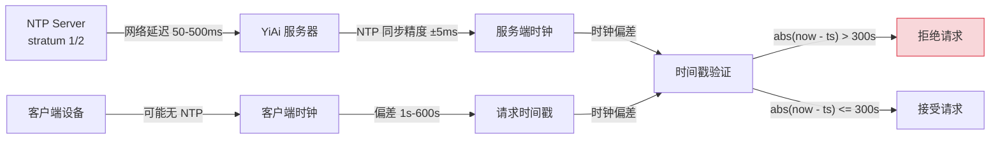
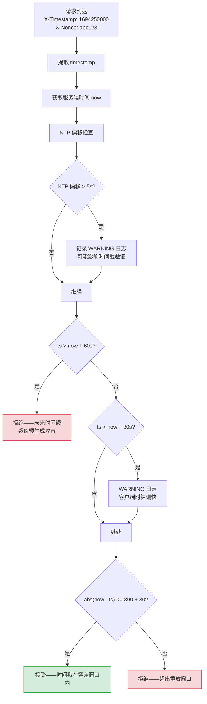

# YA-09-114: 请求签名时间戳容差 — NTP 时钟同步容错与未来时间戳拒绝

> 需求编号：YA-09-114 · 优先级：P2 · 人天：0.5d · 状态：需求已编写
> 依赖：YA-09-85（请求签名验证）

## 背景

YA-09-85 为 YiAi 实现了请求签名验证机制，其中包含 300 秒的重放攻击窗口——服务端拒绝时间戳与当前时间差距超过 300 秒的请求。该机制假设客户端和服务端的时钟完全同步，但实际生产环境中存在以下问题：

1. **NTP 时钟漂移**：即使配置了 NTP 同步，时钟偏差 1-5 秒是常态，恶劣网络条件下可达 30 秒以上
2. **客户端时钟不准**：YiPet Chrome 扩展运行在用户设备上，用户可能关闭了自动时间同步
3. **虚拟机时钟偏移**：容器/VM 的时钟可能因宿主机负载而漂移
4. **夏令时/时区问题**：部分客户端使用本地时间而非 UTC

时钟偏差导致的直接后果：合法请求被拒绝（false positive），或过期请求被接受（false negative）。必须在安全性和可用性之间取得平衡。

### 核心挑战

| 挑战 | 描述 | 影响 |
|------|------|------|
| NTP 同步延迟 | 公网 NTP 服务器响应延迟 50-500ms | 同步精度有限 |
| 客户端时钟多样性 | 移动设备、IoT 设备时钟偏差大 | 合法请求被拒绝 |
| 预生成攻击 | 攻击者提前生成大量签名请求 | 未来时间戳威胁 |
| 时钟回拨 | NTP 同步可能将时钟回调 | 时间戳非单调递增 |

### 设计目标

- 容忍 30 秒的 NTP 时钟偏移（可配置）
- 拒绝超过 60 秒的未来时间戳（防预生成攻击）
- 服务端定期检查 NTP 同步状态，偏移 > 5 秒时告警
- 配合 nonce 机制防止重放攻击

---

## 一、现状分析

### 1.1 YA-09-85 现有时戳验证

```python
# 当前实现——无时钟容差
def validate_timestamp(ts: int) -> bool:
    now = int(time.time())
    return abs(now - ts) <= 300  # 硬编码 300s，无容差
```

**问题**：
- 若服务端时钟比客户端快 5 秒，客户端发送 `ts=now`，服务端看到的 `abs(now - ts) = 5`，仍在 300s 内——但若服务端时钟比客户端慢 5 秒，客户端发送 `ts=now+5`，服务端 `abs(now - ts) = 5`，仍在窗内
- 若服务端 NTP 同步失败，时钟偏差 30 秒，则大量请求被拒绝
- 无未来时间戳拒绝——攻击者可提前生成大量签名，在未来窗口内重放

### 1.2 时钟偏差来源



### 1.3 根因矩阵

| 根因 | 现象 | 严重程度 |
|------|------|----------|
| 硬编码 300s 窗口 | 无 NTP 容差，时钟偏差大时误拒绝 | 高 |
| 无未来时间戳检查 | 攻击者可预生成签名 | 中 |
| 无 NTP 同步监控 | 时钟偏差累积无感知 | 中 |
| 无 nonce 机制 | 仅靠时间戳防重放，安全性不足 | 中 |

---

## 二、设计决策

### 决策 1：时钟容差——固定值 vs 动态值 vs 自适应

| 选项 | 安全性 | 可用性 | 实现复杂度 |
|------|--------|--------|-----------|
| **固定容差（30s）** | 中 | 高 | 低 |
| 动态容差（基于 NTP 偏移） | 高 | 高 | 中 |
| 自适应（学习客户端偏差） | 高 | 最高 | 高 |

**选择：固定容差 30s + NTP 偏移监控。** 固定容差简单可靠，30 秒覆盖绝大多数 NTP 偏差场景。配合 NTP 偏移监控，当偏移超过 5 秒时告警，运维可主动修复。

### 决策 2：未来时间戳处理——拒绝 vs 容差 vs 分层处理

| 选项 | 安全性 | 可用性 | 说明 |
|------|--------|--------|------|
| 拒绝所有未来时间戳 | 最高 | 低 | 客户端时钟稍快即被拒 |
| **分层处理（容差内接受，超容差拒绝）** | 高 | 高 | 30s 内容差，60s 外拒绝 |
| 全部接受 | 低 | 最高 | 无法防预生成攻击 |

**选择：分层处理。** 30 秒以内的未来时间戳接受（时钟容差），30-60 秒记录 WARNING 但仍接受，超过 60 秒拒绝（可能是预生成攻击或严重时钟偏差）。

### 决策 3：NTP 同步监控——主动查询 vs 被动检测 vs 外部依赖

| 选项 | 准确性 | 依赖 | 开销 |
|------|--------|------|------|
| **主动查询 NTP 服务器** | 高 | 需 NTP 服务器地址 | 低 |
| 被动检测（分析请求时间戳分布） | 低 | 无 | 极低 |
| 外部监控（Prometheus node_exporter） | 高 | 外部系统 | 无 |

**选择：主动查询 NTP 服务器。** 使用 `ntplib` 库定期查询 NTP 服务器，获取时钟偏移。偏移超过 5 秒时告警。此方案在 YiAi 进程内实现，不依赖外部监控系统。

### 设计决策记录

| 决策 | 选项 A | 选项 B | 选项 C | 选择 | 理由 |
|------|--------|--------|--------|------|------|
| 时钟容差 | 固定 30s | 动态 | 自适应 | **固定 30s** | 简单可靠，覆盖大多数场景 |
| 未来时间戳 | 拒绝 | 分层处理 | 接受 | **分层处理** | 平衡安全性和可用性 |
| NTP 监控 | 主动查询 | 被动检测 | 外部依赖 | **主动查询** | 进程内实现，不依赖外部系统 |

---

## 三、目标架构

### 3.1 改造后数据流



### 3.2 核心组件

```python
# YiAi/src/shared/clock_tolerance.py
import time
import hashlib
import struct
from dataclasses import dataclass
from typing import Optional

@dataclass
class ClockStatus:
    """时钟状态快照。"""
    ntp_offset_ms: float          # NTP 偏移（毫秒），正=服务端快
    ntp_synced: bool              # 是否成功同步
    last_sync_time: float         # 上次同步时间
    system_time: float            # 当前系统时间
    is_reliable: bool             # 时钟是否可靠


class ClockToleranceValidator:
    """NTP 时钟容差验证器。
    
    验证层级：
    1. 拒绝超过 60s 的未来时间戳（防预生成攻击）
    2. 30-60s 的未来时间戳接受但告警（客户端时钟偏快）
    3. 30s 以内的未来时间戳容差接受
    4. 过去时间戳在 300s + 30s 容差内接受
    
    配置：
    - CLOCK_SKEW_TOLERANCE: 30s 时钟偏移容差
    - MAX_FUTURE_OFFSET: 60s 未来时间戳硬限制
    - REPLAY_WINDOW: 300s 重放保护窗口
    """
    
    CLOCK_SKEW_TOLERANCE = 30   # 30s 时钟偏移容差
    MAX_FUTURE_OFFSET = 60      # 拒绝超过 60s 的未来时间戳
    REPLAY_WINDOW = 300         # 300s 重放保护窗口
    
    # NTP 配置
    NTP_SERVER = 'pool.ntp.org'
    NTP_SYNC_INTERVAL = 300     # 5 分钟同步一次
    NTP_OFFSET_ALERT = 5.0      # 偏移超过 5s 告警
    
    def __init__(self):
        self._clock_status: Optional[ClockStatus] = None
        self._last_ntp_check: float = 0
    
    def validate_timestamp(self, ts: int) -> tuple[bool, str]:
        """验证请求时间戳是否在有效窗口内。
        
        Args:
            ts: 请求时间戳（Unix timestamp，秒）
        
        Returns:
            (is_valid, reason)
        """
        now = int(time.time())
        total_window = self.REPLAY_WINDOW + self.CLOCK_SKEW_TOLERANCE
        
        # 1. 未来时间戳硬限制——防预生成攻击
        if ts > now + self.MAX_FUTURE_OFFSET:
            logger.warning(
                f'[ClockSkew] REJECTED future timestamp: ts={ts} now={now} '
                f'diff={ts - now}s > {self.MAX_FUTURE_OFFSET}s limit'
            )
            return False, f'future_timestamp: {ts - now}s ahead'
        
        # 2. 未来时间戳软告警（容差内）
        if ts > now + self.CLOCK_SKEW_TOLERANCE:
            logger.warning(
                f'[ClockSkew] future timestamp within tolerance: '
                f'diff={ts - now}s (limit={self.CLOCK_SKEW_TOLERANCE}s)'
            )
            # 仍在容差内——接受但告警
            return True, 'future_timestamp_tolerated'
        
        # 3. 过去时间戳验证
        diff = abs(now - ts)
        if diff <= total_window:
            return True, 'ok'
        
        logger.warning(
            f'[ClockSkew] REJECTED expired timestamp: ts={ts} now={now} '
            f'diff={diff}s > {total_window}s window'
        )
        return False, f'expired_timestamp: {diff}s old'
    
    def check_ntp_sync(self) -> ClockStatus:
        """检查 NTP 同步状态。
        
        使用 SNTP 协议查询 NTP 服务器，获取时钟偏移。
        如果 NTP 查询失败，返回上次成功同步的状态。
        """
        now = time.time()
        
        # 检查同步间隔
        if now - self._last_ntp_check < self.NTP_SYNC_INTERVAL:
            if self._clock_status:
                return self._clock_status
            return ClockStatus(
                ntp_offset_ms=0, ntp_synced=False,
                last_sync_time=0, system_time=now, is_reliable=False
            )
        
        self._last_ntp_check = now
        
        try:
            offset_ms = self._query_ntp_offset()
            synced = True
            is_reliable = abs(offset_ms) < self.NTP_OFFSET_ALERT * 1000
            
            if not is_reliable:
                logger.warning(
                    f'[ClockSkew] NTP offset {offset_ms:.0f}ms > '
                    f'{self.NTP_OFFSET_ALERT * 1000:.0f}ms alert threshold'
                )
        except Exception as e:
            logger.error(f'[ClockSkew] NTP sync failed: {e}')
            offset_ms = self._clock_status.ntp_offset_ms if self._clock_status else 0
            synced = False
            is_reliable = False
        
        self._clock_status = ClockStatus(
            ntp_offset_ms=offset_ms,
            ntp_synced=synced,
            last_sync_time=now,
            system_time=now,
            is_reliable=is_reliable,
        )
        return self._clock_status
    
    def _query_ntp_offset(self) -> float:
        """使用 SNTP 协议查询 NTP 服务器偏移。
        
        SNTP 协议：
        - 发送 48 字节请求包
        - 接收 48 字节响应包
        - 偏移 = ((T2 - T1) + (T3 - T4)) / 2
        
        Returns:
            偏移量（毫秒），正数表示服务端时钟比 NTP 快
        """
        import socket
        
        # SNTP 请求包（48 字节）
        # LI=0, VN=4, Mode=3 (client)
        request = bytearray(48)
        request[0] = 0x23  # 00 100 011 = LI=0, VN=4, Mode=3
        
        sock = socket.socket(socket.AF_INET, socket.SOCK_DGRAM)
        sock.settimeout(3)
        
        try:
            T1 = time.time()
            sock.sendto(request, (self.NTP_SERVER, 123))
            data, _ = sock.recvfrom(48)
            T4 = time.time()
            
            # 解析 NTP 响应
            # T2: 接收时间戳（服务端收到请求的时间）
            # T3: 传输时间戳（服务端发送响应的时间）
            T2 = self._parse_ntp_timestamp(data[32:40])
            T3 = self._parse_ntp_timestamp(data[40:48])
            
            # 计算偏移: ((T2 - T1) + (T3 - T4)) / 2
            offset = ((T2 - T1) + (T3 - T4)) / 2
            return offset * 1000  # 转为毫秒
        finally:
            sock.close()
    
    def _parse_ntp_timestamp(self, data: bytes) -> float:
        """解析 NTP 时间戳（64 位定点数）。"""
        seconds, fraction = struct.unpack('!II', data)
        # NTP epoch (1900-01-01) 到 Unix epoch (1970-01-01) 的差值
        NTP_DELTA = 2208988800
        return (seconds - NTP_DELTA) + fraction / 2**32


# 全局实例
clock_validator = ClockToleranceValidator()


# 使用示例——在签名验证中间件中
async def validate_request_signature(request: Request) -> bool:
    """验证请求签名和时间戳。"""
    ts = int(request.headers.get('X-Timestamp', '0'))
    nonce = request.headers.get('X-Nonce', '')
    
    # 1. 时间戳验证（含容差）
    is_valid, reason = clock_validator.validate_timestamp(ts)
    if not is_valid:
        logger.warning(f'[Auth] timestamp validation failed: {reason}')
        return False
    
    # 2. Nonce 验证（防重放）
    if not await nonce_store.check_and_store(nonce, ttl=330):
        logger.warning(f'[Auth] nonce replay detected: {nonce[:8]}...')
        return False
    
    # 3. 签名验证
    # ... 签名计算和比对 ...
    return True
```

### 3.3 架构决策权衡

| 维度 | 改造前 | 改造后 | 权衡说明 |
|------|--------|--------|----------|
| 时钟容差 | 0s（硬编码 300s） | 30s 容差 | 宽松但安全——30s 远小于 300s 窗口 |
| 未来时间戳 | 无检查 | 60s 硬限制 | 增加安全性，防止预生成攻击 |
| NTP 监控 | 无 | 5 分钟主动查询 | 增加 NTP 网络请求开销 |

---

## 四、具体改动

### 4.1 新增文件

| 文件 | 说明 |
|------|------|
| `YiAi/src/shared/clock_tolerance.py` | NTP 时钟容差验证器 |
| `YiAi/tests/shared/test_clock_tolerance.py` | 时钟容差单元测试 |

### 4.2 修改文件

| 文件 | 改动 |
|------|------|
| `YiAi/src/server/middleware/auth_middleware.py` | 时间戳验证改用 `ClockToleranceValidator` |
| `YiAi/src/app.py` | 启动时初始化 `ClockToleranceValidator`，启动 NTP 后台任务 |

### 4.3 涉及文件清单

```
YiAi/src/shared/
└── clock_tolerance.py                 # 新增: NTP 时钟容差验证器

YiAi/src/server/middleware/
└── auth_middleware.py                 # 修改: 时间戳验证切换

YiAi/src/app.py                        # 修改: 初始化 + NTP 后台任务

YiAi/tests/shared/
└── test_clock_tolerance.py            # 新增: 单元测试
```

---

## 五、实施步骤

| 步骤 | 内容 | 涉及文件 | 验证方式 | 人天 |
|------|------|---------|---------|------|
| 1 | 实现 `ClockToleranceValidator` 核心逻辑 | `clock_tolerance.py` | 单元测试：各时间戳场景验证 | 0.15 |
| 2 | 实现 SNTP 查询（NTP 偏移获取） | `clock_tolerance.py` | 手动测试：查询 `pool.ntp.org` 返回偏移 | 0.1 |
| 3 | 修改 `auth_middleware.py` 集成新验证器 | `auth_middleware.py` | 集成测试：签名请求时间戳验证 | 0.1 |
| 4 | 初始化 NTP 后台同步任务 | `app.py` | 启动后日志输出 NTP 偏移 | 0.05 |
| 5 | 编写单元测试 | `test_clock_tolerance.py` | `pytest` 全部通过 | 0.1 |

**总计：0.5d**

---

## 六、性能分析

### 6.1 时间戳验证开销

| 操作 | 耗时 | 说明 |
|------|------|------|
| 时间戳验证 | < 0.01ms | 纯整数比较 |
| NTP 查询 | 50-500ms | 网络延迟，异步执行，不阻塞请求 |
| 时钟状态检查 | < 0.01ms | 读取缓存值 |

### 6.2 验证窗口

| 场景 | 窗口 | 说明 |
|------|------|------|
| 正常请求 | 300s + 30s = 330s | 重放窗口 + 时钟容差 |
| 未来时间戳（容差内） | 30s | 接受但告警 |
| 未来时间戳（硬限制） | 60s | 拒绝 |
| 过期时间戳 | 330s | 拒绝 |

---

## 七、测试规格

### Requirement: 时间戳验证

#### Scenario: 正常时间戳通过验证
- **Given** 服务端时间 `now=1000`，请求时间戳 `ts=1000`
- **When** `validate_timestamp(1000)` 调用
- **Then** 返回 `(True, 'ok')`

#### Scenario: 过去时间戳在窗口内通过
- **Given** 服务端时间 `now=1000`，请求时间戳 `ts=800`（差 200s）
- **When** `validate_timestamp(800)` 调用
- **Then** 返回 `(True, 'ok')`

#### Scenario: 过去时间戳超出窗口被拒绝
- **Given** 服务端时间 `now=1000`，请求时间戳 `ts=600`（差 400s > 330s）
- **When** `validate_timestamp(600)` 调用
- **Then** 返回 `(False, 'expired_timestamp: 400s old')`

#### Scenario: 未来时间戳在容差内接受
- **Given** 服务端时间 `now=1000`，请求时间戳 `ts=1020`（快 20s < 30s）
- **When** `validate_timestamp(1020)` 调用
- **Then** 返回 `(True, 'future_timestamp_tolerated')`

#### Scenario: 未来时间戳超出硬限制被拒绝
- **Given** 服务端时间 `now=1000`，请求时间戳 `ts=1100`（快 100s > 60s）
- **When** `validate_timestamp(1100)` 调用
- **Then** 返回 `(False, 'future_timestamp: 100s ahead')`

### Requirement: NTP 同步

#### Scenario: NTP 查询成功返回偏移
- **Given** 网络可访问 `pool.ntp.org`
- **When** `check_ntp_sync()` 调用
- **Then** `ClockStatus.ntp_synced == True`，`ntp_offset_ms` 在合理范围

#### Scenario: NTP 偏移超过 5s 时告警
- **Given** NTP 偏移 > 5000ms
- **When** `check_ntp_sync()` 调用
- **Then** `ClockStatus.is_reliable == False`，日志输出 WARNING

#### Scenario: NTP 查询失败降级
- **Given** 网络不可达 NTP 服务器
- **When** `check_ntp_sync()` 调用
- **Then** `ClockStatus.ntp_synced == False`，使用上次缓存偏移

---

## 八、风险与缓解

| 风险 | 概率 | 影响 | 等级 | 缓解措施 | 应急预案 |
|------|------|------|------|----------|----------|
| NTP 同步失败导致所有请求被拒 | 低 | 高 | 中 | NTP 仅用于告警，不影响时间戳验证窗口 | 手动放宽容差至 600s |
| 移动设备时钟偏差大 | 中 | 中 | 中 | 容差已放宽至 30s，可配置为 60s | 对移动端使用更宽松的窗口 |
| NTP 服务器不可达 | 低 | 低 | 低 | 降级为仅依赖系统时钟 | 切换备用 NTP 服务器 |
| 时钟回拨导致时间戳窗口异常 | 低 | 中 | 低 | 记录上次时间，检测回拨 | 回拨时放宽容差 |

---

## 九、回滚策略

| 回滚场景 | 回滚方式 | 影响范围 | 恢复时间 |
|----------|----------|----------|----------|
| 容差过大导致安全风险 | 减小 `CLOCK_SKEW_TOLERANCE` 至 10s | 签名验证 | 2min（配置热更新） |
| 容差过小导致大量拒绝 | 增大 `CLOCK_SKEW_TOLERANCE` 至 60s | 签名验证 | 2min（配置热更新） |
| NTP 查询导致网络开销 | 关闭 NTP 后台任务 | 仅失去偏移监控 | 1min |
| 时间戳验证逻辑 bug | 回退 `auth_middleware.py` 到上一版本 | 认证中间件 | 10min |

---

## 十、设计决策记录

### D-01: 为什么 30s 容差而非 10s 或 60s？

10s 容差对 NTP 精度要求过高——公网 NTP 在恶劣网络下偏差可达 20-30s。60s 容差过大——重放窗口 300s 已足够宽，再增加 60s 容差会使窗口接近 360s（6 分钟），安全性降低。30s 是平衡点：覆盖绝大多数 NTP 偏差场景，同时保持合理的重放窗口。

### D-02: 为什么未来时间戳硬限制 60s 而非 30s？

30s 与时钟容差重叠，无法区分"时钟偏差"和"预生成攻击"。60s 提供了一个缓冲区间：30-60s 内的未来时间戳接受但告警，60s 外的才是真正的攻击信号。这避免了因客户端时钟偏快 40s 而误拒绝合法请求。

### D-03: 为什么不使用 NTP 偏移动态调整验证窗口？

动态调整会增加复杂度且引入新的攻击面——攻击者可通过干扰 NTP 查询来扩大重放窗口。固定容差 + 独立 NTP 监控（仅告警）的解耦方案更安全：NTP 偏移不影响验证逻辑，仅提供运维可见性。

---

## 十一、可观测性

### 11.1 指标

| 指标 | 采集方式 | 采集频率 | 告警阈值 | 说明 |
|------|----------|----------|----------|------|
| `timestamp_validation_total` | 每次验证 | 按事件 | — | 按结果（ok/rejected）分组 |
| `timestamp_future_rejected` | 未来时间戳拒绝计数 | 按事件 | > 0 | 可能为预生成攻击 |
| `timestamp_future_tolerated` | 未来时间戳容差计数 | 按事件 | 增长率 > 10/min | 客户端时钟偏差 |
| `ntp_offset_ms` | `check_ntp_sync()` | 5min | > 5000ms | 服务端时钟偏移大 |
| `ntp_sync_success` | NTP 查询成功计数 | 5min | 连续 3 次失败 | NTP 服务不可达 |

### 11.2 日志

```python
logger.info(f'[ClockSkew] NTP offset={offset_ms:.0f}ms synced={synced} reliable={is_reliable}')
logger.warning(f'[ClockSkew] future timestamp diff={diff}s tolerated')
logger.warning(f'[ClockSkew] REJECTED future timestamp diff={diff}s > {MAX_FUTURE_OFFSET}s')
logger.error(f'[ClockSkew] NTP sync failed: {e}')
```

### 11.3 告警规则

| 告警 | 条件 | 严重级别 | 通知渠道 |
|------|------|----------|----------|
| NTP 偏移过大 | `ntp_offset_ms > 5000ms` | WARNING | 企业微信 |
| NTP 同步失败 | 连续 3 次失败 | CRITICAL | 企业微信 + 邮件 |
| 未来时间戳拒绝 | 1h 内 > 5 次 | WARNING | 企业微信 |
| 时间戳过期拒绝率 | 1h 内 > 10% | WARNING | 企业微信 |

---

## 十二、代码审查检查清单

- [ ] 请求 timestamp 验证：`|server_time - request_time| < 300s + 30s NTP skew`
- [ ] NTP 时间同步检查——偏移 > 5s 告警
- [ ] 时钟偏差容差可配置（环境变量 `CLOCK_SKEW_TOLERANCE`）
- [ ] 防止重放攻击——配合 nonce 使用
- [ ] 未来时间戳 > 60s 硬拒绝（防预生成攻击）
- [ ] 30-60s 未来时间戳接受但告警
- [ ] NTP 同步失败时降级为仅依赖系统时钟
- [ ] 时间戳验证日志记录拒绝原因

---

## 十三、回归问题预测

| # | 预测问题 | 原因 | 验证方法 |
|---|---------|------|---------|
| 1 | NTP 同步失败导致所有请求被拒 | 时钟偏差超过容差 | 降级放宽容差，NTP 仅告警不影响验证 |
| 2 | 移动设备时钟偏差大 | 用户未启用自动时间 | 容差放宽至 30s，可配置为 60s |
| 3 | 预生成攻击绕过 | 攻击者在 60s 内生成签名 | 配合 nonce 一次性使用 |
| 4 | 时钟回拨导致时间戳跳变 | NTP 同步回拨 | 检测回拨事件，记录日志 |

---

*PRD 来源: `projects/yiai/requirements/2026-09/114-需求-时间戳容差NTP.md`*

## 影响范围

- **影响模块**：待补充
- **涉及文件**：
- `clock_tolerance.py`
- `app.py`
- `auth_middleware.py`
- `test_clock_tolerance.py`
- **是否影响 API 契约**：否
- **是否影响其他项目（YiVad/YiPet）**：否
- **用户感知**：待确认

## 预防措施

| 层面 | 措施 |
|------|------|
| 代码 | 在相关函数中添加参数校验和边界检查 |
| 测试 | 为 `clock_tolerance.py` 添加单元测试 |
| 流程 | 代码审查时重点检查此类模式 |
| 监控 | 添加日志告警，异常发生时及时发现 |
| 文档 | 在编码规范中记录此类反模式 |

## 经验教训

1. **根本原因**：开发过程中对边界情况和异常路径的考虑不足是此类问题的共同根因
2. **设计阶段**：在接口设计和模块实现时，应主动考虑异常输入、空值、超时等边界场景
3. **代码审查**：审查时应检查是否存在类似的反模式（如未捕获异常、无超时控制、缺少参数校验等）
4. **测试覆盖**：异常路径的测试覆盖率应与正常路径同等重视
5. **团队分享**：此类问题应在团队周会或技术分享中讨论，形成团队共识
