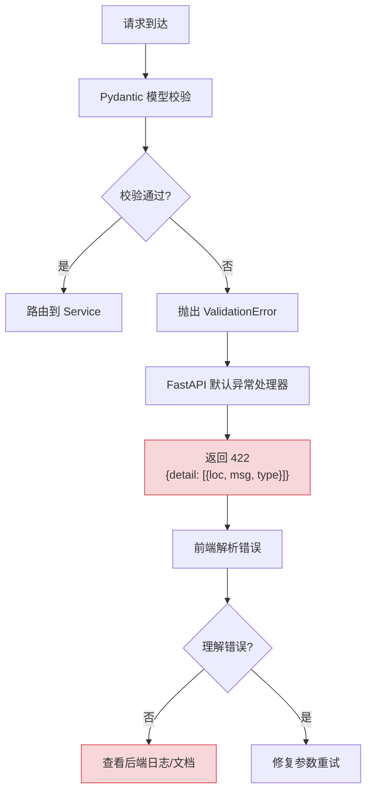
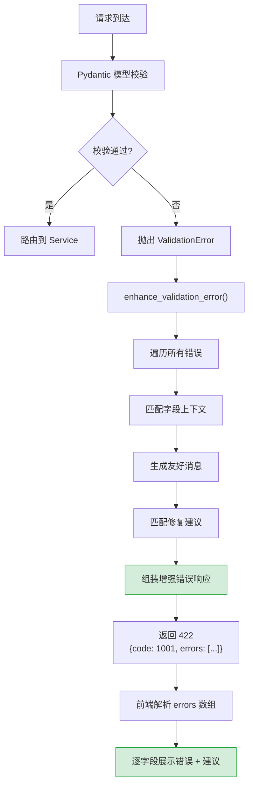

# YA-09-115: 请求体校验错误增强 — 字段级错误定位与智能修复建议

> 需求编号：YA-09-115 · 优先级：P2 · 人天：0.5d · 状态：需求已编写
> 依赖：YA-09-51（Pydantic 参数校验）

## 背景

YA-09-51 为 YiAi 引入了 Pydantic 参数校验，但错误信息是技术导向的——面向开发者而非业务用户。典型错误响应如：

```json
{
  "detail": [{
    "loc": ["body", "parameters", "cname"],
    "msg": "field required",
    "type": "value_error.missing"
  }]
}
```

这种错误信息存在的问题：
1. **技术术语**："field required" 对业务用户无意义，应改为"缺少必填字段 cname，请输入集合名称"
2. **无上下文**：不知道 `cname` 是什么、应该填什么值
3. **无修复建议**：不知道如何纠正错误
4. **仅返回首个错误**：多字段错误时，用户需逐个修复再重试，效率低

### 核心挑战

| 挑战 | 描述 | 影响 |
|------|------|------|
| 上下文缺失 | 参数名脱离业务含义 | 用户不知道如何填写 |
| 无修复建议 | 不知道有效值格式 | 反复试错 |
| 仅首个错误 | 多字段错误需多次修复 | 开发效率低 |
| 硬编码 vs 可扩展 | 字段上下文需维护 | 新增字段时需同步更新 |

### 设计目标

- 校验错误返回字段级详情（field/message/suggestion/code）
- suggestion 包含示例值或格式提示
- 多个字段错误时全部返回（非仅第一个）
- 错误消息支持 i18n（国际化预留）

---

## 一、现状分析

### 1.1 当前校验错误处理

YA-09-51 使用 Pydantic 的 `ValidationError`，FastAPI 默认的异常处理器将其转换为 HTTP 422 响应。错误信息直接暴露 Pydantic 内部结构。



### 1.2 典型错误对比

| 原始错误 | 增强后 |
|----------|--------|
| `field required` | 缺少必填字段 "cname"——请指定要操作的集合名称（projects/bugs/sessions/...） |
| `type_error.integer` | 字段 "page" 类型错误——期望整数，收到字符串 "abc" |
| `value_error.extra` | 未知字段 "query"——已从请求中移除，请使用 "filter" |
| `type_error.enum` | 字段 "cname" 值无效——可选值: projects, bugs, sessions, knowledge_files, users |

### 1.3 根因矩阵

| 根因 | 现象 | 严重程度 |
|------|------|----------|
| 技术导向错误信息 | 业务用户无法理解 | 中 |
| 无字段上下文 | 不知道参数含义和有效值 | 高 |
| 仅首个错误 | 多字段错误需多次修复 | 中 |
| 无修复建议 | 不知道如何纠正 | 高 |

---

## 二、设计决策

### 决策 1：错误增强方式 — 覆盖异常处理器 vs 包装 Pydantic vs 自定义错误类

| 选项 | 侵入性 | 灵活性 | 维护成本 |
|------|--------|--------|----------|
| **覆盖 FastAPI 异常处理器** | 低 | 高 | 低 |
| 包装 Pydantic（自定义 Validator） | 中 | 中 | 中 |
| 自定义错误类（替代 Pydantic） | 高 | 高 | 高 |

**选择：覆盖 FastAPI 异常处理器。** FastAPI 提供了 `add_exception_handler` 钩子，可拦截 `ValidationError` 并自定义响应格式。此方案不修改 Pydantic 核心逻辑，侵入性最小。

### 决策 2：字段上下文维护 — 硬编码字典 vs 配置文件 vs 装饰器注解

| 选项 | 可维护性 | 可扩展性 | 实现复杂度 |
|------|----------|----------|-----------|
| **硬编码字典** | 中 | 低 | 低 |
| 配置文件（JSON/YAML） | 高 | 高 | 中 |
| 装饰器注解 | 高 | 高 | 高 |

**选择：硬编码字典（当前阶段）+ 配置文件预留。** 字典覆盖 YiAi 核心 RPC 参数（约 15 个字段），维护成本低。后续可迁移到配置文件，支持动态加载和 i18n。

### 决策 3：多错误返回策略 — 仅首个 vs 全部 vs 前 N 个

| 选项 | 响应大小 | 用户体验 | 实现复杂度 |
|------|----------|----------|-----------|
| 仅首个错误 | 小 | 差 | 低 |
| 全部错误 | 大 | 好 | 低 |
| **前 10 个错误** | 中 | 好 | 低 |

**选择：前 10 个错误。** 返回全部错误在极端情况下（50+ 字段）响应过大，前 10 个覆盖绝大多数场景。超过 10 个时附加 `"total_errors": N` 和提示。

### 设计决策记录

| 决策 | 选项 A | 选项 B | 选项 C | 选择 | 理由 |
|------|--------|--------|--------|------|------|
| 增强方式 | 覆盖异常处理器 | 包装 Pydantic | 自定义错误类 | **覆盖异常处理器** | 侵入性最小 |
| 字段上下文 | 硬编码字典 | 配置文件 | 装饰器注解 | **硬编码字典** | 当前阶段最简，后续可迁移 |
| 多错误返回 | 仅首个 | 全部 | 前 10 个 | **前 10 个** | 平衡用户体验和响应大小 |

---

## 三、目标架构

### 3.1 改造后数据流



### 3.2 核心组件

```python
# YiAi/src/shared/validation_enhancer.py
from typing import Optional

# 友好错误消息模板
FRIENDLY_MESSAGES: dict[str, str] = {
    'missing': '缺少必填字段 "{field}"——{context}',
    'type_error': '字段 "{field}" 类型错误——期望 {expected}，收到 {actual}',
    'value_error': '字段 "{field}" 值无效——{reason}',
    'extra_forbidden': '未知字段 "{field}"——已从请求中移除，请使用 "{alternative}"',
    'string_too_short': '字段 "{field}" 过短——最少 {min_length} 个字符',
    'string_too_long': '字段 "{field}" 过长——最多 {max_length} 个字符',
    'number_too_small': '字段 "{field}" 值过小——最小 {min_value}',
    'number_too_large': '字段 "{field}" 值过大——最大 {max_value}',
    'enum': '字段 "{field}" 值无效——可选值: {options}',
    'json_invalid': '请求体不是有效的 JSON 格式——请检查语法',
    'unexpected_type': '字段 "{field}" 类型错误——期望 {expected}，收到 {actual}',
}

# 字段上下文——业务含义 + 示例值
FIELD_CONTEXT: dict[str, dict] = {
    'cname': {
        'context': '请指定要操作的集合名称',
        'example': 'projects',
        'options': ['projects', 'bugs', 'sessions', 'knowledge_files', 'rss_entries', 'menus', 'users', 'static_files'],
        'format': '字符串，枚举值',
    },
    'filter': {
        'context': 'MongoDB 查询过滤条件',
        'example': '{"status": "open"}',
        'format': 'JSON 对象，键值对',
        'note': '注意：参数名为 filter，非 query',
    },
    'target_file': {
        'context': '目标文件路径',
        'example': 'YiKnowledge/engineer/deployment-guide.md',
        'format': '字符串，相对路径，以 YiKnowledge/ 开头',
        'note': '注意：参数名为 target_file，非 path',
    },
    'page': {
        'context': '分页页码',
        'example': '1',
        'format': '正整数，从 1 开始',
    },
    'pageSize': {
        'context': '每页条数',
        'example': '20',
        'format': '正整数，范围 1-500',
    },
    'sort': {
        'context': '排序条件',
        'example': '{"updated": -1}',
        'format': 'JSON 对象，键为字段名，值为 1（升序）或 -1（降序）',
    },
    'module_name': {
        'context': 'RPC 模块路径',
        'example': 'services.database.data_service',
        'format': '字符串，格式: services.<domain>.<service>',
    },
    'method_name': {
        'context': 'RPC 方法名',
        'example': 'query_documents',
        'format': '字符串，snake_case',
    },
    'parameters': {
        'context': 'RPC 方法参数',
        'example': '{"cname": "projects", "filter": {}}',
        'format': 'JSON 对象',
    },
    'content': {
        'context': '文件内容',
        'example': '# 文件标题\n\n文件正文...',
        'format': '字符串（Markdown/文本）',
    },
    'messages': {
        'context': '聊天消息列表',
        'example': '[{"role": "user", "content": "你好"}]',
        'format': '数组，每项包含 role 和 content',
    },
    'question': {
        'context': 'RAG 检索问题',
        'example': '如何部署 YiAi？',
        'format': '字符串，自然语言问题',
    },
    'scope': {
        'context': '知识库检索范围',
        'example': 'engineer',
        'format': '字符串，角色目录名',
        'options': ['engineer', 'srer', 'curator', 'designer', 'manager', 'tester', 'common'],
    },
    'key': {
        'context': '文档唯一标识',
        'example': 'session_abc123',
        'format': '字符串，格式: {类型}_{标识}',
    },
    'title': {
        'context': '标题',
        'example': '部署指南',
        'format': '字符串，1-200 字符',
    },
}

# 错误类型映射
ERROR_TYPE_MAP: dict[str, str] = {
    'missing': 'missing',
    'value_error.missing': 'missing',
    'type_error.integer': 'type_error',
    'type_error.float': 'type_error',
    'type_error.str': 'type_error',
    'type_error.bool': 'type_error',
    'type_error.dict': 'type_error',
    'type_error.list': 'type_error',
    'type_error.json': 'json_invalid',
    'value_error.extra': 'extra_forbidden',
    'type_error.enum': 'enum',
    'value_error.str.min_length': 'string_too_short',
    'value_error.str.max_length': 'string_too_long',
    'value_error.number.min_size': 'number_too_small',
    'value_error.number.max_size': 'number_too_large',
    'type_error.unexpected_type': 'unexpected_type',
}

MAX_ERRORS = 10  # 最多返回 10 个错误


@dataclass
class EnhancedError:
    """增强后的校验错误。"""
    field: str                # 字段名（如 cname）
    location: list[str]       # 字段路径（如 body.parameters.cname）
    message: str              # 用户友好消息
    suggestion: str           # 修复建议
    code: str                 # 错误类型代码
    example: Optional[str] = None  # 示例值


def enhance_validation_error(exc) -> dict:
    """将 Pydantic ValidationError 转换为增强错误响应。
    
    Args:
        exc: pydantic.ValidationError 实例
    
    Returns:
        RPC 错误响应格式: {code: 1001, message: ..., data: {errors: [...]}}
    """
    errors = exc.errors()
    enhanced_errors: list[EnhancedError] = []
    
    for error in errors[:MAX_ERRORS]:
        enhanced = _enhance_single_error(error)
        enhanced_errors.append(enhanced)
    
    total_errors = len(errors)
    message = f'请求参数校验失败——共 {total_errors} 个错误'
    if total_errors > MAX_ERRORS:
        message += f'（仅展示前 {MAX_ERRORS} 个）'
    
    return {
        'code': 1001,
        'message': message,
        'data': {
            'errors': [
                {
                    'field': e.field,
                    'location': '.'.join(e.location),
                    'message': e.message,
                    'suggestion': e.suggestion,
                    'code': e.code,
                    'example': e.example,
                }
                for e in enhanced_errors
            ],
            'total_errors': total_errors,
        }
    }


def _enhance_single_error(error: dict) -> EnhancedError:
    """增强单个 Pydantic 校验错误。"""
    # 提取字段名
    loc = list(error.get('loc', ['unknown']))
    field = str(loc[-1]) if loc else 'unknown'
    
    # 获取错误类型
    error_type = error.get('type', 'value_error')
    mapped_type = ERROR_TYPE_MAP.get(error_type, 'value_error')
    
    # 获取字段上下文
    field_info = FIELD_CONTEXT.get(field, {})
    context = field_info.get('context', '')
    example = field_info.get('example', '')
    
    # 获取期望和实际类型
    expected = _get_expected_type(error_type)
    actual = _get_actual_type(error)
    
    # 生成友好消息
    template = FRIENDLY_MESSAGES.get(mapped_type, FRIENDLY_MESSAGES['value_error'])
    message = template.format(
        field=field,
        context=context,
        expected=expected,
        actual=actual,
        reason=error.get('msg', ''),
        alternative=_get_deprecated_alternative(field),
        min_length=error.get('ctx', {}).get('min_length', '?'),
        max_length=error.get('ctx', {}).get('max_length', '?'),
        min_value=error.get('ctx', {}).get('min_value', '?'),
        max_value=error.get('ctx', {}).get('max_value', '?'),
        options=', '.join(field_info.get('options', [])),
    )
    
    # 生成修复建议
    suggestion = _build_suggestion(field, error_type, field_info)
    
    return EnhancedError(
        field=field,
        location=loc,
        message=message,
        suggestion=suggestion,
        code=error_type,
        example=example,
    )


def _get_expected_type(error_type: str) -> str:
    """从错误类型中提取期望类型。"""
    type_map = {
        'type_error.integer': '整数',
        'type_error.float': '浮点数',
        'type_error.str': '字符串',
        'type_error.bool': '布尔值',
        'type_error.dict': 'JSON 对象',
        'type_error.list': '数组',
        'type_error.json': 'JSON',
    }
    return type_map.get(error_type, '—')


def _get_actual_type(error: dict) -> str:
    """从错误上下文中提取实际类型。"""
    actual = error.get('ctx', {}).get('actual', '')
    if actual:
        return str(actual)
    return '—'


def _get_deprecated_alternative(field: str) -> str:
    """获取废弃参数名的替代参数。"""
    deprecated_map = {
        'query': 'filter',
        'path': 'target_file',
        'collection_name': 'cname',
        'history': 'messages',
    }
    return deprecated_map.get(field, '')


def _build_suggestion(field: str, error_type: str, field_info: dict) -> str:
    """根据字段和错误类型生成修复建议。"""
    # 1. 废弃参数名提示
    deprecated_alt = _get_deprecated_alternative(field)
    if deprecated_alt:
        return f'请将参数名 "{field}" 改为 "{deprecated_alt}"'
    
    # 2. 字段上下文建议
    if 'format' in field_info:
        return f'格式要求: {field_info["format"]}'
    
    # 3. 示例值建议
    if 'example' in field_info:
        return f'示例: {field_info["example"]}'
    
    # 4. 通用建议
    if 'missing' in error_type:
        return f'请添加 "{field}" 字段到请求中'
    if 'type_error' in error_type:
        return f'请检查 "{field}" 的数据类型是否正确'
    
    return '请检查字段值是否正确'


# FastAPI 异常处理器注册
from fastapi import Request
from fastapi.responses import JSONResponse
from pydantic import ValidationError

async def validation_exception_handler(request: Request, exc: ValidationError):
    """自定义 ValidationError 异常处理器。"""
    enhanced = enhance_validation_error(exc)
    return JSONResponse(status_code=422, content=enhanced)
```

### 3.3 改造前后对比

**改造前：**
```json
{
  "detail": [{
    "loc": ["body", "parameters", "cname"],
    "msg": "field required",
    "type": "value_error.missing"
  }]
}
```

**改造后：**
```json
{
  "code": 1001,
  "message": "请求参数校验失败——共 2 个错误",
  "data": {
    "errors": [
      {
        "field": "cname",
        "location": "body.parameters.cname",
        "message": "缺少必填字段 \"cname\"——请指定要操作的集合名称",
        "suggestion": "格式要求: 字符串，枚举值，示例: projects",
        "code": "value_error.missing",
        "example": "projects"
      },
      {
        "field": "query",
        "location": "body.parameters.query",
        "message": "未知字段 \"query\"——已从请求中移除，请使用 \"filter\"",
        "suggestion": "请将参数名 \"query\" 改为 \"filter\"",
        "code": "value_error.extra",
        "example": "filter"
      }
    ],
    "total_errors": 2
  }
}
```

### 3.4 架构决策权衡

| 维度 | 改造前 | 改造后 | 权衡说明 |
|------|--------|--------|----------|
| 错误可读性 | 技术术语 | 业务友好 | 需维护字段上下文字典 |
| 错误数量 | 仅首个 | 前 10 个 | 响应体积略增 |
| 修复建议 | 无 | 含示例和格式说明 | 需维护建议模板 |

---

## 四、具体改动

### 4.1 新增文件

| 文件 | 说明 |
|------|------|
| `YiAi/src/shared/validation_enhancer.py` | 校验错误增强器 + 字段上下文 + 异常处理器 |
| `YiAi/tests/shared/test_validation_enhancer.py` | 校验错误增强单元测试 |

### 4.2 修改文件

| 文件 | 改动 |
|------|------|
| `YiAi/src/app.py` | 注册自定义 `ValidationError` 异常处理器 |

### 4.3 涉及文件清单

```
YiAi/src/shared/
└── validation_enhancer.py             # 新增: 校验错误增强器

YiAi/src/app.py                        # 修改: 注册异常处理器

YiAi/tests/shared/
└── test_validation_enhancer.py        # 新增: 单元测试
```

---

## 五、实施步骤

| 步骤 | 内容 | 涉及文件 | 验证方式 | 人天 |
|------|------|---------|---------|------|
| 1 | 实现 `FIELD_CONTEXT` 字典（15 个核心字段） | `validation_enhancer.py` | 审查所有 RPC 参数 | 0.1 |
| 2 | 实现 `enhance_validation_error()` 核心逻辑 | `validation_enhancer.py` | 单元测试：模拟各种校验错误 | 0.15 |
| 3 | 实现 `validation_exception_handler` 异常处理器 | `validation_enhancer.py` | 集成测试：发送无效请求验证响应格式 | 0.1 |
| 4 | 注册异常处理器 | `app.py` | 手动测试：发送缺少 cname 的请求 | 0.05 |
| 5 | 编写单元测试 | `test_validation_enhancer.py` | `pytest` 全部通过 | 0.1 |

**总计：0.5d**

---

## 六、性能分析

### 6.1 增强处理开销

| 操作 | 耗时 | 说明 |
|------|------|------|
| 单错误增强 | < 0.1ms | 字典查找 + 字符串模板 |
| 10 错误增强 | < 0.5ms | 遍历 + 格式化 |
| 异常处理器总开销 | < 1ms | 仅校验失败时触发 |

### 6.2 响应大小

| 场景 | 改造前 | 改造后 | 说明 |
|------|--------|--------|------|
| 单个错误 | ~100B | ~300B | 增加字段上下文和建议 |
| 10 个错误 | ~1KB | ~3KB | 前 10 个错误 + 总计 |

---

## 七、测试规格

### Requirement: 错误增强

#### Scenario: 缺少必填字段返回友好错误
- **Given** 请求缺少 `cname` 字段
- **When** Pydantic 校验失败
- **Then** 响应包含 `message: "缺少必填字段 \"cname\"——请指定要操作的集合名称"`，`suggestion` 包含格式说明

#### Scenario: 类型错误返回期望和实际类型
- **Given** 请求 `page` 字段值为 `"abc"`（字符串），期望整数
- **When** Pydantic 校验失败
- **Then** 响应包含 `message: "字段 \"page\" 类型错误——期望 整数，收到 abc"`

#### Scenario: 废弃参数名提示
- **Given** 请求包含 `query` 字段（废弃参数名）
- **When** Pydantic 校验失败（`additionalProperties: false`）
- **Then** 响应包含 `suggestion: "请将参数名 \"query\" 改为 \"filter\""`

#### Scenario: 枚举值错误返回可选值列表
- **Given** 请求 `cname` 值为 `"invalid"`（不在枚举中）
- **When** Pydantic 校验失败
- **Then** 响应包含 `message` 列出所有可选值

### Requirement: 多错误返回

#### Scenario: 多个字段错误时全部返回
- **Given** 请求同时缺少 `cname` 和 `filter` 字段
- **When** Pydantic 校验失败
- **Then** 响应 `errors` 数组包含 2 个错误，`total_errors == 2`

#### Scenario: 超过 10 个错误时截断
- **Given** 请求有 15 个字段错误
- **When** Pydantic 校验失败
- **Then** 响应 `errors` 数组仅 10 个，`total_errors == 15`，`message` 包含"仅展示前 10 个"

### Requirement: 异常处理器注册

#### Scenario: 校验失败返回 422 + 增强格式
- **Given** 异常处理器已注册
- **When** 发送缺少必填字段的请求
- **Then** 返回 HTTP 422，响应体为 RPC 错误格式（`{code: 1001, message, data}`）

---

## 八、风险与缓解

| 风险 | 概率 | 影响 | 等级 | 缓解措施 | 应急预案 |
|------|------|------|------|----------|----------|
| 错误消息泄露内部字段名 | 低 | 中 | 低 | 仅暴露参数名（非内部实现），审计 production 错误响应 | 关闭 suggestion 字段 |
| 大批量校验错误响应过大 | 低 | 低 | 低 | 截断前 10 错误 | 增大 MAX_ERRORS 或全部返回 |
| 字段上下文维护成本 | 中 | 低 | 低 | 新增字段时同步更新 FIELD_CONTEXT | 缺失上下文的字段回退通用提示 |
| 废弃参数名不完整 | 低 | 低 | 低 | 基于 CLAUDE.md 参数名契约表维护 | 补充映射 |

---

## 九、回滚策略

| 回滚场景 | 回滚方式 | 影响范围 | 恢复时间 |
|----------|----------|----------|----------|
| 错误增强导致响应格式不兼容 | 移除异常处理器注册，恢复 FastAPI 默认 | 错误响应格式 | 5min |
| 字段上下文包含错误信息 | 修正 FIELD_CONTEXT 字典 | 错误消息内容 | 2min（配置热更新） |
| 增强逻辑影响正常请求 | 关闭增强（仅返回原始 Pydantic 错误） | 校验失败响应 | 5min |

---

## 十、设计决策记录

### D-01: 为什么选择前 10 个错误而非全部？

实践表明，10 个错误已覆盖绝大多数多字段错误场景。超过 10 个错误通常意味着请求体完全错误（如格式错误），用户需要重新构造请求而非逐个修复字段。截断 + 总数提示在用户体验和响应大小之间取得平衡。

### D-02: 为什么错误信息包含示例值？

示例值是最直接的修复指导——用户看到 `"example": "projects"` 后可以立即修正。对比仅返回格式说明（如"字符串"），示例值将修复时间从"查文档"缩短到"复制粘贴"。

### D-03: 为什么使用 RPC 错误码 1001 而非 HTTP 422？

RPC 信封协议约定所有业务错误使用 `{code, message, data}` 格式。HTTP 422 是传输层状态码，但业务层应使用统一错误码 1001（参数验证失败）。前端（YiVad/YiPet）已统一处理 RPC 错误码，无需额外适配。

---

## 十一、可观测性

### 11.1 指标

| 指标 | 采集方式 | 采集频率 | 告警阈值 | 说明 |
|------|----------|----------|----------|------|
| `validation_error_total` | 异常处理器计数 | 按事件 | — | 按字段分组 |
| `validation_error_rate` | 校验失败 / 总请求 | 每小时 | > 10% | 高错误率可能表示 API 变更 |
| `deprecated_param_usage` | 废弃参数名命中计数 | 按事件 | — | 追踪废弃参数使用情况 |

### 11.2 日志

```python
logger.info(f'[Validation] {len(errors)} errors: {[e["field"] for e in enhanced_errors[:5]]}')
logger.warning(f'[Validation] deprecated param used: {field} → suggest {alternative}')
```

### 11.3 告警规则

| 告警 | 条件 | 严重级别 | 通知渠道 |
|------|------|----------|----------|
| 校验错误率飙升 | 1h 内 > 20% | WARNING | 企业微信 |
| 废弃参数使用 | 任何废弃参数被使用 | INFO | 日志 |

---

## 十二、代码审查检查清单

- [ ] 校验错误返回字段级详情（field/message/suggestion/code）
- [ ] suggestion 包含示例值或格式提示
- [ ] 多个字段错误时全部返回（非仅第一个），最多 10 个
- [ ] 错误消息支持 i18n（预留国际化接口）
- [ ] 废弃参数名（query/path/collection_name）有专门的替换提示
- [ ] `FIELD_CONTEXT` 覆盖所有核心 RPC 参数（15 个字段）
- [ ] 异常处理器仅拦截 `ValidationError`，不影响其他异常
- [ ] 响应格式与 RPC 错误码 1001 一致

---

## 十三、回归问题预测

| # | 预测问题 | 原因 | 验证方法 |
|---|---------|------|---------|
| 1 | 错误消息泄露内部字段名 | suggestion 暴露实现细节 | 审计 production 错误响应 |
| 2 | 大批量校验错误响应过大 | 50+ 字段错误 | 截断前 10 错误 |
| 3 | 新增字段无上下文 | FIELD_CONTEXT 未更新 | 无上下文时回退通用提示 |
| 4 | 异常处理器覆盖其他 422 错误 | 拦截范围过宽 | 仅拦截 `ValidationError` |

---

*PRD 来源: `projects/yiai/requirements/2026-09/115-需求-请求校验错误增强.md`*

## 影响范围

- **影响模块**：待补充
- **涉及文件**：
- `app.py`
- `validation_enhancer.py`
- `test_validation_enhancer.py`
- **是否影响 API 契约**：否
- **是否影响其他项目（YiVad/YiPet）**：否
- **用户感知**：待确认

## 预防措施

| 层面 | 措施 |
|------|------|
| 代码 | 在相关函数中添加参数校验和边界检查 |
| 测试 | 为 `app.py` 添加单元测试 |
| 流程 | 代码审查时重点检查此类模式 |
| 监控 | 添加日志告警，异常发生时及时发现 |
| 文档 | 在编码规范中记录此类反模式 |

## 经验教训

1. **根本原因**：开发过程中对边界情况和异常路径的考虑不足是此类问题的共同根因
2. **设计阶段**：在接口设计和模块实现时，应主动考虑异常输入、空值、超时等边界场景
3. **代码审查**：审查时应检查是否存在类似的反模式（如未捕获异常、无超时控制、缺少参数校验等）
4. **测试覆盖**：异常路径的测试覆盖率应与正常路径同等重视
5. **团队分享**：此类问题应在团队周会或技术分享中讨论，形成团队共识
